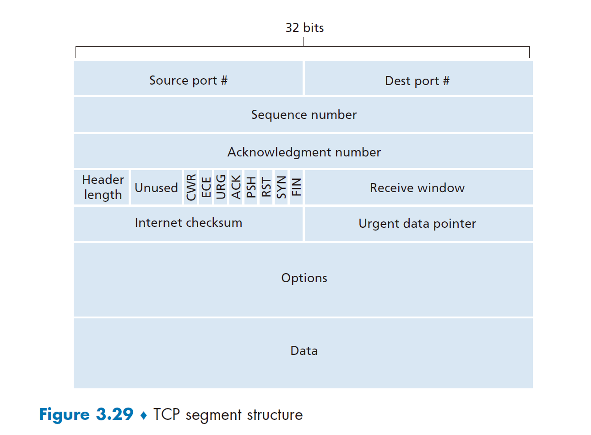
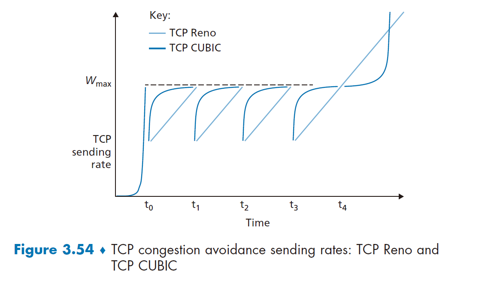
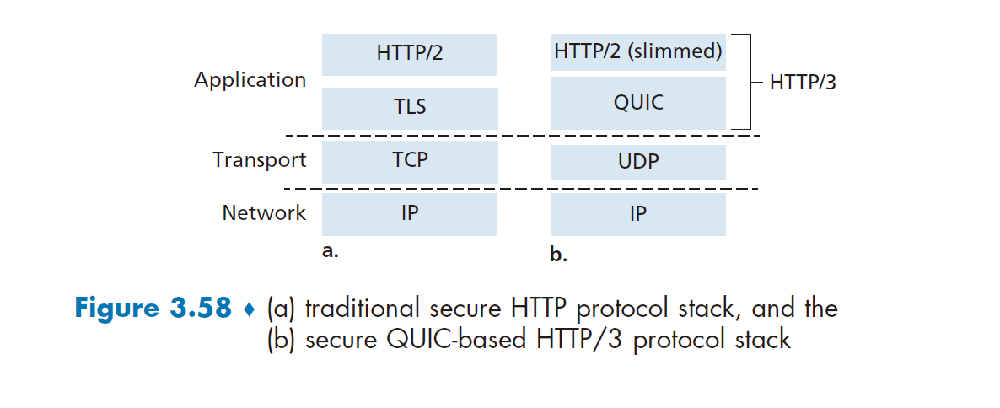
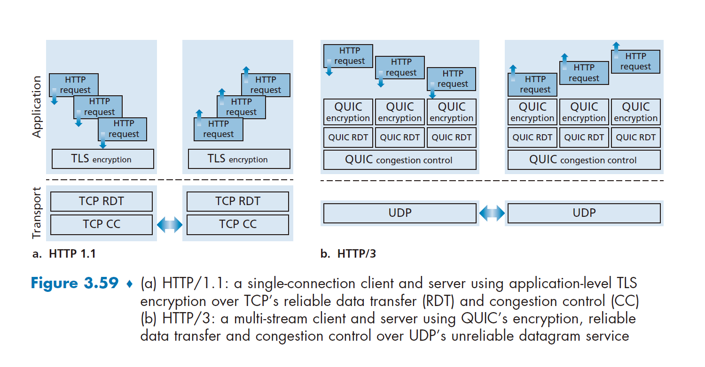
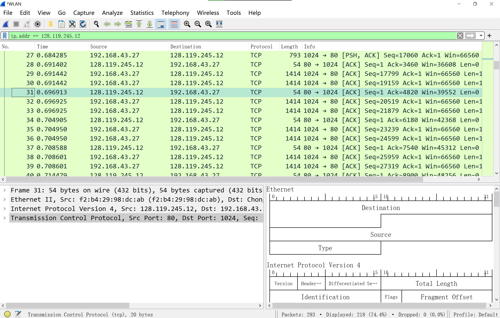
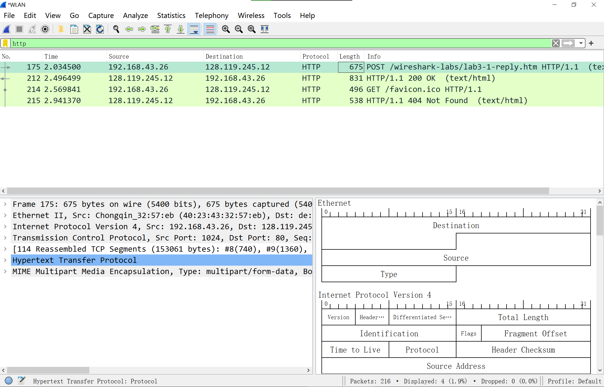
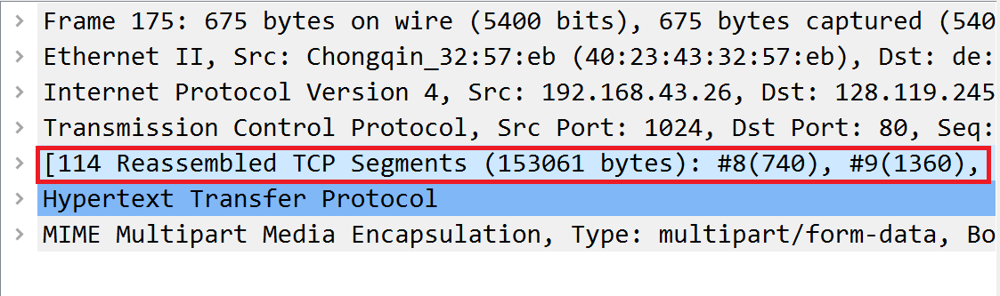
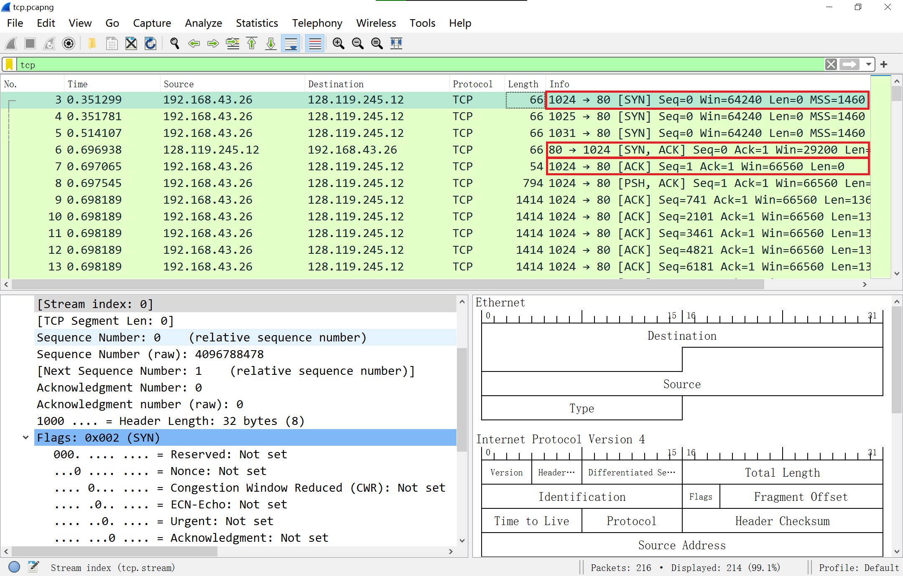
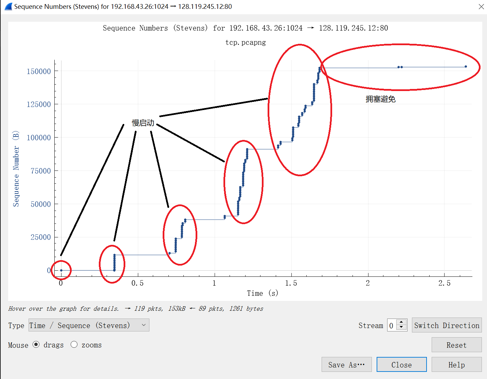

**目录：**

- [3. 运输层](#3-运输层)
  - [3.1. 概述和运输层提供的服务](#31-概述和运输层提供的服务)
    - [3.1.1. 运输层和网络层的关系](#311-运输层和网络层的关系)
    - [3.1.2. Internet 运输层概述](#312-internet-运输层概述)
  - [3.2. 多路复用与多路分解](#32-多路复用与多路分解)
  - [3.3. 无连接运输：UDP](#33-无连接运输udp)
    - [3.3.1. UDP 报文结构](#331-udp-报文结构)
    - [3.3.2. UDP 检验和](#332-udp-检验和)
  - [3.4. 可靠数据传输原理](#34-可靠数据传输原理)
    - [3.4.1. 构造可靠数据传输协议](#341-构造可靠数据传输协议)
    - [3.4.2. 流水线可靠数据传输协议](#342-流水线可靠数据传输协议)
    - [3.4.3. 回退 N 步](#343-回退-n-步)
    - [3.4.4. 选择重传](#344-选择重传)
  - [3.5. 面向连接的运输：TCP](#35-面向连接的运输tcp)
    - [3.5.1. TCP 连接](#351-tcp-连接)
    - [3.5.2. TCP 报文段结构](#352-tcp-报文段结构)
    - [3.5.3. 往返时间的估计与超时](#353-往返时间的估计与超时)
    - [3.5.4. 可靠数据传输](#354-可靠数据传输)
    - [3.5.5. 流量控制](#355-流量控制)
    - [3.5.6. TCP 连接管理](#356-tcp-连接管理)
  - [3.6. 拥塞控制原理](#36-拥塞控制原理)
    - [3.6.1. 拥塞原因与代价](#361-拥塞原因与代价)
    - [3.6.2. 拥塞控制方法](#362-拥塞控制方法)
  - [3.7. TCP 拥塞控制](#37-tcp-拥塞控制)
    - [3.7.1. 经典 TCP 拥塞控制](#371-经典-tcp-拥塞控制)
    - [3.7.2. 网络辅助拥塞控制](#372-网络辅助拥塞控制)
    - [3.7.3. 公平性](#373-公平性)
  - [3.8. 传输层功能的演进](#38-传输层功能的演进)
  - [3.9. 实验 6：用 wireshark 观察 TCP](#39-实验-6用-wireshark-观察-tcp)
    - [3.9.1. 捕获 TCP 分组](#391-捕获-tcp-分组)
    - [3.9.2. 预览一下捕获的分组](#392-预览一下捕获的分组)
    - [3.9.3. TCP 基础](#393-tcp-基础)
    - [3.9.4. TCP 拥塞控制](#394-tcp-拥塞控制)
  - [3.10. 实验 7：用 wireshark 观察 UDP](#310-实验-7用-wireshark-观察-udp)

# 3. 运输层

**time : 2021-05-23**

运输层位于网络层和应用层之间。运输层负责在不同端系统上应用程序进程间的通信。在本章我们深入讨论 TCP 和 UDP 协议。

## 3.1. 概述和运输层提供的服务

在前两章中，我们已经了解过运输层提供的服务，现在回顾一下。

运输层协议为运行在不同主机上的应用进程之间提供 **逻辑通信(logic communication)** 功能。从应用程序的角度看，通过逻辑通信，运行在不同主机上的应用进程好像直接相连一样。实际上，这些主机也许位于地球的两侧，通过很多路由器及多种不同类型的链路相连。应用进程使用运输层提供的逻辑通信功能彼此发送报文，而不必考虑承载这些报文的设施的细节。

如图 3-1 所示，运输层协议是在端系统而不是在路由器中实现的。在发送端，运输层将从发送应用程序进程接收到的报文转换成运输层分组，用 Internet 术语来讲该分组称为运输层 **报文段(segment)** 。实现的方法（可能）是将应用报文划分为较小的块，并为每块加上一个运输层首部以生成运输层报文段。然后，在发送端系统中，运输层将这些报文段传递给网络层，网路层将其封装成网络层分组（即数据报）并向目的地发送。注意到下列事实是重要的：网络路由器仅作用于该数据报的网络层字段；即它们不检查封装在该数据报的运输层报文段的字段。在接收端，网络层从数据报中提取运输层报文段，并将该报文段向上交给运输层。运输层则处理接收到的报文段，使该报文段中的数据为接收应用进程使用。


网络应用程序可以使用多种的运输层协议。例如，Internet 有两种协议，即 TCP 和 UDP。每种协议都能为调用的应用程序提供一组不同的运输层服务。

### 3.1.1. 运输层和网络层的关系

前面讲过，在协议栈中，运输层刚好位于网络层之上。网络层提供了主机之间的逻辑通信，而运输层为运行在不同主机上的进程之间提供了逻辑通信。这种差别虽然细微但很重要。我们用一个家庭类比来帮助分析这种差别。

考虑有两个家庭，一家位于美国东海岸，一家位于美国西海岸，每家有 12 个孩子。 东海岸家庭的孩子们是西海岸家庭孩子们的堂兄弟姐妹。这两个家庭的孩子们喜欢彼此通信，每个人每星期要互相写一封信，每封信都用单独的信封通过传统的邮政服务传送。因此，每个家庭每星期向另一家发送 144 封信。（如果他们有电子邮件的话，这些孩子可以省不少钱！）每一个家庭有个孩子负责收发邮件，西海岸家庭是 Ann 而东海岸家庭是 Bill。 每星期 Ann 去她的所有兄弟姐妹那里收集信件，并将这些信件交到每天到家门口来的邮政服务的邮车上。当信件到达西海岸家庭时，Ann 也负责将信件分发到她的兄弟姐妹手上。 在东海岸家庭中的 Bill 也负责类似的工作。

在这个例子中，邮政服务为两个家庭间提供逻辑通信，邮政服务将信件从一家送往另 一家，而不是从一个人送往另一个人。在另一方面，Ann 和 Bill 为堂兄弟姐妹之间提供了 逻辑通信，Arm 和 Bill 从兄弟姐妹那里收取信件或到兄弟姐妹那里交付信件。注意到从堂 兄弟姐妹们的角度来看，Ann 和 Bill 就是邮件服务，尽管他们只是端到端交付过程的一部分（即端系统部分）。在解释运输层和网络层之间的关系时，这个家庭的例子是一个非常好的类比。

```
应用层报文=信封上的字符
进程 = 堂兄弟姐妹
主机（或端系统）= 家庭
运输层协议 = Ann和Bill
网络层协议 = 邮政服务（包括邮车）
```

我们继续观察这个类比。值得注意的是，Ann 和 Bill 都是在各自家里进行工作的；例如，他们并没有参与任何一个中间邮件中心对邮件进行分拣，或者将邮件从一个邮件中心送到另一个邮件中心之类的工作。类似地，运输层协议只工作在端系统中。在端系统中，运输层协议将来自应用进程的报文移动到网络边缘（即网络层），反过来也是一样，但对有关这些报文在网络核心如何移动并不作任何规定。事实上，如图 3-1 所示，中间路由器既不处理也不识别运输层加在应用层报文的任何信息。

我们还是继续讨论这两家的情况。现在假定 Ann 和 Bill 外出度假，另外一对堂兄妹（如 Susan 和 Harvey）接替他们的工作，在家庭内部进行信件的收集和交付工作。不幸的是，Susan 和 Harvey 的收集和交付工作与 Ann 和 Bill 所做的并不完全一样。由于年龄更小，Susan 和 Harvey 收发邮件的次数更少，而且偶尔还会丢失邮件（有时是被家里的狗咬坏了）。因此，Susan 和 Harvey 这对堂兄妹并没有提供与 Ann 和 Bill 一样的服务集合（即相同的服务模型）。与此类似，计算机网络中可以安排多种运输层协议，每种协议为应用程序提供不同的服务模型。

Ann 和 Bill 所能提供的服务明显受制于邮政服务所能提供的服务。例如，如果邮政服务不能提供在两家之间传递邮件所需时间的最长期限（例如 3 天），那么 Ann 和 Bill 就不可能保证邮件在堂兄弟姐妹之间传递信件的最长期限。与此类似，运输协议能够提供的服务常常受制于底层网络层协议的服务模型。如果网络层协议无法为主机之间发送的运输层报文段提供时延或带宽保证的话，运输层协议也就无法为进程之间发送的应用程序报文提供时延或带宽保证。

然而，即使底层网络协议不能在网络层提供相应的服务，运输层协议也能提供某些服务。例如，如我们将在本章所见，即使底层网络协议是不可靠的，也就是说网络层协议会使分组丢失、篡改和冗余，运输协议也能为应用程序提供可靠的数据传输服务。另一个例子是（我们在第 8 章讨论网络安全时将会研究到），即使网络层不能保证运输层报文段的机密性，运输协议也能使用加密来确保应用程序报文不被入侵者读取。

### 3.1.2. Internet 运输层概述

前面讲过 Internet 为应用层提供了两种截然不同的可用运输层协议。这些协议一种是 UDP（用户数据报协议），它为调用它的应用程序提供了一种不可靠、无连接的服务。另一种是 TCP （传输控制协议），它为调用它的应用程序提供了一种可靠的、面向连接的服务。当设计一个网络应用程序时，该应用程序的开发人员必须指定使用这两种运输协议中的哪一种。如我们在 2-7 节看到的那样，应用程序开发人员在生成套接字时必须指定是选择 UDP 还是选择 TCP。

为了简化术语，我们将运输层分组称为报文段(segment)。然而，Internet 文献(如 RFC 文档)也将 TCP 的运输层分组称为报文段，而常将 UDP 的分组称为数据报(data-gram)。而这类 Internet 文献也将网络层分组称为数据报！本书作为一本计算机网络的入门书籍，我们认为将 TCP 和 UDP 的分组统称为报文段，而将数据报名称保留给网络层分组不容易混淆。

在对 UDP 和 TCP 进行简要介绍之前，简单介绍一下 Internet 的网络层(我们将在第 4 和 5 章中详细地学习网络层)是有用的。Internet 网络层协议有一个名字叫 IP，即网际协议。IP 为主机之间提供了逻辑通信。IP 的服务模型是 **尽力而为交付服务(best-effort delivery service)** 。 这意味着 IP 尽它“最大的努力”在通信的主机之间交付报文段，但它并不做任何确保。特别是，它不确保报文段的交付，不保证报文段的按序交付，不保证报文段中数据的完整性。由于这些原因，IP 被称为 **不可靠服务(unreliable service)**。在此还要指出的是, 每台主机至少有一个网络层地址，即所谓的 IP 地址。我们在第 4 和 5 章将详细讨论 IP 地 址；在这一章中，我们只需要记住每台主机有一个 IP 地址

在对 IP 服务模型有了初步了解后，我们总结一下 UDP 和 TCP 所提供的服务模型。 UDP 和 TCP 最基本的责任是，将两个端系统间 IP 的交付服务扩展为运行在端系统上的两个进程之间的交付服务。将主机间交付扩展到进程间交付被称为 **运输层的多路复用 (transport-layer multiplexing)** 与 **多路分解(demultiplexing)**。 我们将在下一节讨论运输层的多路复用与多路分解。UDP 和 TCP 还可以通过在其报文段首部中包括差错检查字段而提供完整性检查。进程到进程的数据交付和差错检查是两种最低限度的运输层服务，也是 UDP 所能提供的仅有的两种服务。特别是，与 IP 一样，UDP 也是一种不可靠的服务，即不能保证一个进程所发送的数据能够完整无缺地(或全部！)到达目的进程。在 3-3 节中将更详细地讨论 UDP。

另一方面，TCP 为应用程序提供了几种附加服务。首先，它提供 **可靠数据传输(reliable data transfer)**。通过使用流量控制、序号、确认和定时器(本章将详细介绍这些技术)， TCP 确保正确地、按序地将数据从发送进程交付给接收进程。这样，TCP 就将两个端系统间的不可靠 IP 服务转换成了一种进程间的可靠数据传输服务。TCP 还提供 **拥塞控制(congestion control)**。拥塞控制与其说是一种提供给调用它的应用程序的服务，不如说是一种提供给整个 Internet 的服务，这是一种带来通用好处的服务。不太严格地说，TCP 拥塞控制防止任何一条 TCP 连接用过多流量来淹没通信主机之间的链路和交换设备。TCP 力求为每个通过一条拥塞网络链路的连接平等地共享网络链路带宽。这可以通过调节 TCP 连接的发 送端发送进网络的流量速率来做到。在另一方面，UDP 流量是不可调节的。使用 UDP 传输的应用程序可以根据其需要以其愿意的任何速率发送数据。

一个能提供可靠数据传输和拥塞控制的协议必定是复杂的。我们将用几节的篇幅来介 绍可靠数据传输和拥塞控制的原理，用另外几节介绍 TCP 协议本身。3-4 到 3-8 节将研究这些主题。本章采取基本原理和 TCP 协议交替介绍的方法。例如，我们首先在一般环境下讨论可靠数据传输，然后讨论 TCP 是怎样具体提供可靠数据传输的。类似地，先在一般环境下讨论拥塞控制，然后讨论 TCP 是怎样实现拥塞控制的。但在全面介绍这些内容之前, 我们先学习运输层的多路复用与多路分解。

## 3.2. 多路复用与多路分解

在本节中，我们讨论运输层的多路复用与多路分解，也就是将由网络层提供的主机到主机交付服务延伸到为运行在主机上的应用程序提供进程到进程的交付服务。为了使讨论 具体起见，我们将在 Internet 环境中讨论这种基本的运输层服务。然而，需要强调的是，多路复用与多路分解服务是所有计算机网络都需要的。

在目的主机，运输层从紧邻其下的网络层接收报文段。运输层负责将这些报文段中的数据交付给在主机上运行的适当应用程序进程。我们来看一个例子。假定你正坐在计算机前下载 Web 页面，同时还在运行一个 FTP 会话和两个 Telnet 会话。这样你就有 4 个网络应用进程在运行，即两个 Telnet 进程，一个 FTP 进程和一个 HTTP 进程。当你的计算机中的运输层从底层的网络层接收数据时，它需要将所接收到的数据定向到这 4 个进程中的一个。现在我们来研究这是怎样完成的。

首先回想 2-7 节的内容，一个进程(作为网络应用的一部分)有一个或多个套接字 (socket),它相当于从网络向进程传递数据和从进程向网络传递数据的门户。因此，如图 3-2 所示，在接收主机中的运输层实际上并没有直接将数据交付给进程，而是将数据交给了一个中间的套接字。由于在任一时刻，在接收主机上可能有不止一个套接字，所以每个套接字都有唯一的标识符。标识符的格式取决于它是 UDP 还是 TCP 套接字，我们将很快对它们进行讨论。


现在我们考虑接收主机怎样将一个到达的运输层报文段定向到适当的套接字。为此目的，每个运输层报文段中具有几个字段。在接收端，运输层检查这些字段，标识出接收套接字，进而将报文段定向到该套接字。将运输层报文段中的数据交付到正确的套接字的工作称为 **多路分解(demultiplexing)**。在源主机从不同套接字中收集数据块，并为每个数据块封装上首部信息(这将在以后用于分解)从而生成报文段，然后将报文段传递到网络层，所有这些工作称为 **多路复用(multiplexing)**。值得注意的是，图 3-2 中的中间那台主机的运输层必须将从其下的网络层收到的报文段分解后交给其上的 P1 或 P2 进程；这一过程是通过将到达的报文段数据定向到对应进程的套接字来完成的。中间主机中的运输层也必须收集从这些套接字输出的数据，形成运输层报文段，然后将其向下传递给网络层。尽管我们在 Internet 运输层协议的环境下引入了多路复用和多路分解，认识到下列事实是重要的：它们与在某层(在运输层或别处)的单一协议何时被位于接下来的较高层的多个协议使用有关。

为了说明分解的工作过程，再回顾一下前面一节的家庭类比。每一个孩子通过他们的名字来标识。当 Bill 从邮递员处收到一批信件，并通过查看收信人名字而将信件亲手交付给他的兄弟姐妹们时，他执行的就是一个分解操作。当 Ann 从兄弟姐妹们那里收集信件并将它们交给邮递员时，她执行的就是一个多路复用操作。

既然我们理解了运输层多路复用与多路分解的作用，那就再来看看在主机中它们实际是怎样工作的。通过上述讨论，我们知道运输层多路复用要求：1. 套接字有唯一标识符； 2. 每个报文段有特殊字段来指示该报文段所要交付到的套接字。如图 3-3 所示，这些特殊字段是 **源端口号字段(source port number field)** 和 **目的端口号字段(destination port number field)**。 ( UDP 报文段和 TCP ［ 报文段还有其他的一些字段，这些将在本章后继几节中进行讨论。)端口号是一个 16 比特的数，其大小在 0 ~ 65535 之间。0 ~ 1023 范围的端口号称为 **周知端口号(well-known port number)**,是受限制的，这是指它们保留给诸如 HTTP (它使 用端口号 80)和 FTP (它使用端口号 21)之类的周知应用层协议来使用。周知端口的列表在 RFC 1700 中给岀，同时在 http://www.iana.org 有更新文档［RFC 3232］。当我们开发一个新的应用程序时(如在 2-7 节中开发的一个简单应用程序)，必须为其分配一个端口号。


现在应该清楚运输层是怎样能够实现分解服务的了：在主机上的每个套接字能够分配一个端口号，当报文段到达主机时，运输层检査报文段中的目的端口号，并将其定向到相应的套接字。然后报文段中的数据通过套接字进入其所连接的进程。如我们将看到的那样，UDP 大体上是这样做的。然而，也将如我们所见，TCP 中的多路复用与多路分解更为复杂。

1. **无连接的多路复用与多路分解**

2.7.1 节讲过，在主机上运行的 Python 程序使用下面一行代码创建了一个 UDP 套接字：

```py
clientSocket = socket(AF_INET, SOCK_DGRAM)
```

当用这种方式创建一个 UDP 套接字时，运输层自动地为该套接字分配一个端口号。 特别是，运输层从范围 1024-65535 内分配一个端口号，该端口号是当前未被该主机中任何其他 UDP 端口使用的号。另外一种方法是，在创建一个套接字后，我们能够在 Python 程序中增加一行代码，通过套接字 `bind()` 方法为这个 UDP 套接字关联一个特定的端口号 (如 19157)：

```py
clientSocket.bind(('', 19157))
```

如果应用程序开发者所编写的代码实现的是一个“周知协议”的服务器端，那么开发者就必须为其分配一个相应的周知端口号。通常，应用程序的客户端让运输层自动地(并且是透明地)分配端口号，而服务器端则分配一个特定的端口号。

通过为 UDP 套接字分配端口号，我们现在能够精确地描述 UDP 的复用与分解了。假定在主机 A 中的一个进程具有 UDP 端口 19157,它要发送一个应用程序数据块给位于主机 B 中的另一进程，该进程具有 UDP 端口 46428。主机 A 中的运输层创建一个运输层报文段，其中包括应用程序数据、源端口号（19157）、目的端口号（46428）和两个其他值 （将在后面讨论，它对当前的讨论并不重要）。然后，运输层将得到的报文段传递到网络层。网络层将该报文段封装到一个 IP 数据报中，并尽力而为地将报文段交付给接收主机。 如果该报文段到达接收主机 B,接收主机运输层就检查该报文段中的目的端口号（46428） 并将该报文段交付给端口号 46428 所标识的套接字。值得注意的是，主机 B 可能运行多个进程，每个进程都具有其自己的 UDP 套接字和相联系的端口号。当 UDP 报文段从网络到达时，主机 B 通过检查该报文段中的目的端口号，将每个报文段定向（分解）到相应的套接字。

**time : 2021-05-24**

注意到下述事实是重要的：一个 UDP 套接字是由一个二元组全面标识的，该二元组包含一个目的 IP 地址和一个目的端口号。因此如果两个 UDP 报文段有不同的源 IP 地址和/或源端口号，但具有相同的目的 IP 地址和目的端口号，那么这两个报文段将通过相同的目的套接字被定向到相同的目的进程。

你也许现在想知道，源端口号的用途是什么呢？如图 3-4 所示，在 A 到 B 的报文段中, 源端口号用作“返回地址"的一部分，即当 B 需要回发一个报文段给 A 时，B 到 A 的报文段中的目的端口号便从 A 到 B 的报文段中的源端口号中取值。（完整的返回地址是 A 的 IP 地址和源端口号。）举一个例子，回想 2-7 节学习过的那个 UDP 服务器程序。在 UDPServer.py 中，服务器使用 `recvfrom()` 方法从其自客户接收到的报文段中提取出客户端（源）端口号,然后，它将所提取的源端口号作为目的端口号，向客户发送一个新的报文段。


2. **面向连接的多路分解和复用**

为了理解 TCP 多路分解，我们必须更为仔细地研究 TCP 套接字和 TCP 连接创建。TCP 套接字和 UDP 套接字之间的一个细微差别是，TCP 套接字是由一个四元组（源 IP 地址, 源端口号, 目的 IP 地址, 目的端口号）来标识的。因此，当一个 TCP 报文段从网络到达一台主机时，该主机使用全部 4 个值来将报文段定向（分解）到相应的套接字。特别与 UDP 不同的是，两个具有不同源 IP 地址或源端口号的到达 TCP 报文段将被定向到两个不同的套接字，除非 TCP 报文段携带了初始创建连接的请求。为了深入地理解这一点，我们再来重新考虑 2-7-2 节中的 TCP 客户-服务器编程的例子：

- TCP 服务器应用程序有一个“欢迎套接字”，它在 12000 号端口上等待来自 TCP 客户（见图 2-27）的连接建立请求。
- TCP 客户使用下面的代码创建一个套接字并发送一个连接建立请求报文段：

```py
clientSocket = socket(AF_INET, SOCK_STREAM)
clientSocket.connect((serverName, 12000))
```

- 一条连接建立请求只不过是一个目的端口号为 12000, TCP 首部的特定“连接建立位”置位的 TCP 报文段（在 3-5 节进行讨论）。这个报文段也包含一个由客户选择的源端口号。
- 当运行服务器进程的计算机的主机操作系统接收到具有目的端口 12000 的入连接请求报文段后，它就定位服务器进程，该进程正在端口号 12000 等待接受连接。该服务器进程则创建一个新的套接字:

```py
connectionSocket, addr = serversocket.accept()
```

- 该服务器的运输层还注意到连接请求报文段中的下列 4 个值：1.该报文段中的源端口号；2.源主机 IP 地址；3.该报文段中的目的端口号；4.自身的 IP 地址。新创建的连接套接字通过这 4 个值来标识。所有后续到达的报文段，如果它们的源端口号、源主机 IP 地址、目的端口号和目的 IP 地址都与这 4 个值匹配，则被分解到这个套接字。随着 TCP 连接完成，客户和服务器便可相互发送数据了。

服务器主机可以支持很多并行的 TCP 套接字，每个套接字与一个进程相联系，并由其四元组来标识每个套接字。当一个 TCP 报文段到达主机时，所有 4 个字段（源 IP 地址,源端口, 目的 IP 地址, 目的端口）被用来将报文段定向（分解）到相应的套接字。

图 3-5 图示了这种情况，图中主机 C 向服务器 B 发起了两个 HTTP 会话，主机 A 向服务器 B 发起了一个 HTTP 会话。主机 A 与主机 C 及服务器 B 都有自己唯一的 IP 地址，它们分别是 A、C、B。主机 C 为其两个 HTTP 连接分配了两个不同的源端口号（26145 和 7532）。因为主机 A 选择源端口号时与主机 C 互不相干，因此它也可以将源端口号 26145 分配给其 HTTP 连接。但这不是问题，即服务器 B 仍然能够正确地分解这两个具有相同源端口号的连接，因为这两条连接有不同的源 IP 地址。


3. **Web 服务器与 TCP**

在结束这个讨论之前，再多说几句 Web 服务器以及它们如何使用端口号是有益的。考虑一台运行 Web 服务器的主机，例如在端口 80 上运行一个 Apache Web 服务器。当客户 （如浏览器）向该服务器发送报文段时，所有报文段的目的端口都将为 80。特别是，初始连接建立报文段和承载 HTTP 请求的报文段都有 80 的目的端口。如我们刚才描述的那样,该服务器能够根据源 IP 地址和源端口号来区分来自不同客户的报文段。

图 3-5 显示了一台 Web 服务器为每条连接生成一个新进程。如图 3-5 所示，每个这样的进程都有自己的连接套接字，通过这些套接字可以收到 HTTP 请求和发送 HTTP 响应。

然而，我们要提及的是，连接套接字与进程之间并非总是有着一一对应的关系。事实上, 当今的高性能 Web 服务器通常只使用一个进程，但是为每个新的客户连接创建一个具有 新连接套接字的新线程。（线程可被看作是一个轻量级的子进程。）如果做了第 2 章的第一 个编程作业，你所构建的 Web 服务器就是这样工作的。对于这样一台服务器，在任意给 定的时间内都可能有（具有不同标识的）许多连接套接字连接到相同的进程。

如果客户与服务器使用持续 HTTP,则在整条连接持续期间，客户与服务器之间经由同一个服务器套接字交换 HTTP 报文。然而，如果客户与服务器使用非持续 HTTP,则对每一对请求/响应都创建一个新的 TCP 连接并在随后关闭，因此对每一对请求/响应创建一 个新的套接字并在随后关闭。这种套接字的频繁创建和关闭会严重地影响一个繁忙的 Web 服务器的性能（尽管有许多操作系统技巧可用来减轻这个问题的影响）。读者若对与持续和非持续 HTTP 有关的操作系统问题感兴趣的话，可参见［Nielsen 1997, Nahum 2002］。

既然我们已经讨论过了运输层多路复用与多路分解问题，下面我们就继续讨论 Internet 运输层协议之一，即 UDP。在下一节中，我们将看到 UDP 无非就是对网络层协议增加了 一点（多路）复用/（多路）分解服务而已。

## 3.3. 无连接运输：UDP

在本节中，我们要仔细地研究一下 UDP,看它是怎样工作的，能做些什么。我们鼓励你回过来看一下 2-1 节的内容，其中包括了 UDP 服务模型的概述，再看看 2-7-1 节，其中讨论了 UDP 上的套接字编程。

为了激发我们讨论 UDP 的热情，假如你对设计一个不提供不必要服务的最简化的运输层协议感兴趣。你将打算怎样做呢？你也许会首先考虑使用一个无所事事的运输层协议。特别是在发送方一侧，你可能会考虑将来自应用进程的数据直接交给网络层；在接收方一侧，你可能会考虑将从网络层到达的报文直接交给应用进程。而正如我们在前一节所学的，我们必须做一点点事，而不是什么都不做！运输层最低限度必须提供一种复用/分解服务，以便在网络层与正确的应用级进程之间传递数据。

由［RFC 768］定义的 UDP 只是做了运输协议能够做的最少工作。除了复用/分解功能及少量的差错检测外，它几乎没有对 IP 增加别的东西。实际上，如果应用程序开发人员选择 UDP 而不是 TCP,则该应用程序差不多就是直接与 IP 打交道。UDP 从应用进程得到数据，附加上用于多路复用/分解服务的源和目的端口号字段，以及两个其他的小字段, 然后将形成的报文段交给网络层。网络层将该运输层报文段封装到一个 IP 数据报中，然后尽力而为地尝试将此报文段交付给接收主机。如果该报文段到达接收主机，UDP 使用目的端口号将报文段中的数据交付给正确的应用进程。值得注意的是，使用 UDP 时，在发送报文段之前，发送方和接收方的运输层实体之间没有握手。正因为如此，UDP 被称为是无连接的。

DNS 是一个通常使用 UDP 的应用层协议的例子。当一台主机中的 DNS 应用程序想要进行一次查询时，它构造了一个 DNS 查询报文并将其交给 UDP。无须执行任何与运行在 目的端系统中的 UDP 实体之间的握手，主机端的 UDP 为此报文添加首部字段，然后将形成的报文段交给网络层。网络层将此 UDP 报文段封装进一个 IP 数据报中，然后将其发送给一个名字服务器。在查询主机中的 DNS 应用程序则等待对该查询的响应。如果它没有收到响应（可能是由于底层网络丢失了查询或响应），则要么试图向另一个名字服务器发送该査询，要么通知调用的应用程序它不能获得响应。

现在你也许想知道，为什么应用开发人员宁愿在 UDP 之上构建应用，而不选择在 TCP 上构建应用？既然 TCP 提供了可靠数据传输服务，而 UDP 不能提供，那么 TCP 是否总是 首选的呢？答案是否定的，因为有许多应用更适合用 UDP,原因主要以下几点：

- **关于发送什么数据以及何时发送的应用层控制更为精细。**
  采用 UDP 时，只要应用 进程将数据传递给 UDP, UDP 就会将此数据打包进 UDP 报文段并立即将其传递给 网络层。在另一方面，TCP 有一个拥塞控制机制，以便当源和目的主机间的一条 或多条链路变得极度拥塞时来遏制运输层 TCP 发送方。TCP 仍将继续重新发送数 据报文段直到目的主机收到此报文并加以确认，而不管可靠交付需要用多长时间。
  因为实时应用通常要求最小的发送速率，不希望过分地延迟报文段的传送，且能 容忍一些数据丢失，TCP 服务模型并不是特别适合这些应用的需要。如后面所讨 论的，这些应用可以使用 UDP,并作为应用的一部分来实现所需的、超出 UDP 的 不提供不必要的报文段交付服务之外的额外功能。
- **无须连接建立。**
  如我们后面所讨论的，TCP 在开始数据传输之前要经过三次握手。 UDP 却不需要任何准备即可进行数据传输。因此 UDP 不会引入建立连接的时延。 这可能是 DNS 运行在 UDP 之上而不是运行在 TCP 之上的主要原因（如果运行在 TCP 上，则 DNS 会慢得多）。HTTP 使用 TCP 而不是 UDP,因为对于具有文本数据 的 Web 网页来说，可靠性是至关重要的。但是，如我们在 2-2 节中简要讨论的那 样，HTTP 中的 TCP 连接建立时延对于与下载 Web 文档相关的时延来说是一个重要因素。用于谷歌的 Chrome 浏览器中的 QULC 协议（快速 UDP Internet 连接［Iyen-gar 2015］）将 UDP 作为其支撑运输协议并在 UDP 之上的应用层协议中实现可靠性。
- **无连接状态。**
  TCP 需要在端系统中维护连接状态。此连接状态包括接收和发送缓存、 拥塞控制参数以及序号与确认号的参数。我们将在 3- 5 节看到，要实现 TCP 的可靠 数据传输服务并提供拥塞控制，这些状态信息是必要的。另一方面，UDP 不维护连 接状态，也不跟踪这些参数。因此，某些专门用于某种特定应用的服务器当应用程 序运行在 UDP 之上而不是运行在 TCP 上时，一般都能支持更多的活跃客户。
- **分组首部开销小。**
  每个 TCP 报文段都有 20 字节的首部开销，而 UDP 仅有 8 字节的开销。

### 3.3.1. UDP 报文结构

UDP 报文段结构如图 3-7 所示，它由 RFC 768 定义。应用层数据占用 UDP 报文段的数据字段。例如，对于 DNS 应用，数据字段要么包含一个查询报文，要么包含一个响应报文。对于流式音频应用，音频抽样数据填充到数据字段。 UDP 首部只有 4 个字段，每个字段由两个字节组成。如前一节所讨论的，通过端口号可以使目的主机将应用数据交给运 行在目的端系统中的相应进程（即执行分解功能）。长度字段指示了在 UDP 报文段中的字节数（首部加数据）。因为数据字段的长度在一个 UDP 段中不同于在另一个段中，故需要一个明确的长度。接收方使用检验和来检查在该报文段中是否出现了差错。实际上，计算检验和时，除了 UDP 报文段以外还包括了 IP 首部的一些字段。但是我们忽略这些细节，以便能从整体上看问题。下面我们将讨论检验和的计算。在 6-2 节中将描述差错检测的基本原理。长度字段指明了包括首部在内的 UDP 报文段长度（以字节为单位）。


### 3.3.2. UDP 检验和

UDP 检验和提供了差错检测功能。这就是说，检验和用于确定当 UDP 报文段从源到达目的地移动时，其中的比特是否发生了改变（例如，由于链路中的噪声干扰或者存储在路由器中时引入问题）。发送方的 UDP 对报文段中的所有 16 比特字的和进行反码运算, 求和时遇到的任何溢出都被回卷。得到的结果被放在 UDP 报文段中的检验和字段。下面 给出一个计算检验和的简单例子。在 RFC 1071 中可以找到有效实现的细节，还可在 [Stone 1998； Stone 2000]中找到它处理真实数据的性能。举例来说，假定我们有下面 3 个 16 比特的字:

```
0110011001100000
0101010101010101
1000111100001100
```

这些 16 比特字的前两个之和是：

```
0110011001100000
0101010101010101
----------------
1011101110110101
```

再将上面的和与第三个字相加，得出:

```
1011101110110101
1000111100001100
----------------
0100101011000010
```

注意到最后一次加法有溢出，它要被回卷。反码运算就是将所有的 0 换成 1,所有的 1 转换成 0。因此,该和 0100101011000010 的反码运算结果是 1011010100111101，这就变为了检验和。在接收方，全部的 4 个 16 比特字（包括检验和）加在一起。如果该分组中没有引入差错，则显然在接收方处该和将是 llllllllllllllll。如果这些比特之一是 0, 那么我们就知道该分组中已经出现了差错。

你可能想知道为什么 UDP 首先提供了检验和，就像许多链路层协议（包括流行的以太网协议）也提供了差错检测那样。其原因是不能保证源和目的之间的所有链路都提供差 错检测；这就是说，也许这些链路中的一条可能使用没有差错检测的协议。此外，即使报 文段经链路正确地传输，当报文段存储在某台路由器的内存中时，也可能引入比特差错。 在既无法确保逐链路的可靠性，又无法确保内存中的差错检测的情况下，如果端到端数据传输服务要提供差错检测，UDP 就必须在端到端基础上在运输层提供差错检测。这是一个在系统设计中被称颂的端到端原则（end-encl principle）的例子[Saltzer 1984],该原则表 述为因为某种功能（在此时为差错检测）必须基于端到端实现：“与在较高级别提供这些功能的代价相比，在较低级别上设置的功能可能是冗余的或几乎没有价值的。”

因为假定 IP 是可以运行在任何第二层协议之上的，运输层提供差错检测作为一种保险措施是非常有用的。虽然 UDP 提供差错检测，但它对差错恢复无能为力。UDP 的某种实现只是丢弃受损的报文段；其他实现是将受损的报文段交给应用程序并给出警告。

至此结束了关于 UDP 的讨论。我们将很快看到 TCP 为应用提供了可靠数据传输及 UDP 所不能提供的其他服务。TCP 自然要比 UDP 复杂得多。然而，在讨论 TCP 之前，我们后退一步，先来讨论一下可靠数据传输的基本原理是有用的。

## 3.4. 可靠数据传输原理

**time : 2021-05-25**

在本节中，我们在一般场景下考虑可靠数据传输的问题。因为可靠数据传输的实现问题不仅在运输层出现，也会在链路层以及应用层出现，这时讨论它是恰当的。因此，一般性问题对网络来说更为重要。如果的确要将所有网络中最为重要的“前 10 个”问题排名的话，可靠数据传输将是名列榜首的候选者。在下一节中，我们将学习 TCP，尤其要说明 TCP 所采用的许多原理，而这些正是我们打算描述的内容。

图 3-8 说明了我们学习可靠数据传输的框架。为上层实体提供的服务抽象是：数据可以通过一条可靠的信道进行传输。借助于可靠信道，传输数据比特就不会受到损坏（由 0 变为 1,或者相反）或丢失，而且所有数据都是按照其发送顺序进行交付。这恰好就是 TCP 向调用它的 Internet 应用所提供的服务模型。


为方便起见，我们不妨把实现这种可靠数据传输服务的协议叫可靠数据传输协议(reliable data transfer protocol，简称 rdt)。在上图中，我们把网络层提供的数据传输服务看为不可靠的主机到主机信道。

在本节中，我们会应对不可靠底层信道产生的各种问题，如 1. 底层信道传输的比特会损坏；2. 丢包；逐渐打造我们的可靠信道传输协议。

图 3-8b 图示说明了用于数据传输协议的接口。通过调用 `rdt_send()` 函数，上层可以调用数据传输协议的发送方。它将要发送的数据交付给位于接收方的较高层。在接收端，当分组从信道的接收端到达时，将调用 `rdt_rcv()` 。 当 rdt 协议想要向较高层交付数据时，将通过调用`deliver_data()` 来完成。后面，我们将使用术语“分组”而不用运输层的“报文段”。因为本节研讨的理论适用于一般的计算机网络，而不只是用于 Internet 运输层，所以这时采用通用术语“分组”也许更为合适。

在本节中，我们仅考虑单向数据传输(unidirectional data transfer)的情况，即数据传输是从发送端到接收端的。可靠的双向数据传输(bidirectional data transfer)(即全双工数据传输)情况从概念上讲不会更难，但解释起来更为单调乏味。虽然我们只考虑单向数据传输，但我们的协议也需要在发送端和接收端两个方向上传输分组，如图 3-8 所示。我们很快会看到，除了交换含有待传送的数据的分组之外，rdt 的发送端和接收端还需往返交换控制分组。rdt 的发送端和接收端都要通过调用 `udt_send()` 发送分组给对方(其中 udt 表示不可靠数据传输)。

### 3.4.1. 构造可靠数据传输协议

我们先考虑最简单的情况：假设底层信道完全是可靠的。

1. **底层信道完全可靠：rdt 1.0**

我们称该协议为 rdt 1.0。图 3-9 显示了 rdt 1.0 发送方和接收方的有限状态机(Finite-State Machine, FSM)的定义。


图 3-9a 中的 FSM 定义了发送方的操作，图 3-9b 中的 FSM 定义了接收方的操作。注意到下列问题是重要的，发送方和接收方有各自的 FSM。图 3-9 中发送方和接收方的 FSM 每个都只有一个状态。FSM 描述图中的箭头指示了协议从一个状态变迁到另一个状态。(因为图 3-9 中的每个 FSM 都只有一个状态，因此变迁必定是从一个状态返回到自身；我们很快将看到更复杂的状态图。)引起变迁的事件显示在表示变迁的横线上方，事件发生时所采取的动作显示在横线下方。如果对一个事件没有动作,或没有就事件发生而采取了一个动作，我们将在横线上方或下方使用符号 A,以分别明确地表示缺少动作或事件。FSM 的初始状态用虚线表示。尽管图 3-9 中的 FSM 只有一个状态，但马上我们就将看到多状态的 FSM,因此 标识每个 FSM 的初始状态是非常重要的。

rdt 的发送端只通过 `rdt_send(data)` 事件接受来自较高层的数据，产生一个包含该数据的分组(经由`make-pkt(data)` 动作)，并将分组发送到信道中。实际上，`rdt_send(data)` 事件是由较高层应用的过程调用产生的(例如，`rdt_send()` )。

在接收端，rdt 通过 `rdt_rcv(packet)` 事件从底层信道接收一个分组，从分组中取岀数据 (经由 `extract(packet, data)` 动作)，并将数据上传给较高层(通过 `deliver_data(data)` 动作)。 实际上，`rdt_rcv(packet)` 事件是由较低层协议的过程调用产生的(例如，`rdt_rcv()`)。

在这个简单的协议中，一个单元数据与一个分组没差别。而且，所有分组是从发送方流向接收方；有了完全可靠的信道，接收端就不需要提供任何反馈信息给发送方，因为不必担心出现差错！注意到我们也已经假定了接收方接收数据的速率能够与发送方发送数据的速率一样快。因此，接收方没有必要请求发送方慢一点！

2. **应对比特差错问题：rdt 2.0**

在实际中，底层信道在传输的分组比特可能受损。在分组的传输、传播或缓存的过程中，这种比特差错通常会岀现在网络的物理部件中。我们眼下还将继续假定所有发送的分组(虽然有些比特可能受损)将按其发送的顺序被接收。

在研发一种经这种信道进行可靠通信的协议之前，首先考虑一下人们会怎样处理这类情形。考虑一下你自己是怎样通过电话口述一条长报文的。在通常情况下，报文接收者在听到、理解并记下每句话后可能会说“0K”。如果报文接收者听到一句含糊不清的话时,他可能要求你重复那句容易误解的话。这种口述报文协议使用了 **肯定确认(pos1tive acknowledgment)** (“OK”)与 **否定确认(negative acknowledgment)** (“请重复一遍”)。这些控制报文使得接收方可以让发送方知道哪些内容被正确接收，哪些内容接收有误并因此需要重传。在计算机网络环境中，基于这样重传机制的可靠数据传输协议称为 **自动重传请求(Automatic Repeat reQuest, ARQ)** 协议。

重要的是，ARQ 协议中还需要另外三种协议功能来处理存在比特差错的情况：

- **差错检测。**
  首先，需要一种机制以使接收方检测到何时出现了比特差错。前一节讲到，UDP 使用 Internet 检验和字段正是为了这个目的。在第 5 章中，我们将更详细地学习差错检测和纠错技术。这些技术使接收方可以检测并可能纠正分组中的比特差错。此刻，我们只需知道这些技术要求有额外的比特(除了待发送的初始数据比特之外的比特)从发送方发送到接收方；这些比特将被汇集在 rdt 2.0 数据分组的分组检验和字段中。
- **接收方反馈。**
  因为发送方和接收方通常在不同端系统上执行，可能相隔数千英里, 发送方要了解接收方情况(此时为分组是否被正确接收)的唯一途径就是让接收方提供明确的反馈信息给发送方。在口述报文情况下回答的“肯定确认”(ACK)和“否定确认” (NAK)就是这种反馈的例子。类似地，我们的 rdt 2.0 协议将从接收方向发送方回送 ACK 与 NAK 分组。理论上，这些分组只需要一个比特，如用 0 表示 NAK,用 1 表示 ACK。
- **重传。**
  接收方收到有差错的分组时，发送方将重传该分组。

图 3-10 说明了表示 rdt 2.0 的 FSM,该数据传输协议采用了差错检测、肯定确认与否定确认。


rdt 2.0 的发送端有两个状态。在最左边的状态中，发送端协议正等待来自上层传下来的数据。当 `rdt_send(data)` 事件岀现时，发送方将产生一个包含待发送数据的分组(sndpkt),带有检验和(例如，就像在 3-3-2 节讨论的对 UDP 报文段使用的方法)，然后经由 `udt_send(sndpkt)` 操作发送该分组。在最右边的状态中，发送方协议等待来自接收方的 ACK 或 NAK 分组。如果收到一个 ACK 分组(图 3-10 中符号 `rdt_rcv(rcvpkt) && isACK(rcvpkt)` 对应该事件)，则发送方知道最近发送的分组已被正确接收，因此协议返回到等待来自上层的数据的状态。如果收到一个 NAK 分组，该协议重传上一个分组并等待接收方为响应重传分组而回送的 ACK 和 NAK。注意到下列事实很重要：当发送方处于等待 ACK 或 NAK 的状态时，它不能从上层获得更多的数据；这就是说，`rdt_send()` 事件不可能岀现；仅当接收到 ACK 并离开该状态时才能发生这样的事件。因此，发送方将不会发送新数据，除非发送方确信接收方已正确接收当前分组。由于这种行为，rdt 2.0 这样的协议被称为 **停等(stop-and-wait)** 协议。

rdt 2.0 接收方的 FSM 仍然只有单一状态。当分组到达时，接收方要么回答一个 ACK，要么回答一个 NAK，这取决于收到的分组是否受损。在图 3-10 中，符号 `rdt_rcv(rcvpkt) && corrupt(rcvpkt)` 对应于收到一个分组并发现有错的事件。

rdt 2.0 协议看起来似乎可以运行了，但遗憾的是，它存在一个致命的缺陷：我们没有考虑到 ACK 或 NAK 分组受损的情况!（在继续研究之前，你应该考虑怎样解决这个问题）遗憾的是，我们细小的疏忽并非像它看起来那么无关紧要。至少，我们需要在 ACK/NAK 分组中添加检验和比特以检测这样的差错。更难的问题是协议应该怎样纠正 ACK 或 NAK 分组中的差错。这里的难点在于，如果一个 ACK 或 NAK 分组受损，发送方无法知道接收方是否正确接收了上一块发送的数据。

考虑处理受损 ACK 和 NAK 时的 3 种可能性:

- 对于第一种可能性，考虑在口述报文情况下人可能的做法。如果说话者不理解来自接收方回答的“0K”或“请重复一遍”，说话者将可能问“你说什么?”（因此在我们的协议中引入了一种新型发送方到接收方的分组）。接收方则将复述其回答。但是如果说话者的“你说什么？”产生了差错，情况又会怎样呢？接收者不明白那句混淆的话是口述内容的一部分还是一个要求重复上次回答的请求，很可能回一句“你说什么？”。于是，该回答可能含糊不清了。显然，我们走上了一条困难重重之路。
- 第二种可能性是增加足够的检验和比特，使发送方不仅可以检测差错，还可恢复差错。对于会产生差错但不丢失分组的信道，这就可以直接解决问题。
- 第三种可能性是，当发送方收到含糊不清的 ACK 或 NAK 分组时，只需重传当前数据分组即可。然而，这种方法在发送方到接收方的信道中引入了冗余分组（duplicate packet）。冗余分组的根本困难在于接收方不知道它上次所发送的 ACK 或 NAK 是否被发送方正确地收到。因此它无法事先知道接收到的分组是新的还是一次重传!

解决这个新问题的一个简单方法（几乎所有现有的数据传输协议中，包括 TCP，都采用了这种方法）是在数据分组中添加一个新字段，让发送方对其数据分组编号，即将发送数据分组的 **序号(sequence number)** 放在该字段。于是，接收方只需要检查序号即可确定收到的分组是否是一次重传。对于停等协议这种简单情况，1 比特序号就足够了，因为它可让接收方知道发送方是否正在重传前一个发送分组（接收到的分组序号与最近收到的分组序号相同），或是一个新分组（序号变化了，用模 2 运算“向前”移动）。因为目前我们假定信道不丢分组，ACK 和 NAK 分组本身不需要指明它们要确认的分组序号。发送方知道所接收到的 ACK 和 NAK 分组（无论是否是含糊不清的）是为响应其最近发送的数据分组而生成的。

图 3-11 和图 3-12 给出了对 rdt 2.1 的 FSM 描述，这是 rdt 2.0 的修订版。rdt 2.1 的发送方和接收方 FSM 的状态数都是以前的两倍。这是因为协议状态此时必须反映出目前（由发送方）正发送的分组或（在接收方）希望接收的分组的序号是 0 还是 1。值得注意的是，发送或期望接收 0 号分组的状态中的动作与发送或期望接收 1 号分组的状态中的动作是相似的；唯一的不同是序号处理的方法不同。


协议 rdt 2.1 使用了从接收方到发送方的肯定确认和否定确认。当接收到失序的分组时，接收方对所接收的分组发送一个肯定确认。如果收到受损的分组，则接收方将发送一个否定确认。如果不发送 NAK，而是对上次正确接收的分组发送一个 ACK，我们也能实现与 NAK 一样的效果。发送方接收到对同一个分组的两个 ACK（即接收冗余 ACK（duplicate ACK））后，就知道接收方没有正确接收到跟在被确认两次的分组后面的分组。rdt 2.2 是在有比特差错信道上实现的一个无 NAK 的可靠数据传输协议，如图 3-13 和图 3-14 所示。rdt 2.1 和 rdt 2.2 之间的细微变化在于，接收方此时必须包括由一个 ACK 报文所确认的分组序号(这可以通过在接收方 FSM 中，在 `make_pkt()` 中包括参数 ACK 0 或 ACK 1 来实现)，发送方此时必须检查接收到的 ACK 报文中被确认的分组序号(这可通过在发送方 FSM 中，在 `isACK()` 中包括参数 0 或 1 来实现)。


3. **应对丢包问题：rdt 3.0**

**time : 2021-05-31**

现在假定除了比特出错，底层信道还会丢包，这在今天的计算机网络中并不罕见。rdt 3.0 要处理 2 个问题：1. 怎么检测丢包？2. 在丢包时，做什么反应？在 rdt 2.2 中，我们通过重传等技术可以给出第 2 个问题的答案。但第 1 个问题要增加一种新的机制。

假定发送方传输一个数据分组，该分组或者接收方对该分组的 ACK 发生了丢失。在这两种情况下，发送方都收不到应当到来的接收方的响应。如果发送方愿意等待足够长的时间以便确定分组已丢失，则它只需重传该数据分组即可。

但是发送方需要等待多久才能确定丢包呢？很明显发送方至少需要等待这样长的时间：即发送方与接收方之间的一个往返时延（可能会包括在中间路由器的缓冲时延）加上接收方处理一个分组所需的时间。在很多网络中，最坏情况下的最大时延是很难估算的，确定的因素非常少。此外，理想的协议应尽可能快地从丢包中恢复出来；等待一个最坏情况的时延可能意味着要等待一段较长的时间，直到启动差错恢复为止。因此实践中采取的方法是发送方明智地选择一个时间值，以判定可能发生了丢包（尽管不能确保）。如果在这个时间内没有收到 ACK,则重传该分组。注意到如果一个分组经历了一个 特别大的时延，发送方可能会重传该分组，即使该数据分组及其 ACK 都没有丢失。这就在发送方到接收方的信道中引入了冗余数据分组（duplicate data packet）的可能性。幸运的是，rdt 2.2 协议已经有足够的功能（即序号）来处理冗余分组情况。

从发送方的观点来看，重传是一种万能灵药。发送方不知道是一个数据分组丢失，还是一个 ACK 丢失，或者只是该分组或 ACK 过度延时。在所有这些情况下，动作是同样的：重传。为了实现基于时间的重传机制，需要一个 **倒计数定时器(countdown timer)**，在一个给定的时间过期后，可中断发送方。因此，发送方需要能做到：1. 每次发送一个分组（包括第一次分组和重传分组）时，便启动一个定时器。2. 响应定时器中断（采取适当的动作）。3. 终止定时器。

图 3-15 给出了 rdt 3.0 的有限状态机。


作为课后习题，请读者自行提供 rdt 3.0 的接收方有限状态机。

图 3-16 显示了在没有丢包和延迟分组情况下协议运作的情况，以及它是如何处理数据分组丢失的。在图 3-16 中，时间从图的顶部朝底部移动；注意到一个分组的接收时间必定迟于一个分 组的发送时间，这是因为发送时延与传播时延之故。在图 3-16 b 到 d 中，发送方括号部分表明了定时器的设置时刻以及随后的超时。本章后面的习题探讨了该协议几个更细微的方面。因为分组序号在 0 和 1 之间交替，因此 rdt 3.0 有时被称为 **比特交替协议（alternating-bit protocol)**。


现在我们归纳一下数据传输协议的要点。在检验和、序号、定时器、肯定和否定确认分组这些技术中，每种机制都在协议的运行中起到了必不可少的作用。至此，我们得到了一个可靠数据传输协议！

### 3.4.2. 流水线可靠数据传输协议

rdt 3.0 是一个功能正确的协议，但它的性能不是很好。这个问题在于它是一个停等协议。

为了评价该停等行为对性能的影响，可考虑一种具有两台主机的理想化场合，一台主 机位于美国西海岸，另一台位于美国东海岸，如图 3-17 所示。在这两个端系统之间的光速往返传播时延 RTT 大约为 30 毫秒。假定彼此通过一条发送速率 R 为 1 Gbps（每秒 10^9 比特）的信道相连。包括首部字段和数据的分组长 L 为 1000 字节（8000 比特），发送一个分组进入 1 Gbps 链路实际所需时间是：

$$L_{trans} = { L \over R } = { 8000 bit/pkt \over 10^9 bit/s } = 0.008 ms$$


图 3-18a 显示了对于该停等协议，如果发送方在 t = 0 时刻开始发送分组，则在 L/R = 0.008 ms 后，最后 1 比特数据进入了发送端信道。该分组经过 15ms 的穿越国家的旅途后到达接收端，该分组的最后 1 比特在时刻 t = RTT/2 + L/R = 15.008 ms 时到达接收方。为了简化起见，假设 ACK 分组很小（以便我们可以忽略其发送时间），接收方一旦收到一个数据分组的最后 1 比特后立即发送 ACK, ACK 在时刻 t = RTT + L/R= 30. 008 ms 时在发送方出现。此时，发送方可以发送下一个报文。因此，在 30.008 ms 内，发送方的发送只用了 0.008 ms。如果我们定义发送方（或信道）的 **利用率(utilization)** 为：发送方实际忙于将发送比特送进信道的那部分时间与发送时间之比，图 3-18a 中的分析表明了停等协议有着非常低的发送方利用率 $U_{sender}$：

$$U_{sender} = {L/R\over{RTT + L/R}} = {0.008/30.008} = 0.027 \% $$

这就是说，发送方只有万分之 2.7 时间是忙的。从其他角度来看，发送方在 30. 008 ms 内只能发送 1000 字节，有效的吞吐量仅为 267kbps,即使有 1 Gbps 的链路可用也是如此! 想象一个不幸的网络经理购买了一条千兆比容量的链路，但他仅能得到 267kbps 吞吐量的情况！这是一个形象的网络协议限制底层网络硬件所提供的能力的图例。而且，我们还忽略了在发送方和接收方的底层协议处理时间，以及可能岀现在发送方与接收方之间的任何中间路由器上的处理与排队时延。考虑到这些因素，将进一步增加时延，使其性能更糟糕。

这种特殊的性能问题的一个简单解决方法是：不以停等方式运行，允许发送方发送多个分组而无须等待确认，如在图 3-17b 图示的那样。图 3-18b 显示了如果发送方可以在等待确认之前发送 3 个报文，其利用率也基本上提高 3 倍。因为许多从发送方向接收方输送的分组可以被看成是填充到一条流水线中，故这种技术被称为 **流水线(pipelining)**。流水线技术对可靠数据传输协议可带来如下影响：


- 必须增加序号范围，因为每个输送中的分组（不计算重传的）必须有一个唯一的序号，而且也许有多个在输送中的未确认报文。
- 协议的发送方和接收方两端也许不得不缓存多个分组。发送方最低限度应当能缓冲那些已发送但没有确认的分组。如下面讨论的那样，接收方或许也需要缓存那些已正确接收的分组。
- 所需序号范围和对缓冲的要求取决于数据传输协议如何处理丢失、损坏及延时过大的分组。解决流水线的差错恢复有两种基本方法是：**回退 N 步（Go-Back-N,GBN)** 和 **选择重传(Selective Repeat, SR)**。

### 3.4.3. 回退 N 步

**time : 2021-06-01**

在 **回退 N 步(GBN)协议** 中，允许发送方发送多个分组（当由多个分组可用时）而不需等待确认，但它也受限于在流水线中未确认的分组数不能超过某个最大允许数 N。在本节中我们较详细地描述 GBN。


图 3-19 显示了发送方看到的 GBN 协议的序号范围。如果我们将基序号(base)定义为最早未确认分组的序号，将下一个序号(nextseqnum)定义为最小的未使用序号（即下一个待发分组的序号），则可将序号范围分割成 4 段。在［0, base - 1］段内的序号对应于已经发送并被确认的分组。［base, nextseqnum - 1］段内对应已经发送但未被确认的分组。［nextseqnum, base + N - 1］段内的序号能用于那些要被立即发送的分组，如果有数据来自上层的话。最后，大于或等于 base + N 的序号是不能使用的，直到当前流水线中未被确认的分组（特别是序号为 base 的分组）已得到确认为止。

如图 3-19 所提示的那样，那些已被发送但还未被确认的分组的许可序号范围可以被看成是一个在序号范围内长度为 N 的窗口。随着协议的运行，该窗口在序号空间向前滑动。因此，N 常被称为 **窗口长度(window s1ze)**，GBN 协议也常被称为 **滑动窗口协议(sliding-window protocol)**。你也许想知道，我们为什么先要限制这些被发送的、未被确认的分组的数目为 N 呢？为什么不允许这些分组为无限制的数目呢？我们将在 3-5 节看到, 流量控制是对发送方施加限制的原因之一。我们将在 3-7 节学习 TCP 拥塞控制时分析另一个原因。

在实践中，一个分组的序号承载在分组首部的一个固定长度的字段中。如果分组序号字段的比特数是 k 则该序号范围是［0, 2^k-1]。 在一个有限的序号范围内，所有涉及序号的运算必须使用模 2^k 运算。（即序号空间可被看作是一个长度为 2^k 的环，其中序号 2^k-1 紧接着序号 0。）前面讲过，rd$t_3$.0 有一个 1 比特的序号，序号范围是［0, 1］。在本章末的几道习题中探讨了一个有限的序号范围所产生的结果。我们将在 3-5 节看到，TCP 有一个 32 比特的序号字段，其中的 TCP 序号是按字节流中的字节进行计数的，而不是按分组计数。

图 3-20 和图 3-21 给出了一个基于 ACK、无 NAK 的 GBN 协议的发送方和接收方这两端的扩展 FSM 描述。我们称该 FSM 描述为扩展 FSM,是因为我们已经增加了变量（类似于编程语言中的变量）base 和 nextseqnum，还增加了对这些变量的操作以及与这些变量有关的条件动作。注意到该扩展的 FSM 规约现在变得有点像编程语言规约。［Bochman 1984］对 FSM 扩展技术提供了一个很好的综述，也提供了用于定义协议的其他基于编程语言的技术。


GBN 发送方必须响应三种类型的事件：

- **上层的调用**
  当上层调用 `rdt_send()` 时，发送方首先检查发送窗口是否已满，即是否有 N 个已发送但未被确认的分组。如果窗口未满，则产生一个分组并将其发送，并相应地更新变量。如果窗口已满，发送方只需将数据返回给上层，隐式地指示上层该窗口已满。然后上层可能会过一会儿再试。在实际实现中，发送方更可能缓存（并不立刻发送）这些数据，或者使用同步机制（如一个信号量或标志）允许上层在仅当窗口不满时才调用 `rdt_send()`。
- **收到一个 ACK**
  在 GBN 协议中，对序号为几的分组的确认采取 **累积确认(cumulative acknowledgment)** 的方式，表明接收方已正确接收到序号为 n 的以前且包括 n 在内的所有分组。稍后讨论 GBN 接收方一端时，我们将再次研究这个主题。
- **超时事件**
  协议的名字“回退 N 步”来源于出现丢失和时延过长分组时发送方的行为。就像在停等协议中那样，定时器将再次用于恢复数据或确认分组的丢失。
  如果出现超时，发送方重传所有已发送但还未被确认过的分组。图 3-20 中的发送方仅使用一个定时器，它可被当作是最早的已发送但未被确认的分组所使用的定时器。如果收到一个 ACK，但仍有已发送但未被确认的分组，则定时器被重新启动。如果没有已发送但未被确认的分组，停止该定时器。

在 GBN 中，接收方的动作也很简单。如果一个序号为〃的分组被正确接收到，并且 按序（即上次交付给上层的数据是序号为 n-1 的分组），则接收方为分组 n 发送一个 ACK,并将该分组中的数据部分交付到上层。在所有其他情况下，接收方丢弃该分组，并 为最近按序接收的分组重新发送 ACK。注意到因为一次交付给上层一个分组，如果分组 k 已接收并交付，则所有序号比 k 小的分组也已经交付。因此，使用累积确认是 GBN—个自然的选择。

在 GBN 协议中，接收方丢弃所有失序分组。尽管丢弃一个正确接收（但失序）的分组有点愚蠢和浪费，但这样做是有理由的。前面讲过，接收方必须按序将数据交付给上层。假定现在期望接收分组 n 而分组 n + 1 却到了。因为数据必须按序交付，接收方可能缓存（保存）分组 n + 1,然后，在它收到并交付分组 n 后，再将该分组交付到上层。然而，如果分组 n 丢失，则该分组及分组 n + 1 最终将在发送方根据 GBN 重传规则而被重传。因此，接收方只需丢弃分组 n + 1 即可。不需要缓存任何失序分组。因此，虽然发送方必须维护窗口的上下边界及 nextseqnum 在该窗口中的位置，但是接收方需要维护的唯一信息就是下一个按序接收的分组的序号。该值保存在 expectedseqnum 变量中，如图 3-21 中接收方 FSM 所示。当然，丢弃一个正确接收的分组的缺点是随后对该分组的重传也 许会丢失或出错，因此甚至需要更多的重传。

图 3-22 给岀了窗口长度为 4 个分组 的 GBN 协议的运行情况。因为该窗口 长度的限制亍发送方发送分组 0~3,然 后在继续发送之前，必须等待直到一个 或多个分组被确认。当接收到每一个连 续的 ACK （例如 ACK 0 和 ACK 1）时, 该窗口便向前滑动，发送方便可以发送 新的分组（分别是分组 4 和分组 5）。在接收方，分组 2 丢失，因此分组 3、4 和 5 被发现是失序分组并被丢弃。


在结束对 GBN 的讨论之前，需要提请注意的是，在协议栈中实现该协议可能与图 3-20 中的扩展 FSM 有相似的这种方法的优点是接收缓存简单，即接收方结构。该实现也可能是以各种过程形式出现，每个过程实现了在响应各种可能岀现的事件时要采取的动作。在这种 **基于事件的编程(event-based programming)** 方式中，这些过程要么被协议栈中的其他过程调用，要么作为一次中断的结果。在发送方，这些事件包括: 1. 来自上层实体的调用去调用 `rdt_send()`；2. 定时器中断；3. 报文到达时，来自下层的调用去调用 `rdt_rcv()`。本章后面的编程作业会使你有机会在一个模拟网络环境中实际实现这些例程，但该环境却是真实的。

这里我们注意到，GBN 协议中综合了我们将在 3-5 节中学习 TCP 可靠数据传输协议时遇到的所有技术。这些技术包括使用序号、累积确认、检验和以及超时/重传操作。

### 3.4.4. 选择重传

在图 3-17 中，GBN 协议潜在地允许发送方用多个分组“填充流水线”，因此避免了停等协议中所提到的信道利用率问题。然而，GBN 本身也有一些情况存在着性能问题。尤其是当窗口长度和带宽时延积都很大时，在流水线中会有很多分组更是如此。单个分组的差 错就能够引起 GBN 重传大量分组，许多分组根本没有必要重传。随着信道差错率的增加, 流水线可能会被这些不必要重传的分组所充斥。想象一下，在我们口述消息的例子中，如果每次有一个单词含糊不清，其前后 1000 个单词（例如，窗口长度为 1000 个单词）不得不被重传的情况。此次口述会由于这些反复述说的单词而变慢。

顾名思义，选择重传（SR）协议通过让发送方仅重传那些它怀疑在接收方出错（即丢失或受损）的分组而避免了不必要的重传。这种个别的、按需的重传要求接收方逐个地确认正确接收的分组。再次用窗口长度 N 来限制流水线中未完成、未被确认的分组数。然而，与 GBN 不同的是，发送方已经收到了对窗口中某些分组的 ACK。图 3-23 显示了 SR 发送方看到的序号空间。图 3-24 详细描述了 SR 发送方所采取的动作。


SR 接收方将确认一个正确接收的分组而不管其是否按序。失序的分组将被缓存直到 所有丢失分组（即序号更小的分组）皆被收到为止，这时才可以将一批分组按序交付给上 层。图 3-25 详细列出了 SR 接收方所采用的各种动作。图 3-26 给出了一个例子以说明出现丢包时 SR 的操作。值得注意的是，在图 3-26 中接收方初始时缓存了分组 3、4、5,并在最终收到分组 2 时.才将它们一并交付给上层。

注意到图 3-25 中的第二步很重要，接收方重新确认（而不是忽略）已收到过的那些 序号小于当前窗口基序号的分组。你应该理解这种重新确认确实是需要的。例如，给定在 图 3-23 中所示的发送方和接收方的序号空间，如果分组 send.base 的 ACK 没有从接收方传 播回发送方，则发送方最终将重传分组 send_base,即使显然（对我们而不是对发送方来说!）接收方已经收到了该分组。如果接收方不确认该分组，则发送方窗口将永远不能向 前滑动！这个例子说明了 SR 协议（和很多其他协议一样）的一个重要方面。对于哪些分组已经被正确接收，哪些没有，发送方和接收方并不总是能看到相同的结果。对 SR 协议 而言，这就意味着发送方和接收方的窗口并不总是一致。


当我们面对有限序号范围的现实时，发送方和接收方窗口间缺乏同步会产生严重的后果。考虑下面例子中可能发生的情况，该例有包括 4 个分组序号 0、1、2、3 的有限序号 范围且窗口长度为 3。假定发送了分组 0 至 2,并在接收方被正确接收且确认了。此时, 接收方窗口落在第 4、5、6 个分组上，其序号分别为 3、0、1。现在考虑两种情况。在第 一种情况下，如图 3-27a 所示，对前 3 个分组的 ACK 丢失，因此发送方重传这些分组。因此，接收方下一步要接收序号为 0 的分组，即第一个发送分组的副本。

在第二种情况下，如图 3-27b 所示，对前 3 个分组的 ACK 都被正确交付。因此发送方 向前移动窗口并发送第 4、5、6 个分组，其序号分别为 3、0、10 序号为 3 的分组丢失， 但序号为 0 的分组到达（一个包含新数据的分组）。

现在考虑一下图 3-27 中接收方的观点，在发送方和接收方之间有一个假想的帘子, 因为接收方不能“看见”发送方采取的动作。接收方所能观察到的是它从信道中收到的以 及它向信道中发出报文序列。就其所关注的而言，图 3-27 中的两种情况是等同的。没有 办法区分是第 1 个分组的重传还是第 5 个分组的初次传输。显然，窗口长度比序号空间小 1 时协议无法工作。但窗口必须多小呢？本章后面的一道习题请你说明为何对于 SR 协议 而言，窗口长度必须小于或等于序号空间大小的一半。


至此我们结束了对可靠数据传输协议的讨论。我们已涵盖许多基础知识，并介绍了多种机制，这些机制可一起提供可靠数据传输。下面这张表总结这些机制。既然我们已经学习了所有这些运行中的机制，并能看到“全景”，我们建议你再复习一遍本节内容，看看这些机制是怎样逐步被添加进来，以涵盖复杂性渐增的（现实的）连接发送方与接收方的各种信道模型的，或者如何改善协议性能的。


我们通过考虑在底层信道模型中的一个遗留假设来结束对可靠数据传输协议的讨论。前面讲过，我们曾假定分组在发送方与接收方之间的信道中不能被重新排序。这在发送方与接收方由单段物理线路相连的情况下，通常是一个合理的假设。然而，当连接两端的 “信道”是一个网络时，分组重新排序是可能会发生的。分组重新排序的一个表现就是, 一个具有序号或确认号 x 的分组的旧副本可能会出现，即使发送方或接收方的窗口中都没有包含 x。对于分组重新排序，信道可被看成基本上是在缓存分组，并在将来任意时刻自然地释放岀这些分组。由于序号可以被重新使用，那么必须小心，以免出现这样的冗余分组。实际应用中采用的方法是，确保一个序号不被重新使用，直到发送方“确信”任何先前发送的序号为 x 的分组都不再在网络中为止。通过假定一个分组在网络中的“存活”时间不会超过某个固定最大时间量来做到这一点。在高速网络的 TCP 扩展中，最长的分组寿命被假定为大约 3 分钟[RFC 1323]。 [Sunshine 1978]描述了一种使用序号的方法，它能够完全避免重新排序问题。

## 3.5. 面向连接的运输：TCP

我们在上一节已经学习了可靠数据传输原理，现在就可以来学习 TCP 了。TCP 是 Internet 运输层的可靠运输协议。我们将在本节看到 TCP 使用了很多可靠数据传输原理，包括差错检测，重传，累计确认，定时器，以及确认号和序号。TCP 定义在 RFC 793、RFC 1122、RFC 1323、RFC 2018 以及 RFC 2581 中。

### 3.5.1. TCP 连接

TCP 被称为是 **面向连接的(connection-oriented)**，这是因为在一个应用进程可以开始向另一个应用进程发送数据之前，这两个进程必须先相互“握手”，即它们必须相互发送某些预备报文段，以建立确保数据传输的参数。作为 TCP 连接建立的一部分，连接的双方都将初始化与 TCP 连接相关的许多 TCP 状态变量（其中的许多状态变量将在本节和 3-7 节中讨论）。

这种 TCP “连接”不是一条像在电路交换网络中的端到端 TDM 或 FDM 电路。相反, 该“连接”是一条逻辑连接，其共同状态仅保留在两个通信端系统的 TCP 程序中。前面讲过，由于 TCP 协议只在端系统中运行，而不在中间的网络设备（路由器和链路层交换机）中运行，所以中间的网络设备不会维持 TCP 连接状态。事实上，中间设备不关注 TCP 连接，他们看到的是数据报。

一台主机上的 A 进程于另一台主机上的进程 B 存在一条 TCP 连接，那么应用层数据就可在从进程 B 流向进程 A 的同时，也从进程 A 流向进程 B。TCP 连接也总是点对点（point-to-point）的，即在单个发送方与单个接收方之间的连接。

我们现在来看看 TCP 连接是怎样建立的。假设运行在某台主机上的一个进程想与另一台主机上的一个进程建立一条连接。前面讲过，发起连接的这个进程被称为客户进程，而另一个进程被称为服务器进程。该客户应用进程首先要通知客户运输层，它想与服务器上的一个进程建立一条连接。2-7-2 节讲过，一个 Python 客户程序通过发出下面的命令来实现此目的。

```py
clientSocket.connect((serverName,serverPort))
```

其中 serverName 是服务器的名字，serverPort 标识了服务器上的进程。客户上的 TCP 便开始与服务器上的 TCP 建立一条 TCP 连接。我们将在本节后面更为详细地讨论连接建 立的过程。现在知道下列事实就可以了 ：客户首先发送一个特殊的 TCP 报文段，服务器用 另一个特殊的 TCP 报文段来响应，最后，客户再用第三个特殊报文段作为响应。前两个报文段不承载“有效载荷”，也就是不包含应用层数据；而第三个报文段可以承载应用层数据。由于在这两台主机之间发送了 3 个报文段，所以这种连接建立过程常被称为 **三次握手(three-way handshake)**。

一旦建立起一条 TCP 连接，两个应用进程之间就可以相互发送数据了。我们考虑一下从客户进程向服务器进程发送数据的情况。如 2-7 节中所述，客户进程通过套接字（该进程之门）传递数据流。数据一旦通过该门，它就由客户中运行的 TCP 控制了。如图 3-28 所示，TCP 将这些数据引导到该连接的 **发送缓存(send buffer)** 里，发送缓存是发起三次握手期间设置的缓存之一。接下来 TCP 就会不时从发送缓存里取出一块数据，并将数据传递到网络层。TCP 可从缓存中取出并放入报文段中的数据数量受限于 **最大报文段长度(Maximum Segment S1ze, MSS）**。 MSS 通常根据最初确定的由本地发送主机发送的最大链路层帧长度（即所谓的 **最大传输单元(Maximum Transmiss1on Unit, MTU)**）来设置。设置该 MSS 要保证一个 TCP 报文段（当封装在一个 IP 数据报中）加上 TCP/IP 首部长度（通常 40 字节）将适合单个链路层帧。以太网和 PPP 链路层协议都具有 1500 字节的 MTU，因此 MSS 的典型值为 1460 字节。已经提出了多种发现路径 MTU 的方法，并基于路径 MTU 值设置 MSS （路径 MTU 是指能在从源到目的地的所有链路上发送的最大链路层帧［RFC 1191］）。注意到 MSS 是指在报文段里应用层数据的最大长度，而不是指包括首部的 TCP 报文段的最大长度。（该术语很容易混淆，但是我们不得不采用它，因为它已经根深蒂固了。）

TCP 为每块客户数据配上一个 TCP 首部，从而形成多个 **TCP 报文段(TCP segment)**。 这些报文段被下传给网络层，网络层将其分别封装在网络层 IP 数据报中。然后这些 IP 数据报被发送到网络中。当 TCP 在另一端接收到一个报文段后，该报文段的数据就被放入该 TCP 连接的接收缓存中，如图 3-28 中所示。应用程序从此缓存中读取数据流。该连接的每一端都有各自的发送缓存和接收缓存。


从以上讨论中我们可以看出，TCP 连接的组成包括：一台主机上的缓存、变量和与进程连接的套接字，以及另一台主机上的另一组缓存、变量和与进程连接的套接字。如前面讲过的那样，在这两台主机之间的网络设备(路由器，交换机和中继器)中没有为该连接分配任何缓存和变量。

### 3.5.2. TCP 报文段结构

简要地了解了 TCP 连接后，我们研究一下 TCP 报文段结构。TCP 报文段由首部字段和一个数据字段组成。数据字段包含一块应用数据。如前所述，MSS 限制了报文段数据字段的最大长度。当 TCP 发送一个大文件，例如某 Web 页面上的一个图像时，TCP 通常是将该文件划分成长度为 MSS 的若干块(最后一块除外，它通常小于 MSS)。然而，交互式应用通常传送长度小于 MSS 的数据块。例如，对于像 Telnet 这样的远程登录应用，其中 TCP 报文段的数据字段经常只有一个字节。由于 TCP 的首部一般是 20 字节(比 UDP 首部多 12 字节)，所以 Telnet 发送的报文段也许只有 21 字节长。



图 3-29 显示了 TCP 报文段的结构。与 UDP 一样，首部包括 **源端口号** 和 **目的端口号**，它被用于多路复用/分解来自或送到上层应用的数据。另外，同 UDP 一样，TCP 首部也包括 **检验和字段(checksum field)**。TCP 报文段首部还包含下列字段:

- 32 比特的 **序号字段(sequence number field)** 和 32 比特的 **确认号字段(acknowledgment number field)**。这些字段被 TCP 发送方和接收方用来实现可靠数据传输服务，讨论见后。
- 16 比特的 **接收窗口字段(receive window field)**，该字段用于流量控制。我们很快就会看到，该字段用于指示接收方愿意接受的字节数量。
- 4 比特的 **首部长度字段(header length field)**，该字段指示了以 32 比特的字为单位的 TCP 首部长度。由于 TCP 选项字段的原因，TCP 首部的长度是可变的。(通常，选项字段为空，所以 TCP 首部的典型长度是 20 字节。)
- 可选与变长的 **选项字段(options field)**，该字段用于发送方与接收方协商最大报文段长度(MSS)时，或在高速网络环境下用作窗口调节因子时使用。首部字段中还定义了一个时间戳选项。可参见 RFC 854 和 RFC 1323 了解其他细节。
- 8 比特的 **标志字段(flag field)**。ACK 比特用于指示确认字段中的值是有效的，即该报文段包括一个对已被成功接收报文段的确认。RST，SYN 和 FIN 比特用于连接建立和拆除，我们将在本节后面讨论该问题。在明确拥塞通告中使用了 CWR 和 ECE 比特，如 3-7-2 节中讨论的那样。当 PSH 比特被置位时，就指示接收方应立即将数据交给上层。最后，URG 比特用来指示报文段里存在着被发送端的上层实体置为“紧急”的数据。紧急数据的最后一个字节由 16 比特的 **紧急数据指针字段(urgent data pointer field)** 指出。当紧急数据存在并给出指向紧急数据尾指针的时候，TCP 必须通知接收端的上层实体。

1. **序号与确认号**

TCP 报文段首部中两个最重要的字段是序号字段和确认号字段。这两个字段是 TCP 可靠传输服务的关键部分。但是在讨论这两个字段是如何用于提供可靠数据传输之前，我们首先来解释一下 TCP 在这两个字段中究竟放置了什么。

TCP 把数据看成一个无结构的、有序的字节流。我们从 TCP 对序号的使用上可以看出这一点，因为序号是建立在传送的字节流之上，而不是建立在传送的报文段的序列之上。一个 **报文段的序号(sequence number for a segment)** 因此是该报文段首字节的字节流编号。 举例来说，假设主机 A 上的一个进程想通过一条 TCP 连接向主机 B 上的一个进程发送一个数据流。主机 A 中的 TCP 将隐式地对数据流中的每一个字节编号。假定数据流由一个包含 500000 字节的文件组成，其 MSS 为 1000 字节，数据流的首字节编号是 0。如图 3-30 所示，该 TCP 将为该数据流构建 500 个报文段。给第一个报文段分配序号 0，第二个报文段分配序号 1000，第三个报文段分配序号 2000，以此类推。每一个序号被填入到相应 TCP 报文段首部的序号字段中。


现在我们考虑一下确认号。确认号要比序号难处理一些。前面讲过，TCP 是全双工的，因此主机 A 在向主机 B 发送数据的同时，也许也接收来自主机 B 的数据(都是同一条 TCP 连接的一部分)。从主机 B 到达的每个报文段中都有一个序号用于从 B 流向 A 的数据。主机 A 填充进报文段的确认号是主机 A 期望从主机 B 收到的下一字节的序号。看一些例子有助于理解实际发生的事情。假设主机 A 已收到了来自主机 B 的编号为 0 ~535 的所有字节，同时假设它打算发送一个报文段给主机 B。主机 A 等待主机 B 的数据流中字节 536 及之后的所有字节。所以主机 A 就会在它发往主机 B 的报文段的确认号字段中填上 536。

再举一个例子，假设主机 A 已收到一个来自主机 B 的包含字节 0 ~535 的报文段，以及另一个包含字节 900〜1000 的报文段。由于某种原因，主机 A 还没有收到字节 536 - 899 的报文段。在这个例子中，主机 A 为了重新构建主机 B 的数据流，仍在等待字节 536 （和其后的字 节）。因此，A 到 B 的下一个报文段将在确认号字段中包含 536。因为 TCP 只确认该流中至第一个丢失字节为止的字节，所以 TCP 被称为提供 **累积确认(cumulative acknowledgment)**。

最后一个例子也会引发一个重要而微妙的问题。主机 A 在收到第二个报文段（字节 536 ~ 899）之前收到第三个报文段（字节 900 ~ 1000）。因此，第三个报文段失序到达。该微妙的问题是：当主机在一条 TCP 连接中收到失序报文段时该怎么办？有趣的是，TCP RFC 并没有为此明确规定任何规则，而是把这一问题留给实现 TCP 的编程人员去处理。他们有两个基本的选择：1. 接收方立即丢弃失序报文段（如前所述，这可以简化接收方的设计）；2. 接收方保留失序的字节，并等待缺少的字节以填补该间隔。显然，后一种选择对网络带宽而言更为有效，是实践中采用的方法。

在图 3-30 中，我们假设初始序号为 0。事实上，一条 TCP 连接的双方均可随机地选择初始序号。这样做可以减少将那些仍在网络中存在的来自两台主机之间先前已终止的连接的报文段，误认为是后来这两台主机之间新建连接所产生的有效报文段的可能性（它碰巧与旧连接使用了相同的端口号）［Sunshine 1978］。

**time : 2021-06-07**

2. **Telent：序号与确认号的一个学习案例**

Telnet 由 RFC 854 定义，它现在是一个用于远程登录的流行应用层协议。它运行在 TCP 之上，被设计成可在任意一对主机之间工作。Telnet 与微妙第 2 章讨论的批量数据传输应用不同，它是一个交互式应用。微妙现在讨论一个 Telnet 例子，因为该例子很好地阐述了 TCP 的序号和确认号。微妙注意到许多用户现在更愿意采用 SSH 协议而不是 Telnet，因为在 Telnet 连接中发送的数据（包括口令）是没有加密的，这使得 Telnet 易于受到窃听攻击（8-7 节会详细讨论）。

假设一个主机 A 发起一个与主机 B 的 Telnet 会话。因为是主机 A 发起该会话，因此它被标记为客户，而主机 B 被标记为服务器。在客户端用户键入的每个字符都会被发送给远程主机。远程主机将回送每个字符的副本给客户，并将这些字符显示在 Telnet 用户的屏幕上。这种回显用于确保由 Telnet 用户发送的字符已经被远程主机收到并在远程主机上得到处理。因此，在从用户键入字符到字符被显示在用户屏幕上的这段时间内，每个字符被传输了两次。

现在假设用户输入了一个字符 'C'，然后喝起了咖啡。我们考察一下在客户与服务器之间发送的 TCP 报文段。如图 3-31 所示，假设客户和服务器的起始序号分别是 42 和 79。前面讲过，一个报文段的序号就是该报文段数据字段首字节的序号。因此，客户发送的第一个报文段的序号为 42，服务器发送的第一个报文段的序号为 79。前面讲过，确认号就是主机正在等待的数据的下一个字节序号。在 TCP 连接建立后但没有发送任何数据之前，该客户等待字节 79，而该服务器等待字节 42。

如图 3-31 中所示，共发送 3 个报文段。第一个报文段是由客户发往服务器，在它的数据字段里包含一字节的字符 'C' 的 ASCII 码。如我们刚讲到的那样，第一个报文段的序号字段里是 42。另外，由于客户还没有接收到来自服务器的任何数据，因此该第一个报文段中的确认号字段中是 79。

第二个报文段是由服务器发往客户。它有两个目的：首先它是为该服务器所收到数据提供一个确认。通过在确认号字段中填入 43，服务器告诉客户它已经成功地收到字节 42 及以前的所有字节，现在正等待着字节 43 的出现。该报文段的第二个目的是回显字符'C'。因此，在第二个报文段的数据字段里填入的是字符 'C' 的 ASCII 码。第二个报文段的序号为 79，它是该 TCP 连接上从服务器到客户的数据流的起始序号，这也正是服务器要发送的第一个字节的数据。值得注意的是，对客户到服务器的数据的确认被装载在一个承载服务器到客户的数据的报文段中；这种确认被称为是被 **捎带(piggybacked)** 在服务器到客户的数据报文段中的。

第三个报文段是从客户发往服务器的。它的唯一目的是确认已从服务器收到的数据。（前面讲过，第二个报文段中包含的数据是字符是从服务器到客户的。）该报文段的数据字段为空（即确认信息没有被任何从客户到服务器的数据所捎带）。该报文段的确认号字段填入的是 80，因为客户已经收到了字节流中序号为 79 及以前的字节，它现在正等待着字节 80 的出现。你可能认为这有点奇怪，即使该报文段里没有数据还仍有序号。这是因为 TCP 存在序号字段，报文段需要填入某个序号。

### 3.5.3. 往返时间的估计与超时

TCP 如同前面 3.4 节所讲的 rdt 协议一样，它采用超时/重传机制来处理报文段的丢失问 题。尽管这在概念上简单，但是当在如 TCP 这样的实际协议中实现超时/重传机制时还是会 产生许多微妙的问题。也许最明显的一个问题就是超时间隔长度的设置。显然，超时间隔必须大于该连接的往返时间（RTT），即从一个报文段发出到它被确认的时间。否则会造成不必要的重传。但是这个时间间隔到底应该是多大呢？刚开始时应如何估计往返时间呢？是否应该为所有未确认的报文段各设一个定时器？问题竟然如此之多！我们在本节中的讨论基于 [Jacobson 1988]中有关 TCP 的工作以及 IETF 关于管理 TCP 定时器的建议[RFC 6298]。

1. **估计往返时间**

我们开始学习 TCP 定时器的管理问题，要考虑一下 TCP 是如何估计发送方与接收方 之间往返时间的。这是通过如下方法完成的。报文段的样本 RTT （表示为 SampleRTT）就是从某报文段被发出（即交给 IP）到对该报文段的确认被收到之间的时间量。大多数 TCP 的实现仅在某个时刻做一次 SampleRTT 测量，而不是为每个发送的报文段测量一个 SampleRTT。这就是说，在任意时刻，仅为一个已发送的但目前尚未被确认的报文段估计 SampleRTT，从而产生一个接近每个 RTT 的新 SampleRTT 值。另外，TCP 决不为已被重传的报 文段计算 SampleRTT；它仅为传输一次的报文段测量 SampleRTT [Kan 1987]。

显然，由于路由器的拥塞和端系统负载的变化，这些报文段的 SampleRTT 值会随之波动。由于这种波动，任何给定的 SampleRTT 值也许都是非典型的。因此，为了估计一个典型的 RTT,自然要采取某种对 SampleRTT 取平均的办法。TCP 维持一个 SampleRTT 均值（称为 EstimatedRTT）。一旦获得一个新 SampleRTT 时，TCP 就会根据下列公式来更新 EstimatedRTT:

$$EstimatedRTT = (1-a)EstimatedRTT + a \cdot SampleRTT$$

上面的公式是以编程语言的语句方式给出的，即 EstimatedRTT 的新值是由以前的 EstimatedRTT 值与 SampleRTT 新值加权组合而成的。在［RFC 6298 ］中给岀的 a 推荐值是 a =0.125 （即 1/8），这时上面的公式变为：

$$EstimatedRTT = 0.875 \cdot EstimatedRTT + 0. 125 \cdot SampleRTT$$

值得注意的是，EstimatedRTT 是一个 SampleRTT 值的加权平均值。如在本章后面习题中讨论的那样，这个加权平均对最近的样本赋予的权值要大于对旧样本赋予的权值。这是很自然的，因为越近的样本越能更好地反映网络的当前拥塞情况。从统计学观点讲，这种平均被称为 **指数加权移动平均(Exponential Weighted Moving Average, EWMA)**。在 EWMA 中的“指数”一词看起来是指一个给定的 SampleRTT 的权值在更新的过程中呈指数型快速衰减。在课后习题中，将要求你推导出 EstimatedRTT 的指数表达形式。

图 3-32 显示了当 a = 1/8 时，在 gaia.cs.umass.edu （在美国马萨诸塞州的 Amherst） 与 fantas1a.eurecom.fr （在法国南部）之间的一条 TCP 连接上的 SampleRTT 值与 EstimatedRTT 值。显然，SampleRTT 的变化在 EstimatedRTT 的计算中趋于平缓了。


除了估算 RTT 外，测量 RTT 的变化也是有价值的。［RFC 6298］定义了 RTT 偏差 DevRTT，用于估算 SampleRTT 一般会偏离 EstimatedRTT 的程度：

$$DevRTT = (1 - b)DevRTT + b \cdot |SampleRTT - EstimatedRTT|$$

注意到 DevRTT 是一个 SampleRTT 与 EstimatedRTT 之间差值的 EWMA。如果 SampleRTT 值波动较小，那么 DevRTT 的值就会很小；另一方面，如果波动很大，那么 DevRTT 的值就会很大。b 的推荐值为 0.25。

2. **设置和管理超时间隔**

假设已经给岀了 EstimatedRTT 值和 DevRTT 值，那么 TCP 超时间隔应该用什么值呢? 很明显，超时间隔应该大于等于 EstimatedR^IT,否则，将造成不必要的重传。但是超时间 隔也不应该比 EstimatedRTT 大太多，否则当报文段丢失时，TCP 不能很快地重传该报文段，导致数据传输时延大。因此要求将超时间隔设为 EstimatedRTT 加上一定余量。当 SampleRTT 值波动较大时，这个余量应该大些；当波动较小时，这个余量应该小些。因此，DevRTT 值应该在这里发挥作用了。在 TCP 的确定重传超时间隔的方法中，所有这些因素都考虑到了:

$$TimeoutInterval = EstimatedRTT + 4 \cdot DevRTT$$

推荐的初始 Timeoutinterval 值为 1 秒［RFC 6298］ 同时，当出现超时后，Timeoutlnterval 值将加倍，以免即将被确认的后继报文段过早出现超时。然而，只要收到报文段并更新 EstimatedRTT，就使用上述公式再次计算 Timeoutinterval。

与我们在 3-4 节中所学的方法很像，TCP 通过使用肯定确认与定时器来提供可靠数据传输。TCP 确认正确接收到的数据，而当认为报文段或其确认报文丢失或受损时，TCP 会重传这些报文段。有些版本的 TCP 还有一个隐式 NAK 机制（在 TCP 的快速重传机制下，收到对一个特定报文段的 3 个冗余 ACK 就可作为对后面报文段的一个隐式 NAK，从而在超时之前触发对该报文段的重传）。TCP 使用序号以使接收方能识别丢失或重复的报文段。像可靠数据传输协议 rdt 3.0 的情况一样，TCP 自己也无法明确地分辨一个报文段或其 ACK 是丢失了还是受损了，或是时延过长了。在发送方，TCP 的响应是相同的：重传有疑问的报文段。

TCP 也使用流水线，使得发送方在任意时刻都可以有多个已发出但还未被确认的报 文段存在。我们在前面已经看到，当报文段长度与往返时延之比很小时，流水线可显著 地增加一个会话的呑吐量。一个发送方能够具有的未被确认报文段的具体数量是由 TCP 的流量控制和拥塞控制机制决定的。TCP 流量控制将在本节后面讨论；TCP 拥塞控制将 在 3-7 节中讨论。此时我们只需知道 TCP 发送方使用了流水线。

### 3.5.4. 可靠数据传输

前面讲过，Internet 的网络层服务（IP 服务）是不可靠的。IP 不保证数据报的交付, 不保证数据报的按序交付，也不保证数据报中数据的完整性。对于 IP 服务，数据报能够 溢出路由器缓存而永远不能到达目的地，数据报也可能是乱序到达，而且数据报中的比特 可能损坏（由 0 变为 1 或者相反）。由于运输层报文段是被 IP 数据报携带着在网络中传输的，所以运输层的报文段也会遇到这些问题。

TCP 在 IP 不可靠的尽力而为服务之上创建了一种 **可靠数据传输服务(reliable data transfer service)**。 TCP 的可靠数据传输服务确保一个进程从其接收缓存中读出的数据流是无损坏、无间隙、非冗余和按序的数据流；即该字节流与连接的另一方端系统发送出的字节流是完全相同。TCP 提供可靠数据传输的方法涉及我们在 3-4 节中所学的许多原理。

在我们前面研发可靠数据传输技术时，曾假定每一个已发送但未被确认的报文段都与一个定时器相关联，这在概念上是最简单的。虽然这在理论上很好，但定时器的管理却需要相当大的开销。因此，推荐的定时器管理过程［RFC 6298］仅使用单一的重传定时器，即使有多个已发送但还未被确认的报文段。在本节中描述的 TCP 协议遵循了这种单一定时器的推荐。

我们将以两个递增的步骤来讨论 TCP 是如何提供可靠数据传输的。我们先给出一个 TCP 发送方的高度简化的描述，该发送方只用超时来恢复报文段的丢失；然后再给岀一个更全面的描述，该描述中除了使用超时机制外，还使用冗余确认技术。在接下来的讨论中，我们假定数据仅向一个方向发送，即从主机 A 到主机 B,且主机 A 在发送一个大文件。

图 3-33 给岀了一个 TCP 发送方高度简化的描述。我们看到在 TCP 发送方有 3 个与发送和重传有关的主要事件：从上层应用程序接收数据；定时器超时和收到 ACK。一旦第一个主要事件发生，TCP 从应用程序接收数据，将数据封装在一个报文段中，并把该报文段交给 IP。注意到每一个报文段都包含一个序号，如 3-5-2 节所讲的那样，这个序号就是该报文段第一个数据字节的字节流编号。还要注意到如果定时器还没有为某些其他报文段而运行，则当报文段被传给 IP 时，TCP 就启动该定时器。（将定时器想象为与最早的未被确认的报文段相关联是有帮助的。）该定时器的过期间隔是 TimeoutInterval，它是由 3-5-3 节中所描述的 EstimatedRTT 和 DevRTT 计算得出的。


第二个主要事件是超时。TCP 通过重传引起超时的报文段来响应超时事件。然后 TCP 重启定时器。

TCP 发送方必须处理的第三个主要事件是，到达一个来自接收方的确认报文段（ACK）（更确切地说，是一个包含了有效 ACK 字段值的报文段）。当该事件发生时，TCP 将 ACK 的值 y 与它的变量 SendBase 进行比较。TCP 状态变量 SendBase 是最早未被确认的字节的序号。（因此 SendBase - 1 是指接收方已正确按序接收到的数据的最后一个字节的序号。）如前面指出的那样，TCP 采用累积确认，所以 y 确认了字节编号在 y 之前的所有字节都已经收到。如果 y > SendBase，则该 ACK 是在确认一个或多个先前未被确认的报文段。因此发送方更新它的 SendBase 变量；如果当前有未被确认的报文段，TCP 还要重新启动定时器。

1. **一些有趣的情况**

我们刚刚描述了一个关于 TCP 如何提供可靠数据传输的高度简化的版本。但即使这种高度简化的版本，仍然存在着许多微妙之处。为了较好地感受该协议的工作过程，我们来看几种简单情况。图 3-34 描述了第一种情况，主机 A 向主机 B 发送一个报文段。假设该报文段的序号是 92，而且包含 8 字节数据。在发岀该报文段之后，主机 A 等待一个来自主机 B 的确认号为 100 的报文段。虽然 A 发出的报文段在主机 B 上被收到，但从主机 B 发往主机 A 的确认报文丢失了。在这种情况下，超时事件就会发生，主机 A 会重传相同的报文段。当然，当主机 B 收到该重传的报文段时，它将通过序号发现该报文段包含了早已收到的数据。因此，主机 B 中的 TCP 将丢弃该重传的报文段中的这些字节。

在第二种情况中，如图 3-35 所示，主机 A 连续发回了两个报文段。第一个报文段序号是 92，包含 8 字节数据；第二个报文段序号是 100，包含 20 字节数据。假设两个报文段都完好无损地到达主机 B，并且主机 B 为每一个报文段分别发送一个确认。第一个确认报文的确认号是 100，第二个确认报文的确认号是 120。现在假设在超时之前这两个报文段中没有一个确认报文到达主机 A。当超时事件发生时，主机 A 重传序号 92 的第一个报文段，并重启定时器。只要第二个报文段的 ACK 在新的超时发生以前到达，则第二个报文段将不会被重传。


在第三种也是最后一种情况中，假设主机 A 与在第二种情况中完全一样，发送两个报文段。第一个报文段的确认报文在网络丢失，但在超时事件发生之前主机 A 收到一个确认号为 120 的确认报文。主机 A 因而知道主机 B 已经收到了序号为 119 及之前的所有字节;所以主机 A 不会重传这两个报文段中的任何一个。这种情况在图 3-36 中进行了图示。


2. **超时间隔加倍**

我们现在讨论一下在大多数 TCP 实现中所做的一些修改。首先关注的是在定时器时限过期后超时间隔的长度。在这种修改中，每当超时事件发生时，如前所述，TCP 重传具有最小序号的还未被确认的报文段。只是每次 TCP 重传时都会将下一次的超时间隔设为先前值的两倍，而不是用从 EstimatedRTT 和 DevRTT 推算出的值（如在 3-5-3 节中所描述的）。例如，假设当定时器第一次过期时，与最早的未被确认的报文段相关联的 Timeoutinterval 是 0.75 秒。TCP 就会重传该报文段，并把新的过期时间设置为 1.5 秒。如果 1.5 秒后定时器又过期了，则 TCP 将再次重传该报文段，并把过期时间设置为 3.0 秒。因此，超时间隔在每次重传后会呈指数型增长。然而，每当定时器在另两个事件（即收到上层应用的数据和收到 ACK）中的任意一个启动时，Timeoutinterval 由最近的 EstimatedRTT 值与 DevRTT 值推算得到。

这种修改提供了一个形式受限的拥塞控制。（更复杂的 TCP 拥塞控制形式将在 3-7 节中学习。）定时器过期很可能是由网络拥塞引起的，即太多的分组到达源与目的地之间路径上的一台（或多台）路由器的队列中，造成分组丢失或长时间的排队时延。在拥塞的时候，如果源持续重传分组，会使拥塞更加严重。相反，TCP 使用更文雅的方式，每个发送方的重传都是经过越来越长的时间间隔后进行的。当我们在第 6 章学习 CSMA/CD 时，将看到以太网采用了类似的思路。

3. **快速重传**

超时触发重传存在的问题之一是超时周期可能相对较长。当一个报文段丢失时，这种长超时周期迫使发送方延迟重传丢失的分组，因而增加了端到端时延。幸运的是，发送方通常可在超时事件发生之前通过注意所谓冗余 ACK 来较好地检测到丢包情况。冗余 **ACK(duplicate ACK)** 就是再次确认某个报文段的 ACK，而发送方先前已经收到对该报文段的确认。要理解发送方对冗余 ACK 的响应，我们必须首先看一下接收方为什么会发送冗余 ACK。表 3-2 总结了 TCP 接收方的 ACK 生成策略[RFC 5681]。当 TCP 接收方收到一个具有这样序号的报文段时，即其序号大于下一个所期望的、按序的报文段，它检测到了数据流中的一个间隔，这就是说有报文段丢失。这个间隔可能是由于在网络中报文段丢失或重新排序造成的。因为 TCP 不使用否定确认，所以接收方不能向发送方发回一个显式的否定确认。相反，它只是对已经接收到的最后一个按序字节数据进行重复确认（即产生一个冗余 ACK）即可。（注意到在下表中允许接收方不丢弃失序报文段。）


因为发送方经常一个接一个地发送大量的报文段，如果一个报文段丢失，就很可能引起许多一个接一个的冗余 ACK。如果 TCP 发送方接收到对相同数据的 3 个冗余 ACK，它把这当作一种指示，说明跟在这个已被确认过 3 次的报文段之后的报文段已经丢失。（在课后习题中，我们将考虑为什么发送方等待 3 个冗余 ACK，而不是仅仅等待一个冗余 ACK。）一旦收到 3 个冗余 ACK，TCP 就执行 **快速重传(fast retransmit)** [RFC 5681],即在该报文段的定时器过期之前重传丢失的报文段。对于采用快速重传的 TCP，可用下列代码片段代替图 3-33 中的 ACK 收到事件：

```cpp
事件：收到ACK，具有 ACK 字段值 y
if(y > SendBase) {
  SendBase = y
  if(当前仍无任何应答报文){
    启动定时器
  }
  else{
    /* 对确认的报文段的一个冗余ACK */
    对 y 收到的冗余 ACK 数加 1
    if(对 y == 3 收到的冗余 ACK 数){
      /* TCP 快速重传 */
      重新发送具有序号 y 的报文段
    }
  }
}
```


前面讲过，当在如 TCP 这样一个实际协议中实现超时/重传机制时，会产生许多微妙的问题。上面的过程是在超过 20 年的 TCP 定时器使用经验的基础上演化而来的，读者应当理解实际情况确实是这样的。

4. **是回退 N 步还是选择重传**

考虑下面这个问题来结束有关 TCP 差错恢复机制的学习：TCP 是一个 GBN 协议还是一个 SR 协议？前面讲过，TCP 确认是累积式的，正确接收但失序的报文段是不会被接收方逐个确认的。因此，如图 3-33 所示（也可参见图 3-19），TCP 发送方仅需维持已发送过但未被确认的字节的最小序号（SendBase ）和下一个要发送的字节的序号（NextSeqNum）。在这种意义下，TCP 看起来更像一个 GBN 风格的协议。但是 TCP 和 GBN 协议之间有着一些显著的区别。许多 TCP 实现会将正确接收但失序的报文段缓存起来[Stevens 1994]。另外考虑一下，当发送方发送的一组报文段 1, 2, ..., N，并且所有的报文段都按序无差错地到达接收方时会发生的情况。进一步假设对分组 n < N 的确认报文丢失，但是其余 N-1 个确认报文在分别超时以前到达发送端，这时又会发生的情况。在该例中，GBN 不仅会重传分组 n，还会重传所有后继的分组 n+1, n+2, ..., N。 在另一方面，TCP 将重传至多一个报文段，即报文段 n。此外，如果对报文段 N+1 的确认报文在报文段 n 超时之前到达， TCP 甚至不会重传报文段 n。

对 TCP 提岀的一种修改意见是所谓的 **选择确认(selective acknowledgment)** [RFC 2018]，它允许 TCP 接收方有选择地确认失序报文段，而不是累积地确认最后一个正确接收的有序报文段。当将该机制与选择重传机制结合起来使用时(即跳过重传那些已被接收方选择性地确认过的报文段)，TCP 看起来就很像我们通常的 SR 协议。因此，TCP 的差错恢复机制也许最好被分类为 GBN 协议与 SR 协议的混合体。

### 3.5.5. 流量控制

**time : 2021-06-08**

前面讲过，一条 TCP 连接的每一侧主机都为该连接设置了接收缓存。当该 TCP 连接收到正确、按序的字节后，它就将数据放入接收缓存。相关联的应用进程会从该缓存中读取数据，但不必是数据刚一到达就立即读取。事实上，接收方应用也许正忙于其他任务，甚至要过很长时间后才去读取该数据。如果某应用程序读取数据时相对缓慢，而发送方发送得太多、太快，发送的数据就会很容易地使该连接的接收缓存溢出。

TCP 为它的应用程序提供了 **流量控制服务(flow control service)** 以消除发送方使接收方缓存溢岀的可能性。流量控制因此是一个速度匹配服务，即发送方的发送速率与接收方应用程序的读取速率相匹配。前面提到过，TCP 发送方也可能因为 IP 网络的拥塞而被遏制；这种形式的发送方的控制被称为 **拥塞控制(congestion control)**，我们将在 3-6 节和 3-7 节详细地讨论这个主题。即使流量控制和拥塞控制采取的动作非常相似(对发送方的遏制)。但是它们显然是针对完全不同的原因而采取的措施。不幸的是，许多作者把这两个术语混用，理解力强的读者会明智地区分这两种情况。现在我们来讨论 TCP 如何提供流量控制服务的。为了能从整体上看问题，我们在本节都假设 TCP 是这样实现的，即 TCP 接收方丢弃失序的报文段。

TCP 通过让发送方维护一个称为 **接收窗口(receive window)** 的变量来提供流量控制。通俗地说，接收窗口用于给发送方一个指示：该接收方还有多少可用的缓存空间。因为 TCP 是全双工通信，在连接两端的发送方都各自维护一个接收窗口。我们在文件传输的情况下研究接收窗口。假设主机 A 通过一条 TCP 连接向主机 B 发送一个大文件。主机 B 为该连接分配了一个接收缓存，并用 RcvBuffer 来表示其大小。主机 B 上的应用进程不时地从该缓存中读取数据。我们定义以下变量:

- LastByteRead：主机 B 上的应用进程从缓存读出的数据流的最后一个字节的编号。
- LastByteRcvd：从网络中到达的并且已放入主机 B 接收缓存中的数据流的最后一个字节的编号。

由于 TCP 不允许已分配的缓存溢岀，下式必须成立:

$$LastByteRcvd - LastByteRead <= RcvBuffer$$

接收窗口用 rwnd 表示，根据缓存可用空间的数量来设置:

$$rwnd = RcvBuffer - (LastByteRcvd - LastByteRead)$$

由于该空间是随着时间变化的，所以 rwnd 是动态的。图 3-38 对变量 rwnd 进行了图示。


连接是如何使用变量 rwnd 来提供流量控制服务的呢？主机 B 通过把当前的 rwnd 值放入它发给主机 A 的报文段接收窗口字段中，通知主机 A 它在该连接的缓存中还有多少可用空间。开始时，主机 B 设定 rwnd = RcvBuffer。注意到为了实现这一点，主机 B 必须跟踪几个与连接有关的变量。

主机 A 轮流跟踪两个变量，LastByteSent 和 LastByteAcked，这两个变量的意义很明显。 注意到这两个变量之间的差 LastByteSent - LastByteAcked，就是主机 A 发送到连接中但未被确认的数据量。通过将未确认的数据量控制在值 rwnd 以内，就可以保证主机 A 不会使主机 B 的接收缓存溢出。因此，主机 A 在该连接的整个生命周期须保证:

$$LastByteSent - LastByteAcked <= rwnd$$

对于这个方案还存在一个小小的技术问题。为了理解这一点，假设主机 B 的接收缓存已经存满，使得 rwnd = 0。 在将 rwnd = 0 通告给主机 A 之后，还要假设主机 B 没有任何数据要发给主机 A。此时，考虑会发生什么情况。因为主机 B 上的应用进程将缓存清空，TCP 并不向主机 A 发送带有 rwnd 新值的新报文段；事实上，TCP 仅当在它有数据或有确认要发时才会发送报文段给主机 A。这样，主机 A 不可能知道主机 B 的接收缓存已经有新的空间了，即主机 A 被阻塞而不能再发送数据！为了解决这个问题，TCP 规范中要求：当主机 B 的接收窗口为 0 时，主机 A 继续发送只有一个字节数据的报文段。这些报文段将会被接收方确认。最终缓存将开始清空，并且确认报文里将包含一个非 0 的 rwnd 值。

本书的配套站点提供了一个[动画](https://media.pearsoncmg.com/ph/esm/ecs_kurose_compnetwork_8/cw/content/interactiveanimations/flow-control/index.html)，用以说明 TCP 接收窗口的运行情况。

描述了 TCP 的流量控制服务以后，我们在此要简要地提一下 UDP 并不提供流量控制，报文段由于缓存溢出可能在接收方丢失。例如，考虑一下从主机 A 上的一个进程向主机 B 上的一个进程发送一系列 UDP 报文段的情形。对于一个典型的 UDP 实现，UDP 将在一个有限大小的缓存中加上报文段，该缓存在相应套接字（进程的门户）“之前”。进程每次 从缓存中读取一个完整的报文段。如果进程从缓存中读取报文段的速度不够快，那么缓存将会溢出，并且将丢失报文段。

### 3.5.6. TCP 连接管理

在本小节中，我们更为仔细地观察如何建立和拆除一条 TCP 连接。尽管这个主题并不特别令人兴奋，但是它很重要，因为 TCP 连接的建立会显著地增加人们感受到的时延 （如在 Web 上冲浪时）。此外，许多常见的网络攻击（包括极为流行的 SYN 洪泛攻击）利用了 TCP 连接管理中的弱点。现在我们观察一下一条 TCP 连接是如何建立的。假设运行在一台主机（客户）上的一个进程想与另一台主机（服务器）上的一个进程建立一条连接。客户应用进程首先通知客户 TCP,它想建立一个与服务器上某个进程之间的连接。客户中的 TCP 会用以下方式与服务器中的 TCP 建立一条 TCP 连接:

- 第一步：：客户端的 TCP 首先向服务器端的 TCP 发送一个特殊的 TCP 报文段。该报文段中不包含应用层数据。但是在报文段的首部（参见图 3-29）中的一个标志位（即 SYN 比特）被置为 1。因此，这个特殊报文段被称为 SYN 报文段。另外，客户会随机地选择一个初始序号(client_isn)，并将此编号放置于该起始的 TCP SYN 报文段的序号字段中。该报文段会被封装在一个 IP 数据报中，并发送给服务器。为了避免某些安全性攻击，在适当地随机化选择 client_isn 方面有着不少有趣的研究［CERT 2001-09］。
- 第二步：一旦包含 TCP SYN 报文段的 IP 数据报到达服务器主机，服务器会从该数据报中提取出 TCP SYN 报文段，为该 TCP 连接分配 TCP 缓存和变量，并向该客户 TCP 发送允许连接的报文段。（我们将在第 8 章看到，在完成三次握手的第三步之前分配这些缓存和变量，使得 TCP 易于受到称为 SYN 洪泛的拒绝服务攻击。）这个允许连接的报文段也不包含应用层数据。但是，在报文段的首部却包含 3 个重要的信息。首先，SYN 比特被置为 1。其次，该 TCP 报文段首部的确认号字段被置为 client_isn + 1。 最后，服务器选择自己的初始序号(server_isn)，并将其放置到 TCP 报文段首部的序号字段中。这个允许连接的报文段实际上表明了：“我收到了你发起建立连接的 SYN 分组，该分组带有初始序号 client_isn。 我同意建立该连接。我自己的初始序号是 server_isn。该允许连接的报文段被称为 **SYNACK 报文段(SYNACK segment)**。
- 第三步：在收到 SYNACK 报文段后，客户也要给该连接分配缓存和变量。客户主机则向服务器发送另外一个报文段；这最后一个报文段对服务器的允许连接的报文段进行了确认（该客户通过将值 server_isn + 1 放置到 TCP 报文段首部的确认字段中来完成此项工作）。因为连接已经建立了，所以该 SYN 比特被置为 0。该三次握手的第三个阶段可以在报文段负载中携带客户到服务器的数据。

一旦完成这 3 个步骤，客户和服务器主机就可以相互发送包括数据的报文段了。在以后每一个报文段中，SYN 比特都将被置为 0。注意到为了创建该连接，在两台主机之间发送了 3 个分组，如图 3-39 所示。由于这个原因，这种连接创建过程通常被称为 **3 次握手(three-way handshake)**。


**time : 2021-06-09**

天下没有不散的宴席，TCP 连接也是如此。参与一条 TCP 连接的两个进程中的任何一个都能终止改连接。当连接结束后，主机中的缓存和变量将被释放。举个例子。假设某客户将要关闭连接，如图 3-40 所示，客户进程发出一个连接关闭命令。这会引起客户 TCP 向服务器进程发送一个特殊的 TCP 报文段。这个 TCP 报文段的标志位 FIN 被设置为 1 。当服务器接收到该报文段后，就向客户会送一个确认报文段。然后，服务器发送他自己的终止报文段，其 FIN 标志位被设置为 1。最后，该客户对这个服务器的终止报文段进行了确认。此时，在两台主机上用于该连接的所有资源都被释放了。


在一个 TCP 连接的生命周期内，运行在每台主机中的 TCP 协议在各种 **TCP 状态(TCP state)** 之间变迁。图 3-41 说明了客户 TCP 会经历的一系列典型 TCP 状态。客户 TCP 开始时处于 CLOSED(关闭)状态。客户的应用程序发起一个新的 TCP 连接（可通过在第 2 章讲过的 Python 例子中创建一个 Socket 对象来完成）。这引起客户中的 TCP 向服务器中的 TCP 发送一个 SYN 报文段。在发送过 SYN 报文段后，客户 TCP 进入了 SYN_SENT 状态。当客户 TCP 处在 SYN_SENT 状态时，它等待来自服务器 TCP 的对客户所发报文段进行确认且 SYN 比特被置为 1 的一个报文段。收到这样一个报文段之后，客户 TCP 进入 ESTABLISHED(已建立)状态。当处在 ESTABLISHED 状态时，TCP 客户就能发送和接收包含有效载荷数据（即应用层产生的数据）的 TCP 报文段了。


假设客户应用程序决定要关闭该连接。（注意到服务器也能选择关闭该连接。）这引起客户 TCP 发送一个带有 FIN 比特被置为 1 的 TCP 报文段，并进入 FIN_WAIT_1 状态。当处在 FIN_WAIT_1 状态时，客户 TCP 等待一个来自服务器的带有确认的 TCP 报文段。当它收到该报文段时，客户 TCP 进入 FIN_WAIT_2 状态。当处在 FIN_WAIT_2 状态时，客户等待来自服务器的 FIN 比特被置为 1 的另一个报文段；当收到该报文段后，客户 TCP 对服务器的报文段进行确认，并进入 TIME_WAIT 状态。假定 ACK 丢失，TIME_WAIT 状态使 TCP 客户重传最后的确认报文。在 TIME_WAIT 状态中所消耗的时间是与具体实现有关的，而典型的值是 30 秒、1 分钟或 2 分钟。经过等待后，连接就正式关闭，客户端所有资源（包括端口号）将被释放。


图 3-42 图示了服务器端的 TCP 通常要经历的一系列状态，其中假设客户开始连接拆除。这些状态变迁是自解释的。在这两个状态变迁图中，我们只给出了 TCP 连接是如何正常地被建立和拆除的。我们没有描述在某些不正常的情况下（例如当连接的双方同时都要 发起或终止一条连接时）发生的事情。如果你对此问题及其他与 TCP 有关的高级问题感兴趣，推荐阅读 Stevens 的内容更全面的书籍[Stevens 1994]。

我们上面的讨论假定了客户和服务器都准备通信，即服务器正在监听客户发送其 SYN 报文段的端口。我们来考虑当一台主机接收到一个 TCP 报文段，其端口号或源 IP 地址与该主机上进行中的套接字都不匹配的情况。例如，假如一台主机接收了具有目的端口 80 的一个 TCP SYN 分组，但该主机在端口 80 不接受连接（即它不在端口 80 上运行 Web 服务器）。则该主机将向源发送一个特殊重置报文段。该 TCP 报文段将 RST 标志位（参见 3-5-2 节）置为 1。因此，当主机发送一个重置报文段时，它告诉该源“我没有那个报文段的套接字。请不要再发送该报文段了”。当一台主机接收一个 UDP 分组，它的目的端口 与进行中的 UDP 套接字不匹配，该主机发送一个特殊的 ICMP 数据报，这将在第 4 章中讨论。

既然我们已经对 TCP 连接管理有了深入的了解，我们再次回顾 nmap 端口扫描工具，并更为详细地研究它的工作原理。为了探索目标主机上的一个特定的 TCP 端口，如端口 6789，nmap 将对那台主机的目的端口 6789 发送一个特殊的 TCP SYN 报文段。有 3 种可能的输出：

- 源主机从目标主机接收到一个 TCP SYNACK 报文段。因为这意味着在目标主机上一个应用程序使用 TCP 端口 6789 运行，nmap 返回“打开”。
- 源主机从目标主机接收到一个 TCP RST 报文段。这意味着该 SYN 报文段到达了目标主机，但目标主机没有运行一个使用 TCP 端口 6789 的应用程序。但攻击者至少 知道发向该主机端口 6789 的报文段没有被源和目标主机之间的任何防火墙所阻挡。（将在第 8 章中讨论防火墙。）
- 源什么也没有收到。这很可能表明该 SYN 报文段被中间的防火墙所阻挡，无法到达目标主机。

nmap 是一个功能强大的工具，该工具不仅能“侦察”打开的 TCP 端口，也能“侦察”打开的 UDP 端口，还能“侦察”防火墙及其配置，甚至能“侦察”应用程序的版本和操作系统。其中的大多数都能通过操作 TCP 连接管理报文段完成［Skoudis 2006］。读者 能够从 www.nmap.org 下载 nmap。

到此，我们介绍完了 TCP 中的差错控制和流量控制。在 3-7 节中，我们将回到 TCP 并深入地研究 TCP 拥塞控制问题。然而，在此之前，我们先后退一步，在更广泛环境中讨论拥塞控制问题。

## 3.6. 拥塞控制原理

在前面几节中，我们已经分析了面临分组丢失时用于提供可靠数据传输服务的基本原理及特定的 TCP 机制。我们以前讲过，在实践中，这种丢包一般是当网络变得拥塞时由于路由器缓存溢岀引起的。分组重传因此作为网络拥塞的征兆（某个特定的运输层报文段的丢失）来对待，但是却无法处理导致网络拥塞的原因，因为有太多的源想以过高的速率发送数据。为了处理网络拥塞原因，需要一些机制以在面临网络拥塞时遏制发送方。

在本节中，我们考虑一般情况下的拥塞控制问题，试图理解为什么网络拥塞是一件坏事情，网络拥塞是如何在上层应用得到的服务性能中明确地显露出来的？如何可用各种方 法来避免网络拥塞或对它做出反应？这种对拥塞控制的更一般研究是恰当的，因为就像可靠数据传输一样，它在组网技术中的前 10 个基础性重要问题清单中位居前列。下面一节详细研究 TCP 的拥塞控制算法。

### 3.6.1. 拥塞原因与代价

我们通过分析 3 个复杂性越来越高的发生拥塞的情况，开始对拥塞控制的一般性研究。在每种情况下，我们首先将看看出现拥塞的原因以及拥塞的代价（根据资源未被充分利用以及端系统得到的低劣服务性能来评价）。我们暂不关注如何对拥塞做出反应或避免拥塞，而是重点理解一个较为简单的问题，即随着主机增加其发送速率并使网络变得拥这时会发生的情况。

1. **情况 1：2 个发送方和一台具有无穷大缓存的路由器**

我们先考虑也许是最简单的拥塞情况：两台主机（A 和 B）都有一条连接，且这两条连接共享源与目的地之间的单跳路由，如图 3-43 所示。


我们假设主机 A 中的应用进程以 $\lambda _{in}$ B/s 的平均速率发送一个报文到连接中。下面的运输层协议先不考虑差错回复，流量控制和拥塞控制。忽略首部字节占用的空间，那么主机 A 到路由器的流量速率为 $\lambda _{in}$ B/s。主机 B 和主机 A 时一样的，为了简化问题，我们假设主机 B 的发送速率也是 $\lambda _{in}$ B/s。来自主机 A 和 B 的分组通过一台路由器，到达一个传输速率为 R 的共享的链路上传输。该路由器带有输出缓存，当流量强度大于 1 时，进入输出缓存。我们假设该路由器的输出缓存为无穷大。

图 3-44 说明了第一种情况下主机 A 的连接性能。图的左边表示 **每一个连接的吞吐量(per-connection throughput)**（回忆我们在第 1-5-4 节讨论的内容，这里的吞吐量表示接收方接收到字节的速率）与该连接发送速率的函数图像。当发送速率在 0 和 R/2 之间时，接收方的吞吐量等于发送方的发送速率，即发送方发送的所有数据经有限时延后到达接收方。然而当发送速率超过 R/2 时，它的吞吐量只能达 R/2。这个吞吐量上限是由两条连接之间共享链路容量造成的。链路完全不能以超过 R/2 的稳定状态速率向接收方交付分组。无论主机 A 和主机 B 将其发送速率设置为多高，它们都不会看到超过 R/2 的吞吐量。


取得每连接 R/2 的吞吐量实际上看起来可能是件好事，因为在将分组交付到目的地的过程中链路被充分利用了。但是，图 3-44b 的图形却显示了以接近链路容量的速率运行时产生的后果。当发送速率接近 R/2 时（从左至右），平均时延就会越来越大。当发送速率超过 R/2 时，路由器中的平均排队分组数就会无限增长，源与目的地之间的平均时延也会变成无穷大（假设这些连接以此发送速率运行无限长时间并且有无限量的缓存可用）。因此，虽然从吞吐量角度看，运行在总吞吐量接近 R 的状态也许是一个理想状态，但从时延角度看，却远不是一个理想状态。甚至在这种（极端）理想化的情况中，我们已经发现了拥塞网络的一种代价，即当分组的到达速率接近链路容量时，分组经历巨大的排队时延。（这和我们在第 1-5-3 节讨论的当流量强度接近 1 时的情况时相同的）

2. **情况 2：两个发送方和一台具有有限缓存的路由器**

现在我们从下列两个方面对情况 1 稍微做一些修改（参见图 3-45 ）。首先，假定路由器缓存的容量是有限的。这种现实世界的假设的结果是，当分组到达一个已满的缓存时会被丢弃。其次，我们假定每条连接都是可靠的。如果一个包含有运输层报文段的分组在路由器中被丢弃，那么它终将被发送方重传。由于分组可以被重传，所以我们现在必须更小心地使用发送速率这个术语。特別是我们再次以 $\lambda _{in}$ 字节/秒表示应用程序将初始数据发送到套接字中的速率。运输层向网络中发送报文段（含有初始数据或重传数据）的速率用 $\lambda' _{in}$ 字节/秒表示。$\lambda' _{in}$ 有时被称为网络的 **供给载荷(offered load)**。


在情况 2 下实现的性能强烈地依赖于重传的方式。首先，考虑一种不真实的情况，即主机 A 能够以某种方式（不可思议地！）确定路由器中的缓存是否空闲，因而仅当缓存空闲时才发送一个分组。在这种情况下，将不会产生丢包，$\lambda _{in}$ 与 $\lambda' _{in}$ 相等，并且连接的吞吐量就等于 $\lambda _{in}$。图 3-46a 中描述了这种情况。从吞吐量的角度看，性能是理想的，即发送的每个分组都被接收到。注意到在这种情况下，平均主机发送速率不能超过 R/2，因为假定不会发生分组丢失。

接下来考虑一种更为真实的情况，发送方仅当在确定了一个分组已经丢失时才重传。（同样，所做的假设有一些弹性。然而，发送主机有可能将超时时间设置得足够长，以无形中使其确信一个还没有被确认的分组已经丢失。）在这种情况下，性能就可能与图 3-46b 所示的情况相似。为了理解这时发生的情况，考虑一下供给载荷入 $\lambda' _{in}$（初始数据传输加上重传的总速率）等于 R/2 的情况。根据图 3-46b，在这一供给载荷值时，数据被交付给接收方应用程序的速率是 R/3。因此，在所发送的 0.5R 单位数据当中，从平均的角度说，0.333 R 字节/秒是初始数据，而 0.166 R 字节/秒是重传数据。我们在此看到了另一种网络拥塞的代价，即发送方必须执行重传以补偿因为缓存溢出而丢弃（丢失）的分组。

最后，我们考虑下面一种情况：发送方也许会提前发生超时并重传在队列中已被推迟但还未丢失的分组。在这种情况下，初始数据分组和重传分组都可能到达接收方。当然, 接收方只需要一份这样的分组副本就行了，重传分组将被丢弃。在这种情况下，路由器转 发重传的初始分组副本是在做无用功，因为接收方已收到了该分组的初始版本。而路由器 本可以利用链路的传输能力去发送另一个分组。这里，我们又看到了网络拥塞的另一种代价，即发送方在遇到大时延时所进行的不必要重传会引起路由器利用其链路带宽来转发不必要的分组副本。图 3-46c 显示了当假定每个分组被路由器转发（平均）两次时，吞吐量与供给载荷的对比情况。由于每个分组被转发两次，当其供给载荷接近 R/2 时，其吞吐量将渐近 R/4。


1. **情况 3：4 个发送方和具有有限缓存的多台路由器及多跳路径**

在最后一种拥塞情况中，有 4 台主机发送分组，每台都通过交叠的两跳路径传输，如图 3-47 所示。我们再次假设每台主机都采用超时/重传机制来实现可靠数据传输服务，所有的主机都有相同的 $\lambda _{in}$值，所有路由器的链路容量都是 R 字节/秒。

我们考虑从主机 A 到主机 C 的连接，该连接经过路由器 R1 和 R2。A-C 连接与 D-B 连接共享路由器 R1，并与 B-D 连接共享路由器 R2。对极小的 $\lambda _{in}$值，路由器缓存的溢出是很少见的（与拥塞情况 1、拥塞情况 2 中的一样），吞吐量大致接近供给载荷。对稍大的 $\lambda _{in}$值，对应的吞吐量也更大，因为有更多的初始数据被发送到网络中并交付到目的地，溢出仍然很少。因此，对于较小的 $\lambda _{in}$，$\lambda _{in}$的增大会导致入。F(out)的增大。

在考虑了流量很小的情况后，下面分析当入 m （因此入 G 很大时的情况。考虑路由器 R2。不管 $\lambda _{in}$ 的值是多大，到达路由器 R2 的 A-C 流量（在经过路由器 R1 转发后到达路 由器 R2）的到达速率至多是 R，也就是从 R1 到 R2 的链路容量。如果鳩对于所有连接 （包括 B-D 连接）来说是极大的值，那么在 R2 上，B-D 流量的到达速率可能会比 A-C 流量的到达速率大得多。因为 A-C 流量与 B-D 流量在路由器 R2 上必须为有限缓存空间而竞争，所以当来自 B-D 连接的供给载荷越来越大时，A-C 连接上成功通过 R2 （即由于缓存 溢出而未被丢失）的流量会越来越小。在极限情况下，当供给载荷趋近于无穷大时，R2 的空闲缓存会立即被 B-D 连接的分组占满，因而 A-C 连接在 R2 上的吞吐量趋近于 0。这又一次说明在重载的极限情况下，A-C 端到端呑吐量将趋近于 0。这些考虑引发了供给载荷与吞吐量之间的权衡，如图 3-48 所示。


当考虑由网络所做的浪费掉的工作量时, 随着供给载荷的增加而使吞吐量最终减少的原因是明显的。在上面提到的大流量的情况中，每当有一个分组在第二跳路由器上被丢弃时，第一跳路由器所做的将分组转发到第二跳路由器的工作就是“劳而无功”的。如果第一跳路由器只是丢弃该分组并保持空 闲，则网络中的情况是幸运的（更准确地说是糟糕的）。需要指岀的是，第一跳路由 器所使用的将分组转发到第二跳路由器的传输容量用来传送不同的分组可能更有效益。（例如，当选择一个分组发送时，路由器最好优先考虑那些已经历过一定数量的上游路由器的分组。）所以，我们在此又看到了由于拥塞而丢弃分组的另一种代价，即当一个分组沿一条路径被丢弃时，每个上游路由器用于转发该分组到丢弃该分组而使用的传输容量最终被浪费掉了。

### 3.6.2. 拥塞控制方法

在 3-7 节中，我们将详细研究 TCP 用于拥塞控制的特定方法。这里，我们指出在实践中所采用的两种主要拥塞控制方法，讨论特定的网络体系结构和具体使用这些方法的拥塞控制协议。

在最为宽泛的级别上，我们可根据网络层是否为运输层拥塞控制提供了显式帮助，来区分拥塞控制方法。

- **端到端拥塞控制**

在端到端拥塞控制方法中，网络层没有为运输层拥塞控制提供显式支持。即使网络中存在拥塞，端系统也必须通过对网络行为的观察（如分组丢失与时延）来推断之。我们将在 3-7-1 节中将看到，TCP 采用端到端的方法解 决拥塞控制，因为 IP 层不会向端系统提供有关网络拥塞的反馈信息。TCP 报文段的丢失（通过超时或 3 次冗余确认而得知）被认为是网络拥塞的一个迹象，TCP 会相应地减小其窗口长度。我们还将看到关于 TCP 拥塞控制的一些最新建议，即使用增加的往返时延值作为网络拥塞程度增加的指示。

- **网络辅助的拥塞控制**

在网络辅助的拥塞控制中，路由器向发送方提供关于网络中拥塞状态的显式反馈信息。这种反馈可以简单地用一个比特来指示链路中的拥塞情况。该方法在早期的 IBM SNA [ Schwartz 1982]、DEC DECnet [Jain 1989；Ramakrishnan 1990］和 ATM ［ Black 1995］等体系结构中被采用。更复杂的网络反馈也是可能的。例如，在 ATM 可用比特率（Available Bite Rate, ABR）拥塞控制中，路由器显式地通知发送方它（路由器）能在输出链路上支持的最大主机发送速率。如上面所提到的，默认 Internet 版本的 IP 和 TCP 采用端到端拥塞控制方法。然而，我们在 3-7-2 节中将看到，最近 IP 和 TCP 也能够选择性地实现网络辅助拥塞控制。

对于网络辅助的拥塞控制，拥塞信息从网络反馈到发送方通常有两种方式，如图 3-49 所示。直接反馈信息可以由网络路由器发给发送方。这种方式的通知通常采用了一种阻塞分组(choke packet)的形式（主要是说：“我拥塞了！”）。更为通用的第二种形式的通知是，路由器标记或更新从发送方流向接收方的分组中的某个字段来指示拥塞的产生。一旦收到一个标记的分组后，接收方就会向发送方通知该网络拥塞指示。注意到后一种形式的通知至少要经过一个完整的往返时间。


## 3.7. TCP 拥塞控制

**time : 2021-06-10**

在本节中，我们再次来学习 TCP。如我们在 3-5 节所见，TCP 为运行在不同主机上的两个进程之间提供了可靠传输服务。TCP 的另一个关键部分就是其拥塞控制机制。如在前一节所指出，TCP 必须使用端到端拥塞控制而不是使网络辅助的拥塞控制，因为 IP 层不向端系统提供显式的网络拥塞反馈。

TCP 所采用的方法是让每一个发送方根据所感知到的网络拥塞程度来限制其能向连接发送流量的速率。如果一个 TCP 发送方感知从它到目的地之间的路径上没什么拥塞，则 TCP 发送方增加其发送速率；如果发送方感知沿着该路径有拥塞，则发送方就会降低其发送速率。但是这种方法提出了三个问题。第一，一个 TCP 发送方如何限制 它向其连接发送流量的速率呢？第二，一个 TCP 发送方如何感知从它到目的地之间的路径上存在拥塞呢？第三，当发送方感知到端到端的拥塞时，采用何种算法来改变其发送速率呢？

### 3.7.1. 经典 TCP 拥塞控制

运行在发送方的 TCP 拥塞控制机制跟踪一个额外的变量，即 **拥塞窗口(congestion window)**。拥塞窗口表示为 cwnd，它对一个 TCP 发送方能向网络中发送流量的速率进行了限制。特别是，在一个发送方中未被确认的数据量不会超过 cwnd 与 rwnd 中的最小值，即

$$LastByteSent - LastByteAcked <= min \{ cwnd, rwnd \}$$

为了关注拥塞控制（与流量控制形成对比），我们后面假设 TCP 接收缓存足够大，以至可以忽略接收窗口的限制；因此在发送方中未被确认的数据量仅受限于 cwnd。我们还假设发送方总是有数据要发送，即在拥塞窗口中的所有报文段要被发送。

上面的约束限制了发送方中未被确认的数据量，因此间接地限制了发送方的发送速率。为了理解这一点，我们来考虑一个丢包和发送时延均可以忽略不计的连接。因此粗略地讲，在每个往返时间（RTT）的起始点，上面的限制条件允许发送方向该连接发送 cwnd 个字节的数据，在该 RTT 结束时发送方接收对数据的确认报文。因此，该发送方的发送速率大概是 cwnd/RTT 字节/秒。通过调节 cwnd 的值，发送方因此能调整它向连接发送数据的速率。

我们接下来考虑 TCP 发送方是如何感知在它与目的地之间的路径上出现了拥塞的。我们将一个 TCP 发送方的“丢包事件”定义为：要么出现超时，要么收到来自接收方的 3 个冗余 ACK。（回想我们在 3-5-4 节有关图 3-33 中的超时事件的讨论和收到 3 个冗余 ACK 后包括快速重传的后继修改。）当出现过度的拥塞时，在沿着这条路径上的一台（或多 台）路由器的缓存会溢出，引起一个数据报（包含一个 TCP 报文段）被丢弃。丢弃的数据报接着会引起发送方的丢包事件（要么超时或收到 3 个冗余 ACK），发送方就认为在发送方到接收方的路径上出现了拥塞的指示。

考虑了拥塞检测问题后，我们接下来考虑网络没有拥塞这种更为乐观的情况，即没有出现丢包事件的情况。在此情况下，在 TCP 的发送方将收到对于以前未确认报文段的确认。如我们将看到的那样，TCP 将这些确认的到达作为一切正常的指示，即在网络上传输的报文段正被成功地交付给目的地，并使用确认来增加窗口的长度（及其传输速率）。注意到如果确认以相当慢的速率到达（例如，如果该端到端路径具有高时延或包含一段低带宽链路），则该拥塞窗口将以相当慢的速率增加。在另一方面，如果确认以高速率到达，则该拥塞窗口将会更为迅速地增大。因为 TCP 使用确认来触发（或计时）增大它的拥塞窗口长度，TCP 被说成是 **自计时(self-clocking)** 的。

给定调节 cwnd 值以控制发送速率的机制，关键的问题依然存在：TCP 发送方怎样确定它应当发送的速率呢？如果众多 TCP 发送方总体上发送太快，它们能够拥塞网络，导致 我们在图 3-48 中看到的拥塞崩溃。事实上，为了应对在较早 TCP 版本下观察到的 Internet 拥塞崩溃［Jacobson 1988］，研发了该版本的 TCP （我们马上将学习它）。然而，如果 TCP 发送方过于谨慎，发送太慢，它们不能充分利用网络的带宽；这就是说，TCP 发送方能够以更高的速率发送而不会使网络拥塞。那么 TCP 发送方如何确定它们的发送速率，既使得 网络不会拥塞，与此同时又能充分利用所有可用的带宽？ TCP 发送方是显式地协作，或存在一种分布式方法使 TCP 发送方能够仅基于本地信息设置它们的发送速率？ TCP 使用下列指导性原则回答这些问题：

- 一个丢失的报文段表意味着拥塞，因此当丢失报文段时应当降低 TCP 发送方的速率。回想在 3-5-4 节中的讨论，对于给定报文段，一个超时事件或四个确认（一个初始 ACK 和其后的三个冗余 ACK）被解释为跟随该四个 ACK 的报文段的 “丢包事件”的一种隐含的指示。从拥塞控制的观点看，该问题是 TCP 发送方应当如何减小它的拥塞窗口长度，即减小其发送速率，以应对这种推测的丢包事件。
- 一个确认报文段指示该网络正在向接收方交付发送方的报文段，因此，当对先前未确认报文段的确认到达时，能够增加发送方的速率。确认的到达被认为是一切顺利的隐含指示，即报文段正从发送方成功地交付给接收方，因此该网络不拥塞。拥塞窗口长度因此能够增加。
- 带宽探测。给定 ACK 指示源到目的地路径无拥塞，而丢包事件指示路径拥塞，TCP 调节其传输速率的策略是增加其速率以响应到达的 ACK,除非岀现丢包事件，此时才减小传输速率。因此，为探测拥塞开始出现的速率，TCP 发送方增加它的传输速率，从该速率后退，进而再次开始探测，看看拥塞开始速率是否发生了变化。TCP 发送方的行为也许类似于要求（并得到）越来越多糖果的孩子，直到最后告知他“不行！”，孩子后退一点，然后过一会儿再次开始提出请求。注意到网络中没有明确的拥塞状态信令，即 ACK 和丢包事件充当了隐式信号，并且每个 TCP 发送方根据异步于其他 TCP 发送方的本地信息而行动。

概述了 TCP 拥塞控制后，现在是我们考虑广受赞誉的 **TCP 拥塞控制算法(TCP congestion control algorithm)** 细节的时候了，该算法首先在［Jacobson 1988］中描述并且在［RFC 5681］中标准化。该算法包括 3 个主要部分：1. 慢启动；2. 拥塞避免；3. 快速恢复。慢启动和拥塞避免是 TCP 的强制部分，两者的差异在于对收到的 ACK 做出反应时增加 cwnd 长度的方式。我们很快将会看到慢启动比拥塞避免能更快地增加 cwnd 的长度（不要被名称所迷惑！）。快速恢复是推荐部分，对 TCP 发送方并非是需的。

1. **慢启动**

当一条 TCP 连接开始时，cwnd 的值通常初始置为一个 MSS 的较小值 [RFC 3390]，这就使得初始发送速率大约为 MSS/RTT。例如，如果 MSS = 500 字节且 RTT = 200ms，则得到的初始发送速率大约只有 20 kbps。由于对 TCP 发送方而言，可用带宽可能比 MSS/ RTT 大得多，TCP 发送方希望迅速找到可用带宽的数量。因此，在 **慢启动(slow-start)** 状态，cwnd 的值以 1 个 MSS 开始并且每当传输的报文段首次被确认就增加 1 个 MSS。 在图 3-50 所示的例子中，TCP 向网络发送第一个报文段并等待一个确认。当该确认到达时，TCP 发送方将拥塞窗口增加一个 MSS，并发送出两个最大长度的报文段。这两个报文段被确认，则发送方对每个确认报文段将拥塞窗口增加一个 MSS，使得拥塞窗口变为 4 个 MSS，并这样下去。这一过程每过一个 RTT，发送速率就翻番。因此，TCP 发送速率起始慢，但在慢启动阶段以指数增长。


但是，何时结束这种指数增长呢？慢启动对这个问题提供了几种答案。首先，如果存在一个由超时指示的丢包事件（即拥塞），TCP 发送方将 cwnd 设置为 1 个 MSS 并重新开始慢启动过程。它还将第二个状态变量的值 ssthresh（慢启动阈值）设置为 cwnd/2 ，即当检测到拥塞时将 ssthresh 置为拥塞窗口值的一半。慢启动结束的第二种方式是直接与 ssthresh 的值相关联。因为当检测到拥塞时 ssthresh 设为 cwnd 的值一半，当到达或超过 ssthresh 的值时，继续使 cwnd 翻番可能有些鲁莽。因此，当 cwnd 的值等于 ssthresh 时，结束慢启动并且 TCP 转移到拥塞避免模式。我们将会看到，当进入拥塞避免模式时，TCP 更为谨慎地增加 cwnd。最后一种结束慢启动的方式是，如果检测到 3 个冗余 ACK，这时 TCP 执行一种快速重传（参见 3-5-4 节）并进入快速恢复状态，后面将讨论相关内容。慢启动中的 TCP 行为总结在图 3-51 中的 TCP 拥塞控制的 FSM 描述中。慢启动算法最早源于［Jacobson 1988］；在［Jain 1986］中独立地提出了一种类似于慢启动的方法。


2. **拥塞避免**

一旦进入拥塞避免状态，cwnd 的值大约是上次遇到拥塞时的值的一半，即距离拥塞可能并不遥远！因此，TCP 无法每过一个 RTT 再将 cwnd 的值翻番，而是采用了一种较为保守的方法，每个 RTT 只将 cwnd 的值增加一个 MSS ［RFC 5681］。这能够以几种方式完成。一种通用的方法是对于 TCP 发送方无论何时到达一个新的确认，就将 cwnd 增加一个 MSS （ MSS/cwnd）字节。例如，如果 MSS 是 1460 字节并且 cwnd 是 14600 字节，则在一个 RTT 内发送 10 个报文段。每个到达 ACK（假定每个报文段一个 ACK）增加 1/10 MSS 的拥塞窗口长度，因此在收到对所有 10 个报文段的确认后，拥塞窗口的值将增加了一个 MSS。

但是何时应当结束拥塞避免的线性增长（每 RTT 1 MSS）呢？当出现超时时，TCP 的拥塞避免算法行为相同。与慢启动的情况一样，cwnd 的值被设置为 1 个 MSS，当丢包事件出现时，ssthresh 的值被更新为 cwnd 值的一半。然而，前面讲过丢包事件也能由一个三个冗余 ACK 事件触发。在这种情况下，网络继续从发送方向接收方交付报文段（就像由收到冗余 ACK 所指示的那样）。因此 TCP 对这种丢包事件的行为，相比于超时指示的丢包，应当不那么剧烈：TCP 将 cwnd 的值减半（为使测量结果更好，计及已收到的 3 个冗余的 ACK 要加上 3 个 MSS），并且当收到 3 个冗余的 ACK，将 ssthresh 的值记录为 cwnd 的值的一半。接下来进入快速恢复状态。

3. **快速恢复**

在快速恢复中，对于引起 TCP 进入快速恢复状态的缺失报文段，对收到的每个冗余的 ACK，cwnd 的值增加一个 MSS。最终，当对丢失报文段的一个 ACK 到达时，TCP 在降低 cwnd 后进入拥塞避免状态。如果出现超时事件，快速恢复在执行如同在慢启动和拥塞避免中相同的动作后，迁移到慢启动状态：当丢包事件出现时，cwnd 的值被设置为 1 个 MSS，并且 ssthresh 的值设置为 cwnd 值的一半。

快速恢复是 TCP 推荐的而非必需的组成部分 [RFC 5681]。有趣的是，一种称为 **TCP Tahoe** 的 TCP 早期版本，不管是发生超时指示的丢包事件，还是发生 3 个冗余 ACK 指示的丢包事件，都无条件地将其拥塞窗口减至 1 个 MSS，并进入慢启动阶段。TCP 的较新版本 **TCP Reno**，则综合了快速恢复。

图 3-52 图示了 Reno 版 TCP 与 Tahoe 版 TCP 的拥塞控制窗口的演化情况。在该图中，阈值初始等于 8 个 MSS。在前 8 个传输回合，Tahoe 和 Reno 采取了相同的动作。拥塞窗口在慢启动阶段以指数速度快速爬升，在第 4 轮传输时到达了阈值。然后拥塞窗口以线性速度爬升，直到在第 8 轮传输后出现 3 个冗余 ACK。注意到当该丢包事件发生时，拥塞窗口值为 12 x MSS。于是 ssthresh 的值被设置为 $0.5 \times cwnd =6 \times MSS$。在 TCP Reno 下，拥塞窗口被设置为 cwnd = 9 MSS，然后线性地增长。在 TCP Tahoe 下，拥塞窗口被设置为 1 个 MSS，然后呈指数增长，直至到达 ssthresh 值为止，在这个点它开始线性增长。

图 3-51 表示了 TCP 拥塞控制算法（即慢启动、拥塞避免和快速恢复）的完整 FSM 描述。该图也指示了新报文段的传输或重传的报文段可能出现的位置。尽管区分 TCP 差错控制/重传与 TCP 拥塞控制非常重要，但是注意到 TCP 这两个方面交织连接的方式也很重要。


4. **TCP 拥塞控制：回顾**

在深入了解慢启动、拥塞避免和快速恢复的细节后，现在有必要退回来回顾一下全局。忽略一条连接开始时初始的慢启动阶段，假定丢包由 3 个冗余的 ACK 而不是超时指 示，TCP 的拥塞控制是：每个 RTT 内 cwnd 线性（加性）增加 1 MSS,然后出现 3 个冗余 ACK 事件时 cwnd 减半（乘性减）。因此，TCP 拥塞控制常常被称为 **加性增、乘性减(Additive-Increase, Multiplicative-Decrease)**，在图 3-53 中所示的“锯齿”行为，这也很好地图示了我们前面 TCP 检测带宽时的直觉，即 TCP 线性地增加它的拥塞窗 口长度（因此增加其传输速率），直到出现 3 个冗余 ACK 事件。然后以 2 个因子来减少它的拥塞窗口长度，然后又开始了线性增长，探测是否还有另外的可用带宽。


TCP AIMD 算法基于大量的工程见解和在运行网络中的拥塞控制经验而开发。在 TCP 研发后的十年，理论分析显示 TCP 的拥塞控制算法用做一种分布式异步优化算法，使得用户和网络性能的几个重要方面被同时优化［Kelly 1998］。拥塞控制的丰富理论已经得到发展[Srikant 2012] 。

5. **TCP CUBIC**

考虑到 TCP Reno 对拥塞控制的加性增、乘性减方法，人们自然会想，这是否是“探测”刚刚低于触发丢包阈值的数据包发送率的最佳方法。事实上，将发送速率减半（或者更糟糕的是，像早期版本的 TCP 称为 TCP Tahoe 那样，将发送速率削减到每 RTT 一个分组），然后随着时间的推移相当缓慢地增加，可能是过于谨慎了。如果发生丢包的拥堵链路的状态没有什么变化，那么也许更好的办法是更快地提高发送速率，使之接近丢包前的发送速率，然后才谨慎地探测带宽。这一观点是 TCP CUBIC[Ha 2008, RFC 8312]的核心所在。

TCP CUBIC 与 TCP Reno 仅有些许不同。同样地，拥塞窗口只在收到 ACK 时增加，慢速启动和快速恢复阶段保持不变。CUBIC 只改变了拥塞避免阶段，如下所示。

- 假设$W_{max}$是上次检测到丢失时 TCP 拥塞控制窗口的大小，假设没有丢失，K 是 TCP CUBIC 窗口大小再次达到$W_{max}$时的未来时间点。几个可调整的 CUBIC 参数决定了 K 值，即该协议的拥塞窗口大小达到$W_{max}$的速度。
- CUBIC 增加拥塞窗口是当前时间 t 和 K 之间距离的立方函数。因此，当 t 离 K 较远时，拥塞窗口大小的增加要比 t 接近 K 时大得多。
- 当 t 大于 K 时，立方规则意味着当 t 仍然接近 K 时，CUBIC 的拥塞窗口增加很小（如果造成损失的链路的拥塞水平没有太大变化，这很好），但当 t 超过 K 时，就会迅速增加（如果造成损失的链路的拥塞水平有很大变化，这使 CUBIC 能够更快找到一个新的操作点）。

在这些规则下，TCP Reno 和 TCP CUBIC 的理想化性能比较见图 3-54，改编自[Huston 2017]。我们看到慢速启动阶段在$t_0$结束。然后，当拥塞损失在$t_1$、$t_2$和$t_3$发生时，CUBIC 更迅速地提升到接近$W_{max}$（从而比 TCP Reno 享有更多的整体吞吐量）。我们可以从图形上看到 TCP CUBIC 是如何试图尽可能长时间地保持流量在（发件人未知的）拥堵阈值以下。请注意，在$t_3$时，拥塞水平明显下降，允许 TCP Reno 和 TCP CUBIC 实现高于$W_{max}$的发送速率。



TCP CUBIC 最近得到了广泛部署。2000 年左右对流行的网络服务器进行的测量表明，几乎所有的服务器都在运行某种版本的 TCP Reno [Padhye 2001]，而最近对 5000 个最流行的网络服务器的测量表明，近 50% 的服务器在运行 TCP CUBIC 版本[Yang 2014]，这也是 Linux 操作系统中使用的 TCP 默认版本。

6. **对 TCP 吞吐量的宏观描述**

给岀 TCP 的锯齿状行为后，自然要考虑一个长存活期的 TCP 连接的平均吞吐量（即平均速率）可能是多少。在这个分析中，我们将忽略在超时事件后出现的慢启动阶段。（这些阶段通常非常短，因为发送方很快就以指数增长离开该阶段。）在一个特定的往返间 隔内，TCP 发送数据的速率是拥塞窗口与当前 RTT 的函数。当窗口长度是垃字节，且当 前往返时间是 RTT 秒时，则 TCP 的发送速率大约是 W/RTT。于是，TCP 通过每经过 1 个 RTT 将垃增加 1 个 MSS 探测出额外的带宽，直到一个丢包事件发生为止。当一个丢包事 件发生时，用妙表示闪的值。假设在连接持续期间 RTT 和炉几乎不变，那么 TCP 的传输速率在 W/(2 x RTT) 到 W/RTT 之间变化。

这些假设导出了 TCP 稳态行为的一个高度简化的宏观模型。当速率增长至 W/RTT 时,网络丢弃来自连接的分组；然后发送速率就会减半，进而每过一个 RTT 就发送速率增加 MSS/RTT，直到再次达到 W/RTT 为止。这一过程不断地自我重复。因为 TCP 吞吐量（即速率）在两个极值之间线性增长，所以我们有：

$$一条连接的平均吞吐量 = {0.75 \times W \over RTT}$$

我们可以推出一个将连接的丢包率与可通过这个高度理想化的 TCP 稳态动态性模型，用带宽联系起来的有趣表达式[Mahdavi 1997]。一个根据经验建立的并与测量数据一致的更复杂模型参见 [Padhye 2000]。

### 3.7.2. 网络辅助拥塞控制

自从 20 世纪 80 年代末[RFC 1122]对慢速启动和拥塞避免进行初步标准化以来，TCP 实现了我们在第 3-7-1 节中研究的端到端拥塞控制形式：TCP 发送方没有从网络层收到明确的拥塞指示，而是通过观察数据包丢失来推测拥塞。最近，IP 和 TCP 的扩展[RFC 3168]已经被提出、实施和部署，允许网络向 TCP 发送方和接收方发出明确的拥塞信号。此外，还提出了一些 TCP 拥塞控制协议的变体，使用测量的数据包延迟来推断拥塞。我们将在本节中讨论网络辅助和基于延迟的拥塞控制。

1. **显式拥塞通知**

**显式拥塞通知(Explicit Congestion Notification, ECN)** [RFC 3168]是在互联网内进行的网络辅助拥塞控制的形式。如图 3-55 所示，TCP 和 IP 都参与其中。在网络层，IP 数据报头的服务类型字段（我们将在第 4-3 节讨论）中的两个比特（总共有四个可能的值）被用于 ECN。


路由器使用 ECN 位的一个设置来表明它（路由器）正在经历拥堵。这种拥塞指示然后在标记的 IP 数据报中被带到目的主机，然后通知发送主机，如图 3-55 所示。RFC 3168 没有提供路由器何时拥塞的定义；该决定是由路由器供应商提供的配置选择，并由网络运营商决定。然而，直觉告诉我们，拥塞指示位可以被设置，以便在损失实际发生之前向发送方发出拥塞开始的信号。ECN 位的第二个设置是由发送主机用来通知路由器，发送方和接收方是具有 ECN 能力的，因此能够对 ECN 指示的网络拥堵采取行动。

如图 3-55 所示，当接收主机中的 TCP 通过收到的数据报收到 ECN 拥塞指示时，接收主机中的 TCP 通过在接收方到发送方的 TCP ACK 段中设置 **ECE(Explicit Congestion Notification Echo)** 位（见图 3-29），将拥塞指示通知发送主机的 TCP。反过来，TCP 发送方对带有拥塞指示的 ACK 的反应是将拥塞窗口减半，就像它对使用快速重传的丢失段的反应一样，并在下一个传输的 TCP 发送方到接收方段的头中设置 **CWR(拥塞窗口减弱)** 位。

除了 TCP 之外，其他传输层协议也可以利用网络层信号的 ECN。数据报拥塞控制协议（DCCP）[RFC 4340]提供了一个低开销、拥塞控制的类似 UDP 的不可靠服务，利用了 ECN。DCTCP（数据中心 TCP）[Alizadeh 2010, RFC 8257]和 DCQCN（数据中心量化拥塞通知）[Zhu 2015]专门为数据中心网络设计，也使用了 ECN。最近的互联网测量显示，在流行的服务器以及通往这些服务器的路径上的路由器中，ECN 功能的部署越来越多[Kühlewind 2013]。

2. **基于延迟的拥塞控制**

回顾我们上面关于 ECN 的讨论，拥堵的路由器可以设置拥堵指示位，在缓冲区满了导致数据包在该路由器被丢弃之前向发送者发出拥堵开始的信号。这允许发送者提前降低他们的发送速率，希望能在数据包丢失之前，从而避免昂贵的数据包丢失和重传。第二种避免拥堵的方法是采用基于延迟的方法，在丢包发生之前主动检测拥堵的发生。

在 TCP Vegas[Brakmo 1995]中，发送方测量所有确认的数据包的源-目的地路径的 RTT。让$RTT_{min}$成为发件人的这些测量值的最小值；这发生在路径不拥挤和数据包经历最小排队延迟的时候。如果 TCP Vegas 的拥塞窗口大小为 cwnd，那么无拥塞的吞吐率将$cwnd/RTT_{min}$。TCP Vegas 背后的直觉是，如果实际的发送方测量的吞吐量接近这个值，TCP 发送率可以增加，因为（根据定义和测量）路径还没有拥塞。然而，如果实际的发送方测量的吞吐量明显低于无拥堵的吞吐率，那么路径就会拥堵，拉斯维加斯的 TCP 发送方将降低其发送率。详情可参见[Brakmo 1995]。

TCP Vegas 的操作原理是，TCP 发送者应该“保持信道刚好满，但不能更满” [Kleinrock 2018]。“保持信道刚好满”意味着链接（特别是限制连接吞吐量的瓶颈链接）保持繁忙的传输，做有用的工作；“但不能更满”意味着，如果允许在信道保持饱满时建立大队列，则没有任何好处（除了增加延迟！）。

BBR 拥塞控制协议[Cardwell 2017]建立在 TCP Vegas 的想法上，并纳入了允许它与 TCP 非 BBR 发送器公平竞争的机制（见第 3-7-3 节）。[Cardwell 2017]报告说，2016 年，谷歌开始在其私有的 B4 网络[Jain 2013]上对所有的 TCP 流量使用 BBR，以取代 CUBIC。它也被部署在谷歌和 YouTube 网络服务器上。其他基于延迟的 TCP 拥塞控制协议包括用于数据中心网络的 TIMELY[Mittal 2015]，以及用于高速和长距离网络的复合 TCP（CTPC）[Tan 2006]和 FAST[Wei 2006]。

### 3.7.3. 公平性

考虑 K 条 TCP 连接，每条都有不同的端到端路径，但是都经过一段传输速率为 R bps 的瓶颈链路。（所谓瓶颈链路，是指对于每条连接，沿着该连接路径上的所有其他段链路都不拥塞，而且与该瓶颈链路的传输容量相比，它们都有充足的传输容量。）假设每条连接都在传输一个大文件，而且无 UDP 流量通过该段瓶颈链路。如果每条连接的平均传输速率接近 R/K，即每条连接都得到相同份额的链路带宽，则认为该拥塞控制机制是公平的。

TCP 的 A1MD 算法公平吗？尤其是假定可在不同时间启动并因此在某个给定的时间点可能具有不同的窗口长度情况下，对这些不同的 TCP 连接还是公平的吗？ TCP 趋于 在竞争的多条 TCP 连接之间提供对一段瓶颈链路带宽的平等分享，其理由［Chiu 1989］给出了一个极好的、直观的解释。

我们考虑有两条 TCP 连接共享一段传 输速率为 R 的链路的简单例子，如图 3-56 中所示。我们将假设这两条连接有相同的 MSS 和 RTT （这样如果它们有相同的拥塞窗口长度，就会有相同的吞吐量），它们有大量的数据要发送，且没有其他 TCP 连接或 UDP 数据报穿越该段共享链路。我们还 将忽略 TCP 的慢启动阶段，并假设 TCP 连接一直按 CA 模式（AIMD）运行。


图 3-57 描绘了两条 TCP 连接实现的吞吐量情况。如果 TCP 要在这两条 TCP 连接之间平等地共享链路带宽，那么实现的吞吐量曲线应当是从原点沿 45。方向的箭头向外辐射（平等带宽共享）。理想情况是，两个吞吐量的和应等于尺。（当然，每条连接得到相同但容量为 0 的共享链路容量并非我们所期望的情况！）所以我们的目标应该 TCP 连接 1 图 3-54 两条 TCP 连接共享同一条瓶颈链路是使取得的吞吐量落在图 3-55 中平等带宽共享曲线与全带宽利用曲线的交叉点附近的某处。


假定 TCP 窗口长度是这样的，即在某给定时刻，连接 1 和连接 2 实现了由图 3-56 中 A 点所指明的吞吐量。因为这两条连接共同消耗的链路带宽量小于 R,所以无丢包事件发生，根据 TCP 的拥塞避免算法的结果，这两条连接每过一个 RTT 都要将其窗口增加 1 个 MSS。因此，这两条连接的总吞吐量就会从 A 点开始沿 45。线前行（两条连接都有相同的 增长）。最终，这两条连接共同消耗的带宽将超过心最终将发生分组丢失。假设连接 1 和连接 2 实现 B 点指明的吞吐量时，它们都经历了分组丢失。连接 1 和连接 2 于是就按二分之一减小其窗口。所产生的结果实现了 C 点指明的吞吐量，它正好位于始于 B 点止于原点的一个向量的中间。因为在 C 点，共同消耗的带宽小于/?,所以这两条连接再次沿着始于 C 点的 45。线增加其吞吐量。最终，再次发生丢包事件，如在 D 点，这两条连接再次将其窗口长度减半，如此等等。你应当搞清楚这两条连接实现的带宽最终将沿着平等带宽共 享曲线在波动。还应该搞清楚无论这两条连接位于二维空间的何处，它们最终都会收敛到该状态！虽然此时我们做了许多理想化的假设，但是它仍然能对解释为什么 TCP 会导致在 多条连接之间的平等共享带宽这个问题提供一个直观的感觉。

在理想化情形中，我们假设仅有 TCP 连接穿过瓶颈链路，所有的连接具有相同的 RTT 值,且对于一个主机-目的地对而言只有一条 TCP 连接与之相关联。实践中，这些条件通常是得不到满足的，客户-服务器应用因此能获得非常不平等的链路带宽份额。特别是, 已经表明当多条连接共享一个共同的瓶颈链路时，那些具有较小 RTT 的连接能够在链路空闲时更快地抢到可用带宽（即较快地打开其拥塞窗口），因而将比那些具有较大 RTT 的连接享用更高的吞吐量［Laksman1997］。

1. **公平性与 UDP**

我们刚才已经看到，TCP 拥塞控制是如何通过拥塞窗口机制来调节一个应用程序的传输速率的。许多多媒体应用如 Internet 电话和视频会议，经常就因为这种特定原因而不在 TCP 运行，因为它们不想其传输速率被扼制，即使在网络非常拥塞的情况下。相反，这些应用宁可在 UDP 上运行，UDP 是没有内置的拥塞控制的。当运行在 UDP 上时，这些应用能够以恒定的速率将其音频和视频数据注入网络之中并且偶尔会丢失分组，而不愿在拥 塞时将其发送速率降至“公平”级别并且不丢失任何分组。从 TCP 的观点来看，运行在 UDP 上的多媒体应用是不公平的，因为它们不与其他连接合作，也不适时地调整其传输速率。因为 TCP 拥塞控制在面临拥塞增加（丢包）时，将降低其传输速率，而 UDP 源则不 必这样做，UDP 源有可能压制 TCP 流量。当今的一个主要研究领域就是开发一种 Internet 中的拥塞控制机制，用于阻止 UDP 流量不断压制直至中断 Internet 吞吐量的情况［Floyd 1999； Floyd 2000 ； Kohler 2006 ； RFC 4340 ］。

2. **公平性和并行 TCP 连接**

即使我们能够迫使 UDP 流量具有公平的行为，但公平性问题仍然没有完全解决。这是因为我们没有什么办法阻止基于 TCP 的应用使用多个并行连接。例如，Web 浏览器通常使用多个并行 TCP 连接来传送一个 Web 页中的多个对象。（多条连接的确切数目可以在多 数浏览器中进行配置。）当一个应用使用多条并行连接时，它占用了一条拥塞链路中较大 比例的带宽。举例来说，考虑一段速率为尺且支持 9 个在线客户-服务器应用的链路，每个应用使用一条 TCP 连接。如果一个新的应用加入进来，也使用一条 TCP 连接，则每个 应用得到差不多相同的传输速率 R/10。但是如果这个新的应用这次使用了 11 个并行 TCP 连接，则这个新应用就不公平地分到超过 R/2 的带宽。Web 流量在 Internet 中是非常普遍的，所以多条并行连接并非不常见。

## 3.8. 传输层功能的演进

在本章中，我们对特定互联网传输协议的讨论主要集中在 UDP 和 TCP：互联网传输层的两匹“驮马”。然而，正如我们所看到的，三十年来这两个协议的经验已经确定了这两个协议都不适合的情况，因此，传输层功能的设计和实现一直在不断发展。

在过去的十年中，我们已经看到了 TCP 使用的丰富演变。在第 3-7-1 和 3-7-2 节中，我们了解到，除了 TCP Tahoe 和 Reno 等“经典”版本的 TCP 之外，现在还有几个较新版本的 TCP，它们已经被开发、实现、部署，并在今天被大量使用。这些版本包括 TCP CUBIC、DCTCP、CTCP、BBR 等等。事实上，[Yang 2014]中的测量表明，CUBIC（及其前身 BIC[Xu 2004]）和 CTCP 比经典的 TCP Reno 更广泛地部署在网络服务器上；我们还看到 BBR 被部署在谷歌的内部 B4 网络，以及谷歌的许多面向公众的服务器上。

而且，还有很多（很多！）TCP 的版本有一些版本的 TCP 是专门为无线链路、大 RTT 的高带宽路径、有数据包重新排序的路径以及严格在数据中心内的短路径而设计的。有一些版本的 TCP 实现了在瓶颈链路上争夺带宽的 TCP 连接之间的不同优先级，以及在不同源-目的路径上并行发送的 TCP 连接。还有一些 TCP 的变体，它们处理数据包确认和 TCP 会话建立/关闭的方式与我们在第 3-5-6 节中研究的不同。事实上，现在提到“TCP 协议”可能都不正确了；也许这些协议的唯一共同特点是它们使用了我们在图 3-29 中研究的 TCP 报文段格式，而且它们在面对网络拥堵时应该“公平”地相互竞争关于 TCP 的多种类型的调查，[Afanasyev 2010]和[Narayan 2018]。

**QUIC：快速 UDP 互联网连接**

如果应用程序需要的传输服务不完全适合 UDP 或 TCP 服务模型：也许应用程序需要比 UDP 提供的更多服务，但不想要 TCP 提供的所有特定功能，或者可能想要不同于 TCP 提供的服务：应用程序设计师总是可以在应用层“推出自己的”协议。这就是 **QUIC(Quick UDP Internet Connections)** 协议中采取的方法[Langley 2017, QUIC 2020]。具体来说，QUIC 是一个新的应用层协议，从头开始设计，以提高安全 HTTP 的传输层服务的性能。QUIC 已经被广泛部署，尽管仍处于作为互联网 RFC 的标准化过程中[QUIC 2020]。谷歌已经在其面向公众的许多网络服务器、移动视频流 YouTube 应用、Chrome 浏览器和 Android 的谷歌搜索应用中部署了 QUIC。随着今天超过 7%的互联网流量现在是 QUIC[Langley 2017]，我们会想仔细看看。我们对 QUIC 的研究也将作为我们对传输层研究的一个很好的高潮，因为 QUIC 使用了许多我们在本章中研究的可靠数据传输、拥堵控制和连接管理的方法。

如图 3-58 所示，QUIC 是一个应用层协议，使用 UDP 作为其底层传输层协议，并被设计为专门与简化但进化版本的 HTTP/2 对接。在不久的将来，HTTP/3 将原生纳入 QUIC [HTTP/3 2020]。QUIC 的一些主要特点包括：



- **面向连接并且安全**。与 TCP 一样，QUIC 是两个端点之间面向连接的协议。这需要端点之间进行握手，以建立 QUIC 连接状态。连接状态的两个部分是源和目的连接 ID。所有的 QUIC 数据包都是加密的，如图 3-58 所示，QUIC 将建立连接状态所需的握手与认证和加密（我们将在第 8 章研究的传输层安全主题）所需的握手结合起来，因此比图 3-58(a)中的协议栈提供了更快的建立速度，在图中，需要多个 RTT 首先建立一个 TCP 连接，然后在 TCP 连接上建立一个 TLS 连接。

- **流**。QUIC 允许通过一个 QUIC 连接复用几个不同的应用级“流”，一旦建立了 QUIC 连接，就可以快速添加新的流。流是对两个 QUIC 端点之间可靠的、有序的双向数据传输的抽象。在 HTTP/3 的背景下，一个网页中的每个对象都会有一个不同的流。每个连接都有一个连接 ID，连接中的每个流都有一个流 ID；这两个 ID 都包含在 QUIC 数据包头中（与其他头信息一起）。来自多个数据流的数据可能包含在一个 QUIC 报文段中，通过 UDP 传输。**流控制传输协议(SCTP)** [RFC 4960, RFC 3286]是一个较早的可靠的、面向消息的协议，它率先提出了通过一个 SCTP 连接多路应用级“流”的概念。我们将在第 7 章看到，SCTP 被用于 4G/5G 蜂窝无线网络的控制平面协议。

- **可靠的、有利于 TCP 的拥塞控制数据传输**。如图 3-59（b）所示，QUIC 为每个 QUIC 流分别提供可靠的数据传输。图 3-59(a)显示了 HTTP/1.1 发送多个 HTTP 请求的情况，全部通过一个 TCP 连接。由于 TCP 提供可靠的、按顺序的字节传递，这意味着多个 HTTP 请求必须在目标 HTTP 服务器上按顺序传递。因此，如果一个 HTTP 请求的字节丢失，其余的 HTTP 请求就不能被传送，直到这些丢失的字节被重新传输并被 HTTP 服务器的 TCP 正确接收，这就是我们在第 2-2-5 节中遇到的所谓 HOL 阻塞问题。由于 QUIC 在每个数据流的基础上提供可靠的顺序交付，丢失的 UDP 报文段只影响那些数据由该段携带的数据流；其他数据流中的 HTTP 消息可以继续被接收并交付给应用程序。QUIC 使用类似于 TCP 的确认机制提供可靠的数据传输，如[RFC 5681]所规定。



QUIC 的拥塞控制是基于 TCP New Reno [RFC 6582]，是对我们在第 3-7-1 节中研究的 TCP Reno 协议的轻微修改。QUIC 的规范草案[QUIC-recovery 2020]指出：“熟悉 TCP 的丢包检测和拥塞控制的读者会发现这里的算法与众所周知的 TCP 算法是相同的。”既然我们已经在第 3-7-1 节中仔细研究了 TCP 的拥塞控制，那么我们在阅读 QUIC 的拥塞控制算法规范草案的细节时，就会感到很自然了！。

最后，值得再次强调的是，QUIC 是一个应用层协议，在两个端点之间提供可靠的、拥塞控制的数据传输。QUIC 的作者[Langley 2017]强调，这意味着可以以“应用更新的时间尺度”对 QUIC 进行修改，也就是说，比 TCP 或 UDP 的更新时间尺度快得多。

## 3.9. 实验 6：用 wireshark 观察 TCP

**time : 2021-06-10**

本次实验中，我们将详细地观察著名的 TCP。我们将分析一个 150KB 的文件的传输过程。我们将研究提供了可靠数据传输的序号和确认号。我们将亲眼看到 TCP 的拥塞控制算法，包括慢启动和拥塞避免。我们将观察 TCP 的流量控制机制。我们也会简要地考察 TCP 的连接管理和连接性能。

在本次实验之前，你或许要回顾一下 [3-5 节](#35-面向连接的运输tcp) 和 [3-7 节](#37-tcp-拥塞控制)。

### 3.9.1. 捕获 TCP 分组

在开启 wireshark 捕获后，你需要将本地存储的一个 txt 文件经过我们提供的网址发送到一个远程服务器。这会使用到 HTTP 的 POST 方法。

执行以下步骤：

1. 启动你的 web 浏览器，访问 http://gaia.cs.umass.edu/wiresharklabs/alice.txt 并把它保存到本地。
2. 接下来，访问 http://gaia.cs.umass.edu/wireshark-labs/TCP-wireshark-file1.html 你将看到以下结果：


3. 通过图中的“Choose File”按钮选择文件，先不要点击下方的“Upload alice.txt file”按钮，启动 wireshark 的捕获。
4. 返回浏览器，此时再按下“Upload alice.txt file”按钮，等待有一条祝贺成功的消息后，停止捕获。你应该可以看到以下的结果：



### 3.9.2. 预览一下捕获的分组

在详细分析 TCP 连接的行为之前，我们先预览一下捕获的分组。

让我们先来看看这个过程中产生的 HTTP POST 报文。在过滤框中键入“http”以便我们找到 HTTP POST 报文。



有几点需要注意：

- 这个 HTTP POST 报文的实体体过大(alice.txt 有 152 KiB)，因此需要多个 TCP 报文段来传输。
- 如果你留心观察，wireshark 为我们显示了传输该 HTTP POST 报文总共需要的 TCP 报文段的数量，以及涉及的报文段。



从上图中，我们看到总共有 114 个报文段涉及了这个 HTTP POST 的传输。

让我们来看一下一些 TCP 报文段。

在过滤框中键入“tcp”，我们可以发现在这个 TCP 连接过程中产生的三次握手报文段：



第一次握手的报文段被 [SYN] 标识，第二次握手的报文段被 [SYN, ACK] 标识。

回答下列问题：

1. 在传输 alice.txt 文件到远程服务器时，你电脑的使用的端口号和 IP 地址是多少？

端口号为 1024。IP 地址为 192.168.43.26

2. gaia.cs.umass.edu 的 IP 地址是多少？对应的端口号呢？

   128.119.245.12。端口号为 80

### 3.9.3. TCP 基础

根据你捕获的分组，回答下列问题：

1. 初始化 TCP 连接的 SYN 报文段的序号是多少？（用 “Sequence Number(raw)” 回答，而不是“relative sequence number”）在这个 SYN 报文段中，是什么标识了它为 SYN 报文段？

4096788478。Flags 字段中的 SYN 位被设为 1，ACK 位被设为 0。

2. 回应这个 SYN 报文段的 SYNACK 报文段的序号是多少？在这个 SYNACK 报文段中，是什么标识了它为 SYNACK 报文段？这个 SYNACK 报文段的确认号是多少？gaia.cs.umass.edu 是怎么确定这个确认号的？

3948716012。Flags 字段中的 SYN 位被设为 1，ACK 位被设为 1。确认号为 4096788479。该确认号为 SYN 报文段的序号+1。

3. 携带 HTTP POST 首部信息的报文段的序号是多少？请双击分组查看 Data 字段。这个报文段的有效载荷(payload)有多少字节？

4096788479。740 字节。

4. 把携带 HTTP POST 首部信息的报文段考虑为这个数据传输过程中的第 1 个报文段。

- 第 1 个报文段（携带 HTTP POST 首部信息）的发送时间是多少？

在捕获开始后的 0.697545 秒时。

- 第 1 个报文段的确认报文段在什么时间收到？

在捕获开始后的 1.057280 秒时。

- 第 1 个报文段的 RTT 是多少？

为 1.057280 - 0.697545 = 0.359735 s = 359.735 ms

- 同样的，第 2 个报文段的 RTT 是多少？

为 1.096987 - 0.698189 = 0.398798 s = 398.798 ms

- 将第 2 个报文段的 RTT 做为 SampleRTT，第 1 个报文段的 RTT 作为 EstimatedRTT，使用 [3-5-3 节](#353-往返时间的估计与超时) 的公式（$\alpha = 0.125$）计算下一个 EstimatedRTT。

$EstimatedRTT = 0.875 \times 359.735 ms + 0.125 \times 398.798 ms = 364.617875 ms$

5. 第 1 个报文段到第 4 个报文段的总长度分别是多少？

794，1414，1414，1414。

6. gaia.cs.umass.edu 对这 4 个报文段的回应 ACK 报文段中通告了你的电脑可用的缓存空间，在通告的缓存空间中最小的是多少？

36608 B

### 3.9.4. TCP 拥塞控制

选择一个你电脑到 gaia.cs.umass.edu 的报文段，找到 Statistics > TCP Stream Gragphs > Time Sequence (Stevens)。结果如下：


在这张图中，横坐标为时间，纵坐标为发送的分组序号，每一个点就表示发送一个分组。在一个时间点发送的一连串分组，称为一串分组。

回答下列问题：

1. 在这张图中，你能指出哪些时间发送的分组处于慢启动，哪些处于拥塞避免吗？



2. 这些分组串似乎有些规律，你能解释一下吗？

在慢启动阶段，这些分组串发送的数量大致会呈现出指数型，在拥塞避免阶段，分组串会处于阈值线下。

## 3.10. 实验 7：用 wireshark 观察 UDP

在本次实验中，我们将快速地观察一下 UDP 运输层协议。

执行以下步骤：

1. 开启 wireshark 的捕获，等待一些时间后，便会有 UDP 分组出现。

回答以下问题：

1. 从捕获中选择一个 UDP 分组，从这个分组的头部区域中确定有多少字段，说出这些字段的含义。

4 个字段，源端口号，目的端口号，UDP 分组长度以及检验和。

2. 查看这个分组头部的长度

8 B

3. 这个 UDP 分组头部的 Length 字段值为多少？

153 B

4. 查看 UDP 有效载荷是多少？

145 B

5. 最大的可能源端口号是多少？

65535

6. UDP 协议的协议号是多少？查看对应的数据报回答。

17

7. 查看一对 UDP 分组，观察源端口号和目的端口号之间的关系。

源端口号和目的端口号反转。

**time : 2021-06-11**
