```json
item : 计算机网络
priority: 1
span : 3 months
plan : 1 chapter / week
```

**参考**:

1. 《计算机网络：自顶向下方法》第 7 版 中文版
2. 《计算机网络：自顶向下方法》第 8 版 英文版
3. 哈尔滨工业大学《计算机网络》
4. 其他

**目录：**

- [1. 计算机网络和 Internet](#1-计算机网络和-internet)
  - [1.1. Internet 的组成](#11-internet-的组成)
    - [1.1.1. 端系统](#111-端系统)
    - [1.1.2. 通信链路](#112-通信链路)
    - [1.1.3. 分组交换机](#113-分组交换机)
    - [1.1.4. 网络协议](#114-网络协议)
    - [1.1.5. Internet 标准](#115-internet-标准)
  - [1.2. Internet 提供的服务](#12-internet-提供的服务)
    - [1.2.1. 分布式应用程序](#121-分布式应用程序)
    - [1.2.2. 套接字](#122-套接字)
  - [1.3. Internet 的结构](#13-internet-的结构)
    - [1.3.1. 接入 ISP 网络](#131-接入-isp-网络)
    - [1.3.2. Internet 核心](#132-internet-核心)
  - [1.4. Internet 分层模型](#14-internet-分层模型)
    - [1.4.1. 分层的体系结构](#141-分层的体系结构)
    - [1.4.2. 封装](#142-封装)
  - [1.5. 计算机网络的性能](#15-计算机网络的性能)
    - [1.5.1. 节点总时延](#151-节点总时延)
    - [1.5.2. 丢包](#152-丢包)
    - [1.5.3. 端到端时延](#153-端到端时延)
    - [1.5.4. 吞吐量](#154-吞吐量)
  - [1.6. 计算机网络的安全性](#16-计算机网络的安全性)
    - [1.6.1. 恶意软件](#161-恶意软件)
    - [1.6.2. 拒绝服务(DoS)](#162-拒绝服务dos)
    - [1.6.3. 嗅探分组](#163-嗅探分组)
    - [1.6.4. 信任伪装](#164-信任伪装)
  - [1.7. 计算机网络的历史](#17-计算机网络的历史)
  - [1.8. 实验 1：熟悉 wireshark](#18-实验-1熟悉-wireshark)
    - [1.8.1. 分组嗅探器](#181-分组嗅探器)
    - [1.8.2. wireshark](#182-wireshark)
- [2. 应用层](#2-应用层)
  - [2.1. 应用层协议原理](#21-应用层协议原理)
    - [2.1.1. 进程通信](#211-进程通信)
    - [2.1.2. 可供应用程序使用的运输层服务](#212-可供应用程序使用的运输层服务)
    - [2.1.3. Internet 提供的运输层服务](#213-internet-提供的运输层服务)
    - [2.1.4. 应用层协议](#214-应用层协议)
    - [2.1.5. 本书涉及的网络应用](#215-本书涉及的网络应用)
  - [2.2. Web 和 HTTP](#22-web-和-http)
    - [2.2.1. HTTP 概述](#221-http-概述)
    - [2.2.2. 持续连接和非持续连接](#222-持续连接和非持续连接)
    - [2.2.3. HTTP 报文格式](#223-http-报文格式)
    - [2.2.4. Cookie](#224-cookie)
    - [2.2.5. 代理](#225-代理)
    - [2.2.6. HTTP/2](#226-http2)
  - [2.3. 电子邮件](#23-电子邮件)
    - [2.3.1. SMTP](#231-smtp)
    - [2.3.2. SMTP VS HTTP](#232-smtp-vs-http)
    - [2.3.3. SMTP 报文格式](#233-smtp-报文格式)
    - [2.3.4. 邮件访问协议](#234-邮件访问协议)
  - [2.4. DNS](#24-dns)
    - [2.4.1. DNS 提供的服务](#241-dns-提供的服务)
    - [2.4.2. DNS 运作原理概述](#242-dns-运作原理概述)
    - [2.4.3. DNS 记录和报文](#243-dns-记录和报文)
  - [2.5. P2P 文件分发](#25-p2p-文件分发)
  - [2.6. 视频流和内容分发网络(CDN)](#26-视频流和内容分发网络cdn)
    - [2.6.1. Internet 视频](#261-internet-视频)
    - [2.6.2. HTTP 流和 DASH](#262-http-流和-dash)
    - [2.6.3. 内容分发网络](#263-内容分发网络)
  - [2.7. 套接字编程](#27-套接字编程)
    - [2.7.1. UDP 套接字编程](#271-udp-套接字编程)
    - [2.7.2. TCP 套接字编程](#272-tcp-套接字编程)
  - [2.8. 实验 2：编写简单的 Web 服务器](#28-实验-2编写简单的-web-服务器)
    - [2.8.1. OrignWebServer.py](#281-orignwebserverpy)
    - [2.8.2. WebServer.py](#282-webserverpy)
    - [2.8.3. 测试 Web 服务器](#283-测试-web-服务器)
  - [2.9. 实验 3：编写简单的 UDP Ping 程序](#29-实验-3编写简单的-udp-ping-程序)
    - [2.9.1. UDPPingServer.py](#291-udppingserverpy)
    - [2.9.2. UDPPingClient.py](#292-udppingclientpy)
    - [2.9.3. 测试 UDP ping 程序](#293-测试-udp-ping-程序)
  - [2.10. 实验 4：用 wireshark 观察 HTTP](#210-实验-4用-wireshark-观察-http)
    - [2.10.1. 基本的 GET 请求及对应的响应交互](#2101-基本的-get-请求及对应的响应交互)
    - [2.10.2. 条件 GET 请求报文及对应的响应报文交互](#2102-条件-get-请求报文及对应的响应报文交互)
    - [2.10.3. 获取长的文档](#2103-获取长的文档)
    - [2.10.4. 嵌入对象的 HTML 文档](#2104-嵌入对象的-html-文档)
  - [2.11. 实验 5：用 wireshark 观察 DNS](#211-实验-5用-wireshark-观察-dns)
    - [2.11.1. nslookup](#2111-nslookup)
    - [2.11.2. ipconfig](#2112-ipconfig)
    - [2.11.3. 用 wireshark 跟踪 DNS 解析](#2113-用-wireshark-跟踪-dns-解析)
- [3. 运输层](#3-运输层)
  - [3.1. 概述和运输层提供的服务](#31-概述和运输层提供的服务)
    - [3.1.1. 运输层和网络层的关系](#311-运输层和网络层的关系)
    - [3.1.2. Internet 运输层概述](#312-internet-运输层概述)
  - [3.2. 多路复用与多路分解](#32-多路复用与多路分解)
  - [3.3. 无连接运输：UDP](#33-无连接运输udp)
    - [3.3.1. UDP 报文结构](#331-udp-报文结构)
    - [3.3.2. UDP 检验和](#332-udp-检验和)
  - [3.4. 可靠数据传输原理](#34-可靠数据传输原理)
    - [3.4.1. 构造可靠数据传输协议](#341-构造可靠数据传输协议)
    - [3.4.2. 流水线可靠数据传输协议](#342-流水线可靠数据传输协议)
    - [3.4.3. 回退 N 步](#343-回退-n-步)
    - [3.4.4. 选择重传](#344-选择重传)
  - [3.5. 面向连接的运输：TCP](#35-面向连接的运输tcp)
    - [3.5.1. TCP 连接](#351-tcp-连接)
    - [3.5.2. TCP 报文段结构](#352-tcp-报文段结构)
    - [3.5.3. 往返时间的估计与超时](#353-往返时间的估计与超时)
    - [3.5.4. 可靠数据传输](#354-可靠数据传输)
    - [3.5.5. 流量控制](#355-流量控制)
    - [3.5.6. TCP 连接管理](#356-tcp-连接管理)
  - [3.6. 拥塞控制原理](#36-拥塞控制原理)
    - [3.6.1. 拥塞原因与代价](#361-拥塞原因与代价)
    - [3.6.2. 拥塞控制方法](#362-拥塞控制方法)
  - [3.7. TCP 拥塞控制](#37-tcp-拥塞控制)
    - [3.7.1. 经典 TCP 拥塞控制](#371-经典-tcp-拥塞控制)
    - [3.7.2. 网络辅助拥塞控制](#372-网络辅助拥塞控制)
    - [3.7.3. 公平性](#373-公平性)
  - [3.8. 实验 6：用 wireshark 观察 TCP](#38-实验-6用-wireshark-观察-tcp)
    - [3.8.1. 捕获 TCP 分组](#381-捕获-tcp-分组)
    - [3.8.2. 预览一下捕获的分组](#382-预览一下捕获的分组)
    - [3.8.3. TCP 基础](#383-tcp-基础)
    - [3.8.4. TCP 拥塞控制](#384-tcp-拥塞控制)
  - [3.9. 实验 7：用 wireshark 观察 UDP](#39-实验-7用-wireshark-观察-udp)
- [4. 网络层：数据平面](#4-网络层数据平面)
  - [4.1. 网络层概述](#41-网络层概述)
    - [4.1.1. 转发和路由选择：数据平面和控制平面](#411-转发和路由选择数据平面和控制平面)
    - [4.1.2. 网络服务模型](#412-网络服务模型)
  - [4.2. 路由器工作原理](#42-路由器工作原理)
    - [4.2.1. 输入端口处理和基于目的地的转发](#421-输入端口处理和基于目的地的转发)
    - [4.2.2. 交换](#422-交换)
    - [4.2.3. 输出端口处理](#423-输出端口处理)
    - [4.2.4. 什么地方发生排队](#424-什么地方发生排队)
    - [4.2.5. 分组调度](#425-分组调度)
  - [4.3. 网际协议：IPv4，寻址，IPv6](#43-网际协议ipv4寻址ipv6)
    - [4.3.1. IPv4 数据报格式](#431-ipv4-数据报格式)
    - [4.3.2. IPv4 编址](#432-ipv4-编址)
    - [4.3.3. 网络地址转换(NAT)](#433-网络地址转换nat)
    - [4.3.4. IPv6](#434-ipv6)
  - [4.4. 通用转发和 SDN](#44-通用转发和-sdn)
    - [4.4.1. 匹配](#441-匹配)
    - [4.4.2. 动作](#442-动作)
    - [4.4.3. OpenFlow 例子](#443-openflow-例子)
  - [4.5. 实验 8：用 wireshark 观察 IPv4 数据报](#45-实验-8用-wireshark-观察-ipv4-数据报)
    - [4.5.1. traceroute](#451-traceroute)
    - [4.5.2. 捕获数据报](#452-捕获数据报)
    - [4.5.3. 观察捕获文件](#453-观察捕获文件)
    - [4.5.4. 观察 IPv4 数据报的分片](#454-观察-ipv4-数据报的分片)
- [5. 网络层：控制平面](#5-网络层控制平面)
  - [5.1. 概述](#51-概述)
  - [5.2. 路由算法](#52-路由算法)
    - [5.2.1. 链路状态(LS)路由算法](#521-链路状态ls路由算法)
    - [5.2.2. 距离向量(DV)路由算法](#522-距离向量dv路由算法)
  - [5.3. 因特网中自治系统内部的路由选择：OSPF](#53-因特网中自治系统内部的路由选择ospf)
  - [5.4. ISP 之间的路由选择：BGP](#54-isp-之间的路由选择bgp)
    - [5.4.1. BGP 的职责](#541-bgp-的职责)
    - [5.4.2. 通告 BGP 路由信息](#542-通告-bgp-路由信息)
    - [5.4.3. 确定最好的路由](#543-确定最好的路由)
    - [5.4.4. IP 任播](#544-ip-任播)
    - [5.4.5. 路由策略](#545-路由策略)
    - [5.4.6. 拼装在一起：在因特网中呈现](#546-拼装在一起在因特网中呈现)
  - [5.5. SDN 控制平面](#55-sdn-控制平面)
    - [5.5.1. SDN 控制平面：SDN 控制器和 SDN 网络控制应用程序](#551-sdn-控制平面sdn-控制器和-sdn-网络控制应用程序)
    - [5.5.2. OpenFlow 协议](#552-openflow-协议)
    - [5.5.3. 数据平面和控制平面交互的例子](#553-数据平面和控制平面交互的例子)
    - [5.5.4. SDN 的过去与未来](#554-sdn-的过去与未来)
  - [5.6. ICMP：因特网控制报文协议](#56-icmp因特网控制报文协议)
  - [5.7. 网络管理和 SNMP](#57-网络管理和-snmp)
    - [5.7.1. 网络管理框架](#571-网络管理框架)
    - [5.7.2. 简单网络管理协议(SNMP)](#572-简单网络管理协议snmp)
  - [5.8. 实验 9：通过 wireshark 观察 ICMP 报文](#58-实验-9通过-wireshark-观察-icmp-报文)
    - [5.8.1. ICMP 和 Ping](#581-icmp-和-ping)
    - [5.8.2. ICMP 和 Traceroute](#582-icmp-和-traceroute)
- [6. 链路层和局域网](#6-链路层和局域网)
  - [6.1. 链路层介绍](#61-链路层介绍)
    - [6.1.1. 链路层提供的服务](#611-链路层提供的服务)
    - [6.1.2. 链路层实现位置](#612-链路层实现位置)
  - [6.2. 差错检测和修正技术](#62-差错检测和修正技术)
    - [6.2.1. 奇偶校验](#621-奇偶校验)
    - [6.2.2. 检验和方法](#622-检验和方法)
    - [6.2.3. 循环冗余检测](#623-循环冗余检测)
  - [6.3. 多路访问链路和协议](#63-多路访问链路和协议)
    - [6.3.1. 信道划分协议](#631-信道划分协议)
    - [6.3.2. 随机接入协议](#632-随机接入协议)
    - [6.3.3. 轮流协议](#633-轮流协议)
    - [6.3.4. DOCSIS：用于电缆因特网接入的链路层协议](#634-docsis用于电缆因特网接入的链路层协议)
  - [6.4. 交换局域网](#64-交换局域网)
    - [6.4.1. 链路层寻址和 ARP](#641-链路层寻址和-arp)
    - [6.4.2. 以太网](#642-以太网)
    - [6.4.3. 链路层交换机](#643-链路层交换机)
    - [6.4.4. 虚拟局域网](#644-虚拟局域网)
  - [6.5. 链路虚拟化：网络作为链路层](#65-链路虚拟化网络作为链路层)
    - [6.5.1. 多协议标签交换(MPL)](#651-多协议标签交换mpl)
  - [6.6. 数据中心网络](#66-数据中心网络)
  - [6.7. 回顾：Web 页面请求的历程](#67-回顾web-页面请求的历程)
    - [6.7.1. 准备：DHCP. UDP、IP 和以太网](#671-准备dhcp-udpip-和以太网)
    - [6.7.2. 仍在准备：DNS 和 ARP](#672-仍在准备dns-和-arp)
    - [6.7.3. 仍在准备：域内路由选择到 DNS 服务器](#673-仍在准备域内路由选择到-dns-服务器)
    - [6.7.4. Web 客户-服务器交互:TCP 和 HTTP](#674-web-客户-服务器交互tcp-和-http)
  - [6.8. 实验 10：通过 wireshark 观察以太网协议和 ARP](#68-实验-10通过-wireshark-观察以太网协议和-arp)
    - [6.8.1. 以太网协议](#681-以太网协议)
    - [6.8.2. ARP](#682-arp)
- [7. 无线和移动网络](#7-无线和移动网络)
  - [7.1. 介绍](#71-介绍)
  - [7.2. 无线链路和网络特征](#72-无线链路和网络特征)
    - [7.2.1. 码分多址(CDMA)](#721-码分多址cdma)
  - [7.3. 无线局域网](#73-无线局域网)
    - [7.3.1. 802.11 架构](#731-80211-架构)
    - [7.3.2. 802.11 MAC 协议](#732-80211-mac-协议)
    - [7.3.3. IEEE 802.11 帧](#733-ieee-80211-帧)
    - [7.3.4. 在相同的 IP 子网中的移动性](#734-在相同的-ip-子网中的移动性)
    - [7.3.5. 802.11 中的高级特色](#735-80211-中的高级特色)
    - [7.3.6. 个人域网络：蓝牙](#736-个人域网络蓝牙)
  - [7.4. 蜂窝网络：4G 和 5G](#74-蜂窝网络4g-和-5g)
    - [7.4.1. 4G LTE 蜂窝网络：架构和基本组成](#741-4g-lte-蜂窝网络架构和基本组成)
    - [7.4.2. LTE 协议栈](#742-lte-协议栈)
    - [7.4.3. LTE 无线电接入网络](#743-lte-无线电接入网络)
    - [7.4.4. 额外的 LTE 功能：网络附件和电源管理](#744-额外的-lte-功能网络附件和电源管理)
    - [7.4.5. 全球蜂窝网络：网络的网络](#745-全球蜂窝网络网络的网络)
    - [7.4.6. 5G 蜂窝网络](#746-5g-蜂窝网络)
  - [7.5. 移动性管理：原则](#75-移动性管理原则)
    - [7.5.1. 设备移动性：网络层的视角](#751-设备移动性网络层的视角)
    - [7.5.2. 家庭网络和在被访问网络上的漫游](#752-家庭网络和在被访问网络上的漫游)
    - [7.5.3. 直接和间接路由至/自移动设备](#753-直接和间接路由至自移动设备)
  - [7.6. 移动性管理：实践](#76-移动性管理实践)
    - [7.6.1. 4G/5G 网络中的移动性管理](#761-4g5g-网络中的移动性管理)
    - [7.6.2. 移动 IP](#762-移动-ip)
  - [7.7. 无线和移动性：对高层协议的冲击](#77-无线和移动性对高层协议的冲击)
  - [7.8. 通过 wireshark 观察 802.11(WiFi)](#78-通过-wireshark-观察-80211wifi)
- [8. 计算机网络中的安全](#8-计算机网络中的安全)
  - [8.1. 什么是网络安全](#81-什么是网络安全)
  - [8.2. 密码学的原则](#82-密码学的原则)
    - [8.2.1. 对称密钥密码学](#821-对称密钥密码学)
    - [8.2.2. 公开密钥加密](#822-公开密钥加密)

# 1. 计算机网络和 Internet

**time : 2021-06-03**

计算机网络是通信技术和计算机技术结合的产物。

在狭义的计算机网络中，通信主体为传统的计算设备，如：台式计算机，服务器等等，这些计算设备在计算机网络中称为主机。主机间通信的信息为数字化的信息。因此计算机网络是一种特殊的通信网络。

当主机在地理位置上的分布较近时，主机间可以直接相连。但距离较远时，考虑到费用，计算机网络引入了分组交换网络。

分组交换网络是一种计算机网络，只不过主机和主机之间不直接相连。而是通过分组交换机或分组交换机互联形成的网络间接相连。

如今，我们日常使用的 Internet 是最大的分组交换网络。

本书我们以 Internet 作为讨论计算机网络的主要载体。

第 1 节将讨论 Internet 的组成，解释 Internet 是什么的问题。我们将了解到端系统，通信链路，分组交换机以及网络协议。

第 2 节将讨论 Internet 提供的服务。我们每天都在享受 Internet 提供的服务。在这一节，我们会了解到分布式应用程序和套接字。

第 3 节将讨论 Internet 的结构。Internet 是最大的分组交换网络，那么它是怎么组织的呢？第 3 节我们将回答这个问题。我们会了解到 Internet 是由 ISP 网络互联形成的复杂结构。

第 4 节将引入 Internet 分层模型。我们将了解到分层组织 Internet 的好处。我们将知道 Internet 分层模型自顶向下依次为：应用层，运输层，网络层，链路层，物理层。本书就是依据分层模型所组织。

第 5 节将介绍一些抽象但常用的概念，这些概念和计算机网络的性能相关。我们将了解到时延，丢包，吞吐量。

第 6 节将介绍网络的安全性。我们会了解 Internet 并不是一个绝对安全的系统。

第 7 节我们以计算机网络的历史结束本章的理论叙述。

第 8 节我们将介绍 wireshark 分组嗅探器，这为我们以后的实验打好基础。在本书中我们有多个实验，通过亲自做这些实验，我们会加深对计算机网络的理解。

## 1.1. Internet 的组成

**Internet 是端系统通过通信链路和分组交换机相连形成的最大的通信网络，端系统和分组交换机以及其他一些部件上运行着许多网络协议以便端系统正常交换信息。**

图 1-1 描述了一个典型的 Internet。下面我们结合图 1-1 说明 Internet 的各个组成部分。


### 1.1.1. 端系统

不久前，Internet 是一个连接着全世界范围内计算设备，如桌面 PC，Linux 工作站，以及服务器的网络。但如今，计算设备已经发生了巨大的变化，如智能手机，平板电脑，电视，游戏机，智能家用电器，汽车，这些非传统计算设备已经接入了 Internet。这些与 Internet 相连的计算设备，称为 **端系统(end system)** 或 **主机(host)** 。

### 1.1.2. 通信链路

**通信链路(communication link)** 分为不同的 **物理媒体(phys1cal medium)**，如电缆，铜线，光纤，和无线信道。不同物理媒体的通信链路有不同的 **传输速率(transmiss1on rate)**，传输速率以 bit/s(bps) 度量。

这些物理媒体分为 2 类：**导引型媒体(guided media)** 和 **非导引型媒体(unguided media)**。

导引型媒体中，信号沿着固定的路线传播。如光纤，同轴电缆，双绞铜线。

非导引型媒体中，信号在空气或太空中传播。如无线局域网。

1. **双绞铜线**

最便宜并且最常用的导引型传输媒体是双绞铜线。一百多年来，它一直用于电话网。事实上，从电话机到本地电话交换机的连线超过 99% 使用的是双绞铜线。我们多数人在自己家中和工作环境中已经看到过双绞线。双绞线由两根绝缘的铜线组成，每根大约 1 mm 粗，以规则的螺旋状排列着。这两根线被绞合起来，以减少邻近类似的双绞线的电气干扰。通常许多双绞线捆扎在一起形成一根电缆，并在这些双绞线外面覆盖上保护性防护层。一对电线构成了一个通信链路。**无屏蔽双绞线(Unshielded Twisted Pair, UTP)** 常用在建筑物内的计算机网络中，即用于局域网(LAN)中。目前局域网中的双绞线的数据速率从 10Mbps 到 10Gbps。所能达到的数据传输速率取决于线的粗细以及传输方和接收方之间的距离。

2. **同轴电缆**

与双绞线类似，同轴电缆由两个铜导体组成，但是这两个导体是同心的而不是并行的。借助于这种结构及特殊的绝缘体和保护层，同轴电缆能够达到较高的数据传输速率。同轴电缆在电缆电视系统中相当普遍。电缆电视系统最近与电缆调制解调器结合起来，为住宅用户提供数十 Mbp 速率的 Internet 接入。在电缆电视和电缆 Internet 接入中，发送设备将数字信号调制到某个特定的频段，产生的模拟信号从发送设备传送到一个或多个接收方。同轴电缆能被用作导引型共享媒体。特别是，许多端系统能够直接与该电缆相连，每个端系统都能接收由其他端系统发送的内容。

3. **光纤**

光纤是一种细而柔软的、能够导引光脉冲的媒体，每个脉冲表示一个比特。一根光纤能够支持极高的比特速率，高达数十甚至数百 Gbps。它们不受电磁干扰，长达 100km 的光缆信号衰减极低，并且很难窃听。这些特征使得光纤成为长途导引型传输媒体，特别是跨海链路。在美国和别的地方，许多长途电话网络现在全面使用光纤。光纤也广泛用于 Internet 的主干。然而，高成本的光设备，如发射器、接收器和交换机，阻碍光纤在短途传输中的应用，如在 LAN 或家庭接入网中就不使用它们。

4. **陆地无线电信道**

无线电信道承载电磁频谱中的信号。它不需要安装物理线路，并具有穿透墙壁、提供与移动用户的连接以及长距离承载信号的能力，因而成为一种有吸引力的媒体。无线电信道的特性极大地依赖于传播环境和信号传输的距离。环境上的考虑取决于路径损耗和遮挡衰落（即当信号跨距离传播和绕过/通过阻碍物体时信号强度降低）、多径衰落（由于干扰对象的信号反射）以及干扰（由于其他传输或电磁信号）。

陆地无线电信道能够大致划分为三类：一类运行在很短距离（如 1 米或 2 米）；另一类运行在局域，通常跨越数十到几百米；第三类运行在广域，跨越数万米。个人设备如无线头戴式耳机、键盘和医疗设备跨短距离运行；无线 LAN 技术使用了局域无线电信道；蜂窝接入技术使用了广域无线电信道。我们将在第 7 章中详细讨论无线电信道。

5. **卫星无线电信道**

一颗通信卫星连接地球上的两个或多个微波发射器/接收器，它们被称为地面站。该卫星在一个频段上接收传输，使用一个转发器（下面讨论）再生信号，并在另一个频率上发射信号。通信中常使用两类卫星：同步卫星和近地轨道（LEO）卫星。

同步卫星永久地停留在地球上方的相同点上。这种静止性是通过将卫星置于地球表面上方 36 000km 的轨道上而取得的。从地面站到卫星再回到地面站的巨大距离引入了可观的 280ms 信号传播时延。不过，能以数百 Mbps 速率运行的卫星链路通常用于那些无法使用 DSL 或电缆 Internet 接入的区域。

近地轨道卫星放置得非常靠近地球，并且不是永久地停留在地球上方的一个点。它们围绕地球旋转，就像月亮围绕地球旋转那样，并且彼此之间可进行通信，也可以与地面站通信。为了提供对一个区域的连续覆盖，需要在轨道上放置许多卫星。当前有许多低轨道通信系统在研制中。LEO 卫星技术未来也许能够用于 Internet 接入。

### 1.1.3. 分组交换机

当一个端系统向另外一个端系统发送数据时，发送端系统将数据分段，每一个数据段被加上了首部字节。这种数据段被称为 **分组(packet)**。这些分组通过网络发送到目的端系统，在目的端系统被组装为初始数据。

分组交换机从它的一条入通信链路接收到达的分组，并从它的一条出通信链路转发该分组。在当今的 Internet 中，有 2 种典型的分组交换机：**路由器(router)** 和 **链路层交换机(link-layer switch)**。这两种类型的交换机朝着最终目的地转发分组。链路层交换机通常用于接入网，路由器通常用于网络核心。从发送端系统到接收端系统，一个分组所经历的一系列通信链路和分组交换机称为该网络的 **路径(route)**。

用于传送分组的分组交换网络在许多方面类似于承载运输车辆的运输网络，该网络包括了高速公路、公路和交叉口。例如，考虑下列情况，一个工厂需要将大量货物搬运到数千公里以外的某个目的地仓库。在工厂中，货物要分开并装上卡车车队。然后，每辆卡车独立地通过高速公路、公路和立交桥组成的网络向仓库运送货物。在目的地仓库，卸下这些货物，并且与一起装载的同一批货物的其余部分堆放在一起。因此，在许多方面，分组类似于卡车，通信链路类似于高速公路和公路，分组交换机类似于交叉口，而端系统类似于建筑物。就像卡车选取运输网络的一条路径前行一样，分组则选取计算机网络的一条路径前行。

- **存储转发传输**

存储转发传输是指一个分组交换机在从输入链路接收到一个分组时，首先做的是接收该分组，然后再转发给出链路。这样造成的时延称为 **存储转发时延**。

- **排队时延和分组丢失**

每台分组交换机具有一个 **输出缓存** 。与一个分组交换机相连的出链路有多条。如果到达的分组需要传输到某条链路，却发现该链路正忙于传输其他分组。那么该分组必须在输出缓存中等待。因此除了存储转发时延外分组还要承受 **排队时延**。如果输出缓存完全充满，那么一个到达的分组就会 **丢失**。

- **转发表和路由转发协议**

前面说过一个分组需要分组交换机转发到一条出通信链路上，那么分组交换机是怎么决定转发到哪一条出链路呢？

在 Internet 中，每一个端系统都有一个称为 IP 地址的地址。当源主机向目的端发送一个分组时，源在该分组的首部包含了目的端的 IP 地址。该地址具有一个等级结构。分组交换机会检查目的端 IP 地址的一部分，并向相邻的一台分组交换机转发该分组。具体来说，每台分组交换机会有一个转发表，用于将 IP 地址映射为出链路。

那么转发表是怎么设置的呢？其实这是由 **路由转发协议** 生成的。

- **电路交换**

通过通信链路和交换机转发数据的方式有 2 种：**电路交换** 和 **分组交换**。前面已经讨论过分组交换，现在讨论一下电路交换。

在电路交换网络中，在端系统会话期间，预留了端系统间沿路径通信所需要的资源，如：缓存和链路传输速度。在分组交换网络中，这些资源是不预留的。会话的报文按需使用这些资源，其后果是不得不等待接入通信链路。

传统的电话网络是电路交换网络的一个例子。在发送方能够发送信息之前，该网络必须在发送方和接收方之间建立一条连接。这是一个名副其实的连接，因为此时沿着发送方和接收方之间 路径上的交换机都将为该连接维护连接状态。用电话的术语来说，该连接被称为一条电路。当网络创建这种电路时，它也在连接期间在该网络链路上预留了恒定的传输速率（表示为每条链路传输容量的一部分）。既然已经为该发送方-接收方连接预留了带宽,则发送方能够以确保的恒定速率向接收方传送数据。

图 1-13 实现了一个电路交换网络。在这个网络中，用 4 条链路互联了 4 台电路交换机。这些链路中每条都有 4 条电路，因此每条链路支持 4 个并行的连接。每台主机都与一台交换机直接相连。当两台主机要通信时，该网络在两台主机之间创建一条专用的**端到端连接**。

因此，主机 A 为了向主机 B 发送报文，网络必须在两方链路的每条上先预留一条链路。在这个例子中，这条专用的端到端连接使用用第一条链路中的第二条电路和第二条链路中的第四条电路。

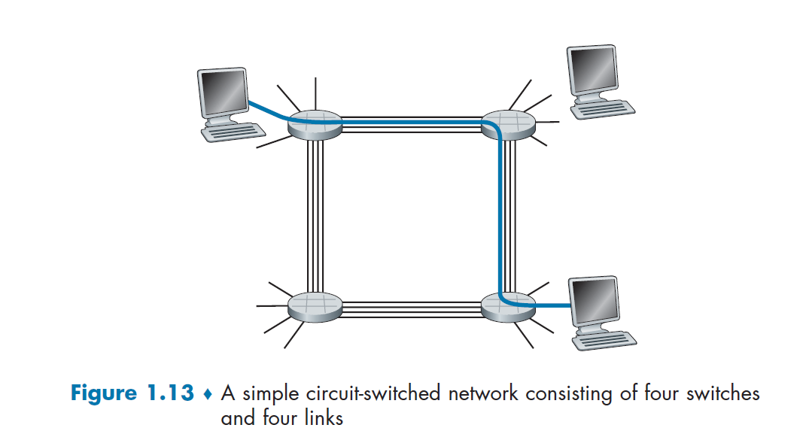

与此相反，考虑一台主机要经过分组交换网络（如 Internet）向另一台主机发送分组所发生的情况。与使用电路交换相同，该分组经过一系列通信链路传输。但与电路交换不同的是，该分组被发送进网络，而不预留任何链路资源之类的东西。如果因为此时其他分组也需要经该链路进行传输而使链路之一出现拥塞，则该分组将不得不在传输链路发送侧的缓存中等待而产生时延。Internet 尽最大努力以实时方式交付分组，但它不做任何保证。

- **电路交换网络中的复用**

电路交换网络中的复用有 2 类：**频分复用** 或 **时分复用**。

- **分组交换和电路交换的对比**

分组交换的性能能够优于电路交换的性能。电路交换不考虑需求，而预先分配了传输链路的使用，这使得已分配而并不需要的链路时间未被利用。另一方面，分组交换按需分配链路使用。链路传输能力将在所有需要在链路上传输分组的用户之间逐分组地被共享。

虽然分组交换和电路交换在今天的电信网络中都是普遍采用的方式，但趋势无疑是朝着分组交换方向发展。

### 1.1.4. 网络协议

端系统和分组交换机以及其他 Internet 部件都运行着一系列 **协议(protocol)**。这些协议控制 Internet 中信息的发送和接收。**TCP(Transmiss1on Control Protocol, 传输控制协议)** 和 **IP(Internet Protocol, 网际协议)** 是 Internet 协议中最重要的 2 个协议。

下面我们围绕这 2 个问题，深入介绍网络协议。

什么是协议？协议可以做什么？

1. **人类活动的类别**

也许理解计算机网络协议这一概念的一个最容易办法是，先与某些人类活动进行类比，因为我们人类无时无刻不在执行协议。考虑当你想要向某人询问时间时将要怎样做。 图 1-2 中显示了一种典型的交互过程。人类协议(至少是好的行为方式)要求一方首先进行问候(图 1-2 中的第一个“你好”)，以开始与另一个人的通信。对“你好”的典型响应是返回一个“你好”报文。此人用一个热情的“你好”进行响应，隐含着一种指示，表明能够继续向那人询问时间了。对最初的“你好”的不同响应(例如“不要烦我!”，或“我不会说英语”，或某些不合时宜的回答)也许表明了一个勉强的或不能进行的通信。在此情况下，按照人类协议，发话者就不能询问时间了。有时，问的问题根本得不到任何回答，在此情况下，发话者通常会放弃向这个人询问时间。注意在我们人类协议中, 有我们发送的特定报文，也有我们根据接收到的应答报文或其他事件(例如在某个给定的时间内没有回答)采取的动作。显然，发送和接收的报文，以及这些报文发送和接收或其他事件出现时所采取的动作，这些在一个人类协议中起到了核心作用。如果人们使用不同的协议(例如，如果一个人讲礼貌，而另一人不讲礼貌，或一个人明白时间的概念，而另一人却不理解)，这些协议就不能交互，因而不能完成有用的工作。在网络中这个道理同样成立。即为了完成一项工作，要求两个(或多个)通信实体运行相同的协议。

我们再考虑第二个人类类比的例子。假定你正在大学课堂里上课(例如上的是计算机网络课程)。教师正在唠唠叨叨地讲述协议，而你迷惑不解。这名教师停下来问: “同学们有什么问题吗？”(教师发送出一个报文，该报文被所有没有睡觉的学生接收到了。)你举起了手(向教师发送了一个隐含的报文)。这位教师面带微笑地示意你说: “请讲……”(教师发出的这个报文鼓励你提出问题，教师喜欢被问问题。)接着你就问了问题(向该教师传输了你的报文)。教师听取了你的问题(接收了你的问题报文)并加以回答(向你传输了回答报文)。我们再一次看到了报文的发送和接收，以及这些报文发送和接收时所采取的一系列约定俗成的动作，这些是这个“提问与回答”协议的关键所在。

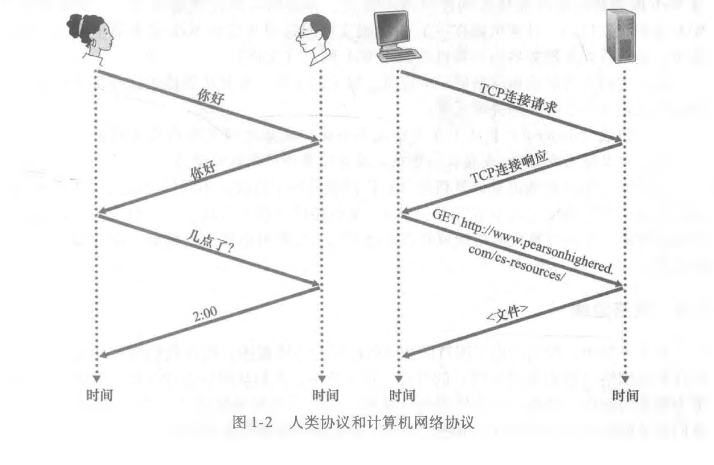

2. **网络协议**

网络协议类似于人类协议，除了交换报文和采取动作的实体是某些设备(可以是计算机、智能手机、平板电脑、路由器或其他具有网络能力的设备)的硬件或软件组件。在 Internet 中，涉及两个或多个远程通信实体的所有活动都受协议的制约。例如，在两台物理上 连接的计算机中，硬件实现的协议控制了在两块网络接口卡间的“线上”的比特流；在端系统中，拥塞控制协议控制了在发送方和接收方之间传输的分组发送的速率；路由器中的协议决定了分组从源到目的地的路径。在 Internet 中协议运行无处不在，因此本书的大量篇幅都与计算机网络协议有关。

以大家可能熟悉的一个计算机网络协议为例，考虑当你向一个 Web 服务器发出请求(即你在 Web 浏览器中键入一个 Web 网页的 URL)时所发生的情况。图 1-2 右半部分显示了这种情形。首先，你的计算机将向该 Web 服务器发送一条连接请求报文，并等待回答。 该 Web 服务器将最终能接收到连接请求报文，并返回一条连接响应报文。得知请求该 Web 文档正常以后，计算机则在一条 GET 报文中发送要从这台 Web 服务器上取回的网页名字。最后，Web 服务器向计算机返回该 Web 网页(文件)。

从上述的人类活动和网络例子中可见，报文的交换以及发送和接收这些报文时所采取的动作是定义一个协议的关键基本组成:

**协议定义了在两个或多个通信实体之间交换报文的格式和顺序，发送报文和接收报文以及其他事件所采取的动作。**

Internet(更一般地说是计算机网络)广泛地使用了协议。不同的协议用于完成不同的通信任务。当你阅读完这本书后将会知道，某些协议简单而直截了当，而某些协议则复杂且晦涩难懂。掌握计算机网络领域知识的过程就是理解网络协议的构成、原理和工作方式的过程。

### 1.1.5. Internet 标准

**Internet 标准(Internet standard)** 由 Internet 工程任务组(Internet Engineering Task Forse 或 IETF)。IETF 的标准文档称为请求评论(Request For Comment 或 RFC)。RFC 最初只是普通的请求评论(因此得名)，目的是解决 Internet 先驱者们面临的网络和协议问题。RFC 往往是技术性很强并相当详细的。它们定义了 TCP，IP，HTTP 和 SMTP 等协议。其他组织也在制定用于网络部件的标准，最引人注目的是针对网络链路的标准。例如 IEEE 802 LAN/MAN 标准委员会 [IEEE 802 2016] 制定了以太网和 WiFi 的标准。

## 1.2. Internet 提供的服务

### 1.2.1. 分布式应用程序

端系统上运行着应用程序，因此端系统也称为主机。主机上的大部分应用程序涉及在多个主机之间交换信息。因此这类应用程序被称为 **分布式应用程序**。

端系统上运行的分布式应用程序之间有着组织方式，我们称这种组织方式为分布式应用程序的体系结构。现有 2 种流行的体系结构：**客户-服务器体系结构(client-server architecture)** 和 **对等体系结构(P2P architecture)**。

- **客户-服务器体系结构**

在这种体系结构中，有一个总是打开的主机，称为**服务器**，它服务于许多个其他主机的请求，这些主机称为**客户**。

举个例子。常见的 Web 应用程序就是客户-服务器体系结构。其中，服务器为 Web 服务器，客户为运行在客户机上的浏览器。当一个客户发起请求时，Web 服务器向它响应。

这种体系结构具有以下特点：

1. 客户之间不直接通信
2. 服务器具有公开的，固定的地址，该地址称为 IP 地址

- **对等体系结构**

在这种体系结构中，主机几乎对专用服务器没有依赖，端系统之间直接通信。

常见的应用有：BitTorrent，迅雷，Skype，QQ。

### 1.2.2. 套接字

与 Internet 相连的端系统提供了一个 **套接字接口(socket interface)**，该接口规定了运行在一个端系统上的程序请求 Internet 基础设施向运行在另一个端系统上的特定目的地程序交 付数据的方式。Internet 套接字接口是一套发送程序必须遵循的规则集合，因此 Internet 能够将数据交付给目的地。我们将在第 2 章详细讨论 Internet 套接字接口。此时，我们做一个简单的类比，在本书中我们将经常使用这个类比。假定 Alice 使用邮政服务向 Bob 发一封信。 当然，Alice 不能只是写了这封信(相关数据)然后把该信丢出窗外。相反，邮政服务要求 Alice 将信放入一个信封中；在信封的中间写上 Bob 的全名、地址和邮政编码；封上信封；在信封的右上角贴上邮票；最后将该信封丢进一个邮局的邮政服务信箱中。因此，该邮政服务有自己的“邮政服务接口”或一套规则，这是 Alice 必须遵循的，这样邮政服务才能将她的信件交付给 Bob。同理，Internet 也有一个发送数据的程序必须遵循的套接字接口，使 Internet 向接收数据的程序交付数据。

当然，邮政服务向顾客提供了多种服务，如特快专递、挂号、普通服务等。同样，Internet 向应用程序提供了多种服务。当你研发一种 Internet 应用程序时，也必须为你的应用程序选择其中的一种 Internet 服务。我们将在第 2 章中描述 Internet 服务。

我们已经给出了 Internet 的两种描述方法：一种是根据它的硬件和软件成来描述，另一种是根据基础设施向分布式应用程序提供的服务来描述。但是，你也许还是对什么是 Internet 感到困惑，请不要担心。这本书除了向你介绍 Internet 的具体构成外，还要介绍支配 Internet 的工作原理以及它工作的来龙去脉。我们将在后续章节中解释这些重要的术语和问题。

## 1.3. Internet 的结构

### 1.3.1. 接入 ISP 网络

**接入 ISP 网络是指将端系统接入 Internet 核心的 ISP 网络。**

端系统通过 **Internet 服务提供商(Internet Service Provider, ISP)** 接入 Internet。ISP 包括如本地电缆或电话公司那样的住宅区 ISP、公司 ISP、大学 ISP，在机场、旅馆、咖啡店和其他公共场所提供 WiFi 接入的 ISP，以及为智能手机和其他设备提供移动接入的蜂窝数据 ISP(基站)。每个 ISP 自身就是一个由多台分组交换机和多段通信链路组成的网络。各 ISP 为端系统提供了各种不同类型的网络接入，包括如线缆调制解调器或 DSL 那样的住宅宽带接入，高速局域网接入和移动无线接入。ISP 也为内容提供者提供 Internet 接入服务，将 Web 站点和视频服务器直接连入 Internet。

Internet 要将端系统彼此互联，因此为端系统提供接入的 ISP 也必须互联。较低层的 ISP 通过国家的或国际的较高层 ISP 互联起来。较高层 ISP 是由通过高速光纤链路互联的高速路由器组成的。我们将在 1-2-2 节深入地讨论 ISP 的互联结构。

图 1-4 用粗的、带阴影的线高亮显示了几种类型接入 ISP 网络。

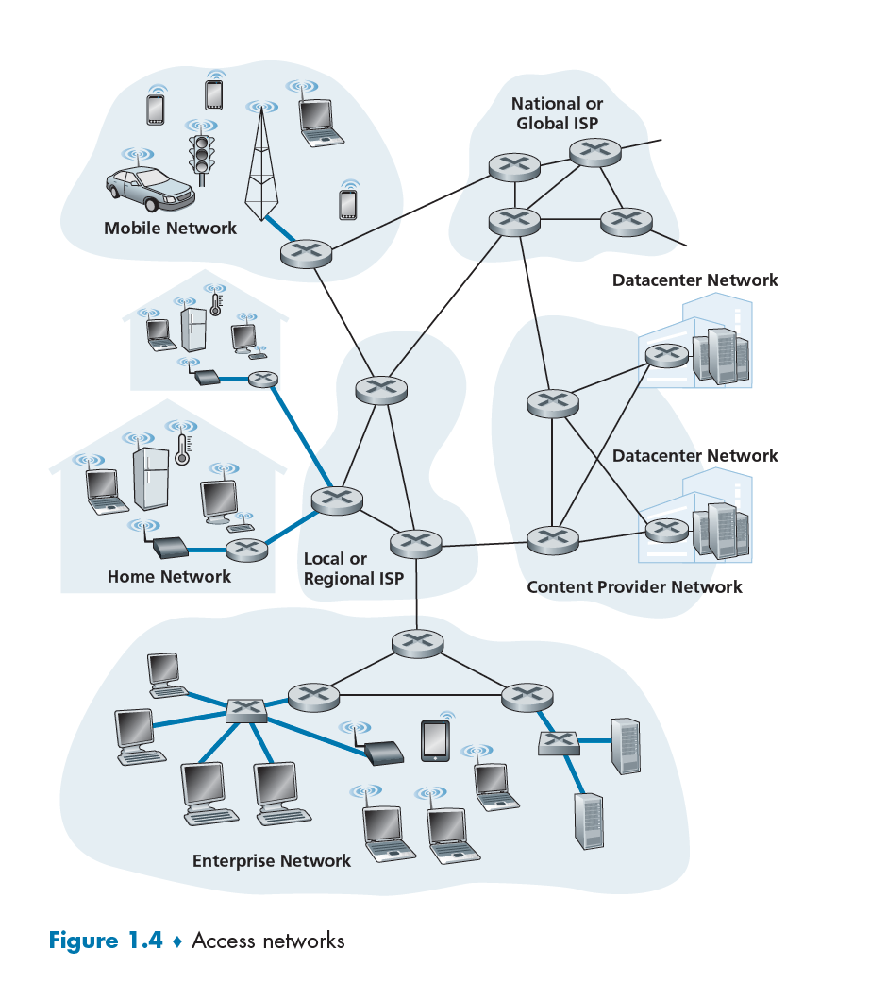

1. **家庭接入：DSL 接入，电缆接入，光纤接入，拨号和卫星接入**

- **DSL 接入**

住户通常从本地的电话公司处获得 DSL Internet 接入。这种情况下，ISP 就是用户的本地电话公司。

如图 1-5 所示，每个用户的 DSL 调制解调器使用现有的电话线（即双绞铜线，将在 1.2.2 节中讨论它）与位于电话公司的本地中心局（CO）中的数字用户线接入复用器（DSLAM）交换数据。家庭的 DSL 调制解 调器得到数字数据后将其转换高频音，以通过电话线传输给本地中心局；来自许多家庭的模拟信号在 DSLAM 处被转换回数字形式。

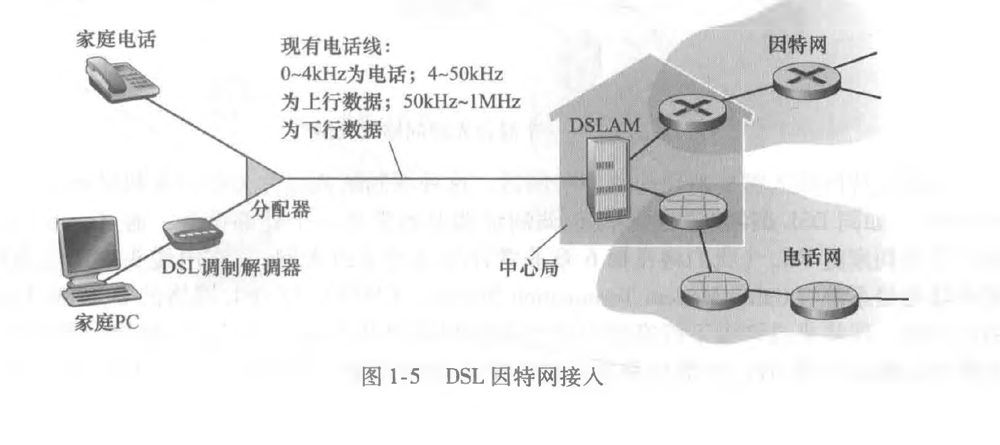

DSL 标准定义了多个传输速率，包括 12 Mbps 下行和 1.8Mbps 上行以及 55mbps 下行和 15Mbps 上行。

因为这些上行速率和下行速率是不同的，所以这种接入被称为是不对称的。

- **电缆接入**

住宅从提供有线电视的公司获得了电缆 Internet 接入。这种情况下，ISP 就是用户的有线电视公司。

如图 1-6 所示，光缆将电缆头端连接到地区枢纽，从这里使用传统的同轴电缆到达各家各户和公寓。每个地区枢纽通常支持 500 -5000 个家庭。因为在这个系统中应用了光纤和同轴电缆，所它经常被称为混合光纤同轴(HFC)系统。

电缆 Internet 接入需要特殊的调制解调器，这种调制解调器称为电缆调制解调器，如同 DSL 调制解调器，电缆调制解调器通常是一个外部设备，通过一个以太网端口连接到家庭 PC。在电缆头端，电缆调制解调器端接系统与 DSL 网络的 DSLAM 具有类似的功能，即将来自许多下行家庭中的电缆调制解调器发送的模拟信号转换回数字形式。

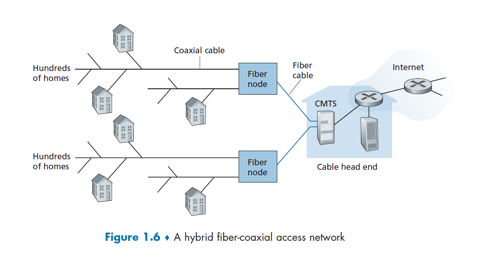

电缆调制解调器将 HFC 网络划分为下行和上行两个信道。如同 DSL,接入通常是不对称的，下行信道分配的传输速率通常比上行信道的高。DOCS1S 2.0 标准定义了高达 42.8Mbps 的下行速率和高达 30.7Mbps 的上行速率。

- **光纤接入**

光纤接入就是从本地中心局直接到家庭提供一个光纤路径。从本地中心局到家庭有几种有竞争的光纤布局方案。一种是直接光纤，从本地中心局到每个用户直接设置一根光纤。还有一种较为一般，从中心局出来一根光纤，到临近家庭的位置，才分给每个用户一个光纤。这种方案有两种类型：主动光纤网络(AOT)和被动光纤网络(PON)。

这里简要介绍 PON。如图 1-7 所示，每个家庭具有一个光纤网络端接器(ONT),它由专门的光纤连接到邻近的分配器(splitter)，该分配器把一些家庭(通常少于 100 个)集结到一根共享的光纤，该光纤再连接到本地电话和公司的中心局中的光纤线路端接器(OLT)，该 OLT 提供了光信号和电信号之间的转换，经过本地电话公司路由器与 Internet 相连。在家庭中，用户将一台家庭路由器(通常是无线路由器)与 ONT 相连，并经过这台家庭路由器接入 Internet。在 PON 体系结构中，所有从 OLT 发送到分配器的分组在分配器(类似于一个电缆头端)处复制。

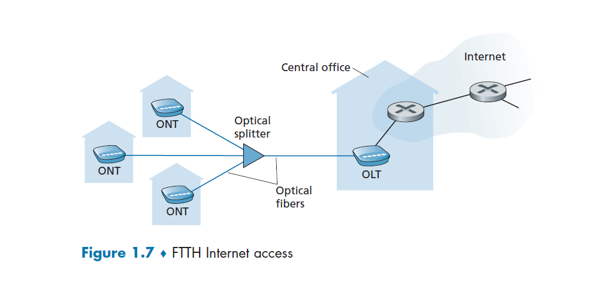

- **拨号和卫星接入**

还可采用另外两种接入网技术为家庭提供 Internet 接入。在无法提供 DSL、电缆和 FTTH 的地方（例如在某些乡村环境），能够使用卫星链路将住宅以超过 1Mbps 的速率与 Internet 相连。StarBand 和 HughesNet 是两家这样的卫星接入提供商。使用传统电话线的拨号接入与 DSL 基于相同的模式：家庭的调制解调器经过电话线连接到 ISP 的调制解调器。与 DSL 和其他宽带接入网相比，拨号接入 56kbps 的慢速率是令人痛苦的。

2. **机构接入：以太网和 WiFi**

- **以太网**

在公司和大学校园以及越来越多的家庭环境中，使用 **局域网(LAN)** 将端系统连接到边缘路由器。尽管有许多不同类型的局域网技术，但是 **以太网** 到目前为止是公司、大学和家庭网络中最为流行的接入技术。

如图 1-8 中所示，以太网用户使用双绞铜线与一台以太网交换机相连，第 6 章中将详细讨论该技术。 以太网交换机或这样相连的交换机网络，则再与更大的 Internet 相连。

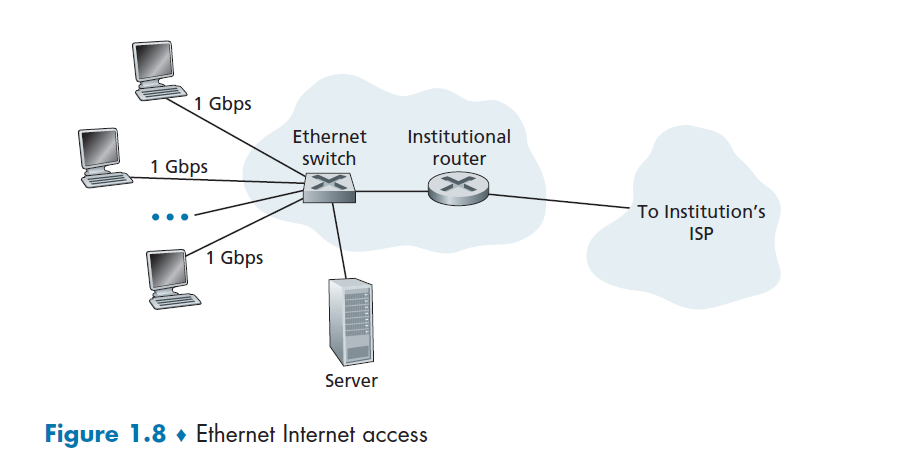

使用以太网接入，用户通常以 100Mbps 或 1Gbps 速率接入以太网交换机，而服务器可能具有 1Gbps 甚至 10Gbps 的接入速率。

- **WiFi(无线 LAN)**

如今，越来越多的人通过移动 PC，智能手机，平板电脑和其他设备接入 Internet。在无线 LAN 环境中，无线用户从/到一个接入点发送/接收分组，该接入点与企业网连接（很可能使用了有线以太网），企业网再与有线 Internet 相连。

一个无线 LAN 用户通常必须位于接入点的几十米范围内。基于 IEEE 802.11 技术的无线 LAN 接入,更通俗地称为 WiFi,目前几乎无所不在，如大学、商业办公室、咖啡厅、 机场、家庭，甚至在飞机上。

IEEE 802.11 今天提供了高达 100Mbps 的共享传输速率。

虽然以太网和 WiFi 接入网最初是设置在企业（公司或大学）环境中的，但它们近来已经成为家庭网络中相当常见的部件。今天许多家庭将宽带住宅接入（即电缆调制解调器 或 DSL）与廉价的无线局域网技术结合起来，以产生强大的家用网络。图 1-9 显示了典型的家庭网络。这个家庭网络组成如下：一台漫游的便携机和一台有线 PC； — 个与无线 PC 和家中其他无线设备通信的基站（无线接入点）；一个提供与 Internet 宽带接入的 电缆调制解调器；一台互联了基站及带有电缆调制解调器的固定 PC 的路由器。该网络允许 家庭成员经宽带接入 Internet，其中任何一个家庭成员都可以在厨房、院子或卧室漫游上网。

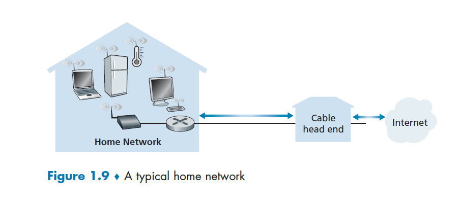

3. **广域无线接入：4G 和 5G**

我们可以使用 iPhone 和安卓等移动设备发信息、在社交网络中分享照片、观看视频和放音乐。这些设备应用了与蜂窝移动电话相同的无线基础设施，通过蜂窝网提供商运营的基站来发送和接收分组。与 WiFi 不同的是，一个用户仅需要位于基站的数万米(而不是几十米)范围内。

电信公司在第 4 代移动通信技术(4G)上做了巨大的投资。4G 移动通信技术可以提供 60Mbps 的下载速度。但是更高速度的广域无线接入技术，第五移动通信技术(5G)已经投入了部署。我们将在第 7 章详细地讨论 WiFi，4G，5G 等技术。

### 1.3.2. Internet 核心

上一节谈到，接入 ISP 网络将端系统接入 Internet 核心。

**Internet 核心是指互联了接入 ISP 网络的核心网络。Internet 核心本身由更高层次的 ISP 网络，内容提供商网络，以及其他一些部件互联形成。**

图 1-10 以加粗和带阴影的线高亮显示了 Internet 核心。

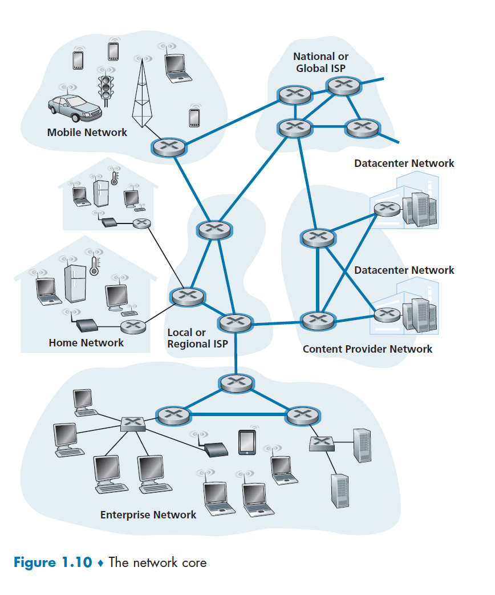

可是各层次 ISP 网络到底是怎么样互联的呢？

为了理解今天的 ISP 互联结构，我们将逐步地构建一系列 ISP 互联结构，每一个结构都更接近如今的 Internet。

回顾前面的互联接入 ISP 的目标：使所有的端系统能够交换分组。

最简单的方法就是将每一个 ISP 直接与其他的 ISP 相连。当然这是不可行的，这样的设计费用太高，因为这种设计要求每一个 ISP 要与世界上数十万个其他接入 ISP 有一条单独的通信链路。

我们的第一个 ISP 互联结构，用单一的全球传输 ISP 互联所有的 ISP，我们假想的全球传输 ISP 是一个由路由器和通信链路构成的网络，该网络跨越全球，而且至少有一个路由器靠近数十万个接入 ISP 的每一个。为了有利可图，自然要向每个连接的接入 ISP 收费，其价格反映（并不一定正比于）一个接入 ISP 经过全球 ISP 交换的流量大小。因为接入 ISP 向全球传输 ISP 付费，故接入 ISP 被认为是 **客户(customer)**，而全球传输 ISP 被认为是 **提供商(provider)**。

如果某个公司建立并运营一个可赢利的全球传输 ISP，其他公司建立自己的全球传输 ISP 并与最初的全球传输 ISP 竞争则是一件自然的事。这导致了 ISP 互联结构 2。

ISP 互联结构 2 由数十万接入 ISP 和多个全球传输 ISP 组成。接入 ISP 无疑更喜欢 ISP 互联结构 2,因为 它们现在能够根据价格和服务因素在多个竞争的全球传输提供商之间进行选择。然而，值得注意的是，这些全球传输 ISP 之间必须是互联的；不然的话，与某个全球传输 ISP 连接的接入 ISP 将不能与连接到其他全球传输 ISP 的接入 ISP 进行通信。

刚才描述的网络结构 2 是种两层的等级结构，其中全球传输提供商位于顶层，而接入 ISP 位于底层。这假设了全球传输 ISP 不仅能够接近每个接入 ISP,而且费用上也是可行的。现实中，尽管某些 ISP 确实具有令人印象深刻的全球覆盖，并且确实直接与许多接入 ISP 连接，但世界上没有哪个 ISP 是无处不在的。相反，在任何给定的区域，可能有一个 **区域 ISP(regional ISP)**，区域中的接入 ISP 与之连接。每个区域 ISP 则与 **第一层 ISP(tier-1 ISP)** 连接。第一层 ISP 类似于我们假想的全球传输 ISP，尽管它不是在世界上每个城市中都存在，但它确实存在。有大约十几个第一层 ISP，包括 Level 3 Communications，AT&T，Sprint 和 NTT。

再来讨论这个网络的网络，不仅有多个竞争的第一层 ISP,而且在一个区域可能有多 个竞争的区域 ISP。在这样的等级结构中，每个接入 ISP 向其连接的区域 ISP 支付费用，并且每个区域 ISP 向它连接的第一层 ISP 支付费用。(一个接入 ISP 也能直接与第一层 ISP 连接，这样它就向第一层 ISP 付费。)因此，在这个等级结构的每一层，都有客户-提供 商关系。值得注意的是，第一层 ISP 不向任何人付费，因为它们位于该等级结构的顶部。 更为复杂的情况是，在某些区域，可能有较大的区域 ISP (可能跨越整个国家)，该区域 中较小的区域 ISP 与之相连，较大的区域 ISP 则与第一层 ISP 连接。例如，在中国，每个城市有接入 ISP,它们与省级 ISP 连接，省级 ISP 又与国家级 ISP 连接，国家级 ISP 最终与第一层 ISP 连接［Tian 2012］。这个多层等级结构仍然仅仅是今天因特网的粗略近似，我们称它为 ISP 互联结构 3。

为了建造一个与今天的因特网更为相似的网络，我们必须在等级化网络结构 3 上增加 **存在点(Point of Presence, PoP)** 、多宿、对等和因特网交换点。PoP 存在于等级结构的所 有层次，但底层(接入 ISP)等级除外。一个 POP 只是提供商网络中的一台或多台路由器 (在相同位置)群组，其中客户 ISP 能够与提供商 ISP 连接。对于要与提供商 PoP 连接的 客户网络，它能从第三方电信提供商租用高速链路将它的路由器之一直接连接到位于该 PoP 的一台路由器。任何 ISP (除了第一层 ISP)可以选择 **多宿(multi-home)**，即可以与 两个或更多提供商 ISP 连接。例如，一个接入 ISP 可能与两个区域 ISP 多宿，既可以与两个区域 ISP 多宿，也可以与一个第一层 ISP 多宿。当一个 ISP 多宿时，即使它的提供商之一出现故障，它仍然能够继续发送和接收分组。

正如我们刚才学习的，客户 ISP 向它们的提供商 ISP 付费以获得全球因特网互联能力。客户 ISP 支付给提供商 ISP 的费用数额反映了它通过提供商交换的通信流量。为了减少这些费用，位于相同等级结构层次的邻近一对 ISP 能够 **对等(peer)**，也就是说，能够直接将它们的网络连到一起，使它们之间的所有流量经直接连接而不是通过上游的中间 ISP 传输。当两个 ISP 对等时，通常不进行结算，即任一个 ISP 不向其对等付费。如前面提到的那样，第一层 ISP 也与另一个第一层 ISP 对等，它们之间无结算。对于对等和客户-提供商关系的讨论，［Van der Berg 2008］是一本不错的读物。沿着这些相同路线，第三方公司能够创建一个 **因特网交换点(Internet Exchange Point, IXP)**, IXP 是一个汇合点，多个 ISP 能够在这里一起对等。IXP 通常位于一个有自己的交换机的独立建筑物中［Ager 2012］, 在今天的因特网中有 600 多个 IXP ［IXP List 2016 ］。我们称这个生态系统为 ISP 互联结构 4：由接入 ISP、区域 ISP、第一层 ISP、PoP、多宿、对等和 IXP 组成。

我们现在最终到达了 ISP 互联结构 5，它描述了现今的因特网。在图 1-15 中显示了 ISP 互联结构 5，它通过在 ISP 互联结构 4 顶部增加 **内容提供商网络(content provider network)** 构建而成。谷歌是当前这样的内容提供商网络的一个突岀例子。在本书写作之时，谷歌估计有 19 个主要的数据中心分布于北美、欧洲、亚洲、南美和澳大利亚。其中每一个数据中心都有数万到数十万的服务器。此外谷歌也有较小的数据中心，每一个有几百个服务器，这些小型数据中心常常位于 IXP 内。谷歌数据中心都 经过专用的 TCP/IP 网络互联，该网络跨越全球，不过独立于公共因特网。重要的是，谷歌专用网络仅承载岀入谷歌服务器的流量。如图 1-15 所示，谷歌专用网络通过与较低层 ISP 对等（无结算），尝试“绕过”因特网的较高层，采用的方式可以是直接与它们连接，或者在 IXP 处与它们连接［Labovitz2010］。然而，因为许多接入 ISP 仍然仅能通过第一层网络的传输到达，所以谷歌网络也外第一层 ISP 连接，并就与这些 ISP 交换的流量向它们付费。通过创建自己的网络，内容提供商不仅减少了向顶层 ISP 支付的费用，而且对其服务最终如何交付给端用户有了更多的控制。谷歌的网络基础设施在 2-6 节中进行了详细描述。

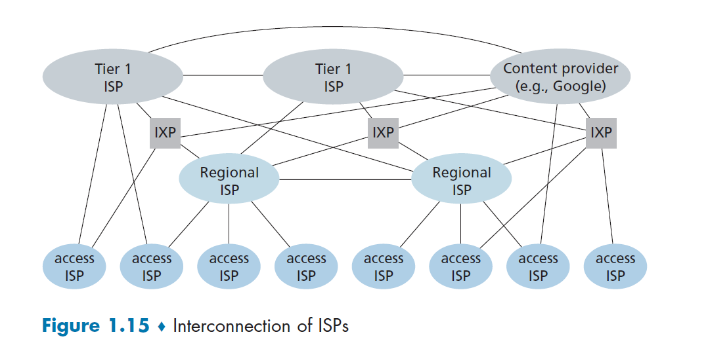

## 1.4. Internet 分层模型

### 1.4.1. 分层的体系结构

前几节的讨论中，我们了解到 Internet 是个非常复杂的结构。各种分布式应用程序运行在端系统上，各种的网络协议控制着不同的分组发送规则，各种物理媒体的通信链路，等等。

为了使维护，管理，使用 Internet 更加方便，必须有一种良好的组织 Internet 的方式。这个方式就是 Internet 分层模型。

在 Internet 分层模型中，下一层向上一层提供 **服务(service)**，而上一层不必关注下一层的实现细节。当下一层的实现方式更换后，也不影响上一层的运作。不同的层负责不同的职能。

Internet 分层模型具有概念化和结构化的优点［RFC 3439］。如我们看到的那样，分层提供了一种结构化方式来讨论系统组件。模块化使更新系统组件更为容易。然而，需要提及的是，某些研究人员和联网工程师激烈地反对分层［WMenian 1992］。分层的一个潜在缺点是一层可能冗余较低层的功能。例如，许多协议栈在基于每段链路和基于端到端两种情况下，都提供了差错恢复。第二种潜在的缺点是某层的功能可能需要仅在其他某层才出现的信息（如时间戳值），这违反了层次分离的目标。

一个协议层能够用软件或硬件或两者的结合来实现。应用层和运输层几乎使用软件来实现。物理层和数据链路层通常在网络接口卡（例如以太网 或 WiFi 接口卡）中实现。网络层用软硬件结合的方式来实现。

所有各层的协议称为 **协议栈(protocol stack)**。

Internet 的协议栈由 5 个层组成：**物理层**、**链路层**、**网络层**、**运输层**和**应用层**。如图 1-23 所示。

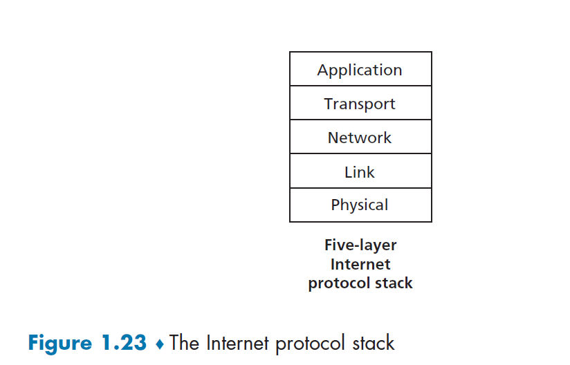

本书的结构采用了 **自顶向下方法(top-down approach)**，先处理应用层，然后向下处理。

- **应用层**

应用层由运行在端系统上的分布式应用程序及它们的应用层协议组成。Internet 的应用层包括许多协议，例如 HTTP （它提供了 Web 文档的请求和传送）、SMTP （它提供了电子邮件报文的传输）和 FTP （它提供两个端系统之间的文件传送）。我们将看到，某些网络功能，如将像 www.ietf.org 这样对人友好的端系统名字转换为 32 比特的网络地址，也是借助于特定的应用层协议即域名系统（DNS）完成的。我们将在第 2 章中看到，创建并部署我们自己的新应用层协议是非常容易的。

应用层协议分布在多个端系统上，而一个端系统中的应用程序使用协议与另一个端系统中的应用程序交换信息分组。我们把这种位于应用层的信息分组称为 **报文（message）**。

- **运输层**

Internet 的运输层负责在应用程序端点之间传送应用层报文。在 Internet 中，有两种运输协议，即 TCP 和 UDP,利用其中的任一个都能运输应用层报文。TCP 向它的应用程序提供了面向连接的服务。这种服务包括了应用层报文向目的地的确保传递和流量控制（即发送方/接收方速率匹配）。TCP 也将长报文划分为短报文，并提供拥塞控制机制，因此当网络拥塞时，源抑制其传输速率。UDP 协议向它的应用程序提供无连接服务。这是一种不提供不必要服务的服务，没有可靠性，没有流量控制，也没有拥塞控制。在本书中，我们把运输层的分组称为 **报文段(segment)**。

- **网络层**

Internet 的网络层负责将称为 **数据报（datagram）** 的网络层分组从一台主机移动到另一台主机。在一台源主机中的 Internet 运输层协议（TCP 或 UDP）向网络层递交运输层报文段和目的地址。Internet 的网络层包括著名的网际协议 IP，该协议定义了在数据报中的各个字段以及端系统和路由器如何作用于这些字段。IP 仅有一个，所有具有网络层的 Internet 组件必须运行 IP。 Internet 的网络层也包括决定路由的路由选择协议，它根据该路由将数据报从源传输到目的地。Internet 具有许多路由选择协议。

- **链路层**

Internet 的网络层通过源和目的地之间的一系列路由器路由数据报。为了将分组从一个节点（主机或路由器）移动到路径上的下一个节点，网络层必须依靠该链路层的服务。特别是在每个节点，网络层将数据报下传给链路层，链路层沿着路径将数据报传递给下一个节点。在该下一个节点，链路层将数据报上传给网络层。由链路层提供的服务取决于应用于该链路的特定链路层协议。例如，某些协议基于链路提供可靠传递，从传输节点跨越一条链路到接收节点。值得注意的是，这种可靠的传递服务不同于 TCP 的可靠传递服务，TCP 提供从一个端系统到另一个端系统的可靠交付。链路层的例子包括以太网、WiFi 和电缆接入网的 DOCS1S 协议。因为数据报从源到目的地传送通常需要经过几条链路，一个数据报可能被沿途不同链路上的不同链路层协议处理。例如，一个数据报可能被一段链路上的以太网和下一段链路上的 PPP 所处理。网络层将受到 来自每个不同的链路层协议的不同服务。在本书中，我们把链路层分组称为 **帧(frame)**。

- **物理层**

虽然链路层的任务是将整个帧从一个网络基本组成移动到邻近的网络基本组成，而物理层的任务是将该帧中的一个个比特从一个节点移动到下一个节点。在这层中的协议仍然是链路相关 的，并且进一步与该链路（例如，双绞铜线、单模光纤）的实际传输媒体相关。例如，以太 网具有许多物理层协议：一个是关于双绞铜线的，另一个是关于同轴电缆的，还有一个是关于光纤的，等等。在每种场合中，跨越这些链路移动一个比特是以不同的方式进行的。

### 1.4.2. 封装

本节我们来仔细观察一下来自发送端系统的分布式应用程序产生的数据是怎么通过 Internet 分层模型一步步到达目的端系统的。

如图 1-24 所示。

数据从发送端的协议栈向下，通过链路层交换机和路由器的协议栈，然后向上通过接收端的协议栈。

在实现的网络协议上，尽管链路层交换机和路由器都是分组交换机，但是链路层交换机只实现了第一层和第二层，路由器实现了第一层到第三层。这表示路由器可以实现 IP 协议而链路层交换机不能。


在发送主机端，一个应用层报文(M)被传送到运输层，运输层收到报文并加上首部字节(Ht)，Ht 在接收端运输层会被用到。Ht 和 M 共同构成运输层报文段。Ht 可能会涉及以下信息：允许接收端运输层向上向适当的应用程序交付报文的信息；差错检测位信息，该信息让接收方能够判断报文中的比特是否在途中已被改变。报文段被传输到网络层，网络层会附加给报文段一些信息(Hn)，如：发送端和接收端地址等网络层信息。Hn 和报文段构成了网络层数据报。数据报被传输到链路层，链路层给数据报附加上所需信息 Hl，构成链路层帧。这就是封装。

## 1.5. 计算机网络的性能

### 1.5.1. 节点总时延

前面讲过，分组从一台主机（源）出发，通过一系列路由器传输，在另一台主机(目的地)中结束它的历程。当分组从一个节点(主机或路由器)沿着这条路径到后继节点(主机或路由器)，该分组在沿途的每个节点经受了几种不同类型的时延。这些时延最为重要的是 **节点处理时延(nodal process1ng delay)**，**排队时延(queuing delay)**、**传输时延(transmiss1on delay)** 和 **传播时延(propagation delay)**，这些时延总体累加起来是 **节点总时延(tolal nodal delay)**。许多因特网应用，如搜索、Web 浏览、电子邮件、地图、即时通讯和 IP 语音，它们的性能受网络时延的影响很大。为了深入理解分组交换和计算机网络，我们必须理解这些时延的性质和重要性。

- **时延的类型**

请看图 1-16 所示的例子。

当分组从上游节点到达路由器 A 时，路由器 A 检查该分组的首部以决定它的出链路。这个例子中只有通向 B。当 A 的出链路不是占用状态时，才会立即传输该分组。如果出链路是占用状态，那么该分组会进入 A 的输出缓存排队。

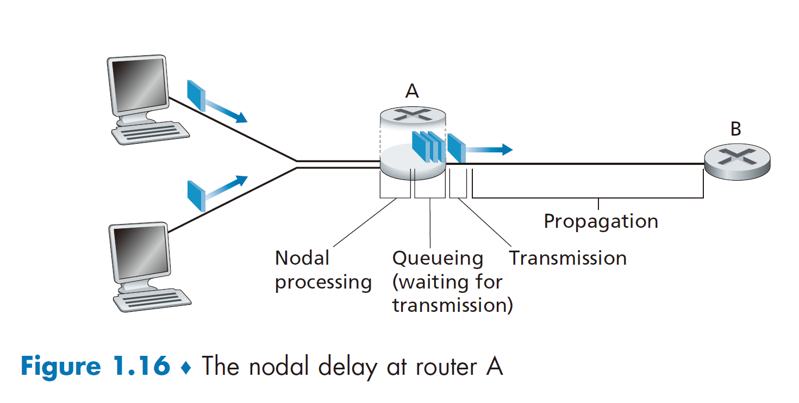

1. **处理时延**

路由器检查一个分组的首部字节和决定将该分组导向何处是 **处理时延** 的一部分。处理时延还包括检查比特级别的差错所需要的时间。在这种节点处理之后，路由器将该分组引向通往路由器 B 链路之前的队列。

处理时延通常是微妙或更低的数量级。

2. **排队时延**

在队列中，当分组在链路上等待传输时，它经受排队时延。一个特定分组的排队时延长度将取决于先期到达的正在排队等待向链路传输的分组数量。如果该队列是空的，并且当前没有其他分组正在传输，则该分组的排队时延为 0。另一方面，如果流量很大，并且许多其 他分组也在等待传输，该排队时延将很长。我们将很快看到，到达分组期待发现的分组数量是到达该队列的流量的强度和性质的函数。

实际上的排队时延通常是毫秒到微妙量级。

3. **传输时延**

假定分组以先到先服务方式传输——这在分组交换网中是常见的方式，仅当所有已经到达的分组被传输后，才能传输刚到达的分组。用 L 比特表示该分组的长度，用 R bps (即 b/s)表示从路由器 A 到路由器 B 的链路传输速率。例如，对于一条 10Mbps 的以太网链路，速率 R = 10Mbps；对于 100Mbps 的以太网链路，速率 R = 100Mbps。 传输时延是 L/R。这是将所有分组的比特推向链路(即传输，或者说发射)所需要的时间。

实际的传输时延通常在毫秒到微秒量级。

4. **传播时延**

一旦一个比特被推向链路，该比特需要向路由器 B 传播。从该链路的起点到路由器 B 传播所需要的时间是传播时延。该比特以该链路的传播速率传播。该传播速率取决于该链路的物理媒体（即光纤、双绞铜线等），其速率范围是 $2 \times 10^8 - 3 \times 10^8$ m/s，这等于或略小于光速。该传播时延等于两台路由器之间的距离除以传播速率。即传播时延是 d/s。其中 d 是路由器 A 和路由器 B 之间的距离，s 是该链路的传播速率。一旦该分组的最后一个比特传播到节点 B，该比特及前面的所有比特被存储于路由器 B。整个过程将随着路由器 B 执行转发而持续下去。

在广域网中，传播时延为毫秒量级。

如果令 $d_{proc}$，$d_{queue}$，$d_{trans}$，$d_{prop}$分别表示处理时延、排队时延、传输时延和传播时延，则节点的总时延由下式给定：

$$d_{nodal} = {d_{proc} + d_{queue} + d_{trans} + d_{prop}}$$

这些时延成分所起的作用可能会有很大的不同。例如，对于连接两台位于同一个大学校园的路由器的链路而言，$d_{prop}$ 可能是微不足道的（例如，几微秒）；然而，对于由同步卫星链路互联的两台路由器来说 $d_{prop}$ 是几百毫秒，能够成为 $d_{nodal}$ 中的主要成分。类似地，$d_{trans}$ 的影响可能是微不足道的，也可能是很大的。通常对于 10Mbps 和更高的传输速率（例如，对于 LAN）的信道而言，它的影响是微不足道的；然而，对于通过低速拨号调制解调器链路发送的长因特网分组而言，可能是数百毫秒。处理时延 $d_{proc}$通常是微不足道的；然而，它对一台路由器的最大吞吐量有重要影响，最大吞吐量是一台路由器能够转发分组的最大速率。

### 1.5.2. 丢包

节点总时延的最为复杂和有趣的成分是排队时延 $d_{queue}$。与其他 3 项时延（即 $d_{proc}$，$d_{trans}$和 $d_{prop}$）不同的是，排队时延对不同的分组可能是不同的。例如，如果 10 个分组同时到达空队列，传输的第一个分组没有排队时延，而传输的最后一个分组将经受相对大的排队时延（这时它要等待其他 9 个分组被传输）。因此，当表征排队时延时，人们通常使用统计量来度量，如平均排队时延、排队时延的方差和排队时延超过某些特定值的概率。

什么时候排队时延大，什么时候又不大呢？该问题的答案很大程度取决于流量到达该队列的速率、链路的传输速率和到达流量的性质，即流量是周期性到达还是以突发形式到达。为了更深入地领会某些要点，令 a 表示分组到达队列的平均速率（a 的单位是分组/秒，即 pkt/s）。 前面讲过 R 是传输速率，即从队列中推出比特的速率（以 bps 即 b/s 为单位）。为了简单起见，也假定所有分组都是由 L 比特组成的。则比特到达队列的平均速率是 La bps。最后，假定该队列非常大，因此它基本能容纳无限数量的比特。比率 La/R 被称为 **流量强度(traffic intens1ty)**，它在估计排队时延的范围方面经常起着重要的作用。如果 La/R > 1，则比特到达队列的平均速率超过从该队列传输岀去的速率。在这种不幸的情况下，该队列趋向于无限增加，并且排队时延将趋向无穷大！因此，流量工程中的一条金科玉律是：设计系统时流量强度不能大于 1。

现在考虑 La/R <= 1 时的情况。这时，到达流量的性质影响排队时延。例如，如果分组周期性到达，即每 L/R 秒到达一个分组，则每个分组将到达一个空队列中，不会有排队时延。另一方面，如果分组以突发形式到达而不是周期性到达，则可能会有很大的平均排队时延。例如，假定每 (L/R)N 秒同时到达 N 个分组。则传输的第一个分组没有排队时延; 传输的第二个分组就有 L/R 秒的排队时延；更为一般地，第几个传输的分组具有(n-1)L/R 的排队时延。我们将该例子中的计算平均排队时延的问题留给读者作为练习。

以上描述周期性到达的两个例子有些学术味。通常，到达队列的过程是随机的，即到达并不遵循任何模式，分组之间的时间间隔是随机的。在这种更为真实的情况下，量 L/R 通常不足以全面地表征时延的统计量。不过，直观地理解排队时延的范围很有用。特别是，如果流量强度接近于 0，则几乎没有分组到达并且到达间隔很大，那么到达的分组将不可能在队列中发现别的分组。因此，平均排队时延将接近 0。另一方面，当流量强度接近 1 时，当到达速率超过传输能力(由于分组到达速率的波动)时将存在时间间隔，在这些时段中将形成队列。当到达速率小于传输能力时，队列的长度将缩短。无论如何，随着流量强度接近，平均排队长度变得越来越长。平均排队时延与流量强度的定性关系如图 1-18 所示。

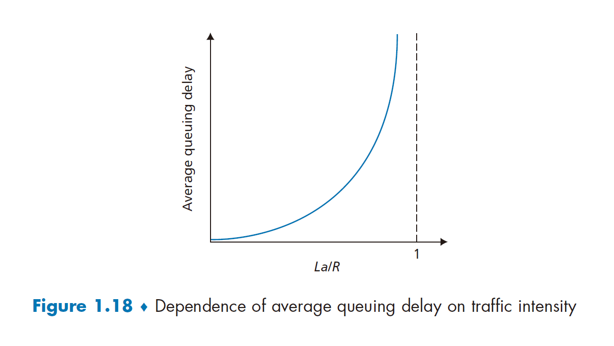

图 1-18 的一个重要方面是这样一个事实：随着流量强度接近于 1，平均排队时延迅速增加。该强度的少量增加将导致时延大比例增加。也许你在公路上 经历过这种事。如果在经常拥塞的公路上像平时一样驾驶，这条路经常拥塞的事实意味着它的流量强度接近于 1,如果某些事件引起一个即便是稍微大于平常量的流量，经受的时延就可能很大。

为了实际感受一下排队时延的情况，我们再次鼓励你访问本书的 Web 网站([进入动画](https://media.pearsoncmg.com/ph/esm/ecs_kurose_compnetwork_8/cw/content/interactiveanimations/queuing-loss-applet/index.html))。如果你将分组到达速率设置得足够大，使流量强度超过 1，那么将看到经过一段时间后，队列慢慢地建立起来。

在上述讨论中，我们已经假设队列能够容纳无穷多的分组。在现实中，一条链路前的队列只有有限的容量，尽管排队容量极大地依赖于路由器设计和成本。因为该排队容量是 有限的，随着流量强度接近 1，排队时延并不真正趋向无穷大。相反，到达的分组将发现一个满的队列。由于没有地方存储这个分组，路由器将丢弃该分组，即该分组将会 **丢包(lost)**。当流量强度大于 1 时，队列中的这种溢出也能够在配套 web 网站的动画中看到。

从端系统的角度看，上述丢包现象看起来是一个分组已经传输到网络核心，但它绝不会从网络发送到目的地。分组丢失的比例随着流量强度增加而增加。因此，一个节点的性能常常不仅根据时延来度量，而且根据丢包的概率来度量。正如我们将在后面各章中讨论的那样，丢失的分组可能基于端到端的原则重传，以确保所有的数据最终从源传送到了目的地。

### 1.5.3. 端到端时延

前面的讨论一直集中在节点时延上，即在单台路由器上的时延。我们现在考虑从源到目的地的总时延。为了能够理解这个概念，假定在源主机和目的主机之间有 N-1 台路由器。我们还要假设该网络此时是无拥塞的(因此排队时延是微不足道的)，在每台路由器和源主机上的处理时延是 $d_{proc}$，每台路由器和源主机的输出速率是 R bps，每条链路的传播时延是 $d_{trans)}$。节点时延累加起来，得到端到端时延：

$$d_{end-end} = {N(d_{proc} + d_{trans} + d_{prop})}$$

其中，$d_{trans}$ = L / R，L 为分组的长度。

在各节点具有不同的时延和每个节点存在平均排队时延的情况下，需要对上式进行一般化处理。我们将有关工作留给读者。

- **Traceroute**

为了对计算机网络中的端到端时延有第一手认识，我们可以利用 Traceroute 程序。 Traceroute 是一个简单的程序，它能够在任何因特网主机上运行。当用户指定一个目的主机名字时，源主机中的该程序朝着目的地发送多个特殊的分组。当这些分组向着目的地传送时，它们通过一系列路由器。当路由器接收到这些特殊分组之一时，它向源回送一个短报文。该短报文包括路由器的名字和地址。

更具体来说，假定在源和目的地之间有 N-1 台路由器。源将向网络发送 N 个特殊的分组，其中每个分组地址指向最终目的地。这 N 个特殊分组标识为从 1 到 N，第一个分组标识为 1，最后的分组标识为 N。当第 n 台路由器接收到标识为 n 的第 n 个分组时，该路由器不是向它的目的地转发该分组，而是向源回送一个报文。当目的主机接收第 N 个分组时，它也会向源返回一个报文。该源记录了从它发送一个分组到它接收到对应返回报文所经历的时间；它也记录了返回该报文的路由器（或目的主机）的名字和地址。以这种方式，源能够重建分组从源到目的地所采用的路由，并且该源能够确定到所有中间路由器的往返时延。Traceroute 实际上对刚才描述的实验重复了 3 次，因此该源实际上向目的地发送了 3\*N 个分组。RFC 1393 详细地描述了 Traceroute。

这里我们提供了一个了一个追踪本地主机到 www.baidu.com 的一个例子。

```bat
tracert www.baidu.com

通过最多 30 个跃点跟踪
到 www.a.shifen.com [110.242.68.3] 的路由:

  1     2 ms     2 ms     2 ms  bogon [192.168.43.141]
  2     *        *        *     请求超时。
  3     *        *        *     请求超时。
  4    22 ms    35 ms    33 ms  123.139.0.221
  5     *       62 ms    27 ms  gi0-0-rtr1-xgx-man.169cnc.net [221.11.0.1]
  6    64 ms    48 ms    40 ms  gi3-0-rtr1-dwl-man.169cnc.net [221.11.0.53]
  7    77 ms    44 ms    49 ms  219.158.111.233
  8    82 ms    76 ms    51 ms  110.242.66.178
  9     *        *        *     请求超时。
 10     *        *        *     请求超时。
 11     *        *        *     请求超时。
 12     *        *        *     请求超时。
 13    43 ms    58 ms    61 ms  110.242.68.3

跟踪完成。
```

- **其他时延**

除了处理时延、传输时延和传播时延，端系统中还有其他一些重要时延。例如，希望向共享媒体（例如在 WiFi 或电缆调制解调器情况下）传输分组的端系统可能有意地延迟它的传输，把这作为它与其他端系统共享媒体的协议的一部分；我们将在第 6 章中详细地考虑这样的协议。另一个重要的时延是媒体分组化时延，这种时延出现在 IP 语音（VoIP） 应用中。在 VoIP 中，发送方在向因特网传递分组之前必须首先用编码的数字化语音填充一个分组。这种填充一个分组的时间称为分组化时延，它可能较大，并能够影响用户感受到的 VoIP 呼叫的质量。这个问题将在本章结束的课后作业中进一步探讨。

### 1.5.4. 吞吐量

除了时延和丢包，计算机网络中另一个至关重要的性能测度是端到端吞吐量。为了定义吞吐量，考虑从主机 A 到主机 B 跨越计算机网络传送一个大文件。例如，也许是从一个 P2P 文件共享系统中的一个对等方向另一个对等方传送一个大视频片段。在任何时间瞬间的 **瞬时吞吐量(instantaneous throughput)** 是主机 B 接收到该文件的速率（以 bps 计）。（许多应用程序包括许多 P2P 文件共享系统，其用户界面显示了下载期间的瞬时吞吐量，也许你以前已经观察过它！）如果该文件由 F 比特组成，主机 B 接收到所有 F 比特用去 T 秒，则文件传送的 **平均吞吐量(average throughput)** 是 F/T bps。 对于某些应用程序如因特网电话，希望具有低时延和在某个阈值之上（例如，对某些因特网电话是超过 24kbps，对某些实时视频应用程序是超过 256kbps）的一致的瞬时吞吐量。对于其他应用程序，包括涉及文件传送的那些应用程序，时延不是决定性的，但是希望具有尽可能高的吞吐量。

为了进一步深入理解吞吐量这个重要概念，我们考虑几个例子。图 1-19a 显示了服务器和客户这两个端系统，它们由两条通信链路和一台路由器相连。考虑从服务器传送一个文件到客户的吞吐量。令 Rs 表示服务器与路由器之间的链路速率；Rc 表示路由器与客户之间的链路速率。假定在整个网络中只有从该服务器到客户的比特在传送。在这种理想的情况下，我们要问该服务器到客户的吞吐量是多少？为了回答这个问题，我们可以想象比特是流体，通信链路是管道。显然，这台服务器不能以快于 Rs bps 的速率通过其链路注入比特；这台路由器也不能以快于 Rcbps 的速率转发比特。如果 Rs < Rc，则在给定的吞吐量 Rs bps 的情况下，由该服务器注入的比特将顺畅地通过路由器“流动”，并以速率 Rs bps 到达客户。另一方面，如果 Rc < Rs，则该路由器将不能像接收速率那样快地转发比特。在这种情况下，比特将以速率 Rc 离开该路由器，从而得到端到端吞吐量 Rc。（还要注意的是，如果比特继续以速率 Rs 到达路由器，继续以 Rc 离开路由器的话，在该路由器中等待传输给客户的积压比特将不断增加，这是一种最不希望的情况！）因此，对于这种简单的两链路网络，其吞吐量是 min {Rc, Rs}。这就是说，它是 **瓶颈链路(bottleneck link)** 的传输速率。在决定了吞吐量之后，我们现在近似地得到从服务器到客户传输一个 F 比特的大文件所需要的时间是 F / min{Rc, Rs}。举一个特定的例子，假你正在下载一个 F = 32 X 10^6 比特的 MP3 文件，服务器具有 Rs = 2 Mbps 的传输速率，并且你有一条 Rc = 1 Mbps 的接入链路。则传输该文件所需的时间是 32 秒。当然，这些吞吐量和传输时间的表达式仅是近似的，因为它们并没有考虑存储转发、处理时延和协议等问题。

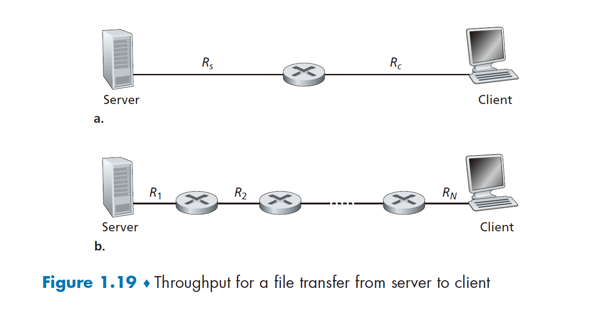

图 1-19b 此时显示了一个在服务器和客户之间具有 N 条链路的网络，这 N 条链路的传输速率分别是 R1, R2, ..., Rn。应用对两条链路网络的分析方法，我们发现从服务器到客户的文件传输吞吐量是 min｛R1, R2, ..., Rn}，这同样仍是沿着服务器和客户之间路径的瓶颈链路的速率。

现在考虑由当前因特网所引发的另一个例子。图 1-20a 显示了与一个计算机网络相连的两个端系统：一台服务器和一个客户。考虑从服务器向客户传送一个文件的吞吐量。服务器以速率为 Rs 的接入链路与网络相连，且客户以速率为 Rc 的接入链路与网络相连。现在假定在通信网络核心中的所有链路具有非常高的传输速率，即该速率比 Rs 和 Rc 要高得多。目前因特网的核心的确超量配置了高速率的链路，从而很少出现拥塞。同时假定在整个网络中发送的比特都是从该服务器到该客户。在这个例子中，因为计算机网络的核心就像一个粗大的管子，所以比特从源向目的地的流动速率仍是 Rs 和 Rc 中的最小者，即吞吐量 = min {Rs, Rc}。因此，在今天因特网中对吞吐量的限制因素通常是接入网。

作为最后一个例子，考虑图 1-20b,其中有 10 台服务器和 10 个客户与某计算机网络 核心相连。在这个例子中，同时发生 10 个下载，涉及 10 个客户-服务器对。假定这 10 个下载是网络中当时的唯一流量。如该图所示，在核心中有一条所有 10 个下载通过的链路。将这条链路的传输速率表示为 R。假定所有服务器接入链路具有相同的速率 Rs，所有客户接入链路具有相同的速率 Rc，并且核心中除了速率为 R 的一条共同链路之外的所有链路，它们的传输速率都比 R、Rs 和 Rc 大得多。现在我们要问，这种下载的吞吐量是多少？显然，如果该公共链路的速率 R 很大，比如说比 Rs 和 Rc 大 100 倍，则每个下载的吞吐量将仍然是 min｛Rs, Rc}。 但是如果该公共链路的速率与 Rs 和 Rc 有相同量级会怎样呢？在这种情况下其吞吐量将是多少呢？让我们观察一个特定的例子。假定 Rs = 2Mbps, Rc = 1 Mbps, R = 5Mbps,并且公共链路为 10 个下载平等划分它的传输速率。这时每个下载的瓶颈不再位于接入网中，而是位于核心中的共享链路了，该瓶颈仅能为每个下载提供 500 kbps 的吞吐量。因此每个下载的端到端吞吐量现在减少到 500 kbps。

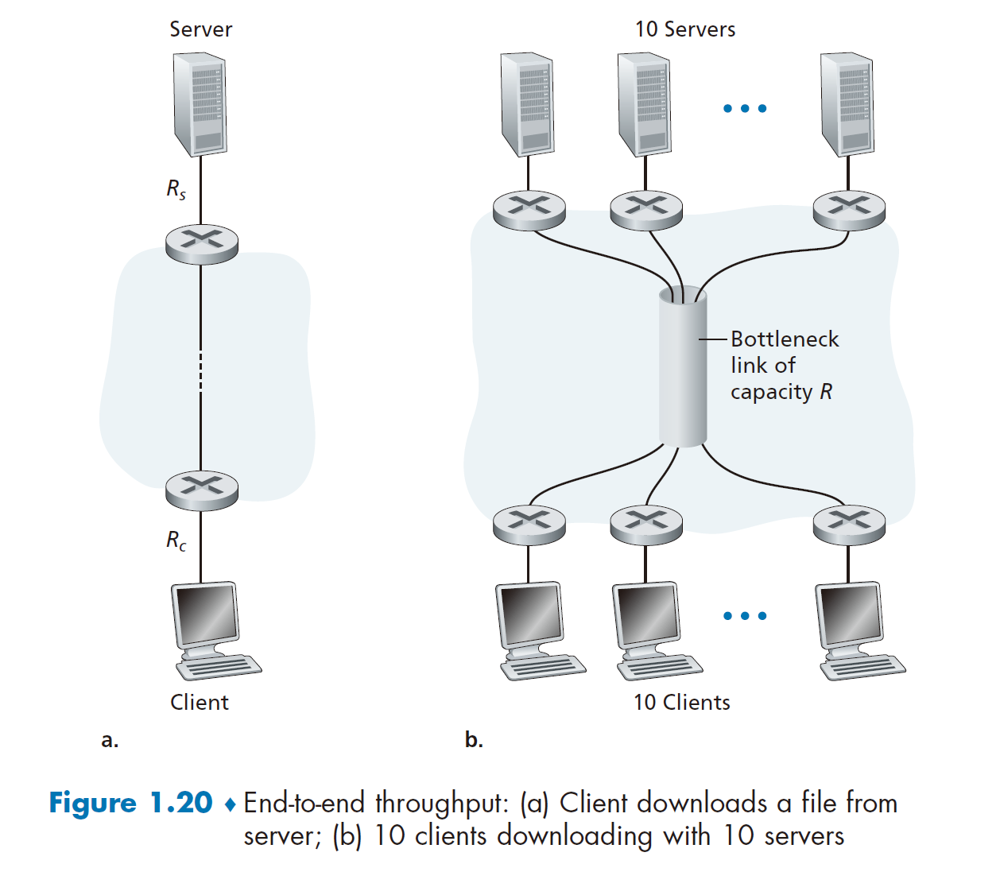

图 1-19 和图 1-20 中的例子说明吞吐量取决于数据流过的链路的传输速率。我们看到当没有其他干扰流量时，其吞吐量能够近似为沿着源和目的地之间路径的最小传输速率。图 1-20b 中的例子更一般地说明了吞吐量不仅取决于沿着路径的传输速率，而且取决于干扰流量。特别是，如果许多其他的数据流也通过这条链路流动，一条具有高传输速率的链路仍然可能成为文件传输的瓶颈链路。我们将在课后习题中和后继章节中更仔细地研究计算机网络中的吞吐量。

## 1.6. 计算机网络的安全性

对于今天的许多机构（包括大大小小的公司、大学和政府机关）而言，因特网已经成为与其使命密切相关的一部分了。许多人也依赖因特网从事各种职业、社会和个人活动。目前，数以亿计的物品（包括可穿戴设备和家用设备）与因特网相连。但是在所有这一切背后，存在着一个阴暗面，其中的“坏家伙”试图对我们的日常生活进行破坏，如损坏我们与因特网相连的计算机，侵犯我们的隐私以及使我们依赖的因特网服务无法运行。

网络安全领域主要探讨以下问题：坏家伙如何攻击计算机网络，以及我们（即将成为计算机网络的专家）如何防御以免受他们的攻击，或者更好的是设计能够事先免除这样的攻击的新型体系结构。面对经常发生的各种各样的现有攻击以及新型和更具摧毁性的未来攻击的威胁，网络安全已经成为近年来计算机网络领域的中心主题。本书的特色之一是将网络安全问题放在中心位置。

因为我们在计算机网络和因特网协议方面还没有专业知识，所以这里我们将从审视某 些今天最为流行的与安全性相关的问题开始。这将刺激我们的胃口，以便我们在后续章节中进行更为充实的讨论。我们在这里以提岀问题开始：什么会出现问题？计算机网络是如何受到攻击的？今天一些最为流行的攻击类型是什么？

### 1.6.1. 恶意软件

因为我们要从/向因特网接收/发送数据，所以我们将设备与因特网相连。这包括各种好东西，例如 Instagram 帖子、因特网搜索结果、流式音乐、视频会议、流式电影等。但不幸的是，伴随好的东西而来的还有恶意的东西，这些恶意的东西可统称为 **恶意软件(malware)**，它们能够进入并感染我们的设备。一旦恶意软件感染我们的设备，就能够做各种不正当的事情，包括删除我们的文件，安装间谍软件来收集我们的隐私信息，如身份证号、口令和击键，然后将这些（当然经因特网）发送给坏家伙。我们的受害主机也可能成为数以千计的类似受害设备网络中的一员，它们被统称为 **僵尸网络(botnet)**，坏家伙利用僵尸网络控制并有效地对目标主机展开垃圾邮件分发或分布式拒绝服务攻击（很快将讨论）。

至今为止的多数恶意软件是 **自我复制(self-replicating)** 的：一旦它感染了一台主机，就会从那台主机寻求进人因特网上的其他主机，从而形成新的感染主机，再寻求进入更多的主机。以这种方式，自我复制的恶意软件能够指数式地快速扩散。恶意软件能够以病毒或蠕虫的形式扩散。**病毒(virus)** 是一种需要某种形式的用户交互来感染用户设备的恶意软件。典型的例子是包含恶意可执行代码的电子邮件附件。如果用户接收并打开这样的附件，不经意间就在其设备上运行了该恶意软件。通常，这种电子邮件病毒是自我复制的: 例如，一旦执行，该病毒可能向用户地址簿上的每个接收方发送一个具有相同恶意附件的相同报文。**蠕虫(worm)** 是一种无须任何明显用户交互就能进入设备的恶意软件。例如，用户也许运行了一个攻击者能够发送恶意软件的脆弱网络应用程序。在某些情况下，没有用户的任何干预，该应用程序可能从因特网接收恶意软件并运行它，生成了蠕虫。新近感染设备中的蠕虫则能扫描因特网，搜索其他运行相同网络应用程序的易受感染的主机。当它发现其他易受感染的主机时，便向这些主机发送一个它自身的副本。今天，恶意软件无所不在且防范成本高。当你用这本书学习时，我们鼓励你思考下列问题：计算机网络设计者能够采取什么防御措施，以使与因特网连接的设备免受恶意软件的攻击？

### 1.6.2. 拒绝服务(DoS)

另一种宽泛类型的安全性威胁称为 **拒绝服务攻击(Denial-of-Service (DoS) attack)**。 顾名思义，DoS 攻击使得网络、主机或其他基础设施部分不能由合法用户使用。Web 服务器、电子邮件服务器、DNS 服务器（在第 2 章中讨论）和机构网络都能够成为 DoS 攻击的目标。因特网 DoS 攻击极为常见，每年会出现数以千计的 DoS 攻击［Moore 2001］。访问数字攻击图（Digital Attack Map）站点可以可视化了世界范围内每天最厉害的 DoS 攻击［DAM 2020］。大多数因特网 DoS 攻击属于下列三种类型之一：

- 弱点攻击。这涉及向一台目标主机上运行的易受攻击的应用程序或操作系统发送精心制作的报文。如果适当顺序的多个分组发送给一个易受攻击的应用程序或操作系统，该服务器可能停止运行，或者更糟糕的是主机可能崩溃。
- 带宽洪泛。攻击者向目标主机发送大量的分组，分组数量之多使得目标的接入链路变得拥塞，使得合法的分组无法到达服务器。
- 连接洪泛。攻击者在目标主机中创建大量的半开或全开 TCP 连接(将在第 3 章中讨论 TCP 连接)。该主机因这些伪造的连接而陷入困境，并停止接受合法的连接。

我们现在更详细地研究这种带宽洪泛攻击。回顾 1-4-2 节中讨论的时延和丢包问题，显然，如果某服务器的接入速率为 R bps，则攻击者将需要以大约 R bps 的速率来产生危害。如果 R 非常大的话，单一攻击源可能无法产生足够大的流量来伤害该服务器。此外，如果从单一源发岀所有流量的话，某上游路由器就能够检测出该攻击并在该流量靠近服务器之前就将其阻挡下来。在图 1-25 中显示的 **分布式 DoS(Distributed DoS, DDoS)** 中，攻击者控制多个源并让每个源向目标猛烈发送流量。使用这种方法，遍及所有受控源的聚合流量速率需要大约 R 的能力来使该服务陷入瘫痪。DDoS 攻击充分利用由数以千计的受害主机组成的僵尸网络，这在今天是屡见不鲜的［DAM 2020］。相比于来自单一主机的 DoS 攻击，DDoS 攻击更加难以检测和防范。

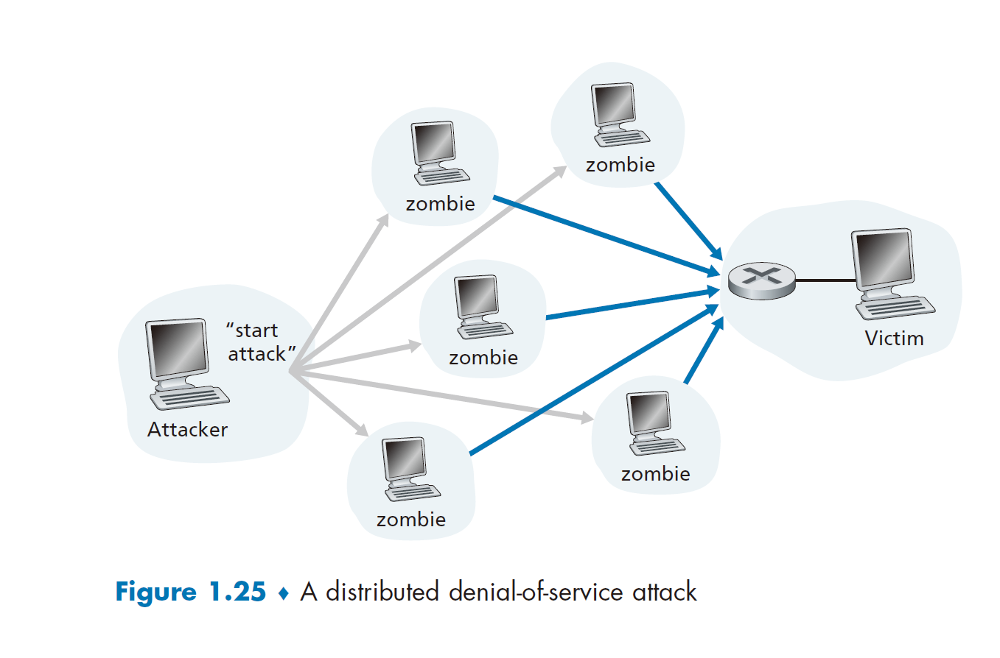

当学习这本书时，我们鼓励你考虑下列问题：计算机网络设计者能够采取哪些措施防止 DoS 攻击？我们将看到，对于 3 种不同类型的 DoS 攻击需要采用不同的防御方法。

### 1.6.3. 嗅探分组

今天的许多用户经无线设备接入因特网，如 WiFi 连接的膝上计算机或使用蜂窝因特网连接的手持设备(在第 7 章中讨论)。无所不在的因特网接入极为便利并让移动用户方便地使用令人惊奇的新应用程序的同时，也产生了严重的安全脆弱性：在无线传输设备的附近放置一台被动的接收机，该接收机就能得到传输的每个分组的副本！这些分组包含了各种敏感信息，包括口令、身份证号、商业秘密和隐秘的个人信息。记录每个流经的分组副本的被动接收机被称为 **分组嗅探器(packet sniffer)**。

嗅探器也能够部署在有线环境中。在有线的广播环境中，如在许多以太网 LAN 中，分组嗅探器能够获得经该 LAN 发送的所有分组。如在前面描述的那样，电缆接入技术也广播分组，因此易于受到嗅探攻击。此外，获得某机构与因特网连接的接入路由器或接入链路访问权的坏家伙能够放置一台嗅探器以产生从该机构出入的每个分组的副本，再对嗅探到的分组进行离线分析，就能得出敏感信息。

分组嗅探软件在各种 Web 站点上可免费得到，这类软件也有商用的产品。教网络课程的教授布置的实验作业就涉及写一个分组嗅探器和应用层数据重构程序。与本书相关联的 Wireshark [Wireshark 2020］实验（参见本章结尾处的 Wireshark 实验介绍）使用的正是这样一种分组嗅探器！

因为分组嗅探器是被动的，也就是说它们不向信道中注入分组，所以难以检测到它们。因此，当我们向无线信道发送分组时，我们必须接受这样的可能性，即某些坏家伙可能记录了我们的分组的副本。如你已经猜想的那样，最好的防御嗅探的方法基本上都与密码学有关。我们将在第 8 章研究密码学应用于网络安全的有关内容。

### 1.6.4. 信任伪装

生成具有任意源地址、分组内容和目的地址的分组，然后将这个人工制作的分组传输到因特网中，因特网将忠实地将该分组转发到目的地，这一切都极为容易（当你学完这本教科书后，你将很快具有这方面的知识了！）。想象某个接收到这样一个分组的不会猜疑的 接收方（比如说一台因特网路由器），将该（虚假的）源地址作为真实的，进而执行某些嵌入在该分组内容中的命令（比如说修改它的转发表）。将具有虚假源地址的分组注入因特网的能力被称为 **IP 哄骗(IP spoofing)**，而它只是一个用户能够冒充另一个用户的许多方式中的一种。

为了解决这个问题，我们需要采用端点鉴别，即一种使我们能够确信一个报文源自我们认为它应当来自的地方的机制。当你继续学习本书各章时，再次建议你思考怎样为网络应用程序和协议做这件事。我们将在第 8 章探讨端点鉴别机制。

在本节结束时，值得思考一下因特网是如何从一开始就落入这样一种不安全的境地的。大体上讲，答案是：因特网最初就是基于“一群相互信任的用户连接到一个透明的网 络上”这样的模型［Blumenthal 2001］进行设计的，在这样的模型中，安全性是没有必要的。初始的因特网体系结构在许多方面都深刻地反映了这种相互信任的理念。例如，一个用户向任何其他用户发送分组的能力是默认的，而不是一种请求/准予的能力，还有用户身份取自所宣称的表面价值，而不是默认地需要鉴别。

但是今天的因特网无疑并不涉及“相互信任的用户”。但是，今天的用户仍然需要通信，当他们不必相互信任时，他们也许希望匿名通信，也许间接地通过第三方通信（例如我们将在第 2 章中学习的 Web 代理，我们将在第 7 章学习的移动性协助代理），也许不信任他们通信时使用的硬件、软件甚至空气。随着我们进一步学习本书，会面临许多安全性相关的挑战：我们应当寻求对嗅探、端点假冒、中间人攻击、DDoS 攻击、恶意软件等的防护办法。我们应当记住：在相互信任的用户之间的通信是一种例外而不是规则。欢迎你到现代计算机网络世界！

## 1.7. 计算机网络的历史

1. 分组交换的发展(1961-1972)
2. 专用网络和网络互联(1972-1980)
3. 网络的激增(1980-1990)
4. Internet 的爆炸(1990-2000)
5. 最新发展(2000 至今)

- 家庭接入网的普及和更迭
- LTE(4G)的发展和 WiFi 的普及
- 在线社交网络的发展
- 在线服务提供商部署了自己的专属网络
- 云技术的发展

## 1.8. 实验 1：熟悉 wireshark

### 1.8.1. 分组嗅探器

用来观察执行协议实体之间交换的报文的基本工具称为**分组嗅探器（packet sniffer）**。

顾名思义，一个分组嗅探器被动地拷贝（嗅探）由你的计算机发送和接收的报文；它也能显示出这些被捕获报文的各个协议字段的内容。

图 1-28 中显示了一个常见的分组嗅探器： Wireshark 的截图。

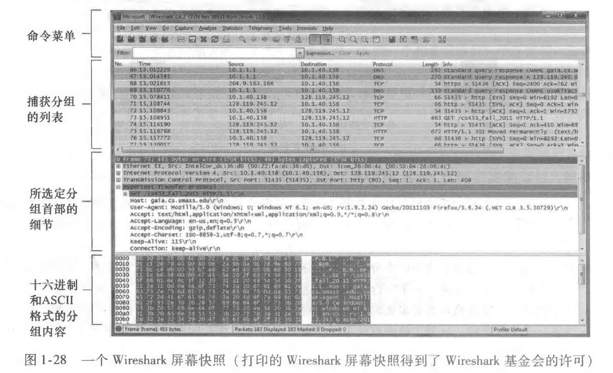

下图描述了分组嗅探器的工作原理。

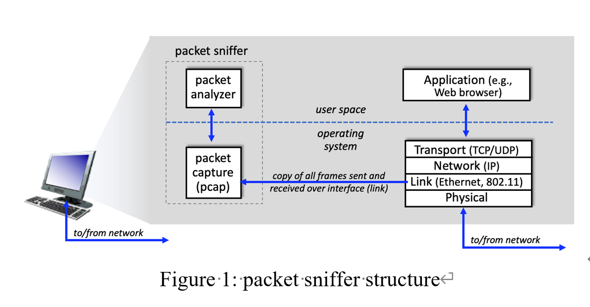

观察上图，在图的右边是分布式应用(如 Web 浏览器)，下面是支撑应用的网络协议层：传输层(TCP/IP)，网络层(IP)，数据链路层(以太网协议，802.11 WiFi 协议)，最后是物理层。图片左边是分组嗅探器，它由 2 部分构成：**分组分析器(packet analyzer)** 和 **分组捕获器(packet capturer)**。

分组捕获器被动地复制来自链路层的分组，回忆一下我们在第 1.5 节讨论到的内容。这些分组称为帧。帧封装了来自网络层的首部字节 Hn，以及来自运输层的首部字节 Ht，当然还有应用层报文 M。

分组分析器可以分析出分组的结构，以便展示出一个应用层报文的内容的字段。比如，我们现在对 HTTP 报文的字段比较感兴趣。分组分析器首先要理解来自数据链路层的帧(以太网帧或 WiFi 帧)的格式，以便它识别出来自网络层的数据报。它也要理解数据报的格式，以便它识别出来自运输层的报文段(TCP 报文段)。最终，分组分析器理解了 TCP 报文段的格式，识别出来自应用层的 HTTP 报文。接着，分组分析器提取出了 HTTP 报文的字段(如 HTTP 请求报文中请求行的请求方法字段，它的值可以为 GET，POST，或 HEAD)，参考图 2.8。

### 1.8.2. wireshark

我们将使用 wireshark 分组嗅探器来实验。wireshark 是一个多平台，免费的分组嗅探器。wireshark 拥有大量的用户，完善的指导文档(你可以在 http://www.wireshark.org/ wireshark 的官网找到)和 FAQ。此外，wireshark 拥有丰富的功能和设计良好的用户界面。

1. **获取 wireshark**

你可以在[这里](https://www.wireshark.org/download.html)下载 wireshark。

2. **运行 wireshark**

第一次运行 wireshark 后，你将会看到类似下面的屏幕截图。

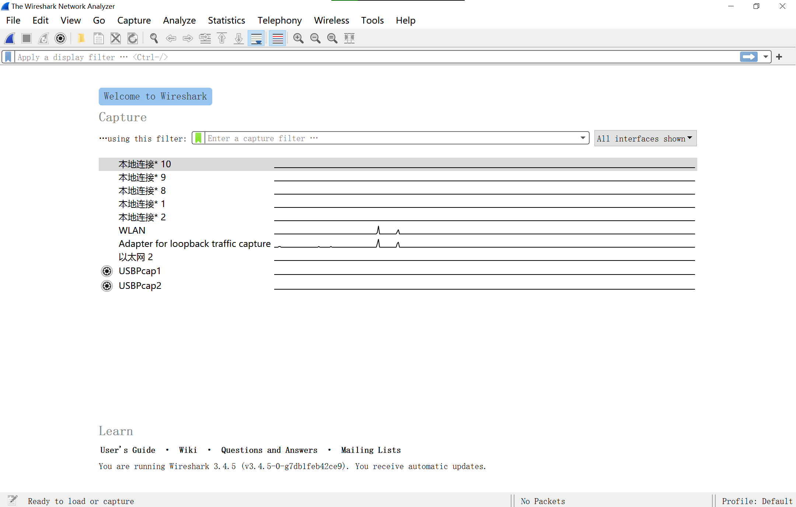

不同的平台，如 windows 和 macos，不同的语言设置和 wireshark 版本都会影响第一次运行后的界面。不过 wireshark 提供的功能大部分是相同的。这张屏幕截图在 windows 10，wireshark v3.4.5 环境。

在这张图中，注意到在 Capture 下面的列表中有许多所谓的接口。其中 WLAN 表示这台电脑的 WiFi 接入。双击其中一个接口，可以捕获来自这个接口的帧。本电脑使用了 WiFi 接入，所以我们双击 WLAN，就可以开始捕获来自 WLAN 的帧。

下图展示了捕获分组时的界面。

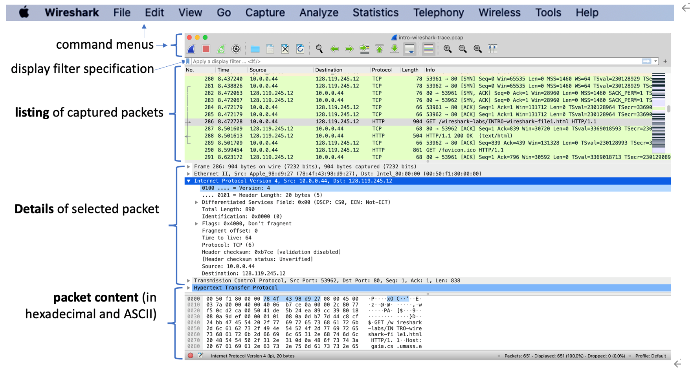

这个界面包含了从上到下的 5 个部分：

- **命令菜单**

命令菜单包含了常见的 wireshark 命令。其中的 **File** 下拉菜单项用于打开以及保存捕获的分组信息文件。**Capture** 下拉菜单项用于选择一项网络接口进行捕获。下面的一栏包含了常用的操作，第 1 个蓝色的鲨鱼图标按钮为捕获操作，第 2 个红色的(没有处于捕获期间为灰色，不可点击)按钮为停止捕获操作，第 3 个绿色的鲨鱼图标按钮用于重启当前的捕获。接着的 4 个按钮为用于捕获文件上的操作。第 1 个按钮用于打开捕获的文件，第 2 个按钮用于保存捕获文件，第 3 个按钮关闭当前的捕获文件，第 4 个按钮用于重载捕获文件。剩下的按钮以后再讨论。

- **过滤框**

过滤框用于过滤分组列表中的信息。如，输入 http 可以只保留协议为 HTTP 的分组。

- **分组列表**

分组列表显示了捕获到的每一个分组的摘要，包含了分组的序号(由 wireshark 指定的序号)，分组捕获时的时间，源地址和目的地址，协议类型，以及协议中的简要内容信息。

- **已选分组信息窗**

这个窗口提供了选择的分组(高亮)的详细信息。这些信息包含了以太网帧(或 WLAN 帧)，IP 数据报，TCP(或 UDP)报文段，以及应用层的报文(如果使用了应用层协议)。这些信息可以点击箭头展开和收起。

- **分组详细内容窗**

这个窗口提供了帧的内容。有 2 种方式：16 进制以及 ASCII 方式。

3. **用 wireshark 做一次测试**

现在我们使用 wireshark 做一次测试。我们假设你的电脑使用了以太网接入或 WiFi 接入。

执行以下的步骤：

- 打开你的浏览器，新建一个 Tab。
- 打开 wireshark，选择你电脑的网络接口开始捕获。
- 此时，切换到浏览器的 Tab，键入 http://gaia.cs.umass.edu/wireshark-labs/INTRO-wireshark-file1.html 等待网页加载完成。
- 在 wireshark 中，使用过滤框，键入 http，就可以发现我们刚才的浏览器活动。

- 选择 HTTP 请求分组，在已选分组信息窗，找到 HTTP 协议，其中就有请求行中的 GET 方法字段。

如下图所示：

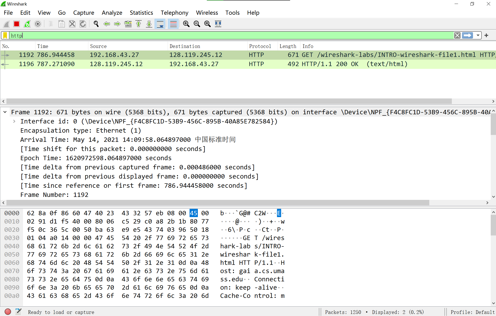

# 2. 应用层

**time : 2021-06-18**

网络应用是 Internet 存在的理由和发展的驱动力。在 Internet 出现以后，数不胜数的网络应用被开发了出来。

在 1970 和 1980 年代，经典的基于文本的网络应用十分流行。在 1990 年代中期，万维网变得非常火热，万维网涉及了网上冲浪，搜索，以及电子商务。2000 年后，更有竞争力的网络应用开始涌现，包括语音电话和视频会议(如：Skype，Facetime，和 Google Hangouts)，用户生成视频(如 Youtube)和网上影院(如 Netflix)，多人在线游戏(如第 2 人生)。同时，我们还看到新一代网络社交应用的出现，如 Facebook，Instagram，和 Twitter。近来，伴随着智能手机和 4G/5G 无线网络的到来，更多基于位置的应用涉及租房(如 Yelp)，约会(Tinder)，道路流量监控(Waz)，以及移动支付应用(如 WeChat 和 WhatsApp)出现了。

在本章，我们将学习网络应用的概念和简单实现。一开始我们会讨论关键的应用层概念，包括应用需要的服务，客户和服务器，进程，以及运输层接口。我们会仔细查看几个网络应用，包括 Web，e-mail，peer-to-peer(P2P)文件分发，以及视频流。之后，我们会讨论网络应用的开发，包含 TCP 和 UDP。具体来说，我们会学习套接字接口，并用 Python 编写一些简单的客户服务器程序。

## 2.1. 应用层协议原理

网络应用程序需要应用开发者在不同的端系统上开发对应的应用程序。

网络核心设备如分组交换机等没有实现网络层以上的协议，因此不需要开发者在网络核心设备上开发程序。

### 2.1.1. 进程通信

网络应用程序之间的通信具体上是 **进程** 之间的通信。一个进程可以理解为运行在端系统上的一个程序。当多个进程运行在同一个操作系统时，他们使用进程间通信机制进行通信，这个机制由操作系统确定。在本书中，我们关注的是运行在不同端系统上进程之间的通信。

1. **客户和服务器进程**

网络应用程序由成对的进程组成，这些进程通过网络相互发送报文。例如，在 Web 应用程序中，一个客户浏览器进程与一台 Web 服务器进程交换报文。在一个 P2P 文件共享系统中，文件从一个对等方中的进程传输到另一个对等方中的进程。对每对通信进程, 我们通常将这两个进程之一标识为客户,而另一个进程标识为服务器。 对于 Web 而言，浏览器是一个客户进程，Web 服务器是一台服务器进程。对于 P2P 文件 共享，下载文件的对等方标识为客户，上传文件的对等方标识为服务器。

2. **进程与计算机网络之间的接口**

如上所述，多数应用程序是由通信进程对组成，每对中的两个进程互相发送报文。从一个进程向另一个进程发送的报文必须通过下面的网络。进程通过一个称为 **套接字(socket)** 的软件接口向网络发送报文和从网络接收报文。

图 2-3 显示了两个经过 Internet 通信的进程之间的套接字通信（图 2-3 中假定由该进程使用的下面运输层协议是 Internet 的 TCP 协议）。如该图所示，套接字是同一台主机内应用层与运输层之间的接口。由于该套接字是建立网络应用程序的可编程接口，因此套接字也称为应用程序和网络之间的 **应用程序编程接口(Application Programming Interface, API)**。应用程序开发者可以控制套接字在应用层端的一切，但是对该套接字的运输层端几乎没有控制权。应用程序开发者对于运输层的控制仅限于：1.选择运输层协议；2. 可以设定几个运输层参数，如最大缓存和最大报文段长度等（将在第 3 章中涉及）。一旦应用程序开发者选择了一个运输层协议（如果可供选择的话），则应用程序就建立在由该协议提供的运输层服务之上。我们将在 2-7 节中对套接字进行更为详细的探讨。

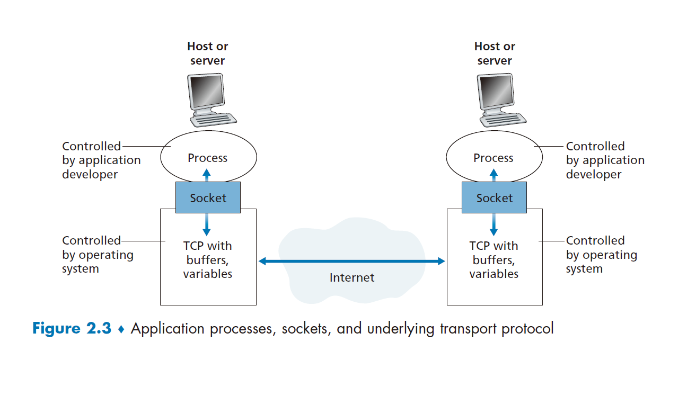

3. **进程寻址**

为了向特定目的地发送邮政邮件，目的地需要有一个地址。类似地，在一台主机上运行的进程为了向在另一台主机上运行的进程发送分组，接收进程需要有一个地址。为了标识该接收进程，需要定义两种信息：1. 主机的地址；2. 在目的主机中指定接收进程的标识符。其中主机地址由 **IP 地址标识**。进程由 **端口号** 标识。例如，Web 服务器进程默认用 80 端口标识，邮件服务器进程默认用 25 标识。常见的端口号可以在[这里](https://zh.wikipedia.org/wiki/TCP/UDP%E7%AB%AF%E5%8F%A3%E5%88%97%E8%A1%A8)找到。我们将在第三章详细学习。

### 2.1.2. 可供应用程序使用的运输层服务

前面讲过套接字是应用程序进程和运输层协议之间的接口。

一个运输层协议能够为调用它的应用程序提供什么样的服务呢？我们大体能够从四个方面对应用程序服务要求进行分类：**可靠数据传输**、**吞吐量**、**时延** 和 **安全性**。

1. **可靠数据传输**

如第 1 章讨论的那样，分组在计算机网络中可能丢失。例如，分组能够使路由器中的缓存溢岀，或者当分组中的某些比特损坏后可能被丢弃。像电子邮件、文件传输、远程主机访问、Web 文档传输以及金融应用等这样的应用，数据丢失可能会造成灾难性的后果(在后一种情况下，无论对银行或对顾客都是如此！)

因此，为了支持这些应用，必须做一些工作以确保由应用程序的一端发送的数据正确、完全地交付给该应用程序的另一端。如果一个协议提供了这样的确保数据交付服务，就认为提供了 **可靠数据传输**。

当一个运输层协议不提供可靠数据传输时，由发送进程发送的某些数据可能到达不了接收进程。这可能能被 **容忍丢失** 的应用所接受，最值得注意的 是多媒体应用，如交谈式音频/视频，它们能够承受一定量的数据丢失。在这些多媒体应用中，丢失的数据引起播放的音频/视频出现小干扰，而不是致命的损伤。

2. **吞吐量**

在第 1 章中我们引入了可用吞吐量的概念，在沿着一条网络路径上的两个进程之间的通信会话场景中，可用吞吐量就是发送进程能够向接收进程交付比特的速率。因为其他会话将共享沿着该网络路径的带宽，并且因为这些会话将会到达和离开，该可用吞吐量将随时间波动。

这样的确保吞吐量的服务将对许多应用程序有吸引力。例如，如果 Internet 电话应用程序对语音以 32kbps 的速率进行编码， 那么它需要以这个速率向网络发送数据，并以该速率向接收应用程序交付数据。如果运输 协议不能提供这种吞吐量，该应用程序或以较低速率进行编码（并且接收足够的吞吐量以 维持这种较低的编码速率），或它可能必须放弃发送.这是因为对于这种 Internet 电话应用 而言，接收所需吞吐量的一半是几乎没有或根本没有用处的。具有吞吐量要求的应用程序 被称为 **带宽敏感的应用**。许多当前的多媒体应用是带宽敏感的，尽管某些多媒体应用程序可能采用自适应编码技术对数字语音或视频以与当前可用 带宽相匹配的速率进行编码。

带宽敏感的应用具有特定的吞吐量要求，而弹性应用能够根据当时可用的带宽或多或少地利用可供使用的吞吐量。电子邮件、文件传输以及 Web 传送都属于 **弹性应用**。当然，吞吐量是越多越好。

3. **时延**

运输层协议也能提供定时保证。如同具有吞吐量保证那样，定时保证能够以多种形式实现。一个保证的例子如：发送方注入进套接字中的每个比特到达接收方的套接字不迟于 100ms。这种服务将对交互式实时应用程序有吸引力，如 Internet 电话、虚拟环境、电话会 议和多方游戏，所有这些服务为了有效性而要求数据交付有严格的时间限制。例如，在 Internet 电话中，较长的时延会导致会话中出现不自然的停顿；在多方游戏和虚拟互动环境中，在做出动作并看到来自环境（如来自位于端到端连接中另一端点的玩家）的响应之间，较长的时延使得它失去真实感。对于非实时的应用，较低的时延总比较高的时延好，但对端到端的时延没有严格的约束。

4. **安全性**

最后，运输协议能够为应用程序提供一种或多种安全性服务。例如，在发送主机中，运输协议能够加密由发送进程传输的所有数据，在接收主机中，运输层协议能够在将数据交付给接收进程之前解密这些数据。这种服务将在发送和接收进程之间提供机密性，以防该数据以某种方式在这两个进程之间被观察到。运输协议还能提供除了机密性以外的其他安全性服务，包括数据完整性和端点鉴别，我们将在第 8 章中详细讨论这些主题。

### 2.1.3. Internet 提供的运输层服务

至此，我们已经考虑了计算机网络能够提供的通用运输服务。现在我们要更为具体地考察由 Internet 提供的运输服务类型。Internet（更一般的是 TCP/IP 网络）为应用程序提供两个运输层协议，即 UDP 和 TCP。当你（作为一个软件开发者）为 Internet 创建一个新的应用时，首先要做出的决定是，选择 UDP 还是选择 TCP。每个协议为调用它们的应用程序 提供了不同的服务集合。图 2-4 显示了某些所选的应用程序的服务要求。

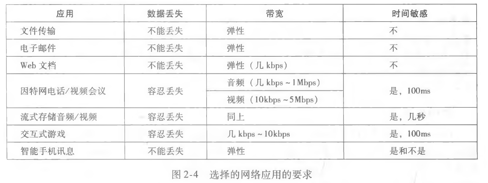

1. **TCP 服务**

TCP 服务模型包括面向连接服务和可靠数据传输服务。当某个应用程序调用 TCP 作为其运输协议时，该应用程序就能获得来自 TCP 的这两种服务。

- 面向连接的服务：在应用层数据报文开始流动之前，TCP 让客户和服务器互相交换运输层控制信息。这个所谓的握手过程提醒客户和服务器，让它们为大量分组的到来做好准备。在握手阶段后，一个 **TCP 连接(TCP connection)** 就在两个进程的套接字之间建立了。这条连接是全双工的，即连接双方的进程可以在此连接上同时进行报文收发。当应用程序结束报文发送时，必须拆除该连接。在第 3 章中我们将详细讨论面向连接的服务，并分析它是如何实现的。

- 可靠的数据传送服务：通信进程能够依靠 TCP,无差错、按适当顺序交付所有发送的数据。当应用程序的一端将字节流传进套接字时，它能够依靠 TCP 将相同的字节流交付给接收方的套接字，而没有字节的丢失和冗余。

TCP 协议还具有拥塞控制机制，这种服务不一定能为通信进程带来直接好处，但能为 Internet 带来整体好处。当发送方和接收方之间的网络出现拥塞时，TCP 的拥塞控制机制会抑制发送进程（客户或服务器）。如我们将在第 3 章中所见，TCP 拥塞控制也试图限制每个 TCP 连接，使它们达到公平共享网络带宽的目的。

2. **UDP 服务**

UDP 是一种不提供不必要服务的轻量级运输协议，它仅提供最小服务。UDP 是无连接的，因此在两个进程通信前没有握手过程。UDP 协议提供一种不可靠数据传送服务，也就是说，当进程将一个报文发送进 UDP 套接字时，UDP 协议并不保证该报文将到达接收进程。不仅如此，到达接收进程的报文也可能是乱序到达的。

UDP 没有包括拥塞控制机制，所以 UDP 的发送端可以用它选定的任何速率向其下层（网络层）注入数据。（然而，值得注意的是实际端到端吞吐量可能小于该速率，这可能是因为中间链路的带宽受限或因为拥塞而造成的。

流行 Internet 应用的应用层协议和运输层协议如图 2-5 所示。

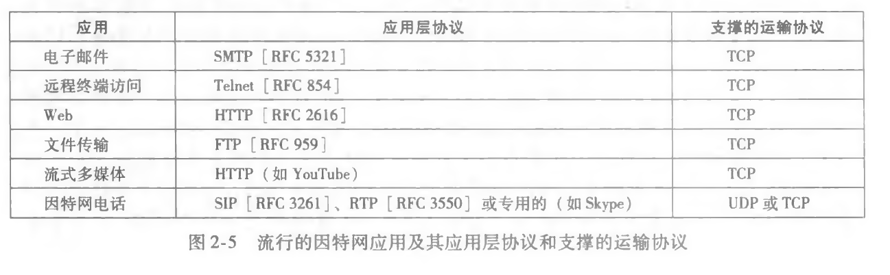

### 2.1.4. 应用层协议

我们刚刚学习了通过把报文发送进套接字实现网络进程间的相互通信。但是如何构造这些报文？在这些报文中的各个字段的含义是什么？进程何时发送这些报文？这些问题将我们带进应用层协议的范围。应用层协议定义了运行在不同端系统上的应用程序进程如何相互传递报文。特别是应用层协议定义了：

- **交换的报文类型**，例如请求报文和响应报文。
- **各种报文类型的语法**，如报文中的各个字段及这些字段是如何描述的。
- **字段的语义**，即这些字段中的信息的含义。
- **确定一个进程何时以及如何发送报文，对报文进行响应的规则**。

有些应用层协议是由 RFC 文档定义的，因此它们位于公共域中。例如，Web 的应用层协议 HTTP （超文本传输协议[RFC 7230］）就作为一个 RFC 可供使用。如果浏览器开发者遵从 HTTP RFC 规则，所开发出的浏览器就能访问任何遵从该文档标准的 Web 服务器并获取相应 Web 页面。还有很多别的应用层协议是专用的，有意不为公共域使用。例如，Skype 使用了专用的应用层协议。

区分网络应用和应用层协议是很重要的。应用层协议只是网络应用的一部分。我们来看一些例子。Web 是一种客户-服务器应用，它允许客户按照需求从 Web 服务器获得文档。该 Web 应用有很多组成部分，包括文档格式的标准（即 HTML）、Web 浏览器、 Web 服务器，以及一个应用层协议。Web 的应用层协议是 HTTP，它定义了在浏览器和 Web 服务器之间传输的报文格式和时序。因此，HTTP 只是 Web 应用的一个部分（尽管是重要部分）。举另外一个例子，将在 2-6 节讨论的 Netflix 视频服务也有许多组成部分，包括储存和传输视频的服务器，管理账单和客户相关功能的服务器，客户(你智能手机，平板电脑或者笔记本上的 Netflix app)，以及一个应用层协议称为 DASH，它定义了 Netflix 客户和服务器之间交换报文的格式和时序。因此，应用层协议 DASH 只是 Netflix 应用的一部分。

### 2.1.5. 本书涉及的网络应用

在本书中，我们会讨论 5 种流行的网络应用程序，包括：Web，电子邮件，DNS，P2P 和流式视频。

## 2.2. Web 和 HTTP

**time : 2021-05-06**

截至到 1990 年代早期，Internet 主要被研究员，学者，和大学学生用来登录远程主机，上传本地文件到远程主机，从远程主机下载文件，接收和发送新闻或电子邮件。虽然这些应用极其有用，但 Internet 只局限于研究和学着的圈子。之后，一个新的应用到来了，那就是万维网[Berners-Lee 1994]。万维网是第一个进入大众视野的应用，它极大地改变了人们的工作和生活方式。

万维网最吸引人的一点就是用户可以随时地获取他们想要的东西。这不同与广播和电视，用户智能在固定的时间观看内容提供者提供的内容。此外，用户在万维网上可以容易和低廉地发布内容。超链接和搜索引擎帮助用户在信息的海洋中导航。图片和视频刺激着用户的感官。JavaScript 和表单使得用户可以和网页交互。Web 和 HTTP 也用于 Youtube，e-mail(如 GMail)，以及大部分移动网络应用，如 Instagram 和 Google Maps。

### 2.2.1. HTTP 概述

Web 的应用层协议 **超文本传输协议(HyperText Transfer Protocol, HTTP)** 是 Web 的核心。HTTP 定义在 [RFC 1945]，[RFC 7230] 和 [RFC 7540]中。HTTP 由 2 个程序实现：一个客户程序和一个服务器程序。客户程序和服务器程序运行在不同的主机之上，互相交换 HTTP 报文。HTTP 定义了报文的格式，字段的语义以及程序之间交换报文的时序。在详细解释 HTTP 之前，我们先来简单地看一下 Web 相关的术语。

一个 Web 页面（或 Web 文档）是由对象构成的。一个对象就是一个文件，这些文件可以是 HTML 文件，图片，视频，javascript 脚本，CSS 样式文件，这些文件可以由唯一的 URL 来定位。大部分 Web 页面由一个 HTML 基本文件和若干个引用对象构成。例如，如果一个 Web 页面由一个基本的 HTML 文件和 5 个图片构成，那么这个 Web 页面有 6 个对象：一个 HTML 基本文件和 5 个图片。这个 HTML 基本文件通过对象的 URL 地址引用他们。每个 URL 地址有个重要的 2 部分：存放对象的主机名和这个对象的路径。例如：http://www.someSchool.edu/someDepartment/picture.gif 的主机名为 www.someSchool.edu，对象路径为 `/someDepartment/picture.gif`。**Web 浏览器** 如 Google chrome 和 Firefox 是常见的 HTTP 客户程序。所以我们可能交换地使用浏览器和客户来指代 HTTP 客户。**Web 服务器** 包括 Apache 和 Microsoft Internet Information Server 实现了 HTTP 服务器程序。

HTTP 定义了 Web 客户向 Web 服务器请求 Web 页面的方式，以及 Web 服务器向 Web 客户响应的方式。如图 2-6 所示。HTTP 使用 TCP 作为它的运输层协议。HTTP 客户首先发起一个与服务器的 TCP 连接。一旦连接建立，该浏览器和服务器就可以通过套接字使用 TCP。客户向他的套接字接口发送 HTTP 请求报文，或者从它的套接字接口接收 HTTP 响应报文。类似地，服务器从它的套接字接口接收 HTTP 请求报文，或者向它的套接字接口发送 HTTP 响应报文。一旦客户向他的套接字接口发送了一个请求报文，该报文就脱离了客户的控制，进入了 TCP 的控制。

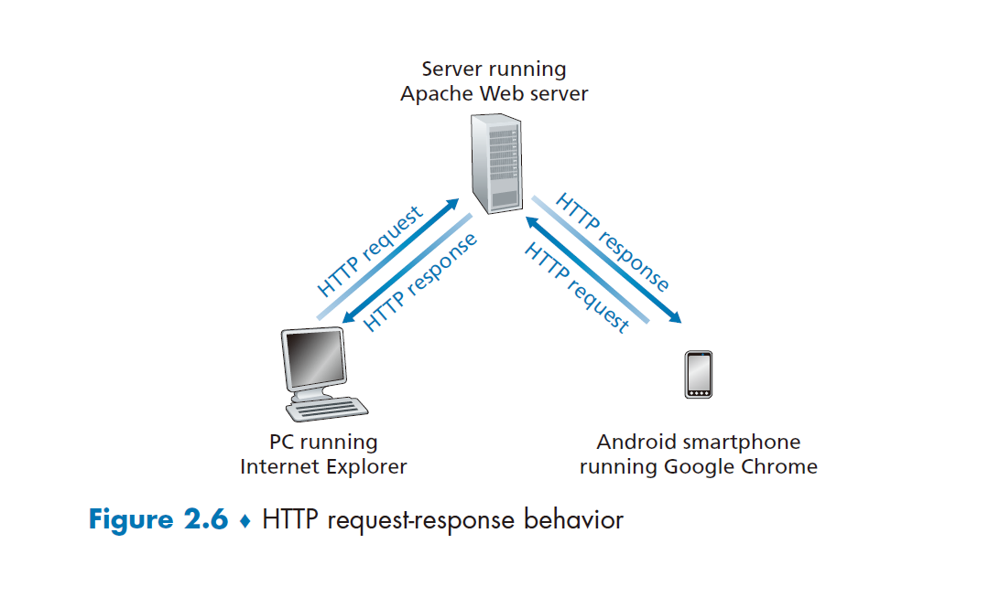

值得注意的是：服务器向客户发送被请求的文件，却不存储该客户的状态信息。假如某个客户在短短的几秒内两次请求同一个对象，服务器并不会因为刚刚为该客户提供了该对象就不再做出反应，而是重新发送该对象，就像服务器已经完全忘记不久之前所做过的事一样。因为 HTTP 服务器并不保存关于客户的任何信息，所以我们说 HTTP 是一个 **无状态协议(stateless protocol)**。我们也注意到 Web 使用了客户-服务器应用程序体系结构。Web 服务器总是打开的，具有一个固定的 IP 地址，且它服务于可能来自数以百万计的不同浏览器的请求。

### 2.2.2. 持续连接和非持续连接

在许多 Internet 应用程序中，客户和服务器在一个相当长的时间范围内通信，其中客户发出一系列请求并且服务器对每个请求进行响应。依据应用程序以及该应用程序的使用方式，这一系列请求可以周期性地或者间断性地一个接一个发出。因为这种客户-服务器的交互是经 TCP 进行的，应用程序的研制者就需要做一个重要决定，即每个请求/响应对是经一个单独的 TCP 连接发送，还是所有的请求及其响应经相同的 TCP 连接发送呢？当采用前一种方法时，该应用程序被称为采用 **非持续连接(non-pers1stent connection)**，采用后一种方法，该应用程序被称为采用 **持续连接(pers1stent connection)**。尽管 HTTP 在其默认方式下采用持续连接，HTTP 客户和服务器也能配置成采用非持续连接。

1. **采用非持续连接的 HTTP**

我们来仔细观察一下，在非持续连接情况下，服务器向客户传送一个 Web 页面的过程。假设该页面有一个 HTML 基本文件和 10 个 JPEG 图片，并且这 11 个对象位于同一台服务器上。假设该 HTML 基本文件的 URL 为：http://www.someSchool.edu/someDepartment/index.html

我们来看看发生了什么：

1. HTTP 客户进程在端口号 80 发起一个到服务器 www.someSchool.edu 的 TCP 连接，该端口号是 HTTP 的默认端口。在客户和服务器上分别有一个套接字与该连接关联。
2. HTTP 客户经它的套接字向该服务器发送一个 HTTP 请求报文。请求报文中包含了路径名 /someDepartment/index.html （后面我们会详细讨论 HTTP 报文）。
3. HTTP 服务器进程经它的套接字接收该请求报文，从其存储器（RAM 或磁盘）中检索出对象 www.someSchool.edu/someDepartment/index.html， 并在一个 HTTP 响应报文中封装对象，并通过其套接字向客户发送响应报文。
4. HTTP 服务器进程通知 TCP 断开该 TCP 连接。（但是直到 TCP 确认客户已经完整地收到响应报文为止，它才会实际中断连接。）
5. HTTP 客户接收响应报文，TCP 连接关闭。该报文指岀封装的对象是一个 HTML 文件，客户从响应报文中提取出该文件，检査该 HTML 文件，得到对 10 个 JPEG 图形的引用。
6. 对每个引用的 JPEG 图形对象重复前 4 个步骤。

当浏览器收到 Web 页面后，向用户显示该页面。两个不同的浏览器也许会以不同的方式解释（即向用户显示）该页面。HTTP 和浏览器如何解释一个 Web 页面毫无关系。 HTTP 规范（([RFC 1945] and [RFC 7540]）仅定义了在 HTTP 客户程序与 HTTP 服务器程序之间的通信协议。

上面的步骤举例说明了非持续连接的使用，其中每个 TCP 连接在服务器发送一个对象后关闭，即该连接并不为其他的对象而持续下来。值得注意的是每个 TCP 连接只传输一个请求报文和一个响应报文。因此在本例中，当用户请求该 Web 页面时，要产生 11 个 TCP 连接。

在上面描述的步骤中，我们有意没有明确客户获得这 10 个 JPEG 图形对象是使用 10 个串行的 TCP 连接，还是使用了一些并行的 TCP 连接。事实上，用户能够配置现代浏览器来控制连接的并行度。在默认方式下，大部分浏览器打开 5 ~ 10 个并行的 TCP 连接，而每条连接处理一个请求响应事务。如果用户愿意，最大并行连接数可以设置为 1，这样 10 条连接就会串行建立。我们在下一章会看到，使用并行连接可以缩短响应时间。

在继续讨论之前，我们估算一下从客户请求 HTML 基本文件起到该客户收到整个文件所花费的时间。为此，我们给出 **往返时间(Round-Trip Time RTT)** 的定义，该时间是一个短分组从客户到服务器然后再返回客户所花费的时间。RTT 包括传播时延，排队时延和分组时延。

如图 2-7 所示。当用户再浏览器中点击一个超链接时，浏览器向 Web 服务器发起一个 TCP 连接请求。涉及一次“三次握手”：浏览器向 Web 服务器发送一个小的 TCP 报文段，服务器用一个小 TCP 报文段做出响应。最后浏览器向服务器返回确认。三次握手中前两个部分所耗费的时间占用了一个 RTT。完成了三次握手的前两个部分后，客户结合三次握手的第三部分（确认）向该 TCP 连接发送一个 HTTP 请求报文。一旦该请求报文到达服务器，服务器就在该 TCP 连接上发送 HTML 文件。该 HTTP 请求/响应用去了另一个 RTT。因此，粗略地讲，总的响应时间就是两个 RTT 加上服务器传输 HTML 文件的时间。

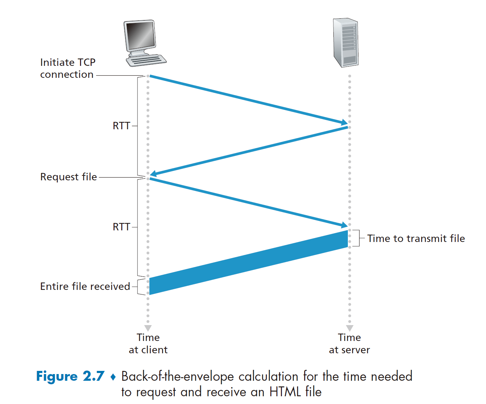

1. **采用持续连接的 HTTP**

非持续连接有一些缺点。第一，必须为每一个请求的对象建立和维护一个全新的连接。对于每个这样的连接，在客户和服务器中都要分配 TCP 的缓冲区和保持 TCP 变量，这给 Web 服务器带来了严重的负担，因为一台 Web 服务器可能同时服务于数以百计不同的客户的请求。第二，就像我们刚描述的那样，每一个对象经受两倍 RTT 的交付时延，即一个 RTT 用于创建 TCP,另一个 RTT 用于请求和接收一个对象。

在 HTTP 1.1 采用持续连接的情况下，服务器在发送响应后保持该 TCP 连接打开。在相同的客户与服务器之间，后续的请求和响应报文能够通过相同的连接进行传送。特别是，一个完整的 Web 页面（上例中的 HTML 基本文件加上 10 个图形）可以用单个持续 TCP 连接进行传送。更有甚者，位于同一台服务器的多个 Web 页面在从该服务器发送给同一个客户时，可以在单个持续 TCP 连接上进行。可以请求可以一个接一个地请求对象，而不必等待对未决请求（流水线）的回答。一般来说，如果一条连接在一定时间间隔（一个可配置的超时间隔）后没有被使用，HTTP 服务器就会关闭该连接。HTTP 的默认模式是使用带流水线的持续连接。我们鼓励读者阅读 [Heidemann 1997; Nielsen 1997; RFC 7540]。

### 2.2.3. HTTP 报文格式

HTTP 规范［RFC 1945；RFC 2616；RFC 7540] 包含了对 HTTP 报文格式的定义。HTTP 报文有两种：请求报文和响应报文。下面讨论这两种报文。

1. **HTTP 请求报文**

下面时一个典型的 HTTP 请求报文

```http
GET /somedir/page.html HTTP/1.1
Host: www.someschool.edu
Connection: close
User-agent: Mozilla/5.0
Accept-language: fr
```

该报文由不同的 ASCII 文本书写。
每行都有由一个换行符。最后一行再附加一个空行。
虽然这个特定的报文仅有 5 行，但一个请求报文能够具有更多的行或者至少为一行。

HTTP 请求报文的第一行是**请求行**，后继的行是**首部行**。

- **请求行**

请求行由 3 个字段：方法字段，URL 字段和 HTTP 版本字段。方法字段可以取不同的值：GET，POST，HEAD，PUT 和 DELETE。绝大部分 HTTP 请求报文使用的是 GET 方法字段。后面的 URL 字段是请求对象的地址。版本字段是自动解释的，在这个例子中是 HTTP 1.1 版本。

- **首部行**

首先是主机地址。之后的 `Connection: close` 表示再服务器发送完成对象之后就关闭该连接。`User-agent: Mozilla/5.0` 指定了用户的 HTTP 代理，这里是 Mozilla/5.0 浏览器，这个字段是有一定作用的，服务器可以根据用户代理的不同发送请求对象的不同版本。最后 `Accept-language: fr` 表示用户想得到对象的语言版本为法语。

如图 2-8 所示，这是 HTTP 请求报文的通用格式。

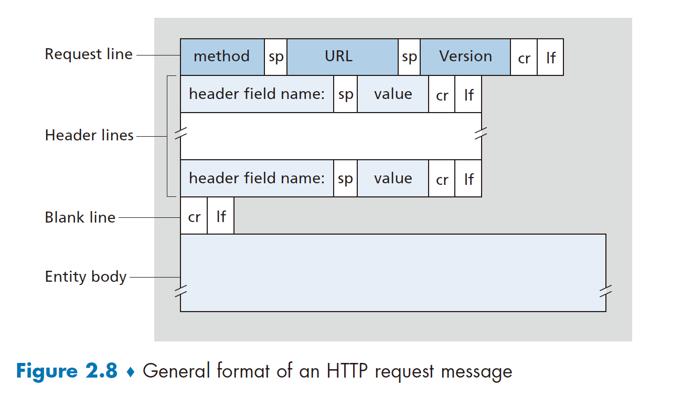

- **实体体**

在观察图 2-8 时，你可能注意到了实体体。当 HTTP 请求使用 GET 方法时，实体体为空，而使用 POST 方法时才使用实体体。当用户提交表单时， HTTP 客户常常使用 POST 方法，例如，当用户向搜索引擎提供搜索关键词时。 使用 POST 报文时，用户仍可以向服务器请求一个 Web 页面，但 Web 页面的特定内容依赖于用户在表单字段中输入的内容。如果请求方法为 POST，则实体体的就是用户在表单字段中输入的值。

值得注意的是，提交表单所生成的 HTTP 报文不一定就要采用 POST 方法。相反，HTTP 表单经常采用 GET 方法，此时输入的字段值会被包含进 URL 中。举个例子，如果一个表单使用 GET 方法，并且提交的两个字段值是 monkeys 和 bananas，那么 URL 就会是这样 www.somes1te.com/animalsearch?monkeys&bananas。在你日复一日的网上冲浪中，你可能看见过这种扩展的 URL。

HEAD 方法和 GET 方法类似。当一个服务器收到一个 HEAD 请求，它会以一个不包含请求对象的报文响应。应用开发者常用这种请求来开发调试。PUT 方法和发布对象有关。PUT 请求允许用户上传对象到网页上的一个具体路径。在应用中，PUT 请求常被用来上传对象。DELETE 方法允许用户或一个用户删除服务器上的一个对象。

2. **HTTP 响应报文**

下面的响应报文是上面请求报文的响应。

```http
HTTP/1.1 200 OK
Connection: close
Date: Tue, 18 Aug 2015 15:44:04 GMT
Server: Apache/2.2.3 (CentOS)
Last-Modified: Tuer 18 Aug 2015 15:11:03 GMT
Content-Length: 6821
Content-Type: text/html

(data data data data data ...)
```

该响应有 3 个部分：第一行为 **状态行**，6 个 **首部行**，然后是 **实体体**。

- **状态行**

状态行有 3 个字段：协议版本字段，状态码，和相应的状态信息。再这个例子中，状态行表示 Web 服务器使用的 HTTP 版本为 1.1，并且一切正常(服务器已经找到请求对象并成功发送)。

常用的状态码包括：
200 0K：请求成功，信息在返回的响应报文中。
301 Moved Permanently：请求的对象已经被永久转移了，新的 URL 定义在响应报 文的 Location:首部行中。客户软件将自动获取新的 URL。
400 Bad Request: 一个通用差错代码，指示该请求不能被服务器理解。
404 Not Found:被请求的文档不在服务器上。
505 HTTP Vers1on Not Supported:服务器不支持请求报文使用的 HTTP 协议版本。

- **首部行**

`Connection: close` 表示发送这条报文后会关闭该连接。
`Date: Tue, 18 Aug 2015 15:44:04 GMT` 表示发送这条报文的日期。
`Server: Apache/2.2.3 (CentOS)` 表示该报文是由一台 Apache web 服务器产生的。
`Last-Modified: Tuer 18 Aug 2015 15:11:03 GMT` 表示发送对象最后的修改时间。
`Content-Length: 6821` 表示发送对象的字节数。
`Content-Type: text/html` 表示发送对象的类型为 html 文本。

如图 2-9 所示，这是 HTTP 响应报文的通用格式。

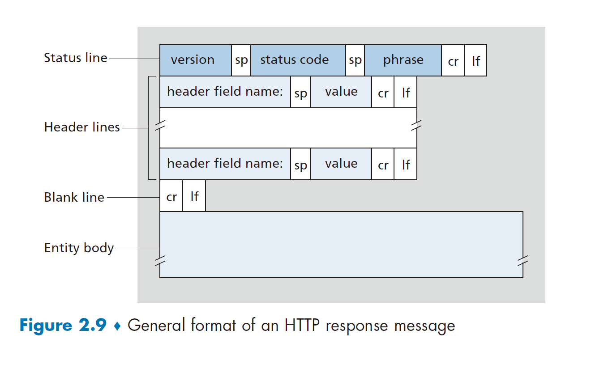

浏览器是如何决定在一个请求报文中包含哪些首部行的呢？ Web 服务器又是如何决定在一个响应报文中包含哪些首部行呢？浏览器产生的首部行与很多因素有关，包括浏览器的类型和协议版本（例如，HTTP/1.0 浏览器将不会产生任何 1.1 版本的首部行）、浏览器的用户配置（如喜好的语言）、浏览器当前是否有一个缓存的但是可能超期的对象版本。Web 服务器的表现也类似：在产品、版本和配置上都有差异，所有这些都会影响响应报文中包含的首部行。

### 2.2.4. Cookie

我们前面提到了 HTTP 服务器是无状态的。这简化了服务器的设计，并且允许工程师们去开发可以同时处理数以千计的 TCP 连接的高性能 Web 服务器。然而一个 Web 站点通常希望能够识别用户，可能是因为服务器希望限制用户的访问，或者因为它希望把内容与用户身份联系起来。为此，HTTP 使用了 cookie。cookie 在［RFC 6265］中定义，它允许站点对用户进行跟踪。目前大多数商务 Web 站点都使用了 cookie。

cookie 技术有 4 个部分：

1. 在 HTTP 响应报文中首部行的 cookie。
2. 在 HTTP 请求报文中首部行的 cookie。
3. 在用户端系统中保留有一个 cookie 文件，并由对应浏览器进行管理。
4. 位于 Web 服务器的一个后端数据库。

如图 2-11 所示。

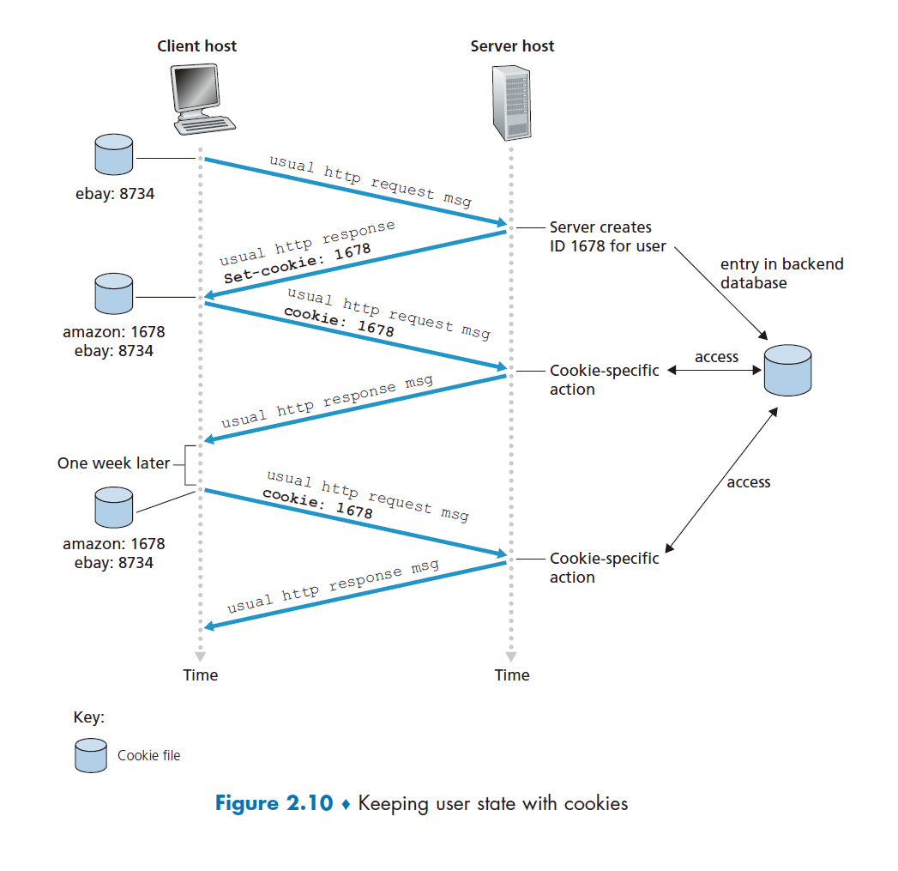

假设 Susan 总是从家中 PC 使用 Internet Explorer 上网，她首次与 Amazon.com 联系。我们假定过去她已经访问过 eBay 站点。当请求报文到达该 Amazon Web 服务器时，该 Web 站点将产生一个唯一识别码，并以此作为索引在它的后端数据库中产生一个表项。接下来 Amazon Web 服务器用一个包含 `Set-cookie:` 首部的 HTTP 响应报文对 Susan 的浏览器进行响应，其中 Set-cookie：首部含有该识别码。例如，该首部行可能是

```
Set-cookie: 1678
```

当 Susan 的浏览器收到了该 HTTP 响应报文时，它会看到该 `Set-cookie:` 首部。该浏览器在它管理的特定 cookie 文件中添加一行，该行包含服务器的主机名和在 `Set-cookie:` 首部中的识别码。值得注意的是该 cookie 文件已经有了用于 eBay 的表项，因为 Susan 过去访问过该站点。当 Susan 继续浏览 Amazon 网站时，每请求一个 Web 页面，其浏览器就会查询该 cookie 文件并抽取她对这个网站的识别码，并放到 HTTP 请求报文中包括识别码的 cookie 首部行中。特别是，发往该 Amazon 服务器的每个 HTTP 请求报文都包括以下首部行:

```
Cookie: 1678
```

在这种方式下，Amazon 服务器可以跟踪 Susan 在 Amazon 站点的活动。尽管 AmazonWeb 站点不必知道 Susan 的名字，但它确切地知道用户 1678 按照什么顺序、在什么时间、访问了哪些页面！ Amazon 使用 cookie 来提供它的购物车服务，即 Amazon 能够维护 Susan 希望购买的物品列表，这样在 Susan 结束会话时可以一起为它们付费。

如果 Susan 再次访问 Amazon 站点，比如说一个星期后，她的浏览器会在其请求报文中继续放入首部行 `cookie: 1678`。 Amazon 将根据 Susan 过去在 Amazon 访问的网页向她推荐产品。如果 Susan 也在 Amazon 注册过，即提供了她的全名、电子邮件地址、邮政地址和信用卡账号，则 Amazon 能在其数据库中包括这些信息，将 Susan 的名字与识别码相关联（以及她在过去访问过的本站点的所有页面）。这就解释了 Amazon 和其他一些电子商务网站实现"点击购物（one-click shopping）的道理，即当 Susan 在后继的访问中选择购买某个物品时，她不必重新输入姓名、信用卡账号或者地址等信息了。

从上述讨论中我们看到，cookie 可以用于标识一个用户。用户首次访问一个站点时，可能需要提供一个用户标识（可能是名字）。在后继会话中，浏览器向服务器传递一个 cookie 首部，从而向该服务器标识了用户。因此 cookie 可以在无状态的 HTTP 之上建立一个用户会话层。例如，当用户向一个基于 Web 的电子邮件系统（如 Hotmail）注册时，浏览器向服务器发送 cookie 信息，允许该服务器在用户与应用程序会话的过程中标识该用户。

尽管 cookie 常常能简化用户的 Internet 购物活动，但是它的使用仍具有争议，因为它们被认为是对用户隐私的一种侵害。如我们刚才所见，结合 cookie 和用户提供的账户信息，Web 站点可以知道许多有关用户的信息，并可能将这些信息卖给第三方。Cookie Central [Cookie Central 2016]包括了对 cookie 争论的广泛信息。

### 2.2.5. 代理

**代理** 或 **代理服务器** 可以代表原来的 Web 服务器来响应 HTTP 请求。

假如用户配置了浏览器，使得浏览器的请求可以被转发到代理服务器。如图 2-11 所示，当用户请求 http://www.someschool.edu/campus.gif 将会发生以下情况：

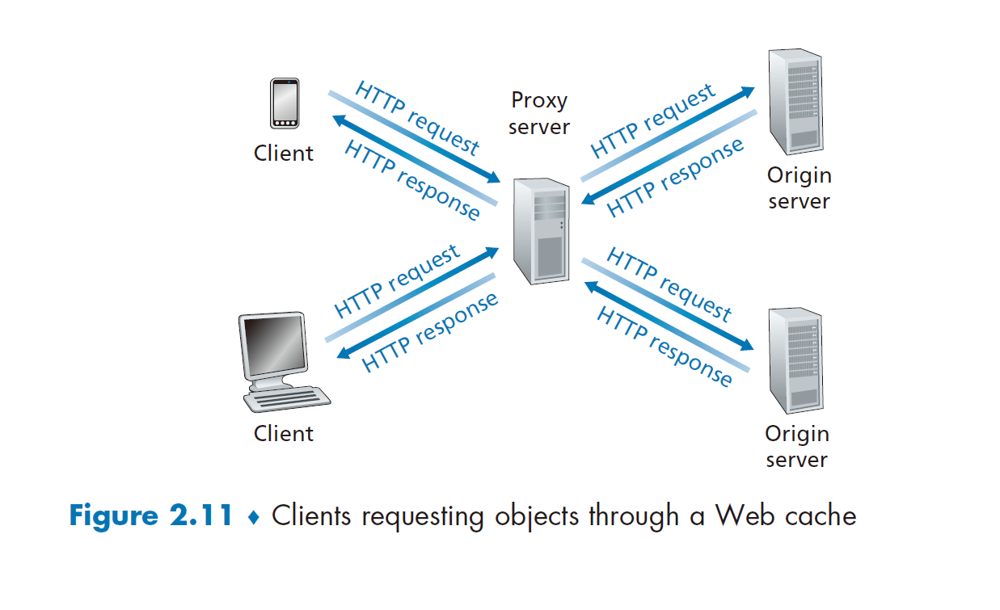

1. 浏览器创建一个到代理服务器的 TCP 连接，并向代理服务器中的对象发送 HTTP 请求。
2. 代理服务器进行检查，查看本地是否存储了该对象的副本，如果有，代理服务器就向客户浏览器发送包含该对象的 HTTP 响应报文。
3. 如果代理服务器中没有这个对象，那么代理服务器会创建一个到 www.someschool.edu 的 TCP 连接，并请求该对象，www.someschool.edu 服务器会向代理服务器发送包含该对象的响应报文。
4. 代理服务器接收到该对象后，他会在本地存储一份副本，并利用(1)中建立的 TCP 连接向客户浏览器发送包含该对象的响应报文。

一般来说，代理被 ISP 购买和安装。例如，一个大学可能会安装配置代理，使得校园网内的请求被转发到代理服务器。或者一个地区性 ISP 可能会安装配置多个代理，使得 ISP 网络内的请求被转发至这些代理服务器。

使用代理有可以减少访问时延以及减少服务器的负载。

通过使用 **内容分发网络(Content Distribution Network, CDN)**，代理服务器正在 Internet 中发挥着越来越重要的作用。CDN 公司在 Internet 上安装了许多地理上分散的代理服务器，因而使大量流量实现了本地化。有多个共享的 CDN （例如 Akamai 和 Limelight）和专用的 CDN （例如谷歌和 Netflix）。我们将在 2-6 节中更为详细地讨论 CDN。

**条件 GET 方法**

web 代理可以减少用户感受到的响应时间，但也引入了一个新的问题，存放在 web 代理服务器上的文件的副本可能是陈旧的。换句话说，保存在服务器中的对象自该副本缓存在客户上以后可能已经被修改了。幸运的是，HTTP 协议有一种机制，允许代理服务器证实它的对象是最新的。这种机制就是 **条件 GET(conditional GET)方法**[RFC 7232]。如果：1. 请求报文使用 GET 方法；并且 2. 请求报文中包含一个 `If-Modified-S1nce` 首部行。那么，这个 HTTP 请求报文就是一个条件 GET 请求报文。

为了说明 GET 方法的操作方式，我们看一个例子。首先，一个代理服务器代表浏览器，向某 Web 服务器发送一个请求报文:

```http
GET /fruit/kiwi.gif HTTP/1.1
Host: www.exotiquecuis1ne.com
```

之后，该 Web 服务器向缓存器发送具有被请求的对象的响应报文:

```http
HTTP/1.1 200 OK
Date: Sat, 3 Oct 2015 15:39:29
Server: Apache/1.3.0 (Unix)
Last-Modified: Wed, 9 Sep 2015 09:23:24
Content-Type: image/gif

(data data data data data ...)
```

该代理服务器在将对象转发到请求的浏览器的同时，也在本地缓存了该对象。重要的是，代理服务器在存储该对象时也存储了最后修改日期。最后，一个星期后，另一个用户经过该代理服务器请求同一个对象，该对象仍在这个代理服务器中。由于在过去的一个星期中位于 Web 服务器上的该对象可能已经被修改了，该代理服务器通过发送一个条件 GET 执行最新检查。具体来说，该缓存器发送:

```http
GET /fruit/kiwi.gif HTTP/1.1
Host: www.exotiquecuis1ne.com
If-modified-since: Wed, 9 Sep 2015 09:23:24
```

值得注意的是 `If-Modified-S1nce` 首部行的值正好等于一星期前服务器发送的响应报文中的 `Last-Modified` 首部行的值。该条件 GET 报文告诉服务器，仅当自指定日期之后该对象被修改过，才发送该对象。假设该对象自 2015 年 9 月 9 日 09:23:24 后没有被修改。接下来的第四步，Web 服务器向该缓存器发送一个响应报文:

```http
HTTP/1.1 304 Not Modified
Date: Satf Oct 2015 15:39:29
Server: Apache/1.3.0 (Unix)

(empty entity body)
```

我们看到，作为对该条件 GET 方法的响应，该 Web 服务器仍发送一个响应报文，但并没有在该响应报文中包含所请求的对象。包含该对象只会浪费带宽，并增加用户感受到的响应时间，特别是如果该对象很大的时候更是如此。值得注意的是在最后的响应报文中，状态行中为 `304 Not Modified`，它告诉代理服务器可以使用该对象，能向请求的浏览器转发它（该代理服务器）缓存的该对象副本。

我们现在完成了对 HTTP 的讨论，这是我们详细学习的第一个 Internet 协议（应用层协议）。我们已经学习了 HTTP 报文的格式，学习了当发送和接收这些报文时 Web 客户和服务器所采取的动作。我们还学习了一点 Web 应用程序基础设施，包括 cookie 和代理所有这些都以某种方式与 HTTP 协议有关。

**time : 2021-06-19**

### 2.2.6. HTTP/2

HTTP/2 [RFC 7540] 在 2015 年被标准化，是继 HTTP/1.1 在 1997 年被标准化以来的新版本。在标准化后，HTTP/2 发展迅猛，截至 2020 年，超过 40% 的顶级的 1000 万个网站已经支持了 HTTP/2 [W3Techs]。多数浏览器包括 Google Chrome，Internet Explorer，Safari，Opera，和 Firefox 支持 HTTP/2。

HTTP/2 的首要目标是减少感知时延。HTTP 可以使请求和响应在一个 TCP 连接上复用，还提供了分优先级请求和服务器推送，以及提供了对 HTTP 首部字段的有效压缩。HTTP/2 没有更改请求方法，状态码，URL，或者首部字段。相反，HTTP/2 更改了数据的存储格式以及服务器和客户之间的传输方式。

为什么有了 HTTP/1.1，我们还需要 HTTP/2 呢？回忆我们前面对 HTTP/1.1 的讨论。HTTP/1.1 采用了持续连接，允许服务器通过 1 个 TCP 连接给客户发送一个网页。这种方式使得每请求一个网页就要开启一个 TCP 连接，所以减少了服务器的可用端口，而且每一个网页的传输占用的带宽使相同的。但浏览器的开发者很快就发现了一个问题：一个网页内的所有对象通过 1 个 TCP 连接进行传输会造成 **链路头阻塞(Head of Line, HOL, blocking)**。为了理解这个问题，我们考虑一个场景：一个网页包含一个视频还有一个基本 HTML 文件，这个视频在网页的前面。传输链路带宽也比较低。当使用 1 个 TCP 连接传输这个网页时，这个视频对象需要很长的时间，这就使得视频后面的网页内容得不到传输。或者说视频阻塞视频后的网页内容。传统的 HTTP/1.1 处理这个问题的方式是在浏览器内开启多个并行的 TCP 连接，因此这个网页可以并行进行传输。通过这种方式，视频后面的网页内容可以得到传输并被浏览器更快地渲染出来，因此减少了用户感知到的时延。

将在第 3 章讨论的 TCP 拥塞控制也推荐浏览器采用并行的 TCP 连接，而不是一个持续的 TCP 连接，在这种情况下，粗略来讲，每一个 TCP 连接会被分配相同的带宽。通过这种方式，浏览器可以获取到更大比例的带宽。许多支持 HTTP/1.1 的浏览器往往会开启最多 6 个并行的 TCP 连接，这种行为不仅仅是为了应对链路头阻塞问题，也是为了获取更大的带宽。

HTTP/2 的其中一个重要的目的就是减少在传输一个网页时，摆脱(至少要减少)开启的并行 TCP 连接数量。所以这不仅可以减少服务器要维持的真正需要的套接字的数量，还使得 TCP 拥塞控制像预期那样运作。但是如果仅仅只有 1 个 TCP 连接来传输 1 个网页，HTTP/2 就要仔细地设计传输机制以避免链路头阻塞。

1. HTTP/2 插帧机制

HTTP/2 地解决方案是将报文分成更小的帧，把请求报文或响应报文的帧交替插进一个相同的 TCP 连接中。为了理解这个机制，我们再次考虑上面提过的场景，假设这个网页由头部的视频和其他 8 个小的对象构成，那么服务器一共会收到 9 个 HTTP 请求。对于每个请求，服务器要发送 9 个响应报文给浏览器。假设每个帧的大小都是相等的，视频有 1000 帧，其他的 8 个小对象有 2 帧。在交替插帧的机制下，发送完第 1 个视频帧之后，其他的 8 个小对象的第 1 个帧会被接着发送。发送完第 2 个视频帧后，其他的 8 个小对象的第 2 个帧(即最后 1 帧)会被接着发送。因此，在总共发送完 18 个帧后，所有的小对象会被紧接着发送。通过这种机制，HTTP/2 显著减少了用户感知到的时延。

HTTP/2 的分帧以及交替插帧的能力是一个重要的提升。在浏览器收到帧之后，会把这些帧组装成原来的完整对象。分帧是由 HTTP/2 下层的分帧层完成的。当一个服务器向一个浏览器发送一个 HTTP 响应报文时，这个响应报文会被分帧层进行分帧。响应报文的首部区会形成一个帧，要发送的数据会被分为若干个帧，这些帧和其他响应报文的帧会被交替插进 1 个持续的 TCP 连接中并进行发送。在这些帧到达客户之后，会被客户的分帧层组装为原来的报文。同样地，客户的请求报文也会被分帧和交替插进 TCP 连接。

2. 响应报文分优先级以及服务器推送

报文分优先级机制可以让开发者给请求不同的优先级，这样就可以优化应用的性能。当客户向服务器发送若干个请求报文时，客户会赋给这些请求报文不同的权重，范围为 1 到 256。越高的权重表示越高的优先级。服务器会首先发送优先级最高的请求对应的响应报文的帧。此外，客户也可以通过指定一个报文依赖的其他报文的 ID 来表示报文间的依赖关系。

HTTP/2 的另外一个能力是：服务器可以对一个请求发送多个响应报文。具体来讲，当客户发送了一个对 HTML 基本文档的请求后，服务器可以分析这个基本文档中包含的其他引用对象，进而不必等客户一个个发送对这些引用对象的请求报文，服务器自己便会分析这个 HTML 基本文件中的引用对象，然后直接发送对应的响应报文。这个机制可以摆脱客户请求引用对象。因此也显著减少了时延。

3. HTTP/3

我们将在第 3 章讨论一种被称为 QUIC 的协议。这是一种新的应用层协议，依托于 UDP 所构建。它有很多 HTTP 需要的特性，例如报文多路复用，流控制，低时延连接建立。HTTP/3 还是一个比较新的协议，他被设计为在 QUIC 协议之上运作。截至 2020 年，HTTP/3 被描述在 Internet 草案中，还没有完全标准化。

## 2.3. 电子邮件

**time : 2021-05-07**

电子邮件系统有 3 个重要的组成部分：**用户代理**，**邮件服务器**和**简单邮件传输协议(SMTP)**。

下面我们结合发送方 Alice 发电子邮件给 接收方 Bob 的场景，对每个组成部分进行描述。用户代理允许用户阅读、回复、转发、保存和撰写报文。微软的 Outlook 和 Apple Mail 是电子邮件用户代理的例子。当 Alice 完成邮件撰写时，她的邮件代理向其邮件服务器发送邮件，此时邮件放在邮件服务器的外出报文队列中。当 Bob 要阅读报文时，他的用户代理在其邮件服务器的邮箱中取得该报文。

邮件服务器是电子邮件系统的核心。每个接收方(如 Bob)在其中的某个邮件服务器上有一个**邮箱**。Bob 的邮箱管理和维护着发送给他的报文。一个典型 的邮件发送过程是：从发送方的用户代理开始，传输到发送方的邮件服务器，再传输到接 收方的邮件服务器，然后在这里被分发到接收方的邮箱中。当 Bob 要在他的邮箱中读取该报文时，包含他邮箱的邮件服务器（使用用户名和口令）来鉴别 Bob。如果 Alice 的服务器不能将邮件交付给 Bob 的服务器,Alice 的邮件服务器在一个报文队列（message queue）中保持该报文并在以后尝试再次发 送。通常每 30 分钟左右进行一次尝试；如果几天后仍不能成功，服务器就删除该报文并以电子邮件的形式通知发送方（Alice）。

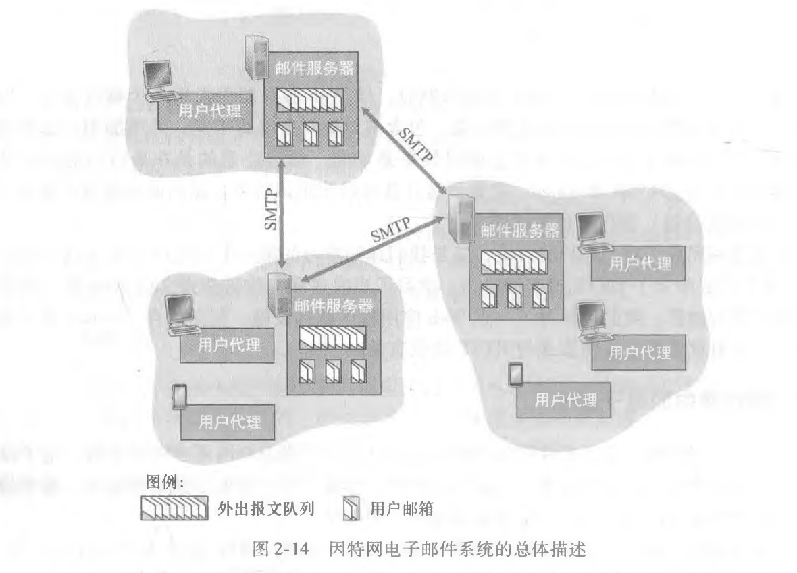

SMTP 是 Internet 电子邮件中主要的应用层协议。它使用 TCP 可靠数据传输服务，从发 送方的邮件服务器向接收方的邮件服务器发送邮件。像大多数应用层协议一样，SMTP 也 有两个部分：运行在发送方邮件服务器的客户端和运行在接收方邮件服务器的服务器端。 每台邮件服务器上既运行 SMTP 的客户端也运行 SMTP 的服务器端。当一个邮件服务器向 其他邮件服务器发送邮件时，它就表现为 SMTP 的客户；当邮件服务器从其他邮件服务器上接收邮件时，它就表现为一个 SMTP 的服务器。

### 2.3.1. SMTP

RFC 5321 给出了 SMTP 的定义。SMTP 是 Internet 电子邮件的核心。如前所述, SMTP 用于从发送方的邮件服务器发送报文到接收方的邮件服务器。

为了描述 SMTP 的基本操作，我们观察一种常见的情景。假设 Alice 想给 Bob 发送一封简单的 ASCII 报文。
1） Alice 调用她的邮件代理程序并提供 Bob 的邮件地址（例如 bob® someschool. edu）, 撰写报文，然后指示用户代理发送该报文。
2） Alice 的用户代理把报文发给她的邮件服务器，在那里该报文被放在报文队列中。
3） 运行在 Alice 的邮件服务器上的 SMTP 客户端发现了报文队列中的这个报文，它就创建一个到运行在 Bob 的邮件服务器上的 SMTP 服务器的 TCP 连接。
4） 在经过一些初始 SMTP 握手后，SMTP 客户通过该 TCP 连接发送 Alice 的报文。
5） 在 Bob 的邮件服务器上，SMTP 的服务器端接收该报文。Bob 的邮件服务器然后将该报文放入 Bob 的邮箱中。
6） 在 Bob 方便的时候，他调用用户代理阅读该报文。

接下来我们分析一个在 SMTP 客户（C）和 SMTP 服务器（S）之间交换报文文本的例子。客户的主机名为 crepes.fr，服务器的主机名为 hamburger.edu。 以 C：开头的 ASCII 码 文本行正是客户交给其 TCP 套接字的那些行，以 S：开头的 ASCII 码则是服务器发送给其 TCP 套接字的那些行。一旦创建了 TCP 连接，就开始了下列过程：

```
S: 200 hamburger.edu
C: HELO crepes.fr
S: 250 Hello crepes.fr, pleased to meet you
C: MAIL FROM: <alice@crepes.fr>
S: 250 alice@crepes.fr ... Sender ok
C: RCPT TO: <bob@hamburger.edu>
S: 250 bob@hamburger.edu ... Recipient ok
C: DATA
S: 354 Enter mail, end with "." on a line by itself
C: Do you like ketchup?
C: How about pickles?
C: .
S: 250 Message accepted for delivery
C: QUIT
S: 221 hamburger.edu clos1ng connection
```

在上例中，客户从邮件服务器 crepes, fr 向邮件服务器 hamburger, edu 发送了一个报文 （"Do you like ketchup? How about pickles?" ） o 作为对话的一部分，该客户发送了 5 条命 令：HELO （是 HELLO 的缩写）、MAIL FROM. RCPTTO、DATA 以及 QUIT。这些命令都 是自解释的。该客户通过发送一个只包含一个句点的行，向服务器指示该报文结束了。 （按照 ASCII 码的表示方法，每个报文以 CRLF. CRLF 结束，其中的 CR 和 LF 分别表示回 车和换行。）服务器对每条命令做出回答，其中每个回答含有一个回答码和一些（可选 的）英文解释。我们在这里指出 SMTP 用的是持续连接：如果发送邮件服务器有几个报文发往同一个接收邮件服务器，它可以通过同一个 TCP 连接发送这些所有的报文。对每个报文，该客户用一个新的 MAIL FROM: crepes, fr 始，用一个独立的句点指示该邮件的结 束，并且仅当所有邮件发送完后才发送 QUIT。

### 2.3.2. SMTP VS HTTP

我们简要地比较一下 SMTP 和 HTTP。这两个协议都用于从一台主机向另一台主机传送文件：HTTP 从 Web 服务器向 Web 客户（通常是一个浏览器）传送文件（也称为对象）；SMTP 从一个邮件服务器向另一个邮件服务器传送文件（即电子邮件报文）。当进行文件传送时，持续的 HTTP 和 SMTP 都使用持续连接。因此，这两个协议有一些共同特征。

然而，两者之间也有一些重要的区别。

1. 首先，HTTP 主要是一个**拉协议**（pull protocol）, 即在方便的时候，某些人在 Web 服务器上装载信息，用户使用 HTTP 从该服务器拉取这些信息。特别是 TCP 连接是由想接收文件的机器发起的。另一方面，SMTP 基本上是一个**推协议**（push protocol）,即发送邮件服务器把文件推向接收邮件服务器。特别是，这个 TCP 连接是由要发送该文件的机器发起的。

2. 第二个区别就是我们前面间接地提到过的，SMTP 要求每个报文（包括它们的体）采 用 7 比特 ASCII 码格式。如果某报文包含了非 7 比特 ASCII 字符（如具有重音的法文字符）或二进制数据（如图形文件），则该报文必须按照 7 比特 ASCII 码进行编码。HTTP 数据则不受这种限制。

3. 第三个重要区别是如何处理一个既包含文本又包含图形（也可能是其他媒体类型）的文档。如我们在 2.2 节知道的那样，HTTP 把每个对象封装到它自己的 HTTP 响应报文中, 而 SMTP 则把所有报文对象放在一个报文之中。

### 2.3.3. SMTP 报文格式

当 Alice 给 Bob 写一封邮寄时间很长的普通信件时，她可能要在信的上部包含各种各 样的环境首部信息，如 Bob 的地址、她自己的回复地址以及日期等。同样，当一个人给另 一个人发送电子邮件时，一个包含环境信息的首部位于报文体前面。这些环境信息包括在 一系列首部行中，这些行由 RFC 5322 定义。首部行和该报文的体用空行（即回车换行） 进行分隔。RFC 5322 定义了邮件首部行和它们的语义解释的精确格式。如同 HTTP 协议,
每个首部行包含了可读的文本，是由关键词后跟冒号及其值组成的。某些关键词是必需 的，另一些则是可选的。每个首部必须含有一个 From：首部行和一个 To：首部行；一个 首部也许包含一个 Subject：首部行以及其他可选的首部行。重要的是注意到下列事实：这 些首部行不同于我们在 2.3.1 节所学到的 SMTP 命令（即使那里包含了某些相同的词汇,如 from 和 to）。那节中的命令是 SMTP 握手协议的一部分；本节中考察的首部行则是邮件报文自身的一部分。

```
From: alice@crepes.fr
To: bob@hamburger.edu
Subject: Searching for the meaning of life.
```

在报文首部之后，紧接着一个空白行，然后是以 ACS1I 格式表示的报文体.

### 2.3.4. 邮件访问协议

一旦 SMTP 将邮件报文从 Alice 的邮件服务器交付给 Bob 的邮件服务器，该报文就被 放入了 Bob 的邮箱中。在此讨论中，我们按惯例假定 Bob 是通过登录到服务器主机，并直 接在该主机上运行一个邮件阅读程序来阅读他的邮件的。直到 20 世纪 90 年代早期，这都 是一种标准方式。而在今天，邮件访问使用了一种客户-服务器体系结构，即典型的用户 通过在用户端系统上运行的客户程序来阅读电子邮件，这里的端系统可能是办公室的 PC、 便携机或者是智能手机。通过在本地主机上运行邮件客户程序，用户享受一系列丰富的特 性，包括查看多媒体报文和附件的能力。

假设 Bob （接收方）在其本地 PC 运行用户代理程序，考虑在他的本地 PC 也放置一个邮件服务器是自然而然的事。在这种情况下，Alice 的邮件服务器就能直接与 Bob 的 PC 进行对话了。然而这种方法会有一个问题。前面讲过邮件服务器管理用户的邮箱，并且运行 SMTP 的客户端和服务器端。如果 Bob 的邮件服务器位于他的 PC 上，那么为了能够及时接收可能在任何时候到达的新邮件，他的 PC 必须总是不间断 地运行着并一直保持在线。这对于许多 Internet 用户而言是不现实的。相反，典型的用户通常在本地 PC 上运行一个用户代理程序，而它访问存储在总是保持开机的共享邮件服务器上的邮箱。该邮件服务器与其他用户共享，并且通常由用户的 ISP 进行维护（如大学或公司）。

现在我们考虑当从 Alice 向 Bob 发送一个电子邮件报文时所取的路径。我们刚才已经 知道，在沿着该路径的某些点上，需要将电子邮件报文存放在 Bob 的邮件服务器上。通过 让 Alice 的用户代理直接向 Bob 的邮件服务器发送报文，就能够做到这一点。这能够由
SMTP 来完成：实际上，SMTP 被设计成将电子邮件从一台主机推到另一台主机。然而 j 常 Alice 的用户代理和 Bob 的邮件服务器之间并没有一个直接的 SMTP 对话。相反，如图 2-16 所示，Alice 的用户代理用 SMTP 将电子邮件报文推入她的邮件服务器，接着她的 邮件服务器（作为一个 SMTP 客户）再用 SMTP 将该邮件中继到 Bob 的邮件服务器。为什 么该过程要分成两步呢？主要是因为不通过 Alice 的邮件服务器进行中继，Alice 的用户代 理将没有任何办法到达一个不可达的目的地接收服务器。通过首先将邮件存放在自己的邮件服务器中，Alice 的邮件服务器可以重复地尝试向 Bob 的邮件服务器发送该报文，如每 30 分钟一次，直到 Bob 的邮件服务器变得运行为止。（并且如果 Alice 的邮件服务器关机,她则能向系统管理员进行申告！）SMTP RFC 文档定义了如何使用 SMTP 命令经过多个 SMTP 服务器进行报文中继。


但是对于该难题仍然有一个疏漏的环节！像 Bob 这样的接收方，是如何通过运行其本 地 PC 上的用户代理，获得位于他的某 ISP 的邮件服务器上的邮件呢？值得注意的是 Bob 的用户代理不能使用 SMTP 得到报文，因为取报文是一个拉操作，而 SMTP 协议是一个推 协议。通过引入一个特殊的邮件访问协议来解决这个难题，该协议将 Bob 邮件服务器上的 报文传送给他的本地 PC。目前有一些流行的邮件访问协议，包括**第三版的邮局协议（Post Office Protocol—Vers1on 3 , POP3）、Internet 邮件访问协议（Internet Mail Access Protocol, IMAP）以及 HTTP。**

1. **POP3**

POP3 是一个极为简单的邮件访问协议，由 RFC 1939 进行定义。文档 RFC 1939 简短 且可读性强。因为该协议非常简单，故其功能相当有限。当用户代理（客户）打开了一个 到邮件服务器（服务器）端口 110 上的 TCP 连接后，POP3 就开始工作了。随着建立 TCP 连接，POP3 按照三个阶段进行工作：特许（authorization）、事务处理以及更新。在第一个 阶段即特许阶段，用户代理发送（以明文形式）用户名和口令以鉴别用户。在第二个阶段 即事务处理阶段，用户代理取回报文；同时在这个阶段用户代理还能进行如下操作，对报 文做删除标记，取消报文删除标记，以及获取邮件的统计信息。在第三个阶段即更新阶段，它出现在客户发出了 quit 命令之后，目的是结束该 POP3 会话；这时，该邮件服务器删除那些被标记为删除的报文。

2. **IMAP**

使用 POP3 访问时，一旦 Bob 将邮件下载到本地主机后，他就能建立邮件文件夹,并将下载的邮件放入该文件夹中。然后 Bob 可以删除报文，在文件夹之间移动报文,并查询报文（通过发送方的名字或报文主题）。但是这种文件夹和报文存放在本地主机上的方式，会给移动用户带来问题，因为他更喜欢使用一个在远程服务器上的层次 文件夹，这样他可以从任何一台机器上对所有报文进行访问。使用 POP3 是不可能做 到这一点的，POP3 协议没有给用户提供任何创建远程文件夹并为报文指派文件夹的方法。

为了解决这个或其他一些问题，由 RFC 3501 定义的 Internet 邮件访问协议 （IMAP）应运而生。和 POP3 —样，IMAP 是一个邮件访问协议，但是它比 POP3 具有 更多的特色，不过也比 POP3 复杂得多。（因此客户和服务器端的实现也都复杂得多。）
IMAP 服务器把每个报文与一个文件夹联系起来；当报文第一次到达服务器时，它与收件人的 INBOX 文件夹相关联。收件人则能够把邮件移到一个新的、用户创建的文件夹中，阅读邮件，删除邮件等。IMAP 协议为用户提供了创建文件夹以及将邮件从一个文件夹移动到另一个文件夹的命令。IMAP 还为用户提供了在远程文件夹中查询邮件的命令，按指定条件去查询匹配的邮件。值得注意的是，与 POP3 不同，IMAP 服务器 维护了 IMAP 会话的用户状态信息，例如，文件夹的名字以及哪些报文与哪些文件夹相关联。

IMAP 的另一个重要特性是它具有允许用户代理获取报文某些部分的命令。例如，一 个用户代理可以只读取一个报文的报文首部，或只是一个多部分 MIME 报文的一部分。 用户代理和其邮件服务器之间使用低带宽连接（如一个低速调制解调器链路）的时候， 个特性非常有用。使用这种低带宽连接时，用户可能并不想取回他邮箱中的所有邮件， 其要避免可能包含如音频或视频片断的大邮件。

3. **HTTP**

今天越来越多的用户使用他们的 Web 浏览器收发电子邮件。20 世纪 90 年代中期 Hotmail 引入了基于 Web 的接入。今天,谷歌、雅虎以及几乎所有重要的大学或者公司也提供了基于 Web 的电子邮件。使用这种服务，用户代理就是普通的浏览器，用 户和他远程邮箱之间的通信则通过 HTTP 进行。当一个收件人（如 Bob）,想从他的 邮箱中访问一个报文时，该电子邮件报文从 Bob 的邮件服务器发送到他的浏览器，使 用的是 HTTP 而不是 POP3 或者 IMAP 协议。当发件人（如 Alice）要发送一封电子邮 件报文时，该电子邮件报文从 Alice 的浏览器发送到她的邮件服务器，使用的是 HTTP 而不是 SMTP。然而，Alice 的邮件服务器在与其他的邮件服务器之间发送和接收邮件时，仍然使用的是 SMTP。

## 2.4. DNS

**time : 2021-05-14**

Internet 上的主机可以用 **主机名(hostname)** 的方式进行标识。如：www.google.com，www.youtube.com 等等。这种标识方法的优点是便于人们接收和记忆。然而，以这种方式标识，路由器无法辨识主机在 Internet 中的位置信息。由于这个原因，主机也可以用 **IP 地址(IP address)** 的方式进行标识。

我们将在第 4 章更为详细地介绍 IP 地址，现在就先简单地介绍一下。一个常见的 IP 地址由 4 个字节组成，并具有层次结构。例如 121.7.106.83 这样一个地址，其中每个字节都用十进制的 0-255 的数字表示，并用句点分隔开。我们说 IP 地址具有层次结构，是因为我们从左至右扫描它时，我们会得到越来越具体的主机位置信息。这类似于邮寄地址。

### 2.4.1. DNS 提供的服务

我们刚刚看到了识别主机有两种方式，通过主机名或者 IP 地址。人们喜欢便于记忆的主机名标识方式，而路由器则喜欢定长的、有着层次结构的 IP 地址。

为了折中这些不同的偏好，我们需要一种能进行主机名到 IP 地址转换的目录服务。这就是 **域名系统(Domain Name System, DNS)** 的主要任务。DNS 是：

1. 一个由分层的 DNS 服务器实现的分布式数据库
2. 一个方便主机查询分布式数据库的应用层协议

DNS 服务器通常是运行 BIND(Berkeley Internet Name Domain)软件［BIND 2012 ］的 UNIX 机器。DNS 协议运行在 UDP 之上，使用 53 号端口。

DNS 通常是由其他应用层协议所使用的，包括 HTTP、SMTP 和 FTP，将用户提供的主机名解析为 IP 地址。举一个例子，考虑运行在某用户主机上的一个浏览器（即一个 HTTP 客户）请求 URL www.someschool.edu/index.html 页面时会发生什么现象。为了使用户的一 主机能够将一个 HTTP 请求报文发送到 Web 服务器 www.someschool.edu，该用户主机必须获得 www.someschool.edu 的 IP 地址。其做法如下：

1. 用户主机运行着 DNS 客户端
2. 浏览器从上述 URL 中抽取主机名 www.someschool.edu，并将这个主机名传输给DNS客户端
3. DNS 客户端向 DNS 服务端发送一个包含这个主机名的请求
4. DNS 客户端最终会收到响应报文，其中包含主机名对应的 IP 地址
5. 一旦浏览器接收到来自 DNS 客户端发来的 IP 地址，它就可以向位于该 IP 地址 80 端口的 HTTP 服务器进程建立起一个 TCP 连接

从这个例子中，我们可以看到 DNS 给使用它的 Internet 应用带来了额外的时延。幸运的是，如我们下面讨论的那样，想获得的 IP 地址通常就缓存在一个附近的 DNS 服务器中，这有助于减少 DNS 的网络流量和 DNS 的平均时延。

除了主机名到 IP 地址的服务外，DNS 还提供了一些重要的服务：

- **主机别名(host alias1ng)**

如果一个主机的主机名比较复杂，那么这台主机可以拥有一个或者多个别名。女口，一台名为 relay1.west-coast.enterprise.com 的主机，可能还有两个别名为 enterprise.com 和 www.enterprise.com。在这种情况下，relay1.west-coast.enterprise.com 也称为 **规范主机名(canonical hostname)**。主机别名（当存在时）比主机规范名更 加容易记忆。应用程序可以调用 DNS 来获得主机别名对应的规范主机名以及主机的 IP 地址。

- **邮件服务器别名(mail server alias1ng)**

显而易见，人们也非常希望电子邮件地址好记忆。例如，如果 Bob 在雅虎邮件上有一个账户，Bob 的邮件地址就像 bob@yahoo.com 这样简单。然而，雅虎邮件服务器的主机名可能更为复杂，不像 yahoo.com 那样简单好记（例如，规范主机名可能像 relay1.west-coast.hotmail.com 那样）。电子邮件应用程序可以调用 DNS，对提供的主机名别名进行解析，以获得该主机的规范主机名及其 IP 地址。事实上，MX 记录（参见后面）允许一个公司的邮件服务器和 Web 服务器使用相同（别名化的）的主机名；例如，一个公司的 Web 服务器和邮件服务器都能叫作 enterprise.com。

- **负载分配(load distribution)**

DNS 也用于在冗余的服务器（如冗余的 Web 服务器等）之间进行负载分配。繁忙的站点（如 cnn.com）被冗余分布在多台服务器上, 每台服务器均运行在不同的端系统上，每个都有着不同的 IP 地址。由于这些冗余的 Web 服务器，一个 IP 地址集合因此与同一个规范主机名相联系。DNS 数据库中存储着这些 IP 地址集合。当客户对映射到某地址集合的名字发出一个 DNS 请求时，该服务器用 IP 地址的整个集合进行响应，但在每个回答中循环这些地址次序。因为客户通常总是向 IP 地址排在最前面的服务器发送 HTTP 请求报文，所以 DNS 就在所有这些冗余的 Web 服务器之间循环分配了负载。DNS 的循环同样可以用于邮件服务器，因此，多个邮件服务器可以具有相同的别名。一些内容分发公 司如 Akamai 也以更加复杂的方式使用 DNS ［ Dilley 2002］，以提供 Web 内容分发 （参见 2.6.3 节）。

DNS 由 RFC 1034 和 RFC 1035 定义，并且在几个附加的 RFC 中进行了更新。DNS 是 一个复杂的系统，我们在这里只是就其运行的主要方面进行学习。感兴趣的读者可以参考 这些 RFC 文档和 Albitz 和 Liu 写的书［Albitz 1993 ］；亦可参阅文章［Mockapetris 1998 ］ 和［Mockapetris 2005］,其中［Mockapetris 1998］是回顾性的文章，它提供了 DNS 组成和工作原理的精细的描述。

### 2.4.2. DNS 运作原理概述

下面给岀一个 DNS 工作过程的总体概括，我们的讨论将集中在主机名到 IP 地址转换服务方面。

假设运行在用户主机上的某些应用程序（如 Web 浏览器或邮件阅读器）需要将主机名转换为 IP 地址。这些应用程序将调用 DNS 的客户端，并指明需要被转换的主机名（在很多基于 UNIX 的机器上，应用程序为了执行这种转换需要调用函数 `gethostbyname()` ）。 用户主机上的 DNS 接收到后，向网络中发送一个 DNS 查询报文。所有的 DNS 请求和回答报文使用 UDP 数据报经端口 53 发送。经过若干毫秒到若干秒的时延后，用户主机上的 DNS 接收到一个提供所希望映射的 DNS 回答报文。这个映射结果则被传递到调用 DNS 的应用程序。因此，从用户主机上调用应用程序的角度看，DNS 是一个提供简单、直接的转换服务的黑盒子。但事实上，实现这个服务的黑盒子非常复杂，它由分布于全球的大量 DNS 服务器以及定义了 DNS 服务器与查询主机通信方式的应用层协议组成。

DNS 的一种简单设计是在 Internet 上只使用一个 DNS 服务器，该服务器包含所有的映射。在这种集中式设计中，客户直接将所有查询直接发往单一的 DNS 服务器，同时该 DNS 服务器直接对所有的查询客户做出响应。尽管这种设计的简单性非常具有吸引力，但它不适用于当今的 Internet，因为 Internet 有着数量巨大（并持续增长）的主机。这种集中式设计的问题包括:

- **单点故障（a s1ngle point of failure）**

如果该 DNS 服务器崩溃，整个 Internet 随之瘫痪！

- **通信容量(traffic volume)**

单个 DNS 服务器不得不处理所有的 DNS 査询（用于为上亿台主机产生的所有 HTTP 请求报文和电子邮件报文服务）。

- **距离的集中式数据库(distant centralized database)**

单个 DNS 服务器不可能邻近所有查询客户。如果我们将单台 DNS 服务器放在纽约市，那么所有来自 澳大利亚的查询必须传播到地球的另一边，中间也许还要经过低速和拥塞的链路。这将导致严重的时延。

- **维护(maintenance)**

单个 DNS 服务器将不得不为所有的 Internet 主机保留记录。这不仅将使这个中央数据库庞大，而且它还不得不为解决每个新添加的主机而频繁更新。

总的来说，在单一 DNS 服务器上运行集中式数据库完全没有可扩展能力。因此，DNS 采用了分布式的设计方案。事实上，DNS 是一个在 Internet 上实现分布式数据库的典型范例。

1. **分布式、层次数据库**

为了处理扩展性问题，DNS 使用了大量的 DNS 服务器，它们以层次方式组织，并且分布在全世界范围内。没有一台 DNS 服务器拥有 Internet 上所有主机的映射。相反， 这些映射分布在所有的 DNS 服务器上。大致说来，有 3 种类型的 DNS 服务器：**根 DNS 服务器**、**顶级域(Top Level Domain, TLD)服务器** 和 **权威 DNS 服务器**。这些服务器以图 2-17 中所示的层次结构组织起来。为了理解这 3 种类型的 DNS 服务器交互的方式，假定一个 DNS 客户要决定主机名 www.amazon.com 的 IP 地址。粗略说来，将发生下列事件。客户首先与根服务器之一联系，它将返回顶级域名 com 的 TLD 服务器的 IP 地址。该客户则与这些 TLD 服务器之一联系，它将为 amazon.com 返回权威服务器的 IP 地址。最后，该客户与 amazon.com 权威服务器之一联系，它为主机名 www.amazon.com 返回其 IP 地址。我们将很快更为详细地考察 DNS 查找过程。不过我们先仔细看一下这 3 种类型的 DNS 服务器。

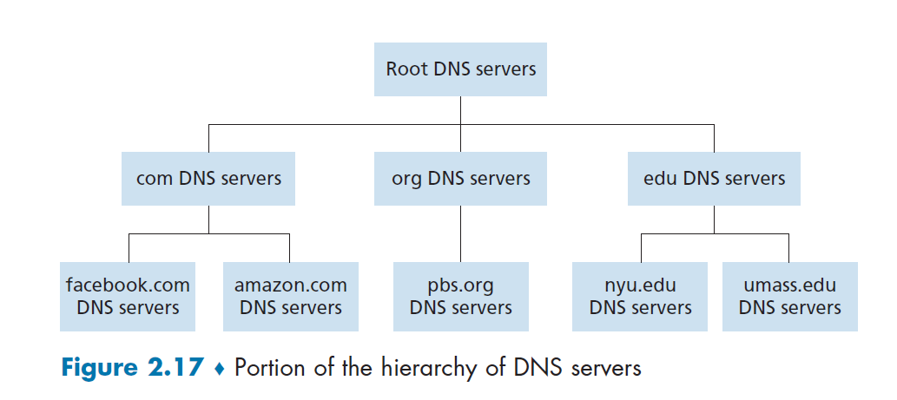

- **根 DNS 服务器**

有 1300 多个根 DNS 服务器实例分布在全世界，如图 2-18 所示。

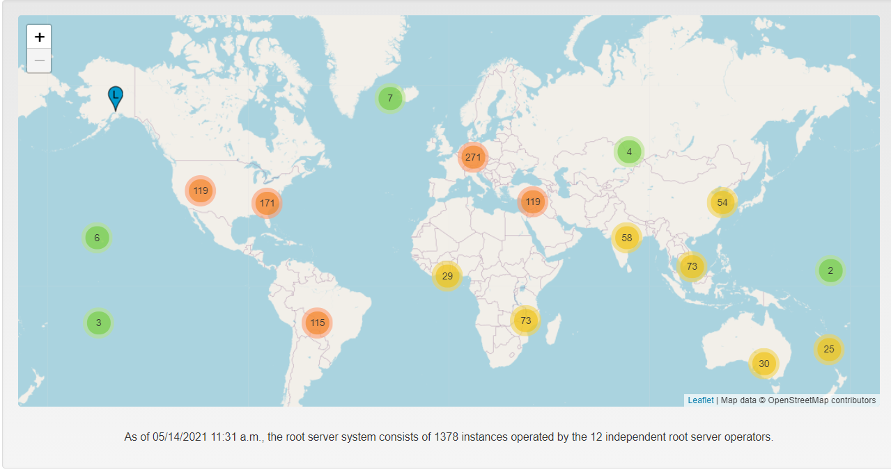

这 1300 多个根 DNS 服务器实例是 13 个根 DNS 服务器的复制，由 12 个独立的组织运作。你可以在[这里](https://root-servers.org/)找到详细信息。

根 DNS 服务器提供了顶级域(TLD)服务器的 IP 地址。

- **顶级域(TLD)服务器**

对于每个顶级域(如 com、org、net、edu 和 gov)和所有国家的顶级域(如 uk、fr、ca 和 jp)，都有 TLD 服务器(或服务器集群)。Veris1gn Global Registry Services 公司维护 com 顶级域的 TLD 服务器，Educause 公司维护 edu 顶级域的 TLD 服务器。你可以在[这里](https://data.iana.org/TLD/tlds-alpha-by-domain.txt)找到顶级域名列表。

TLD 服务器提供了权威 DNS 服务器的 IP 地址。

- **权威 DNS 服务器**

在 Internet 上具有公共可访问主机（如 Web 服务器和邮件服务器）的每个组织机构必须提供公共可访问的 DNS 记录，这些记录将这些主机的名 字映射为 IP 地址。一个组织机构的权威 DNS 服务器收藏了这些 DNS 记录。一个组织机构能够选择实现它自己的权威 DNS 服务器以保存这些记录；另一种方法是，该组织能够支付费用，让这些记录存储在某个服务提供商的一个权威 DNS 服务器中。多数大学和大公司实现和维护它们自己基本和辅助（备份）的权威 DNS 服务器。

- **本地服务器**

根、TLD 和权威 DNS 服务器都处在该 DNS 服务器的层次结构中。还有另一类重要的 DNS 服务器，称为本地 DNS 服务器（local DNS server）。严格说来，一个 本地 DNS 服务器并不属于该服务器的层次结构，但它对 DNS 层次结构是至关重要的。每个 ISP （如一个居民区的 ISP 或一个机构的 ISP）都有一台本地 DNS 服务器（也叫默认名字服务器）。当主机与某个 ISP 连接时，该 ISP 提供一台主机的 IP 地址，该主机具有一台或多台其本地 DNS 服务器的 IP 地址（通常通过 DHCP，将在第 4 章中讨论）。通过访问 Windows 或 UNIX 的网络状态窗口，用户能够容易地确定他的本地 DNS 服务器的 IP 地址。 主机的本地 DNS 服务器通常邻近本主机。对某机构 ISP 而言，本地 DNS 服务器可能就与主机在同一个局域网中；对于某居民区 ISP 来说，本地 DNS 服务器通常与主机相隔不超过几台路由器。当主机发岀 DNS 请求时，该请求被发往本地 DNS 服务器，它起着代理的作用，并将该请求转发到 DNS 服务器层次结构中，我们下面将更为详细地讨论。

我们来讨论一个简单的例子，假设主机 cse.nyu.edu 想知道主机 gaia.cs.umass.edu 的 IP 地址。同时假设纽约大学(NYU)的 cse.nyu.edu 主机的本地 DNS 服务器为 dns.nyu.edu，并且 gaia.cs.umass.edu 的权威 DNS 服务器为 dns.umass.edu。如图 2-19 所示。

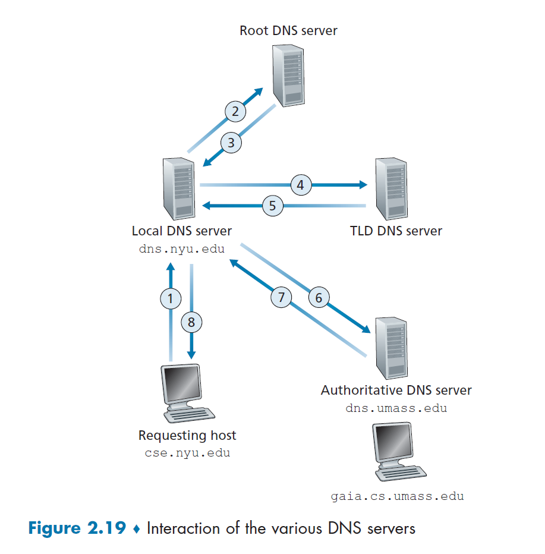

主机 cse.nyu.edu 首先向它的本地 DNS 服务器 dns.nyu.edu 发送一个 DNS 查询报文。该查询报文含有被转换的主机名 gaia.cs.umass.edu。本地 DNS 服务器将该报文转发到根 DNS 服务器。该根 DNS 服务器注意到其 edu 前缀并向本地 DNS 服务器返回负责 edu 的 TLD 的 IP 地址列表。该本地 DNS 服务器则再次向这些 TLD 服务器之一发送查询报文。该 TLD 服务器注意到 umass.edu 前缀，并用权威 DNS 服务器的 IP 地址进行响应，该权威 DNS 服务器是负责马萨诸塞大学的 dns.umass.edu。最后，本地 DNS 服务器直接向 dns.umass.edu 重发查询报文，dns.umass.edu 用 gaia.cs.umass.edu 的 IP 地址进行响应。注意到在本例中，为了获得一台主机名的映射，共发送了 8 份 DNS 报文：4 份查询报文和 4 份回答报文！我们将很快明白利用 DNS 缓存减少这种査询流量的方法。

我们前面的例子假设了 TLD 服务器知道用于主机的权威 DNS 服务器的 IP 地址。一般而言，这种假设并不总是正确的。相反，TLD 服务器只是知道中间的某个 DNS 服务器，该中间 DNS 服务器依次才能知道用于该主机的权威 DNS 服务器。例如，再次假设马萨诸塞大学有一台用于本大学的 DNS 服务器，它称为 dns.umass.edu。 同时假设该大学的每个系都有自己的 DNS 服务器，每个系的 DNS 服务器是本系所有主机的权威服务器。在这种情况下，当中间 DNS 服务器 dns.umass.edu 收到了对某主机的请求时，该主机名是以 cs.umass.edu 结尾，它向 dns.nyu.edu 返回 dns.cs.umass.edu 的 IP 地址，后者是所有以 cs.umass.edu 结尾的主机的权威服务器。本地 DNS 服务器 dns.nyu.edu 则向权威 DNS 服务器发送查询，该权威 DNS 服务器向本地 DNS 服务器返回所希望的映射，该本地服务器依次向请求主机返回该映射。在这个例子中，共发送了 10 份 DNS 报文！

图 2-20 所示的例子利用了 **递归查询(recurs1ve query)** 和 **迭代查询(iterative query)**。从 cse.nyu.edu 到 dns.nyu.edu 发出的查询是递归查询，因为该查询以自己的名义请求 dns.nyu.edu 来获得该映射。而后继的 3 个查询是迭代查询，因为所有的回答都是直接返回给 dns.nyu.edu。从理论上讲，任何 DNS 查询既可以是迭代的也能是递归的。例如，图 2-20 显示了一条 DNS 查询链，其中的所有查询都是递归的。实践中，查询通常遵循图 2-19 中的模式：从请求主机到本地 DNS 服务器的查询是递归的，其余的查询是迭代的。

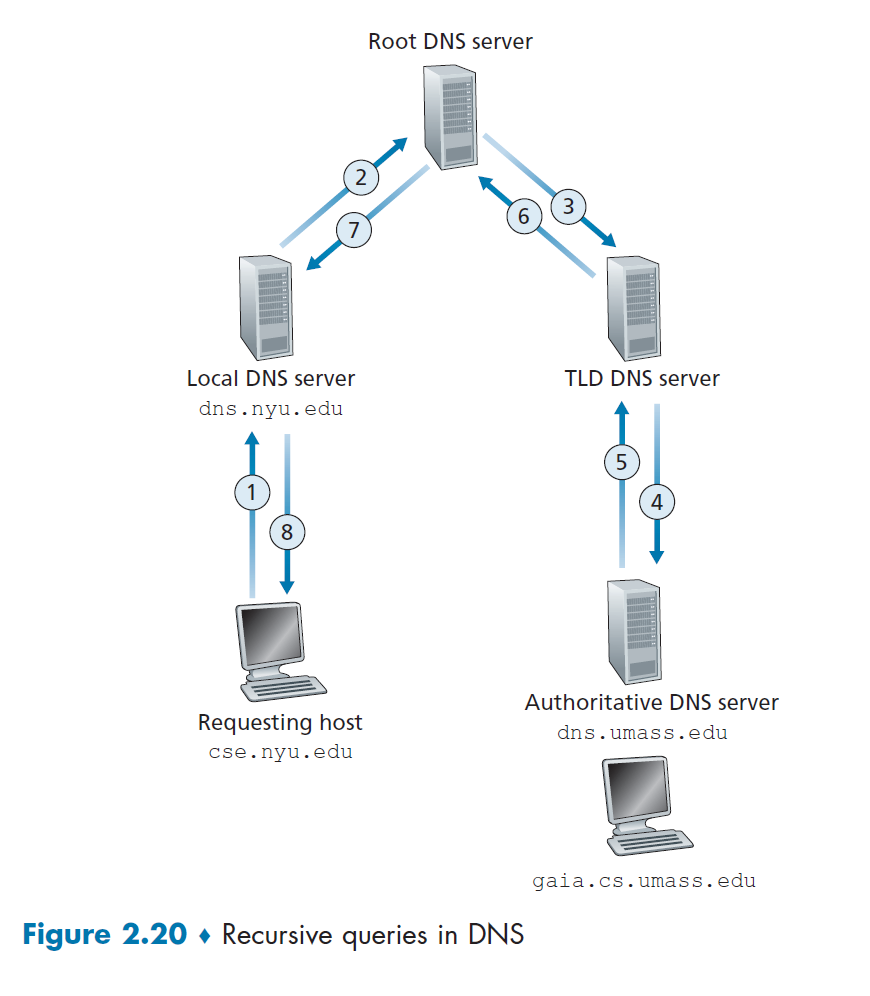

2. **DNS 缓存**

至此我们的讨论一直忽略了 DNS 系统的一个非常重要特色：DNS 缓存(DNS caching)。实际上，为了改善时延性能并减少在 Internet 上到处传输的 DNS 报文数量， DNS 广泛使用了缓存技术。DNS 缓存的原理非常简单。在一个请求链中，当某 DNS 服务器接收一个 DNS 回答(例如，包含某主机名到 IP 地址的映射)时，它能将映射缓存在本地存储器中。例如，在图 2-19 中，每当本地 DNS 服务器 dns.nyu.edu 从某个 DNS 服务器接收到一个回答，它能够缓存包含在该回答中的任何信息。如果在 DNS 服务器中缓存了一台主机名/IP 地址对，另一个对相同主机名的查询到达该 DNS 服务器时，该 DNS 服务器就能够提供所要求的 IP 地址，即使它不是该主机名的权威服务器。由于主机和主机名与 IP 地址间的映射并不是永久的，DNS 服务器在一段时间后(通常设置为两天)将丢弃缓存的信息。

举一个例子，假定主机 apricot.nyu.edu 向 dns.nyu.edu 查询主机名 cnn.com 的 IP 地址。此后，假定过了几个小时，纽约大学的另外一台主机如 kiwi.nyu.edu 也向 dns.nyu.edu 查询相同的主机名。因为有了缓存，该本地 DNS 服务器可以立即返回 cnn.com 的 IP 地址，而不必查询任何其他 DNS 服务器。本地 DNS 服务器也能够缓存 TLD 服务器的 IP 地址，因而允许本地 DNS 绕过查询链中的根 DNS 服务器。事实上，因为缓存，除了少数 DNS 查询以外，根服务器被绕过了。

### 2.4.3. DNS 记录和报文

共同实现 DNS 分布式数据库的所有 DNS 服务器存储了 **资源记录(Resource Record, RR)**， RR 提供了主机名到 IP 地址的映射。每个 DNS 回答报文包含了一条或多条资源记录。在本小节以及后续小节中，我们概要地介绍 DNS 资源记录和报文，更详细的信息可以在 [Albitz 1993] 或有关 DNS 的 RFC 文档 [RFC1034; RFC 1035] 中找到。

资源记录是一个包含了下列字段的 4 元组:

`(Name, Value, Type, TTL)`

TTL 是该记录的生存时间，它决定了资源记录应当从缓存中删除的时间。在下面给岀的记录例子中，我们忽略掉 TTL 字段。Name 和 Value 的值取决于 Type：

- 如果 Type = A，则 Name 是主机名，Value 是该主机名对应的 IP 地址。因此，一条类型为 A 的资源记录提供了标准的主机名到 IP 地址的映射。例如(Tayl.bar.foo.com, 145.37.93.126, A)就是一条类型 A 记录。

- 如果 Type = NS，则 Name 是个域(如 foo.com)，而 Value 是个知道如何获得该域中主机 IP 地址的权威 DNS 服务器的主机名。这个记录用于沿着查询链来路由 DNS 查询。例如(fgcom.cins.foo.com, NS)就是一条类型为 NS 的记录。

- 如果 Type = CNAME，则 Value 是别名为 Name 的主机对应的规范主机名。该记录能够向査询的主机提供一个主机名对应的规范主机名，例如(foo.com, relay 1.bar.foo.com, CNAME)就是一条 CNAME 类型的记录。

- 如果 Type = MX，则 Value 是个别名为 Name 的邮件服务器的规范主机名。举例来说，(foo.com, mail.bar.foo.com, MX)就是一条 MX 记录。MX 记录允许邮件服务器主机名具有简单的别名。值得注意的是，通过使用 MX 记录，一个公司的邮件服务器和其他服务器(如它的 Web 服务器)可以使用相同的别名。为了获得邮件服务器的规范主机名，DNS 客户应当请求一条 MX 记录；而为了获得其他服务器的规范主机名，DNS 客户应当请求 CNAME 记录。

如果一台 DNS 服务器是用于某特定主机名的权威 DNS 服务器，那么该 DNS 服务器会有一条包含用于该主机名的类型 A 记录(即使该 DNS 服务器不是其权威 DNS 服务器，它也可能在缓存中包含有一条类型 A 记录)。如果服务器不是用于某主机名的权威服务器，那么该服务器将包含一条类型 NS 记录，该记录对应于包含主机名的域；它还将包括一条类型 A 记录，该记录提供了在 NS 记录的 Value 字段中的 DNS 服务器的 IP 地址。举例来说，假设一台 edu TLD 服务器不是主机 gaia.cs.umass.edu 的权威 DNS 服务器，则该服务器将包含一条包括主机 cs.umass.edu 的域记录，如 (umass.edu, dns.umass.edu, NS)；该 edu TLD 服务器还将包含一条类型 A 记录，如(dns.umass.edu, 128.119.40.111 A)，该记录将名字 dns.umass.edu 映射为一个 IP 地址。

1. **DNS 报文**

在本节前面，我们提到了 DNS 查询和回答报文。DNS 只有这两种报文，并且，查询和回答报文有着相同的格式，如图 2-21 所示。DNS 报文中各字段的语义如下：

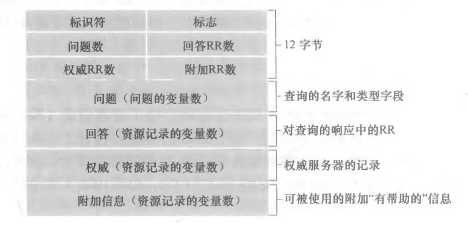

- 前 12 个字节是**首部区域**，其中有几个字段。第一个字段，标识符，是一个 16 比特的数，用于标识该查询。这个标识符会被复制到回答报文中，以便匹配。标志位用于标识该报文为查询报文(0)还是回答报文(1)。后面的 4 个字段，指出了首部后面的各个数据的数量。
- 问题区域包含正在查询的信息，该区域包括 1.域名字段。2.类型字段，指出被查询的问题的类型。，例如主机地址是与一个名字相关联（类型 A）还是与某个名字的邮件服务器相关联（类型 MX）。
- 回答区域包含了对最初请求域名的名字的资源记录。前面讲过每个资源记录中有 Type （如 A、NS、CNAME 和 MX）字段、Value 字段和 TTL 字段。在回答报文的回答区域中可以包含多条 RR,因此一个主机名能够有多个 IP 地址（例如，就像本节前面讨论的冗余 Web 服务器）。
- 权威区域包含了其他权威服务器的记录。
- 附加区域包含了其他有帮助的记录。例如，对于一个 MX 请求的回答报文的回答区域包含了一条资源记录，该记录提供了邮件服务器的规范主机名。该附加区域包含一个类型 A 记录，该记录提供了用于该邮件服务器的规范主机名的 IP 地址。

2. **nslookup**

windows cmd 提供了 nslookup 命令，可以显示出查询的回答。

```bat
nslookup www.baidu.com

服务器:  UnKnown
Address:  192.168.43.33

非权威应答:
名称:    www.a.shifen.com
Addresses:  36.152.44.96
          36.152.44.95
Aliases:  www.baidu.com
```

3. **DNS 数据库的插入**

上面的讨论只是关注如何从 DNS 数据库中取数据。你可能想知道这些数据最初是怎么进入数据库中的。我们在一个特定的例子中看看这是如何完成的。假定你刚刚创建一个称为网络乌托邦（Network Utopia）的令人兴奋的新创业公司。你必定要做的第一件事是在 **注册登记机构** 注册域名 networkutopia.com。注册登记机构（registrar）是一个商业实体，它验证该域名的唯一性，将该域名输入 DNS 数据库（如下面所讨论的那样），对提供的服务收取少量费用。

当你向某些注册登记机构注册域名 networkutopia.com 时，需要向该机构提供你的基本和辅助权威 DNS 服务器的名字和 IP 地址。假定该名字和 IP 地址是 dnsl.networkutopia.com 和 dns2. networkutopia.com 及 212.212.212.1 和 212.212.212.2O 对这两个权威 DNS 服务器 的每一个，该注册登记机构确保将一个类型 NS 和一个类型 A 的记录输入 TLD com 服务器。特别是对于用于 networkutopia.om 的基本权威服务器，该注册登记机构将下列两条资源记录插入该 DNS 系统中：

```
(networkutopia.com, dnsl.networkutopia.com, NS)
(dnsl.networkutopia.com, 212.212.212.1, A)
```

你还必须确保用于 Web 服务器www.networkutopia.com的类型A资源记录和用于邮件 服务器 mail.networkutopia.com 的类型 MX 资源记录被输入你的权威 DNS 服务器中。（直到最近，每台 DNS 服务器中的内容都是静态配置的，例如来自系统管理员的配置文件。
）

一旦完成所有这些步骤，人们将能够访问你的 Web 站点，并向你公司的雇员发送电子邮件。我们通过验证该说法的正确性来总结 DNS 的讨论。这种验证也有助于充实我们已经学到的 DNS 知识。假定在澳大利亚的 Alice 要观看 www.networkutopia.com 的 Web 页 面。如前面所讨论，她的主机将首先向其本地 DNS 服务器发送请求。该本地服务器接着则联系一个 TLD com 服务器。（如果 TLD com 服务器的地址没有被缓存，该本地 DNS 服务器也将必须与根 DNS 服务器相联系。）该 TLD 服务器包含前面列出的类型 NS 和类型 A 资源记录，因为注册登记机构将这些资源记录插入所有的 TLD com 服务器。该 TLD com 服务器向 Alice 的本地 DNS 服务器发送一个回答，该回答包含了这两条资源记录。该本地 DNS 服务器则向 212.212.212.1 发送一个 DNS 査询,请求对应于 www.networkutopia.com 的类型 A 记录。该记录提供了所希望的 Web 服务器的 IP 地址，如 212.212.71.4,本地 DNS 服务器将该地址回传给 Alice 的主机。Alice 的浏览器此时能够向主机 212. 212. 71. 4 发起一个 TCP 连接，并在该连接上发送一个 HTTP 请求。当一个人在网上冲浪时，有比满足眼球更多的事情在进行!

## 2.5. P2P 文件分发

**time : 2020-05-15**

在目前为止本章中描述的应用（包括 Web、电子邮件和 DNS）都采用了客户-服务器体系结构，极大地依赖于总是打开的基础设施服务器。2.1.1 节讲过，使用 P2P 体系结构，对总是打开的基础设施服务器有最小的（或者没有）依赖。与之相反，成对间歇连接的主机（称为对等方）彼此直接通信。这些对等方并不为服务提供商所拥有，而是受用户控制的桌面计算机和膝上计算机。

在本节中我们将研究一个非常自然的 P2P 应用，即从单一服务器向大量主机（称为对等方）分发一个大文件。该文件也许是一个新版的 Linux 操作系统，对于现有操作系统或应用程序的一个软件补丁，一个 MP3 音乐文件，或一个 MPEG 视频文件。在客户-服务器文件分发中，该服务器必须向每个对等方发送该文件的一个副本，即服务器承受了极大的负担，并且消耗了大量的服务器带宽。在 P2P 文件分发中，每个对等方能够向任何其他对等方重新分发它已经收到的该文件的任何部分，从而在分发过程中协助该服务器。到 2020 年止，最为流行的 P2P 文件分发协议是 BitTorrent。 该应用程序最初由 Bram Cohen 所研发，现在有许多不同的独立且符合 BitTorrent 协议的 BitTorrent 客户，就像有许多符合 HTTP 协议的 Web 浏览器客户一样。在下面的小节中，我们首先考察在文件分发环境中的 P2P 体系结构的自扩展性。然后我们更为详细地描述 BitTorrent,突出它的最为重要的特性和特色。

1. **P2P 体系结构的扩展性**

P2P 文件分发的描述如图 2-22 所示。

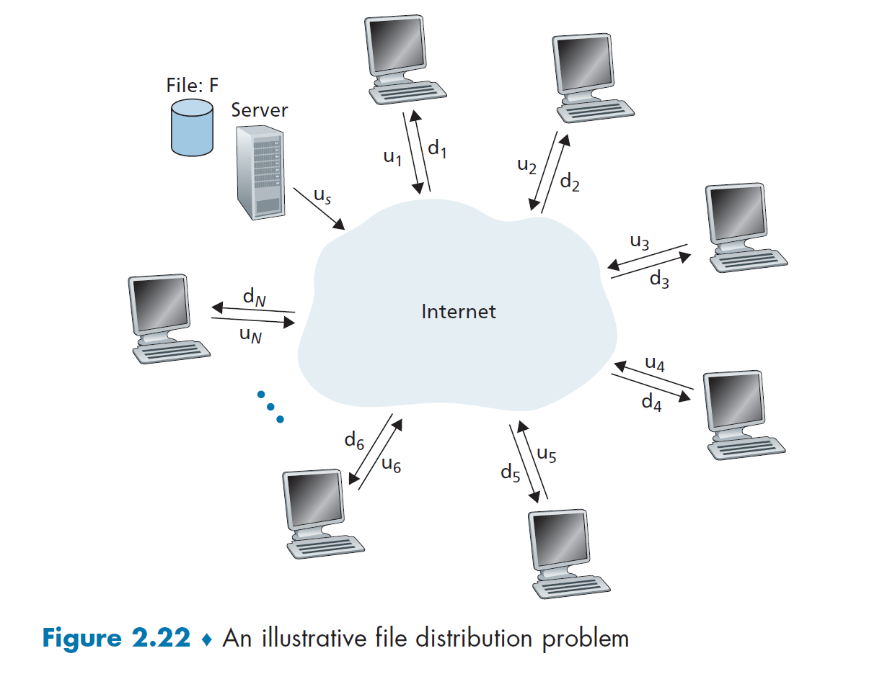

**分发时间(distribution time)** 是所有 N 个对等方得到该文件的副本所需要的时间。

如图 2-23 所示，P2P 体系结构的分发时间在对等方数量非常多时，客户-服务器体系结构和它的差距非常大。

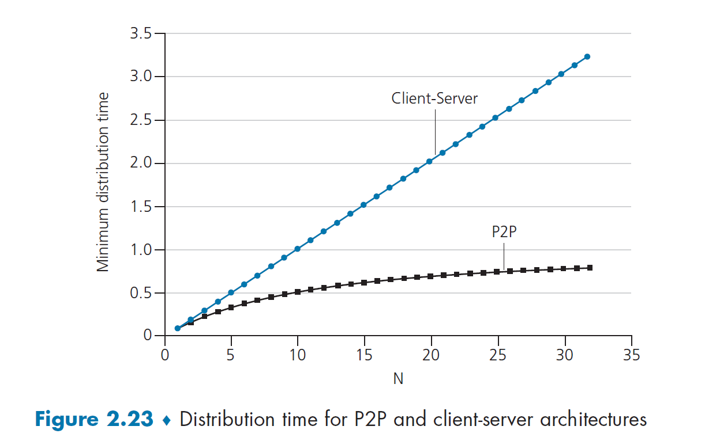

我们从图 2-23 中看到，对于客户-服务器体系结构，随着对等方数量的增加，分发时间呈线性增长并且没有界。然而，对于 P2P 体系结构， 最小分发时间不仅总是小于客户-服务器体系结构的分发时间，并且对于任意的对等方数量 N，总是小于 1 小时。因此，具有 P2P 体系结构的应用程序能够是自扩展的。这种扩展性的直接成因是: 对等方除了是比特的消费者外还是它们的重新分发者。

2. **BitTorrent**

BitTorrent 是一种用于文件分发的流行 P2P 协议[Chao 2011] 。 用 BitTorrent 的术语来讲，参与一个特定文件分发的所有对等方的集合被称为一个**洪流(torrent)**。在一个洪流中的对等方彼此下载等长度的**文件块(chunk)**，典型的块长度为 256KB。当一个对等方首次加入一个洪流时，它没有块。随着时间的流逝，它累积了越来越多的块。当它下载块时，也为其他对等方上载了多个块。一旦某对等方获得了整个文件，它也许（自私地）离开洪流，或（大公无私地）留在该洪流中并继续向其他对等方上载块。同时，任何对等方可能在任何时候仅具有块的子集就离开该洪流，并在以后重新加入该洪流中。

我们现在更为仔细地观察 BitTorrent 运行的过程。因为 BitTorrent 是一个相当复杂的协议，所以我们将仅描述它最重要的机制，而对某些细节视而不见；这将使得我们能够通过树木看森林。每个洪流具有一个基础设施节点，称为**追踪器(tracker)**。当一个对等方加入某洪流时，它向追踪器注册自己，并周期性地通知追踪器它仍在该洪流中。以这种方式，追踪器跟踪参与在洪流中的对等方。一个给定的洪流可能在任何时刻具有数以百计或数以千计的对等方。

如图 2-24 所示，当一个新的对等方 Alice 加入该洪流时，追踪器随机地从参与对等 的集合中选择对等方的一个子集（为了具体起见，设有 50 个对等方），并将这 50 个对等方的 IP 地址发送给 Aliceo Alice 持有对等方的这张列表，试图与该列表上的所有对等方创建并行的 TCP 连接。我们称所有这样与 Alice 成功地创建一个 TCP 连接的对等方为“邻近对等方”（在图 2-23 中，Alice 显示了仅有三个邻近对等方。通常，她应当有更多的对等方）。随着时间的流逝，这些对等方中的某些可能离开，其他对等方（最初 50 个以外的）可能试图与 Alice 创建 TCP 连接。因此一个对等方的邻近对等方将随时间而波动。

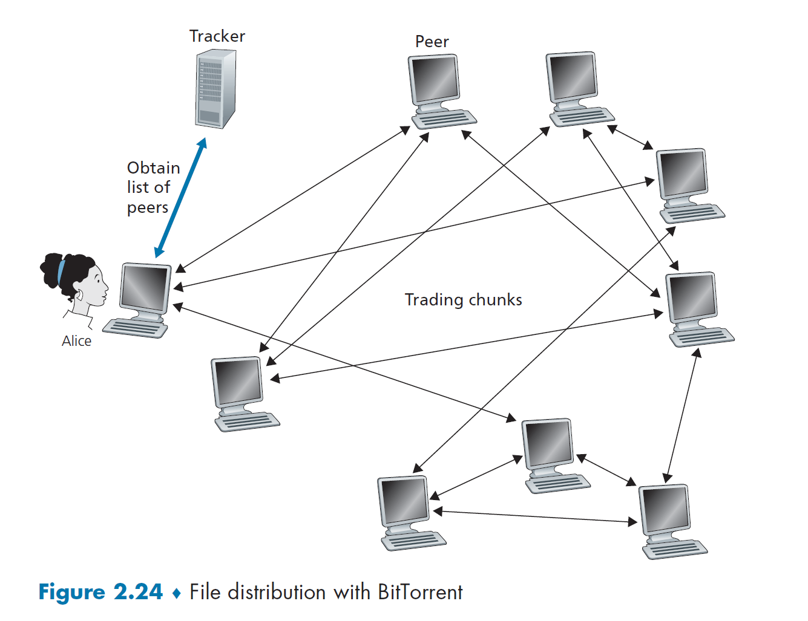

在任何给定的时间，每个对等方将具有来自该文件的块的子集，并且不同的对等方具有不同的子集。Alice 周期性地（经 TCP 连接）询问每个邻近对等方它们所具有的块列表。 如果 Alice 具有 L 个不同的邻接节点，她将获得 L 个块列表。有了这个信息，Alice 将对她当前还没有的块发出请求（仍通过 TCP 连接）。

因此在任何给定的时刻，Alice 将具有块的子集并知道它的邻接节点具有哪些块。利用这 些信息，Alice 将做出两个重要决定。第一，她应当从她的邻接节点请求哪些块呢？第二，她应当向哪些向她请求块的邻接节点发送块？在决定请求哪些块的过程中，Alice 使用一种称为 **最稀缺优先（rarest first）** 的技术。这种技术的思路是，针对她没有的块在她的邻接节点中决定最稀缺的块（最稀缺的块就是那些在她的邻接节点中副本数量最少的块），并首先请求那些最稀缺的块。这样，最稀缺块得到更为迅速的重新分发，其目标是（大致地）均衡每个块在洪流中的副本数量。

为了决定她响应哪个请求，BitTorrent 使用了一种机灵的对换算法。其基本想法是，Alice 根据当前能够以最高速率向她提供数据的邻接节点，给出其优先权。特别是，Alice 对于她的每个邻接节点都持续地测量接收到比特的速率，并确定以最高速率流入的 4 个邻接节点。每过 10 秒，她重新计算该速率并可能修改这 4 个对等方的集合。用 BitTorrent 术语来说，这 4 个对等方被称为 **疏通(unchoked)**。重要的是，每过 30 秒，她也要随机地选择另外一个邻接节点并向其发送块。我们将这个被随机选择的对等方称为 Bob。因为 Alice 正在向 Bob 发送数据，她可能成为 Bob 前 4 位上载者之一，这样的话 Bob 将开始向 Alice 发送数据。如果 Bob 向 Alice 发送数据的速率足够高，Bob 接下来也能成为 Alice 的前 4 位上载者。换言之, 每过 30 秒 Alice 将随机地选择一名新的对换伴侣并开始与那位伴侣进行对换。如果这两名对等方都满足此对换，它们将对方放入其前 4 位列表中并继续与对方进行对换，直到该对 等方之一发现了一个更好的伴侣为止。这种效果是对等方能够以趋向于找到彼此的协调的速率上载。随机选择邻接节点也允许新的对等方得到块，因此它们能够具有对换的东西。除了这 5 个对等方（“前” 4 个对等方和一个试探的对等方）的所有其他相邻对等方均被“阻塞”，即它们不能从 Alice 接收到任何块。BitTorrent 有一些有趣的机制没有在这里讨论, 包括片（小块）、流水线、随机优先选择、残局模型和反怠慢[Cohen 2003]。

刚刚描述的关于交换的激励机制常被称为“一报还一报”（tit-for-tat） [Cohen 2003]。已证实这种激励方案能被回避[Liogkas 2006; Locher 2006； Piatek 2007]。无论如何,
BitTorrent “生态系统”取得了广泛成功，数以百万计的并发对等方在数十万条洪流中积极地共享文件。如果 BitTorrent 被设计为不采用一报还一报（或一种变种），然而在别的方面却完全相同的协议，BitTorrent 现在将很可能不复存在了，因为大多数用户将成为白嫖者了。[Sarouiu 2002]。

## 2.6. 视频流和内容分发网络(CDN)

据多方估计，流式视频包含 Netflix，Youtube 和 Amazon 占据了 80% 的 Internet 流量[Cisco 2020]。在本节中，我们将对如何在今天的 Internet 中实现流行的视频流服务进行概述。我们将看到它们的实现方式是使用应用层协议和以像高速缓存那样方式运行的服务器。

### 2.6.1. Internet 视频

在流式存储视频应用中，基础的媒体是预先录制的视频，例如电影、电视节目、录制好的体育事件或录制好的用户生成的视频（如通常在 YouTube 上可见的那些）。这些预先录制好的视频放置在服务器上，用户按需向这些服务器发送请求来观看视频。许多 Internet
公司现在提供流式视频，这些公司包括 Netflix、YouTube(谷歌)、Amazon 和抖音(TicTok)。

但在开始讨论视频流之前，我们先迅速感受一下视频媒体自身。视频是一系列的图像， 通常以一种恒定的速率（如每秒 24 或 30 张图像）来展现。一幅未压缩、数字编码的图像由像素阵列组成，其中每个像素是由一些比特编码来表示亮度和颜色。视频的一个重要特征是它能够被压缩，因而可用比特率来权衡视频质量。今天现成的压缩算法能够将一个视频压缩成所希望的任何比特率。当然，比特率越高，图像质量越好，用户的总体视觉感受越好。

从网络的观点看，也许视频最为突出的特征是它的高比特率。压缩的 Internet 视频的比特率范围通常从用于低质量视频的 100kbps,到用于流式高分辨率电影的超过 3Mbps,再到用于 4K 流式展望的超过 10Mbps。这能够转换为巨大的流量和存储，特别是对高端视频。例如，单一 2Mbps 视频在 67 分钟期间将耗费 1GB 的存储和流量。到目前为止，对流式视频的最为重要的性能度量是平均端到端吞吐量。为了提供连续不断的布局，网络必须为流式应用提供平均吞吐量，这个流式应用至少与压缩视频的比特率一样大。

我们也能使用压缩生成相同视频的多个版本，每个版本有不同的质量等级。例如，我们能够使用压缩生成相同视频的 3 个版本，比特率分别为 300kbps、1Mbps 和 3Mbps。用户则能够根据他们当前可用带宽来决定观看哪个版本。具有高速 Internet 连接的用户也许选择 3Mbps 版本，使用智能手机通过 4G 观看视频的用户可能选择 1Mbps 版本。

### 2.6.2. HTTP 流和 DASH

在 HTTP 流中，视频只是存储在 HTTP 服务器中作为一个普通的文件，每个文件有一 个特定的 URL。当用户要看该视频时，客户与服务器创建一个 TCP 连接并发送对该 URL 的 HTTP GET 请求。服务器则以底层网络协议和流量条件允许的尽可能快的速率，在一个 HTTP 响应报文中发送该视频文件。在客户一侧，字节被收集在客户应用缓存中。一旦该缓存中的字节数量超过预先设定的门限，客户应用程序就开始播放，特别是，流式视频应 用程序周期性地从客户应用程序缓存中抓取帧，对这些帧解压缩并且在用户屏幕上展现。 因此，流式视频应用接收到视频就进行播放，同时缓存该视频后面部分的帧。

如前一小节所述，尽管 HTTP 流在实践中已经得到广泛部署(例如，自 YouTube 发展初期开始)，但它具有严重缺陷，即所有客户接收到相同编码的视频，尽管对不同的客户或者对于相同客户的不同时间而言，客户可用的带宽大小有很大不同。这导致了一种新型基于 HTTP 的流的研发，它常常被称为经 HTTP 的 **动态适应性流(Dynamic Adaptive Streaming over HTTP, DASH)**。在 DASH 中，视频编码为几个不同的版本，其中每个版本具有不同的比特率，对应于不同的质量水平。客户动态地请求来自不同版本且长度为几秒的视频段数据块。当可用带宽量较高时，客户自然地选择来自高速率版本的块；当可用带宽量较低时，客户自然地选择来自低速率版本的块。客户用 HTTP GET 请求报文一次选择一个不同的块[Akhshabi 2011]。

DASH 允许客户使用不同的以太网接入速率流式播放具有不同编码速率的视频。使用低速连接的客户能够接收一个低比特率(和低质量)的版本，使用光纤连接的客户能够接收高质量的版本。如果端到端带宽在会话过程中改变的话，DASH 允许客户适应可用带宽。这种特色对于移动用户特别重要，当移动用户相对于基站移动时，通常他们能感受到其可用带宽的波动。

使用 DASH 后，每个视频版本存储在 HTTP 服务器中，每个版本都有一个不同的 URL。HTTP 服务器也有一个 **告示文件(manifest file)**，为每个版本提供了一个 URL 及其比特率。客户首先请求该告示文件并且得知各种各样的版本。然后客户通过在 HTTP GET 请求报文中对每块指定一个 URL 和一个字节范围，一次选择一块。在下载块的同时，客户也测量接收带宽并运行一个速率决定算法来选择下次请求的块。自然地，如果客户缓存 的视频很多，并且测量的接收带宽较高，它将选择一个高速率的版本。同样，如果客户缓存的视频很少，并且测量的接收带宽较低，它将选择一个低速率的版本。因此 DASH 允许客户自由地在不同的质量等级之间切换。

### 2.6.3. 内容分发网络

今天，许多 Internet 视频公司日复一日地向数以百万计的用户按需分发每秒数兆比特的 流。例如，YouTube 的视频库藏有几亿个，每天向全世界的用户分发几亿条流。向位于全世 界的所有用户流式传输所有流量同时提供连续播放和高交互性显然是一项有挑战性的任务。

对于一个 Internet 视频公司，或许提供流式视频服务最为直接的方法是建立单一的大规 模数据中心，在数据中心中存储其所有视频，并直接从该数据中心向世界范围的客户传输 流式视频。但是这种方法存在三个问题。首先，如果客户远离数据中心，服务器到客户的分组将跨越许多通信链路并很可能通过许多 ISP,其中某些 ISP 可能位于不同的大洲。如果这些链路之一提供的吞吐量小于视频消耗速率，端到端吞吐量也将小于该消耗速率，给用户带来恼人的停滞时延。（第 1 章讲过，一条流的端到端吞吐量由瓶颈链路的吞吐量所决定。）出现这种事件的可能性随着端到端路径中链路数量的增加而增加。第二个缺陷是 流行的视频很可能经过相同的通信链路发送许多次。这不仅浪费了网络带宽，Internet 视频公司自己也将为向 Internet 反复发送相同的字节而向其 ISP 运营商（连接到数据中心）支付 费用。这种解决方案的第三个问题是单个数据中心代表一个单点故障，如果数据中心或其 通向 Internet 的链路崩溃，它将不能够分发任何视频流了。

为了应对向分布于全世界的用户分发巨量视频数据的挑战，几乎所有主要的视频流公司都利用 **内容分发网（Content Distribution Network, CDN）**。 CDN 管理分布在多个地理位置上的服务器，在它的服务器中存储视频（和其他类型的 Web 内容，包括文档、图片和音频）的副本，并且所有试图将每个用户请求定向到一个将提供最好的用户体验的 CDN 位 置。CDN 可以是专用 CDN （private CDN），即它由内容提供商自己所拥有；例如，谷歌的 CDN 分发 YouTube 视频和其他类型的内容。另一种 CDN 可以是第三方 CDN （third- party CDN），它代表多个内容提供商分发内容；Akamai, Limelight 和 Level-3 都运行第三方 CDN。现代 CDN 的一个可读性强的展望见[Leighton 2009; Nygren 2010]。

CDN 通常采用两种不同的服务器安置原则［Huang 2008]：

- 深入。第一个原则由 Akamai 首创，该原则是通过在遍及全球的接入 ISP 中部署服 务器集群来深入到 ISP 的接入网中。（在 1.3 节中描述了接入网。）Akamai 在大约 1700 个位置采用这种方法部署集群。其目标是靠近端用户，通过减少端用户和 CDN 集群之间（内容从这里收到）链路和路由器的数量，从而改善了用户感受的时延和吞吐量。因为这种高度分布式设计，维护和管理集群的任务成为挑战。
- 邀请做客。第二个设计原则由 Limelight 和许多其他 CDN 公司所采用，该原则是通过在少量（例如 10 个）关键位置建造大集群来邀请到 ISP 做客。不是将集群放在接入 ISP 中，这些 CDN 通常将它们的集群放置在 Internet 交换点（IXP）。与深入设计原则相比，邀请做客设计通常产生较低的维护和管理开销，可能 以对端用户的较高时延和较低吞吐量为代价。

一旦 CDN 的集群准备就绪，它就可以跨集群复制内容。CDN 可能不希望将每个视频的副本放置在每个集群中，因为某些视频很少观看或仅在某些国家中流行。事实上，许多 CDN 没有将视频推入它们的集群，而是使用一种简单的拉策略：如果客户向一个未存储该视频的集群请求某视频，则该集群检索该视频（从某中心仓库或者从另一个集群），向客户流式传输视频时的同时在本地存储一个副本。类似于代理（参见 2.2.5 节），当某集群存储器变满时，它删除不经常请求的视频。

1. **CDN 操作**

在讨论过这两种部署 CDN 的重要方法后，我们现在深入看看 CDN 操作的细节。当用户主机中的一个浏览器指令检索一个特定的视频（由 URL 标识）时，CDN 必须截获该请 求，以便能够：1.确定此时适合用于该客户的 CDN 服务器集群；2.将客户的请求重定向到该集群的某台服务器。我们很快将讨论 CDN 是如何能够确定一个适当的集群的。但是我们首先考察截获和重定向请求所依赖的机制。

大多数 CDN 利用 DNS 来截获和重定向请求。这种使用 DNS 的一个有趣 讨论见［Vixie2009］。举个例子，假定一个内容提供商 NetCinema，雇佣了第三方 CDN 公司 KingCDN 来向客户分发视频。在 NetCinema 的 Web 网页上，它的每一个视频都被指定了一个 URL，该 URL 包含了 video 和视频的 id 标识符，例如《变形金刚 7》可以被表示为 http://video.netcinema.com/6Y7B23V。接下来的步骤如图2-25所示：

- 用户访问位于 NetCinema 的 Web 网页。
- 当用户点击 http://video.netcinema.com/6Y7B23V 时，该用户发送了一个对 video.netcinema.com 的 DNS 请求。
- 用户的本地 DNS 服务器(LDNS)将该 DNS 请求中继到一台用于 NetCinema 的权威 DNS 服务器，该服务器观察到主机名 video.netcinema.com 中的字符串“video”。为了将该 DNS 请求移交给 KingCDN, NetCinema 权威 DNS 服务器并不返回一个 IP 地址，而是向 LDNS 返回一个 KingCDN 域的主机名，如 a1105.kingcdn.com。
- 从这时起，DNS 请求进入了 KingCDN 专用 DNS 基础设施。用户的 LDNS 则发送第二个请求，此时是对 a1105.kingcdn.com 的 DNS 请求，KingCDN 的 DNS 系统最终向 LDNS 返回 KingCDN 内容服务器的 IP 地址。所以正是在这里，在 KingCDN 的 DNS 系统中，指定了 CDN 服务器.客户将能够从这台服务器接收到它的内容。
- LDNS 向用户主机转发内容服务 CDN 节点的 IP 地址。
- 一旦客户收到 KingCDN 内容服务器的 IP 地址，它与具有该 IP 地址的服务器创建了一条直接的 TCP 连接，并且发出对该视频的 HTTP GET 请求。如果使用了 DASH，服务器将首先向客户发送具有 URL 列表的告示文件，每个 URL 对应视频的每个版本，并且客户将动态地选择来自不同版本的块。

2. **集群选择策略**

任何 CDN 部署，其核心是**集群选择策略(cluster selection strategy)**，即动态地将客户定向到 CDN 中的某个服务器集群或数据中心的机制。如我们刚才所见，经过客户的 DNS 查找，CDN 得知了该客户的 LDNS 服务器的 IP 地址。在得知该 IP 地址之后，CDN 需要基 于该 IP 地址选择一个适当的集群。CDN —般采用专用的集群选择策略。我们现在简单地介绍一些策略，每种策略都有其优点和缺点。

一种简单的策略是指派客户到地理上最为邻近(geographically closest)的集群。使用 商用地理位置数据库(例如 Quova [Quova 2016]和 Max-Mind [MaxMind 2016]),每个 LDNS IP 地址都映射到一个地理位置。当从一个特殊的 LDNS 接收到一个 DNS 请求时,CDN 选择地理上最为接近的集群，即离 LDNS 最少几千米远的集群，“就像鸟飞一样”。这 样的解决方案对于众多用户来说能够工作得相当好[Agarwal 2009]。但对于某些客户，该解决方案可能执行的效果差，因为就网络路径的长度或跳数而言，地理最邻近的集群可能并不是最近的集群。此外，种所有基于 DNS 的方法都内在具有的问题是，某些端用户配置使用位于远地的 LDNS [Shaikh 2001； Mao 2002],在这种情况下，LDNS 位置可能远离客户的位置。此外，这种简单的策略忽略了时延和可用带宽随 Internet 路径时间而变化，总是为特定的客户指派相同的集群。

为了基于当前流量条件为客户决定最好的集群，CDN 能够对其集群和客户之间的时延和丢包性能执行周期性的 **实时测量(real-time measurement)**。 例如，CDN 能够让它的每个集群周期性地向位于全世界的所有 LDNS 发送探测分组(例如，ping 报文或 DNS 请求)。 这种方法的一个缺点是许多 LDNS 被配置为不会响应这些探测。

## 2.7. 套接字编程

**time : 2021-06-04**

我们已经看到了一些重要的网络应用，下面探讨一下网络应用程序是如何实际编写的。在 2.1 节讲过，典型的网络应用是由一对程序（即客户程序和服务器程序）组成的, 它们位于两个不同的端系统中。当运行这两个程序时，创建了一个客户进程和一个服务器 进程，同时它们通过从套接字读出和写入数据在彼此之间进行通信。开发者创建一个网络应用时，其主要任务就是编写客户程序和服务器程序的代码。

网络应用程序有两类。一类是由协议标准（如一个 RFC 或某种其他标准文档）中所定义的操作的实现；这样的应用程序有时称为“开放”的，因为定义其操作的这些规则为 人们所共知。对于这样的实现，客户程序和服务器程序必须遵守由该 RFC 所规定的规则。 例如，某客户程序可能是 HTTP 协议客户端的一种实现，如在 2. 2 节所描述，该协议由 RFC 2616 明确定义；类似地，其服务器程序能够是 HTTP 服务器协议的一种实现，也由 RFC 2616 明确定义。如果一个开发者编写客户程序的代码，另一个开发者编写服务器程序的代码，并且两者都完全遵从该 RFC 的各种规则，那么这两个程序将能够交互操作。 实际上，今天许多网络应用程序涉及客户和服务器程序间的通信，这些程序都是由独立的 程序员开发的。例如，谷歌 Chrome 浏览器与 Apache Web 服务器通信，BitTorrent 客户与 BitTorrent 跟踪器通信。

另一类网络应用程序是专用的网络应用程序。在这种情况下，由客户和服务器程序应用的应用层协议没有公开发布在某 RFC 中或其他地方。某单独的开发者（或开发团队） 产生了客户和服务器程序，并且该开发者用他的代码完全控制该代码的功能。但是因为这些代码并没有实现一个开放的协议，其他独立的开发者将不能开发出和该应用程序交互的代码。

在本节中，我们将考察研发一个客户-服务器应用程序中的关键问题，我们将“亲力亲为”来实现一个非常简单的客户-服务器应用程序代码。在研发阶段，开发者必须 最先做的一个决定是，应用程序是运行在 TCP 还是运行在 UDP 上。前面讲过 TCP 是面向连接的，并且为两个端系统之间的数据流动提供可靠的字节流通道。UDP 是无连接的，从一个端系统向另一个端系统发送独立的数据分组，不对交付提供任何保证。前面也讲过当客户或服务器程序实现了一个由某 RFC 定义的协议时，它应当使用与该协议 关联的周知端口号；与之相反，当研发一个专用应用程序时，研发者必须注意避免使用这些周知端口号。（端口号已在 2.1 节简要讨论过。它们将在第 3 章中更为详细地涉及。）

我们通过一个简单的 UDP 应用程序和一个简单的 TCP 应用程序来介绍 UDP 和 TCP 套接字编程。我们用 Python 3 来呈现这些简单的 TCP 和 UDP 程序。也可以用 Java、C 或 C++来编写这些程序，而我们选择用 Python 最主要原因是 Python 清楚地揭示了关键的套接字概念。使用 Python,代码的行数更少，并且向新编程人员解释每一行代码不会有困难。如果你不熟悉 Python,也用不着担心，只要你有过一些用 Java. C 或 C++编程的经验，就应该很容易看懂下面的代码。

如果读者对用 C 进行客户-服务器编程感兴趣，有一些优秀参考资料可供使用[Donah 2001 ； Stevens 1997； Frost 1994 ； Kurose 1996 ]。 我们下面使用的编程语言 python，它的特点是简洁和易于理解，这方便我们把注意力集中在需要注意的地方，而不是那些语法。

### 2.7.1. UDP 套接字编程

在本小节中，我们将编写使用 UDP 的简单客户-服务器程序；在下一小节中，我们将编写使用 TCP 的简单程序。

2.1 节讲过，运行在不同机器上的进程彼此通过向套接字发送报文来进行通信。我们说过每个进程好比是一座房子，该进程的套接字则好比是一扇门。应用程序位于房子中门的一侧；运输层位于该门朝外的另一侧。应用程序开发者在套接字的应用层一侧可以控制所有东西；然而，它几乎无法控制运输层一侧。

现在我们仔细观察使用 UDP 套接字的两个通信进程之间的交互。在发送进程能够将数据分组推出套接字之门之前，当使用 UDP 时，必须先将目的地址附在该分组之上。在该分组传过发送方的套接字之后，Internet 将使用该目的地址通过 Internet 为该分组选路到接收进程的套接字。当分组到达接收套接字时，接收进程将通过该套接字取回分组，然后检查分组的内容并采取适当的动作。

因此你可能现在想知道，附在分组上的目的地址包含了什么？如你所期待的那样，目的主机的 IP 地址是目的地址的一部分。通过在分组中包括目的地的 IP 地址，Internet 中的路由器将能够通过 Internet 将分组选路到目的主机。但是因为一台主机可能运行许多网络应用进程，每个进程具有一个或多个套接字，所以在目的主机指定特定的套接字也是必要的。当生成一个套接字时，操作系统为它分配一个称为 **端口号(port number)** 的标识符。因此，如你所期待的，分组的目的地址也包括该套接字的端口号。总的来说，发送进程为分组附上目的地址，该目的地址是由目的主机的 IP 地址和目的地套接字的端口号组成的。此外，如我们很快将看到的那样，发送方的源地址也是由源主机的 IP 地址和源套接字的端口号组成，该源地址也要附在分组之上。然而，需要注意的是：将源地址附在分组之上通常并不是由 UDP 应用程序代码所为，而是由底层操作系统自动完成的。

我们将使用下列简单的客户-服务器应用程序来演示对于 UDP 和 TCP 的套接字编程:

1. 客户从其键盘读取一行字符(数据)并将该数据向服务器发送。
2. 服务器接收该数据并将这些字符转换为大写。
3. 服务器将修改的数据发送给客户。
4. 客户接收修改的数据并在其监视器上将该行显示出来。

图 2-27 着重显示了客户和服务器的主要与套接字相关的活动，两者通过 UDP 运输服务进行通信。

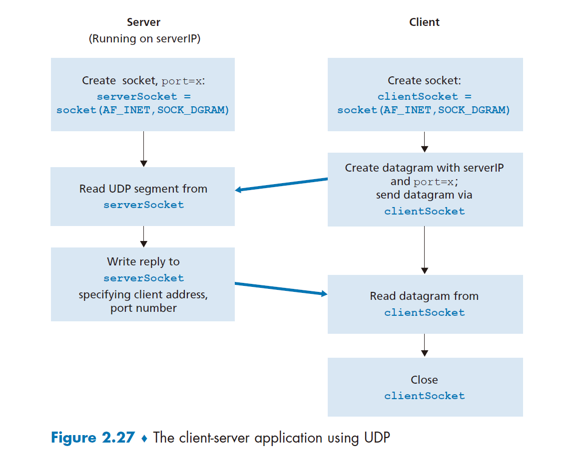

现在我们自己动手来查看用 UDP 实现这个简单应用程序的一对客户-服务器程序。我们在每个程序后也提供一个详细、逐行的分析。我们将以 UDP 客户开始，该程序将向服务器发送一个简单的应用级报文。服务器为了能够接收并回答该客户的报文，它必须准备好并已经在运行，这就是说，在客户发送其报文之前，服务器必须作为一个进程正在运行。

客户程序被称为 UDPClient.py，服务器程序被称为 UDPServer.py。 为了强调关键问题，我们有意提供最少的代码。“好代码”无疑将具有更多辅助性的代码行，特别是用于处理岀现差错的情况。对于本应用程序，我们任意选择了 12000 作为服务器的端口号。

1. **UDPClient.py**

下面是该应用程序客户端的代码，你可以在 `socket_programming/udp_socket` 下找到：

```py
from socket import *
serverName = 'localhost'
serverPort = 12000
clientSocket = socket(AF_INET, SOCK_DGRAM)
message = input('输入一个全是小写的句子：')
clientSocket.sendto(message.encode(), (serverName, serverPort))
modifiedMessage, serverAddress = clientSocket.recvfrom(2048)
print(modifiedMessage.decode())
clientSocket.close()
```

现在我们来仔细观察 UDPClient.py 的各行代码。

```py
from socket import *
```

这行代码是一个导包语句，它将我们要用到的所有关于套接字的东西导入了 UDPClient.py。

```py
serverName = 'localhost'
serverPort = 12000
```

这一段代码的第一行将字符串字面量 `localhost` 赋给了变量 `serverName`。这里的字符串是我们服务器的主机名或 IP 地址。如果我们使用主机名则将自动执行 DNS lookup 从而得到 IP 地址。第二行将整数字面量 `12000` 赋给了变量 `serverPort`。

```py
clientSocket = socket(AF_INET, SOCK_DRGAM)
```

该行创建了客户的套接字，称为 clientSocket。第一个参数指定了地址类型，这里 `AF_INET` 指定了底层网络使用了 IPv4。(此时不必担心，我们将在第 4 章中讨论 IPv4)。第二个参数指示了该套接字是 `SOCK_DGRAM` 类型的，这指定了它是一个 UDP 套接字(而不是一个 TCP 套接字)。值得注意的是，当创建套接字时，我们并没有指定客户套接字的端口号；这是因为操作系统自动分配了端口号。既然已经创建了客户进程的门，我们将要生成通过该门发送的报文。

```py
message = input('输入一个全是小写的句子：')
```

`input()` 是 Python 中的内置函数。当执行这条命令时，客户控制台将以“输入一个全是小写的句子：”进行提示，用户则使用键盘输入内容，该内容被放入变量 `message` 中。既然我们有了一个套接字和一条报文，我们将要通过该套接字向目的主机发送报文。

```py
clientSocket.sendto(message.encode(), (serverName, serverPort))
```

在这行中，我们首先将报文由字符串类型转换为字节类型，因为我们需要向套接字中发送字节类型的数据。这各操作通过使用 `encode()` 方法完成。方法 `sendto()` 为报文附上目的地址 `(serverName, serverPort)` 并且向进程的套接字 clientSocket 发送分组。(如前面所述，源地址也附到分组上，尽管这是自动完成的，而不是显式地由代码完成的)。在发送分组之后，客户等待接收来自服务器的数据。

```py
modifiedMessage, serverAddress = clientSocket.recvfrom(2048)
```

对于上述这行，当一个来自因特网的分组到达该客户套接字时，该分组的数据被放置到变量 `modifiedMessage` 中，其源地址被放置到变量 `serverAddress` 中。变量 `serverAddress` 包含了服务器的 IP 地址和服务器的端口号。程序 UDPClienl 实际上并不需要服务器的地址信息，因为它从起始就已经知道了该服务器地址；而这行 Python 代码仍然提供了服务器的地址。方法 `recvfrom()` 取缓存长度 2048 作为输入。（该缓存长度用于多种目的）。

```py
print(modifiedMessage.decode())
```

这行将报文从字节类型转化为字符串类型后，在客户控制台上打印出 `modifiedMessage` 它原本是用户键入的小写句子，但现在变为大写的了。

```py
clientSocket.close()
```

该行关闭了套接字。这个程序结束运行。

现在来观察对应的服务器程序，你可以在 `socket_programming/udp_socket` 下找到：

2. **UDPServer.py**

```py
from socket import *
serverPort = 12000
serverSocket = socket(AF_INET, SOCK_DGRAM)
serverSocket.bind(('', serverPort))
print('服务器已经准备好接收了！')
while True:
  message, clientAddress = serverSocket.recvfrom(2048)
  modifiedMessage = message.decode().upper()
  serverSocket.sendto(modifiedMessage.encode(), clientAddress)
```

注意到 UDPServer 的开始部分与 UDPClient 类似。它也是导入套接字模块，也将变量 serverPort 设置为 12000，并且也创建套接字类型`SOCK_DGRAM`（一种 UDP 套接字）。与 UDPClient 有很大不同的第一行代码是:

```py
serverSocket.bind(('', serverPort))
```

上面行将端口号 12000 与该服务器的套接字绑定在一起。因此在 UDPServer 中，（由应用程序开发者编写的）代码显式地为该套接字分配一个端口号。以这种方式，当任何人向位于该服务器的 IP 地址的端口 12000 发送一个分组，该分组将导向该套接字。UDPServer 然后进入一个 while 循环，该 while 循环将允许 UDPServer 无限地接收并处理来自客户的分组。在该 while 循环中，UDPServer 等待一个分组的到达。

```py
message, clientAddress = serverSocket.recvfrom(2048)
```

这行代码类似于我们在 UDPClient 中看到的。当某分组到达该服务器的套接字时，该分组的数据被放置到变量 `message` 中，其源地址被放置到变量 `clientAddress` 中。变量 `clientAddress` 包含了客户的 IP 地址和客户的端口号。这里，UDPServer 将利用该地址信息，因为它提供了返回地址，类似于普通邮政邮件的返回地址。使用该源地址信息，服务器此时知道了它应当将回答发向何处。

此行是这个简单应用程序的关键部分。它在将报文转化为字符串后，获取由客户发送的行并使用方法 `upper()`，将其转换为大写。

```py
modifiedMessage = message.decode().upper()
```

最后一行将该客户的地址（IP 地址和端口号）附到大写的报文上（在将字符串转化为字节后），并将所得的分组发送到服务器的套接字中。（如前面所述，服务器地址也附在分组上，尽管这是自动而不是显式地由代码完成的。）然后因特网将分组交付到该客户地址。在服务器发送该分组后，它仍维持在 while 循环中，等待（从运行在任一台主机上的任何客户发送的）另一个 UDP 分组到达。

在测试这对程序时，先启动 UDP 服务器程序：

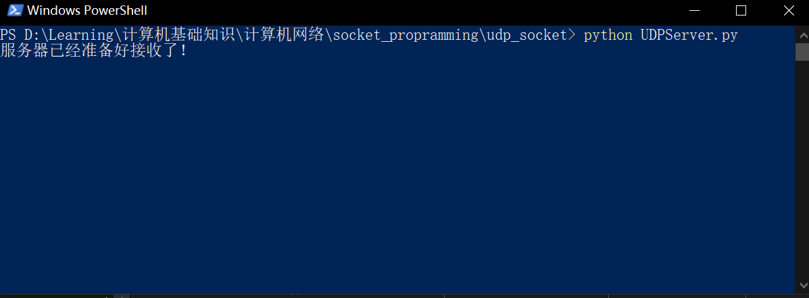

然后启动 UDP 客户程序，输入一个小写的句子：

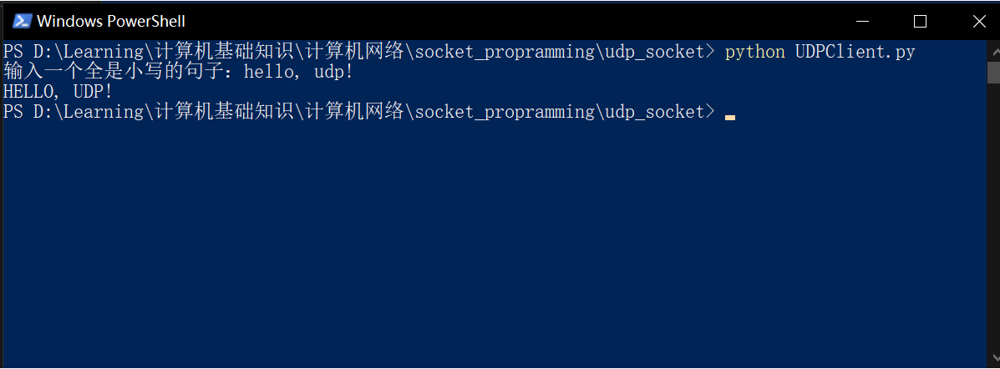

可以通过稍加修改上述客户和服务器程序来研制自己的 UDP 客户-服务器程序。例如，能够修改客户程序，使其在收到一个大写的句子后，用户能够向服务器继续发送更多的句子。

### 2.7.2. TCP 套接字编程

与 UDP 不同，TCP 是一个面向连接的协议。这意味着在客户和服务器能够开始互相发送数据之前，它们先要握手和创建一个 TCP 连接。TCP 连接的一端与客户套接字相联系，另一端与服务器套接字相联系。当创建该 TCP 连接时，我们将其与客户套接字地址 （ IP 地址和端口号）和服务器套接字地址（IP 地址和端口号）关联起来。使用创建的 TCP 连接，当一侧要向另一侧发送数据时，它只需经过其套接字将数据丢进 TCP 连接。这与 UDP 不同，UDP 服务器在将分组丢进套接字之前必须为其附上一个目的地地址。

现在我们仔细观察一下 TCP 中客户程序和服务器程序的交互。客户具有向服务器发起 接触的任务。服务器为了能够对客户的初始接触做岀反应，服务器必须已经准备好。这意味着两件事。第一，与在 UDP 中的情况一样，TCP 服务器在客户试图发起接触前必须作为进程运行起来。第二，服务器程序必须具有一扇特殊的门，更精确地说是一个特殊的套接字，该门欢迎来自运行在任意主机上的客户进程的某种初始接触。使用房子与门来比喻进程与套接字，有时我们将客户的初始接触称为“敲欢迎之门”。

随着服务器进程的运行，客户进程能够向服务器发起一个 TCP 连接。这是由客户程序通过创建一个 TCP 套接字完成的。当该客户生成其 TCP 套接字时，它指定了服务器中的欢迎套接字的地址，即服务器主机的 IP 地址及其套接字的端口号。生成其套接字后，该客户发起了一个三次握手并创建与服务器的一个 TCP 连接。发生在运输层的三次握手，对于客户和服务器程序是完全透明的。

在三次握手期间，客户进程敲服务器进程的欢迎之门。当该服务器“听”到敲门声时，它将生成一扇新门（更精确地讲是一个新套接字），它专门用于特定的客户。在我们下面的例子中，欢迎之门是一个我们称为 serverSocket 的 TCP 套接字对象；它是专门对客户进行连接的新生成的套接字，称为 **连接套接字（cormectionSocket）**。初次遇到 TCP 套接字的学生有时会混淆欢迎套接字（这是所有要与服务器通信的客户的起始接触点）和每个新生成的服务器侧的连接套接字（这是随后为与每个客户通信而生成的套接字）。

从应用程序的观点来看，客户套接字和服务器连接套接字直接通过一根管道连接。如图 2-28 所示，客户进程可以向它的套接字发送任意字节，并且 TCP 保证服务器进程能够按发送的顺序接收（通过连接套接字）每个字节。TCP 因此在客户和服务器进程之间提供了可靠服务。此外，就像人们可以从同一扇门进和出一样，客户进程不仅能向它的套接字发送字节，也能从中接收字节；类似地，服务器进程不仅从它的连接套接字接收字节，也能向其发送字节。


我们使用同样简单的客户-服务器 应用程序来展示 TCP 套接字编程：客主机进程服务器进程图 2-28 TCPServer 进程有两个套接字户向服务器发送一行数据，服务器将这行改为大写并回送给客户。图 2-29 着重显示了客户和服务器的主要与套接字相关的活动，两者通过 TCP 运输服务进行通信。

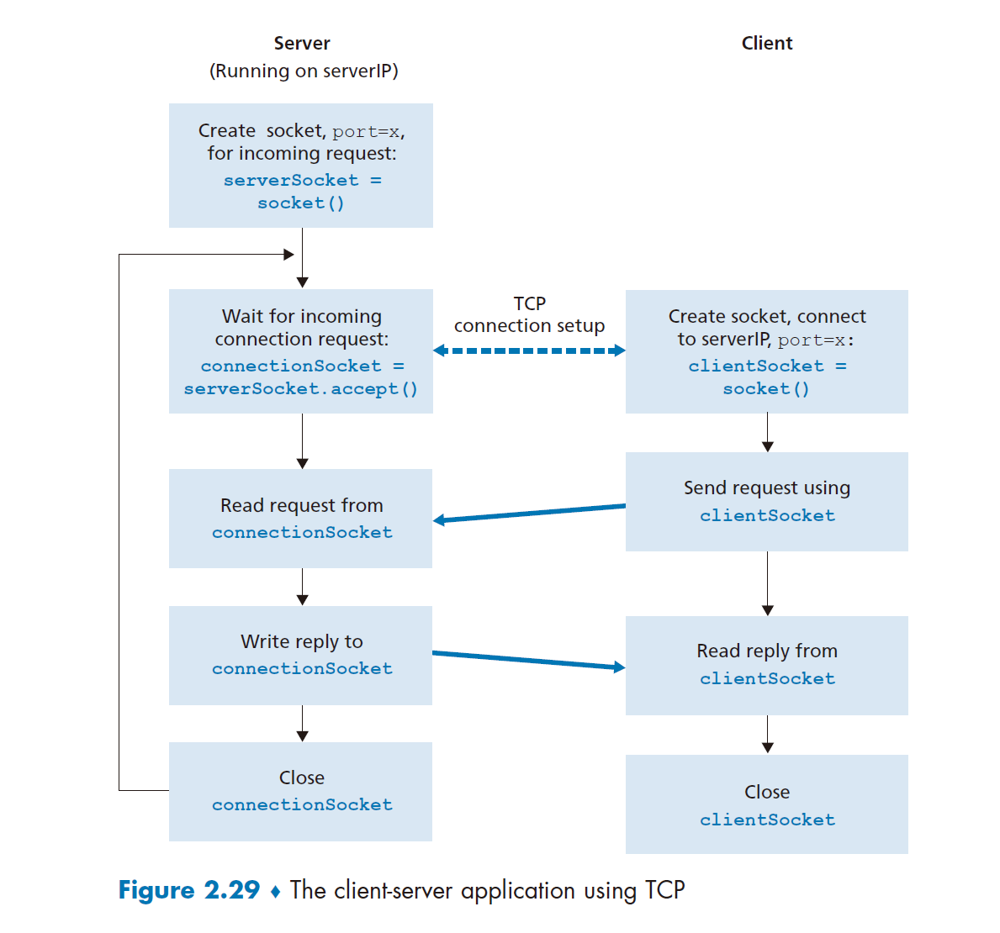

这里给出了客户应用程序的代码，你可以在 `socket_programming/tcp_socket` 下找到：

1. **TCPClient.py**

```py
from socket import *
serverName = 'localhost'
serverPort = 12000
clientSocket = socket(AF_INET, SOCK_STREAM)
clientSocket.connect((serverName, serverPort))
sentence = input('输入一个全是小写的句子：')
clientSocket.send(sentence.encode())
modifiedSentence = clientSocket.recv(1024)
print('来自服务器的消息：', modifiedSentence.decode())
clientSocket.close()
```

现在我们査看这些代码中与 UDP 实现有很大差别的各行。首先是客户套接字的创建。

```py
clientSocket = socket(AF_INET, SOCK_STREAM)
```

该行创建了客户的套接字，称为 `clientSocket`。第一个参数仍指定底层网络使用 IPv4。第二个参数指示该套接字是` SOCK_STREAM` 类型。这表明它是一个 TCP 套接字(而不是一个 UDP 套接字)。值得注意的是当我们创建该客户套接字时仍未指定其端口号，这是因为操作系统自动分配了。此时的下一行代码与我们在 UDPClient 中看到的极为不同：

```py
clientSocket.connect((serverName, serverPort))
```

前面讲过在客户能够使用一个 TCP 套接字向服务器发送数据之前(反之亦然)，必须在客户与服务器之间创建一个 TCP 连接。上面这行就发起了客户和服务器之间的这条 TCP 连接。`connect()` 方法的参数是这条连接中服务器端的地址。这行代码执行完后，执行三次握手，并在客户和服务器之间创建起一条 TCP 连接。

```py
sentence = input('输入一个全是小写的句子：')
```

如同 UDPClient 一样，上一行从用户获得了一个句子。字符串 sentence 连续收集字符直到用户键入回车以终止该行为止。代码的下一行也 UDPClient 极为不同：

```py
clientSocket.send(sentence.encode())
```

上一行通过该客户的套接字并进入 TCP 连接发送字符串 `sentence`。值得注意的是，该程序并未显式地创建一个分组并为该分组附上目的地址，而使用 UDP 套接字却要那样做。相反，该客户程序只是将字符串 `sentence` 中的字节放入该 TCP 连接中去。客户然后就等待接收来自服务器的字节。

```py
modifiedSentence = clientSocket.recv(1024)
```

当字符到达服务器时，它们被放置在字符串 `modifiedSentence` 中。在打印大写句子后，我们关闭客户的套接字。

```py
clientSocket.close()
```

最后一行关闭了套接字，因此关闭了客户和服务器之间的 TCP 连接。它引起客户中的 TCP 向服务器中的 TCP 发送一条 TCP 报文(参见 3-5 节)。

现在我们来观察 TCP 服务器程序代码，你可以在 `socket_programming/tcp_socket` 下找到：

2. **TCPServer.py**

```py
from socket import *
serverPort = 12000
serverSocket = socket(AF_INET, SOCK_STREAM)
serverSocket.bind(('', serverPort))
serverSocket.listen(1)
print('服务器已经准备好接收了！')
while True:
    connectionSocket, addr = serverSocket.accept()
    sentence = connectionSocket.recv(1024).decode()
    capitalizedSentence = sentence.upper()
    connectionSocket.send(capitalizedSentence.encode())
    connectionSocket.close()
```

现在我们来看看上述与 UDPServer 及 TCPClient 有显著不同的代码行。与 TCPClient 相同的是，服务器创建一个 TCP 套接字，执行：

```py
serverSocket = socket(AF_INET, SOCK_STREAM)
```

与 UDPServer 类似，我们将服务器的端口号 `serverPort` 与该套接字绑定起来：

```py
serverSocket.bind(('', serverPort))
```

但对 TCP 而言，`serverSocket` 将是我们的欢迎套接字。在创建这扇欢迎之门后，我们将等待并聆听某个客户敲门：

```py
serverSocket.listen(1)
```

当客户敲该门时，程序为 `serverSocket` 调用 `accept()` 方法，这在服务器中创建了一个称为 `connectionSocket` 的新套接字，由这个特定的客户专用。客户和服务器则完成了握手，在客户的 `clientSocket` 和服务器的 `serverSocket` 之间创建了一个 TCP 连接。借助于创建的 TCP 连接，客户与服务器现在能够通过该连接相互发送字节。使用 TCP，从一侧发送的所有字节不仅确保到达另一侧，而且确保按序到达。

```py
connectionSocket.close()
```

在这行中，在向客户发送修改的句子后，我们关闭了该连接套接字。但由于 `serverSocket` 保持打开，所以另一个客户此时能够敲门并向该服务器发送一个句子要求修改。

在测试这对程序时，先启动 TCP 服务器程序：

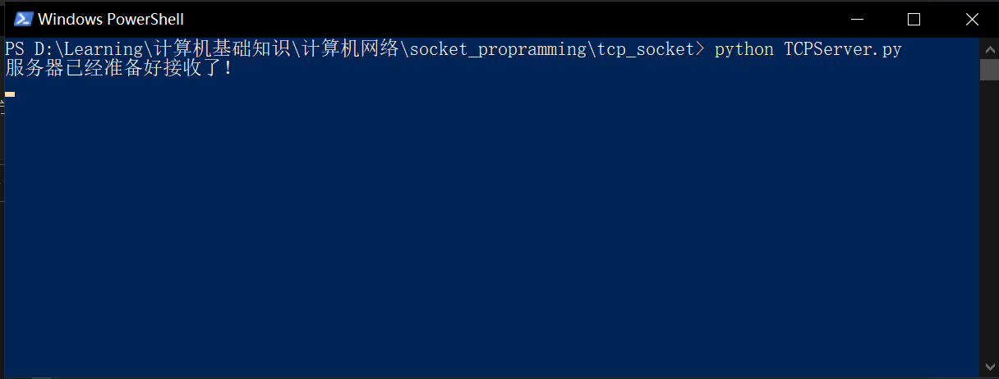

然后启动 TCP 客户程序，输入一个小写的句子：

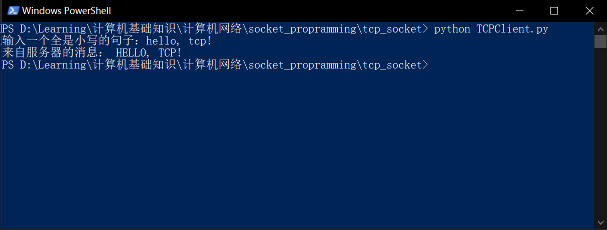

我们现在完成了 TCP 套接字编程的讨论。建议你运行这两个程序，也可以修改它们以达到稍微不同的目的。你应当将前面两个 UDP 程序与这两个 TCP 程序进行比较，观察它们的不同之处。

## 2.8. 实验 2：编写简单的 Web 服务器

在这个编程实验中，你将用 Python 语言开发一个简单的 Web 服务器，它仅能处理一个请求。你的 Web 服务器将：1. 当一个客户（浏览器）联系时创建一个连接套接字；2. 从这个连接接收 HTTP 请求；3. 解释该请求以确定所请求的特定文件；4. 从服务器的文件系统获得请求的文件; 5. 创建一个由请求的文件组成的 HTTP 响应报文，报文前面有首部行；6. 经 TCP 连接向请求的浏览器发送响应。如果浏览器请求一个在该服务器中不存在的文件，服务器应当返回一个“404 Not Found”差错报文。

我们提供了这个 Web 服务器程序的一些关键代码，你所做的事情就是将他们补全。需要补全的位置，我们用 `# 开始补全` 和 `# 结束补全` 标出。

这是我们提供的代码，你可以在目录 `socket_programming/web_server/` 下找到：

### 2.8.1. OrignWebServer.py

```py
from socket import * # 导入 socket 模块
import sys # 为了退出服务器程序
serverSocket = socket(AF_INET, SOCK_STREAM)
# 准备一个欢迎套接字
# 开始补全
# 结束补全
statusLineFor200 = 'HTTP/1.1 200 OK\n' # 构造 HTTP 响应报文中请求成功状态行
statusLineFor404 = # 开始补全 # 结束补全 # 构造 HTTP 响应报文中找不到请求对象状态行
newLine = '\n' # 空行
while True:
    print('服务器已启动！\n')
    connectionSocket, addr = # 开始补全 # 结束补全 # 建立连接
    try:
        message = # 开始补全 # 结束补全
        filename = message.split()[1] # 使用空格将 HTTP 请求报文分隔，并提取出请求对象 URL
        print('请求行：' + message.split('\n')[0] + '\n') # 打印出 HTTP 请求报文中的请求行
        content = open(filename[1:]).read() # 读取文件，构造 HTTP 响应报文实体体
        outputdata = # 开始补全 # 结束补全 # 构造 HTTP 响应报文
        print('HTTP响应报文：' + outputdata + '\n')
        connectionSocket.send(outputdata.encode())
        connectionSocket.close()
        print('连接已关闭！\n')
    except IOError:
        notFound = statusLineFor404 + newLine + open('404.html').read() # 构造 HTTP 响应报文
        print('HTTP响应报文：' + notFound + '\n')
         # 开始补全 # 结束补全 # 发送 404 响应报文
        # 开始补全 # 结束补全 # 关闭连接
        print('连接已关闭！\n')
    serverSocket.close() # 关闭欢迎套接字
    print('服务器已关闭！\n')
    sys.exit() # 退出控制台
```

下面我们给出这个代码的补全，你可以在目录 `socket_programming/web_server/` 下找到：

### 2.8.2. WebServer.py

```py
from socket import * # 导入 socket 模块
import sys  # 为了退出服务器程序
serverSocket = socket(AF_INET, SOCK_STREAM)
# 准备一个欢迎套接字
serverSocket.bind(('', 6789))
serverSocket.listen(1)
statusLineFor200 = 'HTTP/1.1 200 OK\n' # 构造 HTTP 响应报文中请求成功状态行
statusLineFor404 = 'HTTP/1.1 404 Not Found\n' # 构造 HTTP 响应报文中找不到请求对象状态行
newLine = '\n' # 空行
while True:
    print('服务器已启动！\n')
    connectionSocket, addr = serverSocket.accept() # 建立连接
    try:
        message =  connectionSocket.recv(1024).decode()
        filename = message.split()[1] # 使用空格将 HTTP 请求报文分隔，并提取出请求对象 URL
        print('请求行：' + message.split('\n')[0] + '\n') # 打印出 HTTP 请求报文中的请求行
        content = open(filename[1:]).read() # 读取文件，构造 HTTP 响应报文实体体
        outputdata = statusLineFor200 + newLine + content # 构造 HTTP 响应报文
        print('HTTP响应报文：' + outputdata + '\n')
        connectionSocket.send(outputdata.encode())
        connectionSocket.close()
        print('连接已关闭！\n')
    except IOError:
        notFound = statusLineFor404 + newLine + open('404.html').read() # 构造 HTTP 响应报文
        print('HTTP响应报文：' + notFound + '\n')
        connectionSocket.send(notFound.encode()) # 发送 404 响应报文
        connectionSocket.close() # 关闭连接
        print('连接已关闭！\n')
    serverSocket.close() # 关闭欢迎套接字
    print('服务器已关闭！\n')
    sys.exit() # 退出控制台
```

### 2.8.3. 测试 Web 服务器

在 WebServer.py 的同一个目录下面，放入 2 个 HTML 文件，其中将 404 文件命名为“404”。你可以在目录 `socket_programming/web_server/` 下找到我们提供的 2 个 HTML 文件。

首先运行我们的 WebServer.py 程序：


不要关闭服务器程序，在浏览器中访问 `http://localhost:6789/HelloWorld.html`。你将会看到下面的结果：

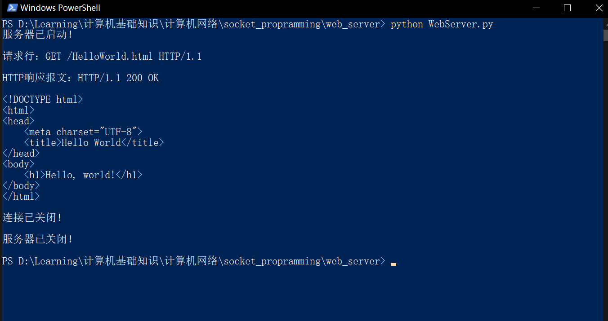


最后，可以测试我们编写的 404 页面是否起效了。在浏览器中访问 `http://localhost:6789/somethingelse.html`。你可以不必遵循我们的命名，随便什么都可以，只要不是 HelloWorld.html。你将会看到下面的结果：

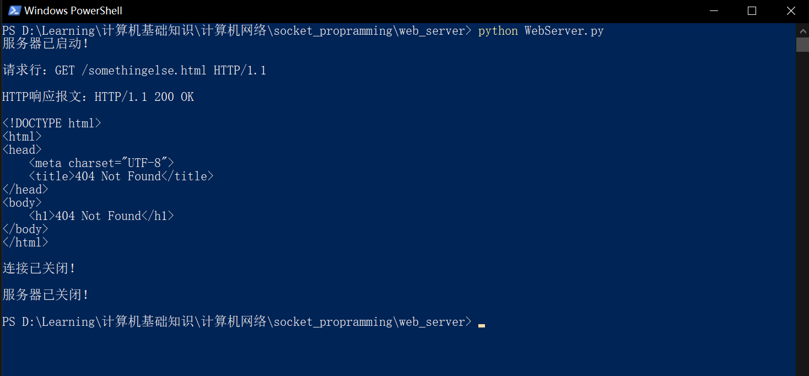


## 2.9. 实验 3：编写简单的 UDP Ping 程序

在这个编程实验中，你将用 Python 编写一个客户 ping 程序。该客户将发送一个简单的 ping 报文，接收一个从服务器返回的对应 pong 报文，并确定从该客户发送 ping 报文到接收到 pong 报文为止的时延。 该时延称为往返时延(RTT)。由该客户和服务器提供的功能类似于在现代操作系统中可用的标准 ping 程序。然而，标准的 ping 使用互联网控制报文协议(ICMP)（我们将在第 5 章中学习 ICMP）。此时我们将创建一个非标准（但简单）的基于 UDP 的 ping 程序。

你的 ping 程序经 UDP 向目标服务器发送 10 个 ping 报文。对于每个报文，当对应的 pong 报文返回时，你的客户要确定和打印 RTT。因为 UDP 是一个不可靠的协议，由客户发送的分组可能会丢失。为此，客户不能无限期地等待对 ping 报文的回答。客户等待服务器回答的时间至多为 1 秒；如果没有收到回答，客户假定该分组丢失并相应地打印一条报文。

我们提供了完整的 ping 服务器程序代码，你所做的事情就是编写 ping 客户程序代码。

这是我们提供的 UDPPingServer 代码，在这个服务端程序代码中，30% 的客户分组将被模拟丢失。你应该仔细研究这个代码来编写客户程序代码。你可以在目录 `socket_programming/udp_ping/` 下找到这个代码：

### 2.9.1. UDPPingServer.py

```py
import random # 导入 random 包来生成随机的丢失的分组
from socket import *
# 创建一个 UDP 套接字
serverSocket = socket(AF_INET, SOCK_DGRAM)
serverSocket.bind(('', 12000))
print('服务器已启动！\n')
while True:
    # 生成 0 到 10 的随机数字
    rand = random.randint(0, 10)
    # 接收客户分组和客户地址
    message, address = serverSocket.recvfrom(1024)
    print(message.decode() + '\n')
    # 将来自客户的报文大写
    message = message.upper()
    # 随机生成的整数小于 4，则不发送报文
    if rand < 4:
        continue
    serverSocket.sendto(message, address)
```

服务器程序会不停止地接收来自客户的分组。当随机整数大于或等于 4 时，服务器程序简单地将报文大写然后发送给客户。

现在来考虑编写对应的客户程序。

具体来讲，我们的客户程序应该做下面的事情：

1. 使用 UDP 发送 ping 报文，发送的报文规定为“Ping 分组序号 发送时间”
2. 如果接收到了响应的报文就打印出来
3. 如果接收到了响应的报文，对于每一个分组，计算和打印出往返时间(RTT)
4. 如果服务器没有回应则打印“请求超时！”

这里是编写好的客户程序代码，你可以在目录 `socket_programming/udp_ping/` 下找到这个代码：

### 2.9.2. UDPPingClient.py

```py
import time # 为了获取当前时间
from socket import *
serverName = 'localhost'
serverPort = 12000
clientSocket = socket(AF_INET, SOCK_DGRAM)
clientSocket.settimeout(1.0) # 设置套接字超时时间为 1 秒
for i in range(1, 11):
    # 发送的报文为“Ping 序号 当前时间”
    # 这里的时间使用了 python 的格式化时间方法
    message = 'Ping ' + str(i) + ' ' + time.strftime("%Y-%m-%d %H:%M:%S", time.localtime())
    try:
        startTime = time.perf_counter() # 开始时间，以微秒记
        clientSocket.sendto(message.encode(), (serverName, serverPort))
        modifiedMessage, serverAddress = clientSocket.recvfrom(1024)
        endTime = time.perf_counter() # 结束时间
        delay = (endTime-startTime) * 1000 # 延迟时间为结束时间和开始时间的差，乘上 1000，以毫秒记
        print('%s  延迟：%f ms\n' % (modifiedMessage.decode(), delay))
    # 如果超时，则打印“请求超时！”
    except IOError:
        print('请求超时！\n')
```

### 2.9.3. 测试 UDP ping 程序

为了测试 ping 程序，先启动 ping 服务器程序：

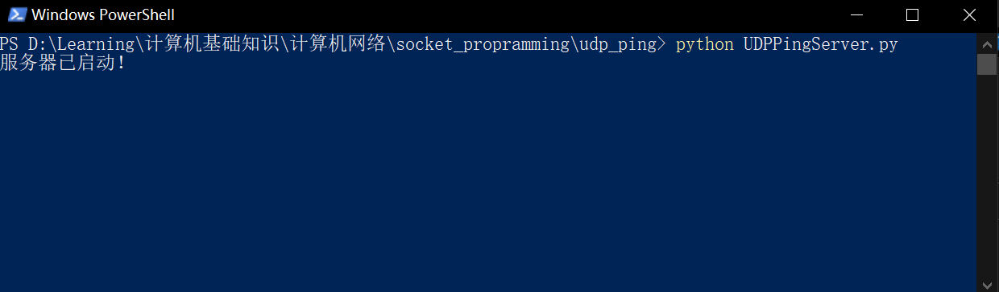

再启动 ping 客户程序：

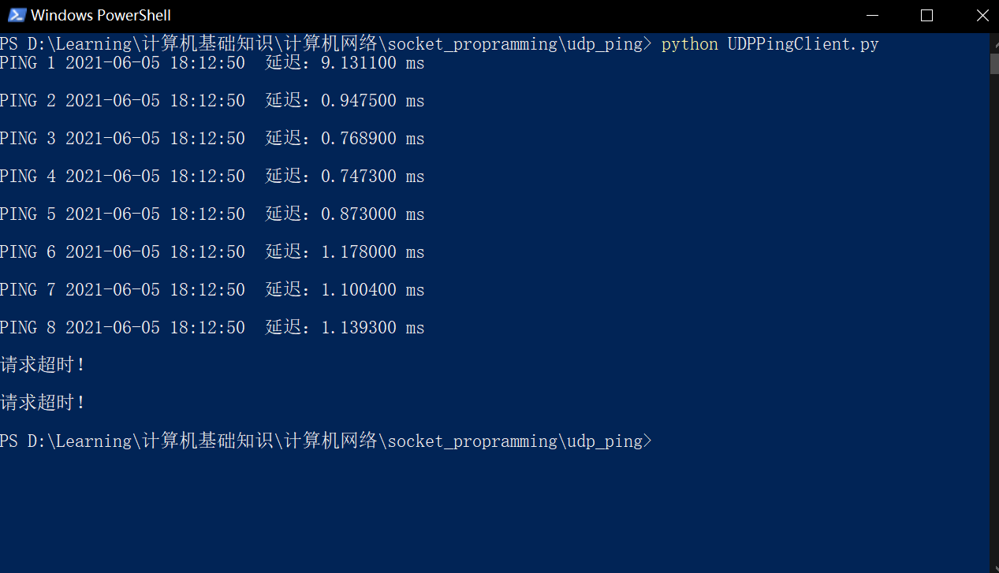

ping 服务器程序显示结果：

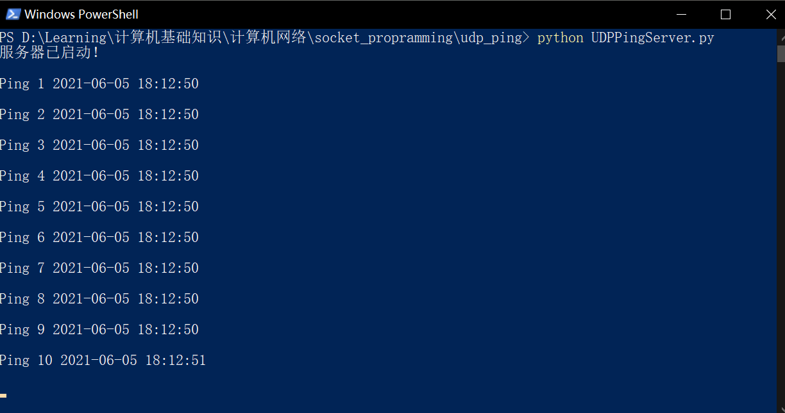

## 2.10. 实验 4：用 wireshark 观察 HTTP

在上一个 wireshark 实验中，我们已经熟悉了 wireshark 的基本操作。在这一次实验中，我们会更为深入地通过 wireshark 理解 HTTP。这一次实验的主要内容有：基本的 GET 请求及对应的响应交互活动，HTTP 报文格式，获取长的 HTML 文档，等等。

### 2.10.1. 基本的 GET 请求及对应的响应交互

执行以下的步骤：

1. 启动你的浏览器和 wireshark
2. 在 wireshark 中开始捕获
3. 在浏览器中键入 http://gaia.cs.umass.edu/wireshark-labs/HTTP-wireshark-file1.html ，等待网页加载结束
4. 停止捕获

你会看到下图的情况：


观察 GET 请求报文和对应的响应报文，回答以下问题：

1.  你的浏览器运行的 HTTP 版本时多少？服务器运行的 HTTP 版本时多少？
    HTTP 1.1，HTTP 1.1
2.  浏览器指出它接收的回应的语言是什么？
    英文和中文
3.  你电脑的 IP 地址是多少？服务器的 IP 地址是多少？
    192.168.43.27，128.119.245.12
4.  响应报文的状态码是多少？
    200
5.  这个 HTML 文件上一次的修改时间是多少？
    Wed, 19 May 2021 10:46:22 GMT
6.  多少个字节的内容被返回给你的浏览器？
    128

---

### 2.10.2. 条件 GET 请求报文及对应的响应报文交互

继续上一次实验，重新加载网页。

你会看到下图的情况：

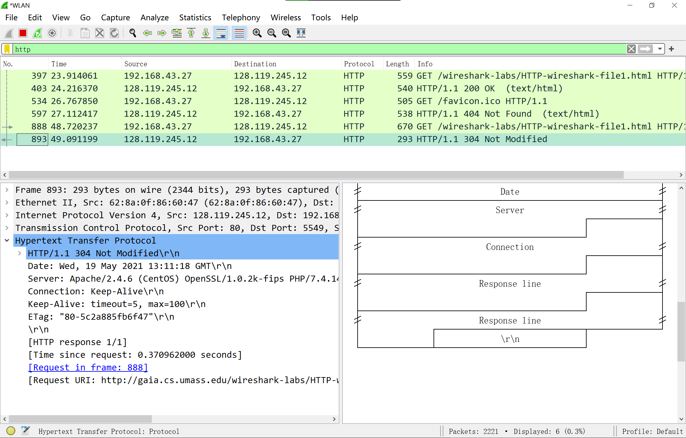

1. 观察第 1 次和第 2 次请求报文的首部行里是否有 `IF-MODIFIED-S1NCE`
   第 1 次没有，第 2 次有
2. 观察第 2 次响应报文中的实体体是否有内容
   没有内容
3. 观察第 2 次响应报文的状态码
   第 2 次响应的状态码为 304 Not Modified

---

### 2.10.3. 获取长的文档

截至到目前的实验，获取到的文档是简单，短小的。这次让我们看看请求对象为长的文档的时候，会发生什么？

执行以下步骤：

1. 启动浏览器和 wireshark
2. 在 wireshark 中开始捕获
3. 在浏览器中键入 http://gaia.cs.umass.edu/wireshark-labs/HTTP-wireshark-file3.html ，浏览器会显示很长的 《THE BILL OF RIGHTS》
4. 停止 wireshark 捕获

如下图所示。在分组信息列表你可以看到 GET 请求后面跟有一个多分组 TCP 回应。这是因为响应报文的实体体过长，不能全部放置一个 TCP 分组中。单个的 HTTP 响应报文会被 TCP 分成若干个部分，每个部分被包含在一个独立的 TCP 报文段中。

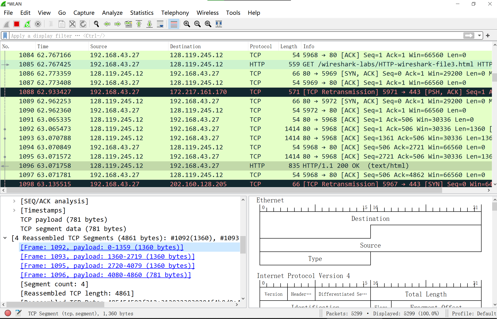

回答以下问题：

1. 哪些帧携带了 HTTP 响应报文？
   1092, 1093, 1095, 1096
2. 哪个帧携带了 HTTP 响应状态行？
   1096
3. 多少个 TCP 报文段完成了 HTTP 响应报文？
   4 个

---

### 2.10.4. 嵌入对象的 HTML 文档

现在我们来请求带有引用对象(图片，脚本等等)的 HTML 文档。

执行以下步骤：

1. 启动你的浏览器，清除浏览器缓存。启动 wireshark，开始捕获。
2. 在浏览器中键入 http://gaia.cs.umass.edu/wireshark-labs/HTTP-wireshark-file4.html ，你的浏览器将会展示一个带有 2 张图片的 HTML 文档。如下图所示。
3. 停止捕获，在过滤框中键入 http。

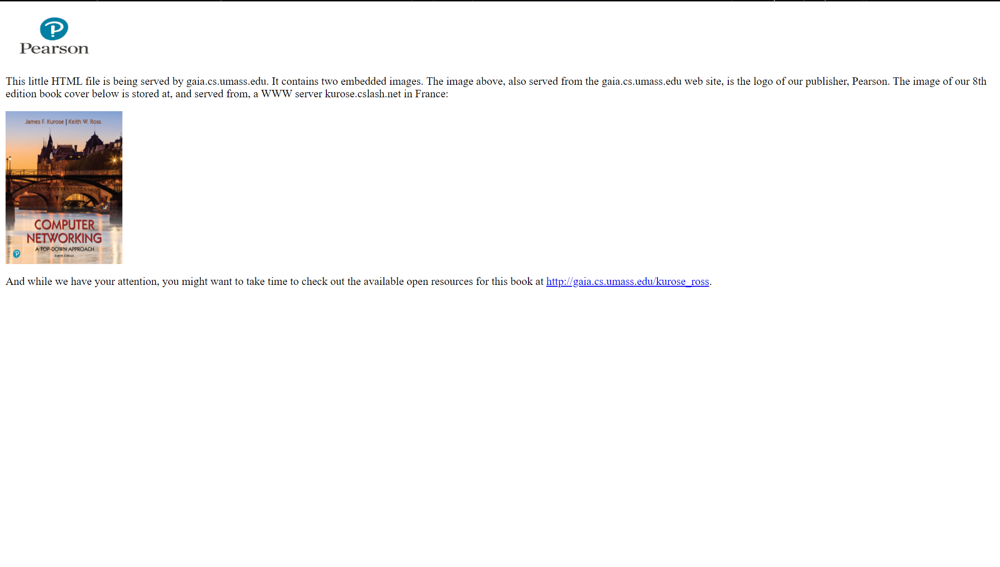

wireshark 捕获结果如下：

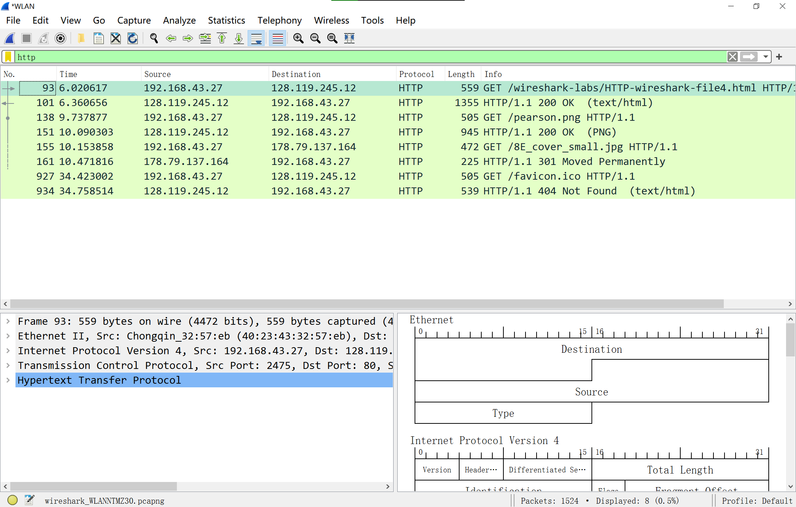

回答以下问题：

1. 你的浏览器发出了多少个 GET 请求？每次请求对应的 IP 地址是多少？
   4 个，第 1 次请求：128.119.245.12， 第 2 次请求：128.119.245.12，第 3 次请求：178.79.137.164，第 4 次请求：128.119.245.12。

## 2.11. 实验 5：用 wireshark 观察 DNS

这次实验之前，你可以复习我们在第 2.4 节讲过的内容。

### 2.11.1. nslookup

windows cmd 提供了 nslookup 命令。nslookup 命令可以向任何一个特定的 DNS 服务器查询 DNS 记录。查询的 DNS 服务器可以是一个根 DNS 服务器，一个顶级域 DNS 服务器，一个权威 DNS 服务器。

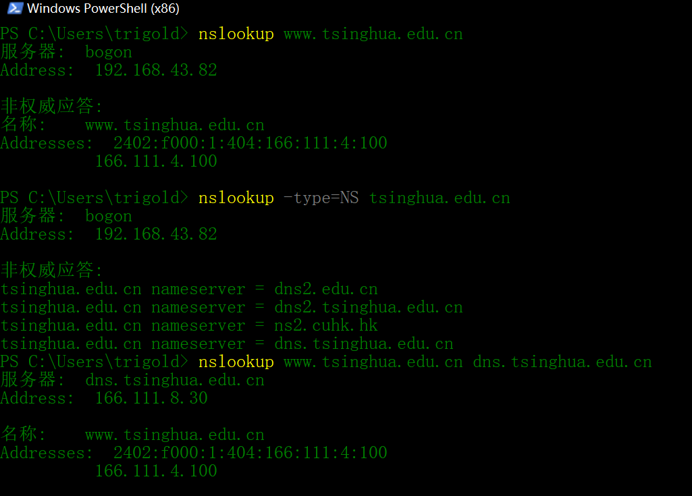

上图显示了 3 个独立的 nslookup 命令。当不提供一个具体的 NDS 服务器的时候。nslookup 命令使用默认的本地 DNS 服务器。

考虑第一条命令：

```bat
nslookup www.ts1nghua.edu.cn
```

这个命令查询的是 www.ts1nghua.edu.cn 的 IP 地址。
截图的回应显示出了：1. 提供结果的服务器名称和 IP 地址 2. 要查询的服务器名称和 IP 地址，这里的 IP 地址以 IPv4 和 IPv6 显示。

考虑第 2 条命令：

```bat
nslookup -type=NS ts1nghua.edu.cn
```

这个命令多出了一个选项 `-type=NS`，这相当于查询域 ts1nghua.edu.cn 的权威服务器的主机名。

截图显示出了 4 个权威服务器的主机名。

考虑第 3 条命令：

```bat
nslookup www.ts1nghua.edu.cn dns.ts1nghua.edu.cn
```

这里具体指定了要发出查询的 DNS 服务器，而不是默认的本地 DNS 服务器。
截图显示出了由 dns.ts1nghua.edu.cn 回答的 www.ts1nghua.edu.cn 的 IP 地址。

nslookup 的语法格式为：

```bat
nslookup -option1? -option2? 要查找的主机名 指定的DNS服务器?
```

带着问号的选项为可选。

### 2.11.2. ipconfig

ipconfig 是 windows cmd 提供的最有用的命令之一。ipconfig 用来显示你当前的 TCP/IP 信息，包括你的 IP 地址，DNS 服务器地址，设配器类型等。如果你想获取所有这些信息，键入以下命令：

```bat
ipconfig /all
```

键入以下命令可以获取本机缓存的 DNS 资源记录：

```bat
ipconfig /displaydns
```

键入以下命令以清除本机的 DNS 记录缓存：

```bat
ipconfig /flushdns
```

### 2.11.3. 用 wireshark 跟踪 DNS 解析

现在我们已经熟悉了 nslookup 和 ipconfig 命令。现在我们来捕获由 web 冲浪生成的 DNS 分组。

执行以下步骤:

1. 使用 `ipconfig /flushdns` 清空本地 DNS 缓存
2. 启动浏览器，并清除缓存
3. 打开 wirehark，在过滤框中输入 `ip.addr == your_ip_address`，你可以使用 ipconfig 查看本机的 ip 地址。这个过滤掉了发送端和接收端不是你的 ip 地址的分组
4. 在 wireshark 中启动捕获
5. 在浏览器中访问 http://www.ietf.org
6. 停止捕获

回答以下问题：

1. 定位查询和响应报文，它们是通过 UDP 还是 TCP 发送的？
   UDP
2. DNS 查询报文的目的地端口是多少？DNS 响应报文的源端口是多少？
   53， 53
3. DNS 查询报文发送给哪个 IP 地址了？使用 ipconfig 确定你本地 DNS 服务器。两个 ip 地址相同吗？
   192.168.43.27，相同
4. 查看 DNS 查询报文。这个 DNS 查询报文的类型是什么？
   A
5. 查看 DNS 响应报文。它提供了多少“答案”？每一个答案包含了什么？
   3 个，分别如下：
   - www.ietf.org: type CNAME, class IN, cname www.ietf.org.cdn.cloudflare.net
   - www.ietf.org.cdn.cloudflare.net: type A, class IN, addr 104.16.44.99
   - www.ietf.org.cdn.cloudflare.net: type A, class IN, addr 104.16.45.99

现在，我们来用 nslookup 实验一下。

执行以下步骤：

1. 开始捕获
2. 在一个 cmd 键入 nslookup www.ts1nghua.edu.cn
3. 停止捕获

结果如下图所示：

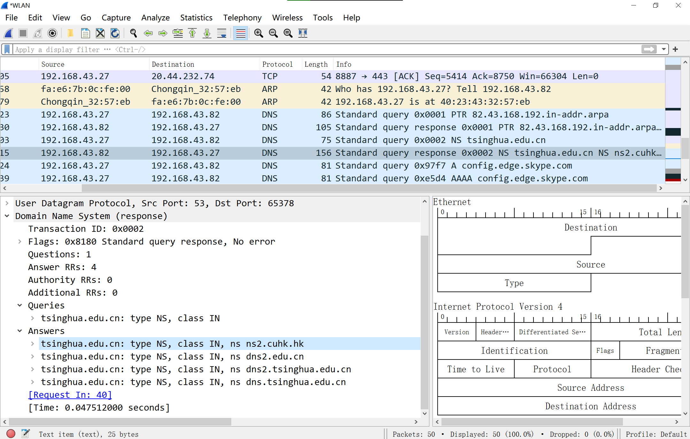

回答以下问题：

1. DNS 查询报文发送给哪个 IP 地址了？确定是你的本地 DNS 服务器吗？
   192.168.43.27，是
2. 查看 DNS 查询报文。这个 DNS 查询报文的类型是什么？
   A
3. 查看 DNS 响应报文。它提供了多少“答案”？每一个答案包含了什么？
   1 个，如下所示：
   - www.ts1nghua.edu.cn: type A, class IN, addr 166.111.4.100

现在重复 `nslookup -type=NS ts1nghua.edu.cn` 命令实验。

结果如下图所示：


回答以下问题：

1.  DNS 查询报文发送给哪个 IP 地址了？确定是你的本地 DNS 服务器吗？
    192.168.43.27，是
2.  查看 DNS 查询报文。这个 DNS 查询报文的类型是什么？
    NS
3.  查看 DNS 响应报文。它提供的 ts1nghua.edu.cn 的权威服务器是什么？
    如下所示：
    - ts1nghua.edu.cn: type NS, class IN, ns ns2.cuhk.hk
    - ts1nghua.edu.cn: type NS, class IN, ns dns2.edu.cn
    - ts1nghua.edu.cn: type NS, class IN, ns dns2.ts1nghua.edu.cn
    - ts1nghua.edu.cn: type NS, class IN, ns dns.ts1nghua.edu.cn

现在重复 `nslookup www.ts1nghua.edu.cn dns.ts1nghua.edu.cn` 命令实验。

回答以下问题：

1. DNS 查询报文发送给哪个 IP 地址了？确定是你的本地 DNS 服务器吗？如果不是，那么是哪个 DNS 服务器？
   166.111.8.30，dns.ts1nghua.edu.cn
2. 查看 DNS 查询报文。这个 DNS 查询报文的类型是什么？
   A
3. 查看 DNS 响应报文。它提供了多少“答案”？每一个答案包含了什么？
   1 个，如下：
   - www.ts1nghua.edu.cn: type A, class IN, addr 166.111.4.100

# 3. 运输层

**time : 2021-05-23**

运输层位于网络层和应用层之间。运输层负责在不同端系统上应用程序进程间的通信。在本章我们深入讨论 TCP 和 UDP 协议。

## 3.1. 概述和运输层提供的服务

在前两章中，我们已经了解过运输层提供的服务，现在回顾一下。

运输层协议为运行在不同主机上的应用进程之间提供 **逻辑通信(logic communication)** 功能。从应用程序的角度看，通过逻辑通信，运行在不同主机上的应用进程好像直接相连一样。实际上，这些主机也许位于地球的两侧，通过很多路由器及多种不同类型的链路相连。应用进程使用运输层提供的逻辑通信功能彼此发送报文，而不必考虑承载这些报文的设施的细节。

如图 3-1 所示，运输层协议是在端系统而不是在路由器中实现的。在发送端，运输层将从发送应用程序进程接收到的报文转换成运输层分组，用 Internet 术语来讲该分组称为运输层 **报文段(segment)** 。实现的方法（可能）是将应用报文划分为较小的块，并为每块加上一个运输层首部以生成运输层报文段。然后，在发送端系统中，运输层将这些报文段传递给网络层，网路层将其封装成网络层分组（即数据报）并向目的地发送。注意到下列事实是重要的：网络路由器仅作用于该数据报的网络层字段；即它们不检查封装在该数据报的运输层报文段的字段。在接收端，网络层从数据报中提取运输层报文段，并将该报文段向上交给运输层。运输层则处理接收到的报文段，使该报文段中的数据为接收应用进程使用。

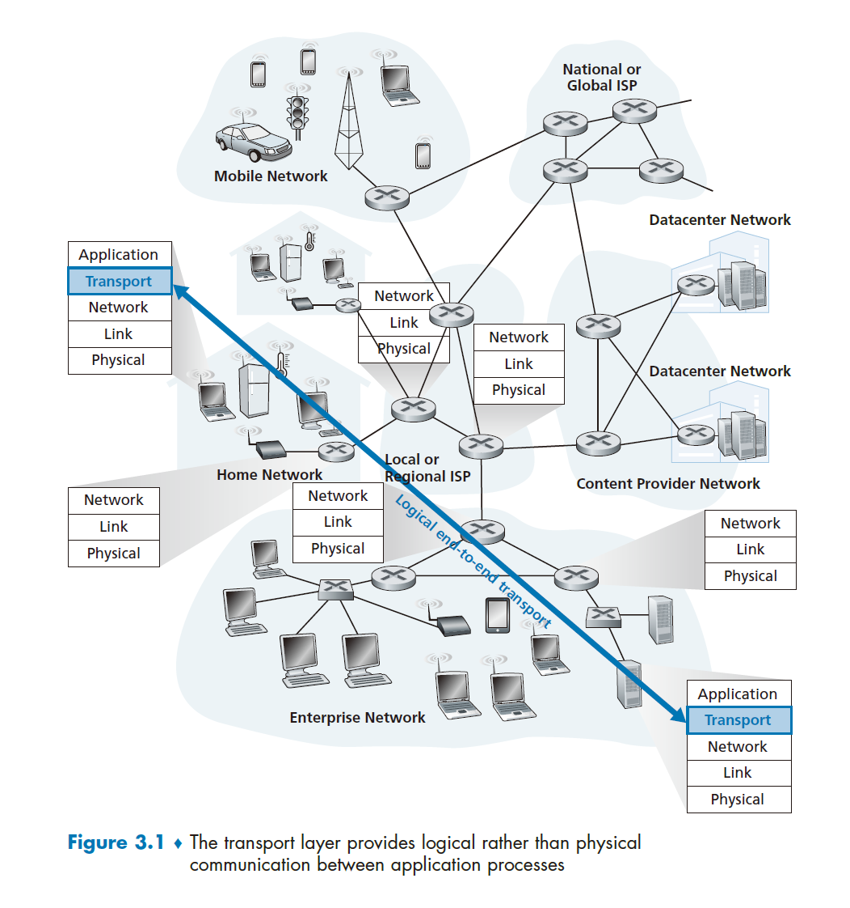

网络应用程序可以使用多种的运输层协议。例如，Internet 有两种协议，即 TCP 和 UDP。每种协议都能为调用的应用程序提供一组不同的运输层服务。

### 3.1.1. 运输层和网络层的关系

前面讲过，在协议栈中，运输层刚好位于网络层之上。网络层提供了主机之间的逻辑通信，而运输层为运行在不同主机上的进程之间提供了逻辑通信。这种差别虽然细微但很重要。我们用一个家庭类比来帮助分析这种差别。

考虑有两个家庭，一家位于美国东海岸，一家位于美国西海岸，每家有 12 个孩子。 东海岸家庭的孩子们是西海岸家庭孩子们的堂兄弟姐妹。这两个家庭的孩子们喜欢彼此通信，每个人每星期要互相写一封信，每封信都用单独的信封通过传统的邮政服务传送。因此，每个家庭每星期向另一家发送 144 封信。（如果他们有电子邮件的话，这些孩子可以省不少钱！）每一个家庭有个孩子负责收发邮件，西海岸家庭是 Ann 而东海岸家庭是 Bill。 每星期 Ann 去她的所有兄弟姐妹那里收集信件，并将这些信件交到每天到家门口来的邮政服务的邮车上。当信件到达西海岸家庭时，Ann 也负责将信件分发到她的兄弟姐妹手上。 在东海岸家庭中的 Bill 也负责类似的工作。

在这个例子中，邮政服务为两个家庭间提供逻辑通信，邮政服务将信件从一家送往另 一家，而不是从一个人送往另一个人。在另一方面，Ann 和 Bill 为堂兄弟姐妹之间提供了 逻辑通信，Arm 和 Bill 从兄弟姐妹那里收取信件或到兄弟姐妹那里交付信件。注意到从堂 兄弟姐妹们的角度来看，Ann 和 Bill 就是邮件服务，尽管他们只是端到端交付过程的一部分（即端系统部分）。在解释运输层和网络层之间的关系时，这个家庭的例子是一个非常好的类比。

```
应用层报文=信封上的字符
进程 = 堂兄弟姐妹
主机（又称为端系统）= 家庭
运输层协议 = Ann和Bill
网络层协议 = 邮政服务（包括邮车）
```

我们继续观察这个类比。值得注意的是，Ann 和 Bill 都是在各自家里进行工作的；例如，他们并没有参与任何一个中间邮件中心对邮件进行分拣，或者将邮件从一个邮件中心送到另一个邮件中心之类的工作。类似地，运输层协议只工作在端系统中。在端系统中，运输层协议将来自应用进程的报文移动到网络边缘（即网络层），反过来也是一样，但对有关这些报文在网络核心如何移动并不作任何规定。事实上，如图 3-1 所示，中间路由器既不处理也不识别运输层加在应用层报文的任何信息。

我们还是继续讨论这两家的情况。现在假定 Ann 和 Bill 外出度假，另外一对堂兄妹 （如 Susan 和 Harvey）接替他们的工作，在家庭内部进行信件的收集和交付工作。不幸的是，Susan 和 Harvey 的收集和交付工作与 Ann 和 Bill 所做的并不完全一样。由于年龄更小，Susan 和 Harvey 收发邮件的次数更少，而且偶尔还会丢失邮件（有时是被家里的狗咬坏了）。因此，Susan 和 Harvey 这对堂兄妹并没有提供与 Ann 和 Bill 一样的服务集合（即相同的服务模型）。与此类似，计算机网络中可以安排多种运输层协议，每种协议为应用程序提供不同的服务模型。

Ann 和 Bill 所能提供的服务明显受制于邮政服务所能提供的服务。例如，如果邮政服务不能提供在两家之间传递邮件所需时间的最长期限（例如 3 天），那么 Ann 和 Bill 就不可能保证邮件在堂兄弟姐妹之间传递信件的最长期限。与此类似，运输协议能够提供的服务常常受制于底层网络层协议的服务模型。如果网络层协议无法为主机之间发送的运输层报文段提供时延或带宽保证的话，运输层协议也就无法为进程之间发送的应用程序报文提供时延或带宽保证。

然而，即使底层网络协议不能在网络层提供相应的服务，运输层协议也能提供某些服务。例如，如我们将在本章所见，即使底层网络协议是不可靠的，也就是说网络层协议会使分组丢失、篡改和冗余，运输协议也能为应用程序提供可靠的数据传输服务。另一个例子是（我们在第 8 章讨论网络安全时将会研究到），即使网络层不能保证运输层报文段的机密性，运输协议也能使用加密来确保应用程序报文不被入侵者读取。

### 3.1.2. Internet 运输层概述

前面讲过 Internet 为应用层提供了两种截然不同的可用运输层协议。这些协议一种是 UDP（用户数据报协议），它为调用它的应用程序提供了一种不可靠、无连接的服务。另一种是 TCP （传输控制协议），它为调用它的应用程序提供了一种可靠的、面向连接的服务。当设计一个网络应用程序时，该应用程序的开发人员必须指定使用这两种运输协议中的哪一种。如我们在 2-7 节看到的那样，应用程序开发人员在生成套接字时必须指定是选择 UDP 还是选择 TCP。

为了简化术语，我们将运输层分组称为报文段(segment)。然而，Internet 文献(如 RFC 文档)也将 TCP 的运输层分组称为报文段，而常将 UDP 的分组称为数据报(data-gram)。而这类 Internet 文献也将网络层分组称为数据报！本书作为一本计算机网络的入门书籍，我们认为将 TCP 和 UDP 的分组统称为报文段，而将数据报名称保留给网络层分组不容易混淆。

在对 UDP 和 TCP 进行简要介绍之前，简单介绍一下 Internet 的网络层(我们将在第 4 和 5 章中详细地学习网络层)是有用的。Internet 网络层协议有一个名字叫 IP，即网际协议。IP 为主机之间提供了逻辑通信。IP 的服务模型是 **尽力而为交付服务(best-effort delivery service)** 。 这意味着 IP 尽它“最大的努力”在通信的主机之间交付报文段，但它并不做任何确保。特别是，它不确保报文段的交付，不保证报文段的按序交付，不保证报文段中数据的完整性。由于这些原因，IP 被称为 **不可靠服务(unreliable service)**。在此还要指出的是, 每台主机至少有一个网络层地址，即所谓的 IP 地址。我们在第 4 和 5 章将详细讨论 IP 地 址；在这一章中，我们只需要记住每台主机有一个 IP 地址

在对 IP 服务模型有了初步了解后，我们总结一下 UDP 和 TCP 所提供的服务模型。 UDP 和 TCP 最基本的责任是，将两个端系统间 IP 的交付服务扩展为运行在端系统上的两个进程之间的交付服务。将主机间交付扩展到进程间交付被称为 **运输层的多路复用 (transport-layer multiplexing)** 与 **多路分解(demultiplexing)**。 我们将在下一节讨论运输层的多路复用与多路分解。UDP 和 TCP 还可以通过在其报文段首部中包括差错检查字段而提供完整性检查。进程到进程的数据交付和差错检查是两种最低限度的运输层服务，也是 UDP 所能提供的仅有的两种服务。特别是，与 IP 一样，UDP 也是一种不可靠的服务，即不能保证一个进程所发送的数据能够完整无缺地(或全部！)到达目的进程。在 3-3 节中将更详细地讨论 UDP。

另一方面，TCP 为应用程序提供了几种附加服务。首先，它提供 **可靠数据传输(reliable data transfer)**。通过使用流量控制、序号、确认和定时器(本章将详细介绍这些技术)， TCP 确保正确地、按序地将数据从发送进程交付给接收进程。这样，TCP 就将两个端系统间的不可靠 IP 服务转换成了一种进程间的可靠数据传输服务。TCP 还提供 **拥塞控制(congestion control)**。拥塞控制与其说是一种提供给调用它的应用程序的服务，不如说是一种提供给整个 Internet 的服务，这是一种带来通用好处的服务。不太严格地说，TCP 拥塞控制防止任何一条 TCP 连接用过多流量来淹没通信主机之间的链路和交换设备。TCP 力求为每个通过一条拥塞网络链路的连接平等地共享网络链路带宽。这可以通过调节 TCP 连接的发 送端发送进网络的流量速率来做到。在另一方面，UDP 流量是不可调节的。使用 UDP 传输的应用程序可以根据其需要以其愿意的任何速率发送数据。

一个能提供可靠数据传输和拥塞控制的协议必定是复杂的。我们将用几节的篇幅来介 绍可靠数据传输和拥塞控制的原理，用另外几节介绍 TCP 协议本身。3-4 到 3-8 节将研究这些主题。本章采取基本原理和 TCP 协议交替介绍的方法。例如，我们首先在一般环境下讨论可靠数据传输，然后讨论 TCP 是怎样具体提供可靠数据传输的。类似地，先在一般环境下讨论拥塞控制，然后讨论 TCP 是怎样实现拥塞控制的。但在全面介绍这些内容之前, 我们先学习运输层的多路复用与多路分解。

## 3.2. 多路复用与多路分解

在本节中，我们讨论运输层的多路复用与多路分解，也就是将由网络层提供的主机到主机交付服务延伸到为运行在主机上的应用程序提供进程到进程的交付服务。为了使讨论 具体起见，我们将在 Internet 环境中讨论这种基本的运输层服务。然而，需要强调的是，多路复用与多路分解服务是所有计算机网络都需要的。

在目的主机，运输层从紧邻其下的网络层接收报文段。运输层负责将这些报文段中的数据交付给在主机上运行的适当应用程序进程。我们来看一个例子。假定你正坐在计算机前下载 Web 页面，同时还在运行一个 FTP 会话和两个 Telnet 会话。这样你就有 4 个网络应用进程在运行，即两个 Telnet 进程，一个 FTP 进程和一个 HTTP 进程。当你的计算机中的运输层从底层的网络层接收数据时，它需要将所接收到的数据定向到这 4 个进程中的一个。现在我们来研究这是怎样完成的。

首先回想 2-7 节的内容，一个进程(作为网络应用的一部分)有一个或多个套接字 (socket),它相当于从网络向进程传递数据和从进程向网络传递数据的门户。因此，如图 3-2 所示，在接收主机中的运输层实际上并没有直接将数据交付给进程，而是将数据交给了一个中间的套接字。由于在任一时刻，在接收主机上可能有不止一个套接字，所以每个套接字都有唯一的标识符。标识符的格式取决于它是 UDP 还是 TCP 套接字，我们将很快对它们进行讨论。

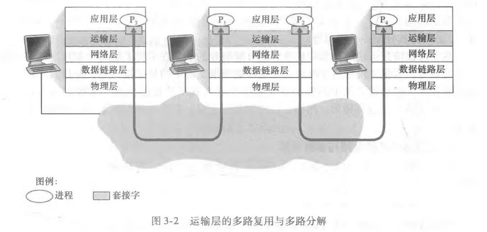

现在我们考虑接收主机怎样将一个到达的运输层报文段定向到适当的套接字。为此目的，每个运输层报文段中具有几个字段。在接收端，运输层检查这些字段，标识出接收套接字，进而将报文段定向到该套接字。将运输层报文段中的数据交付到正确的套接字的工作称为 **多路分解(demultiplexing)**。在源主机从不同套接字中收集数据块，并为每个数据块封装上首部信息(这将在以后用于分解)从而生成报文段，然后将报文段传递到网络层，所有这些工作称为 **多路复用(multiplexing)**。值得注意的是，图 3-2 中的中间那台主机的运输层必须将从其下的网络层收到的报文段分解后交给其上的 P1 或 P2 进程；这一过程是通过将到达的报文段数据定向到对应进程的套接字来完成的。中间主机中的运输层也必须收集从这些套接字输出的数据，形成运输层报文段，然后将其向下传递给网络层。尽管我们在 Internet 运输层协议的环境下引入了多路复用和多路分解，认识到下列事实是重要的：它们与在某层(在运输层或别处)的单一协议何时被位于接下来的较高层的多个协议使用有关。

为了说明分解的工作过程，再回顾一下前面一节的家庭类比。每一个孩子通过他们的名字来标识。当 Bill 从邮递员处收到一批信件，并通过查看收信人名字而将信件亲手交付给他的兄弟姐妹们时，他执行的就是一个分解操作。当 Ann 从兄弟姐妹们那里收集信件并将它们交给邮递员时，她执行的就是一个多路复用操作。

既然我们理解了运输层多路复用与多路分解的作用，那就再来看看在主机中它们实际是怎样工作的。通过上述讨论，我们知道运输层多路复用要求：1. 套接字有唯一标识符； 2. 每个报文段有特殊字段来指示该报文段所要交付到的套接字。如图 3-3 所示，这些特殊字段是 **源端口号字段(source port number field)** 和 **目的端口号字段(destination port number field)**。 ( UDP 报文段和 TCP ［ 报文段还有其他的一些字段，这些将在本章后继几节中进行讨论。)端口号是一个 16 比特的数，其大小在 0 ~ 65535 之间。0 ~ 1023 范围的端口号称为 **周知端口号(well-known port number)**,是受限制的，这是指它们保留给诸如 HTTP (它使 用端口号 80)和 FTP (它使用端口号 21)之类的周知应用层协议来使用。周知端口的列表在 RFC 1700 中给岀，同时在 http://www.iana.org 有更新文档［RFC 3232］。当我们开发一个新的应用程序时(如在 2-7 节中开发的一个简单应用程序)，必须为其分配一个端口号。

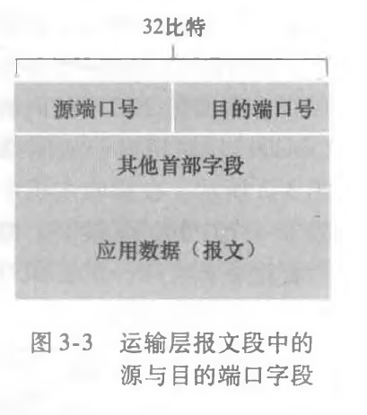

现在应该清楚运输层是怎样能够实现分解服务的了：在主机上的每个套接字能够分配一个端口号，当报文段到达主机时，运输层检査报文段中的目的端口号，并将其定向到相应的套接字。然后报文段中的数据通过套接字进入其所连接的进程。如我们将看到的那样，UDP 大体上是这样做的。然而，也将如我们所见，TCP 中的多路复用与多路分解更为复杂。

1. **无连接的多路复用与多路分解**

2.7.1 节讲过，在主机上运行的 Python 程序使用下面一行代码创建了一个 UDP 套接字：

```py
clientSocket = socket(AF_INET, SOCK_DGRAM)
```

当用这种方式创建一个 UDP 套接字时，运输层自动地为该套接字分配一个端口号。 特别是，运输层从范围 1024-65535 内分配一个端口号，该端口号是当前未被该主机中任何其他 UDP 端口使用的号。另外一种方法是，在创建一个套接字后，我们能够在 Python 程序中增加一行代码，通过套接字 `bind()` 方法为这个 UDP 套接字关联一个特定的端口号 (如 19157)：

```py
clientSocket.bind(('', 19157))
```

如果应用程序开发者所编写的代码实现的是一个“周知协议”的服务器端，那么开发者就必须为其分配一个相应的周知端口号。通常，应用程序的客户端让运输层自动地(并且是透明地)分配端口号，而服务器端则分配一个特定的端口号。

通过为 UDP 套接字分配端口号，我们现在能够精确地描述 UDP 的复用与分解了。假定在主机 A 中的一个进程具有 UDP 端口 19157,它要发送一个应用程序数据块给位于主机 B 中的另一进程，该进程具有 UDP 端口 46428。主机 A 中的运输层创建一个运输层报文段，其中包括应用程序数据、源端口号（19157）、目的端口号（46428）和两个其他值 （将在后面讨论，它对当前的讨论并不重要）。然后，运输层将得到的报文段传递到网络层。网络层将该报文段封装到一个 IP 数据报中，并尽力而为地将报文段交付给接收主机。 如果该报文段到达接收主机 B,接收主机运输层就检查该报文段中的目的端口号（46428） 并将该报文段交付给端口号 46428 所标识的套接字。值得注意的是，主机 B 可能运行多个进程，每个进程都具有其自己的 UDP 套接字和相联系的端口号。当 UDP 报文段从网络到达时，主机 B 通过检查该报文段中的目的端口号，将每个报文段定向（分解）到相应的套接字。

**time : 2021-05-24**

注意到下述事实是重要的：一个 UDP 套接字是由一个二元组全面标识的，该二元组包含一个目的 IP 地址和一个目的端口号。因此如果两个 UDP 报文段有不同的源 IP 地址和/或源端口号，但具有相同的目的 IP 地址和目的端口号，那么这两个报文段将通过相同的目的套接字被定向到相同的目的进程。

你也许现在想知道，源端口号的用途是什么呢？如图 3-4 所示，在 A 到 B 的报文段中, 源端口号用作“返回地址"的一部分，即当 B 需要回发一个报文段给 A 时，B 到 A 的报文段中的目的端口号便从 A 到 B 的报文段中的源端口号中取值。（完整的返回地址是 A 的 IP 地址和源端口号。）举一个例子，回想 2-7 节学习过的那个 UDP 服务器程序。在 UDPServer.py 中，服务器使用 `recvfrom()` 方法从其自客户接收到的报文段中提取出客户端（源）端口号,然后，它将所提取的源端口号作为目的端口号，向客户发送一个新的报文段。

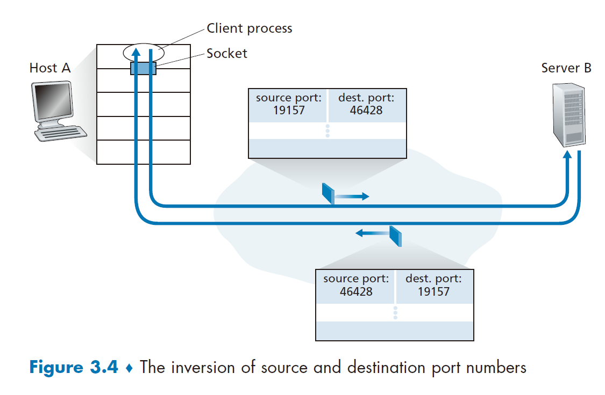

2. **面向连接的多路分解和复用**

为了理解 TCP 多路分解，我们必须更为仔细地研究 TCP 套接字和 TCP 连接创建。TCP 套接字和 UDP 套接字之间的一个细微差别是，TCP 套接字是由一个四元组（源 IP 地址, 源端口号, 目的 IP 地址, 目的端口号）来标识的。因此，当一个 TCP 报文段从网络到达一台主机时，该主机使用全部 4 个值来将报文段定向（分解）到相应的套接字。特别与 UDP 不同的是，两个具有不同源 IP 地址或源端口号的到达 TCP 报文段将被定向到两个不同的套接字，除非 TCP 报文段携带了初始创建连接的请求。为了深入地理解这一点，我们再来重新考虑 2-7-2 节中的 TCP 客户-服务器编程的例子：

- TCP 服务器应用程序有一个“欢迎套接字”，它在 12000 号端口上等待来自 TCP 客户（见图 2-27）的连接建立请求。
- TCP 客户使用下面的代码创建一个套接字并发送一个连接建立请求报文段：

```py
clientSocket = socket(AF_INET, SOCK_STREAM)
clientSocket.connect((serverName, 12000))
```

- 一条连接建立请求只不过是一个目的端口号为 12000, TCP 首部的特定“连接建立位”置位的 TCP 报文段（在 3-5 节进行讨论）。这个报文段也包含一个由客户选择的源端口号。
- 当运行服务器进程的计算机的主机操作系统接收到具有目的端口 12000 的入连接请求报文段后，它就定位服务器进程，该进程正在端口号 12000 等待接受连接。该服务器进程则创建一个新的套接字:

```py
connectionSocket, addr = serversocket.accept()
```

- 该服务器的运输层还注意到连接请求报文段中的下列 4 个值：1.该报文段中的源端口号；2.源主机 IP 地址；3.该报文段中的目的端口号；4.自身的 IP 地址。新创建的连接套接字通过这 4 个值来标识。所有后续到达的报文段，如果它们的源端口号、源主机 IP 地址、目的端口号和目的 IP 地址都与这 4 个值匹配，则被分解到这个套接字。随着 TCP 连接完成，客户和服务器便可相互发送数据了。

服务器主机可以支持很多并行的 TCP 套接字，每个套接字与一个进程相联系，并由其四元组来标识每个套接字。当一个 TCP 报文段到达主机时，所有 4 个字段（源 IP 地址,源端口, 目的 IP 地址, 目的端口）被用来将报文段定向（分解）到相应的套接字。

图 3-5 图示了这种情况，图中主机 C 向服务器 B 发起了两个 HTTP 会话，主机 A 向服务器 B 发起了一个 HTTP 会话。主机 A 与主机 C 及服务器 B 都有自己唯一的 IP 地址，它们分别是 A、C、B。主机 C 为其两个 HTTP 连接分配了两个不同的源端口号（26145 和 7532）。因为主机 A 选择源端口号时与主机 C 互不相干，因此它也可以将源端口号 26145 分配给其 HTTP 连接。但这不是问题，即服务器 B 仍然能够正确地分解这两个具有相同源端口号的连接，因为这两条连接有不同的源 IP 地址。

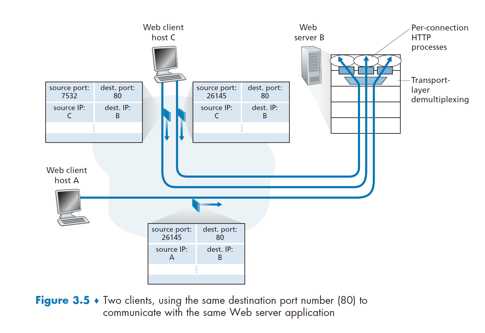

3. **Web 服务器与 TCP**

在结束这个讨论之前，再多说几句 Web 服务器以及它们如何使用端口号是有益的。考虑一台运行 Web 服务器的主机，例如在端口 80 上运行一个 Apache Web 服务器。当客户 （如浏览器）向该服务器发送报文段时，所有报文段的目的端口都将为 80。特别是，初始连接建立报文段和承载 HTTP 请求的报文段都有 80 的目的端口。如我们刚才描述的那样,该服务器能够根据源 IP 地址和源端口号来区分来自不同客户的报文段。

图 3-5 显示了一台 Web 服务器为每条连接生成一个新进程。如图 3-5 所示，每个这样的进程都有自己的连接套接字，通过这些套接字可以收到 HTTP 请求和发送 HTTP 响应。

然而，我们要提及的是，连接套接字与进程之间并非总是有着一一对应的关系。事实上, 当今的高性能 Web 服务器通常只使用一个进程，但是为每个新的客户连接创建一个具有 新连接套接字的新线程。（线程可被看作是一个轻量级的子进程。）如果做了第 2 章的第一 个编程作业，你所构建的 Web 服务器就是这样工作的。对于这样一台服务器，在任意给 定的时间内都可能有（具有不同标识的）许多连接套接字连接到相同的进程。

如果客户与服务器使用持续 HTTP,则在整条连接持续期间，客户与服务器之间经由同一个服务器套接字交换 HTTP 报文。然而，如果客户与服务器使用非持续 HTTP,则对每一对请求/响应都创建一个新的 TCP 连接并在随后关闭，因此对每一对请求/响应创建一 个新的套接字并在随后关闭。这种套接字的频繁创建和关闭会严重地影响一个繁忙的 Web 服务器的性能（尽管有许多操作系统技巧可用来减轻这个问题的影响）。读者若对与持续和非持续 HTTP 有关的操作系统问题感兴趣的话，可参见［Nielsen 1997, Nahum 2002］。

既然我们已经讨论过了运输层多路复用与多路分解问题，下面我们就继续讨论 Internet 运输层协议之一，即 UDP。在下一节中，我们将看到 UDP 无非就是对网络层协议增加了 一点（多路）复用/（多路）分解服务而已。

## 3.3. 无连接运输：UDP

在本节中，我们要仔细地研究一下 UDP,看它是怎样工作的，能做些什么。我们鼓励你回过来看一下 2-1 节的内容，其中包括了 UDP 服务模型的概述，再看看 2-7-1 节，其中讨论了 UDP 上的套接字编程。

为了激发我们讨论 UDP 的热情，假如你对设计一个不提供不必要服务的最简化的运输层协议感兴趣。你将打算怎样做呢？你也许会首先考虑使用一个无所事事的运输层协议。特别是在发送方一侧，你可能会考虑将来自应用进程的数据直接交给网络层；在接收方一侧，你可能会考虑将从网络层到达的报文直接交给应用进程。而正如我们在前一节所学的，我们必须做一点点事，而不是什么都不做！运输层最低限度必须提供一种复用/分解服务，以便在网络层与正确的应用级进程之间传递数据。

由［RFC 768］定义的 UDP 只是做了运输协议能够做的最少工作。除了复用/分解功能及少量的差错检测外，它几乎没有对 IP 增加别的东西。实际上，如果应用程序开发人员选择 UDP 而不是 TCP,则该应用程序差不多就是直接与 IP 打交道。UDP 从应用进程得到数据，附加上用于多路复用/分解服务的源和目的端口号字段，以及两个其他的小字段, 然后将形成的报文段交给网络层。网络层将该运输层报文段封装到一个 IP 数据报中，然后尽力而为地尝试将此报文段交付给接收主机。如果该报文段到达接收主机，UDP 使用目的端口号将报文段中的数据交付给正确的应用进程。值得注意的是，使用 UDP 时，在发送报文段之前，发送方和接收方的运输层实体之间没有握手。正因为如此，UDP 被称为是无连接的。

DNS 是一个通常使用 UDP 的应用层协议的例子。当一台主机中的 DNS 应用程序想要进行一次查询时，它构造了一个 DNS 查询报文并将其交给 UDP。无须执行任何与运行在 目的端系统中的 UDP 实体之间的握手，主机端的 UDP 为此报文添加首部字段，然后将形成的报文段交给网络层。网络层将此 UDP 报文段封装进一个 IP 数据报中，然后将其发送给一个名字服务器。在查询主机中的 DNS 应用程序则等待对该查询的响应。如果它没有收到响应（可能是由于底层网络丢失了查询或响应），则要么试图向另一个名字服务器发送该査询，要么通知调用的应用程序它不能获得响应。

现在你也许想知道，为什么应用开发人员宁愿在 UDP 之上构建应用，而不选择在 TCP 上构建应用？既然 TCP 提供了可靠数据传输服务，而 UDP 不能提供，那么 TCP 是否总是 首选的呢？答案是否定的，因为有许多应用更适合用 UDP,原因主要以下几点：

- **关于发送什么数据以及何时发送的应用层控制更为精细。**
  采用 UDP 时，只要应用 进程将数据传递给 UDP, UDP 就会将此数据打包进 UDP 报文段并立即将其传递给 网络层。在另一方面，TCP 有一个拥塞控制机制，以便当源和目的主机间的一条 或多条链路变得极度拥塞时来遏制运输层 TCP 发送方。TCP 仍将继续重新发送数 据报文段直到目的主机收到此报文并加以确认，而不管可靠交付需要用多长时间。
  因为实时应用通常要求最小的发送速率，不希望过分地延迟报文段的传送，且能 容忍一些数据丢失，TCP 服务模型并不是特别适合这些应用的需要。如后面所讨 论的，这些应用可以使用 UDP,并作为应用的一部分来实现所需的、超出 UDP 的 不提供不必要的报文段交付服务之外的额外功能。
- **无须连接建立。**
  如我们后面所讨论的，TCP 在开始数据传输之前要经过三次握手。 UDP 却不需要任何准备即可进行数据传输。因此 UDP 不会引入建立连接的时延。 这可能是 DNS 运行在 UDP 之上而不是运行在 TCP 之上的主要原因（如果运行在 TCP 上，则 DNS 会慢得多）。HTTP 使用 TCP 而不是 UDP,因为对于具有文本数据 的 Web 网页来说，可靠性是至关重要的。但是，如我们在 2-2 节中简要讨论的那 样，HTTP 中的 TCP 连接建立时延对于与下载 Web 文档相关的时延来说是一个重要因素。用于谷歌的 Chrome 浏览器中的 QULC 协议（快速 UDP Internet 连接［Iyen-gar 2015］）将 UDP 作为其支撑运输协议并在 UDP 之上的应用层协议中实现可靠性。
- **无连接状态。**
  TCP 需要在端系统中维护连接状态。此连接状态包括接收和发送缓存、 拥塞控制参数以及序号与确认号的参数。我们将在 3- 5 节看到，要实现 TCP 的可靠 数据传输服务并提供拥塞控制，这些状态信息是必要的。另一方面，UDP 不维护连 接状态，也不跟踪这些参数。因此，某些专门用于某种特定应用的服务器当应用程 序运行在 UDP 之上而不是运行在 TCP 上时，一般都能支持更多的活跃客户。
- **分组首部开销小。**
  每个 TCP 报文段都有 20 字节的首部开销，而 UDP 仅有 8 字节的开销。

### 3.3.1. UDP 报文结构

UDP 报文段结构如图 3-7 所示，它由 RFC 768 定义。应用层数据占用 UDP 报文段的数据字段。例如，对于 DNS 应用，数据字段要么包含一个查询报文，要么包含一个响应报文。对于流式音频应用，音频抽样数据填充到数据字段。 UDP 首部只有 4 个字段，每个字段由两个字节组成。如前一节所讨论的，通过端口号可以使目的主机将应用数据交给运 行在目的端系统中的相应进程（即执行分解功能）。长度字段指示了在 UDP 报文段中的字节数（首部加数据）。因为数据字段的长度在一个 UDP 段中不同于在另一个段中，故需要一个明确的长度。接收方使用检验和来检查在该报文段中是否出现了差错。实际上，计算检验和时，除了 UDP 报文段以外还包括了 IP 首部的一些字段。但是我们忽略这些细节，以便能从整体上看问题。下面我们将讨论检验和的计算。在 6-2 节中将描述差错检测的基本原理。长度字段指明了包括首部在内的 UDP 报文段长度（以字节为单位）。

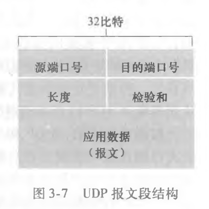

### 3.3.2. UDP 检验和

UDP 检验和提供了差错检测功能。这就是说，检验和用于确定当 UDP 报文段从源到达目的地移动时，其中的比特是否发生了改变（例如，由于链路中的噪声干扰或者存储在路由器中时引入问题）。发送方的 UDP 对报文段中的所有 16 比特字的和进行反码运算, 求和时遇到的任何溢出都被回卷。得到的结果被放在 UDP 报文段中的检验和字段。下面 给出一个计算检验和的简单例子。在 RFC 1071 中可以找到有效实现的细节，还可在 [Stone 1998； Stone 2000]中找到它处理真实数据的性能。举例来说，假定我们有下面 3 个 16 比特的字:

```
0110011001100000
0101010101010101
1000111100001100
```

这些 16 比特字的前两个之和是：

```
0110011001100000
0101010101010101
----------------
1011101110110101
```

再将上面的和与第三个字相加，得出:

```
1011101110110101
1000111100001100
----------------
0100101011000010
```

注意到最后一次加法有溢出，它要被回卷。反码运算就是将所有的 0 换成 1,所有的 1 转换成 0。因此,该和 0100101011000010 的反码运算结果是 1011010100111101，这就变为了检验和。在接收方，全部的 4 个 16 比特字（包括检验和）加在一起。如果该分组中没有引入差错，则显然在接收方处该和将是 llllllllllllllll。如果这些比特之一是 0, 那么我们就知道该分组中已经出现了差错。

你可能想知道为什么 UDP 首先提供了检验和，就像许多链路层协议（包括流行的以太网协议）也提供了差错检测那样。其原因是不能保证源和目的之间的所有链路都提供差 错检测；这就是说，也许这些链路中的一条可能使用没有差错检测的协议。此外，即使报 文段经链路正确地传输，当报文段存储在某台路由器的内存中时，也可能引入比特差错。 在既无法确保逐链路的可靠性，又无法确保内存中的差错检测的情况下，如果端到端数据传输服务要提供差错检测，UDP 就必须在端到端基础上在运输层提供差错检测。这是一个在系统设计中被称颂的端到端原则（end-encl principle）的例子[Saltzer 1984],该原则表 述为因为某种功能（在此时为差错检测）必须基于端到端实现：“与在较高级别提供这些功能的代价相比，在较低级别上设置的功能可能是冗余的或几乎没有价值的。”

因为假定 IP 是可以运行在任何第二层协议之上的，运输层提供差错检测作为一种保险措施是非常有用的。虽然 UDP 提供差错检测，但它对差错恢复无能为力。UDP 的某种实现只是丢弃受损的报文段；其他实现是将受损的报文段交给应用程序并给出警告。

至此结束了关于 UDP 的讨论。我们将很快看到 TCP 为应用提供了可靠数据传输及 UDP 所不能提供的其他服务。TCP 自然要比 UDP 复杂得多。然而，在讨论 TCP 之前，我们后退一步，先来讨论一下可靠数据传输的基本原理是有用的。

## 3.4. 可靠数据传输原理

**time : 2021-05-25**

在本节中，我们在一般场景下考虑可靠数据传输的问题。因为可靠数据传输的实现问题不仅在运输层出现，也会在链路层以及应用层出现，这时讨论它是恰当的。因此，一般性问题对网络来说更为重要。如果的确要将所有网络中最为重要的“前 10 个”问题排名的话，可靠数据传输将是名列榜首的候选者。在下一节中，我们将学习 TCP，尤其要说明 TCP 所采用的许多原理，而这些正是我们打算描述的内容。

图 3-8 说明了我们学习可靠数据传输的框架。为上层实体提供的服务抽象是：数据可以通过一条可靠的信道进行传输。借助于可靠信道，传输数据比特就不会受到损坏（由 0 变为 1,或者相反）或丢失，而且所有数据都是按照其发送顺序进行交付。这恰好就是 TCP 向调用它的 Internet 应用所提供的服务模型。

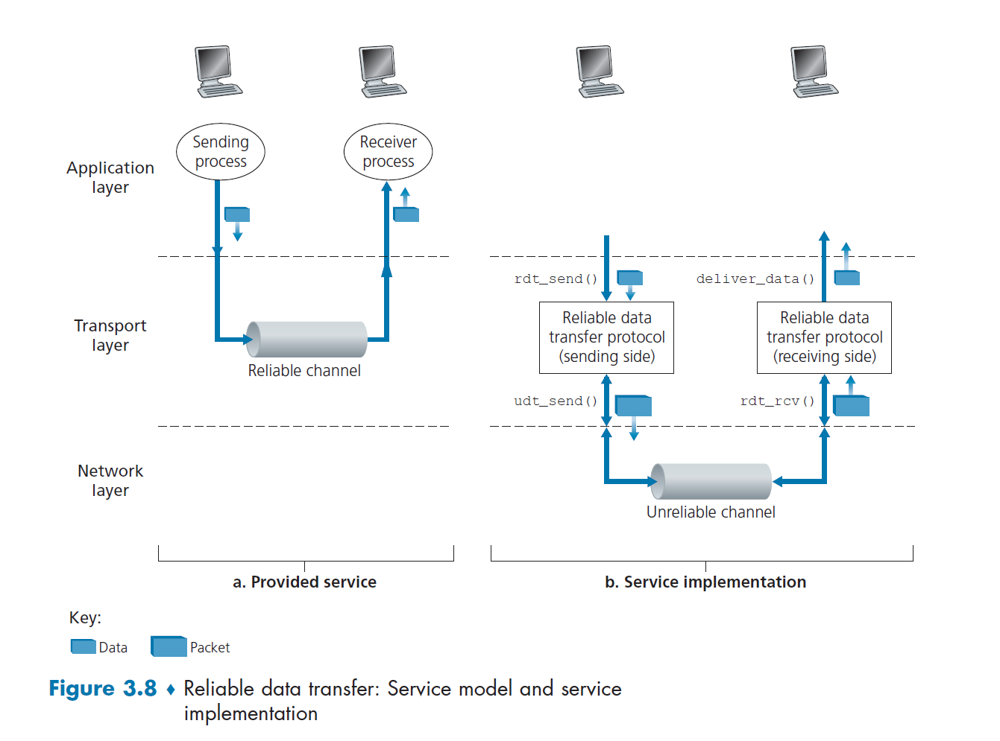

为方便起见，我们不妨把实现这种可靠数据传输服务的协议叫可靠数据传输协议(reliable data transfer protocol，简称 rdt)。在上图中，我们把网络层提供的数据传输服务看为不可靠的主机到主机信道。

在本节中，我们会应对不可靠底层信道产生的各种问题，如 1. 底层信道传输的比特会损坏；2. 丢包；逐渐打造我们的可靠信道传输协议。

图 3-8b 图示说明了用于数据传输协议的接口。通过调用 `rdt_send()` 函数，上层可以调用数据传输协议的发送方。它将要发送的数据交付给位于接收方的较高层。在接收端，当分组从信道的接收端到达时，将调用 `rdt_rcv()` 。 当 rdt 协议想要向较高层交付数据时，将通过调用`deliver_data()` 来完成。后面，我们将使用术语“分组”而不用运输层的“报文段”。因为本节研讨的理论适用于一般的计算机网络，而不只是用于 Internet 运输层，所以这时采用通用术语“分组”也许更为合适。

在本节中，我们仅考虑单向数据传输(unidirectional data transfer)的情况，即数据传输是从发送端到接收端的。可靠的双向数据传输(bidirectional data transfer)(即全双工数据传输)情况从概念上讲不会更难，但解释起来更为单调乏味。虽然我们只考虑单向数据传输，但我们的协议也需要在发送端和接收端两个方向上传输分组，如图 3-8 所示。我们很快会看到，除了交换含有待传送的数据的分组之外，rdt 的发送端和接收端还需往返交换控制分组。rdt 的发送端和接收端都要通过调用 `udt_send()` 发送分组给对方(其中 udt 表示不可靠数据传输)。

### 3.4.1. 构造可靠数据传输协议

我们先考虑最简单的情况：假设底层信道完全是可靠的。

1. **底层信道完全可靠：rdt 1.0**

我们称该协议为 rdt 1.0。图 3-9 显示了 rdt 1.0 发送方和接收方的有限状态机(Finite-State Machine, FSM)的定义。

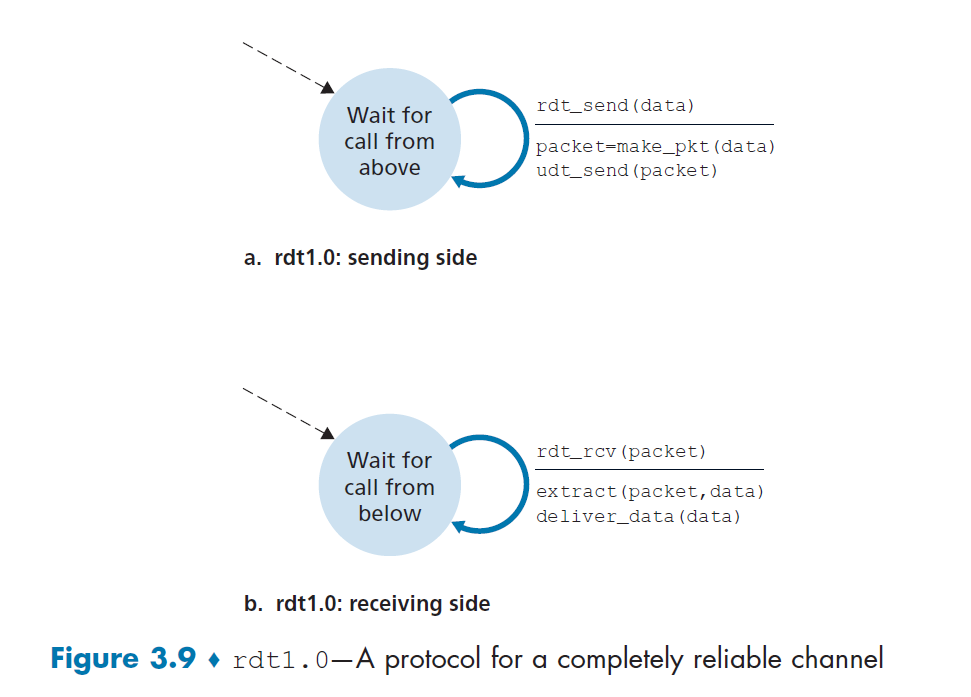

图 3-9a 中的 FSM 定义了发送方的操作，图 3-9b 中的 FSM 定义了接收方的操作。注意到下列问题是重要的，发送方和接收方有各自的 FSM。图 3-9 中发送方和接收方的 FSM 每个都只有一个状态。FSM 描述图中的箭头指示了协议从一个状态变迁到另一个状态。(因为图 3-9 中的每个 FSM 都只有一个状态，因此变迁必定是从一个状态返回到自身；我们很快将看到更复杂的状态图。)引起变迁的事件显示在表示变迁的横线上方，事件发生时所采取的动作显示在横线下方。如果对一个事件没有动作,或没有就事件发生而采取了一个动作，我们将在横线上方或下方使用符号 A,以分别明确地表示缺少动作或事件。FSM 的初始状态用虚线表示。尽管图 3-9 中的 FSM 只有一个状态，但马上我们就将看到多状态的 FSM,因此 标识每个 FSM 的初始状态是非常重要的。

rdt 的发送端只通过 `rdt_send(data)` 事件接受来自较高层的数据，产生一个包含该数据的分组(经由`make-pkt(data)` 动作)，并将分组发送到信道中。实际上，`rdt_send(data)` 事件是由较高层应用的过程调用产生的(例如，`rdt_send()` )。

在接收端，rdt 通过 `rdt_rcv(packet)` 事件从底层信道接收一个分组，从分组中取岀数据 (经由 `extract(packet, data)` 动作)，并将数据上传给较高层(通过 `deliver_data(data)` 动作)。 实际上，`rdt_rcv(packet)` 事件是由较低层协议的过程调用产生的(例如，`rdt_rcv()`)。

在这个简单的协议中，一个单元数据与一个分组没差别。而且，所有分组是从发送方流向接收方；有了完全可靠的信道，接收端就不需要提供任何反馈信息给发送方，因为不必担心出现差错！注意到我们也已经假定了接收方接收数据的速率能够与发送方发送数据的速率一样快。因此，接收方没有必要请求发送方慢一点！

2. **应对比特差错问题：rdt 2.0**

在实际中，底层信道在传输的分组比特可能受损。在分组的传输、传播或缓存的过程中，这种比特差错通常会岀现在网络的物理部件中。我们眼下还将继续假定所有发送的分组(虽然有些比特可能受损)将按其发送的顺序被接收。

在研发一种经这种信道进行可靠通信的协议之前，首先考虑一下人们会怎样处理这类情形。考虑一下你自己是怎样通过电话口述一条长报文的。在通常情况下，报文接收者在听到、理解并记下每句话后可能会说“0K”。如果报文接收者听到一句含糊不清的话时,他可能要求你重复那句容易误解的话。这种口述报文协议使用了 **肯定确认(pos1tive acknowledgment)** (“OK”)与 **否定确认(negative acknowledgment)** (“请重复一遍”)。这些控制报文使得接收方可以让发送方知道哪些内容被正确接收，哪些内容接收有误并因此需要重传。在计算机网络环境中，基于这样重传机制的可靠数据传输协议称为 **自动重传请求(Automatic Repeat reQuest, ARQ)** 协议。

重要的是，ARQ 协议中还需要另外三种协议功能来处理存在比特差错的情况：

- **差错检测。**
  首先，需要一种机制以使接收方检测到何时出现了比特差错。前一节讲到，UDP 使用 Internet 检验和字段正是为了这个目的。在第 5 章中，我们将更详细地学习差错检测和纠错技术。这些技术使接收方可以检测并可能纠正分组中的比特差错。此刻，我们只需知道这些技术要求有额外的比特(除了待发送的初始数据比特之外的比特)从发送方发送到接收方；这些比特将被汇集在 rdt 2.0 数据分组的分组检验和字段中。
- **接收方反馈。**
  因为发送方和接收方通常在不同端系统上执行，可能相隔数千英里, 发送方要了解接收方情况(此时为分组是否被正确接收)的唯一途径就是让接收方提供明确的反馈信息给发送方。在口述报文情况下回答的“肯定确认”(ACK)和“否定确认” (NAK)就是这种反馈的例子。类似地，我们的 rdt 2.0 协议将从接收方向发送方回送 ACK 与 NAK 分组。理论上，这些分组只需要一个比特，如用 0 表示 NAK,用 1 表示 ACK。
- **重传。**
  接收方收到有差错的分组时，发送方将重传该分组。

图 3-10 说明了表示 rdt 2.0 的 FSM,该数据传输协议采用了差错检测、肯定确认与否定确认。

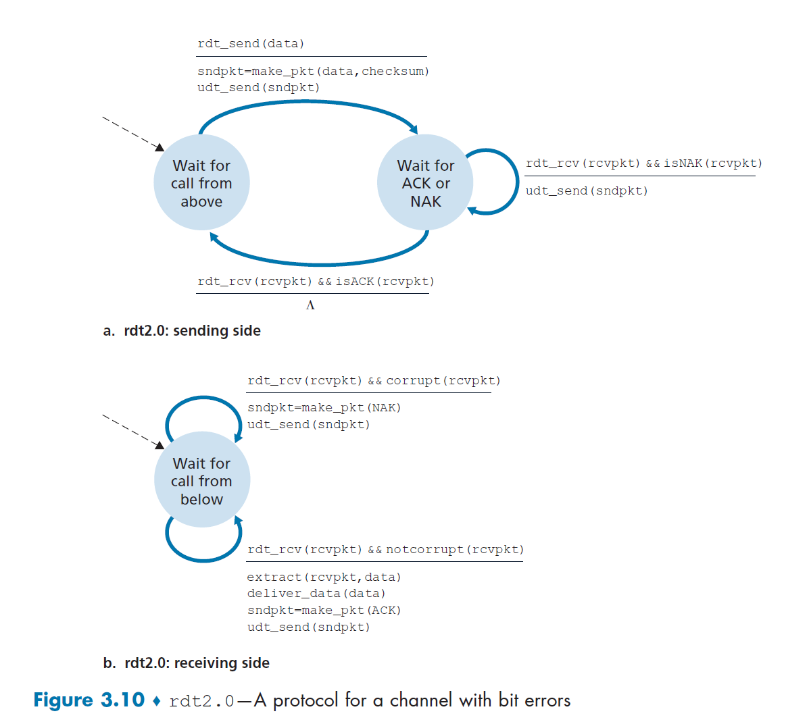

rdt 2.0 的发送端有两个状态。在最左边的状态中，发送端协议正等待来自上层传下来的数据。当 `rdt_send(data)` 事件岀现时，发送方将产生一个包含待发送数据的分组(sndpkt),带有检验和(例如，就像在 3-3-2 节讨论的对 UDP 报文段使用的方法)，然后经由 `udt_send(sndpkt)` 操作发送该分组。在最右边的状态中，发送方协议等待来自接收方的 ACK 或 NAK 分组。如果收到一个 ACK 分组(图 3-10 中符号 `rdt_rcv(rcvpkt) && isACK(rcvpkt)` 对应该事件)，则发送方知道最近发送的分组已被正确接收，因此协议返回到等待来自上层的数据的状态。如果收到一个 NAK 分组，该协议重传上一个分组并等待接收方为响应重传分组而回送的 ACK 和 NAK。注意到下列事实很重要：当发送方处于等待 ACK 或 NAK 的状态时，它不能从上层获得更多的数据；这就是说，`rdt_send()` 事件不可能岀现；仅当接收到 ACK 并离开该状态时才能发生这样的事件。因此，发送方将不会发送新数据，除非发送方确信接收方已正确接收当前分组。由于这种行为，rdt 2.0 这样的协议被称为 **停等(stop-and-wait)** 协议。

rdt 2.0 接收方的 FSM 仍然只有单一状态。当分组到达时，接收方要么回答一个 ACK，要么回答一个 NAK，这取决于收到的分组是否受损。在图 3-10 中，符号 `rdt_rcv(rcvpkt) && corrupt(rcvpkt)` 对应于收到一个分组并发现有错的事件。

rdt 2.0 协议看起来似乎可以运行了，但遗憾的是，它存在一个致命的缺陷：我们没有考虑到 ACK 或 NAK 分组受损的情况!（在继续研究之前，你应该考虑怎样解决这个问题）遗憾的是，我们细小的疏忽并非像它看起来那么无关紧要。至少，我们需要在 ACK/NAK 分组中添加检验和比特以检测这样的差错。更难的问题是协议应该怎样纠正 ACK 或 NAK 分组中的差错。这里的难点在于，如果一个 ACK 或 NAK 分组受损，发送方无法知道接收方是否正确接收了上一块发送的数据。

考虑处理受损 ACK 和 NAK 时的 3 种可能性:

- 对于第一种可能性，考虑在口述报文情况下人可能的做法。如果说话者不理解来自接收方回答的“0K”或“请重复一遍”，说话者将可能问“你说什么?”（因此在我们的协议中引入了一种新型发送方到接收方的分组）。接收方则将复述其回答。但是如果说话者的“你说什么？”产生了差错，情况又会怎样呢？接收者不明白那句混淆的话是口述内容的一部分还是一个要求重复上次回答的请求，很可能回一句“你说什么？”。于是，该回答可能含糊不清了。显然，我们走上了一条困难重重之路。
- 第二种可能性是增加足够的检验和比特，使发送方不仅可以检测差错，还可恢复差错。对于会产生差错但不丢失分组的信道，这就可以直接解决问题。
- 第三种可能性是，当发送方收到含糊不清的 ACK 或 NAK 分组时，只需重传当前数据分组即可。然而，这种方法在发送方到接收方的信道中引入了冗余分组（duplicate packet）。冗余分组的根本困难在于接收方不知道它上次所发送的 ACK 或 NAK 是否被发送方正确地收到。因此它无法事先知道接收到的分组是新的还是一次重传!

解决这个新问题的一个简单方法（几乎所有现有的数据传输协议中，包括 TCP，都采用了这种方法）是在数据分组中添加一个新字段，让发送方对其数据分组编号，即将发送数据分组的 **序号(sequence number)** 放在该字段。于是，接收方只需要检查序号即可确定收到的分组是否是一次重传。对于停等协议这种简单情况，1 比特序号就足够了，因为它可让接收方知道发送方是否正在重传前一个发送分组（接收到的分组序号与最近收到的分组序号相同），或是一个新分组（序号变化了，用模 2 运算“向前”移动）。因为目前我们假定信道不丢分组，ACK 和 NAK 分组本身不需要指明它们要确认的分组序号。发送方知道所接收到的 ACK 和 NAK 分组（无论是否是含糊不清的）是为响应其最近发送的数据分组而生成的。

图 3-11 和图 3-12 给出了对 rdt 2.1 的 FSM 描述，这是 rdt 2.0 的修订版。rdt 2.1 的发送方和接收方 FSM 的状态数都是以前的两倍。这是因为协议状态此时必须反映出目前（由发送方）正发送的分组或（在接收方）希望接收的分组的序号是 0 还是 1。值得注意的是，发送或期望接收 0 号分组的状态中的动作与发送或期望接收 1 号分组的状态中的动作是相似的；唯一的不同是序号处理的方法不同。

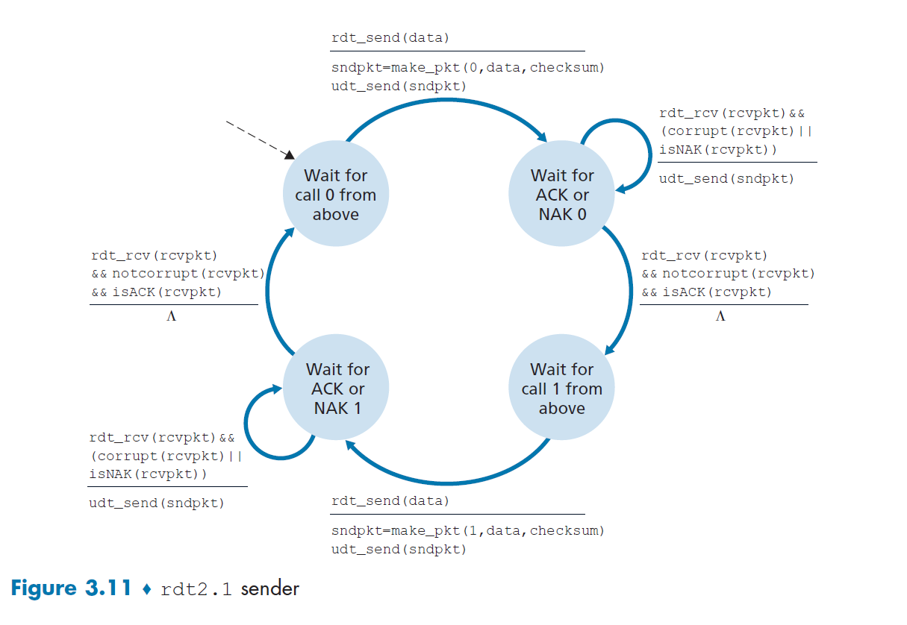

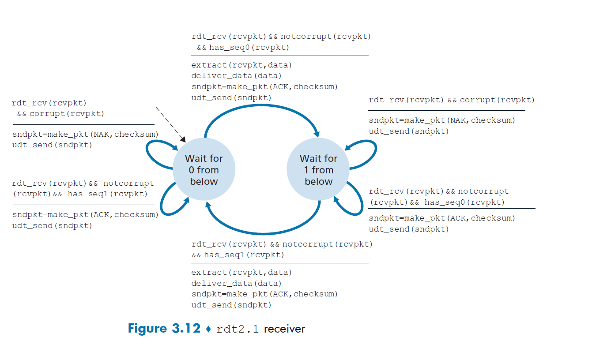

协议 rdt 2.1 使用了从接收方到发送方的肯定确认和否定确认。当接收到失序的分组时，接收方对所接收的分组发送一个肯定确认。如果收到受损的分组，则接收方将发送一个否定确认。如果不发送 NAK，而是对上次正确接收的分组发送一个 ACK，我们也能实现与 NAK 一样的效果。发送方接收到对同一个分组的两个 ACK（即接收冗余 ACK（duplicate ACK））后，就知道接收方没有正确接收到跟在被确认两次的分组后面的分组。rdt 2.2 是在有比特差错信道上实现的一个无 NAK 的可靠数据传输协议，如图 3-13 和图 3-14 所示。rdt 2.1 和 rdt 2.2 之间的细微变化在于，接收方此时必须包括由一个 ACK 报文所确认的分组序号(这可以通过在接收方 FSM 中，在 `make_pkt()` 中包括参数 ACK 0 或 ACK 1 来实现)，发送方此时必须检查接收到的 ACK 报文中被确认的分组序号(这可通过在发送方 FSM 中，在 `isACK()` 中包括参数 0 或 1 来实现)。

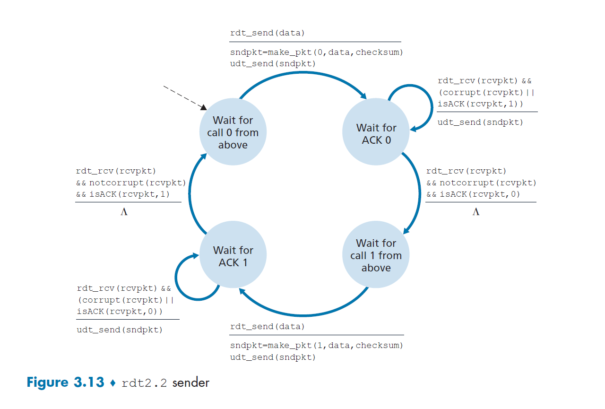

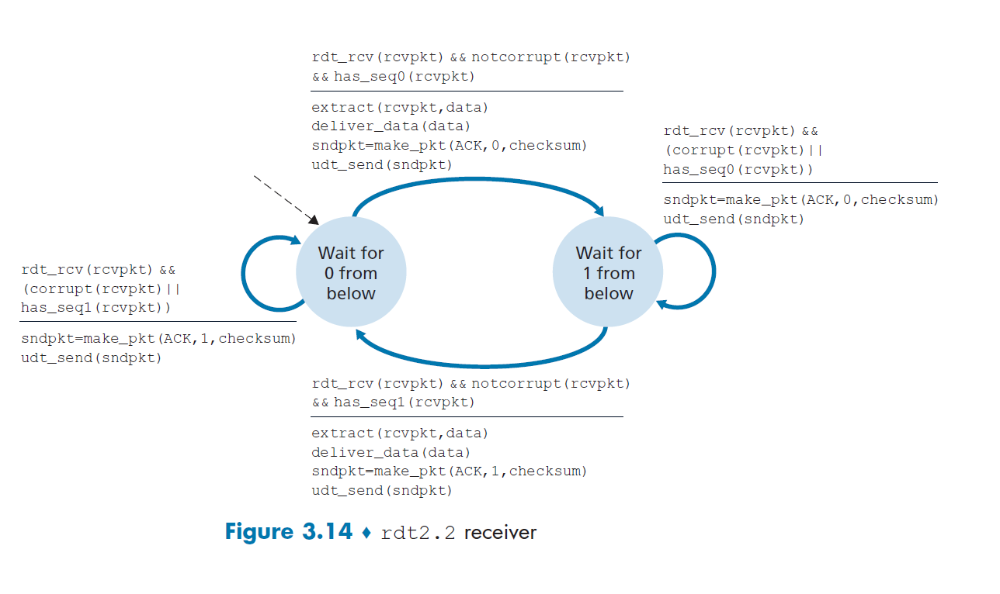

3. **应对丢包问题：rdt 3.0**

**time : 2021-05-31**

现在假定除了比特出错，底层信道还会丢包，这在今天的计算机网络中并不罕见。rdt 3.0 要处理 2 个问题：1. 怎么检测丢包？2. 在丢包时，做什么反应？在 rdt 2.2 中，我们通过重传等技术可以给出第 2 个问题的答案。但第 1 个问题要增加一种新的机制。

假定发送方传输一个数据分组，该分组或者接收方对该分组的 ACK 发生了丢失。在这两种情况下，发送方都收不到应当到来的接收方的响应。如果发送方愿意等待足够长的时间以便确定分组已丢失，则它只需重传该数据分组即可。

但是发送方需要等待多久才能确定丢包呢？很明显发送方至少需要等待这样长的时间：即发送方与接收方之间的一个往返时延（可能会包括在中间路由器的缓冲时延）加上接收方处理一个分组所需的时间。在很多网络中，最坏情况下的最大时延是很难估算的，确定的因素非常少。此外，理想的协议应尽可能快地从丢包中恢复出来；等待一个最坏情况的时延可能意味着要等待一段较长的时间，直到启动差错恢复为止。因此实践中采取的方法是发送方明智地选择一个时间值，以判定可能发生了丢包（尽管不能确保）。如果在这个时间内没有收到 ACK,则重传该分组。注意到如果一个分组经历了一个 特别大的时延，发送方可能会重传该分组，即使该数据分组及其 ACK 都没有丢失。这就在发送方到接收方的信道中引入了冗余数据分组（duplicate data packet）的可能性。幸运的是，rdt 2.2 协议已经有足够的功能（即序号）来处理冗余分组情况。

从发送方的观点来看，重传是一种万能灵药。发送方不知道是一个数据分组丢失，还是一个 ACK 丢失，或者只是该分组或 ACK 过度延时。在所有这些情况下，动作是同样的：重传。为了实现基于时间的重传机制，需要一个 **倒计数定时器(countdown timer)**，在一个给定的时间过期后，可中断发送方。因此，发送方需要能做到：1. 每次发送一个分组（包括第一次分组和重传分组）时，便启动一个定时器。2. 响应定时器中断（采取适当的动作）。3. 终止定时器。

图 3-15 给出了 rdt 3.0 的有限状态机。

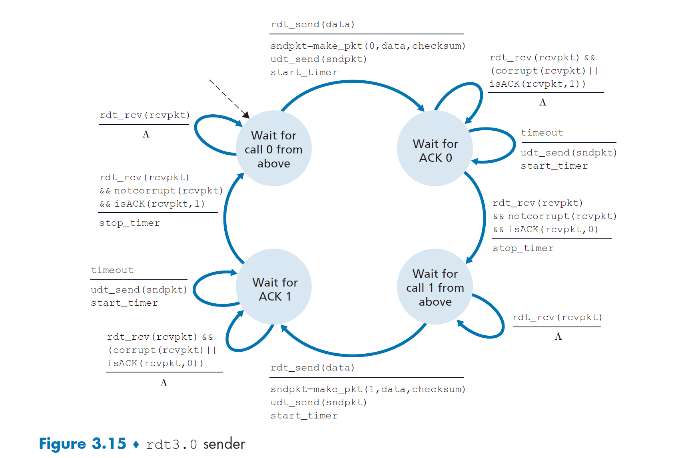

作为课后习题，请读者自行提供 rdt 3.0 的接收方有限状态机。

图 3-16 显示了在没有丢包和延迟分组情况下协议运作的情况，以及它是如何处理数据分组丢失的。在图 3-16 中，时间从图的顶部朝底部移动；注意到一个分组的接收时间必定迟于一个分 组的发送时间，这是因为发送时延与传播时延之故。在图 3-16 b 到 d 中，发送方括号部分表明了定时器的设置时刻以及随后的超时。本章后面的习题探讨了该协议几个更细微的方面。因为分组序号在 0 和 1 之间交替，因此 rdt 3.0 有时被称为 **比特交替协议（alternating-bit protocol)**。

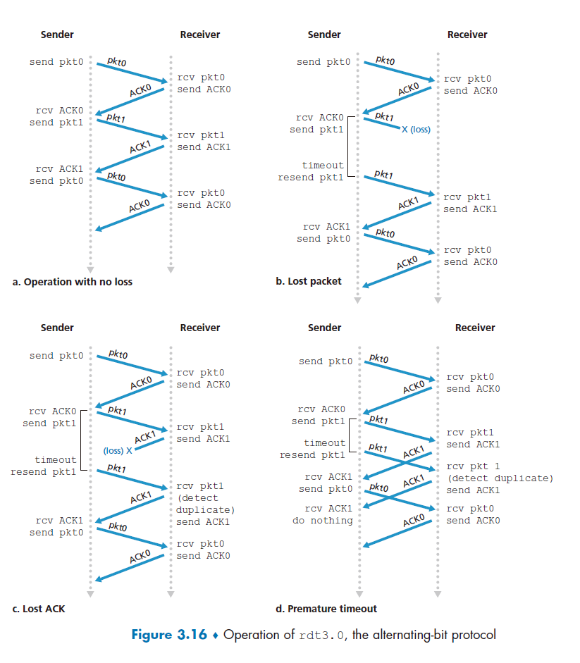

现在我们归纳一下数据传输协议的要点。在检验和、序号、定时器、肯定和否定确认分组这些技术中，每种机制都在协议的运行中起到了必不可少的作用。至此，我们得到了一个可靠数据传输协议！

### 3.4.2. 流水线可靠数据传输协议

rdt 3.0 是一个功能正确的协议，但它的性能不是很好。这个问题在于它是一个停等协议。

为了评价该停等行为对性能的影响，可考虑一种具有两台主机的理想化场合，一台主 机位于美国西海岸，另一台位于美国东海岸，如图 3-17 所示。在这两个端系统之间的光速往返传播时延 RTT 大约为 30 毫秒。假定彼此通过一条发送速率 R 为 1 Gbps（每秒 10^9 比特）的信道相连。包括首部字段和数据的分组长 L 为 1000 字节（8000 比特），发送一个分组进入 1 Gbps 链路实际所需时间是：

$$L_{trans} = { L \over R } = { 8000 bit/pkt \over 10^9 bit/s } = 0.008 ms$$

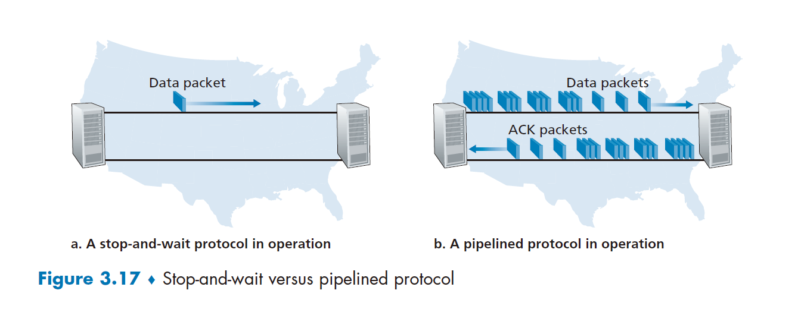

图 3-18a 显示了对于该停等协议，如果发送方在 t = 0 时刻开始发送分组，则在 L/R = 0.008 ms 后，最后 1 比特数据进入了发送端信道。该分组经过 15ms 的穿越国家的旅途后到达接收端，该分组的最后 1 比特在时刻 t = RTT/2 + L/R = 15.008 ms 时到达接收方。为了简化起见，假设 ACK 分组很小（以便我们可以忽略其发送时间），接收方一旦收到一个数据分组的最后 1 比特后立即发送 ACK, ACK 在时刻 t = RTT + L/R= 30. 008 ms 时在发送方出现。此时，发送方可以发送下一个报文。因此，在 30.008 ms 内，发送方的发送只用了 0.008 ms。如果我们定义发送方（或信道）的 **利用率(utilization)** 为：发送方实际忙于将发送比特送进信道的那部分时间与发送时间之比，图 3-18a 中的分析表明了停等协议有着非常低的发送方利用率 $U_{sender}$：

$$U_{sender} = {L/R\over{RTT + L/R}} = {0.008/30.008} = 0.027 \% $$

这就是说，发送方只有万分之 2.7 时间是忙的。从其他角度来看，发送方在 30. 008 ms 内只能发送 1000 字节，有效的吞吐量仅为 267kbps,即使有 1 Gbps 的链路可用也是如此! 想象一个不幸的网络经理购买了一条千兆比容量的链路，但他仅能得到 267kbps 吞吐量的情况！这是一个形象的网络协议限制底层网络硬件所提供的能力的图例。而且，我们还忽略了在发送方和接收方的底层协议处理时间，以及可能岀现在发送方与接收方之间的任何中间路由器上的处理与排队时延。考虑到这些因素，将进一步增加时延，使其性能更糟糕。

这种特殊的性能问题的一个简单解决方法是：不以停等方式运行，允许发送方发送多个分组而无须等待确认，如在图 3-17b 图示的那样。图 3-18b 显示了如果发送方可以在等待确认之前发送 3 个报文，其利用率也基本上提高 3 倍。因为许多从发送方向接收方输送的分组可以被看成是填充到一条流水线中，故这种技术被称为 **流水线(pipelining)**。流水线技术对可靠数据传输协议可带来如下影响：

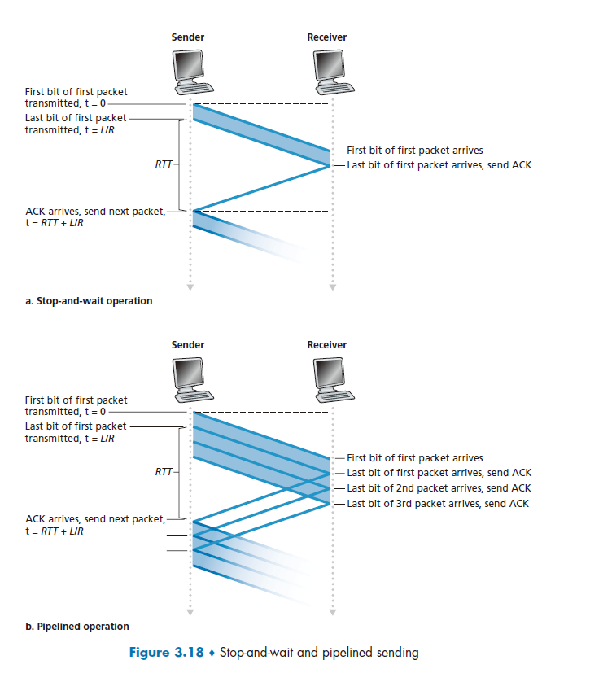

- 必须增加序号范围，因为每个输送中的分组（不计算重传的）必须有一个唯一的序号，而且也许有多个在输送中的未确认报文。
- 协议的发送方和接收方两端也许不得不缓存多个分组。发送方最低限度应当能缓冲那些已发送但没有确认的分组。如下面讨论的那样，接收方或许也需要缓存那些已正确接收的分组。
- 所需序号范围和对缓冲的要求取决于数据传输协议如何处理丢失、损坏及延时过大的分组。解决流水线的差错恢复有两种基本方法是：**回退 N 步（Go-Back-N,GBN)** 和 **选择重传(Selective Repeat, SR)**。

### 3.4.3. 回退 N 步

**time : 2021-06-01**

在 **回退 N 步(GBN)协议** 中，允许发送方发送多个分组（当由多个分组可用时）而不需等待确认，但它也受限于在流水线中未确认的分组数不能超过某个最大允许数 N。在本节中我们较详细地描述 GBN。

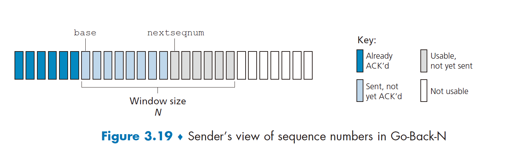

图 3-19 显示了发送方看到的 GBN 协议的序号范围。如果我们将基序号(base)定义为最早未确认分组的序号，将下一个序号(nextseqnum)定义为最小的未使用序号（即下一个待发分组的序号），则可将序号范围分割成 4 段。在［0, base - 1］段内的序号对应于已经发送并被确认的分组。［base, nextseqnum - 1］段内对应已经发送但未被确认的分组。［nextseqnum, base + N - 1］段内的序号能用于那些要被立即发送的分组，如果有数据来自上层的话。最后，大于或等于 base + N 的序号是不能使用的，直到当前流水线中未被确认的分组（特别是序号为 base 的分组）已得到确认为止。

如图 3-19 所提示的那样，那些已被发送但还未被确认的分组的许可序号范围可以被看成是一个在序号范围内长度为 N 的窗口。随着协议的运行，该窗口在序号空间向前滑动。因此，N 常被称为 **窗口长度(window s1ze)**，GBN 协议也常被称为 **滑动窗口协议(sliding-window protocol)**。你也许想知道，我们为什么先要限制这些被发送的、未被确认的分组的数目为 N 呢？为什么不允许这些分组为无限制的数目呢？我们将在 3-5 节看到, 流量控制是对发送方施加限制的原因之一。我们将在 3-7 节学习 TCP 拥塞控制时分析另一个原因。

在实践中，一个分组的序号承载在分组首部的一个固定长度的字段中。如果分组序号字段的比特数是 k 则该序号范围是［0, 2^k-1]。 在一个有限的序号范围内，所有涉及序号的运算必须使用模 2^k 运算。（即序号空间可被看作是一个长度为 2^k 的环，其中序号 2^k-1 紧接着序号 0。）前面讲过，rdt3.0 有一个 1 比特的序号，序号范围是［0, 1］。在本章末的几道习题中探讨了一个有限的序号范围所产生的结果。我们将在 3-5 节看到，TCP 有一个 32 比特的序号字段，其中的 TCP 序号是按字节流中的字节进行计数的，而不是按分组计数。

图 3-20 和图 3-21 给出了一个基于 ACK、无 NAK 的 GBN 协议的发送方和接收方这两端的扩展 FSM 描述。我们称该 FSM 描述为扩展 FSM,是因为我们已经增加了变量（类似于编程语言中的变量）base 和 nextseqnum，还增加了对这些变量的操作以及与这些变量有关的条件动作。注意到该扩展的 FSM 规约现在变得有点像编程语言规约。［Bochman 1984］对 FSM 扩展技术提供了一个很好的综述，也提供了用于定义协议的其他基于编程语言的技术。

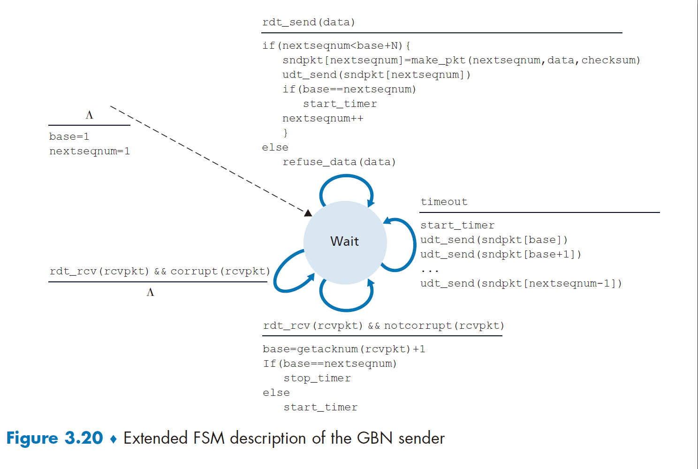

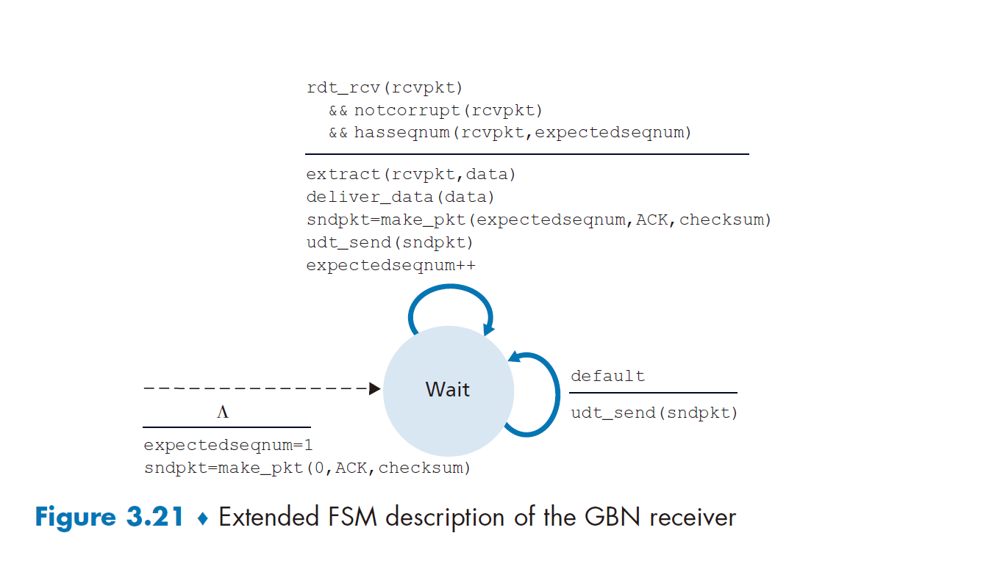

GBN 发送方必须响应三种类型的事件：

- **上层的调用**
  当上层调用 `rdt_send()` 时，发送方首先检查发送窗口是否已满，即是否有 N 个已发送但未被确认的分组。如果窗口未满，则产生一个分组并将其发送，并相应地更新变量。如果窗口已满，发送方只需将数据返回给上层，隐式地指示上层该窗口已满。然后上层可能会过一会儿再试。在实际实现中，发送方更可能缓存（并不立刻发送）这些数据，或者使用同步机制（如一个信号量或标志）允许上层在仅当窗口不满时才调用 `rdt_send()`。
- **收到一个 ACK**
  在 GBN 协议中，对序号为几的分组的确认采取 **累积确认(cumulative acknowledgment)** 的方式，表明接收方已正确接收到序号为 n 的以前且包括 n 在内的所有分组。稍后讨论 GBN 接收方一端时，我们将再次研究这个主题。
- **超时事件**
  协议的名字“回退 N 步”来源于出现丢失和时延过长分组时发送方的行为。就像在停等协议中那样，定时器将再次用于恢复数据或确认分组的丢失。
  如果出现超时，发送方重传所有已发送但还未被确认过的分组。图 3-20 中的发送方仅使用一个定时器，它可被当作是最早的已发送但未被确认的分组所使用的定时器。如果收到一个 ACK，但仍有已发送但未被确认的分组，则定时器被重新启动。如果没有已发送但未被确认的分组，停止该定时器。

在 GBN 中，接收方的动作也很简单。如果一个序号为〃的分组被正确接收到，并且 按序（即上次交付给上层的数据是序号为 n-1 的分组），则接收方为分组 n 发送一个 ACK,并将该分组中的数据部分交付到上层。在所有其他情况下，接收方丢弃该分组，并 为最近按序接收的分组重新发送 ACK。注意到因为一次交付给上层一个分组，如果分组 k 已接收并交付，则所有序号比 k 小的分组也已经交付。因此，使用累积确认是 GBN—个自然的选择。

在 GBN 协议中，接收方丢弃所有失序分组。尽管丢弃一个正确接收（但失序）的分组有点愚蠢和浪费，但这样做是有理由的。前面讲过，接收方必须按序将数据交付给上层。假定现在期望接收分组 n 而分组 n + 1 却到了。因为数据必须按序交付，接收方可能缓存（保存）分组 n + 1,然后，在它收到并交付分组 n 后，再将该分组交付到上层。然而，如果分组 n 丢失，则该分组及分组 n + 1 最终将在发送方根据 GBN 重传规则而被重传。因此，接收方只需丢弃分组 n + 1 即可。不需要缓存任何失序分组。因此，虽然发送方必须维护窗口的上下边界及 nextseqnum 在该窗口中的位置，但是接收方需要维护的唯一信息就是下一个按序接收的分组的序号。该值保存在 expectedseqnum 变量中，如图 3-21 中接收方 FSM 所示。当然，丢弃一个正确接收的分组的缺点是随后对该分组的重传也 许会丢失或出错，因此甚至需要更多的重传。

图 3-22 给岀了窗口长度为 4 个分组 的 GBN 协议的运行情况。因为该窗口 长度的限制亍发送方发送分组 0~3,然 后在继续发送之前，必须等待直到一个 或多个分组被确认。当接收到每一个连 续的 ACK （例如 ACK 0 和 ACK 1）时, 该窗口便向前滑动，发送方便可以发送 新的分组（分别是分组 4 和分组 5）。在接收方，分组 2 丢失，因此分组 3、4 和 5 被发现是失序分组并被丢弃。


在结束对 GBN 的讨论之前，需要提请注意的是，在协议栈中实现该协议可能与图 3-20 中的扩展 FSM 有相似的这种方法的优点是接收缓存简单，即接收方结构。该实现也可能是以各种过程形式出现，每个过程实现了在响应各种可能岀现的事件时要采取的动作。在这种 **基于事件的编程(event-based programming)** 方式中，这些过程要么被协议栈中的其他过程调用，要么作为一次中断的结果。在发送方，这些事件包括: 1. 来自上层实体的调用去调用 `rdt_send()`；2. 定时器中断；3. 报文到达时，来自下层的调用去调用 `rdt_rcv()`。本章后面的编程作业会使你有机会在一个模拟网络环境中实际实现这些例程，但该环境却是真实的。

这里我们注意到，GBN 协议中综合了我们将在 3-5 节中学习 TCP 可靠数据传输协议时遇到的所有技术。这些技术包括使用序号、累积确认、检验和以及超时/重传操作。

### 3.4.4. 选择重传

在图 3-17 中，GBN 协议潜在地允许发送方用多个分组“填充流水线”，因此避免了停等协议中所提到的信道利用率问题。然而，GBN 本身也有一些情况存在着性能问题。尤其是当窗口长度和带宽时延积都很大时，在流水线中会有很多分组更是如此。单个分组的差 错就能够引起 GBN 重传大量分组，许多分组根本没有必要重传。随着信道差错率的增加, 流水线可能会被这些不必要重传的分组所充斥。想象一下，在我们口述消息的例子中，如果每次有一个单词含糊不清，其前后 1000 个单词（例如，窗口长度为 1000 个单词）不得不被重传的情况。此次口述会由于这些反复述说的单词而变慢。

顾名思义，选择重传（SR）协议通过让发送方仅重传那些它怀疑在接收方出错（即丢失或受损）的分组而避免了不必要的重传。这种个别的、按需的重传要求接收方逐个地确认正确接收的分组。再次用窗口长度 N 来限制流水线中未完成、未被确认的分组数。然而，与 GBN 不同的是，发送方已经收到了对窗口中某些分组的 ACK。图 3-23 显示了 SR 发送方看到的序号空间。图 3-24 详细描述了 SR 发送方所采取的动作。

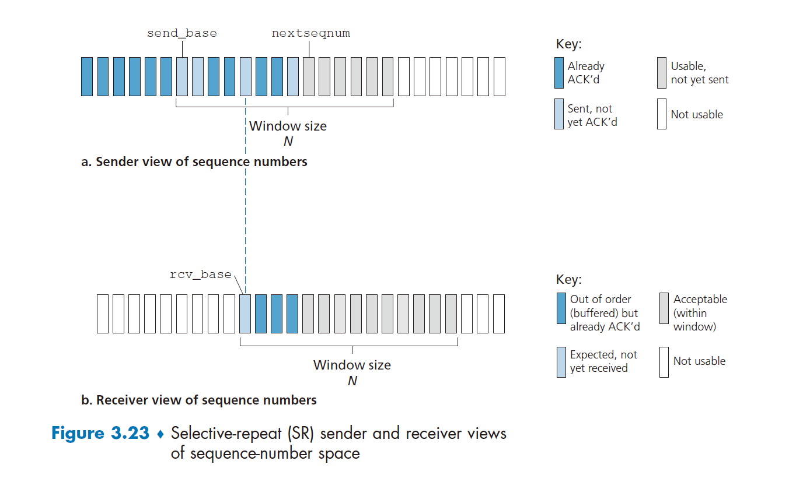

SR 接收方将确认一个正确接收的分组而不管其是否按序。失序的分组将被缓存直到 所有丢失分组（即序号更小的分组）皆被收到为止，这时才可以将一批分组按序交付给上 层。图 3-25 详细列出了 SR 接收方所采用的各种动作。图 3-26 给出了一个例子以说明出现丢包时 SR 的操作。值得注意的是，在图 3-26 中接收方初始时缓存了分组 3、4、5,并在最终收到分组 2 时.才将它们一并交付给上层。

注意到图 3-25 中的第二步很重要，接收方重新确认（而不是忽略）已收到过的那些 序号小于当前窗口基序号的分组。你应该理解这种重新确认确实是需要的。例如，给定在 图 3-23 中所示的发送方和接收方的序号空间，如果分组 send.base 的 ACK 没有从接收方传 播回发送方，则发送方最终将重传分组 send_base,即使显然（对我们而不是对发送方来说!）接收方已经收到了该分组。如果接收方不确认该分组，则发送方窗口将永远不能向 前滑动！这个例子说明了 SR 协议（和很多其他协议一样）的一个重要方面。对于哪些分组已经被正确接收，哪些没有，发送方和接收方并不总是能看到相同的结果。对 SR 协议 而言，这就意味着发送方和接收方的窗口并不总是一致。

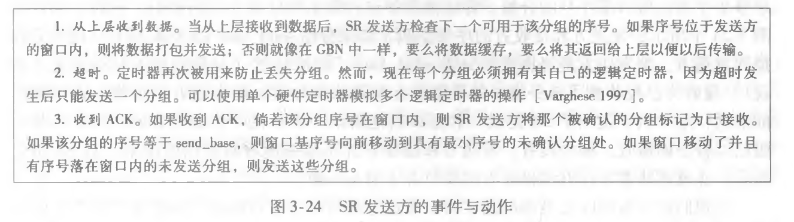

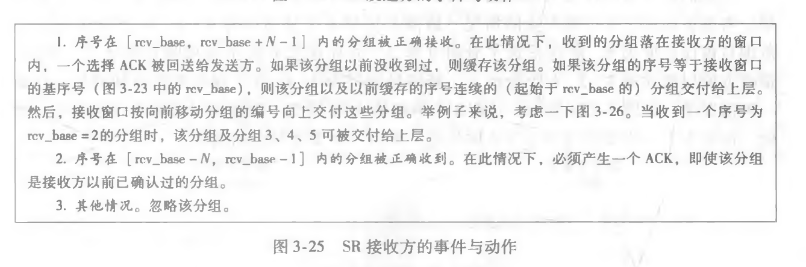

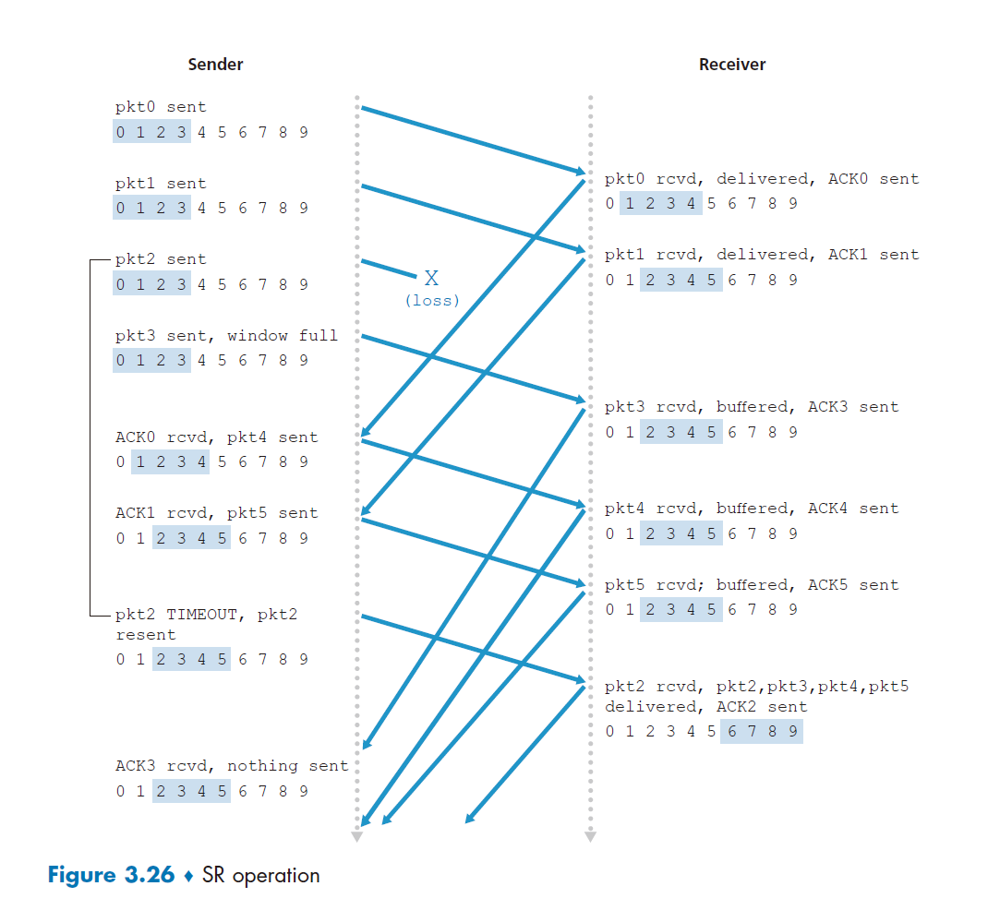

当我们面对有限序号范围的现实时，发送方和接收方窗口间缺乏同步会产生严重的后果。考虑下面例子中可能发生的情况，该例有包括 4 个分组序号 0、1、2、3 的有限序号 范围且窗口长度为 3。假定发送了分组 0 至 2,并在接收方被正确接收且确认了。此时, 接收方窗口落在第 4、5、6 个分组上，其序号分别为 3、0、1。现在考虑两种情况。在第 一种情况下，如图 3-27a 所示，对前 3 个分组的 ACK 丢失，因此发送方重传这些分组。因此，接收方下一步要接收序号为 0 的分组，即第一个发送分组的副本。

在第二种情况下，如图 3-27b 所示，对前 3 个分组的 ACK 都被正确交付。因此发送方 向前移动窗口并发送第 4、5、6 个分组，其序号分别为 3、0、10 序号为 3 的分组丢失， 但序号为 0 的分组到达（一个包含新数据的分组）。

现在考虑一下图 3-27 中接收方的观点，在发送方和接收方之间有一个假想的帘子, 因为接收方不能“看见”发送方采取的动作。接收方所能观察到的是它从信道中收到的以 及它向信道中发出报文序列。就其所关注的而言，图 3-27 中的两种情况是等同的。没有 办法区分是第 1 个分组的重传还是第 5 个分组的初次传输。显然，窗口长度比序号空间小 1 时协议无法工作。但窗口必须多小呢？本章后面的一道习题请你说明为何对于 SR 协议 而言，窗口长度必须小于或等于序号空间大小的一半。

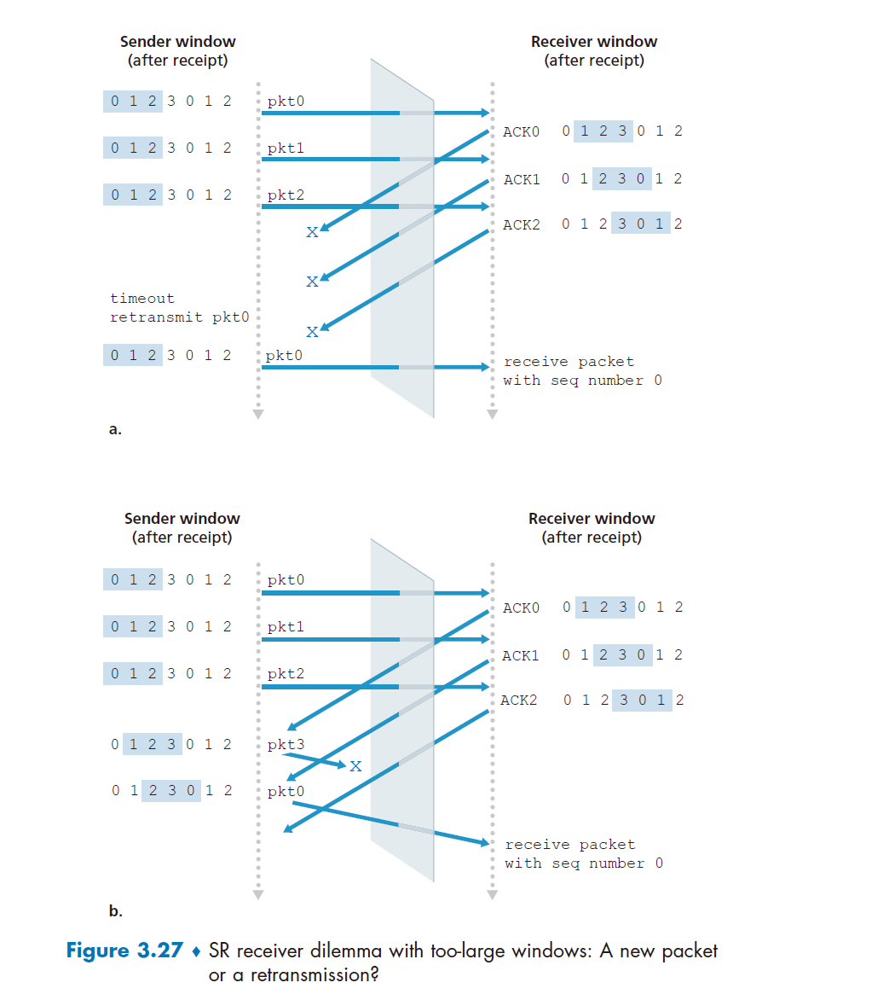

至此我们结束了对可靠数据传输协议的讨论。我们已涵盖许多基础知识，并介绍了多种机制，这些机制可一起提供可靠数据传输。下面这张表总结这些机制。既然我们已经学习了所有这些运行中的机制，并能看到“全景”，我们建议你再复习一遍本节内容，看看这些机制是怎样逐步被添加进来，以涵盖复杂性渐增的（现实的）连接发送方与接收方的各种信道模型的，或者如何改善协议性能的。

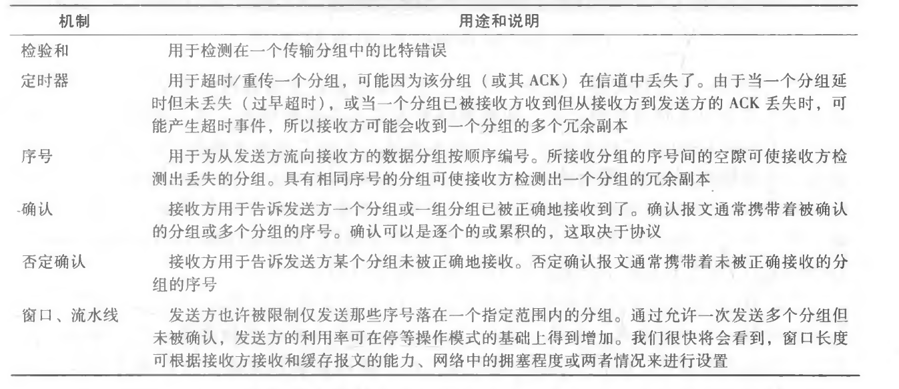

我们通过考虑在底层信道模型中的一个遗留假设来结束对可靠数据传输协议的讨论。前面讲过，我们曾假定分组在发送方与接收方之间的信道中不能被重新排序。这在发送方与接收方由单段物理线路相连的情况下，通常是一个合理的假设。然而，当连接两端的 “信道”是一个网络时，分组重新排序是可能会发生的。分组重新排序的一个表现就是, 一个具有序号或确认号 x 的分组的旧副本可能会出现，即使发送方或接收方的窗口中都没有包含 x。对于分组重新排序，信道可被看成基本上是在缓存分组，并在将来任意时刻自然地释放岀这些分组。由于序号可以被重新使用，那么必须小心，以免出现这样的冗余分组。实际应用中采用的方法是，确保一个序号不被重新使用，直到发送方“确信”任何先前发送的序号为 x 的分组都不再在网络中为止。通过假定一个分组在网络中的“存活”时间不会超过某个固定最大时间量来做到这一点。在高速网络的 TCP 扩展中，最长的分组寿命被假定为大约 3 分钟[RFC 1323]。 [Sunshine 1978]描述了一种使用序号的方法，它能够完全避免重新排序问题。

## 3.5. 面向连接的运输：TCP

我们在上一节已经学习了可靠数据传输原理，现在就可以来学习 TCP 了。TCP 是因特网运输层的可靠运输协议。我们将在本节看到 TCP 使用了很多可靠数据传输原理，包括差错检测，重传，累计确认，定时器，以及确认号和序号。TCP 定义在 RFC 793、RFC 1122、RFC 1323、RFC 2018 以及 RFC 2581 中。

### 3.5.1. TCP 连接

TCP 被称为是 **面向连接的(connection-oriented)**，这是因为在一个应用进程可以开始向另一个应用进程发送数据之前，这两个进程必须先相互“握手”，即它们必须相互发送某些预备报文段，以建立确保数据传输的参数。作为 TCP 连接建立的一部分，连接的双方都将初始化与 TCP 连接相关的许多 TCP 状态变量（其中的许多状态变量将在本节和 3-7 节中讨论）。

这种 TCP “连接”不是一条像在电路交换网络中的端到端 TDM 或 FDM 电路。相反, 该“连接”是一条逻辑连接，其共同状态仅保留在两个通信端系统的 TCP 程序中。前面讲过，由于 TCP 协议只在端系统中运行，而不在中间的网络设备（路由器和链路层交换机）中运行，所以中间的网络设备不会维持 TCP 连接状态。事实上，中间设备不关注 TCP 连接，他们看到的是数据报。

一台主机上的 A 进程于另一台主机上的进程 B 存在一条 TCP 连接，那么应用层数据就可在从进程 B 流向进程 A 的同时，也从进程 A 流向进程 B。TCP 连接也总是点对点（point-to-point）的，即在单个发送方与单个接收方之间的连接。

我们现在来看看 TCP 连接是怎样建立的。假设运行在某台主机上的一个进程想与另一台主机上的一个进程建立一条连接。前面讲过，发起连接的这个进程被称为客户进程，而另一个进程被称为服务器进程。该客户应用进程首先要通知客户运输层，它想与服务器上的一个进程建立一条连接。2-7-2 节讲过，一个 Python 客户程序通过发出下面的命令来实现此目的。

```py
clientSocket.connect((serverName,serverPort))
```

其中 serverName 是服务器的名字，serverPort 标识了服务器上的进程。客户上的 TCP 便开始与服务器上的 TCP 建立一条 TCP 连接。我们将在本节后面更为详细地讨论连接建 立的过程。现在知道下列事实就可以了 ：客户首先发送一个特殊的 TCP 报文段，服务器用 另一个特殊的 TCP 报文段来响应，最后，客户再用第三个特殊报文段作为响应。前两个报文段不承载“有效载荷”，也就是不包含应用层数据；而第三个报文段可以承载应用层数据。由于在这两台主机之间发送了 3 个报文段，所以这种连接建立过程常被称为 **三次握手(three-way handshake)**。

一旦建立起一条 TCP 连接，两个应用进程之间就可以相互发送数据了。我们考虑一下从客户进程向服务器进程发送数据的情况。如 2-7 节中所述，客户进程通过套接字（该进程之门）传递数据流。数据一旦通过该门，它就由客户中运行的 TCP 控制了。如图 3-28 所示，TCP 将这些数据引导到该连接的 **发送缓存(send buffer)** 里，发送缓存是发起三次握手期间设置的缓存之一。接下来 TCP 就会不时从发送缓存里取出一块数据，并将数据传递到网络层。TCP 可从缓存中取出并放入报文段中的数据数量受限于 **最大报文段长度(Maximum Segment S1ze, MSS）**。 MSS 通常根据最初确定的由本地发送主机发送的最大链路层帧长度（即所谓的 **最大传输单元(Maximum Transmiss1on Unit, MTU)**）来设置。设置该 MSS 要保证一个 TCP 报文段（当封装在一个 IP 数据报中）加上 TCP/IP 首部长度（通常 40 字节）将适合单个链路层帧。以太网和 PPP 链路层协议都具有 1500 字节的 MTU，因此 MSS 的典型值为 1460 字节。已经提出了多种发现路径 MTU 的方法，并基于路径 MTU 值设置 MSS （路径 MTU 是指能在从源到目的地的所有链路上发送的最大链路层帧［RFC 1191］）。注意到 MSS 是指在报文段里应用层数据的最大长度，而不是指包括首部的 TCP 报文段的最大长度。（该术语很容易混淆，但是我们不得不采用它，因为它已经根深蒂固了。）

TCP 为每块客户数据配上一个 TCP 首部，从而形成多个 **TCP 报文段(TCP segment)**。 这些报文段被下传给网络层，网络层将其分别封装在网络层 IP 数据报中。然后这些 IP 数据报被发送到网络中。当 TCP 在另一端接收到一个报文段后，该报文段的数据就被放入该 TCP 连接的接收缓存中，如图 3-28 中所示。应用程序从此缓存中读取数据流。该连接的每一端都有各自的发送缓存和接收缓存。

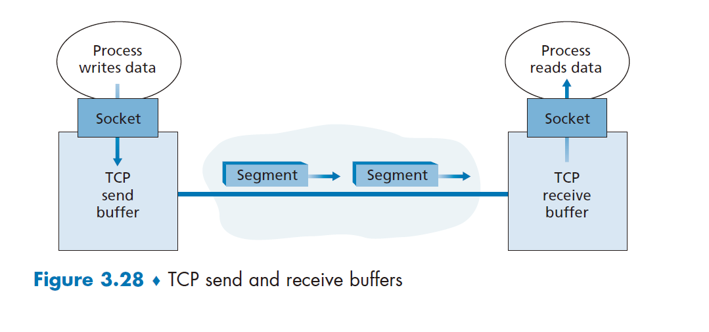

从以上讨论中我们可以看出，TCP 连接的组成包括：一台主机上的缓存、变量和与进程连接的套接字，以及另一台主机上的另一组缓存、变量和与进程连接的套接字。如前面讲过的那样，在这两台主机之间的网络设备(路由器，交换机和中继器)中没有为该连接分配任何缓存和变量。

### 3.5.2. TCP 报文段结构

简要地了解了 TCP 连接后，我们研究一下 TCP 报文段结构。TCP 报文段由首部字段和一个数据字段组成。数据字段包含一块应用数据。如前所述，MSS 限制了报文段数据字段的最大长度。当 TCP 发送一个大文件，例如某 Web 页面上的一个图像时，TCP 通常是将该文件划分成长度为 MSS 的若干块(最后一块除外，它通常小于 MSS)。然而，交互式应用通常传送长度小于 MSS 的数据块。例如，对于像 Telnet 这样的远程登录应用，其中 TCP 报文段的数据字段经常只有一个字节。由于 TCP 的首部一般是 20 字节(比 UDP 首部多 12 字节)，所以 Telnet 发送的报文段也许只有 21 字节长。


图 3-29 显示了 TCP 报文段的结构。与 UDP —样，首部包括 **源端口号** 和 **目的端口号**，它被用于多路复用/分解来自或送到上层应用的数据。另外，同 UDP—样，TCP 首部也包括 **检验和字段(checksum field)**。TCP 报文段首部还包含下列字段:

- 32 比特的 **序号字段(sequence number field)** 和 32 比特的 **确认号字段(acknowledgment number field)**。这些字段被 TCP 发送方和接收方用来实现可靠数据传输服务，讨论见后。
- 16 比特的 **接收窗口字段(receive window field)**，该字段用于流量控制。我们很快就会看到，该字段用于指示接收方愿意接受的字节数量。
- 4 比特的 **首部长度字段(header length field)**，该字段指示了以 32 比特的字为单位的 TCP 首部长度。由于 TCP 选项字段的原因，TCP 首部的长度是可变的。(通常, 选项字段为空，所以 TCP 首部的典型长度是 20 字节。)
- 可选与变长的 **选项字段(options field)**，该字段用于发送方与接收方协商最大报文段长度(MSS)时，或在高速网络环境下用作窗口调节因子时使用。首部字段中还定义了一个时间戳选项。可参见 RFC 854 和 RFC 1323 了解其他细节。
- 6 比特的 **标志字段(flag field)**。ACK 比特用于指示确认字段中的值是有效的，即该报文段包括一个对已被成功接收报文段的确认。RST、SYN 和 FIN 比特用于连接建立和拆除，我们将在本节后面讨论该问题。在明确拥塞通告中使用了 CWR 和 ECE 比特，如 3-7-2 节中讨论的那样。当 PSH 比特被置位时，就指示接收方应立 即将数据交给上层。最后，URG 比特用来指示报文段里存在着被发送端的上层实体置为“紧急”的数据。紧急数据的最后一个字节由 16 比特的 **紧急数据指针字段(urgent data pointer field)** 指出。当紧急数据存在并给出指向紧急数据尾指针的时候，TCP 必须通知接收端的上层实体。(在实践中，PSH、URG 和紧急数据指针并没有使用。为了完整性起见，我们才提到这些字段。)

1. **序号与确认号**

TCP 报文段首部中两个最重要的字段是序号字段和确认号字段。这两个字段是 TCP 可靠传输服务的关键部分。但是在讨论这两个字段是如何用于提供可靠数据传输之前，我们首先来解释一下 TCP 在这两个字段中究竟放置了什么。

TCP 把数据看成一个无结构的、有序的字节流。我们从 TCP 对序号的使用上可以看出这一点，因为序号是建立在传送的字节流之上，而不是建立在传送的报文段的序列之上。一个 **报文段的序号(sequence number for a segment)** 因此是该报文段首字节的字节流编号。 举例来说，假设主机 A 上的一个进程想通过一条 TCP 连接向主机 B 上的一个进程发送一个数据流。主机 A 中的 TCP 将隐式地对数据流中的每一个字节编号。假定数据流由一个包含 500000 字节的文件组成，其 MSS 为 1000 字节，数据流的首字节编号是 0。如图 3-30 所示，该 TCP 将为该数据流构建 500 个报文段。给第一个报文段分配序号 0，第二个报文段分配序号 1000，第三个报文段分配序号 2000，以此类推。每一个序号被填入到相应 TCP 报文段首部的序号字段中。

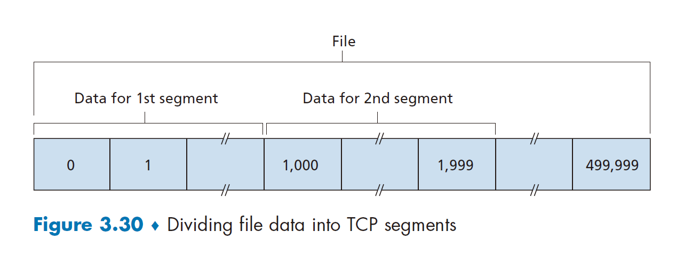

现在我们考虑一下确认号。确认号要比序号难处理一些。前面讲过，TCP 是全双工的，因此主机 A 在向主机 B 发送数据的同时，也许也接收来自主机 B 的数据(都是同一条 TCP 连接的一部分)。从主机 B 到达的每个报文段中都有一个序号用于从 B 流向 A 的数据。主机 A 填充进报文段的确认号是主机 A 期望从主机 B 收到的下一字节的序号。看一些例子有助于理解实际发生的事情。假设主机 A 已收到了来自主机 B 的编号为 0 ~535 的所有字节，同时假设它打算发送一个报文段给主机 B。主机 A 等待主机 B 的数据流中字节 536 及之后的所有字节。所以主机 A 就会在它发往主机 B 的报文段的确认号字段中填上 536。

再举一个例子，假设主机 A 已收到一个来自主机 B 的包含字节 0 ~535 的报文段，以及另一个包含字节 900〜1000 的报文段。由于某种原因，主机 A 还没有收到字节 536 - 899 的报文段。在这个例子中，主机 A 为了重新构建主机 B 的数据流，仍在等待字节 536 （和其后的字 节）。因此，A 到 B 的下一个报文段将在确认号字段中包含 536。因为 TCP 只确认该流中至第一个丢失字节为止的字节，所以 TCP 被称为提供 **累积确认(cumulative acknowledgment)**。

最后一个例子也会引发一个重要而微妙的问题。主机 A 在收到第二个报文段（字节 536 ~ 899）之前收到第三个报文段（字节 900 ~ 1000）。因此，第三个报文段失序到达。该微妙的问题是：当主机在一条 TCP 连接中收到失序报文段时该怎么办？有趣的是，TCP RFC 并没有为此明确规定任何规则，而是把这一问题留给实现 TCP 的编程人员去处理。他们有两个基本的选择：1. 接收方立即丢弃失序报文段（如前所述，这可以简化接收方的设计）；2. 接收方保留失序的字节，并等待缺少的字节以填补该间隔。显然，后一种选择对网络带宽而言更为有效，是实践中采用的方法。

在图 3-30 中，我们假设初始序号为 0。事实上，一条 TCP 连接的双方均可随机地选择初始序号。这样做可以减少将那些仍在网络中存在的来自两台主机之间先前已终止的连接的报文段，误认为是后来这两台主机之间新建连接所产生的有效报文段的可能性（它碰巧与旧连接使用了相同的端口号）［Sunshine 1978］。

**time : 2021-06-07**

2. **Telent：序号与确认号的一个学习案例**

Telnet 由 RFC 854 定义，它现在是一个用于远程登录的流行应用层协议。它运行在 TCP 之上，被设计成可在任意一对主机之间工作。Telnet 与微妙第 2 章讨论的批量数据传输应用不同，它是一个交互式应用。微妙现在讨论一个 Telnet 例子，因为该例子很好地阐述了 TCP 的序号和确认号。微妙注意到许多用户现在更愿意采用 SSH 协议而不是 Telnet，因为在 Telnet 连接中发送的数据（包括口令）是没有加密的，这使得 Telnet 易于受到窃听攻击（8-7 节会详细讨论）。

假设一个主机 A 发起一个与主机 B 的 Telnet 会话。因为是主机 A 发起该会话，因此它被标记为客户，而主机 B 被标记为服务器。在客户端用户键入的每个字符都会被发送给远程主机。远程主机将回送每个字符的副本给客户，并将这些字符显示在 Telnet 用户的屏幕上。这种回显用于确保由 Telnet 用户发送的字符已经被远程主机收到并在远程主机上得到处理。因此，在从用户键入字符到字符被显示在用户屏幕上的这段时间内，每个字符被传输了两次。

现在假设用户输入了一个字符 'C'，然后喝起了咖啡。我们考察一下在客户与服务器之间发送的 TCP 报文段。如图 3-31 所示，假设客户和服务器的起始序号分别是 42 和 79。前面讲过，一个报文段的序号就是该报文段数据字段首字节的序号。因此，客户发送的第一个报文段的序号为 42，服务器发送的第一个报文段的序号为 79。前面讲过，确认号就是主机正在等待的数据的下一个字节序号。在 TCP 连接建立后但没有发送任何数据之前，该客户等待字节 79，而该服务器等待字节 42。

如图 3-31 中所示，共发送 3 个报文段。第一个报文段是由客户发往服务器，在它的数据字段里包含一字节的字符 'C' 的 ASCII 码。如我们刚讲到的那样，第一个报文段的序号字段里是 42。另外，由于客户还没有接收到来自服务器的任何数据，因此该第一个报文段中的确认号字段中是 79。

第二个报文段是由服务器发往客户。它有两个目的：首先它是为该服务器所收到数据提供一个确认。通过在确认号字段中填入 43，服务器告诉客户它已经成功地收到字节 42 及以前的所有字节，现在正等待着字节 43 的出现。该报文段的第二个目的是回显字符'C'。因此，在第二个报文段的数据字段里填入的是字符 'C' 的 ASCII 码。第二个报文段的序号为 79，它是该 TCP 连接上从服务器到客户的数据流的起始序号，这也正是服务器要发送的第一个字节的数据。值得注意的是，对客户到服务器的数据的确认被装载在一个承载服务器到客户的数据的报文段中；这种确认被称为是被 **捎带(piggybacked)** 在服务器到客户的数据报文段中的。

第三个报文段是从客户发往服务器的。它的唯一目的是确认已从服务器收到的数据。（前面讲过，第二个报文段中包含的数据是字符是从服务器到客户的。）该报文段的数据字段为空（即确认信息没有被任何从客户到服务器的数据所捎带）。该报文段的确认号字段填入的是 80，因为客户已经收到了字节流中序号为 79 及以前的字节，它现在正等待着字节 80 的出现。你可能认为这有点奇怪，即使该报文段里没有数据还仍有序号。这是因为 TCP 存在序号字段，报文段需要填入某个序号。

### 3.5.3. 往返时间的估计与超时

TCP 如同前面 3.4 节所讲的 rdt 协议一样，它采用超时/重传机制来处理报文段的丢失问 题。尽管这在概念上简单，但是当在如 TCP 这样的实际协议中实现超时/重传机制时还是会 产生许多微妙的问题。也许最明显的一个问题就是超时间隔长度的设置。显然，超时间隔必须大于该连接的往返时间（RTT），即从一个报文段发出到它被确认的时间。否则会造成不必要的重传。但是这个时间间隔到底应该是多大呢？刚开始时应如何估计往返时间呢？是否应该为所有未确认的报文段各设一个定时器？问题竟然如此之多！我们在本节中的讨论基于 [Jacobson 1988]中有关 TCP 的工作以及 IETF 关于管理 TCP 定时器的建议[RFC 6298]。

1. **估计往返时间**

我们开始学习 TCP 定时器的管理问题，要考虑一下 TCP 是如何估计发送方与接收方 之间往返时间的。这是通过如下方法完成的。报文段的样本 RTT （表示为 SampleRTT）就是从某报文段被发出（即交给 IP）到对该报文段的确认被收到之间的时间量。大多数 TCP 的实现仅在某个时刻做一次 SampleRTT 测量，而不是为每个发送的报文段测量一个 SampleRTT。这就是说，在任意时刻，仅为一个已发送的但目前尚未被确认的报文段估计 SampleRTT，从而产生一个接近每个 RTT 的新 SampleRTT 值。另外，TCP 决不为已被重传的报 文段计算 SampleRTT；它仅为传输一次的报文段测量 SampleRTT [Kan 1987]。

显然，由于路由器的拥塞和端系统负载的变化，这些报文段的 SampleRTT 值会随之波动。由于这种波动，任何给定的 SampleRTT 值也许都是非典型的。因此，为了估计一个典型的 RTT,自然要采取某种对 SampleRTT 取平均的办法。TCP 维持一个 SampleRTT 均值（称为 EstimatedRTT）。一旦获得一个新 SampleRTT 时，TCP 就会根据下列公式来更新 EstimatedRTT:

$$EstimatedRTT = (1-a)EstimatedRTT + a \cdot SampleRTT$$

上面的公式是以编程语言的语句方式给出的，即 EstimatedRTT 的新值是由以前的 EstimatedRTT 值与 SampleRTT 新值加权组合而成的。在［RFC 6298 ］中给岀的 a 推荐值是 a =0.125 （即 1/8），这时上面的公式变为：

$$EstimatedRTT = 0.875 \cdot EstimatedRTT + 0. 125 \cdot SampleRTT$$

值得注意的是，EstimatedRTT 是一个 SampleRTT 值的加权平均值。如在本章后面习题中讨论的那样，这个加权平均对最近的样本赋予的权值要大于对旧样本赋予的权值。这是很自然的，因为越近的样本越能更好地反映网络的当前拥塞情况。从统计学观点讲，这种平均被称为 **指数加权移动平均(Exponential Weighted Moving Average, EWMA)**。在 EWMA 中的“指数”一词看起来是指一个给定的 SampleRTT 的权值在更新的过程中呈指数型快速衰减。在课后习题中，将要求你推导出 EstimatedRTT 的指数表达形式。

图 3-32 显示了当 a = 1/8 时，在 gaia.cs.umass.edu （在美国马萨诸塞州的 Amherst） 与 fantas1a.eurecom.fr （在法国南部）之间的一条 TCP 连接上的 SampleRTT 值与 EstimatedRTT 值。显然，SampleRTT 的变化在 EstimatedRTT 的计算中趋于平缓了。

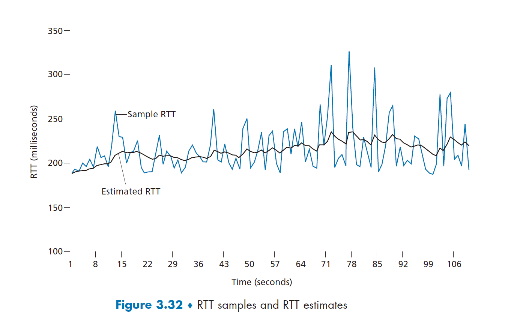

除了估算 RTT 外，测量 RTT 的变化也是有价值的。［RFC 6298］定义了 RTT 偏差 DevRTT，用于估算 SampleRTT 一般会偏离 EstimatedRTT 的程度：

$$DevRTT = (1 - b)DevRTT + b \cdot |SampleRTT - EstimatedRTT|$$

注意到 DevRTT 是一个 SampleRTT 与 EstimatedRTT 之间差值的 EWMA。如果 SampleRTT 值波动较小，那么 DevRTT 的值就会很小；另一方面，如果波动很大，那么 DevRTT 的值就会很大。b 的推荐值为 0.25。

2. **设置和管理超时间隔**

假设已经给岀了 EstimatedRTT 值和 DevRTT 值，那么 TCP 超时间隔应该用什么值呢? 很明显，超时间隔应该大于等于 EstimatedR^IT,否则，将造成不必要的重传。但是超时间 隔也不应该比 EstimatedRTT 大太多，否则当报文段丢失时，TCP 不能很快地重传该报文段，导致数据传输时延大。因此要求将超时间隔设为 EstimatedRTT 加上一定余量。当 SampleRTT 值波动较大时，这个余量应该大些；当波动较小时，这个余量应该小些。因此，DevRTT 值应该在这里发挥作用了。在 TCP 的确定重传超时间隔的方法中，所有这些因素都考虑到了:

$$TimeoutInterval = EstimatedRTT + 4 \cdot DevRTT$$

推荐的初始 Timeoutinterval 值为 1 秒［RFC 6298］ 同时，当出现超时后，Timeoutlnterval 值将加倍，以免即将被确认的后继报文段过早出现超时。然而，只要收到报文段并更新 EstimatedRTT，就使用上述公式再次计算 Timeoutinterval。

与我们在 3-4 节中所学的方法很像，TCP 通过使用肯定确认与定时器来提供可靠数据传输。TCP 确认正确接收到的数据，而当认为报文段或其确认报文丢失或受损时，TCP 会重传这些报文段。有些版本的 TCP 还有一个隐式 NAK 机制（在 TCP 的快速重传机制下，收到对一个特定报文段的 3 个冗余 ACK 就可作为对后面报文段的一个隐式 NAK，从而在超时之前触发对该报文段的重传）。TCP 使用序号以使接收方能识别丢失或重复的报文段。像可靠数据传输协议 rdt 3.0 的情况一样，TCP 自己也无法明确地分辨一个报文段或其 ACK 是丢失了还是受损了，或是时延过长了。在发送方，TCP 的响应是相同的：重传有疑问的报文段。

TCP 也使用流水线，使得发送方在任意时刻都可以有多个已发出但还未被确认的报 文段存在。我们在前面已经看到，当报文段长度与往返时延之比很小时，流水线可显著 地增加一个会话的呑吐量。一个发送方能够具有的未被确认报文段的具体数量是由 TCP 的流量控制和拥塞控制机制决定的。TCP 流量控制将在本节后面讨论；TCP 拥塞控制将 在 3-7 节中讨论。此时我们只需知道 TCP 发送方使用了流水线。

### 3.5.4. 可靠数据传输

前面讲过，因特网的网络层服务（IP 服务）是不可靠的。IP 不保证数据报的交付, 不保证数据报的按序交付，也不保证数据报中数据的完整性。对于 IP 服务，数据报能够 溢出路由器缓存而永远不能到达目的地，数据报也可能是乱序到达，而且数据报中的比特 可能损坏（由 0 变为 1 或者相反）。由于运输层报文段是被 IP 数据报携带着在网络中传输的，所以运输层的报文段也会遇到这些问题。

TCP 在 IP 不可靠的尽力而为服务之上创建了一种 **可靠数据传输服务(reliable data transfer service)**。 TCP 的可靠数据传输服务确保一个进程从其接收缓存中读出的数据流是无损坏、无间隙、非冗余和按序的数据流；即该字节流与连接的另一方端系统发送出的字节流是完全相同。TCP 提供可靠数据传输的方法涉及我们在 3-4 节中所学的许多原理。

在我们前面研发可靠数据传输技术时，曾假定每一个已发送但未被确认的报文段都与一个定时器相关联，这在概念上是最简单的。虽然这在理论上很好，但定时器的管理却需要相当大的开销。因此，推荐的定时器管理过程［RFC 6298］仅使用单一的重传定时器，即使有多个已发送但还未被确认的报文段。在本节中描述的 TCP 协议遵循了这种单一定时器的推荐。

我们将以两个递增的步骤来讨论 TCP 是如何提供可靠数据传输的。我们先给出一个 TCP 发送方的高度简化的描述，该发送方只用超时来恢复报文段的丢失；然后再给岀一个更全面的描述，该描述中除了使用超时机制外，还使用冗余确认技术。在接下来的讨论中，我们假定数据仅向一个方向发送，即从主机 A 到主机 B,且主机 A 在发送一个大文件。

图 3-33 给岀了一个 TCP 发送方高度简化的描述。我们看到在 TCP 发送方有 3 个与发送和重传有关的主要事件：从上层应用程序接收数据；定时器超时和收到 ACK。一旦第一个主要事件发生，TCP 从应用程序接收数据，将数据封装在一个报文段中，并把该报文段交给 IP。注意到每一个报文段都包含一个序号，如 3-5-2 节所讲的那样，这个序号就是该报文段第一个数据字节的字节流编号。还要注意到如果定时器还没有为某些其他报文段而运行，则当报文段被传给 IP 时，TCP 就启动该定时器。（将定时器想象为与最早的未被确认的报文段相关联是有帮助的。）该定时器的过期间隔是 TimeoutInterval，它是由 3-5-3 节中所描述的 EstimatedRTT 和 DevRTT 计算得出的。

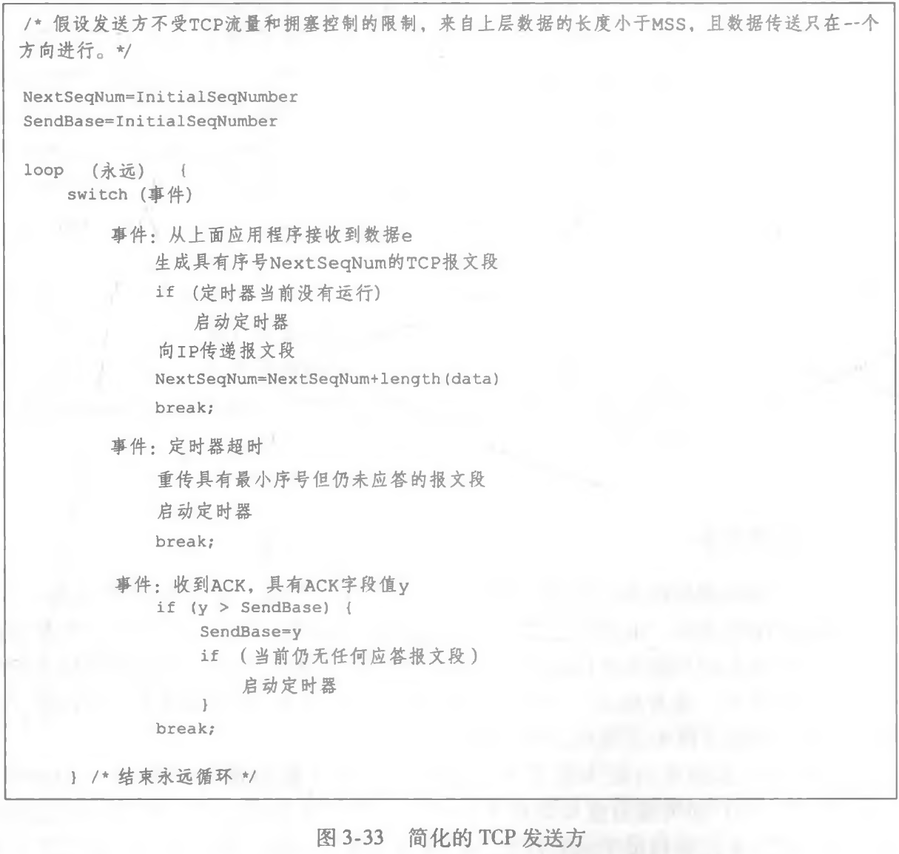

第二个主要事件是超时。TCP 通过重传引起超时的报文段来响应超时事件。然后 TCP 重启定时器。

TCP 发送方必须处理的第三个主要事件是，到达一个来自接收方的确认报文段（ACK）（更确切地说，是一个包含了有效 ACK 字段值的报文段）。当该事件发生时，TCP 将 ACK 的值 y 与它的变量 SendBase 进行比较。TCP 状态变量 SendBase 是最早未被确认的字节的序号。（因此 SendBase - 1 是指接收方已正确按序接收到的数据的最后一个字节的序号。）如前面指出的那样，TCP 采用累积确认，所以 y 确认了字节编号在 y 之前的所有字节都已经收到。如果 y > SendBase，则该 ACK 是在确认一个或多个先前未被确认的报文段。因此发送方更新它的 SendBase 变量；如果当前有未被确认的报文段，TCP 还要重新启动定时器。

1. **一些有趣的情况**

我们刚刚描述了一个关于 TCP 如何提供可靠数据传输的高度简化的版本。但即使这种高度简化的版本，仍然存在着许多微妙之处。为了较好地感受该协议的工作过程，我们来看几种简单情况。图 3-34 描述了第一种情况，主机 A 向主机 B 发送一个报文段。假设该报文段的序号是 92，而且包含 8 字节数据。在发岀该报文段之后，主机 A 等待一个来自主机 B 的确认号为 100 的报文段。虽然 A 发出的报文段在主机 B 上被收到，但从主机 B 发往主机 A 的确认报文丢失了。在这种情况下，超时事件就会发生，主机 A 会重传相同的报文段。当然，当主机 B 收到该重传的报文段时，它将通过序号发现该报文段包含了早已收到的数据。因此，主机 B 中的 TCP 将丢弃该重传的报文段中的这些字节。

在第二种情况中，如图 3-35 所示，主机 A 连续发回了两个报文段。第一个报文段序号是 92，包含 8 字节数据；第二个报文段序号是 100，包含 20 字节数据。假设两个报文段都完好无损地到达主机 B，并且主机 B 为每一个报文段分别发送一个确认。第一个确认报文的确认号是 100，第二个确认报文的确认号是 120。现在假设在超时之前这两个报文段中没有一个确认报文到达主机 A。当超时事件发生时，主机 A 重传序号 92 的第一个报文段，并重启定时器。只要第二个报文段的 ACK 在新的超时发生以前到达，则第二个报文段将不会被重传。

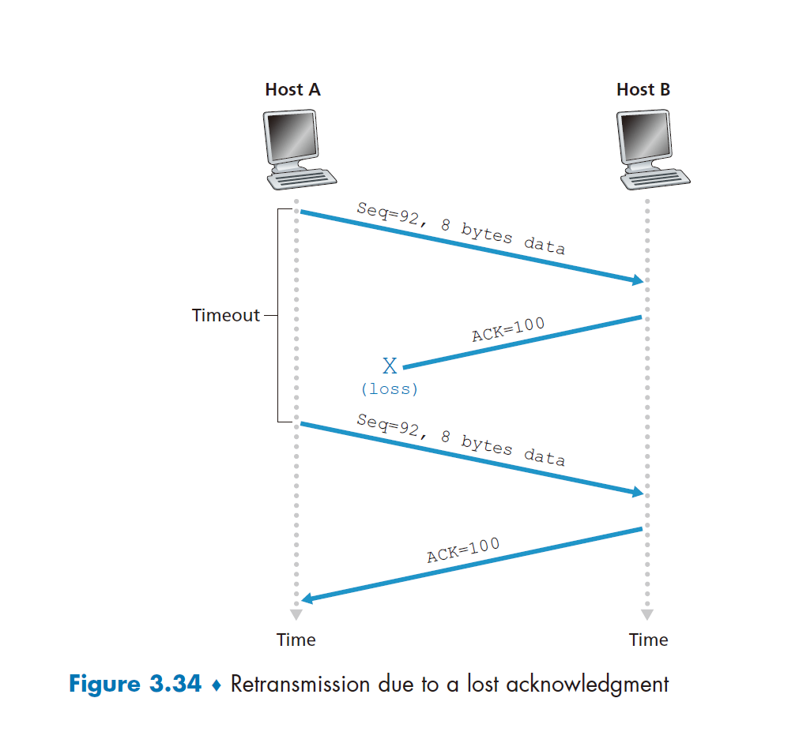

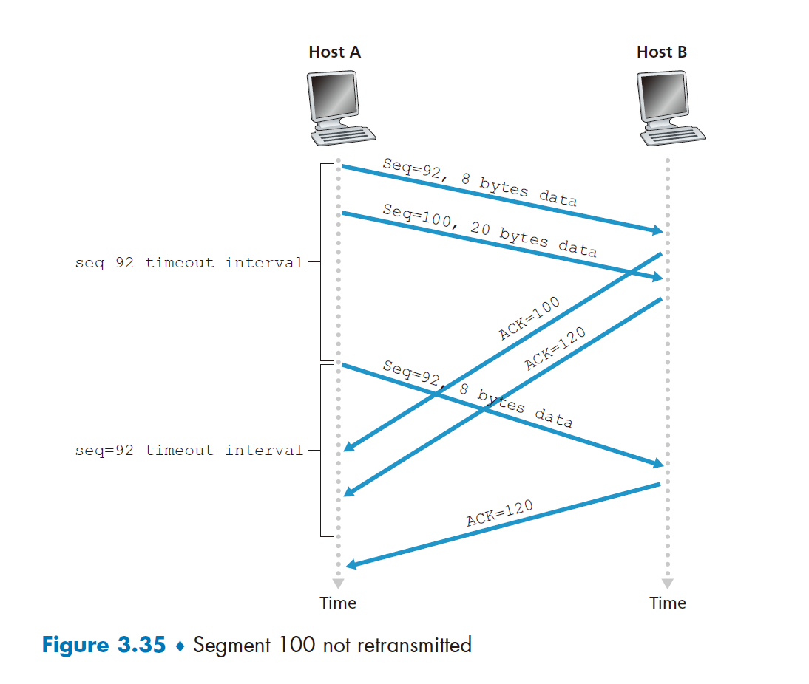

在第三种也是最后一种情况中，假设主机 A 与在第二种情况中完全一样，发送两个报文段。第一个报文段的确认报文在网络丢失，但在超时事件发生之前主机 A 收到一个确认号为 120 的确认报文。主机 A 因而知道主机 B 已经收到了序号为 119 及之前的所有字节;所以主机 A 不会重传这两个报文段中的任何一个。这种情况在图 3-36 中进行了图示。

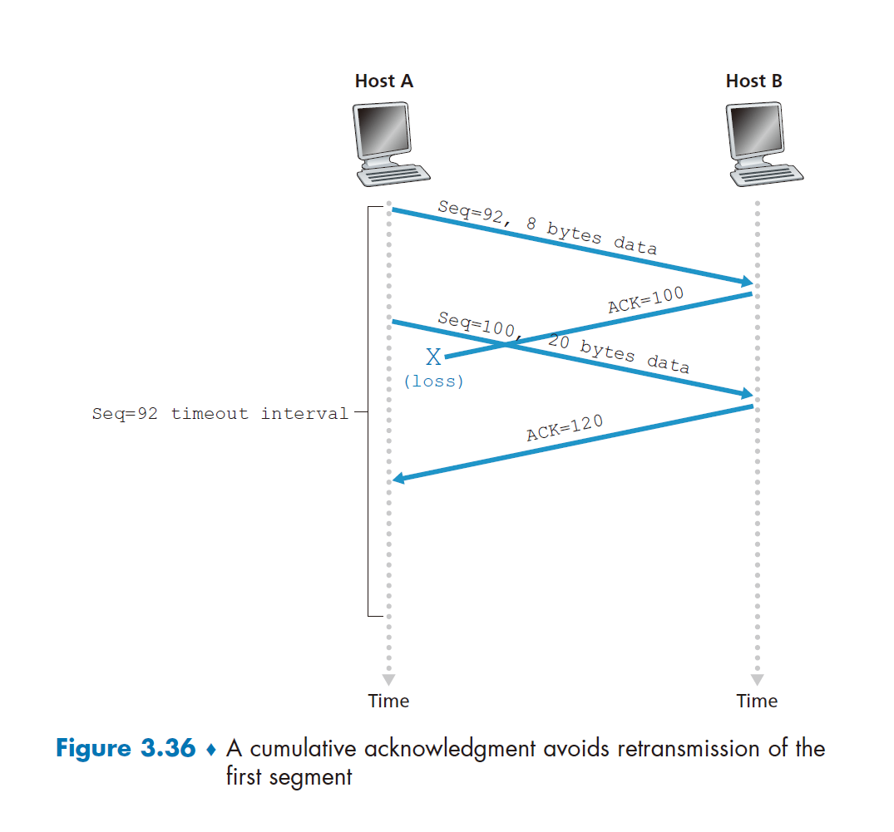

2. **超时间隔加倍**

我们现在讨论一下在大多数 TCP 实现中所做的一些修改。首先关注的是在定时器时限过期后超时间隔的长度。在这种修改中，每当超时事件发生时，如前所述，TCP 重传具有最小序号的还未被确认的报文段。只是每次 TCP 重传时都会将下一次的超时间隔设为先前值的两倍，而不是用从 EstimatedRTT 和 DevRTT 推算出的值（如在 3-5-3 节中所描述的）。例如，假设当定时器第一次过期时，与最早的未被确认的报文段相关联的 Timeoutinterval 是 0.75 秒。TCP 就会重传该报文段，并把新的过期时间设置为 1.5 秒。如果 1.5 秒后定时器又过期了，则 TCP 将再次重传该报文段，并把过期时间设置为 3.0 秒。因此，超时间隔在每次重传后会呈指数型增长。然而，每当定时器在另两个事件（即收到上层应用的数据和收到 ACK）中的任意一个启动时，Timeoutinterval 由最近的 EstimatedRTT 值与 DevRTT 值推算得到。

这种修改提供了一个形式受限的拥塞控制。（更复杂的 TCP 拥塞控制形式将在 3-7 节中学习。）定时器过期很可能是由网络拥塞引起的，即太多的分组到达源与目的地之间路径上的一台（或多台）路由器的队列中，造成分组丢失或长时间的排队时延。在拥塞的时候，如果源持续重传分组，会使拥塞更加严重。相反，TCP 使用更文雅的方式，每个发送方的重传都是经过越来越长的时间间隔后进行的。当我们在第 6 章学习 CSMA/CD 时，将看到以太网采用了类似的思路。

3. **快速重传**

超时触发重传存在的问题之一是超时周期可能相对较长。当一个报文段丢失时，这种长超时周期迫使发送方延迟重传丢失的分组，因而增加了端到端时延。幸运的是，发送方通常可在超时事件发生之前通过注意所谓冗余 ACK 来较好地检测到丢包情况。冗余 **ACK(duplicate ACK)** 就是再次确认某个报文段的 ACK，而发送方先前已经收到对该报文段的确认。要理解发送方对冗余 ACK 的响应，我们必须首先看一下接收方为什么会发送冗余 ACK。表 3-2 总结了 TCP 接收方的 ACK 生成策略[RFC 5681]。当 TCP 接收方收到一个具有这样序号的报文段时，即其序号大于下一个所期望的、按序的报文段，它检测到了数据流中的一个间隔，这就是说有报文段丢失。这个间隔可能是由于在网络中报文段丢失或重新排序造成的。因为 TCP 不使用否定确认，所以接收方不能向发送方发回一个显式的否定确认。相反，它只是对已经接收到的最后一个按序字节数据进行重复确认（即产生一个冗余 ACK）即可。（注意到在下表中允许接收方不丢弃失序报文段。）


因为发送方经常一个接一个地发送大量的报文段，如果一个报文段丢失，就很可能引起许多一个接一个的冗余 ACK。如果 TCP 发送方接收到对相同数据的 3 个冗余 ACK，它把这当作一种指示，说明跟在这个已被确认过 3 次的报文段之后的报文段已经丢失。（在课后习题中，我们将考虑为什么发送方等待 3 个冗余 ACK，而不是仅仅等待一个冗余 ACK。）一旦收到 3 个冗余 ACK，TCP 就执行 **快速重传(fast retransmit)** [RFC 5681],即在该报文段的定时器过期之前重传丢失的报文段。对于采用快速重传的 TCP，可用下列代码片段代替图 3-33 中的 ACK 收到事件：

```cpp
事件：收到ACK，具有 ACK 字段值 y
if(y > SendBase) {
  SendBase = y
  if(当前仍无任何应答报文){
    启动定时器
  }
  else{
    /* 对确认的报文段的一个冗余ACK */
    对 y 收到的冗余 ACK 数加 1
    if(对 y == 3 收到的冗余 ACK 数){
      /* TCP 快速重传 */
      重新发送具有序号 y 的报文段
    }
  }
}
```

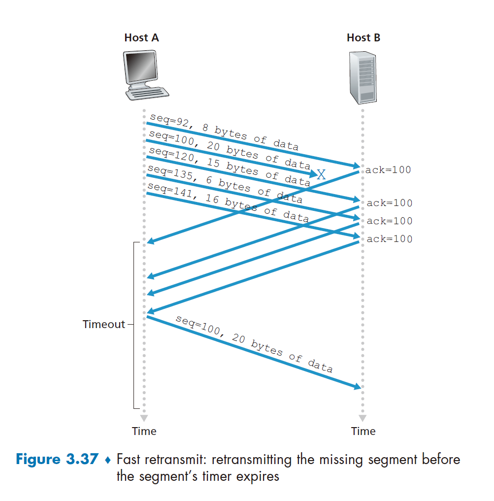

前面讲过，当在如 TCP 这样一个实际协议中实现超时/重传机制时，会产生许多微妙的问题。上面的过程是在超过 20 年的 TCP 定时器使用经验的基础上演化而来的，读者应当理解实际情况确实是这样的。

4. **是回退 N 步还是选择重传**

考虑下面这个问题来结束有关 TCP 差错恢复机制的学习：TCP 是一个 GBN 协议还是一个 SR 协议？前面讲过，TCP 确认是累积式的，正确接收但失序的报文段是不会被接收方逐个确认的。因此，如图 3-33 所示（也可参见图 3-19），TCP 发送方仅需维持已发送过但未被确认的字节的最小序号（SendBase ）和下一个要发送的字节的序号（NextSeqNum）。在这种意义下，TCP 看起来更像一个 GBN 风格的协议。但是 TCP 和 GBN 协议之间有着一些显著的区别。许多 TCP 实现会将正确接收但失序的报文段缓存起来[Stevens 1994]。另外考虑一下，当发送方发送的一组报文段 1, 2, …, N，并且所有的报文段都按序无差错地到达接收方时会发生的情况。进一步假设对分组 n < N 的确认报文丢失，但是其余 N-1 个确认报文在分别超时以前到达发送端，这时又会发生的情况。在该例中，GBN 不仅会重传分组 n，还会重传所有后继的分组 n+1, n+2, …, N。 在另一方面，TCP 将重传至多一个报文段，即报文段 n。此外，如果对报文段 N+1 的确认报文在报文段 n 超时之前到达， TCP 甚至不会重传报文段 n。

对 TCP 提岀的一种修改意见是所谓的 **选择确认(selective acknowledgment)** [RFC 2018]，它允许 TCP 接收方有选择地确认失序报文段，而不是累积地确认最后一个正确接收的有序报文段。当将该机制与选择重传机制结合起来使用时(即跳过重传那些已被接收方选择性地确认过的报文段)，TCP 看起来就很像我们通常的 SR 协议。因此，TCP 的差错恢复机制也许最好被分类为 GBN 协议与 SR 协议的混合体。

### 3.5.5. 流量控制

**time : 2021-06-08**

前面讲过，一条 TCP 连接的每一侧主机都为该连接设置了接收缓存。当该 TCP 连接收到正确、按序的字节后，它就将数据放入接收缓存。相关联的应用进程会从该缓存中读取数据，但不必是数据刚一到达就立即读取。事实上，接收方应用也许正忙于其他任务，甚至要过很长时间后才去读取该数据。如果某应用程序读取数据时相对缓慢，而发送方发送得太多、太快，发送的数据就会很容易地使该连接的接收缓存溢出。

TCP 为它的应用程序提供了 **流量控制服务(flow control service)** 以消除发送方使接收方缓存溢岀的可能性。流量控制因此是一个速度匹配服务，即发送方的发送速率与接收方应用程序的读取速率相匹配。前面提到过，TCP 发送方也可能因为 IP 网络的拥塞而被遏制；这种形式的发送方的控制被称为 **拥塞控制(congestion control)**，我们将在 3-6 节和 3-7 节详细地讨论这个主题。即使流量控制和拥塞控制采取的动作非常相似(对发送方的遏制)。但是它们显然是针对完全不同的原因而采取的措施。不幸的是，许多作者把这两个术语混用，理解力强的读者会明智地区分这两种情况。现在我们来讨论 TCP 如何提供流量控制服务的。为了能从整体上看问题，我们在本节都假设 TCP 是这样实现的，即 TCP 接收方丢弃失序的报文段。

TCP 通过让发送方维护一个称为 **接收窗口(receive window)** 的变量来提供流量控制。通俗地说，接收窗口用于给发送方一个指示：该接收方还有多少可用的缓存空间。因为 TCP 是全双工通信，在连接两端的发送方都各自维护一个接收窗口。我们在文件传输的情况下研究接收窗口。假设主机 A 通过一条 TCP 连接向主机 B 发送一个大文件。主机 B 为该连接分配了一个接收缓存，并用 RcvBuffer 来表示其大小。主机 B 上的应用进程不时地从该缓存中读取数据。我们定义以下变量:

- LastByteRead：主机 B 上的应用进程从缓存读出的数据流的最后一个字节的编号。
- LastByteRcvd：从网络中到达的并且已放入主机 B 接收缓存中的数据流的最后一个字节的编号。

由于 TCP 不允许已分配的缓存溢岀，下式必须成立:

$$LastByteRcvd - LastByteRead <= RcvBuffer$$

接收窗口用 rwnd 表示，根据缓存可用空间的数量来设置:

$$rwnd = RcvBuffer - (LastByteRcvd - LastByteRead)$$

由于该空间是随着时间变化的，所以 rwnd 是动态的。图 3-38 对变量 rwnd 进行了图示。


连接是如何使用变量 rwnd 来提供流量控制服务的呢？主机 B 通过把当前的 rwnd 值放入它发给主机 A 的报文段接收窗口字段中，通知主机 A 它在该连接的缓存中还有多少可用空间。开始时，主机 B 设定 rwnd = RcvBuffer。注意到为了实现这一点，主机 B 必须跟踪几个与连接有关的变量。

主机 A 轮流跟踪两个变量，LastByteSent 和 LastByteAcked，这两个变量的意义很明显。 注意到这两个变量之间的差 LastByteSent - LastByteAcked，就是主机 A 发送到连接中但未被确认的数据量。通过将未确认的数据量控制在值 rwnd 以内，就可以保证主机 A 不会使主机 B 的接收缓存溢出。因此，主机 A 在该连接的整个生命周期须保证:

$$LastByteSent - LastByteAcked <= rwnd$$

对于这个方案还存在一个小小的技术问题。为了理解这一点，假设主机 B 的接收缓存已经存满，使得 rwnd = 0。 在将 rwnd = 0 通告给主机 A 之后，还要假设主机 B 没有任何数据要发给主机 A。此时，考虑会发生什么情况。因为主机 B 上的应用进程将缓存清空，TCP 并不向主机 A 发送带有 rwnd 新值的新报文段；事实上，TCP 仅当在它有数据或有确认要发时才会发送报文段给主机 A。这样，主机 A 不可能知道主机 B 的接收缓存已经有新的空间了，即主机 A 被阻塞而不能再发送数据！为了解决这个问题，TCP 规范中要求：当主机 B 的接收窗口为 0 时，主机 A 继续发送只有一个字节数据的报文段。这些报文段将会被接收方确认。最终缓存将开始清空，并且确认报文里将包含一个非 0 的 rwnd 值。

本书的配套站点提供了一个[动画](https://media.pearsoncmg.com/ph/esm/ecs_kurose_compnetwork_8/cw/content/interactiveanimations/flow-control/index.html)，用以说明 TCP 接收窗口的运行情况。

描述了 TCP 的流量控制服务以后，我们在此要简要地提一下 UDP 并不提供流量控制，报文段由于缓存溢出可能在接收方丢失。例如，考虑一下从主机 A 上的一个进程向主机 B 上的一个进程发送一系列 UDP 报文段的情形。对于一个典型的 UDP 实现，UDP 将在一个有限大小的缓存中加上报文段，该缓存在相应套接字（进程的门户）“之前”。进程每次 从缓存中读取一个完整的报文段。如果进程从缓存中读取报文段的速度不够快，那么缓存将会溢出，并且将丢失报文段。

### 3.5.6. TCP 连接管理

在本小节中，我们更为仔细地观察如何建立和拆除一条 TCP 连接。尽管这个主题并不特别令人兴奋，但是它很重要，因为 TCP 连接的建立会显著地增加人们感受到的时延 （如在 Web 上冲浪时）。此外，许多常见的网络攻击（包括极为流行的 SYN 洪泛攻击）利用了 TCP 连接管理中的弱点。现在我们观察一下一条 TCP 连接是如何建立的。假设运行在一台主机（客户）上的一个进程想与另一台主机（服务器）上的一个进程建立一条连接。客户应用进程首先通知客户 TCP,它想建立一个与服务器上某个进程之间的连接。客户中的 TCP 会用以下方式与服务器中的 TCP 建立一条 TCP 连接:

- 第一步：：客户端的 TCP 首先向服务器端的 TCP 发送一个特殊的 TCP 报文段。该报文段中不包含应用层数据。但是在报文段的首部（参见图 3-29）中的一个标志位（即 SYN 比特）被置为 1。因此，这个特殊报文段被称为 SYN 报文段。另外，客户会随机地选择一个初始序号（client_isn），并将此编号放置于该起始的 TCP SYN 报文段的序号字段中。该报文段会被封装在一个 IP 数据报中，并发送给服务器。为了避免某些安全性攻击，在适当地随机化选择 client_isn 方面有着不少有趣的研究［CERT 2001-09］。
- 第二步：一旦包含 TCP SYN 报文段的 IP 数据报到达服务器主机（假定它的确到达!），服务器会从该数据报中提取出 TCP SYN 报文段，为该 TCP 连接分配 TCP 缓存和变量，并向该客户 TCP 发送允许连接的报文段。（我们将在第 8 章看到，在完成三次握手的第三步之前分配这些缓存和变量，使得 TCP 易于受到称为 SYN 洪泛的拒绝服务攻击。）这个允许连接的报文段也不包含应用层数据。但是，在报文段的首部却包含 3 个重要的信息。首先，SYN 比特被置为 1。其次，该 TCP 报文段首部的确认号字段被置为 client_isn + 1。 最后，服务器选择自己的初始序号 （serverjsn），并将其放置到 TCP 报文段首部的序号字段中。这个允许连接的报文段实际上表明了：“我收到了你发起建立连接的 SYN 分组，该分组带有初始序号 client_isn。 我同意建立该连接。我自己的初始序号是 server_isn。该允许连接的报文段被称为 **SYNACK 报文段(SYNACK segment)**。
- 第三步：在收到 SYNACK 报文段后，客户也要给该连接分配缓存和变量。客户主机则向服务器发送另外一个报文段；这最后一个报文段对服务器的允许连接的报文段进行了确认（该客户通过将值 server_isn + 1 放置到 TCP 报文段首部的确认字段中来完成此项工作）。因为连接已经建立了，所以该 SYN 比特被置为 0。该三次握手的第三个阶段可以在报文段负载中携带客户到服务器的数据。

一旦完成这 3 个步骤，客户和服务器主机就可以相互发送包括数据的报文段了。在以后每一个报文段中，SYN 比特都将被置为 0。注意到为了创建该连接，在两台主机之间发送了 3 个分组，如图 3-39 所示。由于这个原因，这种连接创建过程通常被称为 **3 次握手(three-way handshake)**。TCP 3 次握手的几个方面将在课后习题中讨论（为什么需要初始序号？为什么需要 3 次握手，而不是两次握手？）。

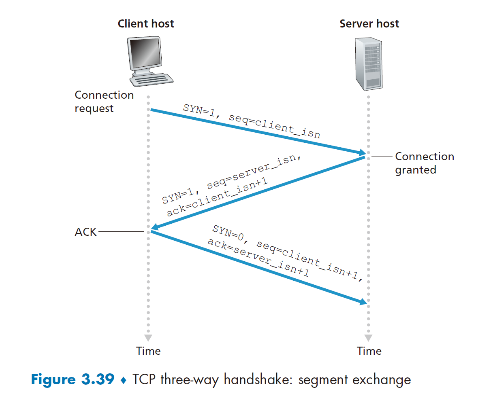

**time : 2021-06-09**

天下没有不散的宴席，TCP 连接也是如此。参与一条 TCP 连接的两个进程中的任何一个都能终止改连接。当连接结束后，主机中的缓存和变量将被释放。举个例子。假设某客户将要关闭连接，如图 3-40 所示，客户进程发出一个连接关闭命令。这会引起客户 TCP 向服务器进程发送一个特殊的 TCP 报文段。这个 TCP 报文段的标志位 FIN 被设置为 1 。当服务器接收到该报文段后，就向客户会送一个确认报文段。然后，服务器发送他自己的终止报文段，其 FIN 标志位被设置为 1。最后，该客户对这个服务器的终止报文段进行了确认。此时，在两台主机上用于该连接的所有资源都被释放了。

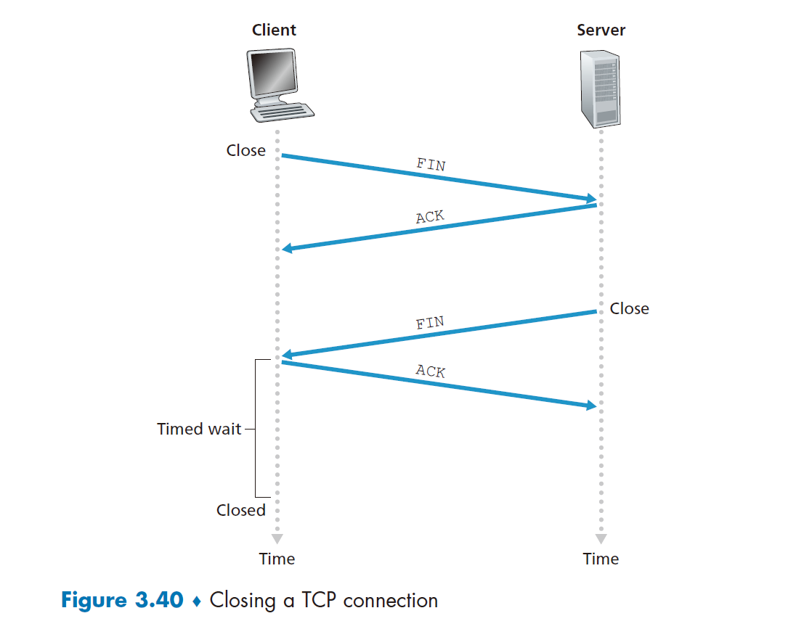

在一个 TCP 连接的生命周期内，运行在每台主机中的 TCP 协议在各种 **TCP 状态(TCP state)** 之间变迁。图 3-41 说明了客户 TCP 会经历的一系列典型 TCP 状态。客户 TCP 开始时处于 CLOSED(关闭)状态。客户的应用程序发起一个新的 TCP 连接（可通过在第 2 章讲过的 Python 例子中创建一个 Socket 对象来完成）。这引起客户中的 TCP 向服务器中的 TCP 发送一个 SYN 报文段。在发送过 SYN 报文段后，客户 TCP 进入了 SYN_SENT 状态。当客户 TCP 处在 SYN_SENT 状态时，它等待来自服务器 TCP 的对客户所发报文段进行确认且 SYN 比特被置为 1 的一个报文段。收到这样一个报文段之后，客户 TCP 进入 ESTABLISHED(已建立)状态。当处在 ESTABLISHED 状态时，TCP 客户就能发送和接收包含有效载荷数据（即应用层产生的数据）的 TCP 报文段了。

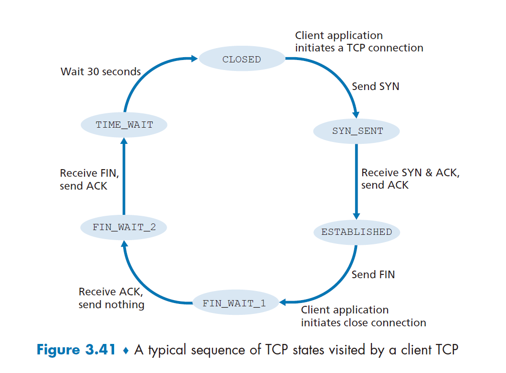

假设客户应用程序决定要关闭该连接。（注意到服务器也能选择关闭该连接。）这引起客户 TCP 发送一个带有 FIN 比特被置为 1 的 TCP 报文段，并进入 FIN_WAIT_1 状态。当处在 FIN_WAIT_1 状态时，客户 TCP 等待一个来自服务器的带有确认的 TCP 报文段。当它收到该报文段时，客户 TCP 进入 FIN_WAIT_2 状态。当处在 FIN_WAIT_2 状态时，客户等待来自服务器的 FIN 比特被置为 1 的另一个报文段；当收到该报文段后，客户 TCP 对服务器的报文段进行确认，并进入 TIME_WAIT 状态。假定 ACK 丢失，TIME_WAIT 状态使 TCP 客户重传最后的确认报文。在 TIME_WAIT 状态中所消耗的时间是与具体实现有关的，而典型的值是 30 秒、1 分钟或 2 分钟。经过等待后，连接就正式关闭，客户端所有资源（包括端口号）将被释放。

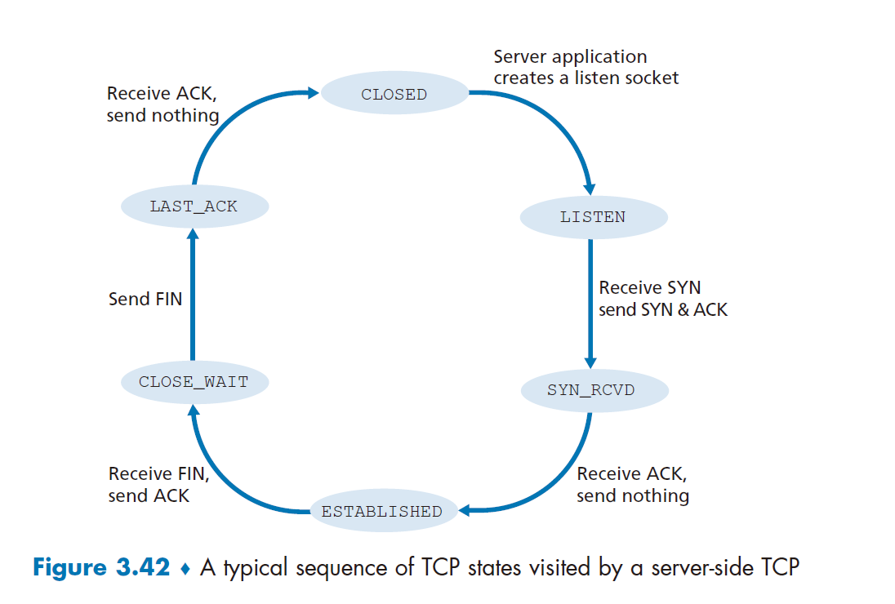

图 3-42 图示了服务器端的 TCP 通常要经历的一系列状态，其中假设客户开始连接拆除。这些状态变迁是自解释的。在这两个状态变迁图中，我们只给出了 TCP 连接是如何正常地被建立和拆除的。我们没有描述在某些不正常的情况下（例如当连接的双方同时都要 发起或终止一条连接时）发生的事情。如果你对此问题及其他与 TCP 有关的高级问题感兴趣，推荐阅读 Stevens 的内容更全面的书籍［Stevens 1994］。

我们上面的讨论假定了客户和服务器都准备通信，即服务器正在监听客户发送其 SYN 报文段的端口。我们来考虑当一台主机接收到一个 TCP 报文段，其端口号或源 IP 地址与该主机上进行中的套接字都不匹配的情况。例如，假如一台主机接收了具有目的端口 80 的一个 TCP SYN 分组，但该主机在端口 80 不接受连接（即它不在端口 80 上运行 Web 服务器）。则该主机将向源发送一个特殊重置报文段。该 TCP 报文段将 RST 标志位（参见 3-5-2 节）置为 1。因此，当主机发送一个重置报文段时，它告诉该源“我没有那个报文段的套接字。请不要再发送该报文段了”。当一台主机接收一个 UDP 分组，它的目的端口 与进行中的 UDP 套接字不匹配，该主机发送一个特殊的 ICMP 数据报，这将在第 4 章中讨论。

既然我们已经对 TCP 连接管理有了深入的了解，我们再次回顾 nrnap 端口扫描工具，并更为详细地研究它的工作原理。为了探索目标主机上的一个特定的 TCP 端口，如端口 6789, rnnap 将对那台主机的目的端口 6789 发送一个特殊的 TCP SYN 报文段。有 3 种可能的输出：

- 源主机从目标主机接收到一个 TCP SYNACK 报文段。因为这意味着在目标主机上一个应用程序使用 TCP 端口 6789 运行，nmap 返回“打开”。
- 源主机从目标主机接收到一个 TCP RST 报文段。这意味着该 SYN 报文段到达了目标主机，但目标主机没有运行一个使用 TCP 端口 6789 的应用程序。但攻击者至少 知道发向该主机端口 6789 的报文段没有被源和目标主机之间的任何防火墙所阻挡。（将在第 8 章中讨论防火墙。）
- 源什么也没有收到。这很可能表明该 SYN 报文段被中间的防火墙所阻挡，无法到达目标主机。

nmap 是一个功能强大的工具，该工具不仅能“侦察”打开的 TCP 端口，也能“侦察”打开的 UDP 端口，还能“侦察”防火墙及其配置，甚至能“侦察”应用程序的版本和操作系统。其中的大多数都能通过操作 TCP 连接管理报文段完成［Skoudis 2006］。读者 能够从 www.nmap.org 下载 nmap。

到此，我们介绍完了 TCP 中的差错控制和流量控制。在 3-7 节中，我们将回到 TCP 并深入地研究 TCP 拥塞控制问题。然而，在此之前，我们先后退一步，在更广泛环境中讨论拥塞控制问题。

## 3.6. 拥塞控制原理

在前面几节中，我们已经分析了面临分组丢失时用于提供可靠数据传输服务的基本原理及特定的 TCP 机制。我们以前讲过，在实践中，这种丢包一般是当网络变得拥塞时由于路由器缓存溢岀引起的。分组重传因此作为网络拥塞的征兆（某个特定的运输层报文段的丢失）来对待，但是却无法处理导致网络拥塞的原因，因为有太多的源想以过高的速率发送数据。为了处理网络拥塞原因，需要一些机制以在面临网络拥塞时遏制发送方。

在本节中，我们考虑一般情况下的拥塞控制问题，试图理解为什么网络拥塞是一件坏事情，网络拥塞是如何在上层应用得到的服务性能中明确地显露出来的？如何可用各种方 法来避免网络拥塞或对它做出反应？这种对拥塞控制的更一般研究是恰当的，因为就像可靠数据传输一样，它在组网技术中的前 10 个基础性重要问题清单中位居前列。下面一节详细研究 TCP 的拥塞控制算法。

### 3.6.1. 拥塞原因与代价

我们通过分析 3 个复杂性越来越高的发生拥塞的情况，开始对拥塞控制的一般性研究。在每种情况下，我们首先将看看出现拥塞的原因以及拥塞的代价（根据资源未被充分利用以及端系统得到的低劣服务性能来评价）。我们暂不关注如何对拥塞做出反应或避免拥塞，而是重点理解一个较为简单的问题，即随着主机增加其发送速率并使网络变得拥这时会发生的情况。

1. **情况 1：2 个发送方和一台具有无穷大缓存的路由器**

我们先考虑也许是最简单的拥塞情况：两台主机（A 和 B）都有一条连接，且这两条连接共享源与目的地之间的单跳路由，如图 3-43 所示。

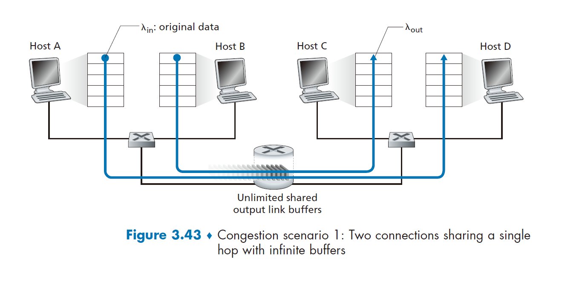

我们假设主机 A 中的应用进程以 $\lambda _{in}$ B/s 的平均速率发送一个报文到连接中。下面的运输层协议先不考虑差错回复，流量控制和拥塞控制。忽略首部字节占用的空间，那么主机 A 到路由器的流量速率为 $\lambda _{in}$ B/s。主机 B 和主机 A 时一样的，为了简化问题，我们假设主机 B 的发送速率也是 $\lambda _{in}$ B/s。来自主机 A 和 B 的分组通过一台路由器，到达一个传输速率为 R 的共享的链路上传输。该路由器带有输出缓存，当流量强度大于 1 时，进入输出缓存。我们假设该路由器的输出缓存为无穷大。

图 3-44 说明了第一种情况下主机 A 的连接性能。图的左边表示 **每一个连接的吞吐量(per-connection throughput)**（回忆我们在第 1-5-4 节讨论的内容，这里的吞吐量表示接收方接收到字节的速率）与该连接发送速率的函数图像。当发送速率在 0 和 R/2 之间时，接收方的吞吐量等于发送方的发送速率，即发送方发送的所有数据经有限时延后到达接收方。然而当发送速率超过 R/2 时，它的吞吐量只能达 R/2。这个吞吐量上限是由两条连接之间共享链路容量造成的。链路完全不能以超过 R/2 的稳定状态速率向接收方交付分组。无论主机 A 和主机 B 将其发送速率设置为多高，它们都不会看到超过 R/2 的吞吐量。

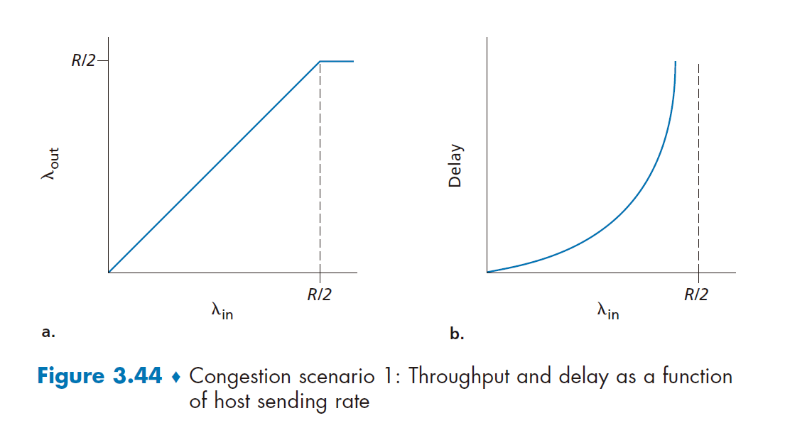

取得每连接 R/2 的吞吐量实际上看起来可能是件好事，因为在将分组交付到目的地的过程中链路被充分利用了。但是，图 3-44b 的图形却显示了以接近链路容量的速率运行时产生的后果。当发送速率接近 R/2 时（从左至右），平均时延就会越来越大。当发送速率超过 R/2 时，路由器中的平均排队分组数就会无限增长，源与目的地之间的平均时延也会变成无穷大（假设这些连接以此发送速率运行无限长时间并且有无限量的缓存可用）。因此，虽然从吞吐量角度看，运行在总吞吐量接近 R 的状态也许是一个理想状态，但从时延角度看，却远不是一个理想状态。甚至在这种（极端）理想化的情况中，我们已经发现了拥塞网络的一种代价，即当分组的到达速率接近链路容量时，分组经历巨大的排队时延。（这和我们在第 1-5-3 节讨论的当流量强度接近 1 时的情况时相同的）

2. **情况 2：两个发送方和一台具有有限缓存的路由器**

现在我们从下列两个方面对情况 1 稍微做一些修改（参见图 3-45 ）。首先，假定路由器缓存的容量是有限的。这种现实世界的假设的结果是，当分组到达一个已满的缓存时会被丢弃。其次，我们假定每条连接都是可靠的。如果一个包含有运输层报文段的分组在路由器中被丢弃，那么它终将被发送方重传。由于分组可以被重传，所以我们现在必须更小心地使用发送速率这个术语。特別是我们再次以 $\lambda _{in}$ 字节/秒表示应用程序将初始数据发送到套接字中的速率。运输层向网络中发送报文段（含有初始数据或重传数据）的速率用 $\lambda' _{in}$ 字节/秒表示。$\lambda' _{in}$ 有时被称为网络的 **供给载荷(offered load)**。

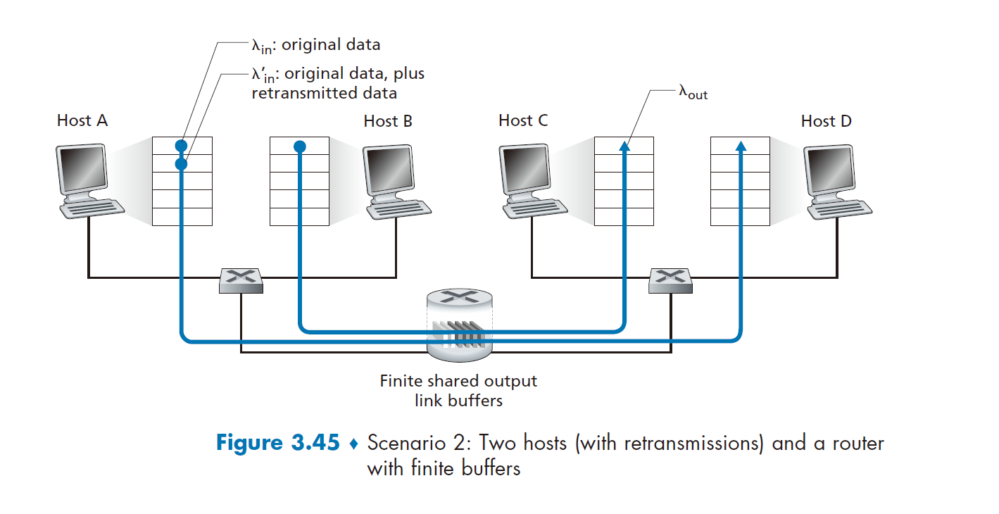

在情况 2 下实现的性能强烈地依赖于重传的方式。首先，考虑一种不真实的情况，即主机 A 能够以某种方式（不可思议地！）确定路由器中的缓存是否空闲，因而仅当缓存空闲时才发送一个分组。在这种情况下，将不会产生丢包，$\lambda _{in}$ 与 $\lambda' _{in}$ 相等，并且连接的吞吐量就等于 $\lambda _{in}$。图 3-46a 中描述了这种情况。从吞吐量的角度看，性能是理想的，即发送的每个分组都被接收到。注意到在这种情况下，平均主机发送速率不能超过 R/2，因为假定不会发生分组丢失。

接下来考虑一种更为真实的情况，发送方仅当在确定了一个分组已经丢失时才重传。（同样，所做的假设有一些弹性。然而，发送主机有可能将超时时间设置得足够长，以无形中使其确信一个还没有被确认的分组已经丢失。）在这种情况下，性能就可能与图 3-46b 所示的情况相似。为了理解这时发生的情况，考虑一下供给载荷入 $\lambda' _{in}$（初始数据传输加上重传的总速率）等于 R/2 的情况。根据图 3-46b，在这一供给载荷值时，数据被交付给接收方应用程序的速率是 R/3。因此，在所发送的 0.5R 单位数据当中，从平均的角度说，0.333 R 字节/秒是初始数据，而 0.166 R 字节/秒是重传数据。我们在此看到了另一种网络拥塞的代价，即发送方必须执行重传以补偿因为缓存溢出而丢弃（丢失）的分组。

最后，我们考虑下面一种情况：发送方也许会提前发生超时并重传在队列中已被推迟但还未丢失的分组。在这种情况下，初始数据分组和重传分组都可能到达接收方。当然, 接收方只需要一份这样的分组副本就行了，重传分组将被丢弃。在这种情况下，路由器转 发重传的初始分组副本是在做无用功，因为接收方已收到了该分组的初始版本。而路由器 本可以利用链路的传输能力去发送另一个分组。这里，我们又看到了网络拥塞的另一种代价，即发送方在遇到大时延时所进行的不必要重传会引起路由器利用其链路带宽来转发不必要的分组副本。图 3-46c 显示了当假定每个分组被路由器转发（平均）两次时，吞吐量与供给载荷的对比情况。由于每个分组被转发两次，当其供给载荷接近 R/2 时，其吞吐量将渐近 R/4。

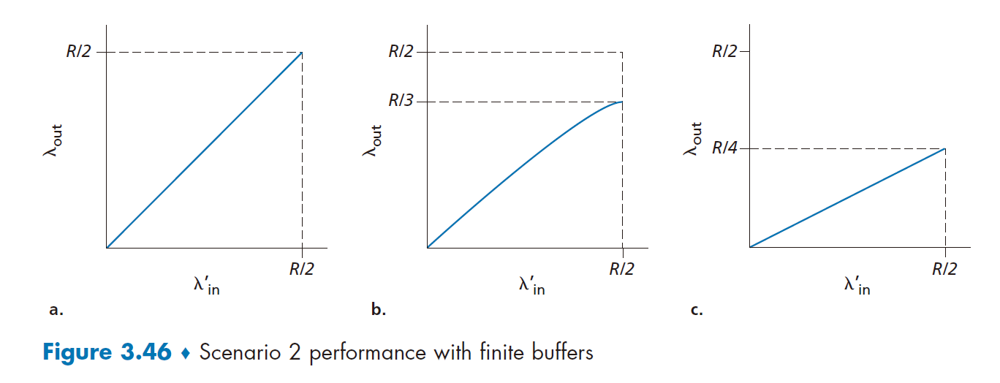

1. **情况 3：4 个发送方和具有有限缓存的多台路由器及多跳路径**

在最后一种拥塞情况中，有 4 台主机发送分组，每台都通过交叠的两跳路径传输，如图 3-47 所示。我们再次假设每台主机都采用超时/重传机制来实现可靠数据传输服务，所有的主机都有相同的 $\lambda _{in}$值，所有路由器的链路容量都是 R 字节/秒。

我们考虑从主机 A 到主机 C 的连接，该连接经过路由器 R1 和 R2。A-C 连接与 D-B 连接共享路由器 R1，并与 B-D 连接共享路由器 R2。对极小的 $\lambda _{in}$值，路由器缓存的溢出是很少见的（与拥塞情况 1、拥塞情况 2 中的一样），吞吐量大致接近供给载荷。对稍大的 $\lambda _{in}$值，对应的吞吐量也更大，因为有更多的初始数据被发送到网络中并交付到目的地，溢出仍然很少。因此，对于较小的 $\lambda _{in}$，$\lambda _{in}$的增大会导致入。F(out)的增大。

在考虑了流量很小的情况后，下面分析当入 m （因此入 G 很大时的情况。考虑路由器 R2。不管 $\lambda _{in}$ 的值是多大，到达路由器 R2 的 A-C 流量（在经过路由器 R1 转发后到达路 由器 R2）的到达速率至多是 R，也就是从 R1 到 R2 的链路容量。如果鳩对于所有连接 （包括 B-D 连接）来说是极大的值，那么在 R2 上，B-D 流量的到达速率可能会比 A-C 流量的到达速率大得多。因为 A-C 流量与 B-D 流量在路由器 R2 上必须为有限缓存空间而竞争，所以当来自 B-D 连接的供给载荷越来越大时，A-C 连接上成功通过 R2 （即由于缓存 溢出而未被丢失）的流量会越来越小。在极限情况下，当供给载荷趋近于无穷大时，R2 的空闲缓存会立即被 B-D 连接的分组占满，因而 A-C 连接在 R2 上的吞吐量趋近于 0。这又一次说明在重载的极限情况下，A-C 端到端呑吐量将趋近于 0。这些考虑引发了供给载荷与吞吐量之间的权衡，如图 3-48 所示。

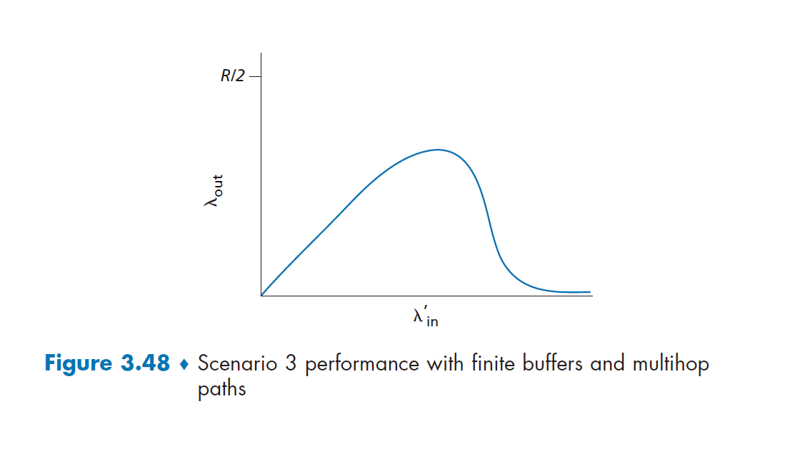

当考虑由网络所做的浪费掉的工作量时, 随着供给载荷的增加而使吞吐量最终减少的原因是明显的。在上面提到的大流量的情况中，每当有一个分组在第二跳路由器上被丢弃时，第一跳路由器所做的将分组转发到第二跳路由器的工作就是“劳而无功”的。如果第一跳路由器只是丢弃该分组并保持空 闲，则网络中的情况是幸运的（更准确地说是糟糕的）。需要指岀的是，第一跳路由 器所使用的将分组转发到第二跳路由器的传输容量用来传送不同的分组可能更有效益。（例如，当选择一个分组发送时，路由器最好优先考虑那些已经历过一定数量的上游路由器的分组。）所以，我们在此又看到了由于拥塞而丢弃分组的另一种代价，即当一个分组沿一条路径被丢弃时，每个上游路由器用于转发该分组到丢弃该分组而使用的传输容量最终被浪费掉了。

### 3.6.2. 拥塞控制方法

在 3-7 节中，我们将详细研究 TCP 用于拥塞控制的特定方法。这里，我们指出在实践中所采用的两种主要拥塞控制方法，讨论特定的网络体系结构和具体使用这些方法的拥塞控制协议。

在最为宽泛的级别上，我们可根据网络层是否为运输层拥塞控制提供了显式帮助，来区分拥塞控制方法。

- **端到端拥塞控制**

在端到端拥塞控制方法中，网络层没有为运输层拥塞控制提供显式支持。即使网络中存在拥塞，端系统也必须通过对网络行为的观察（如分组丢失与时延）来推断之。我们将在 3-7-1 节中将看到，TCP 采用端到端的方法解 决拥塞控制，因为 IP 层不会向端系统提供有关网络拥塞的反馈信息。TCP 报文段的丢失（通过超时或 3 次冗余确认而得知）被认为是网络拥塞的一个迹象，TCP 会相应地减小其窗口长度。我们还将看到关于 TCP 拥塞控制的一些最新建议，即使用增加的往返时延值作为网络拥塞程度增加的指示。

- **网络辅助的拥塞控制**

在网络辅助的拥塞控制中，路由器向发送方提供关于网络中拥塞状态的显式反馈信息。这种反馈可以简单地用一个比特来指示链路中的拥塞情况。该方法在早期的 IBM SNA [ Schwartz 1982]、DEC DECnet [Jain 1989；Ramakrishnan 1990］和 ATM ［ Black 1995］等体系结构中被采用。更复杂的网络反馈也是可能的。例如，在 ATM 可用比特率（Available Bite Rate, ABR）拥塞控制中，路由器显式地通知发送方它（路由器）能在输出链路上支持的最大主机发送速率。如上面所提到的，默认因特网版本的 IP 和 TCP 采用端到端拥塞控制方法。然而，我们在 3-7-2 节中将看到，最近 IP 和 TCP 也能够选择性地实现网络辅助拥塞控制。

对于网络辅助的拥塞控制，拥塞信息从网络反馈到发送方通常有两种方式，如图 3-49 所示。直接反馈信息可以由网络路由器发给发送方。这种方式的通知通常采用了一种阻塞分组(choke packet)的形式（主要是说：“我拥塞了！”）。更为通用的第二种形式的通知是，路由器标记或更新从发送方流向接收方的分组中的某个字段来指示拥塞的产生。一旦收到一个标记的分组后，接收方就会向发送方通知该网络拥塞指示。注意到后一种形式的通知至少要经过一个完整的往返时间。

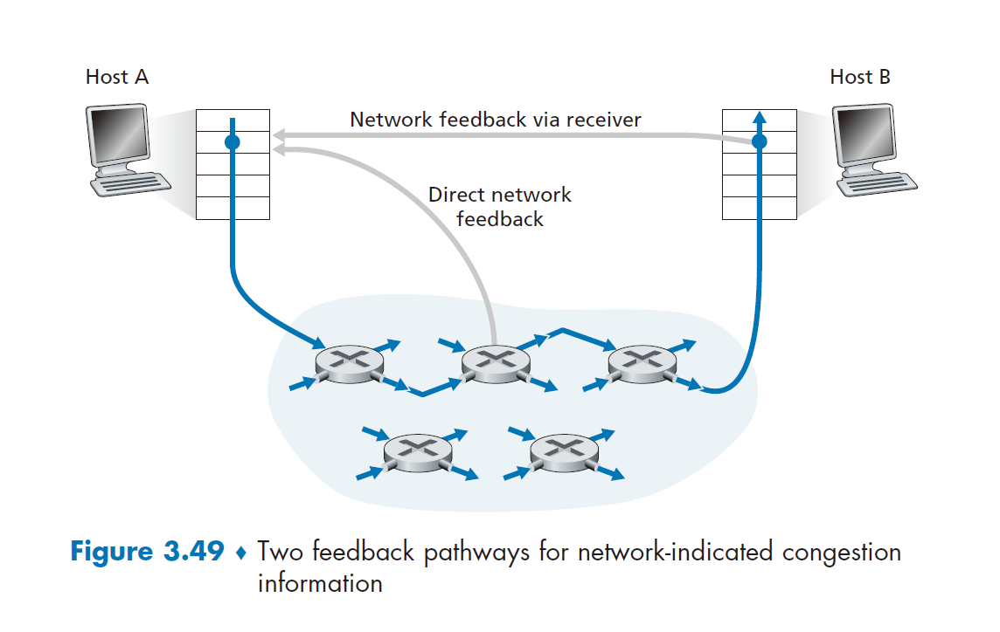

## 3.7. TCP 拥塞控制

**time : 2021-06-10**

在本节中，我们再次来学习 TCP。如我们在 3-5 节所见，TCP 为运行在不同主机上的两个进程之间提供了可靠传输服务。TCP 的另一个关键部分就是其拥塞控制机制。如在前一节所指出，TCP 必须使用端到端拥塞控制而不是使网络辅助的拥塞控制，因为 IP 层不向端系统提供显式的网络拥塞反馈。

TCP 所采用的方法是让每一个发送方根据所感知到的网络拥塞程度来限制其能向连接发送流量的速率。如果一个 TCP 发送方感知从它到目的地之间的路径上没什么拥塞，则 TCP 发送方增加其发送速率；如果发送方感知沿着该路径有拥塞，则发送方就会降低其发送速率。但是这种方法提出了三个问题。第一，一个 TCP 发送方如何限制 它向其连接发送流量的速率呢？第二，一个 TCP 发送方如何感知从它到目的地之间的路径上存在拥塞呢？第三，当发送方感知到端到端的拥塞时，采用何种算法来改变其发送速率呢？

### 3.7.1. 经典 TCP 拥塞控制

运行在发送方的 TCP 拥塞控制机制跟踪一个额外的变量，即 **拥塞窗口(congestion window)**。拥塞窗口表示为 cwnd，它对一个 TCP 发送方能向网络中发送流量的速率进行了限制。特别是，在一个发送方中未被确认的数据量不会超过 cwnd 与 cwnd 中的最小值，即

$$LastByteSent - LastByteAcked <= min \{ cwnd, rwnd \}$$

为了关注拥塞控制（与流量控制形成对比），我们后面假设 TCP 接收缓存足够大，以至可以忽略接收窗口的限制；因此在发送方中未被确认的数据量仅受限于 cwnd。我们还假设发送方总是有数据要发送，即在拥塞窗口中的所有报文段要被发送。

上面的约束限制了发送方中未被确认的数据量，因此间接地限制了发送方的发送速率。为了理解这一点，我们来考虑一个丢包和发送时延均可以忽略不计的连接。因此粗略地讲，在每个往返时间（RTT）的起始点，上面的限制条件允许发送方向该连接发送 cwnd 个字节的数据，在该 RTT 结束时发送方接收对数据的确认报文。因此，该发送方的发送速率大概是 cwnd/RTT 字节/秒。通过调节 cwnd 的值，发送方因此能调整它向连接发送数据的速率。

我们接下来考虑 TCP 发送方是如何感知在它与目的地之间的路径上出现了拥塞的。我们将一个 TCP 发送方的“丢包事件”定义为：要么出现超时，要么收到来自接收方的 3 个冗余 ACK。（回想我们在 3-5-4 节有关图 3-33 中的超时事件的讨论和收到 3 个冗余 ACK 后包括快速重传的后继修改。）当出现过度的拥塞时，在沿着这条路径上的一台（或多 台）路由器的缓存会溢出，引起一个数据报（包含一个 TCP 报文段）被丢弃。丢弃的数据报接着会引起发送方的丢包事件（要么超时或收到 3 个冗余 ACK），发送方就认为在发送方到接收方的路径上出现了拥塞的指示。

考虑了拥塞检测问题后，我们接下来考虑网络没有拥塞这种更为乐观的情况，即没有出现丢包事件的情况。在此情况下，在 TCP 的发送方将收到对于以前未确认报文段的确认。如我们将看到的那样，TCP 将这些确认的到达作为一切正常的指示，即在网络上传输的报文段正被成功地交付给目的地，并使用确认来增加窗口的长度（及其传输速率）。注意到如果确认以相当慢的速率到达（例如，如果该端到端路径具有高时延或包含一段低带宽链路），则该拥塞窗口将以相当慢的速率增加。在另一方面，如果确认以高速率到达，则该拥塞窗口将会更为迅速地增大。因为 TCP 使用确认来触发（或计时）增大它的拥塞窗口长度，TCP 被说成是 **自计时(self-clocking)** 的。

给定调节 cwnd 值以控制发送速率的机制，关键的问题依然存在：TCP 发送方怎样确定它应当发送的速率呢？如果众多 TCP 发送方总体上发送太快，它们能够拥塞网络，导致 我们在图 3-48 中看到的拥塞崩溃。事实上，为了应对在较早 TCP 版本下观察到的因特网 拥塞崩溃［Jacobson 1988］，研发了该版本的 TCP （我们马上将学习它）。然而，如果 TCP 发送方过于谨慎，发送太慢，它们不能充分利用网络的带宽；这就是说，TCP 发送方能够以更高的速率发送而不会使网络拥塞。那么 TCP 发送方如何确定它们的发送速率，既使得 网络不会拥塞，与此同时又能充分利用所有可用的带宽？ TCP 发送方是显式地协作，或存 在一种分布式方法使 TCP 发送方能够仅基于本地信息设置它们的发送速率？ TCP 使用下列指导性原则回答这些问题：

- 一个丢失的报文段表意味着拥塞，因此当丢失报文段时应当降低 TCP 发送方的速率。回想在 3-5-4 节中的讨论，对于给定报文段，一个超时事件或四个确认（一个初始 ACK 和其后的三个冗余 ACK）被解释为跟随该四个 ACK 的报文段的 “丢包事件”的一种隐含的指示。从拥塞控制的观点看，该问题是 TCP 发送方应当如何减小它的拥塞窗口长度，即减小其发送速率，以应对这种推测的丢包事件。
- 一个确认报文段指示该网络正在向接收方交付发送方的报文段，因此，当对先前未确认报文段的确认到达时，能够增加发送方的速率。确认的到达被认为是一切 顺利的隐含指示，即报文段正从发送方成功地交付给接收方，因此该网络不拥塞。拥塞窗口长度因此能够增加。
- 带宽探测。给定 ACK 指示源到目的地路径无拥塞，而丢包事件指示路径拥塞，TCP 调节其传输速率的策略是增加其速率以响应到达的 ACK,除非岀现 丢包事件，此时才减小传输速率。因此，为探测拥塞开始出现的速率，TCP 发送方增加它的传输速率，从该速率后退，进而再次开始探测，看看拥塞开 始速率是否发生了变化。TCP 发送方的行为也许类似于要求（并得到）越来越多糖果的孩子，直到最后告知他/她“不行！”，孩子后退一点，然后过一会 儿再次开始提出请求。注意到网络中没有明确的拥塞状态信令，即 ACK 和丢 包事件充当了隐式信号，并且每个 TCP 发送方根据异步于其他 TCP 发送方的本地信息而行动。

概述了 TCP 拥塞控制后，现在是我们考虑广受赞誉的 TCP 拥塞控制算法（TCP congestion control algorithm）细节的时候了，该算法首先在［Jacobson 1988］中描述并且在［RFC 5681］中标准化。该算法包括 3 个主要部分：1. 慢启动；2. 拥塞避免; 3. 快速恢复。慢启动和拥塞避免是 TCP 的强制部分，两者的差异在于对收到的 ACK 做出反应时增加 cwnd 长度的方式。我们很快将会看到慢启动比拥塞避免能更快地增加 cwnd 的长度（不要被名称所迷惑！）。快速恢复是推荐部分，对 TCP 发送方并非是需的。

1. **慢启动**

当一条 TCP 连接开始时，cwnd 的值通常初始置为一个 MSS 的较小值［RFC 3390］, 这就使得初始发送速率大约为 MSS/RTT。例如，如果 MSS = 500 字节且 RTT = 200ms，则得到的初始发送速率大约只有 20kbps。由于对 TCP 发送方而言，可用带宽可能比 MSS/ RTT 大得多，TCP 发送方希望迅速找到可用带宽的数量。因此，在 **慢启动(slow-start)** 状态，cwnd 的值以 1 个 MSS 开始并且每当传输的报文段首次被确认就增加 1 个 MSS。 在图 3-50 所示的例子中，TCP 向网络发送 第一个报文段并等待一个确认。当该确认到达时，TCP 发送方将拥塞窗口增加一个 MSS，并发送出两个最大长度的报文段。这两个报文段被确认，则发送方对每个确认报文段将拥塞窗口增加一个 MSS，使得拥塞窗口变为 4 个 MSS，并这样下去。这一过程每过一个 RTT，发送速率就翻番。因此，TCP 发送速率起始慢，但在慢启动阶段以指数增长。

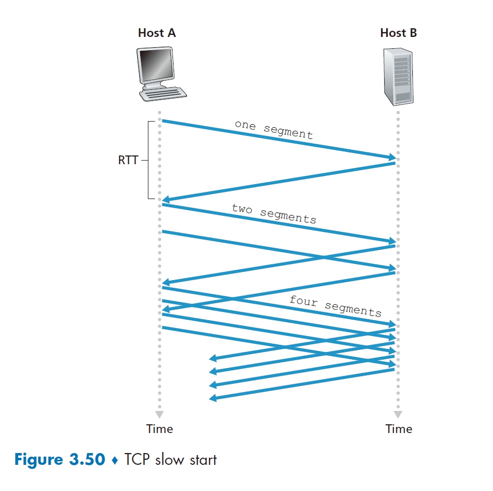

但是，何时结束这种指数增长呢？慢启动对这个问题提供了几种答案。首先，如果存在一个由超时指示的丢包事件（即拥塞），TCP 发送方将 cwnd 设置为 1 并重新开始慢启动过程。它还将第二个状态变量的值 ssthresh（"慢启动阈值”的速记）设置为 cwnd/2 ，即当检测到拥塞时将 ssthresh 置为拥塞窗口值的一半。慢启动结束的第二种方式是直接与 ssthresh 的值相关联。因为当检测到拥塞时 ssthresh 设为 cwnd 的值 一半，当到达或超过 ssthresh 的值时，继续使 cwnd 翻番可能有些鲁莽。因此，当 cwnd 的值等于 ssthresh 时，结束慢启动并且 TCP 转移到拥塞避免模式。我们将会看到，当进入拥塞避免模式时，TCP 更为谨慎地增加 cwnd。最后一种结束慢启动的方式是，如果检测到 3 个冗余 ACK，这时 TCP 执行一种快速重传（参见 3-5-4 节）并进入快速恢复状态，后面将讨论相关内容。慢启动中的 TCP 行为总结在图 3-51 中的 TCP 拥塞控制的 FSM 描述中。慢启动算法最早源于［Jacobson 1988］；在［Jain 1986］中独 立地提出了一种类似于慢启动的方法。

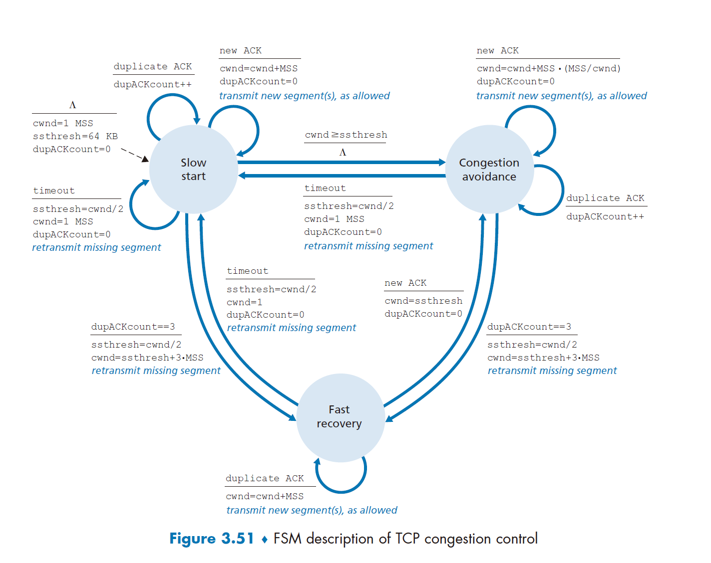

2. **拥塞避免**

一旦进入拥塞避免状态，cwnd 的值大约是上次遇到拥塞时的值的一半，即距离拥塞可能并不遥远！因此，TCP 无法每过一个 RTT 再将 cwnd 的值翻番，而是采用了一种较为保守的方法，每个 RTT 只将 cwnd 的值增加一个 MSS ［RFC 5681］。这能够以几种方式完 成。一种通用的方法是对于 TCP 发送方无论何时到达一个新的确认，就将 cwnd 增加一个 MSS （ MSS/cwnd）字节。例如，如果 MSS 是 1460 字节并且 cwnd 是 14600 字节，则在一 个 RTT 内发送 10 个报文段。每个到达 ACK （假定每个报文段一个 ACK）增加 1/10 MSS 的拥塞窗口长度，因此在收到对所有 10 个报文段的确认后，拥塞窗口的值将增加了一个 MSS。

但是何时应当结束拥塞避免的线性增长（每 RTT 1MSS）呢？当出现超时时，TCP 的拥塞避免算法行为相同。与慢启动的情况一样，cwnd 的值被设置为 1 个 MSS,当丢包事件出现时，ssthresh 的值被更新为 cwnd 值的一半。然而，前面讲过丢包事件也能由一个三个 冗余 ACK 事件触发。在这种情况下，网络继续从发送方向接收方交付报文段（就像由收到冗余 ACK 所指示的那样）。因此 TCP 对这种丢包事件的行为，相比于超时指示的丢包，应当不那么剧烈：TCP 将 cwnd 的值减半（为使测量结果更好，计及已收到的 3 个冗余的 ACK 要加上 3 个 MSS），并且当收到 3 个冗余的 ACK,将 ssthresh 的值记录为 cwnd 的值的一半。接下来进入快速恢复状态。

3. **快速恢复**

在快速恢复中，对于引起 TCP 进入快速恢复状态的缺失报文段，对收到的每个冗余的 ACK, cwnd 的值增加一个 MSS。最终，当对丢失报文段的一个 ACK 到达时，TCP 在降低 cwnd 后进入拥塞避免状态。如果出现超时事件，快速恢复在执行如同在慢启动和拥塞避免中相同的动作后，迁移到慢启动状态：当丢包事件出现时，cwnd 的值被设置为 1 个 MSS，并且 ssthresh 的值设置为 cwnd 值的一半。

快速恢复是 TCP 推荐的而非必需的构件［RFC56&1］。有趣的是，一种称为 TCP Tahoe 的 TCP 早期版本，不管是发生超时指示的丢包事件，还是发生 3 个冗余 ACK 指示的丢包事件，都无条件地将其拥塞窗口减至 1 个 MSS,并进入慢启动阶段。TCP 的较新版本 TCP Reno,则综合了快速恢复。

图 3-52 图示了 Reno 版 TCP 与 Tahoe 版 TCP 的拥塞控制窗口的演化情况。在该图中，阈值初始等于 8 个 MSS。在前 8 个传输回合，Tahoe 和 Reno 采取了相同的动作。拥塞窗口在慢启动阶段以指数速度快速爬升，在第 4 轮传输时到达了阈值。然后拥 塞窗口以线性速度爬升，直到在第 8 轮传 输后出现 3 个冗余 ACKO 注意到当该丢包 事件发生时，拥塞窗口值为 12 x MSS。于是 ssthresh 的值被设置为 $0.5 \times cwnd =6 \times MSS$。在 TCP Reno 下，拥塞窗口被设置为 cwnd = 9 MSS，然后线性地增长。在 TCP Tahoe 下，拥塞窗口被设置为 1 个 MSS，然后呈指数增长，直至到达 ssthresh 值为止，在这个点它开始线性增长。

图 3-51 表示了 TCP 拥塞控制算法（即慢启动、拥塞避免和快速恢复）的完整 FSM 描述。该图也指示了新报文段的传输或重传的报文段可能出现的位置。尽管区分 TCP 差错控制/重传与 TCP 拥塞控制非常重要，但是注意到 TCP 这两个方面交织链接的方式也很重要。

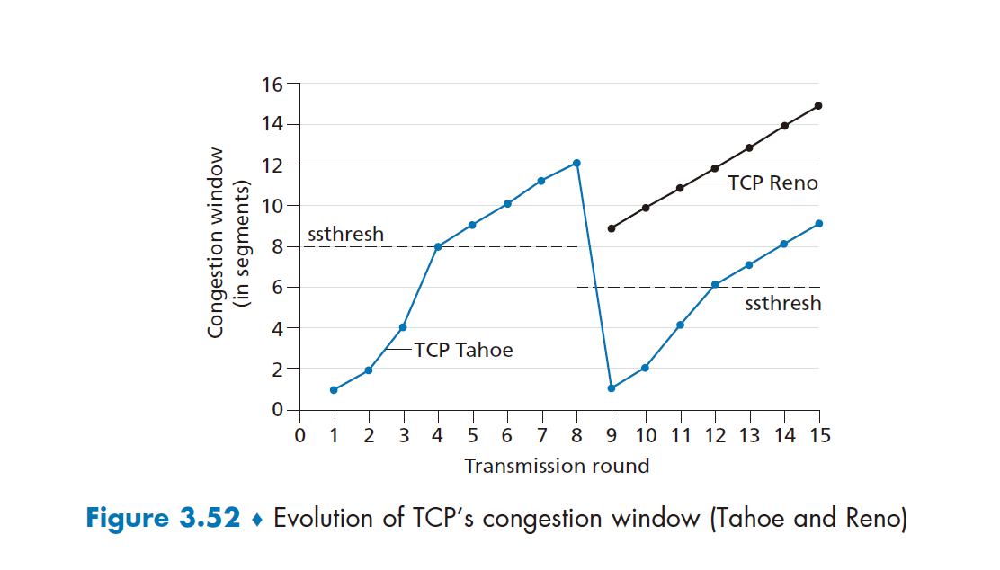

4. **TCP 拥塞控制：回顾**

在深入了解慢启动、拥塞避免和快速恢复的细节后，现在有必要退回来回顾一下全 局。忽略一条连接开始时初始的慢启动阶段，假定丢包由 3 个冗余的 ACK 而不是超时指 示，TCP 的拥塞控制是：每个 RTT 内 cwnd 线性（加性）增加 1 MSS,然后出现 3 个冗余 ACK 事件时 cwnd 减半（乘性减）。因此，TCP 拥塞控制常常被称为 **加性增、乘性减(Additive-Increase, Multiplicative- Decrease)**，在图 3-53 中所示的“锯齿”行为，这也 很好地图示了我们前面 TCP 检测带宽时 的直觉，即 TCP 线性地增加它的拥塞窗 口长度（因此增加其传输速率），直到出现 3 个冗余 ACK 事件。然后以 2 个因子 来减少它的拥塞窗口长度，然后又开始了线性增长，探测是否还有另外的可用带宽。

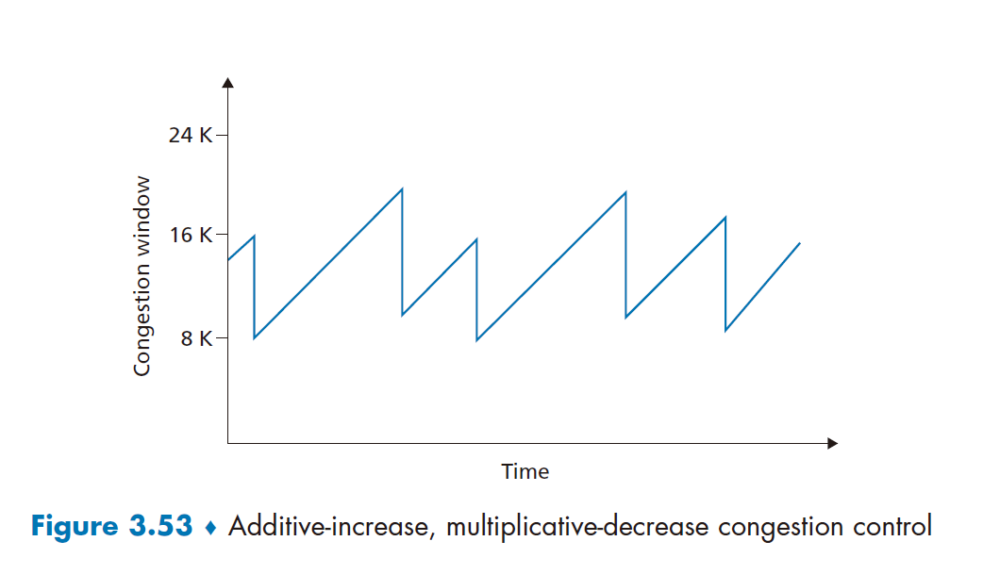

如前所述，许多 TCP 实现采用了 Rno 算法［Padhye 2001]。Reno 算法的许多变种已被提出［RFC 3782； RFC 2018］。TCP Vegas 算法［Brakmo 1995； Ahn 1995 ］试图在维持较好的吞吐量的同时避免拥塞。Vegas 的基本思想是：1. 在分组丢失发生之前, 在源与目的地之间检测路由器中的拥塞；2. 当检测出快要发生的分组丢失时，线性地降低发送速率。快要发生的分组丢失是通过观察 RTT 来预测的。分组的 RTT 越长，路由器中 的拥塞越严重。到 2015 年年底，TCP 的 Ubuntu Linux 实现默认提供了慢启动、拥塞避免、 快速恢复、快速重传和 SACK，也提供了诸如 TCP Vegas 和 BIC ［Xu 2004］等其他拥塞控 制算法。对于许多特色 TCP 的综述参见［Afanasyev 2010］。

TCP AIMD 算法基于大量的工程见解和在运行网络中的拥塞控制经验而开发。在 TCP 研发后的十年，理论分析显示 TCP 的拥塞控制算法用做一种分布式异步优化算法，使得用户和网络性能的几个重要方面被同时优化［Kelly 1998］。拥塞控制的丰富理论已经得到发展[Srikant 2004] 。

5. **对 TCP 吞吐量的宏观描述**

给岀 TCP 的锯齿状行为后，自然要考虑一个长存活期的 TCP 连接的平均吞吐量（即平均速率）可能是多少。在这个分析中，我们将忽略在超时事件后出现的慢启动阶段。（这些阶段通常非常短，因为发送方很快就以指数增长离开该阶段。）在一个特定的往返间 隔内，TCP 发送数据的速率是拥塞窗口与当前 RTT 的函数。当窗口长度是垃字节，且当 前往返时间是 RTT 秒时，则 TCP 的发送速率大约是 W/RTT。于是，TCP 通过每经过 1 个 RTT 将垃增加 1 个 MSS 探测出额外的带宽，直到一个丢包事件发生为止。当一个丢包事 件发生时，用妙表示闪的值。假设在连接持续期间 RTT 和炉几乎不变，那么 TCP 的传输速率在 W/(2 xRTT) 到 W/RTT 之间变化。

这些假设导出了 TCP 稳态行为的一个高度简化的宏观模型。当速率增长至 W/RTT 时,网络丢弃来自连接的分组；然后发送速率就会减半，进而每过一个 RTT 就发送速率增加 MSS/RTT,直到再次达到莎/RTT 为止。这一过程不断地自我重复。因为 TCP 吞吐量（即速率）在两个极值之间线性增长，所以我们有

$$一条连接的平均吞吐量 = {0.75 \times W \over RTT}$$

我们可以推出一个将连接的丢包率与可通过这个高度理想化的 TCP 稳态动态性模型，用带宽联系起来的有趣表达式［Mahdavi 1997］。这个推导将在课后习题中概要给出。一个根据经验建立的并与测量数据一致的更复杂模型参见［Padhye 2000］。

1. **经高带宽路径的 TCP**

认识到下列事实是重要的：TCP 拥塞控制已经演化了多年并仍在继续演化。对当前 TCP 变量的总结和 TCP 演化的讨论,参见［Floyd 2001 ； RFC 5681 ； Afanasyev 2010］。以往对因特网有益的东西（那时大量的 TCP 连接承载的是 SMTP、FTP 和 Telnet 流量），不一 定对当今 HTTP 主宰的因特网或具有难以想象的服务的未来因特网还是有益的。

TCP 继续演化的需求能够通过考虑网格和云计算应用所需要的高速 TCP 连接加以阐述。例如，考虑一条具有 1500 字节报文段和 100ms RTT 的 TCP 连接，假定我们要通过这条连接以 lOGbps 速率发送数据"根据［RFC 3649］,我们注意到使用上述 TCP 吞吐量公 式，为了取得 lOGbps 吞吐量，平均拥塞窗口长度将需要是 83333 个报文段。对如此大量 的报文段，使我们相当关注这 83 333 个传输中的报文段也许会丢失。在丢失的情况下，将 会出现什么情况呢？或者以另一种方式说，这些传输的报文段能以何种比例丢失，使得在 图 3-52 中列出的 TCP 拥塞控制算法仍能取得所希望的 lOGbps 速率？在本章的课后习题中，要求读者推导出一条 TCP 连接的吞吐量公式，该公式作为丢包率（L）、往返时间 （RTT）和最大报文段长度（MSS）的函数：

$$一条连接的平均吞吐量 = {1.22 \times MSS \over {RTT  \sqrt L}}$$

使用该公式，我们能够看到，为了取得 lOGbps 的吞吐量，今天的 TCP 拥塞控制算法仅能容忍 2x10^-10 的报文段丢失概率（或等价地说，对每 5 000 000 000 个报文段有一个丢包）.这是一个非常低的值。这种观察导致许多研究人员为这种高速环境特别设计新版 TCP,对这些努力的讨论参见[Jin 2004；Kelly 2003 ；Ha 2008 ；RFC 7323]。

### 3.7.2. 网络辅助拥塞控制

自 20 世纪 80 年代后期慢启动和拥塞避免开始标准化以来［RFC 1122］, TCP 已经实 现了端到端拥塞控制的形式，我们在 3-7-1 节中对此进行了学习：一个 TCP 发送方不会收到来自网络层的明确拥塞指示，而是通过观察分组丢失来推断拥塞。最近，对于 IP 和 TCP 的扩展方案［RFC 3168］已经提出并已经实现和部署，该方案允许网络明确向 TCP 发送方和接收方发出拥塞信号。这种形式的网络辅助拥塞控制称为明确拥塞通告（Explicit Congestion Notification, ECN）。 如图 3-55 所示，涉及了 TCP 和 IP 协议。

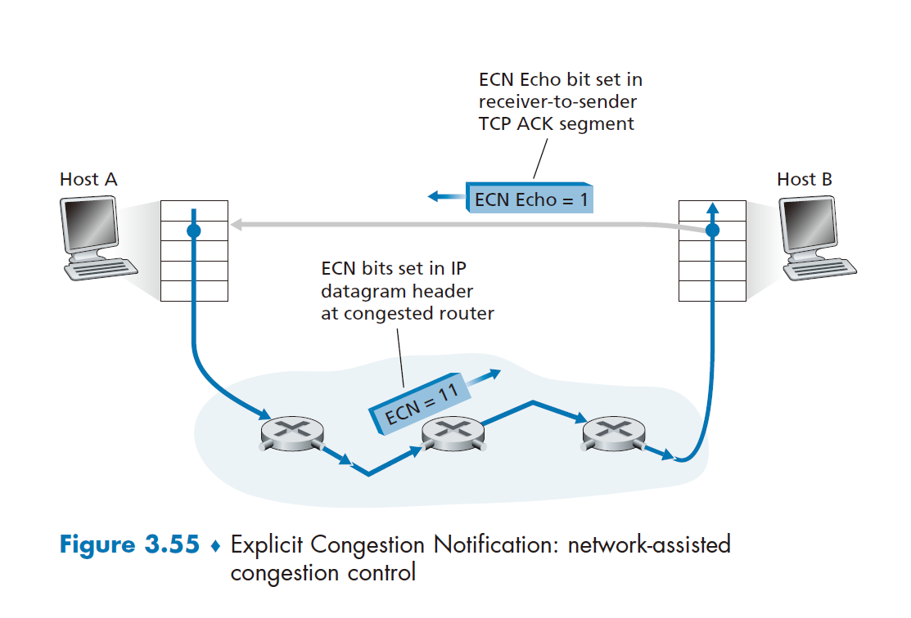

在网络层，IP 数据报首部的服务类型字段中的两个比特（总的说来，有四种可能的值）被用于 ECNO 路由器所使用的一种 ECN 比特设置指示该路由器正在历经拥塞。该拥塞指示则由被标记的 IP 数据报所携带，送给目的主机，再由目的主机通知发送主机，如图 3-56 所示。RFC 3168 没有提供路由器拥塞时的定义；该判断是由路由器厂商所做的配 置选择，并且由网络操作员决定。然而，RFC 3168 推荐仅当拥塞持续不断存在时才设置 ECN 比特。发送主机所使用的另一种 ECN 比特设置通知路由器发送方和接收方是 ECN 使能的，因此能够对于 ECN 指示的网络拥塞采取行动。

如图 3-56 所示，当接收主机中的 TCP 通过一个接收到的数据报收到了一个 ECN 拥塞指示时，接收主机中的 TCP 通过在接收方到发送方的 TCP ACK 报文段中设置 ECE （明确拥塞通告回显）比特（参见图 3-29）,通知发送主机中的 TCP 收到拥塞指示。接下来, TCP 发送方通过减半拥塞窗口对一个具有 ECE 拥塞指示的 ACK 做出反应，就像它对丢失 报文段使用快速重传做出反应一样，并且在下一个传输的 TCP 发送方到接收方的报文段首部中对 CWR （拥塞窗口缩减）比特进行设置。

除了 TCP 以外的其他运输层协议也可以利用网络层发送 ECN 信号。数据报拥塞控制 协议（Datagram Congestion Control Protocol, DCCP） ［ RFC 4340 ］提供了一 种低开销、控制 拥塞的类似 UDP 不可靠服务，该协议利用了 ECN。DCTCP （数据中心 TCP） ［ Alizadeh 2010］是一种专门为数据中心网络设计的 TCP 版本，也利用了 ECN。

### 3.7.3. 公平性

考虑 K 条 TCP 连接，每条都有不同的端到端路径，但是都经过一段传输速率为 R bps 的瓶颈链路。（所谓瓶颈链路，是指对于每条连接，沿着该连接路径上的所有其他段链路都不拥塞，而且与该瓶颈链路的传输容量相比，它们都有充足的传输容量。）假设每条连接都在传输一个大文件，而且无 UDP 流量通过该段瓶颈链路。如果每条连接的平均传输速率接近 R/K，即每条连接都得到相同份额的链路带宽，则认为该拥塞控制机制是公平的。

TCP 的 A1MD 算法公平吗？尤其是假定可在不同时间启动并因此在某个给定的时间点可能具有不同的窗口长度情况下，对这些不同的 TCP 连接还是公平的吗？ TCP 趋于 在竞争的多条 TCP 连接之间提供对一段瓶颈链路带宽的平等分享，其理由［Chiu 1989］给出了一个极好的、直观的解释。

我们考虑有两条 TCP 连接共享一段传 输速率为 R 的链路的简单例子，如图 3-56 中所示。我们将假设这两条连接有相同的 MSS 和 RTT （这样如果它们有相同的拥塞窗口长度，就会有相同的吞吐量），它们有大量的数据要发送，且没有其他 TCP 连接或 UDP 数据报穿越该段共享链路。我们还 将忽略 TCP 的慢启动阶段，并假设 TCP 连接一直按 CA 模式（AIMD）运行。

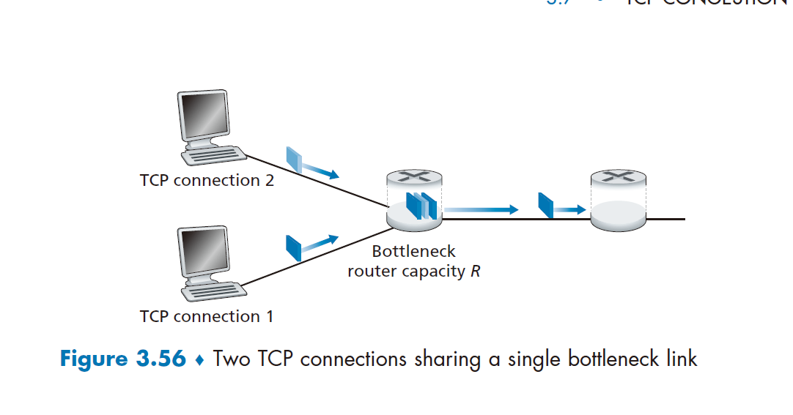

图 3-57 描绘了两条 TCP 连接实现的吞吐量情况。如果 TCP 要在这两条 TCP 连接之间平等地共享链路带宽，那么实现的吞吐量曲线应当是从原点沿 45。方向的箭头向外辐射（平等带宽共享）。理想情况是，两个吞吐量的和应等于尺。（当然，每条连接得到相同但容量为 0 的共享链路容量并非我们所期望的情况！）所以我们的目标应该 TCP 连接 1 图 3-54 两条 TCP 连接共享同一条瓶颈链路是使取得的吞吐量落在图 3-55 中平等带宽共享曲线与全带宽利用曲线的交叉点附近的某处。

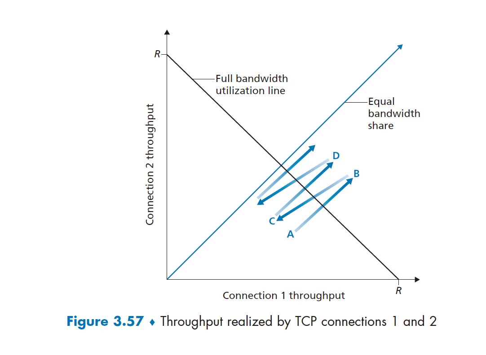

假定 TCP 窗口长度是这样的，即在某给定时刻，连接 1 和连接 2 实现了由图 3-56 中 A 点所指明的吞吐量。因为这两条连接共同消耗的链路带宽量小于 R,所以无丢包事件发生，根据 TCP 的拥塞避免算法的结果，这两条连接每过一个 RTT 都要将其窗口增加 1 个 MSS。因此，这两条连接的总吞吐量就会从 A 点开始沿 45。线前行（两条连接都有相同的 增长）。最终，这两条连接共同消耗的带宽将超过心最终将发生分组丢失。假设连接 1 和连接 2 实现 B 点指明的吞吐量时，它们都经历了分组丢失。连接 1 和连接 2 于是就按二分之一减小其窗口。所产生的结果实现了 C 点指明的吞吐量，它正好位于始于 B 点止于原点的一个向量的中间。因为在 C 点，共同消耗的带宽小于/?,所以这两条连接再次沿着始于 C 点的 45。线增加其吞吐量。最终，再次发生丢包事件，如在 D 点，这两条连接再次将其窗口长度减半，如此等等。你应当搞清楚这两条连接实现的带宽最终将沿着平等带宽共 享曲线在波动。还应该搞清楚无论这两条连接位于二维空间的何处，它们最终都会收敛到该状态！虽然此时我们做了许多理想化的假设，但是它仍然能对解释为什么 TCP 会导致在 多条连接之间的平等共享带宽这个问题提供一个直观的感觉。

在理想化情形中，我们假设仅有 TCP 连接穿过瓶颈链路，所有的连接具有相同的 RTT 值,且对于一个主机-目的地对而言只有一条 TCP 连接与之相关联。实践中，这些条件通常是得不到满足的，客户-服务器应用因此能获得非常不平等的链路带宽份额。特别是, 已经表明当多条连接共享一个共同的瓶颈链路时，那些具有较小 RTT 的连接能够在链路空闲时更快地抢到可用带宽（即较快地打开其拥塞窗口），因而将比那些具有较大 RTT 的连接享用更高的吞吐量［Laksman1997］。

1. **公平性与 UDP**

我们刚才已经看到，TCP 拥塞控制是如何通过拥塞窗口机制来调节一个应用程序的传输速率的。许多多媒体应用如因特网电话和视频会议，经常就因为这种特定原因而不在 TCP 运行，因为它们不想其传输速率被扼制，即使在网络非常拥塞的情况下。相反，这些应用宁可在 UDP 上运行，UDP 是没有内置的拥塞控制的。当运行在 UDP 上时，这些应用能够以恒定的速率将其音频和视频数据注入网络之中并且偶尔会丢失分组，而不愿在拥 塞时将其发送速率降至“公平”级别并且不丢失任何分组。从 TCP 的观点来看，运行在 UDP 上的多媒体应用是不公平的，因为它们不与其他连接合作，也不适时地调整其传输速率。因为 TCP 拥塞控制在面临拥塞增加（丢包）时，将降低其传输速率，而 UDP 源则不 必这样做，UDP 源有可能压制 TCP 流量。当今的一个主要研究领域就是开发一种因特网 中的拥塞控制机制，用于阻止 UDP 流量不断压制直至中断因特网吞吐量的情况［Floyd 1999； Floyd 2000 ； Kohler 2006 ； RFC 4340 ］。

2. **公平性和并行 TCP 连接**

即使我们能够迫使 UDP 流量具有公平的行为，但公平性问题仍然没有完全解决。这是因为我们没有什么办法阻止基于 TCP 的应用使用多个并行连接。例如，Web 浏览器通常使用多个并行 TCP 连接来传送一个 Web 页中的多个对象。（多条连接的确切数目可以在多 数浏览器中进行配置。）当一个应用使用多条并行连接时，它占用了一条拥塞链路中较大 比例的带宽。举例来说，考虑一段速率为尺且支持 9 个在线客户-服务器应用的链路，每 个应用使用一条 TCP 连接。如果一个新的应用加入进来，也使用一条 TCP 连接，则每个 应用得到差不多相同的传输速率 R/10。但是如果这个新的应用这次使用了 11 个并行 TCP 连接，则这个新应用就不公平地分到超过 R/2 的带宽。Web 流量在因特网中是非常普遍的，所以多条并行连接并非不常见。

## 3.8. 实验 6：用 wireshark 观察 TCP

**time : 2021-06-10**

本次实验中，我们将详细地观察著名的 TCP。我们将分析一个 150KB 的文件的传输过程。我们将研究提供了可靠数据传输的序号和确认号。我们将亲眼看到 TCP 的拥塞控制算法，包括慢启动和拥塞避免。我们将观察 TCP 的流量控制机制。我们也会简要地考察 TCP 的连接管理和连接性能。

在本次实验之前，你或许要回顾一下 [3-5 节](#35-面向连接的运输tcp) 和 [3-7 节](#37-tcp-拥塞控制)。

### 3.8.1. 捕获 TCP 分组

在开启 wireshark 捕获后，你需要将本地存储的一个 txt 文件经过我们提供的网址发送到一个远程服务器。这会使用到 HTTP 的 POST 方法。

执行以下步骤：

1. 启动你的 web 浏览器，访问 http://gaia.cs.umass.edu/wiresharklabs/alice.txt 并把它保存到本地。
2. 接下来，访问 http://gaia.cs.umass.edu/wireshark-labs/TCP-wireshark-file1.html 你将看到以下结果：


3. 通过图中的“Choose File”按钮选择文件，先不要点击下方的“Upload alice.txt file”按钮，启动 wireshark 的捕获。
4. 返回浏览器，此时再按下“Upload alice.txt file”按钮，等待有一条祝贺成功的消息后，停止捕获。你应该可以看到以下的结果：


### 3.8.2. 预览一下捕获的分组

在详细分析 TCP 连接的行为之前，我们先预览一下捕获的分组。

让我们先来看看这个过程中产生的 HTTP POST 报文。在过滤框中键入“http”以便我们找到 HTTP POST 报文。

### 3.8.3. TCP 基础

### 3.8.4. TCP 拥塞控制

回答以下问题：

1. 你电脑使用的 IP 地址和端口号是多少？对应目标主机使用的 IP 地址和端口号是多少？

本地电脑：192.168.43.27 : 24299，目的主机：128.119.245.12 : 80

2. 初始化 TCP 连接的 SYN 报文段的序号是多少？相应的 SYNACK 报文段序号和确认号是多少？

SYN: Seq = 0, Ack = 0; SYNACK: Seq = 0, Ack = 1;

3. 包含 HTTP POST 的报文段的序号是多少？

1

## 3.9. 实验 7：用 wireshark 观察 UDP

在本次实验中，我们将快速地观察一下 UDP 运输层协议。

执行以下步骤：

1. 开启 wireshark 的捕获，等待一些时间后，便会有 UDP 分组出现。

回答以下问题：

1. 从捕获中选择一个 UDP 分组，从这个分组的头部区域中确定有多少字段，说出这些字段的含义。

4 个字段，源端口号，目的端口号，UDP 分组长度以及检验和。

2. 查看这个分组头部的长度

8 B

3. 这个 UDP 分组头部的 Length 字段值为多少？

153 B

4. 查看 UDP 有效载荷是多少？

145 B

5. 最大的可能源端口号是多少？

65535

6. UDP 协议的协议号是多少？查看对应的数据报回答。

17

7. 查看一对 UDP 分组，观察源端口号和目的端口号之间的关系。

源端口号和目的端口号反转。

**time : 2021-06-11**

# 4. 网络层：数据平面

在本章和下一章，我们将学习网络层是怎么实现主机到主机之间的通信服务的。和应用层和运输层不同，网络层在主机和路由器中实现。

网络层是协议栈中最为复杂的层，因此我们用了 2 章来讨论。我们将网络层分解为 2 个部分：**数据平面** 和 **控制平面**。在第 4 章，我们首先学习网络层的数据平面功能，这个功能就是网络层每台路由器的功能：决定数据报如何转发到出链路之一。我们将涉及传统的 IP 转发（基于数据报的母的地址）和通用的转发（使用数据报首部中的几个字段）。在第 5 章我们来学习网络层的控制平面功能，即网络范围的逻辑：决定数据报的路经的路由方式。我们将学习路由选择算法，以及具有代表性的 OSPF 和 BGP 等路由选择协议。传统上，数据平面和控制平面以北实现为一个整体，位于一台路由器中，但 **软件定义网络(Software-Defined Networking, SDN)** 通过将控制平面功能作为一种单独的服务，明确地分离数据平面和控制平面，控制平面功能通常置于一台“控制器”中。我们将在第 5 章学习 SDN。

网络层中数据平面和控制平面之间的功能区别很重要，当你学习网络层时，心中要记住这个区别。它将有助于你构思网络层，并且反映计算机网络中网络层角色的现代观点。

## 4.1. 网络层概述

图 4-1 显示了一个简单的网络。图中有 H1，H2 两台主机，在 H1 和 H2 之间的路径上有几台路由器。假设 H1 正在向 H2 发送信息。考虑这些主机和路由器的网络层起的作用。H1 的网络层取得来自于 H1 运输层的报文段，将每个报文段封装成一个数据报，然后向相邻路由器 R1 转发该数据报。在接收方主机 H2，网络层接收来自相邻路由器的数据报，并提取出运输层报文段，并将其交给 H2 的运输层。每台路由器数据平面的功能是从输入链路向其输出链路转发数据报；而控制平面的功能是协调每个路由器的转发动作，使得数据报通过源主机和目的主机之间的路由器路径。注意到图中，路由器没有实现运输层和应用层。

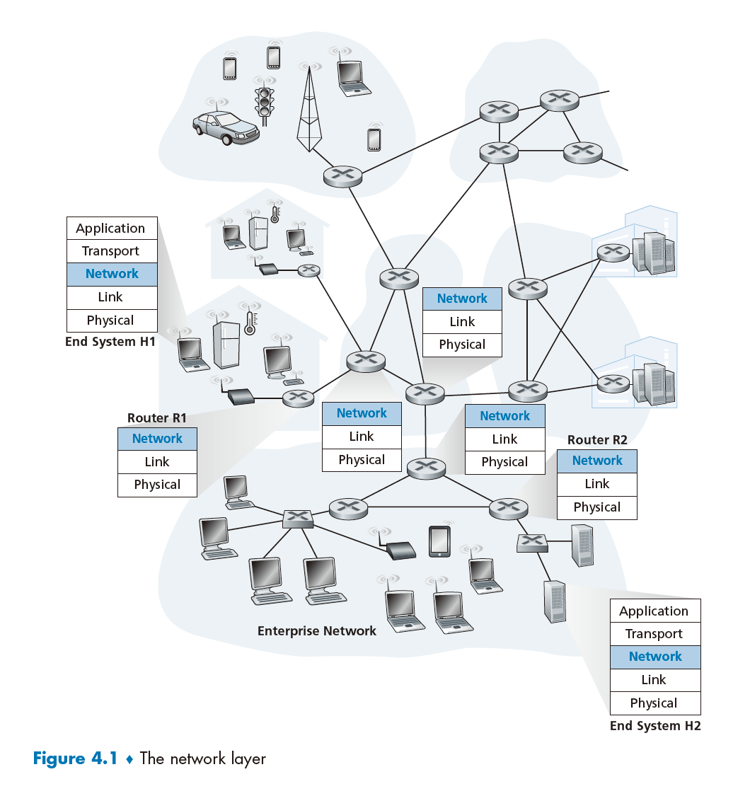

### 4.1.1. 转发和路由选择：数据平面和控制平面

网络层的作用从表面上看极为简单，即将分组从一台发送主机移动到一台接收主机。为此，需要使用两种重要的网络层功能：

- 转发。当一个分组到达某路由器的一个输入链路时，该路由器必须将该分组转发到输出链路之一。例如，在图 4-1 中来自主机 H1 到路由器 R1 的一个分组，必须向到达 H2 的路径上的下一台路由器转发。如我们将看到的那样，转发是在数据平面中实现的唯一功能（尽管是最为常见和重要的功能）。在最为常见的场合 （我们将在 4-4 节中讨论），分组也可能被现有的路由器阻挡（例如，该分组来源于一个已知的恶意主机，或者该分组发向一个被禁止的目的主机）。
- 路由选择。当分组从发送方流向接收方时，网络层必须决定这些分组所采用的路 由或路径。计算这些路径的算法被称为 **路由选择算法(routing algorithm)**。例如, 在图 4・1 中一个路由选择算法将决定分组从 H1 到 H2 流动所遵循的路径。路由选 择在网络层的控制平面中实现。

在讨论网络层时，许多作者经常交替使用转发和路由选择这两个术语。**转发(forwarding)** 是指将分组从一个输入链路接口转移到适当的输出链路接口的路由器本地动作。转发发生的时间尺度很短(通常为几纳秒)，因此通常用硬件来实现。**路由选择(routing)** 是指确定分组从源到目的地所采取的端到端路径的网络范围处理过程。路由选择发生的时间尺度长得多(通常为几秒)，因此通常用软件来实现。用驾驶的例子进行类比，考虑在 1-3-1 节中旅行者所历经的从宾夕法尼亚州到 佛罗里达州的行程。在这个行程中，那位驾驶员在到佛罗里达州的途中经过了许多立交桥。我们能够认为转发就像通过单个立交桥的过程：一辆汽车从其道路上进入立交桥的一个入口，并且决定应当走哪条路来离开该立交桥。我们可以把路由选择看作是规划从宾夕法尼亚州到佛罗里达州行程的过程：在着手行程之前，驾驶员已经查阅了地图并在许多可 能的路径中选择一条，其中每条路径都由一系列经立交桥连接的路段组成。

每台网络路由器中有一个关键基本组成是它的 **转发表(forwarding table)**。路由器检査到达分组首部的一个或多个字段值，进而使用这些首部值在其转发表中索引，通过这种方法来转发分组。这些值对应存储在转发表项中的值，指出了该分组将被转发的路由器的输出链路接口。例如在图 4-2 中，一个首部字段值为 0111 的分组到达路由器。该路由器在它的
转发表中索引，并确定该分组的输出链路接口是接口 2。该路由器则在内部将该分组转发到接口 2。在 4-2 节中，我们深入路由器内部，更为详细地研究这种转发功能。转发是由网络层的数据平面执行的主要功能。

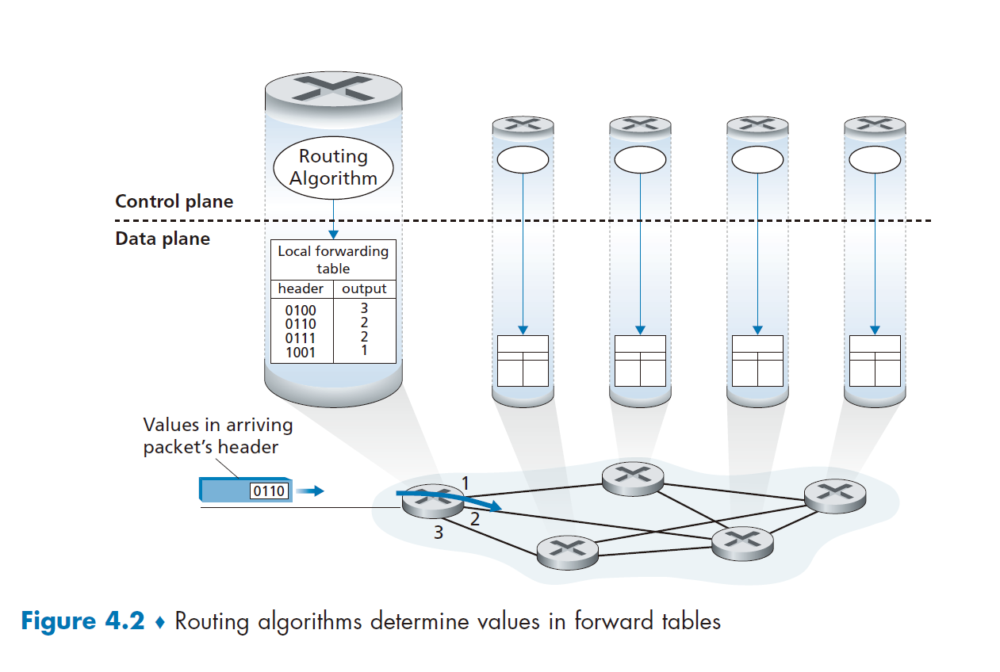

1. **控制平面：传统方法**

你也许现在想知道路由器中的转发表一开始是如何配置的。这是一个关键问题，它揭示了路由选择和转发间的重要相互作用关系。如图 4-2 所示，路由选择算法决定了插入该路由器转发表的内容。在这个例子中，路由选择算法运行在每台路由器中，并且在每台路由器中都包含转发和路由选择两种功能。如我们将在 5-3 节和 5-4 节中所见，在一台路由器中的路由选择算法与在其他路由器中的路由选择算法通信，以计算出它的转发表的值。 这种通信是如何执行的呢？通过根据路由选择协议交换包含路由选择信息的路由选择报文！我们将在 5-2-5-4 节讨论路由选择算法和协议。

通过考虑网络中的假想情况（不真实的，但技术上是可行的），也就是说路由器中物理上存在的所有转发表的内容是由人类网络操作员直接配置的，进一步说明转发和路由选择功能的区别和不同目的。在这种情况下，不需要任何路由选择协议！当然，这些人类操作员将需要彼此交互，以确保该转发表的配置能使分组到达它们想要到达的目的地。岀现下列现象也很可能：人工配置更容易出错，并且对于网络拓扑变化的响应比起路由选择协议来更慢。我们要为所有网络具有转发和路由选择功能而感到幸运!

2. **控制平面：SDN 方法**

图 4-2 中显示的实现路由选择功能的方法，是路由选择厂商在其产品中采用的传统方法，至少最近还是如此。使用该方法，每台路由器都有一个与其他路由器的路由选择组件通信的路由选择组件。然而，对人类能够手动配置转发表的观察启发我们，对于控制平面功能来说，也许存在其他方式来确定数据平面转发表的内容。

图 4-3 显示了从路由器物理上分离的另一种方法，远程控制器计算和分发转发表以供每台路由器所使用。注意到图 4-2 和图 4-3 的数据平面组件是相同的。而在图 4-3 中，控制平面路由选择功能与物理的路由器是分离的，即路由选择设备仅执行转发，而远程控制器计算并分发转发表。远程控制器可能实现在具有高可靠性和冗余的远程数据中心中，并 可能由 ISP 或某些第三方管理。路由器和远程控制器是如何通信的呢？通过交换包含转发 表和其他路由选择信息的报文。显示在图 4-3 中的控制平面方法是 **软件定义网络(Software-Defined Networking, SDN)**的本质，因为计算转发表并与路由器交互的控制器是用软件实现的，故网络是“软件定义”的。这些软件实现也越来越开放，换言之类似于 Linux 操作系统代码，这些代码可为公众所用，允许 ISP （以及网络研究者和学生）去创新并对控制网络层功能的软件提出更改建议。我们将在 5-5 节中讨论 SDN 控制平面。

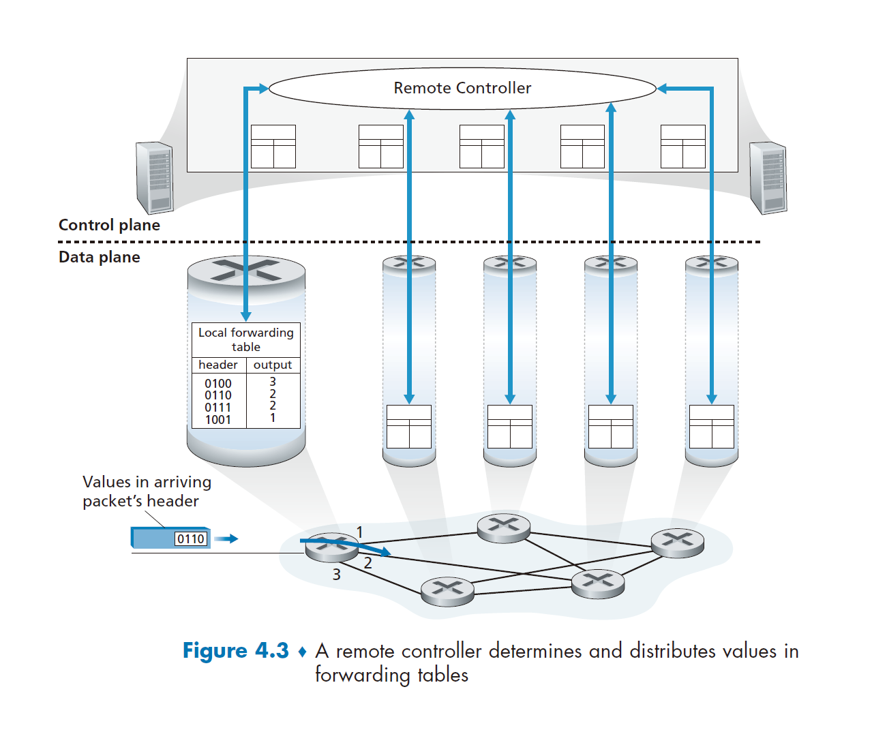

### 4.1.2. 网络服务模型

在钻研网络层的数据平面之前，我们将以开阔的视野来专注于我们引入的新东西并考虑网络层可能提供的不同类型的服务。当位于发送主机的运输层向网络传输分组时（即在发送主机中将分组向下交给网络层），运输层能够指望网络层将该分组交付给目的地吗? 当发送多个分组时，它们会按发送顺序按序交付给接收主机的运输层吗？发送两个连续分组的时间间隔与接收到这两个分组的时间间隔相同吗？网络层会提供关于网络中拥塞的反馈信息吗？在发送主机与接收主机中连接运输层通道的抽象视图（特性）是什么？对这些 问题和其他问题的答案由网络层提供的服务模型所决定。**网络服务模型(network service model)** 定义了分组在发送与接收端系统之间的端到端运输特性。

我们现在考虑网络层能提供的某些可能的服务。这些服务可能包括：

- 确保交付。该服务确保分组将最终到达目的地。
- 具有时延上界的确保交付。该服务不仅确保分组的交付，而且在特定的主机到主机时延上界内（例如在 100ms 内）交付。
- 有序分组交付。该服务确保分组以它们发送的顺序到达目的地。
- 确保最小带宽。这种网络层服务模仿在发送和接收主机之间一条特定比特率（例如 1 Mbps）的传输链路的行为。只要发送主机以低于特定比特率的速率传输比特（作为分组的组成部分），则所有分组最终会交付到目的主机。
- 安全性。网络层能够在源加密所有数据报并在目的地解密这些分组，从而对所有运 输层报文段提供机密性。

这只是网络层能够提供的服务的部分列表，有无数种可能的服务变种。

Internet 的网络层提供了单一的服务，称为 **尽力而为服务(best-effort service)**。使用尽力而为服务，传送的分组既不能保证以它们发送的顺序被接收，也不能保证它们最终交 付；既不能保证端到端时延，也不能保证有最小的带宽。尽力而为服务看起来是根本无服 务的一种委婉说法，即一个没有向目的地交付分组的网络也符合尽力而为交付服务的定 义！其他的网络体系结构已定义和实现了超过 Internet 尽力而为服务的服务模型。例如, ATM 网络体系结构［MFA Forum 2016； Black 1995］提供了确保按序时延、有界时延和确 保最小带宽。还有提议的对 Internet 体系结构的服务模型扩展，例如，集成服务体系结构 ［RFC 1633］的目标是提供端到端时延保证以及无拥塞通信。令人感兴趣的是，尽管有这 些研发良好的供选方案，但 Internet 的基本尽力而为服务模型与适当带宽供给相结合已被证 明超过“足够好”，能够用于大量的应用，包括诸如 Netflix、IP 语音和视频等流式视频服 务，以及诸如 Skype 和 Facetime 等实时会议应用。

- **第四章概述**

在提供了网络层的概述后，我们将在本章后续几节中讨论网络层的数据平面功能。在 4-2 节中，我们将深入探讨路由器的内部硬件操作，包括输入和输岀分组处理、路由器的内部交换机制以及分组排队和调度。在 4-3 节中，我们将学习传统的 IP 转发，其中分组基于它们的目的 IP 地址转发到输出端口。我们将学习到 IP 寻址、令人称道的 IPv4 和 IPv6 协议等。在 4-4 节中，我们将涉及更为一般的转发，此时分组可以基于大量首部值（即不 仅基于目的 IP 地址）转发到输出端口。分组可能在路由器中受阻或冗余，或者可能让某些首部字段重写，即所有都在软件控制之下完成。这种分组转发的更为一般的形式是现代网络数据平面的关键组件，包括软件定义网络（SDN）中的数据平面。

我们在这里顺便提到，许多计算机网络研究者和从业人员经常互换地使用转发和交换这两个术语。我们在这本教科书中也将互换使用这些术语。在我们开始讨论术语的主题时，还需要指岀经常互换使用的两个其他术语，但我们将更为小心地使用它们。我们将约定术语分组交换机是指一台通用分组交换设备，它根据分组首部字段中的值，从输入链路接口到输出链路接口转移分组。某些分组交换机称为 **链路层交换机(link-layer switch)**（在第 6 章仔细学习），基于链路层帧中的字段值做出转发决定，这些交换机因此被称为链路层（第 2 层）设备。其他分组交换机称为 **路由器(router)**，基于网络层数据报中的首部字段值做岀转发决定。路由器因此是网络层（第 3 层）设备。

## 4.2. 路由器工作原理

既然我们已经概述了网络层中的数据平面和控制平面、转发与路由选择之间的重要区别以及网络层的服务与功能，我们将注意力转向网络层的 **转发** 功能，即实际将分组从一台路由器的入链路传送到适当的出链路。

图 4-4 显示了一个通用路由器体系结构的总体视图，其中标识了一台路由器的 4 个部分。

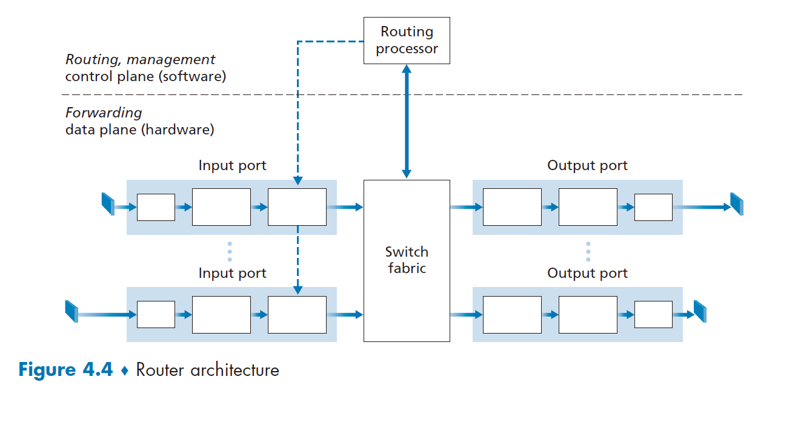

- 输入端口。**输入端口(input port)** 执行几项重要功能。它在路由器中执行终结入物理链路的物理层功能，这显示在图 4-4 中输入端口部分最左侧的方框与输出端口部分最右侧的方框中。它还要与位于入链路的数据链路层交互来执行数据链路层功能，这显示在输入与输出端口部分中间的方框中。也许更为重要的是，在输入端口还要执行查找功能，这显示在输入端口最右侧的方框中。正是在这里，通过查询转发表决定路由器的输出端口，到达的分组通过路由器的交换结构转发到输出端口。控制分组（如携带路由选择协议信息的分组）从输入端口转发到路由选择处理器。注意这里的“端口” 一词，指的是路由器的物理输入和输出接口，这完全不同于第 2、3 章中所讨论的与网络应用程序和套接字相关联的软件端口。在实践中，一台路由器所支持的端口数量范围较大，从企业路由器具有数量相对少的端口，到位于某 ISP 边缘的路由器具有数以百计 lOGbps 端口（其中人线路的数量趋于最大）。例如，边缘路由器 Juniper MX2020 具有 800Tbps 的总体路由器系统容量, 支持多达 800 个 100Gbps 以太网端口[ Juniper MX 2020 2020]。
- 交换结构。交换结构将路由器的输入端口连接到它的输岀端口。这种交换结构完全包含在路由器之中，即它是一个网络路由器中的网络!
- 输出端口。输出端口存储从交换结构接收的分组，并通过执行必要的链路层和物理层功能在输出链路上传输这些分组。当一条链路是双向的时（即承载两个方向的流量），输出端口通常与该链路的输入端口成对出现在同一线路卡上。
- 路由选择处理器。路由选择处理器执行控制平面功能。在传统的路由器中，它执行 路由选择协议（我们将在 5-3 节和 5-4 节学习），维护路由选择表与关联链路状态信息，并为该路由器计算转发表。在 SDN 路由器中，路由选择处理器（在其他活 动中）负责与远程控制器通信，目的是接收由远程控制器计算的转发表项，并在该 路由器的输入端口安装这些表项。路由选择处理器还执行网络管理功能，我们将在 5-7 节学习相关内容。

路由器的输入端口、输出端口和交换结构几乎总是用硬件实现，如图 4-4 所示。为了 理解为何需要用硬件实现，考虑具有 10 Gbps 输入链路和 64 字节的 IP 数据报，其输入端口在另一个数据报到达前仅有 51.2ns 来处理数据报。如果 N 个端口结合在一块线路卡上（因为实践中常常这样做），数据报处理流水线必须以 N 倍速率运行，这远快过软件实现的速率。转发硬件既能够使用路由器厂商自己的硬件设计来实现，也能够使用购买的商用硅片（例如由英特尔和 Broadcom 公司所出售）的硬件设计来实现。

当数据平面以纳秒时间尺度运行时，路由器的控制功能以毫秒或秒时间尺度运行，这些控制功能包括执行路由选择协议、对上线或下线的连接链路进行响应、 信（在 SDN 场合）和执行管理功能。因而这些 **控制平面(control plane)** 的功能通常用软件实现并在路由选择处理器（通常是一种传统的 CPU）上执行。

**time : 2021-06-13**

在深入讨论路由器的内部细节之前，我们转向本章开头的那个类比，其中分组转发好比汽车进入和离开立交桥。假定该立交桥是环状交叉路，在汽车进入该环状交叉路之前，需要做一些处理，我们来考虑一下这种处理需要什么信息：

- 基于目的地转发。假设汽车停在一个入口站上并表明它的最终目的地。入口站的一名服务人员查找最终目的地，确定通向最终目的地的环状交叉路的一个出口，并告诉驾驶员要走哪个出口。
- 通用转发。除了最终目的地之外，服务人员也能够基于许多其他因素确定汽车的出口匝道。例如，所选择的出口匝道可能与该汽车的起点如发行该车牌照的州有关。来自某些州的汽车可能被引导使用某个出口匝道（经过一条慢速道路通向目的地），而来自其他州的汽车可能被引导使用一个不同的岀口匝道（经过一条高速路通向目的地）。基于汽车的模型、品牌和寿命，可能做出相同的决定。或者认为不适合上路的汽车可能被阻止并且不允许通过环状交叉路。就通用转发来说，许多因素都会对 服务人员为给定汽车选择出口匝道产生影响。

一旦汽车进入环状交叉路（该环状交叉路可能挤满了从其他输入道路进入的其他汽车，朝着其他环状交叉路出口前进），并且最终离开预定的环状交叉路出口匝道，在这里可能遇到了从该岀口离开环状交叉路的其他汽车。

在这个类比中，我们能够在图 4-4 中识别最重要的路由器组件：入口道路和入口站对应于输入端口（具有查找功能以决定本地输出端口）；环状交叉路对应于交换结构；环状交叉路出口匝道对应于输出端口。借助于这个类比，我们可以考虑瓶颈可能出现的地方。如果汽车以极快的速率到达（例如，该环状交叉路位于德国或意大利！）而车站服务人员很慢，将发生什么情况？这些服务人员必须工作得多快，以确保在入口路上没有车辆拥堵？甚至对于极快的服务人员，如果汽车在环状交叉路上开得很慢，将发生什么情况，拥堵仍会出现吗？如果大多数进入的汽车都要在相同的出口匝道离开环状交叉路，将发生什么情况，在岀口匝道或别的什么地方会出现拥堵吗？如果我们要为不同的汽车分配优先权，或先行阻挡某些汽车进入环状交叉路，环状交叉路将如何运行？这些全都与路由器和交换机设计者面对的问题形成类比。

在下面的各小节中，我们将更为详细地考察路由器功能。[Iyer 2008 ； Chao 2001 ；Chuang 2005 ； Turner 1988 ； McKeown 1997a； Partridge 1998 ； Sopranos 2011］提供了对一些特定路由器体系结构的讨论。为了具体和简单起见，我们在本节中初始假设转发决定仅基于分组的目的地址，而非基于通用的分组首部字段。我们将在 4-4 节中学习更为通用的分组转发情况。

### 4.2.1. 输入端口处理和基于目的地的转发

图 4-5 中显示了一个更详细的输入处理的视图。如前面讨论的那样，输入端口的线 路端接功能与链路层处理实现了用于各个输入链路的物理层和链路层。在输入端口中执 行的查找对于路由器运行是至关重要的。正是在这个地方，路由器使用转发表来查找输 出端口，使得到达的分组能经过交换结构转发到该输出端口。转发表是由路由选择处理 器计算和更新的（使用路由选择协议与其他网络路由器中的路由选择处理器进行交 互），或者转发表接收来自远程 SDN 控制器的内容。转发表从路由选择处理器经过独立 总线（例如一个 PCI 总线）复制到线路卡，在图 4・4 中该总线由从路由选择处理器到输 入线路卡的虚线所指示。使用在每个输入端口的影子副本，转发决策能在每个输入端口 本地做出，无须基于每个分组调用集中式路由选择处理器，因此避免了集中式处理的瓶颈。


现在我们来考虑“最简单”的情况，一个入分组基于该分组的目的地址交换到输岀端口。在 32 比特 IP 地址的情况下，转发表的蛮力实现将针对每个目的地址有一个表项。因为有超过 40 亿个可能的地址，选择这种方法总体上是不可行的。

作为一个说明怎样处理规模问题的例子，假设我们的路由器具有 4 条链路，编号 0 到 3，分组以如下方式转发到链路接口:

```
            目的地址范围                      链路接口
11001000 00010111 00010000 00000000
                到                              0
11001000 00010111 00010111 11111111

11001000 00010111 00011000 00000000
                到                              1
11001000 00010111 00011000 11111111

11001000 00010111 00011001 00000000
                到                              2
11001000 00010111 00011111 11111111

                其他                            3
```

显然，对于这个例子，在路由器的转发表中没有必要有 40 亿个表项。例如，我们能 够有一个如下仅包括 4 个表项的转发表：

```
        前缀匹配                          链路接口
11001000 00010111 00010                      0
11001000 00010111 00011000                   1
11001000 00010111 00011                      2
        其他                                 3
```

使用这种风格的转发表，路由器用分组目的地址的 **前缀(prefix)** 与该表中的表项进行匹配；如果存在一个匹配项，则路由器向与该匹配项相关联的链路转发分组。例如，假设分组的目的地址是 11001000 00010111 00010110 10100001,因为该地址的 21 比特前缀匹配该表的第一项，所以路由器向链路接口 0 转发该分组。如果一个前缀不匹配前 3 项中的 任何一项，则路由器向链路接口 3 转发该分组。尽管听起来足够简单，但这里还是有重要 的微妙之处。你可能已经注意到一个目的地址可能与不止一个表项相匹配。例如，地址 11001000 00010111 00011000 10101010 的前 24 比特与表中的第二项匹配，而该地址的前 21 比特与表中的第三项匹配。当有多个匹配时，该路由器使用 **最长前缀匹配规则(longest prefix matching rule)**；即在该表中寻找最长的匹配项，并向与最长前缀匹配相关联的链路接口转发分组。当在 4-3 节中详细学习 Internet 编址时，我们将完全明白使用这种最长前缀匹配规则的理由。

假定转发表已经存在，从概念上讲表査找是简单的，硬件逻辑只是搜索转发表查找最 长前缀匹配。但在吉比特速率下，这种查找必须在纳秒级执行(回想我们前面 10Gbps 链 路和一个 64 字节 IP 数据报的例子)。因此，不仅必须要用硬件执行查找，而且需要对大 型转发表使用超出简单线性搜索的技术；快速查找算法的综述能够在［Gupta 2001, Ruiz- Sanchez 2011］中找到。同时必须对内存访问时间给予特别关注，这导致用嵌入式片上 DRAM 和更快的 SRAM (用作一种 DRAM 缓存)内存来设计。实践中也经常使用 **三态内容可寻址存储器(Tenary Content Address Memory, TCAM)** 来查找［Yu 2004 ］。使用 TCAM , 一个 32 比特 IP 地址被放入内存，TCAM 在基本常数时间内返回对该地址的转发表项的内 容。Cisco Catalyst 6500 和 7500 系列路由器及交换机能够保存 100 多万 TCAM 转发表项[Cisco TCAM 2014]。

一旦通过查找确定了某分组的输出端口，则该分组就能够发送进入交换结构。在某些设计中，如果来自其他输入端口的分组当前正在使用该交换结构，一个分组可能会在进入 交换结构时被暂时阻塞。因此，一个被阻塞的分组必须要在输入端口处排队，并等待稍后被及时调度以通过交换结构。我们稍后将仔细观察分组（位于输入端口与输出端口中）的阻塞、排队与调度。尽管“查找”在输入端口处理中可认为是最为重要的动作，但必须采取许多其他动作：1. 必须出现物理层和链路层处理，如前面所讨论的那样；2. 必须检查分组的版本号、检验和以及寿命字段（这些我们将在 4-3 节中学习），并且重写后两个字段; 3. 必须更新用于网络管理的计数器（如接收到的 IP 数据报的数目）。

### 4.2.2. 交换

交换结构位于一台路由器的核心部位，因为正是通过这种交换结构,分组才能实际地从一个输入端口交换（即转发）到一个输出端口中。交换可以用许多方式完成，如图 4-6 所示。


- **经内存交换**

最简单、最早的路由器是传统的计算机，在输入端口与输出端口之 间的交换是在 CPU （路由选择处理器）的直接控制下完成的。输入与输出端口的 功能就像在传统操作系统中的 I/O 设备一样。一个分组到达一个输入端口时，该 端口会先通过中断方式向路由选择处理器发出信号。于是，该分组从输入端口处 被复制到处理器内存中。路由选择处理器则从其首部中提取目的地址，在转发表中找出适当的输出端口，并将该分组复制到输出端口的缓存中。在这种情况下, 如果内存带宽为每秒可写进内存或从内存读出最多 B 个分组，则总的转发吞吐量 （分组从输入端口被传送到输出端口的总速率）必然小于 B/2。也要注意到不能同 时转发两个分组，即使它们有不同的目的端口，因为经过共享系统总线一次仅能执行一个内存读/写。

许多现代路由器通过内存进行交换。然而，与早期路由器的一个主要差别是，目的地址的查找和将分组存储（交换）进适当的内存存储位置是由输入线路卡来处理的。在某些方面，经内存交换的路由器看起来很像共享内存的多处理器，用一个线路卡上的处理将分组交换（写）进适当的输出端口的内存中。Cisco 的 alyst 8500 系列的交换机［Cisco 8500 2016］是经共享内存转发分组的。

- **经总线交换**

在这种方法中，输入端口经一根共享总线将分组直接传送到输出端口，不需要路由选择处理器的干预。’通常按以下方式完成该任务：让输入端口为
分组预先计划一个交换机内部标签（首部），指示本地输出端口，使分组在总线上 传送和传输到输出端口。该分组能由所有输出端口收到，但只有与该标签匹配的 端口才能保存该分组。然后标签在输出端口被去除，因为其仅用于交换机内部来 跨越总线。如果多个分组同时到达路由器，每个位于不同的输出端口，除了一个 分组外所有其他分组必须等待，因为一次只有一个分组能够跨越总线。因为每个 分组必须跨过单一总线，故路由器的交换带宽受总线速率的限制；在环状交叉路 的类比中，这相当于环状交叉路一次仅包含一辆汽车。尽管如此，对于运行在小型局域网和企业网中的路由器来说，通过总线交换通常足够用了。Cisco 6500 路由器［Cisco 6500 2016］内部通过一个 32Gbps 背板总线来交换分组。

- **经互联网络交换**

克服单一、共享式总线带宽限制的一种方法是，使用一个更复杂的互联网络，例如过去在多处理器计算机体系结构中用来互联多个处理器的网 络。纵横式交换机就是一种由 2/V 条总线组成的互联网络，它连接/V 个输入端口与 N 个输岀端口，如图 4-6 所示。每条垂直的总线在交叉点与每条水平的总线交叉,交叉点通过交换结构控制器（其逻辑是交换结构自身的一部分）能够在任何时候开启和闭合。当某分组到达端口 A,需要转发到端口 Y 时，交换机控制器闭合总线 A 和 Y 交叉部位的交叉点，然后端口 A 在其总线上发送该分组，该分组仅 由总线 Y 接收。注意到来自端口 B 的一个分组在同一时间能够转发到端口 X，因为 A 到 Y 和 B 到 X 的分组使用不同的输入和输岀总线。因此，与前面两种交换方法不同，纵横式网络能够并行转发多个分组。纵横式交换机是非阻塞的（nonblocking） ,即只要没有其他分组当前被转发到该输出端口，转发到输出端口的分 组将不会被到达输出端口的分组阻塞。然而，如果来自两个不同输入端口的两个 分组其目的地为根同的输出端口，则一个分组必须在输入端等待，因为在某个时 刻经给定总线仅聶够发送一个分组。Cisco 12000 系列交换机［Cisco 12000 2016］使用了一个互联网络；Cisco 7600 系列能被配置为使用总线或者纵横式交换机[Cisco 7600 2016]。

更为复杂的互联网络使用多级交换基本组成，以使来自不同输入端口的分组通过交换结构同时朝着相同的输出端口前行。对交换机体系结构的展望可参见[Tobagi 1990]。Cisco CRS 利用了一种三级非阻塞交换策略。路由器的交换能力也能够通过并行运行多种交换结构进行扩展。在这种方法中，输入端口和输出端口被连接到并行运行的 N 个交换结构。一个输入端口将一个分组分成 K 个较小的块, 并且通过 N 个交换结构中的 K 个发送（“喷射”）这些块到所选择的输出端口，输岀端口再将 K 个块装配还原成初始的分组。

### 4.2.3. 输出端口处理

如图 4-7 中所示，输出端口处理取出已经存放在输出端口内存中的分组并将其发送到输出链路上。这包括选择和取岀排队的分组进行传输，执行所需的链路层和物理层传输功能。

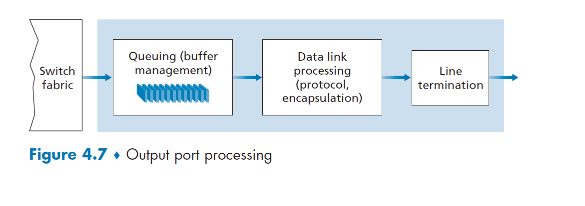

### 4.2.4. 什么地方发生排队

**time : 2021-06-15**

如果我们考虑显示在图 4-6 中的输图 4-7 输出端口处理入和输出端口功能及其配置，下列情况是一目了然的：在输入端口和输出端口处都可以形成分组队列，就像在环状交叉路的类比中我们讨论过的情况，即汽车可能等待在流量交叉点的入口和出口。排队的位置和程度（或者在输入端口排队，或者在输岀端口排队）将取决于流量负载、交换结构的相对速率和线路速率。我们现在更为详细一点考虑这些队列，因为随着这些队列的增长，路由器的缓存空间最终将会耗尽，并且当无内存可用于存储到达的分组时将会出现 **丢包(packet loss)**。回想前面的讨论，我们说过分组“在网络中丢失”或“被路由器丢弃”。正是在一台路由器的这些队列中，这些分组被实际丢弃或丢失。

假定输入线路速度与输出线路速度（传输速率）是相同的，均为 R(line)（单位为每秒分组数），并且有 N 个输入端口和 N 个输出端口。为进一步简化讨论，假设所有分组具有相同的固定长度，分组以同步的方式到达输入端口。这就是说，在任何链路发送分组的时间等于在任何链路接收分组的时间，在这样的时间间隔内，在一个输入链路上能够到达 0 个或 1 个分组。定义交换结构传送速率 R(switch)为从输入端口到输出端口能够移动分组的速率：如果 R(switch)比 R(line)快 N 倍，则在输入端口处仅会出现微不足道的排队。这是因为即使在最坏情况下，所有 N 条输入线路都在接收分组，并且所有的分组将被转发到相同的输出端口，每批 N 个分组（每个输入端口一个分组）也能够在下一批到达前通过交换结构处理完毕。

1. **输入排队**

如果交换结构不能快得（相对于输入线路速度而言）使所有到达分组无时延地通过它 传送，会发生什么情况呢？在这种情况下，在输入端口也将岀现分组排队，因为到达的分组必须加入输入端口队列中，以等待通过交换结构传送到输出端口。为了举例说明这种排队的重要后果，考虑纵横式交换结构，并假定：1. 所有链路速度相同；2. 一个分组能够以 一条输入链路接收一个分组所用的相同的时间量，从任意一个输入端口传送到给定的输出端口；3. 分组按 FCFS 方式，从一指定输入队列移动到其要求的输出队列中。只要其输出端口不同，多个分组可以被并行传送。然而，如果位于两个输入队列前端的两个分组是发 往同一输出队列的，则其中的一个分组将被阻塞，且必须在输入队列中等待，因为交换结构一次只能传送一个分组到某指定端口。

图 4-8 显示了一个例子，其中在输入队列前端的两个分组（带深色阴影）要发往同一个右上角输出端口。假定该交换结构决 定发送左上角队列前端的分组。在这种 情况下，左下角队列中的深色阴影分组 必须等待。但不仅该分组要等待，左下 角队列中排在该分组后面的浅色阴影分在时刻/的输岀端口竞 一能传输一个深色阴影分组组也要等待，即使右中侧输出端口（浅色阴影分组的目的地）中无竞争。这种浅色阴影分组经受了 HOL 阻寒现象叫作输入排队交换机中的 **线路前部(Head-Of-the-Line, HOL)阻塞**，即在一个输入队列中排队的分组必须等待通过交换结构发送（即使输出端口是空闲的），因为它被位于线路前部的另一个分组所阻塞。［Karol 1987 ］指出，由于 HOL 阻塞，只要输入链路上的分组到达速率达到其容量的 58%，在某些假设前提下，输入队列长度就将无限制地增大（不严格地讲，这等同于说将出现大量的丢包）。［McKeown 1997b］讨论了多种解决 HOL 阻塞的方法。

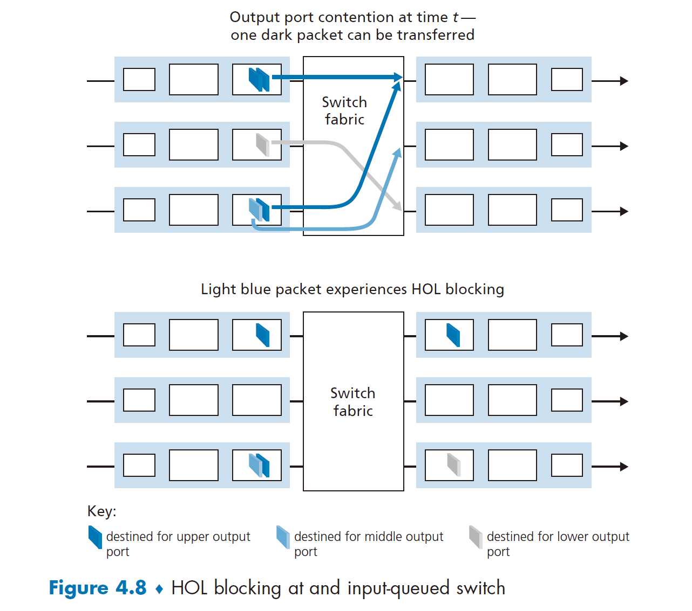

2. **输出排队**

我们接下来考虑在交换机的输出端口是否会出现排队。再次假定 R(switch)比 R(line)快 N 倍，并且到达 N 个输入端口的每个端口的分组，其目的地是相同的输出端口。在这种情况下，在向输出链路发送一个分组的时间内，将有 N 个新分组到达该输出端口（N 个输入端口的每个都到达 1 个）。因为输出端口在一个单位时间（该分组的传输时间）内仅能传输一个分组，这 N 个到达分组必须排队（等待）经输岀链路传输。在正好传输 N 个分组（这些 分组是前面正在排队的）之一的时间中，可能又到达 N 个分组，等等。所以，分组队列能够在输岀端口形成，即使交换结构比端口线路速率快 W 倍。最终，排队的分组数量能够变得足够大，耗尽输出端口的可用内存。

当没有足够的内存来缓存一个入分组时，就必须做出决定：要么丢弃到达的分组（采用一种称为 **弃尾(drop-tail)** 的策略），要么删除一个或多个已排队的分组为新来的分组腾 出空间。在某些情况下，在缓存填满之前便丢弃一个分组（或在其首部加上标记）的做法是有利的，这可以向发送方提供一个拥塞信号。已经提出和分析了许多分组丢弃与标记策略［Labrador 1999, Hollot 2002］，这些策略统称为 **主动队列管理(Active Queue Management, AQM)算法**。**随机早期检测(Random Early Detection, RED)** 算法是得到最广泛研究和实现的 AQM 算法之一 ［Christiansen 2001； Floyd 2016］。

在图 4-9 中图示了输出端口的排队情况。在时刻每个入端输入端口都到达了一个分组，每个分组都是发往最上侧的输岀端口。假定线路速度相同，交换机以 3 倍于线路速度的速度运行，一个时间单位（即接收或发送一个分组所需的时间）以后, 所有三个初始分组都被传送到输出端口，并排队等待传输。在下一个时间单位中，这三个分组中的一个将通过输出链路发送出去。在这个例子中，又有两个新分组已 到达交换机的入端；这些分组之一要发往 最上侧的输岀端口。这样的后果是，输出端口的 **分组调度(packet scheduler)** 在这些排队分组中选择一个分组来传输，这就是我们将在下节中讨论的主题。

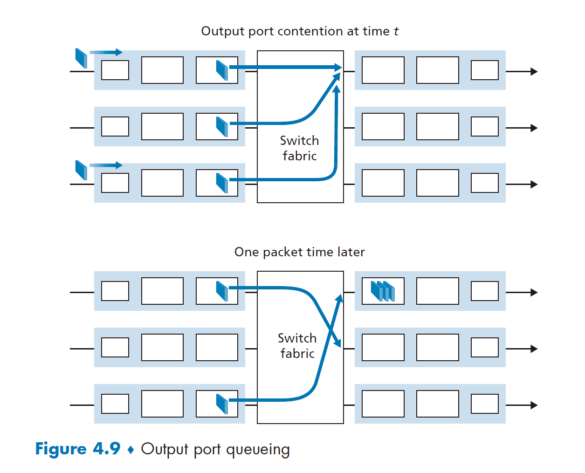

假定需要路由器缓存来吸收流量负载的波动，一个自然而然的问题就是需要多少缓存。多年以来，用于缓存长度的经验方法是［RFC 3439］，缓存数量（B）应当等于平均往返时延（RTT, 比如说 250ms）乘以链路的容量（C）。这个结果是基于相对少量的 TCP 流的排队动态性分析得到的［Villamizar 1994］。因此，一条具有 250ms RTT 的 10 Gbps 链路需要的缓存量等于 $B = RTT \cdotp C = 2.5 Gb$。然而，最近的理论和试验研究 ［Appenzeller 2004］表明，当有大量的 TCP 流（/V 条）流过一条链路时，缓存所需要的数量是 $B = RTT \cdot C / \sqrt N$。 对于通常有大量流经过的大型主干路由器链路（参见如［Fraleigh 2003］），N 的值可能非常大，所需的缓存长度的减小相当明显。［Appenzeller 2004； Wischik 2005； Beheshti 2008］从理论、实现和运行的角度提供了可读性很强的有关缓存长度问题的讨论。

### 4.2.5. 分组调度

现在我们转而讨论确定次序的问题，即排队的分组如何经输出链路传输的问题。以前 你自己无疑在许多场合都排长队等待过，并观察过等待的客户怎样被服务，你无疑也熟悉 路由器中常用的许多排队规则。有一种是先来先服务（FCFS, 也称之为先进先出 （FIFO））。这是英国人人共知的规则，用于病人就诊、公交车站和市场中的有序 FCFS 队 列。（哦，你排队了吗？）有些国家基于优先权运转，即给一类等待客户超越其他等待客户的优先权服务。也有循环排队，其中客户也被划分为类别（与在优先权队列一样），但每类用户依次序提供服务。

1. **先进先出**

图 4-11 显示了对于 **先进先出(First-In-First-Out, FIFO)** 链路调度规则的排 队模型的抽象。如果链路当前正忙于传 输另一个分组，到达链路输出队列的分 组要排队等待传输。如果没有足够的缓存空间来容纳到达的分组，队列的分组丢弃策略则确定该分组是否将被丢弃（丢失）或者从队列中去除其他分组以便为到达的分组腾出空间，如前所述。在下面的讨论中，我们将忽视分组丢弃。当一个分组通过输出链路完全传输（也就是接收服务）时，从队列中去除它。

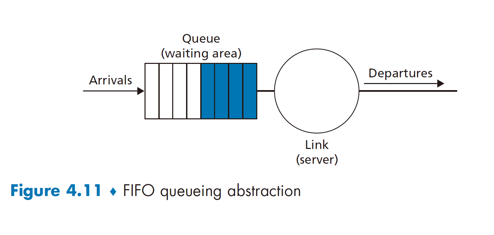

FIFO （也称为先来先服务，FCFS）调度规则按照分组到达输出链路队列的相同次序 来选择分组在链路上传输。我们都很熟悉服务中心的 FIFO 排队，在那里到达的顾客加入 单一等待队列的最后，保持次序，然后当他们到达队伍的前面时就接受服务。

图 4-12 显示了运行中的 FIFO 队列。分组的到达由上部时间线上带编号的箭头来指示，用编号指示了分组到达的次序。各个分组的离开表示在下部时间线的下面。分组在服务中（被传输）花费的时间是通过这两个时间线之间的阴影矩形来指示的。假定在这个例 子中传输每个分组用去 3 个单位时间。利用 FIFO 规则，分组按照到达的相同次序离开。 注意在分组 4 离开之后，在分组 5 到达之前链路保持空闲（因为分组 1 到 4 已经被传输并从队列中去除）。

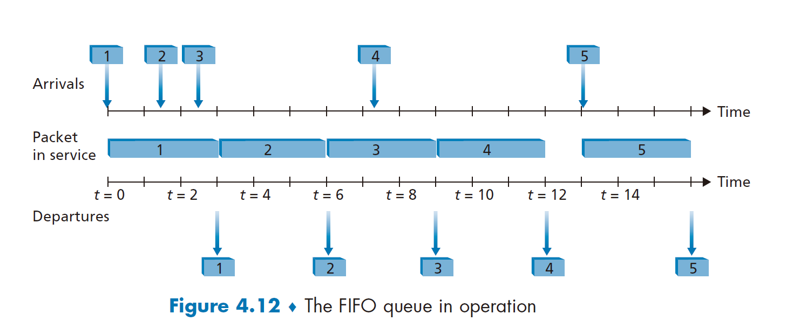

2. **优先权排队**

在 **优先权排队(priority queuing)** 规则下，到达输出链路的分组被分类放入输出 队列中的优先权类，如图 4-13 所示。在实践中，网络操作员可以配置一个队列，这样携带网络管理信息的分组（例如，由源或目的 TCP/UDP 端口号所标识）获得超过用户流量的优先权；此外，基于 IP 的实时话音分组可能获得超过非实时流量（如 SMTP 或 IMAP 电子邮件分组）的优先权。每个优先权类通常都有自己的队列。当选择一个分组传输时，优先权排队规则将从队列为非空（也就是有分组等待传输）的最高优先权类中传输一个分组。在同一优先权类的分组之间的选择通常以 FIFO 方式完成。

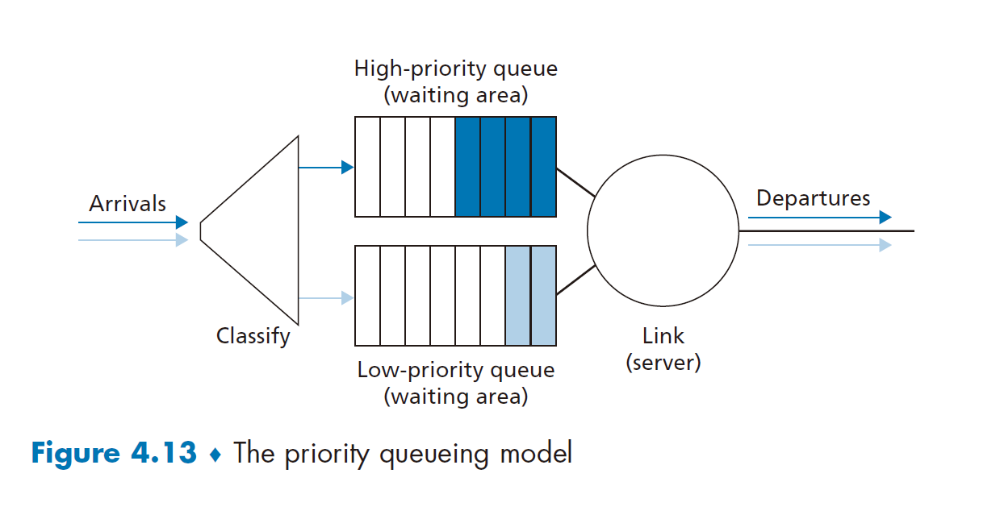

图 4-14 描述了有两个优先权类的一个优先权队列的操作。分组 1、3 和 4 属于高优先权类，分组 2 和 5 属于低优先权类。分组 1 到达并发现链路是空闲的，就开始传 输。在分组 1 的传输过程中，分组 2 和 3 到达，并分别在低优先权和高优先权队列中排队。在传输完分组 1 后，分组 3 （—个高优先权的分组）被选择在分组 2 （尽管它到达得较早，但它是一个低优先权分组）之前传输。在分组 3 的传输结束后，分组 2 开始传输。分组 4 （一个高优先权分组）在分组 2 （—个低优先权分组）的传输过程 中到达。在 **非抢占式优先权排队(non-preemptive priority queuing)** 规则下，一旦分组开始传输，就不能打断。在这种情况下，分组 4 排队等待传输，并在分组 2 传输完成之后开始传输。

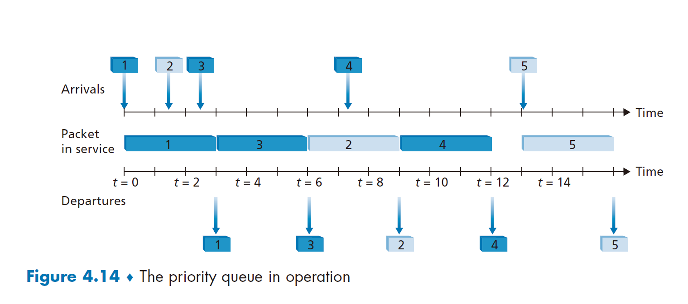

3. **循环和加权公平排队**

在 **循环排队规则(round robin queuing discipline)** 下，分组像使用优先权排队那样被分类。然而，在类之间不存在严格的服务优先权，循环调度器在这些类之间轮流提供服务。在最简单形式的循环调度中，类 1 的分组被传输，接着是类 2 的分组，接着又是类 1 的分组，再接着又是类 2 的分组，等等。一个所谓的 **保持工作排队(work-conserving queuing)** 规则在有(任何类的)分组排队等待传输时，不允许链路保持空闲。当寻找给定类的分组但是没有找到时，保持工作的循环规则将立即检查循环序列中的下一个类。

图 4-15 描述了一个两类循环队列的操作。在这个例子中，分组 1、2 和 4 属于第一类, 分组 3 和 5 属于第二类。分组 1 一到达输出队列就立即开始传输。分组 2 和 3 在分组 1 的 传输过程中到达，因此排队等待传输。在分组 1 传输后，链路调度器查找类 2 的分组，因 此传输分组 3 ：在分组 3 传输完成后，调度器查找类 1 的分组，因此传输分组 2。在分组 2 传输完成后，分组 4 是唯一排队的分组，因此在分组 2 后立刻传输分组 4。


一种通用形式的循环排队已经广泛地实现在路由器中，它就是所谓的加权公平排队(Weighted Fair Queuing, WFQ )规则 [Demers 1990 ； Parekh 1993 ； Cisco QoS 2016]。图 4-16 对 WFQ 进行了描述。其中，到达的分组被分类并在合适的每个 类的等待区域排队。与使用循环调度一 样，WFQ 调度器也以循环的方式为各个 类提供服务，即首先服务第 1 类，然后 服务第 2 类，接着再服务第 3 类，然后（假设有 3 个类别）重复这种服务模式。WFQ 也是一种保持工作排队规则，因此在发现一 个空的类队列时，它立即移向服务序列中的下一个类。

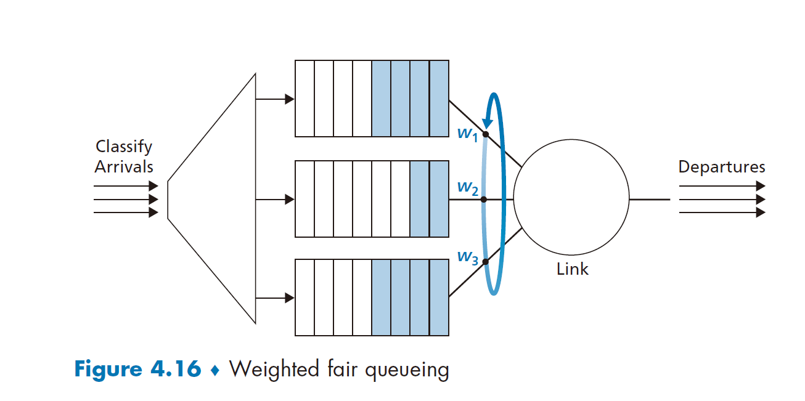

## 4.3. 网际协议：IPv4，寻址，IPv6

到目前为止，我们在第 4 章中对网络层的学习，包括网络层的数据平面和控制平面组件概念，转发和路由选择之间的区别，各种网络服务模型的标识和对路由器内部的观察, 并未提及任何特定的计算机网络体系结构或协议。在这节中，我们将关注点转向今天的 Internet 网络层的关键方面和著名的网际协议（IP）。

今天有两个版本的 IP 正在使用。在 4-3-1 节中，我们首先研究广泛部署的 IP 版本 4，这通常简单地称为 IPv4 [RFC 791]。在 4-3-5 节中，我们将仔细考察 IP 版本 6 [RFC 2460； RFC 4291]，它已经被提议替代 IPv4。在中间，我们将主要学习 Internet 编址，这是一个看起来相当枯燥和面向细节的主题，但是这对理解 Internet 网络层如何工作是至关重要的。掌握 IP 编址就是掌握 Internet 的网络层！

### 4.3.1. IPv4 数据报格式

前面讲过网络层分组被称为数据报。我们以概述 IPv4 数据报的语法和语义开始对 IP 的学习。你也许认为没有什么比 一个分组的比特的语法和语义更加枯燥无味的了。无论如何，数据报在 Internet 中起着重要作用，每个网络行业的学生和专业 人员都需要理解它、吸收它并掌握它（只是理解协议首部的确能够使学习成为有趣的事，请查阅[Pomeranz 2010] ）。IPv4 数据报格式如图 4-17 所示。

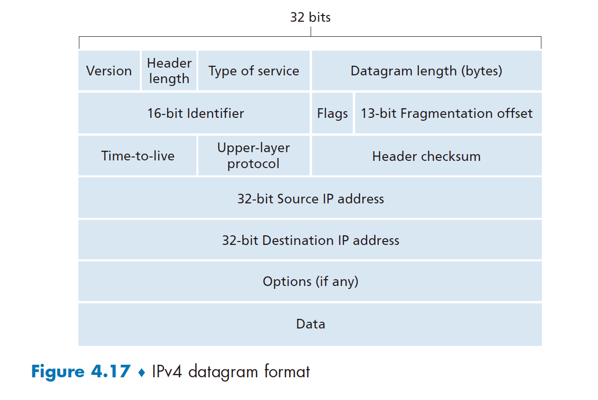

IPv4 数据报中的关键字段如下：

- **版本号**。。这 4 比特规定了数据报的 IP 协议版本。通过查看版本号，路由器能够确定如何解释 IP 数据报的剩余部分。不同的 IP 版本使用不同的数据报格式。 IPv4 的数据报格式如图 4-17 所示。新版本的 IP（IPv6）的数据报格式将在 4-3-5 节中讨论。
- **首部长度**。因为一个 IPv4 数据报可包含一些可变数量的选项（这些选项包括在 IPv4 数据报首部中），故需要用这 4 比特来确定 IP 数据报中载荷（例如在这个数据报中被封装的运输层报文段）实际开始的地方。大多数 IP 数据报不包含选项，所以一般的 IP 数据报具有 20 字节的首部。
- **服务类型**。服务类型（TOS）比特包含在 IPv4 首部中，以便使不同类型的 IP 数据报（例如，一些特别要求低时延、高吞吐量或可靠性的数据报）能相互区别开来。例如，将实时数据报（如用于 IP 电话应用）与非实时流量（如 FTP）区分开也许是有用的。提供特定等级的服务是一个由网络管理员对路由器确定和配置的策略问题。我们在 3-7-2 节讨论明确拥塞通告所使用的两个 TOS 比特时也学习过。
- **数据报长度**。这是 IP 数据报的总长度（首部加上数据），以字节计。因为该字段长为 16 比特，所以 IP 数据报的理论最大长度为 65 535 字节。然而，数据报 很少有超过 1500 字节的，该长度使得 IP 数据报能容纳最大长度以太网帧的载荷字段。
- **标识、标志、片偏移**。这三个字段与所谓 IP 分片有关，这是一个我们将很快要考虑的主题。有趣的是，新版本的 IP （即 IPv6）不允许在路由器上对分组分片。这部分内容不会在这里讨论，但是读者可以在更早版本的书中找到相关材料。
- **寿命**。寿命（Time-To-Live, TTL）字段用来确保数据报不会永远（如由于长时间的路由选择环路）在网络中循环。每当一台路由器处理数据报时，该字段的值减 1。若 TTL 字段减为 0，则该数据报必须丢弃。
- **上层协议**。该字段通常仅当一个 IP 数据报到达其最终目的地时才会有用。该字段值指示了 IP 数据报的数据部分应交给哪个特定的运输层协议。例如，值为 6 表明数据部分要交给 TCP，而值为 17 表明数据要交给 UDP。对于所有可能值的列表，参见[IANA Protocol Numbers 2016 ] 。注意在 IP 数据报中的协议号所起的作 用，类似于运输层报文段中端口号字段所起的作用。协议号是将网络层与运输层绑定到一起的黏合剂，而端口号是将运输层和应用层绑定到一起的黏合剂。我们将在第 6 章看到，链路层帧也有一个特殊字段用于将链路层与网络层绑定到一起。
- **首部检验和**。首部检验和用于帮助路由器检测收到的 IP 数据报中的比特错误。首 部检验和是这样计算的：将首部中的每 2 个字节当作一个数，用反码算术对这些 数求和。如在 3. 3 节讨论的那样，该和的反码（被称为 Internet 检验和）存放在检 验和字段中。路由器要对每个收到的 IP 数据报计算其首部检验和，如果数据报首 部中携带的检验和与计算得到的检验和不一致，则检测岀是个差错。路由器一般 会丢弃检测出错误的数据报。注意到在每台路由器上必须重新计算检验和并再次 存放到原处，因为 TTL 字段以及可能的选项字段会改变。关于计算 Internet 检验和 的快速算法的有趣讨论参见[RFC 1071 ]。 此时，一个经常问的问题是：为什么 TCP/IP 在运输层与网络层都执行差错检测？这种重复检测有几种原因。首先，注 意到在 IP 层只对 IP 首部计算了检验和，而 TCP/UDP 检验和是对整个 TCP/UDP 报 文段进行的。其次，TCP/UDP 与 IP 不一定都必须属于同一个协议栈。原则上, TCP 能够运行在一个不同的协议（如 ATM）上:Black 1995]，而 IP 能够携带不一定要传递给 TCP/UDP。
- **源和目的 IP 地址**。当某源生成一个数据报时，它在源 IP 字段中插入它的 IP 地 址，在目的 IP 地址字段中插入其最终目的地的地址。通常源主机通过 DNS 查找来决定目的地址，如在第 2 章中讨论的那样。我们将在 4-3-3 节中详细讨论 IP 编址。
- **选项**。选项字段允许 IP 首部被扩展。首部选项意味着很少使用，因此决定对每个数据报首部不包括选项字段中的信息，这样能够节约开销。然而，少量选项的存 在的确使问题复杂了，因为数据报首部长度可变，故不能预先确定数据字段从何处开始。而且还因为有些数据报要求处理选项，而有些数据报则不要求，故导致一台路由器处理一个 IP 数据报所需的时间变化可能很大。这些考虑对于高性能路由器和主机上的 IP 处理来说特别重要。由于这样或那样的原因，在 IPv6 首部中已去掉了 IP 选项，如 4-3-4 节中讨论的那样。
- **数据（有效载荷）**。我们来看看最后也是最重要的字段.这是数据报存在的首要理由！在大多数情况下，IP 数据报中的数据字段包含要交付给目的地的运输层报文段（TCP 或 UDP）。然而，该数据字段也可承载其他类型的数据，如 ICMP 报文 （在 5-6 节中讨论）。

注意到一个 IP 数据报有总长为 20 字节的首部（假设无选项）。如果数据报承载一个 TCP 报文段，则每个（无分片的）数据报共承载了总长 40 字节的首部（20 字节的 IP 首部加上 20 字节的 TCP 首部）以及应用层报文。

### 4.3.2. IPv4 编址

在本节我们讨论 IPv4 编址。

然而，在讨论 IP 编址之前，我们需要简述一下主机和路由器接入网络的方法。一台主机通常只有一条链路连接到网络；当主机发送一个数据报时，数据报就在这条链路上发送。主机与链路之间的边界叫作 **接口(interface)**。我们现在来考虑一台路由器的接口。因为路由器的任务是从链路上接收数据报并从其他链路转发出去，那么路由器必须要有两条或更多链路。路由器和它的任意一条链路之间的边界也叫接口。一台路由器因此有多个接口，每个接口对应着一条链路。每台主机和路由器都能发送和接收 IP 数据报，因此 IP 规定每台主机和路由器的接口都要有一个 IP 地址。实际上，一个 IP 地址是和一个接口相关联的，而不是与它的主机或路由器相关联的。

每个 IP 地址的长度为 32 比特（4 字节），因此总共有 2^32 个（大约 40 亿个）可能的 IP 地址。这些地址通常按所谓的 **点分十进制记法(dotled-decimal notation)** 表示。这种表示方法规定：IP 地址中的每个字节用它对应的十进制数表示，4 个字节的十进制表示数间用句号隔开。举个例子，考虑 IP 地址 193.32.216.9。193 是这个 IP 地址的第一个字节的十进制表示数，32 是该地址的第二个字节的十进制表示数，依次类推。因此，193.32.216.9 的二进制记法是: 11000001 00100000 11011000 00001001。

Internet 中的每台主机和路由器上的每个接口，都有一个唯一的 IP 地址（在 NAT 后面的接口除外，详见在第 4-3-3 节）。然而，这些地址有一定的规则：一个子网中主机的 IP 地址和这个子网所连接口的 IP 地址相关。

图 4-18 举了一个例子。在这张图中，一台有 3 个接口的路由器互联了 7 台主机。如果你仔细观察主机和路由器接口的 IP 地址，你会发现一个规律。图 4-18 中左上侧的 3 台主机的接口和它们所连接路由器的接口，都有一个形如 223.1.1.xxx 的 IP 地址。或者说，这些接口 IP 地址左侧的 3 字节是相同的。这 3 台主机的接口和路由器接口可以通过一台以太网交换机互联（我们将在第 6 章讨论），或通过一个无线接入点互联（我们将在第 7 章讨论）。我们现在将这个网络表示为一朵云，在第 6、7 章中再深入讨论。

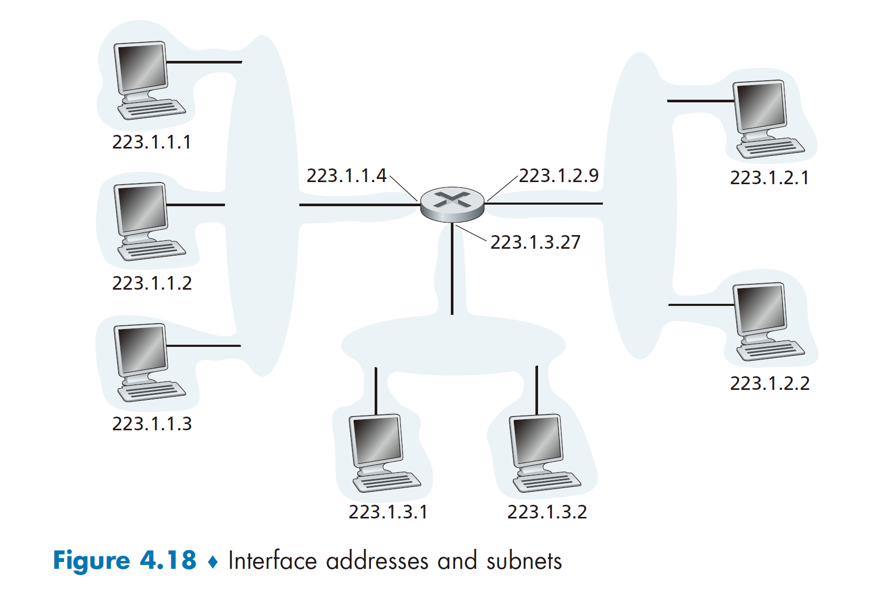

用 IP 的术语来说，这个网络称为一个 **子网(subnet)** [RFC 950]。（在 Internet 文献中，子网也称为 IP 网络或直接称为网络。）IP 给这个子网分配了一个 **子网掩码(network mask)**： 223.1.1.0/24。这个子网掩码表示该子网中所有接口的 IP 地址左侧的 24 位和 223.1.1.0 相同。因此子网 223.1.1.0/24 中，3 个主机接口（223.1.1.1、223.1.1.2 和 223.1.1.3 ）和 1 个路由器接口（223.1.1.4）的地址都具有 223.1.1.xxx 的形式。任何其他要连到 223.1.1.0/24 子网的主机地址都具有 223.1.1.xxx 的形式。图 4-18 中还表示了另外两个子网：223.1.2.0/24 和 223.1.3.0/24。图 4-19 图示了 4-18 中 3 个子网的子网掩码。

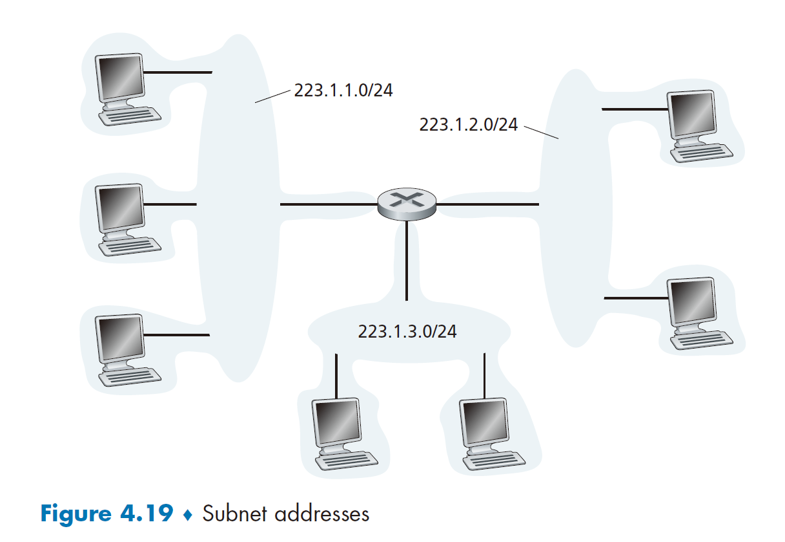

子网并不局限图 4-18 中表示的例子，实际上子网的概念更加广泛。考虑图 4-20，这张图中显示了 3 台彼此互联的路由器。每台路由器有 3 个接口，一个接口用于将路由器连接到一对主机，而另外 2 个接口用于和其他路由器互联。这张图中一共有几个子网呢？首先，肯定有 3 个子网：223.1.1.0/24、223.1.2.0/24 和 223.1.3.0/24，类似于我们在图 4-18 中遇到的子网。但注意到在本例中还有其他 3 个子网：一个子网是 223.1.9.0/24，用于连接路由器 R1 与 R2 的接口；另外一个子网是 223.1.8.0/24，用于连接路由器 R2 与 R3 的接口；第三个子网是 223.1.7.0/24，用于连接路由器 R3 与 R1 的接口。一般地，在一个路由器和主机地互联系统中，我们忽略掉主机和路由器本身，将它们的接口抽象为一个点，那么这些点在对应的实际互联情况下，会形成几个不连通的图，这些图就是 **子网(subnet)**。

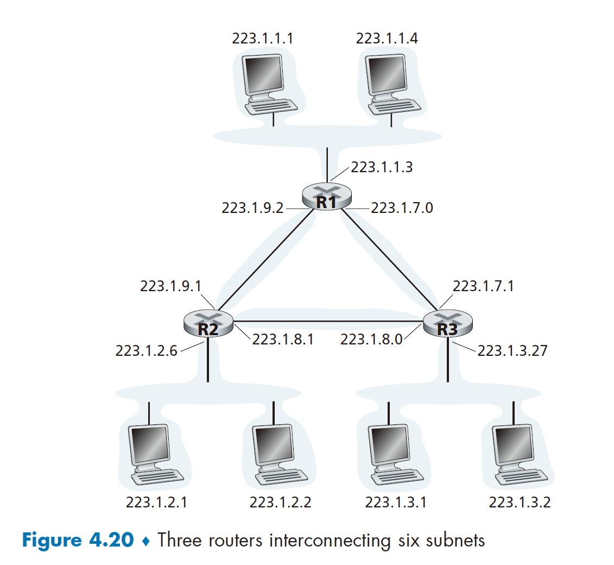

现在我们来讨论在 Internet 中是如何编址的。

Internet 的编址方案被称为 **无类别域间路由(Classless Interdomain Routing, CIDR)** [RFC 4632]。CIDR 将子网寻址的概念一般化了。当使用子网寻址时，32 比特的 IP 地址被划分为两部分，并且也具有点分十进制数形式 a.h.c.d/x，其中 x 指示了地址的第一部分中的比特数。

形式为 a.b.c.d/x 的地址的 x 最高比特构成了 IP 地址的网络部分，并且经常被称为该地址的 **前缀(prefix)**。一个组织通常被分配一块连续的地址，即具有相同前缀的一段地址。在这种情况下，该组织内部的设备的 IP 地址将共享共同的前缀。当我们在 5-4 节中谈到 Internet 的 BGP 路由选择协议时，将看到该组织网络外部的路由器仅考虑前面的前缀比特 x。这就是说，当该组织外部的一台路由器向这个组织内部转发一个数据报时，仅需要考虑该地址的前面 x 比特。

一个地址剩余的 32-x 比特用于区分该组织内部设备。当该组织内部的路由器转发分组时，才会考虑这些比特。剩下的比特可以划分另外的子网，例如，假设地址 a.b.c.d/21 的前 21 比特定义了该组织的网络前缀，该组织中所有主机 IP 地址的前缀是相同的，其余的 11 比特区分了该组织内的主机。该组织的内部还可以使用最右边的 11 比特在该组织中划分另外的子网，就像前面所讨论的那样，例如，a.b.c.d/24 可以表示该组织的另一个子网。

在 CIDR 被采用之前，IP 地址的网络部分被限制为长度为 8、16 或 24 比特，这是一种称为 **分类编址(classful address1ng)** 的编址方案，这是因为具有 8、16 和 24 比特子网地址的子网分别被称为 A、B 和 C 类网络。一个 IP 地址的网络部分正好为 1、2 或 3 字节的要求，已经在支持数量迅速增加的具有小规模或中等规模子网的组织方面出现了问题。一个 C 类（/24）子网仅能容纳多达 2^8 - 2 = 254 （2^8 =256，其中的两个地址预留用于特殊用途）台主机，这对于许多组织来说太小了。然而一个 B 类（/16）子网可支持多达 65534 台主机，又太大了。在分类编址方法下，比方说一个有 2000 台主机的组织通常被分给一个 B 类（/16）地址。这就导致了 B 类地址空间的迅速损耗以及所分配的地址空间的利用率低下。例如，为具有 2000 台主机的组织分配一个 B 类地址，就具有足以支持多达 65534 个接口的地址空间，剩下的超过 63000 个地址却不能被其他组织使用。

最后我们必须提及一个特殊但十分重要的 IP 地址，**广播地址** ：255.255.255.255。当一台主机发出一个目的地址为 255.255.255.255 的数据报时，该报文会交付给同一个子网中的所有主机。路由器也会有选择地向邻近的子网转发该报文。

到现在为止，我们已经详细地学习了 IP 编址，但我们还需要知道主机或子网最初是怎么获得它们的地址的。我们先讨论一个组织是怎么得到一个地址块的，然后讨论看该组织内部的一台主机是怎么被分配到一个地址的。

1. **获取一块地址**

一个组织要获得一个地址块时，该组织的网络管理员首先会与他的 ISP 联系，该 ISP 会从已分给它的更大地址块中划分一块地址。例如，该 ISP 也许自己已被分配了地址块 200.23.16.0/20。该 ISP 可以依次将该地址块分成 8 个长度相等的连续地址块，为本 ISP 支持的最多达 8 个组织中的一个分配这些地址块中的一块，如下所示。（为了便于查看，我们已将这些地址的网络部分加了下划线。）

| ISP 的地址块 | 200.23.16.0/20 | <u>11001000 00010111 0001</u>0000 00000000 |
| ------------ | -------------- | ------------------------------------------ |
| 组织 0       | 200.23.16.0/23 | <u>11001000 00010111 0001000</u>0 00000000 |
| 组织 1       | 200.23.18.0/23 | <u>11001000 00010111 0001001</u>0 00000000 |
| 组织 2       | 200.23.20.0/23 | <u>11001000 00010111 0001010</u>0 00000000 |
| ...          | ...            | ...                                        |
| 组织 7       | 200.23.30.0/23 | <u>11001000 00010111 0001111</u>0 00000000 |

尽管从一个 ISP 获取一组地址是一种得到一块地址的方法，但这不是唯一的方法。显然，必须还有一种方法供 ISP 本身得到一块地址。是否有一个全球性的权威机构，它具有管理 IP 地址空间并向各 ISP 和其他组织分配地址块的最终责任呢？的确有一个！IP 地址由 Internet 域名和编号分配机构（Internet Corporation for Ass1gned Names and Numbers, ICANN）［ICANN 2016］管理，管理规则基于［RFC 7020］。非营利的 ICANN 组织［NTIA 1998］的作用不仅是分配 IP 地址，还管理 DNS 根服务器。它还有一项容易引起争论的工 作，即分配域名与解决域名纷争。ICANN 向区域性 Internet 注册机构（如 ARIN、RIPE、 APNIC 和 LACNIC）分配地址，这些机构一起形成了 ICANN 的地址支持组织［ASO- ICANN 2016］，处理本区域内的地址分配/管理。

2. **获取主机地址：动态主机配置协议**

某组织一旦获得了一块地址，它就可为本组织内的主机与路由器接口逐个分配 IP 地址。系统管理员通常手工配置路由器中的 IP 地址（常常在远程通过网络管理工具进行配置）。主机地址也能手动配置，但是这项任务目前更多的是使用 **动态主机配置协议(Dynamic Host Configuration, DHCP)** ［RFC 2131］来完成。DHCP 允许主机自动获取（被分配）一个 IP 地址。网络管理员能够配置 DHCP，以使某给定主机每次与网络连接时能得到一个相同的 IP 地址，或者某主机将被分配一个 **临时的 IP 地址(tempomry IP address)**，每次与网络连接时该地址也许是不同的。除了主机 IP 地址分配外，DHCP 还允许一台主机得知其他信息，例如它的子网掩码、它的第一跳路由器地址（常称为默认网关）与它的本地 DNS 服务器的地址。

由于 DHCP 有自动分配给主机一个 IP 地址的相关能力，故它又常被称为 **即插即用协议(plug-and-play protocol)** 或 **零配置(zeroconf)协议**。这种能力对于网络管理员来说非常有吸引力，否则他将不得不手工执行这些任务！ DHCP 还广泛地用于住宅 Internet 接入网、企业网与无线局域网中，其中的主机频繁地加入和离开网络。例如，考虑一个学生带着便携机从宿舍到图书馆再到教室。很有可能在每个位置这个学生将连接到一个新的子网，因此在每个位置都需要一个新的 IP 地址。DHCP 是适合这种情形的理想方法，因为有许多用户来来往往，并且仅在有限的时间内需要地址。DHCP 的即插即用能力的价值是显然的，因为下列情况是不可想象的：系统管理员在每个位置能够重新配置便携机，并且少数学生（除了那些上过计算机网络课程的学生）让专家人工地配置他们的便携机。

**time : 2021-06-16**

DHCP 是一个客户-服务器协议。客户通常是新到达的主机，它要获得包括自身使用的 IP 地址在内的网络配置信息。在最简单场合下，每个子网（在图 4-20 的编址意义下） 将具有一台 DHCP 服务器。如果在某子网中没有服务器，则需要一个 DHCP 中继代理（通常是一台路由器），这个代理知道用于该网络的 DHCP 服务器的地址。图 4-23 表示了连接到子网 223.1.2/24 的一台 DHCP 服务器，具有一台提供中继代理服务的路由器，它为连接到子网 223.1.1/24 和 223.1.3/24 的到达客户提供 DHCP 服务。在我们下面的讨论中，将假定 DHCP 服务器在该子网上是可供使用的。

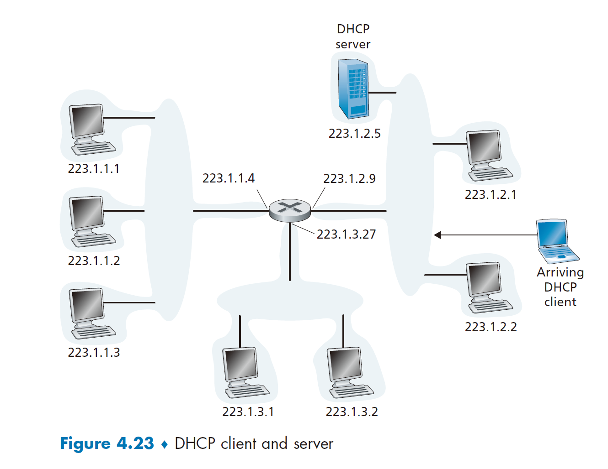

对于一台新到达的主机而言，针对图 4-23 所示的网络设置，DHCP 协议是一个 4 个步骤的过程，如图 4-24 中所示。在这幅图中，yiddr （表示“你的 Internet 地址”之意）指示分配给该新到达客户的地址。

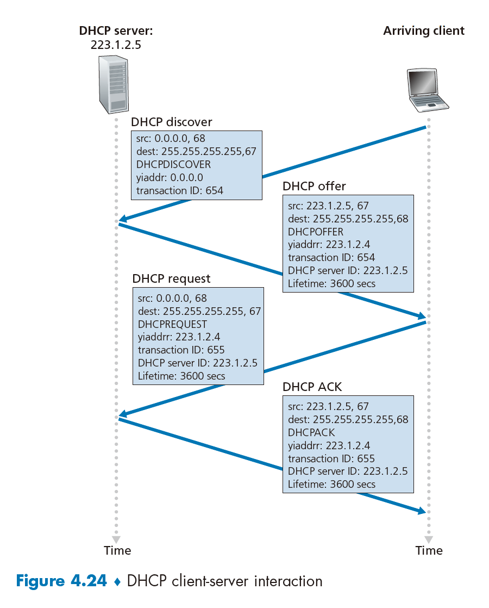

这 4 个步骤依次是：

1. **客户发现 DHCP 服务器**。

新到达的主机的第一个任务就是发现它的 DHCP 服务器。客户首先使用 UDP 运输层协议发送一个 **DHCP 发现报文(DHCP discover message)**，之后对应的报文段将被封装在一个数据报中。可是这个数据报的发送对象是谁呢？主机甚至不知道它的 IP 地址，更不用说 DHCP 服务器的 IP 地址了。在这种情况下，广播地址的作用就显现了出来。DHCP 客户将使用源地址 0.0.0.0:68 向目的地址 255.255.255.255:67 发送该数据报。数据报在链路层将被广播到所有与该子网连接地节点。（我们将在 6. 4 节中涉及链路层广播的细节）

2. **DHCP 服务器提供 IP 地址**

DHCP 服务器收到一个 DHCP 发现报文后，用 **DHCP 提供报文(DHCP offer message)** 对客户进行响应，该报文向该子网的所有节点广播，仍然使用 IP 广播地址 255.255.255.255 (你也许要思考一下这个服务器为何也必须采用广播)。在子网中可能存在多个 DHCP 服务器，客户也许能收到多个 DHCP 提供报文。每台服务器提供的报文包含有收到的发现报文的事务 ID、向客户推荐的 IP 地址、网络掩码以及 **IP 地址租用期(address lease time)**，即 IP 地址有效的时间量。服务器租用期通常设置为几小时或几天[Droms 2002]。

3. **DHCP 请求**

新到达的客户从一个或多个服务器提供中选择一个，并向选中的服务器提供用 **DHCP 请求报文(DHCP request message)** 进行响应，回显配置的 参数。

4. **DHCP 确认**

服务器用 **DHCP ACK 报文(DHCP ACK message)** 对 DHCP 请求报文进行响应，证实所要求的参数。

一旦客户收到 DHCP ACK 后，交互便完成了，并且该客户能够在租用期内使用 DHCP 分配的 IP 地址。因为客户可能在该租用期超时后还希望使用这个地址，所以 DHCP 还提供了一种机制以允许客户更新它对一个 IP 地址的租用。

从移动性角度看，DHCP 确实有非常严重的缺陷。因为每当节点连到一个新子网，要从 DHCP 得到一个新的 IP 地址，当一个移动节点在子网之间移动时，就不能维持与远程应用之间的 TCP 连接。在第 6 章中，我们将研究移动 IP,它是一种对 IP 基础设施的扩展, 允许移动节点在网络之间移动时使用其单一永久的地址。有关 DHCP 的其他细节可在［Droms 2002］与［dhc 2016］中找到。一个 DHCP 的开放源码参考实现可从 Internet 系统协会［ISC2016］得到。

### 4.3.3. 网络地址转换(NAT)

讨论了有关 Internet 地址和 IPv4 数据报格式后，我们现在认识到每个课联网设备都需要一个 IP 地址。随着所谓小型办公室、家庭办公室(Small Office, Home Office, SOHO)子网的大量出现，每当一个 SOHO 想安装一个 LAN 以互联多台设备时，就需要 ISP 分配一组地址以供该 SOHO 的所有 IP 设备(包括电话、平板电脑、 游戏设备、IPTV、打印机等)使用。如果该子网变大了，则需要分配一块较大的地址。 但如果 ISP 已经为 SOHO 网络的当前地址范围分配过一块连续地址该怎么办呢？在这种情况下，有一种简单的方法越来越广泛地用在这些场合：**网络地址转换(Network Address Translation, NAT)** [RFC 2663; RFC 3022; Huston 2004, Zhang 2007; Huston 2017]。

图 4-25 显示了一台运行 NAT 的路由器。位于家中运行 NAT 的路由器有一个接口，该接口是图 4-25 中右侧所示家庭网络的一部分。在家庭网络内的编址就像我们在上面看到的完全一样，其中的所有 4 个接口都具有相同的网络地址 10.0.0/24。地址空间 10.0.0.0/8 是在［RFC 1918］中保留的三部分 IP 地址空间之一，这些地址用于如图 4-25 中的家庭网络等 **专用网络(private network)** 或具有 **专用地址的地域(realm with private address)**。具有专用地址的地域是指其地址仅对该网络中的设备有意义的网络。为了明白它为什么重要，考虑有数十万家庭网络这样的事实，许多使用了相同的地址空间 10.0.0.0/24。在一个给定家庭网络中的设备能够使用 10.0.0.0/24 编址彼此发送分组。然而，转发到家庭网络之外进入更大的全球 Internet 的分组显然不能使用这些地址(或作为源地址，或作为目的地址)，因为有数十万的网络使用着这块地址。这就是说，10.0.0.0/24 地址仅在给定的网络中才有意义。但是如果专用地址仅在给定的网络中才有意义的话，当向或从全球 Internet 发送或接收分组时如何处理编址问题呢，地址在何处才必须是唯一的呢？答案在于理解 NAT。

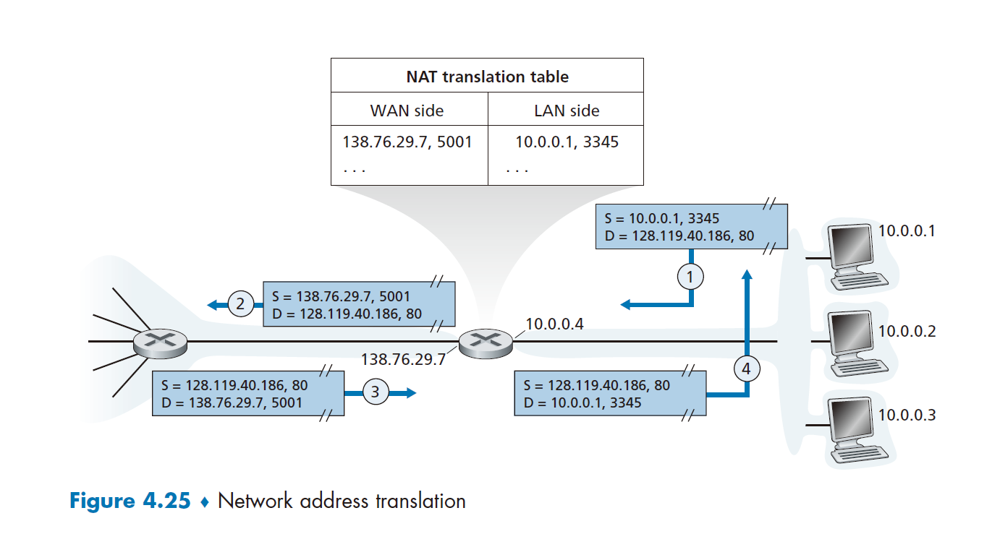

运行 NAT 的路由器对于外部世界来说甚至不像一台路由器。相反运行 NAT 的路由器对外界的行为就如同一个具有单一 IP 地址的单一设备。在图 4-25 中，所有离开家庭路由器流向更大 Internet 的报文都拥有一个源 IP 地址 138.76.29.7，且所有进入家庭的报文都拥有同一个目的 IP 地址 138.76.29.7。从本质上讲，NAT 使能路由器对外界隐藏了家庭网络的细节。(另外，你也许想知道家庭网络计算机是从哪儿得到其地址，路由器又是从哪儿得到它的单一 IP 地址的。在通常的情况下，答案是相同的，即 DHCP！路由器从 ISP 的 DHCP 服务器得到它的地址，并且路由器运行一个 DHCP 服务器，为位于 NAT-DHCP 路由器控制的家庭网络地址空间中的计算机提供地址。)

如果从广域网到达 NAT 路由器的所有数据报都有相同的目的 IP 地址（特别是对 NAT 路由器广域网一侧的接口），那么该路由器怎样知道它应将某个分组转发给哪个内部主机呢？技巧就是使用 NAT 路由器上的一张 **NAT 转换表(NAT translation table)**，并且在表项中包含了端口号及其 IP 地址。

考虑图 4-25 中的例子。假设一个用户坐在家庭网络主机 10.0.0.1 后，请求 IP 地址为 128.119.40.186 的某台 Web 服务器（端口 80）上的一个 Web 页面。主机 10.0.0.1 为其指派了（任意）源端口号 3345 并将该数据报发送到 LAN 中。NAT 路由器收到该数据报，为该数据报生成一个新的源端口号 5001，将源 IP 替代为其广域网一侧接口的 IP 地址 138.76.29.7，且将源端口 3345 更换为新端口 5001。当生成一个新的源端口号时，NAT 路由器可选择任意一个当前未在 NAT 转换表中的源端口号。（注意到因为端口号字段为 16 比特长，NAT 协议可支持超过 60000 个并行使用路由器广域网一侧单个 IP 地址的连接！）路由器中的 NAT 也在它的 NAT 转换表中增加一表项。Web 服务器并不知道刚到达的包含 HTTP 请求的数据报已被 NAT 路由器进行了改装，它会发回一个响应报文，其目的地址是 NAT 路由器的 IP 地址，其目的端口是 5001。当该报文到达 NAT 路由器时，路由器使用目的 IP 地址与目的端口号从 NAT 转换表中检索出家庭网络浏览器使用的适当 IP 地址 （10.0.0.1）和目的端口号（3345）。于是，路由器重写该数据报的目的 IP 地址与目的端口号，并向家庭网络转发该数据报。

NAT 在近年来已得到了广泛的应用。但是 NAT 并非没有贬低者。首先，有人认为端口号是用于进程寻址的，而不是用于主机寻址的。这种违规用法对于运行在家庭网络中的服务器来说确实会引起问题，因为正如我们在第 2 章所见，服务器进程在周知端口号上等待入请求，并且 P2P 协议中的对等方在充当服务器时需要接受入连接。对这些问题的技术解决方案包括 NAT 穿越（NAT traversal）工具［RFC 5389 ］和通用即插即用（Universal Plug and Play, UPnP）。UPnP 是一种允许主机发现和配置邻近 NAT 的协议［UIFP Forum2016］。

其次，纯粹的体系结构者提出了更为“原理性的”反对 NAT 的意见。这时，关注焦点在于路由器是指第三层（即网络层）设备，并且应当处理只能达到网络层的分组。NAT 违反主机应当直接彼此对话这个原则，没有干涉节点修改 IP 地址，更不用说端口号。但不管喜欢与否，NAT 已成为 Internet 的一个重要组件，成为所谓 **中间盒** [Sekar 2011]，它运行在网络层并具有与路由器十分不同的功能。中间盒并不执行传统的数据报转发，而是执行诸如 NAT、流量流的负载均衡、流量防火墙等功能。我们将在随后的 4-4 节学习的通用转发范例，除了传统的路由器转发外，还允许一些这样的中间盒功能，从而以通用、综合的方式完成转发。

**检查数据报：防火墙和入侵检测系统**

假定你被赋予了管理家庭网络、部门网络、大学网络或公司网络的任务。知道你网络 IP 地址范围的攻击者，能够方便地在此范围中发送 IP 数据报进行寻址。这些数据报 能够做各种不正当的事情，包括用 ping 搜索和端口扫描形成你的网络图，用恶意分组使 易受攻击的主机崩溃，扫描你网络中服务器上的开放 TCP/UDP 端口，并且通过在分组中带有恶意软件来感染主机。作为网络管理员，你准备做些什么来将这些能够在你的网 络中发送恶意分组的坏家伙拒之门外呢？对抗恶意分组攻击的两种流行的防御措施是防火墙和入侵检测系统（IDS）。

作为一名网络管理员，你可能首先尝试在你的网络和因特网之间安装一台防火墙。（今天大多数接入路由器具有防火墙能力。）防火墙检查数据报和报文段首部字段，拒绝 可疑的数据报进入内部网络。例如，一台防火墙可以被配置为阻挡所有的 ICMP 回显请 求分组（参见 5.6 节），从而防止了攻击者横跨你的 IP 地址范围进行传统的端口扫描。 防火墙也能基于源和目的 IP 地址以及端口号阻挡分组。此外，防火墙能够配置为跟踪 TCP 连接，仅许可属于批准连接的数据报进入。

IDS 能够提供另一种保护措施。IDS 通常位于网络的边界，执行“深度分组检查”，不仅检查数据报（包括应用层数据）中的首部字段，而且检查其有效载荷。IDS 具有一 个分组特征数据库，这些特征是已知攻击的一部分。随着新攻击的发现，该数据库自动 更新特征。当分组通过 IDS 时，IDS 试图将分组的首部字段和有效载荷与其特征数据库 中的特征相匹配。如果发现了这样的一种匹配，就产生一个告警。入侵防止系统（IPS） 与 IDS 类似，只是除了产生告警外还实际阻挡分组。在第 8 章中，我们将更为详细地研究防火墙和 IDS。

防火墙和 IDS 能够全面保护你的网络免受所有攻去吗？答案显然是否定的，因为攻击者继续寻找特征还不能匹配的新攻击方法。但是防火墙和传统的基于特征的 IDS 在保 护你的网络不受已知攻击入侵方面是有用的。

### 4.3.4. IPv6

在 20 世纪 90 年代早期，Internet 工程任务组就开始致力于开发一种替代 IPv4 的协议。该努力的首要动机是以下现实：由于新的子网和 IP 节点以惊人的增长率连到 Internet 上（并被分配唯一的 IP 地址），32 比特的 IP 地址空间即将用尽。为了应对这种对大 IP 地址空间的需求，开发了一种新的 IP 协议，即 IPv6。IPv6 的设计者还利用这次机会，在 IPv4 积累的运行经验基础上加进和强化了 IPv4 的其他方面。

IPv4 地址在什么时候会被完全分配完（因此没有新的网络再能与 Internet 相连）是一个相当有争议的问题。IETF 的地址寿命期望工作组的两位负责人分别估计地址将于 2008 年和 2018 年用完[Solensky 1996]。在 2011 年 2 月，IANA 向一个区域注册机构分配完了未分配 IPv4 地址的最后剩余地址池。这些注册机构在它们的地址池中还有可用的 IPv4 地址，一旦用完这些地址，从中央池中将再也分配不出更多的可用地址块了 [Huston 2011a]。IPv4 地址空间耗尽的近期调研以及延长该地址空间的寿命所采取的步骤见[Richter 2015]。

尽管在 20 世纪 90 年代中期对 IPv4 地址耗尽的估计表明，IPv4 地址空间耗尽的期限还 有可观的时间，但人们认识到，如此大规模地部署一项新技术将需要可观的时间，因此研 发 IP 版本 6 （IPv6） [RFC 2460]的工作开始了 [RFC 1752]。（一个经常问的问题是:IPv5 出了什么情况？人们最初预想 ST-2 协议将成为 IPv5，但 ST-2 后来被舍弃了。）有关 IPv6 的优秀信息来源见[Huitema 1998]。

1. **IPv6 数据报格式**

IPv6 数据报的格式如图 4-26 所示。

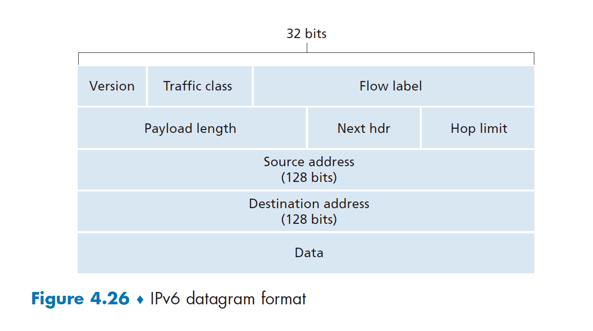

一下是 IPv6 最重要的变化：

- **扩大的地址容量**。全世界将不会用尽 IP 地址。现在，地球上的每个沙子都可以用 IP 地址寻址了。除了单播与多播地址以外，IPv6 还引入了一种称为 **任播地址(anycast address)** 的新型地址，这种地址可以使数据报交付给一组主机中的任意一个。（例如，这种特性可用于向一组包含给定文档的镜像站点中的最近一个发送 HTTP GET 报文。）
- **简化高效的 40 字节首部**。如下面讨论的那样，许多 IPv4 字段已被舍弃或作为选项。因而所形成的 40 字节定长首部允许路由器更快地处理 IP 数据报。一种新的选项编码允许进行更灵活的选项处理。
- **流标签**。IPv6 有一个难以捉摸的 **流(flow)** 定义。RFC 2460 中描述道，该字段可 用于“给属于特殊流的分组加上标签，这些特殊流是发送方要求进行特殊处理的 流，如一种非默认服务质量或需要实时服务的流”。例如，音频与视频传输就可能被当作一个流。另一方面，更为传统的应用（如文件传输和电子邮件）就不可能 被当作流。由高优先权用户（如某些为使其流量得到更好服务而付费的用户）承载的流量也有可能被当作一个流。然而，IPv6 的设计者显然已预见到最终需要能够区分这些流，即使流的确切含义还未完全确定。

如上所述，比较图 4-26 与图 4-17 就可看岀，IPv6 数据报的结构更简单、更高效。以下是在 IPv6 定义的字段：

- **版本**。该 4 比特字段用于标识 IP 版本号。毫不奇怪，IPv6 将该字段值设为 6。注意到意到将该字段值置为 4 并不能创建一个合法的 IPv4 数据报。（如果这样的话，事情就简单多了，参见下面有关从 IPv4 向 IPv6 迁移的讨论。）
- **流量类型**。该 8 比特字段与我们在 IPv4 中看到的 TOS 字段的含义相似。
- **流标签**。如上面讨论过的那样，该 20 比特的字段用于标识一条数据报的流，能够对一条流中的某些数据报给出优先权，或者它能够用来对来自某些应用（例如 IP 话音）的数据报给岀更高的优先权，以优于来自其他应用（例如 SMTP 电子邮件）的数据报。
- **有效载荷长度**。该 16 比特值作为一个无符号整数，给出了 IPv6 数据报中跟在定长 的 40 字节数据报首部后面的字节数量。
- **下一个首部**。该字段标识数据报中的内容（数据字段）需要交付给哪个协议（如 TCP 或 UDP）。该字段使用与 IPv4 首部中协议字段相同的值。
- **跳限制**。转发数据报的每台路由器将对该字段的内容减 1。如果跳限制计数达到 0，则该数据报将被丢弃。
- **源地址和目的地址**。IPv6 128 比特地址的各种格式在 RFC 4291 中进行了描述。
- **数据**。这是 IPv6 数据报的有效载荷部分。当数据报到达目的地时，该有效载荷就从 IP 数据报中移出，并交给在下一个首部字段中指定的协议处理。

以上讨论说明了 IPv6 数据报中包括的各字段的用途。将图 4-26 中的 IPv6 数据报格式与图 4-17 中的 IPv4 数据报格式进行比较，我们就会注意到，在 IPv4 数据报中岀现的几个字段在 IPv6 数据报中已不复存在：

- **分片/重新组装**。IPv6 不允许在中间路由器上进行分片与重新组装。这种操作只能 在源与目的地执行。如果路由器收到的 IPv6 数据报因太大而不能转发到出链路上的话，则路由器只需丢掉该数据报，并向发送方发回一个“分组太大”的 ICMP 差错报文即可（见 5-6 节）。于是发送方能够使用较小长度的 IP 数据报重发数据。分片与重新组装是一个耗时的操作，将该功能从路由器中删除并放到端系统中,，大大加快了网络中的 IP 转发速度。
- **首部检验和**。。因为 Internet 层中的运输层（如 TCP 与 UDP）和数据链路层（如以太网）协议执行了检验操作，IP 设计者大概觉得在网络层中具有该项功能实属多余，所以将其去除。再次强调的是，快速处理 IP 分组是关注的重点。在 4-3-1 节中我们讨论 IPv4 时讲过，由于 IPv4 首部中包含有一个 TTL 字段（类似于 IPv6 中的跳限制字段），所以在每台路由器上都需要重新计算 IPv4 首部检验和。就像分片与重新组装一样，在 IPv4 中这也是一项耗时的操作。
- **选项**。选项字段不再是标准 IP 首部的一部分了。但它并没有消失，而是可能出现在 IPv6 首部中由“下一个首部”指出的位置上。这就是说，就像 TCP 或 UDP 协议首部能够是 IP 分组中的“下一个首部” 一样，选项字段也能是“下一个首部”。删除选项字段使得 IP 首部成为定长的 40 字节。

1. **从 IPv4 到 IPv6 的迁移**

既然我们已了解了 IPv6 的技术细节，那么我们考虑一个非常实际的问题：基于 IPv4 的公共 Internet 如何迁移到 IPv6 呢？问题是，虽然新型 IPv6 使能系统可做成向后兼容，即能发送、路由和接收 IPv4 数据报，但已部署的具有 IPv4 能力的系统却不能够处理 IPv6 数据报。可以采用以下几种方法[Huston 2011b； RFC 4213]。

一种可选的方法是宣布一个标志日，即指定某个日期和时间，届时 Internet 的所有机器都关机并从 IPv4 升级到 IPv6。上次重大的技术迁移（为得到可靠的运输服务，从使用 NCP 迁移到使用 TCP）出现在差不多 35 年以前。即使回到那时[RFC 801]，Internet 很小且仍然由少数“奇才”管理着，人们也会认识到选择这样一个标志日是不可行的。一个涉及数十亿台机器的标志日现在更是不可想象的。

在实践中已经得到广泛采用的 IPv4 到 IPv6 迁移的方法包括建隧道（tunneling） [RFC 4213]。除了 IPv4 到 IPv6 迁移之外的许多其他场合的应用都具有建隧道的关键概念，包括在第 7 章将涉及的全 IP 蜂窝网络中也得到广泛使用。建隧道依据的基本思想如下：假定两个 IPv6 节点（如图 4-27 中的 B 和 E）要使用 IPv6 数据报进行交互，但它们是经由中间 IPv4 路由器互联的。我们将两台 IPv6 路由器之间的中间 IPv4 路由器的集合称为一个隧道（tunnel），如图 4-27 所示。借助于隧道，在隧道发送端的 IPv6 节点 （如 B）可将整个 IPv6 数据报放到一个 IPv4 数据报的数据（有效载荷）字段中。于是, 该 IPv4 数据报的地址设为指向隧道接收端的 IPv6 节点（在此例中为 E），再发送给隧道中的第一个节点（在此例中为 C）。隧道中的中间 IPv4 路由器在它们之间为该数据报提 供路由，就像对待其他数据报一样，完全不知道该 IPv4 数据报自身就含有一个完整的 IPv6 数据报。隧道接收端的 IPv6 节点最终收到该 IPv4 数据报（它是该 IPv4 数据报的目的地），并确定该 IPv4 数据报含有一个 IPv6 数据报（通过观察在 IPv4 数据报中的协议号字段是 41 [RFC 4213],指示该 IPv4 有效载荷是 IPv6 数据报），从中取出 IPv6 数据 报，然后再为该 IPv6 数据报提供路由，就好像它是从一个直接相连的 IPv6 邻接节点那里接收到该 IPv6 数据报一样。

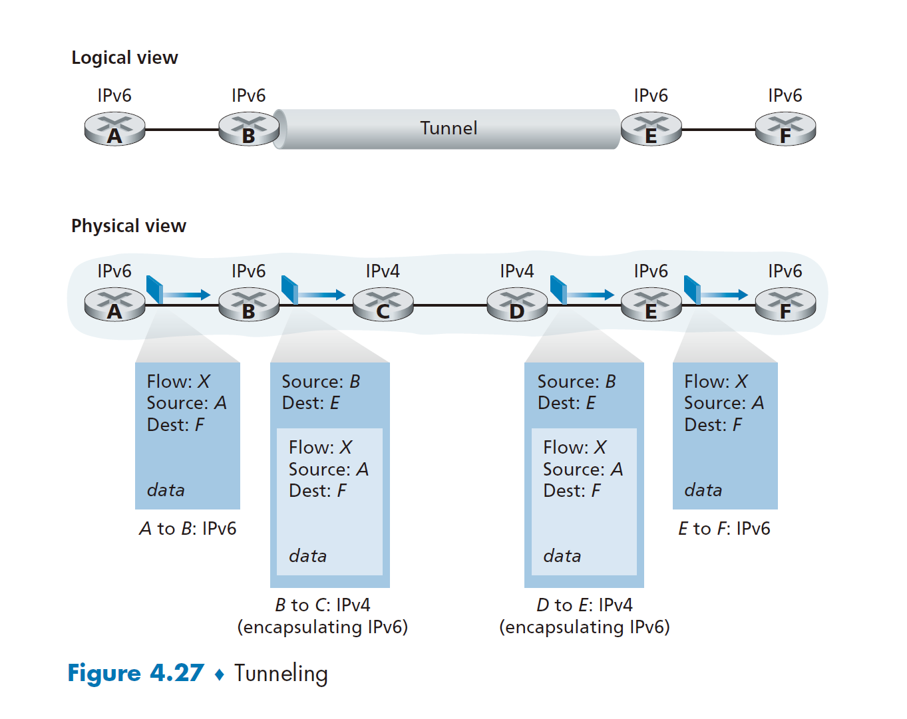

在结束本节前需要说明的是，尽管采用 IPv6 最初表现为一个缓慢启动的过程[Lawkm 2001； Huston 2008b]，但势头已经有了。NIST [NIST IPv6 2020]报告称，超过三分之一的美国政府二级域名是支持 IPv6 的。在客户端，谷歌报告称访问谷歌服务的客户有 25% 使用了 IPv6 [Google IPv6 2020]。但其他最近统计结果指出[Czyz 2014] , IPv6 的采用正 在加速。诸如 IP 使能的电话和其他便携式设备的激增，为 IPv6 的更广泛部署提供了新的推动力。欧洲的第三代合作计划[3GPP 2016]已规定了 IPv6 为移动多媒体的标准编址方案。

我们能从 IPv6 经验中学到的重要一课是，要改变网络层协议是极其困难的。自从 20 世纪 90 年代早期以来，有许多新的网络层协议被鼓吹为 Internet 的下一次重大革命，但这 些协议中的大多数至今为止只取得了有限突破。这些协议包括 IPv6、多播协议、资源预留协议，其中后面两个协议的讨论可在本书的在线补充材料中找到。在网络层中引入新的协议的确如同替换一幢房子的基石，即在不拆掉整幢房子（或至少临时重新安置房屋住户） 的情况下是很难完成上述工作的。另一方面，Internet 却已见证了在应用层中新协议的快速 部署。典型的例子当然有 Web、即时讯息、流媒体、分布式游戏和各种形式的社交媒体。引入新的应用层协议就像给一幢房子重新刷一层漆，这是相对容易做的事，如果你选择了 一个好看的颜色，邻接节点将会照搬你的选择。总之，未来我们肯定会看到 Internet 网络层发生改变，但这种改变将比应用层慢得多。

**time : 2021-06-17**

## 4.4. 通用转发和 SDN

在 4-2-1 节中，我们了解到在传统上转发是基于目的地地址。然而，在前一节中，我们也已经看到执行许多第三层功能的中间盒有了大量发展。
NAT 盒重写首部 IP 地址和端口号；防火墙基于首部字段值阻拦流量或重定向分组以进行其他处理，如深度分组检测（DPI）。负载均衡器将请求某种给定服务（例如一个 HTTP 请求）的分组转发到提供该服务的服务器集合中的一个。［RFC 3234］列出了许多常用中间盒功能。

第二层交换机和第三层路由器等中间盒［Qazi 2013］的剧增，而且每种都有自己特殊 的硬件、软件和管理界面，无疑给许多网络操作员带来了十分头疼的大麻烦。然而，近期软件定义网络的进展已经预示并且正在提出一种统一的方法，以一种现代、简洁和综合方式，提供多种网络层功能以及某些链路层功能。

回顾 4-2-1 节将基于目的地转发的特征总结为两个步骤：查找目的 IP 地址（“匹配”），然后将分组发送到有特定输出端口的交换结构（“动作”）。我们现在考虑一种更有意义的通用“匹配加动作”范式，其中能够对协议栈的多个首部字段进行“匹配”，这些 首部字段是与不同层次的不同协议相关联的。“动作”能够包括：将分组转发到一个或多个输出端口（就像在基于目的地转发中一样），跨越多个通向服务的离开接口进行负载均衡分组（就像在负载均衡中一样），重写首部值（就像在 NAT 中一样），有意识地阻挡/丢弃某个分组（就像在防火墙中一样），为进一步处理和动作而向某个特定的服务器发送一个分组（就像在 DPI 一样），等等。

在通用转发中，一张匹配加动作表将我们在 4-2-1 节中看到的基于目的地的转发表一般化了。因为能够使用网络层和/或链路层源和目的地址做出转发决定，所以显示在图 4-28 中的转发设备更为准确地描述为“分组交换机”而不是第三层“路由器”或第二层“交换机”。因此，在本节后面部分以及 5-5 节中，我们将这些设备称为分组交换机，这是在 SDN 文献中被广泛采用的术语。

图 4-28 显示了位于每台分组交换机中的一张匹配加动作表，该表由远程控制器计算、安装和更新。我们注意到虽然在各台分组交换机中的控制组件可以相互作用（例如以类似 于图 4-2 中的方式），但实践中通用匹配加动作能力是通过计算、安装和更新这些表的远 程控制器实现的。花几分钟比较图 4-2、图 4-3 和图 4-28，你能看出图 4-2 和图 4-3 中显示的基于目的地转发与图 4-28 中显示的通用转发有什么相似和差异吗？

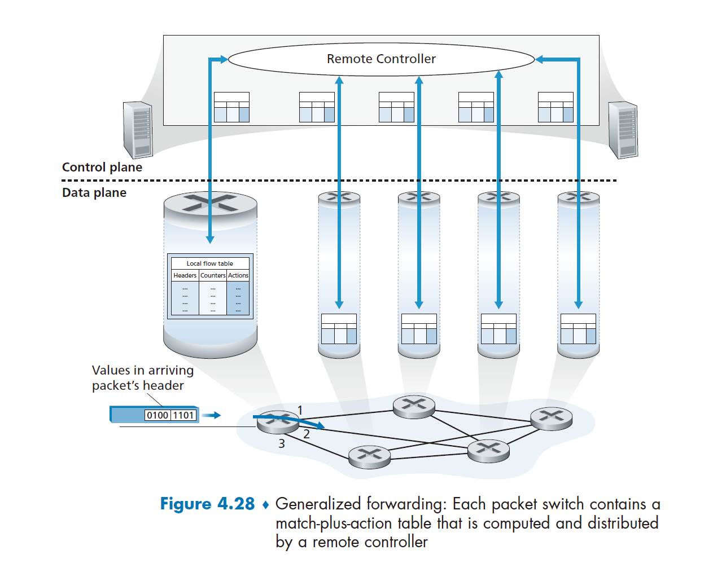

我们后续对通用转发的讨论将基于 OpenFlow [McKeown 2008, ONF 2020, Casado 2014, Tourrilhes 2014]，OpenFlow 是一个得到高度认可和成功的标准，它已经成为匹配 加动作转发抽象、控制器以及更为一般的 SDN 革命等概念的先驱[Femster 2013]。我们将主要考虑 0penFlow 1.0,该标准以特别清晰和简明的方式引入了关键的 SDN 抽象和功能。OpenFlow 的后继版本根据实现和使用获得的经验引入了其他能力；OpenFlow 标准的当前和早期版本能在[ONF 2020]中找到。

匹配加动作转发表在 OpenFlow 中称为 **流表(flow table)**，它的每个表项包括:

- **首部字段值的集合**，入分组将与之匹配。与基于目的地转发的情况一样，基于硬件匹配在 TCAM 内存中执行得最为迅速（TCAM 内存中可能有上百万条地址表项）[Bosshart 2013]。匹配不上流表项的分组将被丢弃或发送到远程控制器做更多处 理。在实践中，为了性能或成本原因，一个流表可以由多个流表实现[Bosshart 2013]，但我们这里只关注单一流表的抽象。
- **计数器集合**（当分组与流表项匹配时更新计数器）。这些计数器可以包括已经与该表项匹配的分组数量，以及自从该表项上次更新以来的时间。
- **当分组匹配流表项时所采取的动作集合**。这些动作可能将分组转发到给定的输出端口，丢弃该分组、复制该分组和将它们发送到多个输岀端口，和/或重写所选的首部字段。

我们将在 4-4-1 节和 4-4-2 节中分别更为详细地探讨匹配和动作。我们将学习每台分组交换机网络范围的匹配规则集合是如何用来实现多种多样的功能的，包括 4-4-3 节中的路由选择、第二层交换路由、防火墙、负载均衡、虚拟网络等等。在结束时，我们注意到流表本质上是一个 API，通过这种抽象每台分组交换机的行为能被编程；我们将在 4-4-3 节中看到，通过在网络分组交换机的集合中适当地编程/配置这些表，网络范围的行为能被类似地编程[Casado 2014]。

### 4.4.1. 匹配

图 4-29 显示了 11 个分组首部字段和入端口 ID，该 ID 能被 OpenFlow 1.0 中的匹配加动作规则所匹配。前面 1-5-2 节讲过，到达一台分组交换机的一个链路层（第二层）帧将 包含一个网络层（第三层）数据报作为其有效载荷，该载荷通常依次将包含一个运输层 （第四层）报文段。第一个观察是，OpenFlow 的匹配抽象允许对来自三个层次的协议首部 所选择的字段进行匹配（因此相当勇敢地违反了我们在 1-5 节中学习的分层原则）。因为我们还没有涉及链路层，用如下的说法也就足够了：显示在图 4-29 中的源和目的 MAC 地址是与帧的发送和接收接口相关联的链路层地址；通过基于以太网地址而不是 IP 地址进行转发，我们看到 openFlow 使能的设备能够等价于路由器（第三层设备）转发数据报以及交换机（第二层设备）转发帧。以太网类型字段对应于较高层协议（例如 IP），利用该字段分解该帧的载荷，并且 VLAN 字段与所谓虚拟局域网相关联，我们将在第 6 章中学习 VLAN。OpenFlow 1.0 规范中匹配的 12 个值在最近的 OpenFlow 规范中已经增加到 41 个 [Bosshart 2014 ]。

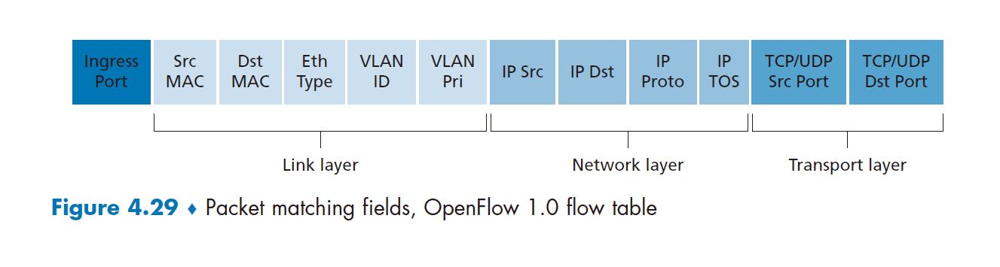

入端口是指分组交换机上接收分组的输入端口。在 4-3-1 节中，我们已经讨论过该分组的 IP 源地址、IP 目的地址、IP 协议字段和 IP 服务类型字段。运输层源和目的端口号字段也能匹配。

流表项也可以有通配符。例如，在一个流表中 IP 地址 128.119.\*.\* 将匹配其地址的前 16 比特为 128.119 的任何数据报所对应的地址字段。每个流表项也具有相应的优先权。如果一个分组匹配多个流表项，选定的匹配和对应的动作将是其中有最高优先权的那个。

最后，我们观察到并非一个 IP 首部中的所有字段都能被匹配。例如 0penFlow 并不允 许基于 TTL 字段或数据报长度字段的匹配。为什么有些字段允许匹配，而有些字段不允许 呢？毫无疑问，与功能和复杂性有关。选择一种抽象的“艺术”是提供足够的功能来完成 某种任务（在这种情况下是实现、配置和管理宽泛的网络层功能，以前这些一直是通过各 种各样的网络层设备来实现的），不必用如此详尽和一般性的“超负荷”抽象，这种抽象 已经变得臃肿和不可用。Butler Lampson 有过著名的论述[Lampson 1983]:

在一个时刻做一件事，将它做好。一个接口应当俘获一个抽象的最低限度的要件。不要进行一般化，一般化通常是错误的。

考虑到 OpenFlow 的成功，人们能够推测它的设计者的确很好地选择了抽象技术。 OpenFlow 匹配的更多细节能够在[ONF 2020]中找到。

### 4.4.2. 动作

如图 4-28 中所见，每个流表项都有零个或多个动作列表，这些动作决定了应用于与流表项匹配的分组的处理。如果有多个动作，它们以在表中规定的次序执行。

其中最为重要的动作可能是：

- **转发**。一个入分组可以转发到一个特定的物理输岀端口，广播到所有端口（分组到达的端口除外），或通过所选的端口集合进行多播。该分组可能被封装并发送到用于该设备的远程控制器。该控制器则可能（或可能不）对该分组采取某些动作，包括安装新的流表项，以及可能将该分组返回给该设备以在更新的流表规则集合下进行转发。
- **丢弃**。没有动作的流表项表明某个匹配的分组应当被丢弃。
- **修改字段**。在分组被转发到所选的输出端口之前，分组首部 10 个字段（图 4-29 中显示的除 IP 协议字段外的所有第二、三、四层的字段）中的值可以重写。
-

### 4.4.3. OpenFlow 例子

在已经考虑了通用转发的匹配和动作组件后，我们在图 4-30 显示的样本网络场景中将这些想法拼装在一起。该网络具有 6 台主机（hl、h2、h3、h4、h5 和 h6）以及 3 台分 组交换机（s1、s2 和 s3），每台交换机具有 4 个本地接口（编号 1 到 4）。我们将考虑一些 希望实现的网络范围的行为，在 s1、s2 和 s3 中的流表项需要实现这种行为。

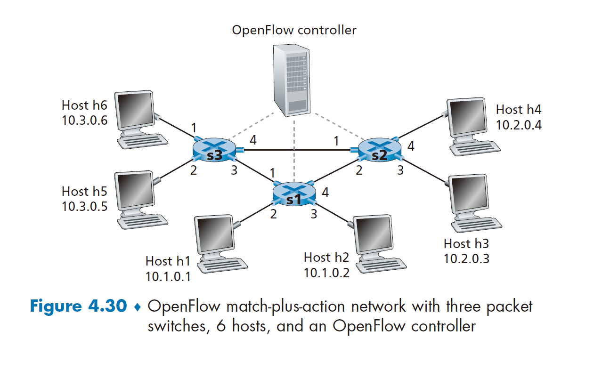

1. **第一个例子：简单转发**

作为一个非常简单的例子，假定希望的转发行为是：来自 h5 或 h6 发往 h3 或 h4 的分 组从 s3 转发到 s1，然后从 s1 转发到 s2（完全避免使用 s3 和 s2 之间的链路）。在 s1 中的流表项将是：

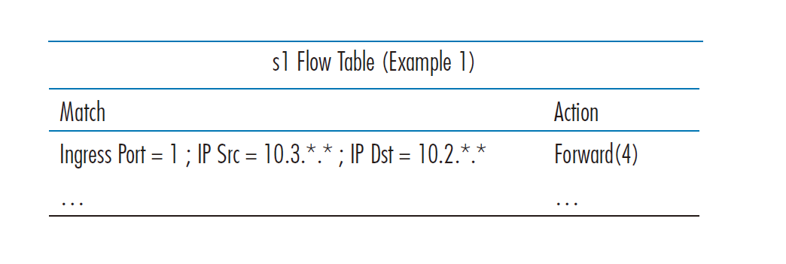

当然，我们也需要在 s3 中有一个流表项，使得该数据报从 h5 或 h6 经过出接口 3 转发到 s1：

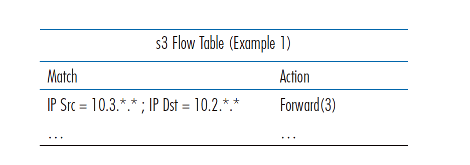

最后，我们也需要在 s2 中有一个流表项来完成第一个例子，使得从 s1 到达的数据报转发到它们的目的主机 h3 或 h4。


2. **第二个例子：负载均衡**

作为第二个例子，我们考虑一个负载均衡的场景，其中来自 h3 发往 10.1.\*.\* 的数据报经过 s1 和 s2 之间的直接链路转发，与此同时来自 h4 发往 10.1.\*.\* 的数据报经过 s2 和 s3 （于是从 s3 到 s1）之间的链路转发。注意到这种行为不能通过基于 IP 的目的地转发取得。在这种情况下，在 s2 中的流表项将是：

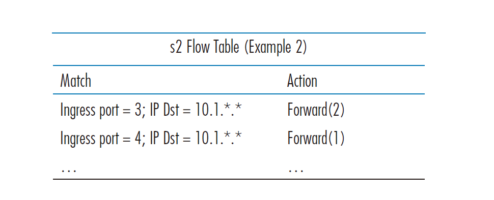

在 s1 中需要流表项将从 s2 收到的数据报转发到 hl 或 h2；在 s3 中需要流表项将接口 4 上从 s2 收到的数据报经过接口 3 转发到 s1。考虑是否能在 s1 和 s3 中配置这些流表项。

3. **第三个例子：防火墙**

作为第三个例子，我们考虑一个防火墙场景，其中 s2 仅希望（在它的任何接口上）接收来自与 s3 相连的主机所发送的流量。


如果在 s2 的流表中没有其他表项，则仅有来自 10.3.\*.\*的流量将被转发到与 s2 相连的主机。

尽管我们这里仅考虑了几种基本场景，但通用转发的多样性和优势显而易见。在课后习题中，我们将探讨流表如何用来生成许多不同的逻辑行为，包括使用相同分组交换机和链路物理集合的虚拟网络，即两个或多个逻辑上分离的网络（每个网络有它们自己的独立 和截然不同的转发行为）。在 5-5 节中，当学习 SDN 控制器时，我们将再次考察流表，其中 SDN 控制器计算和分发流表，协议用于在分组交换机和它的控制器之间进行通信。

## 4.5. 实验 8：用 wireshark 观察 IPv4 数据报

在这个 wireshark 实验中，我们将通过 IP 数据报详细地观察 IP 协议。我们将使用 traceroute 程序产生的数据报来分析。关于 traceroute 程序，我们会在 ICMP wireshark 实验中仔细研究它。我们将观察数据报中的多个字段，研究 IP 数据报的分片。

在做实验之前，你或许要回顾以下我们在 [1-5-3 节](#153-端到端时延)和[4-3-1 节](#431-ipv4-数据报格式)所讨论的内容。

### 4.5.1. traceroute

我们将使用 traceroute 程序生成我们要分析的数据报。traceroute 程序在运行时，会发送一系列数据报，第 1 次 1 个 TTL 字段为 1 的数据报，第 2 次将发送 TTL 字段为 2 的数据报，接着第 3 次会发送 TTL 为 3 的数据报，等等。TTL 字段表示这个数据报还能存在几跳。每当一个数据报被一个路由器接收到，路由器就将这个数据报字段中的 TTL 值减 1。当一个 TTL 为 1 的数据报被第一跳路由器接收到以后，TTL 将减到 0，此时，第一跳路由器就将会向源主机回送一个 ICMP 的报文（type 11-TTL-exceeded ）。同理，当一个 TTL 为 2 的数据报经过 2 跳路由器后，1 个 ICMP 报文将被回送。通过这种方式，traceroute 程序将可以确定很多信息。

我们将运行 traceroute 程序，以下的操作系统对应不同的操作方法。

- Windows。windows 提供的 traceroute 程序不允许修改 ICMP 回显请求(ping)报文的大小。这里我们推荐一个称为 pingplotter 的软件，你可以在[这个网址](https://www.pingplotter.com/products/standard.html)下载到它。下载并安装后，选择标准版，你可以免费尝试 15 天。之后，你可以指定一个网址尝试追踪。我们可以在 Edit-> Options->Packet Options 的 Packet S1ze 字段更改报文大小，默认的大小为 56 字节。在 pingplotter 的一个追踪过程完毕后，它还会在一定的间隔后重复这个过程。这个间隔我们也可以手动设置。
- Linux/Unix/MacOS。在这些操作系统里，traceroute 程序可以设置 ICMP 回显请求报文的大小。例如：

```bash
%traceroute gaia.cs.umass.edu 2000
```

这个命令将报文大小设置为 2000。

### 4.5.2. 捕获数据报

1. 启动 wireshark 并开始捕获。
2. 如果你是 windows 操作系统，启动 pingpotter，使用 56 字节默认值。键入追踪目标，这里我们选择 www.baidu.com。在10秒钟之后，停止追踪和 wireshark 的捕获。保存捕获文件。你应该可以看到下面的结果。

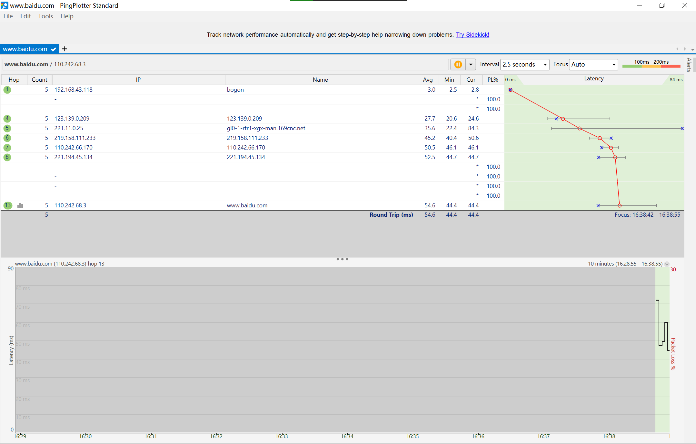

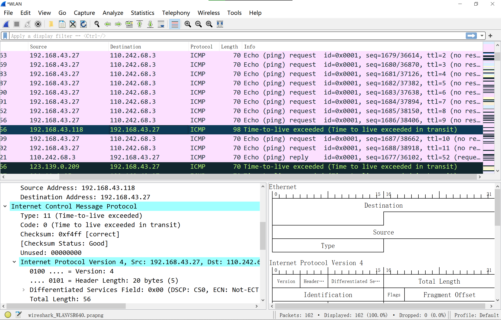

3. 如果你使用 Unix 或 Mac 操作系统，使用 `%traceroute www.baidu.com 56`命令进行追踪。在追踪完成后，停止 wireshark 捕获。保存捕获文件。
4. 分别使用 2000 字节和 3500 字节选项重复上述过程。

**time : 2021-06-18**

### 4.5.3. 观察捕获文件

打开你捕获的 56 字节选项的捕获文件，在捕获分组列表中，你可以看到一系列的 ICMP 回显请求报文(在 windows 下)或者一系列的 UDP 报文段(在 Unix 下)，你应该还能看到一系列的 ICMP TTL-exceeded 返回报文。在接下来的实验中，我们假设你的环境是 windows，但 Unix 系的操作系统没有什么大的区别。在回答一个问题时，你应该展示对应的你捕获到到的 ICMP 报文。(双击选中的分组，即可查看详细信息)

1. 选中第一个 TTL 为 1 的 ICMP 报文，展开它的详细信息。并查看这个报文中，你主机的 IP 地址是多少，发送目标的主机 IP 地址是多少？

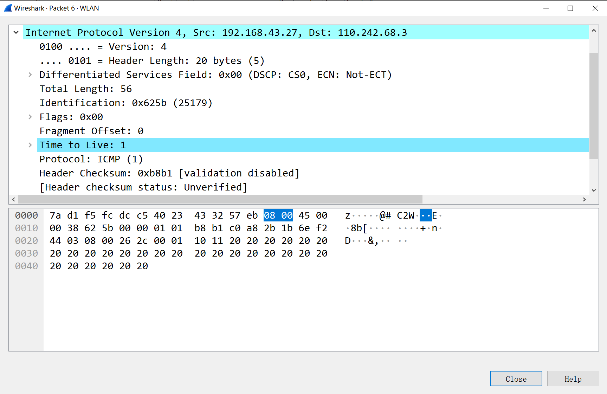

从这个分组的 IPv4 数据报可以看到：Source Address 为 192.168.43.27；Destination Address 为 110.242.68.3 。因此，本地主机电脑的 IP 地址为 192.168.43.27。而发送目标的主机 IP 地址为 110.242.68.3。

2. 在这个分组的 IPv4 数据报中，上层协议字段的值为多少？

为 1，对应的协议为 ICMP。

3. 在这个分组的 IPv4 数据报中，首部长度值为多少？有效载荷是多少？

首部长度值为 20 字节，而总的数据报长度为 56 字节，因此有效载荷为 56-20 = 36 字节。

4. 这个 IPv4 数据报被分片了吗？说出你的理由。

片偏移字段为 0，且标志字段也为 0，因此没有被分片。

下面在 wireshark 中点击分组列表表头中的 “Source” 字段进行排序，并在过滤框中输入“icmp”进行过滤，并以滚动进行浏览。你应该可以看到下面的结果。

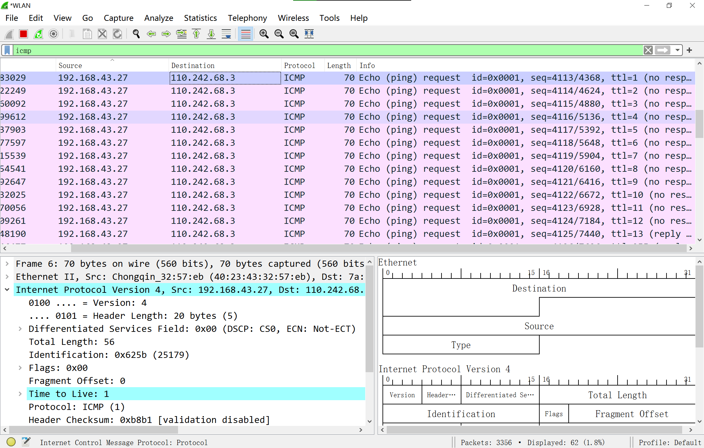

观察一系列的 ICMP 回显请求报文，回答下面的问题。

1. 对比这一系列的 ICMP 回显请求报文对应的数据报，在这些数据报的首部中，哪些字段值在改变？哪些没有？

经过观察，除了标识字段，TTL 字段以及检验和字段得值改变外，其他字段值没有改变。

2. 解释上一个问题中字段值改变的原因，以及不改变的原因。

标识字段用于标识每一个 IPv4 数据报，因此每一个 IPv4 数据报的标识字段值都不同的。

TTL 字段在 traceroute 程序中已经解释过，TTL 字段会以 1 为单位进行递增，所以显然是改变的。

检验和字段显然是不同的。

其他不改变的字段分别是协议版本字段，首部长度字段，区分服务字段，数据报总长度字段，标志字段，片偏移字段，上层协议字段，源 IP 地址以及目的地 IP 地址。

首部长度字段和数据报总长度字段显然都是相同的。版本字段为恒定的 4，因为没有分片，所以标志字段和片偏移恒为 0。上层协议协议字段恒为 1，因为都是 ICMP 报文。源 IP 地址和目的 IP 地址显然是不变的。

3. 仔细观察这些 IPv4 数据报的标识字段的值，你能发现什么规律？

从 TTL 为 1 的数据报开始，标识字段每次也增加 1。

### 4.5.4. 观察 IPv4 数据报的分片

现在我们将保存的 2000 字节选项下的捕获文件打开，观察这个捕获文件中的分组列表。

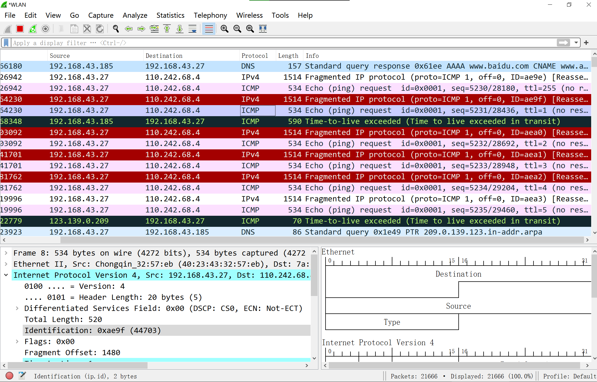

1. 找到第一个你主机发出的 ICMP 报文，观察是否进行了分片？为什么？

是，标识字段相同的数据报大于 1 个。

2. 这个报文被分成了几片？每一片的大小是多少？

2 片。第 1 片为 1480 字节。第 2 片为 520 字节。

3. 观察每一个被分片的数据报的首部字段，怎么确定这 2 个数据报的顺序？

观察片偏移字段，第 1 片为 0 到 1479 字节。第 2 片为 1480 字节到 1999 字节。

4. 对比第一个和第二个数据报的字段，哪些字段改变了？

片偏移字段，数据报总长度字段，标志字段，检验和字段。

下面我们打开 3500 字节选项下的捕获文件，观察这个捕获文件中的分组列表。


1. 找到第一个你主机发出的 ICMP 报文，观察分为了几片？

3 片。

2. 在这些被分片的报文段中，哪些字段改变了？

片偏移字段，数据报总长度字段，标志字段，检验和字段。

# 5. 网络层：控制平面

**time : 2021-06-20**

在这一章中，我们讨论网络层剩余的部分内容：**控制平面**。控制平面不仅控制着一个数据报是怎么沿着源主机到目的地主机的路径进行路由，还控制着网络层的组成部分和服务是怎么配置和管理的。在 5-2 节我们会讨论在一些传统的路由算法，这些算法类似于图论中的最短路算法。这些算法是 Internet 中被广泛使用的路由协议：OSPF 和 BGP 的基础。这两个协议我们将在 5-3 节和 5-4 节中分别讨论。我们将了解到，OSPF 协议适用于一个单独的 ISP 网络，而 BGP 协议适用于 Internet 中的所有网络。BGP 经常被称为 Internet 的粘合剂。传统上，控制平面的路由协议和数据平面的转发功能被一起实现在一个路由器中。我们在第 4 章了解到 SDN 可以使得控制平面和数据平面分开，控制平面被实现在一个远程的控制器中，而转发功能依然实现在路由器中。我们将在 5-5 节讨论 SDN。

在第 5-6 和 5-7 章节，我们将会讨论管理 IP 的 2 个协议：Internet 控制报文协议(Internet Control Message Protocol, ICMP)和简单网络管理协议(S1mple Network Management Protocol, SNMP)。

## 5.1. 概述

通过回顾图 4-2 和 4-3 我们可以快速地进入这一章讨论的背景。在上一章中，我们可以看到转发表(基于目的地的转发)和流表
(通用转发)将网络层的数据和控制平面联系了起来。我们了解到这些表指定了一个路由的本地转发行为。我们看到在通用转发的情况下，流表不仅可以转发分组到一个指定的输出端口，还可以丢弃分组，复制分组，以及重写 2，3，4 层的分组首部。

在这一章，我们将学习这些表是怎么生成，维护和安装的，在 4-1 节的介绍中，我们了解到有 2 种方法：

- **路由器控制**。图 5-1 演示了一个路由算法运行在每个路由器中。转发和路由功能被实现在每一个路由器中。每个路由器都有一个转发部件，这个转发部件和其他路由器中的转发部件通信来计算生成转发表。这种路由器控制的方法在 Internet 中被使用了几十年，我们将在 5-3 和 5-4 节学习的 OSPF 和 BGP 算法就是基于路由器控制。


- **逻辑中心控制**。图 5-2 演示了逻辑中心控制的情况。在这种情况下，一个逻辑中心控制器计算并分发转发表到每一个路由器。我们在 4-4 和 4-5 节了解到通用转发不仅可以起到转发功能，而且还具有其他一些的丰富功能，例如防火墙和 NAT。

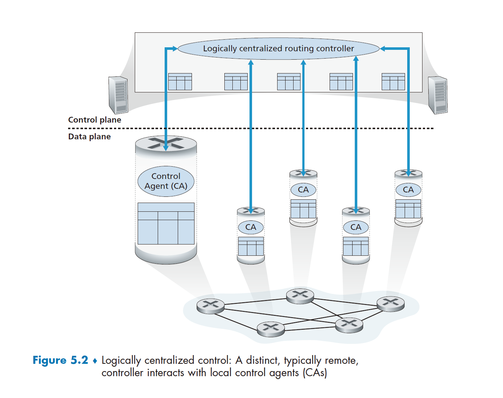

这个控制器和每一个路由器中的 **控制代理(Control Agent, CA)** 交互，具体来讲，控制器通过一种被定义好的协议来配置和管理路由器中的流表。一般来说，控制代理只起到最基本的功能，即和控制器通信。和图 5-1 中的路由算法不同，控制代理不和其他路由器的控制代理交互，也不参与计算转发表。这是路由器控制和逻辑中心控制的关键区别。

“逻辑集中式”控制的意思是，中心的控制器可能由很多个服务器实现，但从他们提供的路由服务来看，逻辑上就是一个中心。我们将在 5-5 节看到，SDN 采用了这种逻辑中心控制，这种方法得到越来越多的应用。谷歌在它的内部 B4 全球广域网中使用了 SDN 控制路由器，该广域网互联了它的数据中心［Jain 2013］。来自微软研究院的 SWAN［Hong 2013］，使用了一个逻辑集中式控制器来管理广域网和数据中心网络之间的路由选择和转发。大部分 ISP 提供商在积极地采用和部署 SDN。我们将在第 8 章看到，4G 和 5G 蜂窝网络采用了 SDN 控制。中国电信和中国联通在它们的数据中心内以及数据中心之间使用 SDN［Li 2015]。

## 5.2. 路由算法

在本节中，我们学习 **路由算法(routing algorithm)**，路由算法是从发送方到接收方的众多路径中确定一条通过路由器网络的好的路径（等价于路由）。通常，一条好路径指的是最低开销路径。然而我们将看到，实践中现实世界还关心诸如策略之类的问题（例如，有一个规则是“属于组织 Y 的路由器 X 不应转发任何来源于组织 Z 所属网络的分组”）。我们注意到无论网络控制平面采用每路由器控制方法，还是采用逻辑集中式控制方法，必定总是存在一条定义良好的一连串路由器，使得分组从发送主机到接收主机跨越网络“旅行”。因此，计算这些路径的路由选择算法是十分重要的，是 10 个十分重要的网络问题之一。

我们可以用“图”这一概念来抽象路由问题。我们知道 **图(Graph)**：G = (N, E) 是一个 N 个节点和 E 条边的集合。其中每条边是取自 N 的一对节点。在网络层路由问题中，路由器被抽象为节点，这是做出分组转发决定的点，中间的物理链路被抽象为边，你可以看 5-3 所示的一个例子。若要查看某些表示实际网络的图，参见［Dodge 2016； Cheswick 2000］；对于基于不同的图模型建模因特网的好坏的讨论，参见［Zegura 1997 ； Faloutsos 1999 ； Li 2004］。

如图 5-3 所示，一条边还有一个值表示它的开销。显然，这是一个有权图。通常，一条边的开销可反映出对应链路的物理长度（例如一条越洋链路的开销可能比一条短途陆地链路的开销高），它的链路速度，或与该链 路相关的金钱上的开销。为了我们的目的，我们只将这些链路开销看成是给定的，而不必操心这些值是如何确定的。对于 E 中的任一条边 $(x, y)$，我们用 $c(x, y)$ 表示节点 x 和 y 间边的开销。如果节点对 (x, y）不属于 E，则 $c(x, y) = \infty$。 此外，我们在这里考虑的都是无向图（即图的边没有方向），因此边 (x, y) 与边(y, x)是相同的并且 $c(x, y) = c(y, x)$。然而，我们将学习的算法能够很容易地扩展到在每个方向有不同开销的有向图。如果(x, y) 属于 E，节点 y 也被称为节点 x 的 **邻接节点(neighbor)**。

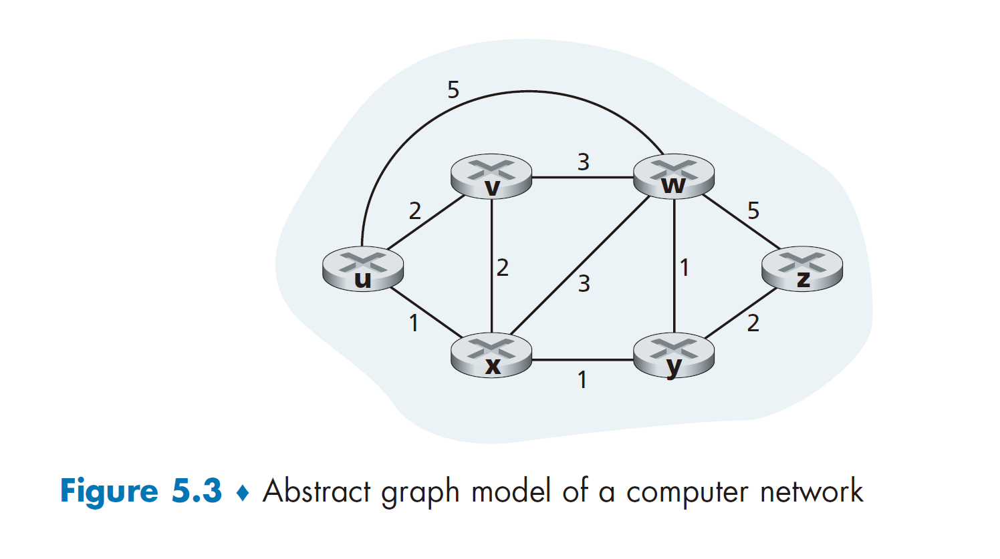

在图抽象中为各条边指定了开销后，路由选择算法的目标就是找岀从源到目的地间的最低开销路径。为了使问题更为精确，回想在图 $G = (N, E)$ 中的一条 **路径(path)** 是一个节点序列 $(x_1, x_2, ..., x_p)$，这样每一个对 $(x_1, x_2)，(x_2, x_3), ..., (x_{p-1}, x_p)$ 是 E 中的边。路径 $(x_1, x_2, ..., x_p)$ 的开销就是沿着路径所有边的开销的总和，即 $c(x_1, x_2) + c(x_2, x_3) + ... + c(x_{p-1}, x_p)$。给定任何两个节点 x 和 y，一般在这两个节点之间有许多条路径，每条路径都有一个开销。这些路径中的一条(或多条)为最低开销路径(least-cost path)。因此最低开销路径问题很显然是：找出源和目的地之间具有最低开销的一条路经。例如，在图 5-3 中，源节点 u 和目的节点 w 之间的最低开销路径是(u, x, y, w)，具有的路径开销是 3。注意到若在图中的所有边具有相同的开销，则最低开销路径也就是 **最短路径(shortest path)**，即在源和目的地之间的具有最少链路数量的路径。

作为一个简单练习，试找出图 5-3 中从节点 u 到节点 z 的最低开销路径，并要反映出你是如何算出该路径的。如果你像大多数人一样，通过考察图 5-3，跟踪几条从 u 到 z 的路由，你就能找出从 u 到 z 的路径，然后以某种方式来确信你所选择的路径就是所有可能的路径中具有最低开销的路径。（你考察过 u 到 z 之间的所有 17 条可能的路径吗？很可能没有！）这种计算就是一种集中式路由选择算法的例子，即路由选择算法在一个位置（你的大脑中）运行，该位置具有网络的完整信息。一般而言，路由选择算法的一种分类方式是根据该算法是集中式还是分散式来划分。

- **集中式路由选择算法(centralized routing algorithm)** 用完整的、全局性的网络信息计算岀从源到目的地之间的最低开销路径。也就是说，该算法以所有节点之间的连通性及所有链路的开销为输入。这就要求该算法在真正开始计算以前，要以某 种方式获得这些信息。计算本身可在某个场点（例如，图 5-2 中所示的逻辑集中式控制器）进行，或在每台路由器的路由选择组件中重复进行（例如在图 5-1 中）。然而，这里的主要区别在于，集中式算法具有关于连通性和链路开销方面的完整信息。具有全局状态信息的算法常被称作 **链路状态(Link State, LS)算法**，因为该算法必须知道网络中每条链路的开销。我们将在 5-2-1 节中学习 LS 算法。
- 在 **分散式路由选择算法(decentralized routing algorithm)** 中，路由器以迭代、分布式的方式计算出最低开销路径。没有节点拥有关于所有网络链路开销的完整信息。相反，每个节点仅有与其直接相连链路的开销知识即可开始工作。然后，通过迭代计算过程以及与相邻节点的信息交换，一个节点逐渐计算出到达某目的节点或一组目的节点的最低开销路径。我们将在后面的 5-2-2 节学习一个称为 **距离向量(Distance-Vector, DV)算法** 的分散式路由选择算法。之所以叫作 DV 算法，是因为每个节点维护到网络中所有其他节点的开销（距离）估计的向量。这种分散式算法，通过相邻路由器之间的交互式报文交换，更为适合路由器直接交互的控制平面，就像在图 5-1 中那样。

路由选择算法的第二种广义分类方式是根据算法是静态的还是动态的进行分类。在 **静态路由选择算法(static routing algorithm)** 中，路由随时间的变化非常缓慢，通常是人为进行调整（如人为手工编辑一条链路开销）。**动态路由选择算法(dynamic routing algorithm)** 随着网络流量负载或拓扑发生变化而改变路由选择路径。一个动态算法可周期性地运行或直接响应拓扑或链路开销的变化而运行。虽然动态算法易于对网络的变化做岀反应，但也更容易受诸如路由选择循环、路由振荡之类问题的影响。

路由选择算法的第三种分类方式是根据它是负载敏感的还是负载迟钝的进行划分。在 **负载敏感算法(load-sens1tive algorithm)** 中，链路开销会动态地变化以反映出底层链路的当前拥塞水平。如果当前拥塞的一条链路与高开销相联系，则路由选择算法趋向于绕开该拥塞链路来选择路由。而早期的 ARPAnet 路由选择算法就是负载敏感的[McQuillan 1980]，所以遇到了许多难题[Huitema 1998]。当今的因特网路由选择算法（如 RIP、OSPF 和 BGP）都是 **负载迟钝的(load-insens1tive)**，因为某条链路的开销不明确地反映其当前（或最近）的拥塞水平。

### 5.2.1. 链路状态(LS)路由算法

前面讲过，在链路状态算法中，网络拓扑和所有的链路开销都是已知的，也就是说可用作 LS 算法的输入。实践中这是通过让每个节点向网络中所有其他节点广播链路状态分 组来完成的，其中每个链路状态分组包含它所连接的链路的标识和开销。在实践中（例如 使用因特网的 OSPF 路由选择协议，讨论见 5-3 节），这经常由 **链路状态广播(link state broadcast)算法**［Perhnan 1999］来完成。节点广播的结果是所有节点都具有该网络的 一、完整的视图。于是每个节点都能够像其他节点一样，运行 LS 算法并计算出相同的最低开销路径集合。

我们下面给出的链路状态路由选择算法叫作 Dijkstra 算法，该算法以其发明者命名。一个密切相关的算法是 Prim 算法，有关图算法的一般性讨论参见［Cormen 2001］。Dijkstra 算法计算从某节点（源节点，我们称之为 u）到网络中所有其他节点的最低开销路径。Dijkstra 算法是迭代算法，其特点是经算法的第 k 次迭代后，可以计算出 k 个目的节点的最低开销路径，我们定义下列记号。

- D(v)：这次迭代中从源节点到目的节点 v 的最低开销。
- p(v)：在源节点到 v 的最低开销路径上，v 的前一个邻接节点。
- N'：图中所有节点的子集。如果源节点到 v 为最低开销路径，则 N' 包含 v。

该集中式路由选择算法由一个初始化步骤和其后的循环组成。循环执行的次数与图的节点数相等。一旦终止，该算法就得出了从源节点 u 到图中其他每个节点的最短低开销路径。

**源节点 u 的链路状态(LS)算法**

```py
1 初始化
2 N' = {u}
3 for 所有节点 v:
4  if v 是 u 的邻接节点:
5    D(v) = c(u, v)
6  else D(v) = 正无穷
7
8 循环
9    寻找一个不在 N' 中的，且 D(w) 为最小的节点 w
10   将 w 添加到 N' 中
11   对所有不在 N' 中的 w 的邻接节点 v 更新 D(v):
12     D(v) = min(D(v), D(w) + c(w, v))
13   /* 到 v 的新的开销要么是原来的 D(v)，要么是已知的到 w 的最小开销加上 w 到 v 的开销 */
14 直到 N' = N
```

举一个例子，考虑图 5-3 中的网络，计算从 u 到所有可能目的地的最低开销路径。该算法的计算过程以表格方式总结于下表中，表中的每一行给岀了迭代结束时该算法的变量的值。我们详细地考虑前几个步骤。

| 步骤 | N'     | D(v), p(v) | D(w), p(w) | D(x), p(x) | D(y), p(y) | D(z), p(z) |
| ---- | ------ | ---------- | ---------- | ---------- | ---------- | ---------- |
| 0    | u      | 2, u       | 5, u       | 1, u       | 正无穷     | 正无穷     |
| 1    | ux     | 2, u       | 4, x       |            | 2, x       | 正无穷     |
| 2    | uxy    | 2, u       | 3, y       |            |            | 4, y       |
| 3    | uxyv   |            | 3, y       |            |            | 4, y       |
| 4    | uxyvw  |            |            |            |            | 4, y       |
| 5    | uxyvwz |            |            |            |            |            |

- 在初始化步骤，从 u 到它的邻接节点 v，x，w 的最低开销路径分别初始化为 2、1 和 5。特别值得注意的是，到 w 的开销被设为 5（尽管我们很快就会看见确实存在一条开销更小的路径），因为这是从 u 到 w 的直接（一跳）链路开销。到 y 与 z 的开销被设为无穷大，因为它们不直接与 u 连接。
- 在第一次迭代中，我们观察那些还未加到集合 N' 中的节点，并且找岀在前一次迭代结束时具有最低开销的节点。那个节点便是 x，其开销是 1，因此 x 被加到集合 N' 中。于是 LS 算法更新所有节点 v 的 D(v)），产生上面的表中第 2 行（步骤 1）所示的结果。到 v 的路径开销未变。经过节点 x 到 w（在初始化结束时其开销为 5）的路径开销被发现为 4。因此这条具有更低开销的路径被选中，且沿从"开始的最短路径上"的前一节点被设为 x。类似地，到 y（经过 x）的开销被计算为 2，且该表也被相应地更新。
- 在第二次迭代时，节点 v 与 y 被发现具有最低开销路径（2），并且我们任意改变次序将 y 加到集合 N' 中，使得 N' 中含有 u、x 和 y。到仍不在 N' 中的其余节点（即节点 v， w 和 z）的开销通过 LS 算法中的第 12 行进行更新，产生如表 5-1 中第 3 行所示的结果。
- 如此等等。

当 LS 算法终止时，对于每个节点，我们都得到从源节点沿着它的最低开销路径的前一节点。对于每个前一节点，我们又有它的前一节点，以此方式我们可以构建从源节点到所有目的节点的完整路径。通过对每个目的节点存放从 u 到目的地的最低开销路径上的下一跳节点，在一个节点（如节点 u）中的转发表则能够根据此信息而构建。图 5-4 显示了对于图 5-3 中 的网络产生的最低开销路径和 u 中的转发表。

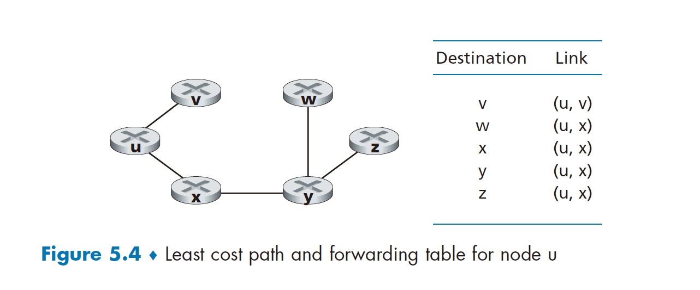

该算法的计算复杂度是多少？即给定 n 个节点（不算源节点），在最坏情况下要经过多少次计算，才能找到从源节点到所有目的节点的最低开销路径？在第一次迭代中，我们需要搜索所有的 n 个节点以确定出不在 N'中且具有最低开销的节点 w。在第二次迭代时，我们需要检查 n-1 个节点以确定最低开销。第三次对 n-2 个节点迭代，依次类推。总之，我们在所有迭代中需要搜寻的节点总数为 $n(n + 1)/2$，因此我们说前面实现的链路状态算法在最差情况下复杂性为 $O(n^2)$。（该算法的一种更复杂的实现是使用一种称为堆的数据结构，能用对数时间而不是线性时间得到第 9 行的最小值，因而减少其复杂性。）

**time : 2021-06-23**

在完成 LS 算法的讨论之前，我们考虑一下可能出现的问题。图 5-5 显示了一个简单的网络拓扑，图中的链路开销等于链路上承载的负载，例如反映要历经的时延。在该例中，链路开销是非对称的，即仅当在链路 c(u, v) 两个方向所承载的负载相同时 c(u, v) 与 c(v, u) 才相等。在该例中节点 z 产生发往 m 的一个单元的流量，节点 x 也产生发往 w 的一个单元的流量，并且节点 y 也产生发往 w 的一个数量为 e 的流量。初始路由选择情况如图 5-5a 所示，其链路开销对应于承载的流量。

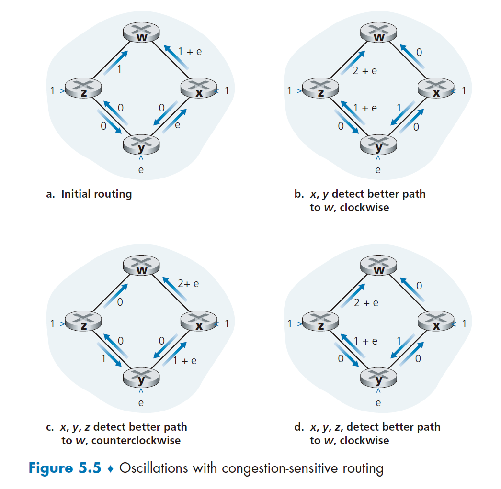

当 LS 算法再次运行时，节点 y 确定（基于图 5-5a 所示的链路开销）顺时针到 w 的路径开销为 1，而逆时针到 w 的路径开销（一直使用的）是 1+e。因此 y 到 w 的最低开销路径现在是顺时针的。类似地，x 确定其到 w 的新的最低开销路径也是顺时针的，产生如图 5-5b 中所示的开销。当 LS 算法下次运行时，节点 x、y 和 z 都检测到一条至 w 的逆时针方向零开销路径，它们都将其流量引导到逆时针方向的路由上。下次 LS 算法运行时，x、y 和 z 都将其流量引导到顺时针方向的路由上。

如何才能防止这样的振荡（它不只是出现在链路状态算法中，而且也可能出现在任何使用拥塞或基于时延的链路测度的算法中）。一种解决方案可能强制链路开销不依赖于所承载的流量，但那是一种不可接受的解决方案，因为路由选择的目标之一就是要避开高度拥塞（如高时延）的链路。另一种解决方案就是确保并非所有的路由器都同时运行 LS 算法。这似乎是一个更合理的方案，因为我们希望即使路由器以相同周期运行 LS 算法，在每个节点上算法执行的时机也将是不同的。有趣的是，研究人员近来已注意到了因特网上的路由器能在它们之间进行自同步［Floyd Synchronization 1994］。这就是说，即使它们初始时以同一周期但在不同时刻执行算法，算法执行时机最终会在路由器上变为同步并保持之。避免这种自同步的一种方法是，让每台路由器发送链路通告的时间随机化。

学习过 LS 算法之后，我们接下来考虑目前在实践中使用的其他重要的路由选择算法，即距离向量路由选择算法。

### 5.2.2. 距离向量(DV)路由算法

**距离向量(Distance-Vector, DV)** 算法是一种迭代的、异步的和分布式的算法，而 LS 算法是一种使用全局信息的算法。说它是分布式的，是因为每个节点都要从一个或多个邻接节点接收某些信息，执行计算，然后将其计算结果分发给邻接节点。说它是迭代的，是因为此过程一直要持续到邻接节点之间无更多信息要交换为止。（有趣的是，此算法是自我终止的，即没有计算应该停止的信号，它就停止了。）说它是异步的，是因为它不要求所有 节点相互之间步伐一致地操作。我们将看到一个异步的、迭代的、自我终止的、分布式的算法比一个集中式的算法要有趣得多！

在我们给岀 DV 算法之前，有必要讨论一下存在于最低开销路径的开销之间的一种重要关系。令 $d_x(y)$ 是从节点 x 到节点 y 的最低开销路径的开销。则该最低开销与著名的 Bellman-Ford 方程相关，即：

$$d_x(y) = {min}_v \{ c(x, v) + d_v(y) \}$$

方程中的 $min_v$ 是对于 x 的所有邻接节点的。Bellman-Ford 方程是相当直观的。实际上，从 x 到 v 遍历之后，如果我们接下来取从 v 到 y 的最低开销路径，则该路径开销将是 $c(x, v) + d_v(y)$。因此我们必须通过遍历某些邻接节点 v 开始，从 x 到 y 的最低开销是对所有邻接节点 v 的 $c(x, v) + d_v(y)$ 的最小值。

我们验证在图 5-3 中的源节点 u 和目的节点 z。源节点 u 有 3 个邻接节点：v，x 和 w。通过遍历该图中的各条路径，容易看出 $d_v(z) = 5$，$d_x(z) = 3$，$d_w(z) = 3$。将这些值连同开销 c(u, v) = 2，c(u, x) = 1 和 c(u, w) = 5 代入上面的方程中，得出 $d_u(z) = min \{ 2+5, 5+3, 1+3 \} = 4$，这显然是正确的，并且对同一个网络来说，这正是 Dijkstra 算法为我们提供的结果。这种快速验证应当有助于消除你可能具有的任何怀疑。

Bellman-Ford 方程实际上具有重大的实践重要性。具体来说，Bellman-Ford 方程的解为节点 x 的转发表提供了表项。为了理解这一点，令 v* 是取得该方程中最小值的任何邻接节点。接下来，如果节点 x 要沿着最低开销路径向节点 y 发送一个分组，它应当首先向节点 v* 转发该分组。因此，节点 x 的转发表将指定节点 v\* 作为最终目的地 y 的下一跳路由器。Bellman-Ford 方程的另一个重要实际贡献是，它提出了在 DV 算法中邻接节点之间的通信方式。

其基本思想如下。每个节点 x 以 $D_x(y)$ 开始，对在 N 中的所有节点 y，估计从 x 到 y 的最低开销路径的开销。令 $D_x = [D_x(y) \, | \, y 属于 N]$ 是节点 x 的距离向量，该向量是从 x 到在 N 中的所有其他节点 y 的开销估计向量。使用 DV 算法，每个节点 x 持有下列路由选择信息：

- 对于每个邻接节点 v，从 x 到邻接节点 v 的开销为 c(x, v)。
- 节点 x 的距离向量，即 $D_x = [D_x(y) \, | \, y 属于 N]$，包含了 x 到 N 中所有目的地 y 的开销估计值。
- 它的每个邻接节点的距离向量，即对 x 的每个邻接节点有 $D_x = [D_v(y) \, | \, y 属于 N]$。

在该分布式、异步算法中，每个节点不时地向它的每个邻接发送它的距离向量副本。 当节点 x 从它的任何一个邻接节点 v 接收到一个新距离向量，它保存 v 的距离向量，然后使用 Bellman-Ford 方程更新它自己的距离向量如下：

$$D_x(y) = min_v \{ c(x, v), D_v(y) \} \qquad 对 N 中的每个节点$$

如果节点 x 的距离向量因这个更新步骤而改变，节点 x 接下来将向它的每个邻接节点发送其更新后的距离向量，这继而让所有邻接节点更新它们自己的距离向量。令人惊奇的是，只要所有的节点继续以异步方式交换它们的距离向量，每个开销估计 $D_x(y)$ 收敛到 $d_x(y)$，$d_x(y)$ 为从节点 x 到节点 y 的实际最低开销路径的开销［Bersekas 1991］!

**距离向量(DV)算法**

在每个节点 x:

```py
1 初始化
2 for (y in N):
3   D(x, y) = c(x, y) /* 如果 y 不是邻接节点，则 c(x, y) = 正无穷 */
4 for 每一个 w:
5   D(w, y) = ? 对于所有在 N 中的目的节点 y
6 for 每一个 w:
7   向 w 发送距离向量 D(x) = [D(x, y), y 属于 N]
8
9 循环
10   等待直至 到邻接节点 w 的链路的开销改变
11   或 收到邻接节点 w 的距离向量
12
13   for (y in N):
14     D(x, y) = min(v) { c(x, v), D(v ,y)}
15
16 if (对于任何的目的节点 y，D(x, y) 改变了):
17   向所有邻接节点发送距离向量 D(x) = [D(x, y), y 属于 N]
18
19 永远循环
```

在该 DV 算法中，当节点 x 发现它的直接相连的链路开销变化或从某个邻接节点接收到一个距离向量的更新时，它就更新其距离向量估计值。但是为了一个给定的目的地 y 而更新它的转发表，节点 x 真正需要知道的不是到 y 的最短路径距离，而是沿着最短路径到 y 的下一跳路由器邻接节点 v*(y)。如你可能期望的那样，下一跳路由器 v*(y)是在 DV 算法第 14 行中取得最小值的邻接节点 v(如果有多个取得最小值的邻接节点以则 v*(y)能够是其中任何一个有最小值的邻接节点。)因此，对于每个目的地 y，第 13-14 行中，节点 x 也决定 v*(y)并更新它对目的地 y 的转发表。

前面讲过 LS 算法是一种全局算法，在于它要求每个节点在运行 Dijkstra 算法之前，首先获得该网络的完整信息。DV 算法是分布式的，它不使用这样的全局信息。实际上，节点具有的唯一信息是它到直接相连邻接节点的链路开销和它从这些邻接节点接收到的信息。每个节点等待来自任何邻接节点的更新(第 10〜11 行)，当接收到一个更新时计算它的新距离向量 (第 14 行)并向它的邻接节点分布其新距离向量(第 16-17 行)。在实践中许多类似 DV 的算法被用于多种路由选择协议中，包括因特网的 RIP 和 BGP、ISO IDRP、Novell IPX 和早期的 ARPAnet。

图 5-6 举例说明了 DV 算法的运行，应用场合是该图顶部有三个节点的简单网络。算法的运行以同步的方式显示出来，其中所有节点同时从其邻接节点接收报文，计算其新距离向量，如果距离向量发生了变化则通知其邻接节点。学习完这个例子后，你应当确信该算法以异步方式也能正确运行，异步方式中可在任意时刻出现节点计算与更新的产生/接收。

该图最左边一列显示了这 3 个节点各自的初始 **路由表(routing table)**。例如，位于左上角的表是节点 x 的初始路由表。在一张特定的路由表中，每行是一个距离特别是每个节点的路由表包括了它的距离向量和它的每个邻接节点的距离向量。因此，在节点 x 的初始路由表中的第一行是 $D_x = [D_x(x), D_x(y), D_x(z)] = [0, 2, 7]$。在该表的第二和第三行是最近分别从节点 y 和 z 收到的距离向量。因为在初始化时节点 x 还没有从节点 y 和 z 收到任何东西，所以第二行和第三行表项中被初始化为无穷大。

初始化后，每个节点向它的两个邻接节点发送其距离向量。图 5-6 中用从表的第一列到表 的第二列的箭头说明了这一情况。例如，节点 x 向两个节点 y 和 z 发送了它的距离向量 $D_x = [0, 2, 7]$。在接收到该更新后，每个节点重新计算它自己的距离向量。例如，节点 x 计算

$D_x(x) = 0$
$D_x(y) = min \{ c(x, y) + D_y(y), \, c(x, z) + D_z(y) \} = min \{ 2+0, \, 7+1 \} = 2$
$D_x(z) = min \{ c(x, y) + D_y(z), \, c(x, z) + D_z(z) \} = min \{ 2+1, \, 7+0 \} = 3$

第二列因此为每个节点显示了节点的新距离向量连同刚从它的邻接节点接收到的距离向量。注意到，例如节点 x 到节点 z 的最低开销估计 D(x, z) 已经从 7 变成了 3。还应注意到，对于节点 x，节点 y 在该 DV 算法的第 14 行中取得了最小值；因此在该算法的这个阶段，我们在节点 x 得到了 v*(y) = y，v*(z) = y。

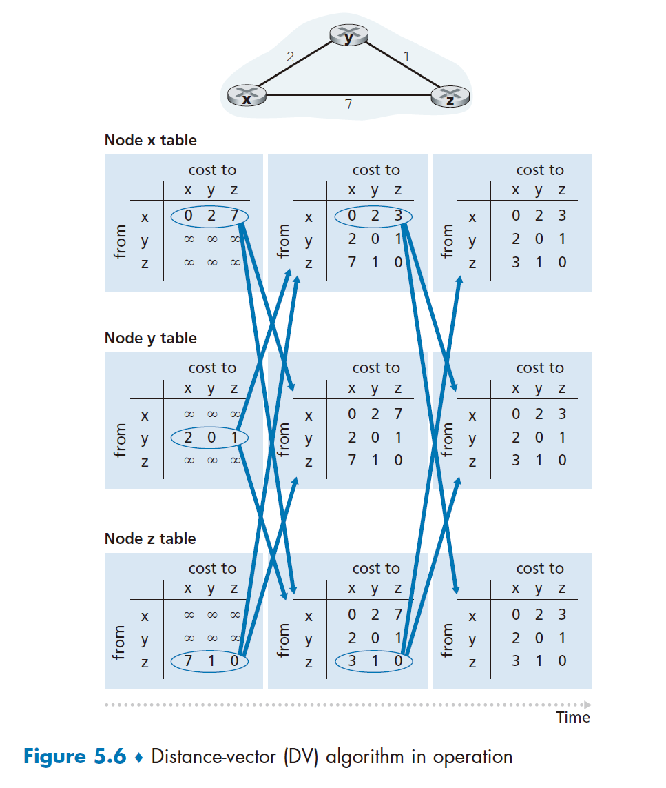

在节点重新计算它们的距离向量之后，它们再次向其邻接节点发送它们的更新距离向量（如果它们已经改变的话）。图 5-6 中由从表第二列到表第三列的箭头说明了这一情况。注意到仅有节点 x 和节点 z 发送了更新：节点 y 的距离向量没有发生变化，因此节点 y 没有发送更新。在接收到这些更新后，这些节点则重新计算它们的距离向量并更新它们的路由选择表，这些显示在第三列中。

从邻接节点接收更新距离向量、重新计算路由选择表项和通知邻接节点到目的地的最低开销路径的开销已经变化的过程继续下去，直到无更新报文发送为止。在这个时候，因为无更新报文发送，将不会出现进一步的路由选择表计算，该算法将进入静止状态，即所有的节点 将执行 DV 算法的第 10〜11 行中的等待。该算法停留在静止状态，直到一条链路开销发生改变，如下面所讨论的那样。

**time : 2021-06-24**

1. **距离向量算法：链路开销改变与链路故障**

当一个运行 DV 算法的节点检测到从它自己到邻接节点的链路开销发生变化时（第 10〜11 行），它就更新其距离向量（第 13 ~ 14 行），并且如果最低开销路径的开销发生了变化，向邻接节点通知其新的距离向量（第 16-17 行）。图 5-7a 图示了从 y 到 x 的链路开销从 4 变为 1 的情况。我们在此只关注了与 z 到目的地 x 的距离表中的有关表项。该 DV 算法导致下列事件序列的出现：

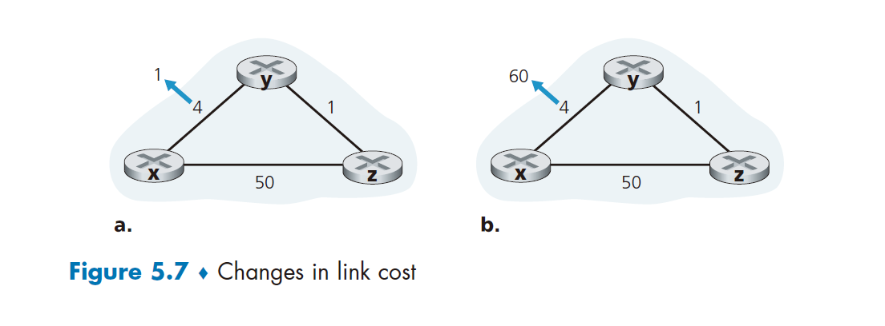

- 在 $t_0$ 时刻，y 检测到链路开销变化（开销从 4 变为 1），更新其距离向量，并通知其邻接节点这个变化，因为最低开销路径的开销已改变。
- 在 $t_1$ 时刻，z 收到来自 y 的更新报文并更新了其距离表。它计算出到 x 的新最低开销（从开销 5 减为开销 2），它向其邻接节点发送了它的新距离向量。
- 在 $t_2$ 时刻，y 收到来自 z 的更新并更新其距离表。y 的最低开销未变，因此 y 不发送任何报文给 z。该算法进入静止状态。

因此，对于该 DV 算法只需两次迭代就到达了静止状态。在 x 与 y 之间开销减少的好消息通过网络得到了迅速传播。

我们现在考虑一下当某链路开销增加时发生的情况。假设 x 与 y 之间的链路开销从 4 增加到 60，如图 5-7b 所示。

(1) 在链路开销变化之前，$D_y(x) = 4$, $D_y(z) = 1$, $D_z(y) = 1$ 和 $D_z(x) = 5$。在 $t_0$ 时刻，y 检测到链路开销变化（开销从 4 变为 60）。y 计算它到 x 的新的最低开销路径的开销，其值为

$$D_y(x) = min \{ c(y, x) + D_x(x), \, c(y, z)+ D_z(x) \} = min \{ 60+0, 1+5 \} = 6$$

当然，从网络全局的视角来看，我们能够看出经过 z 的这个新开销是错误的。但节点 y 仅有的信息是：它到 x 的直接开销是 60，且 Z 上次已告诉 y, z 能以开销 5 到 x。因此, 为了到达 x，y 将通过 z 路由，完全期望 z 能以开销 5 到达 x。到了 $t_1$ 时刻，我们遇到 **路由选择环路(routing loop)**，即为到达 x，y 通过 z 路由，z 又通过 y 路由。路由选择环路就像一个黑洞，即目的地为 x 的分组在 $t_1$ 时刻到达 y 或 Z 后，将在这两个节点之间不停地（或直到转发表发生改变为止）来回反复。

(2) 因为节点 y 已算出到 x 的新的最低开销，它在 $t_1$ 时刻将该新距离向量通知 z。

(3) 在 $t_1$ 后某个时间，z 收到 y 的新距离向量，它指示了 y 到久的最低开销是 6。z 知道它能以开销 1 到达 y，因此计算岀到 x 的新最低开销 $D_z(x) =min \{ 50+0, \, 1+6 \} = 7$。因为 z 到 x 的最低开销已增加了，于是它便在 $t_2$ 时刻通知 7 其新开销。

(4) 以类似方式，在收到 z 的新距离向量后，y 决定 $D_y(x) =8$ 并向 z 发送其距离向量。 接下来 z 确定 $D_z(x) = 9$ 并向 y 发送其距离向量，等等。

该过程将要继续多久呢？你应认识到该循环将持续 44 次迭代（在 y 与 z 之间交换报文），即直到 z 最终算出它经由 y 的路径开销大于 50 为止。此时，的最低开销路径是经过它到 x 的直接连接。y 将经由 z 路由选择到 z 将（最终）确定它到 x。关于链路开销增加的坏消息的确传播得很慢！如果链路开销 c(y, x)从 4 变为 10 000 且开销 c(z, x)为 9999 时将发生什么样的现象呢？由于这种情况，我们所见的问题有时被称为 **无穷计数(count-to-infinity)** 问题。

2. **距离向量算法：增加毒性逆转**

刚才描述的特定循环的场景可以通过使用一种称为 **毒性逆转(poisoned reverse)** 的技术而加以避免。其思想较为简单：如果 z 通过 y 路由选择到目的地 x，则 z 将通告 y，它（即 z）到 x 的距离是无穷大，也就是 z 将向 y 通告 $D_z(x) = \infty$（即使 z 实际上知道 $D_z(x) = 5$）。只要 z 经 y 路由选择到 x，z 就持续地向 y 讲述这个善意的小谎言。因为 y 相信 z 没有 到 x 的路径，故只要 z 继续经 y 路由选择到 x（并这样去撒谎），y 将永远不会试图经由 z 路由选择到 x。

我们现在看一下毒性逆转如何解决我们前面在图 5-7b 中遇到的特定环路问题。作为毒性逆转的结果，y 的距离表指示了 $D_Z(x) = \infty$。当(x, y)链路的开销在 5 时刻从 4 变为 60 时，y 更新其表，虽然开销高达 60，仍继续直接路由选择到 x，并将到 x 的新开销通知 z,即 $D_y(z) =60$。z 在 t(1)时刻收到更新后，便立即将其到先的路由切换到经过开销为 50 的直接(z, x)链路。因为这是一条新的到 x 的最低开销路径，且因为路径不再经过 y,就在 $t_2$ 时刻通知 y 现在 $D_z(x) = 50$。在收到来自 z 的更新后，y 便用 $D_y(x)= 51$ 更新其距离表。另外，因为 z 此时位于 y 到 x 的最低开销路径上，所以 y 通过在 $t_3$ 时刻通知 z 其 $D_y(x) = 8$ （即使 y 实际上知道 $D_y(x) =51$）毒化从 z 到先的逆向路径。

毒性逆转解决了一般的无穷计数问题吗？没有。你应认识到涉及 3 个或更多节点（而不只是两个直接相连的邻接节点节点）的环路将无法用毒性逆转技术检测到。

3. **LS 与 DV 路由选择算法的比较**

DV 和 LS 算法采用互补的方法来解决路由选择计算问题。在 DV 算法中，每个节点仅 与它的直接相连的邻接节点交谈，但它为其邻接节点提供了从它自己到网络中（它所知道的）所有 其他节点的最低开销估计。LS 算法需要全局信息。因此，当在每台路由器中实现时，例 如像在图 4-2 和图 5-1 中那样，每个节点（经广播）与所有其他节点通信，但仅告诉它们 与它直接相连链路的开销。我们通过快速比较它们各自的属性来总结所学的链路状态与距 离向量算法。记住 N 是节点（路由器）的集合，而 E 是边（链路）的集合。

- **报文复杂性**。我们已经看到 LS 算法要求每个节点都知道网络中每条链路的开销。 这就要求要发送 O(|N|\*|E|) 个报文。而且无论何时一条链路的开销改变时，必须向所有节点发送新的链路开销。DV 算法要求在每次迭代时，在两个直接相连邻接节点之间交换报文。我们已经看到，算法收敛所需时间依赖于许多因素。当链路开销改变时，DV 算法仅当在新的链路开销导致与该链路相连节点的最低开销路径发生变时，才传播已改变的链路开销。
- **收敛速度**。我们已经看到 LS 算法的实现是一个要求 O(|N|\*|E|)个报文的 O(|N|^2)算法。DV 算法收敛较慢，且在收敛时会遇到路由选择环路。DV 算法还会遭遇无穷计数的问题。
- **健壮性**。如果一台路由器发生故障、行为错乱或受到蓄意破坏时情况会怎样呢？对于 LS 算法，路由器能够向其连接的链路（而不是其他链路）广播不正确的开销。 作为 LS 广播的一部分，一个节点也可损坏或丢弃它收到的任何 LS 广播分组。但是一个 LS 节点仅计算自己的转发表；其他节点也自行执行类似的计算。这就意味着在 LS 算法下，路由计算在某种程度上是分离的，提供了一定程度的健壮性。在 DV 算法下，一个节点可向任意或所有目的节点通告其不正确的最低开销路径。更一般地，我们会注意到每次迭代时，在 DV 算法中一个节点的计算会传递给它的邻接节点，然后在下次迭代时再间接 地传递给邻接节点的邻接节点。在此情况下，DV 算法中一个不正确的节点计算值会扩散到整个网络。

总之，两个算法没有一个是明显的赢家，它们都在因特网中得到了应用。

## 5.3. 因特网中自治系统内部的路由选择：OSPF

在我们至今为止的算法研究中，我们将网络只看作一个互联路由器的集合。从所有路由器执行相同的路由选择算法以计算穿越整个网络的路由选择路径的意义上来说，一台路由器很难同另一台路由器区别开来。在实践中，该模型和这种一组执行同样路由选择算法的同质路由器集合的观点有一点简单化，有以下两个重要原因：

- **规模**。随着路由器数目变得很大，涉及路由选择信息的通信、计算和存储的开销将 高得不可实现。当今的因特网由数亿台主机组成。在这些主机中存储的路由选择信 息显然需要巨大容量的内存。在所有路由器之间广播连通性和链路开销更新所要求的负担将是巨大的！在如此大量的路由器中迭代的距离向量算法将肯定永远无法收敛！显然，必须采取一些措施以减少像因特网这种大型网络中的路由计算的复杂性。
- **管理自治**。因特网是 ISP 的网络，其中每个 ISP 都有它自己的路由器网络。ISP 通常希望按自己的意愿运行路由器（如在自己的网络中运行 它所选择的某种路由选择算法），或对外部隐藏其网络的内部组织面貌。在理想情况下，一个组织应当能够按自己的愿望运行和管理其网络，还要能将其网络与其他外部网络连接起来。

这两个问题都可以通过将路由器组织进 **自治系统(Autonomous System, AS)** 来解决，其中每个 AS 由一组通常处在相同管理控制下的路由器组成。通常在一个 ISP 中的路由器以及互联它们的链路构成一个 AS。然而，某些 ISP 将它们的网络划分为多个 AS。特别是，某些一级 ISP 在其整个网络中使用一个庞大的 AS，而其他 ISP 则将它们的 ISP 拆分为数十个互联的 AS。一个自治系统由唯一的 AS 号（ASN）所标识［RFC 1930］。和 IP 地址相同，AS 号由 ICANN 区域注册机构所分配［ICANN 2020］。

在相同 AS 中的路由器都运行相同的路由选择算法并且有彼此的信息。在一个自治系统内运行的路由选择算法叫作 **自治系统内部路由选择协议(intra-autonomous system routing protocol)**。

**开放最短路优先(OSPF)**

OSPF 路由选择及其关系密切的协议 IS-IS 都被广泛用于因特网的 AS 内部路由选择。OSPF 中的开放（open）一词是指路由选择协议规范是公众可用的（与之相反的是 Cisco 的 EIGRP 协议，该协议在最近才成为开放的［Savage 2015]，它作为 Cisco 专用协议大约有 20 年时间）。OSPF 版本 2 由 [RFC 2328] 所定义。

OSPF 是一种链路状态协议，它使用泛洪链路状态信息和 Dijkstra 最低开销路径算法。使用 OSPF，一台路由器构建了一幅关于整个自治系统的完整拓扑图。每台路由器在本地运行 Dijkstra 的最短路径算法，以确定一个以自身为根节点到所有子网的最短路径树。链路开销是由网络管理员配置的（参见 设置 OSPF 链路权值）。管理员可以将所有链路的开销设为 1，这样就实现了最少跳数路由，或者可能会选择将链路权值按与链路容量成反比来设置，从而不防止流量使用低带宽链路。OSPF 不强制规定设置链路权值的策略（这是网络管理员的任务），而是提供了一种机制（协议），为给定链路权值的集合确定最低开销路径路由。

使用 OSPF 时，路由器向自治系统内所有其他路由器广播路由信息，而不仅仅是向邻接路由器广播。每当一条链路的状态发生变化时，路由器就会广播链路状态信息。即使链路状态未发生变化，路由器也会周期性地（至少每隔 30 min 一次）广播链路状态。RFC 2328 中有这样的说明：“链路状态通告的这种周期性更新增加了链路状态算法的健壮性。” OSPF 通告包含在 OSPF 报文中，该 OSPF 报文直接由 IP 承载，对 OSPF 其上层协议的值为 89。因此 OSPF 协议必须自己实现诸如可靠报文传输、链路状态广播等功能。OSPF 协议还要检查链路正在运行（通过向相连的邻接节点发送 HELLO 报文），并允许 OSPF 路由器获得邻接路由器的网络范围链路状态的数据库。

OSPF 的优点包括下列几方面：

- **安全**。能够鉴别 OSPF 路由器之间的交换 C 如链路状态更新）。使用鉴别，仅有受信任的路由器能参与一个 AS 内的 OSPF 协议，因此可防止恶意入侵者 （或正在利用新学的知识到处试探的网络专业的学生）将不正确的信息注入路 由器表内。在默认状态下，路由器间的 OSPF 报文是未被鉴别的并能被伪造。能够配置两类鉴别，即简单的和 MD5 的（参见第 8 章有关 MD5 和鉴别的一般性讨论）。使用简单的鉴别，每台路由器配置相同的口令。当一台路由器发送一个 OSPF 分组，它以明文方式包括了口令。显然，简单鉴别并不是非常安全。MD5 鉴别基于配置在所有路由器上的共享秘密密钥。对发送的每个 OSPF 分组，路由器对附加了秘密密钥的 OSPF 分组内容计算 MD5 散列值（参见第 8 章中报文鉴别码的讨论）。然后路由器将所得的散列值包括在该 OSPF 分组中。 接收路由器使用预配置的秘密密钥计算出该分组的 MD5 散列值，并与该分组 携带的散列值进行比较，从而验证了该分组的真实性。在 MD5 鉴别中也使用了序号对重放攻击进行保护。
- **多条相同开销的路径**。当到达某目的地的多条路径具有相同的开销时，OSPF 允许使用多条路径（这就是说，当存在多条相等开销的路径时，无须仅选择单一的路径来承载所有的流量）。
- **对单播与多播路由选择的综合支持**。**多播 OSPF(MOSPF)**［RFC 1584］提供对 0SPF 的简单扩展，以便提供多播路由选择。MOSPF 使用现有的 OSPF 链路数据库，并为现有的 OSPF 链路状态广播机制增加了一种新型的链路状态通告。
- **支持在单个 AS 中的层次结构**。一个 OSPF 自治系统能够层次化地配置多个区域。每个区域都运行自己的 OSPF 链路状态路由选择算法，区域内的每台路由器都向该 区域内的所有其他路由器广播其链路状态。在每个区域内，一台或多台区域边界路 由器负责为流向该区域以外的分组提供路由选择。最后，在 AS 中只有一个 OSPF 区域配置成主干区域。主干区域的主要作用是为该 AS 中其他区域之间的流量提供路由选择。该主干总是包含本 AS 中的所有区域边界路由器，并且可能还包含了一些非边界路由器。在 AS 中的区域间的路由选择要求分组先路由到一个区域边界路由器（区域内路由选择），然后通过主干路由到位于目的区域的区域边界路由器，进而再路由到最终目的地。

OSPF 是一个相当复杂的协议，而我们这里的讨论是十分简要的，[Huitema 1998； Moy 1998； RFC 2328]提供了更多的细节。

**设置 OSPF 链路权值**

讨论链路状态路由时，我们假定链路开销已经设置好了，运行诸如 OSPF 这样的路由选择算法，流量根据由 LS 算法计算所得的路由选择表流动。就因果而言，给定链路权重（即它们先发生），结果得到（经 Dijkstra 算法）最小 化总体开销的路由选择路径。从这个角度看，链路权重反映了使用一条链路的开销（例 如，如果链路权重与容量成反比，则使用高容量链路将具有较小的权重并因此从路由选 择的角度更有吸引力），并且使用 Dijkstra 算法使得总开销为最小。

在实践中，链路权重和路由选择路径之间的因果关系也许是相反的，网络操作员配置链路权重，以获取某些流量工程目标的路由选择路径 [Fortz 2000；Fortz 2002]。例如，假设某网络操作员具有在每个入口点进入和发向每个出口点的该网络的流量估计。该操作员接下来可能要设置特定入口到出口的流路由选择，以最小化经所有网络链路的 最大利用率。但使用如 OSPF 这样的路由选择算法，操作员调节网络流的路由选择的主要手段就是链路权重。因此，为了取得最小化最大链路利用率的目标，操作员必须找出 取得该目标的链路权重集合。这是一种相反的因果关系，即所希望的流路由选择已知, 必须找到 OSPF 链路权重，使得该 OSPF 路由选择算法导致这种希望的流路由选择。

## 5.4. ISP 之间的路由选择：BGP

我们刚才学习了 OSPF 是一个 AS 内部路由选择协议。当在相同 AS 内的源和目的地之间进行分组选路时，分组遵循的路径完全由 AS 内路由选择协议所决定。然而，当分组跨越多个 AS 进行路由时，比如说从位于马里廷巴克图的智能手机到位于美国硅谷数据中心的一台服务器，我们需要一个 **自治系统间路由选择协议(inter-autonomous system routing protocol)**。因为 AS 间路由选择协议涉及多个 AS 之间的协调，所以 AS 通信必须运行相同的 AS 间路由选择协议。在因特网中，所有的 AS 运行相同的 AS 间路由选择协议，称为 **边界网关协议(Broder Gateway Protocol, BGP)** [RFC 4271; Stewart 1999]。

BGP 无疑是所有因特网协议中最为重要的（唯一竞争者可能是我们已经在 4-3 节中学习的 IP 协议），因为正是这个协议将因特网中数以千计的 ISP 黏合起来。如我们将看到的那样，BGP 是一种分布式和异步的协议，与 5-2-2 节中描述的距离向量路由选择协议一脉相承。尽管 BGP 是一种复杂和富有挑战性的协议，但为了深层次理解因特网，我们需要熟悉它的基础结构和操作。我们专注于学习 BGP 的时间将是物有所值的。

### 5.4.1. BGP 的职责

为了理解 BGP 的职责所在，考虑一个 AS 和在该 AS 中的任意一个路由器。前面讲过，每台路由器具有一张转发表，该转发表在将到达分组转发到出路由器链路的过程中起着主要作用。如我们已经学习过的那样，对于位于相同 AS 中的目的地而言，在路由器转发表中的表项由 AS 内部路由选择协议所决定。而对于位于该 AS 外部的目的地而言情况如何呢？这正是 BGP 用武之地。

在 BGP 中，分组并不是路由到一个特定的目的地址，相反是路由到 CIDR 化的前缀，其中每个前缀表示一个子网或一个子网的集合。在 BGP 的世界中，一个目的地可以采用 138.16.68/22 的形式，对于这个例子来说包括 1024 个 IP 地址。因此，一台路由器的转发表将具有形式为 (x, I) 的表项，其中 x 是一个前缀（例如 138.16.68/22），I 是该路由器的接口之一的接口号。

作为一种 AS 间的路由选择协议，BGP 为每台路由器提供了一种完成以下任务的手段:

- 从邻接 AS 获得前缀的可达性信息。特别是，BGP 允许每个子网向因特网的其余部分通告它的存在。如果没有 BGP 的话，每个子网将是隔离的孤岛，即它们孤独地存在，不被因特网其余部分获知。
- 确定到该前缀的“最好的”路由。一台路由器可能知道两条或更多条到特定前缀的不同路由。为了确定最好的路由，该路由器将本地运行一个 BGP 路由过程（使用它经过相邻的路由器获得的前缀可达性信息）。该最好的路由将基于策略以及可达性信息来确定。

我们现在来看 BGP 如何执行这两个任务。

**time : 2021-06-26**

### 5.4.2. 通告 BGP 路由信息

考虑图 5-8 中显示的网络。如我们看到的那样，这个简单的网络具有 3 个自治系统: AS1、AS2 和 AS3。AS3 包括一个具有前缀为 x 的子网。对于每个 AS，每台路由器要么是一台 **网关路由器(gateway router)**，要么是一台 **内部路由器(internal router)**。网关路由器是一台位于 AS 边缘的路由器，它直接连接到在其他 AS 中的一台或多台路由器。内部路由器仅连接在它自己 AS 中的主机和路由器。例如，在 AS1 中路由器 1c 是网关路由器，路由器 1b 和 1d 是内部路由器。

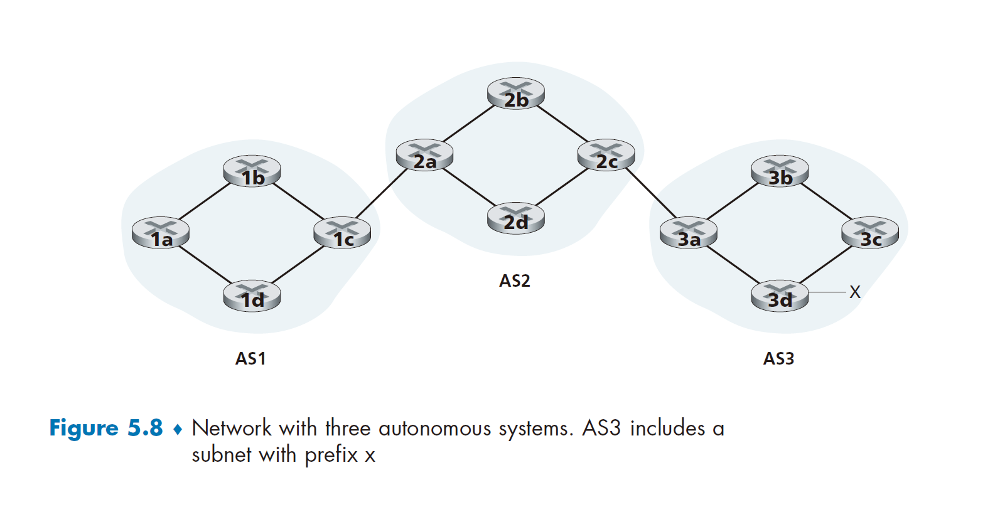

我们考虑这样一个任务：向图 5-8 中显示的所有路由器通告对于前缀 x 的可达性信息。大致来说，首先，AS3 向 AS2 发送一个 BGP 报文，告知 x 存在并且位于 AS3 中；我们将该报文表示为“AS3 x”。然后 AS2 向 AS1 发送一个 BGP 报文，告知 x 存在并且能够先通过 AS2 然后进入 AS3 进而到达，我们将该报文表示为“AS2 AS3 x”。以这种方式，每个自治系统不仅知道 x 的存在，而且知道通向 x 的自治系统的路径。

具体来说，这个过程是路由器在发送报文。为了理解这一点，我们再来看图 5-8。在 BGP 中，每对路由器通过使用 179 端口的半永久 TCP 连接交换路由选择信息。每条直接连接以及所有通过该连接发送的 BGP 报文，称为 **BGP 连接(BGP cormection)**。此外，跨越两个 AS 的 BGP 连接称为 **外部 BGP(eBGP)** 连接，而在相同 AS 中的两台路由器之间的 BGP 会话称为 **内部 BGP(iBGP)** 连接。图 5-8 所示网络的 BGP 连接的例子显示在图 5-9 中。对于直接连接在不同 AS 中的网关路由器的每条链路而言，通常有一条 eBGP 连接；因此，在图 5-9 中，在网关路由器 1c 和 2a 之间有一条 eBGP 连接，而在网关路由器 2c 和 3a 之间也有一条 eBGP 连接。

在每个 AS 中的路由器之间还有多条 iBGP 连接。特别是，图 5-9 显示了一个 AS 内部 的每对路由器之间的一条 BGP 连接的通常配置，在每个 AS 内部产生了网状的 TCP 连接 在图 5-9 中，eBGP 会话显示为长虚线，iBGP 显示为短虚线。注意到 iBGP 连接并不总是与物理链路对应。

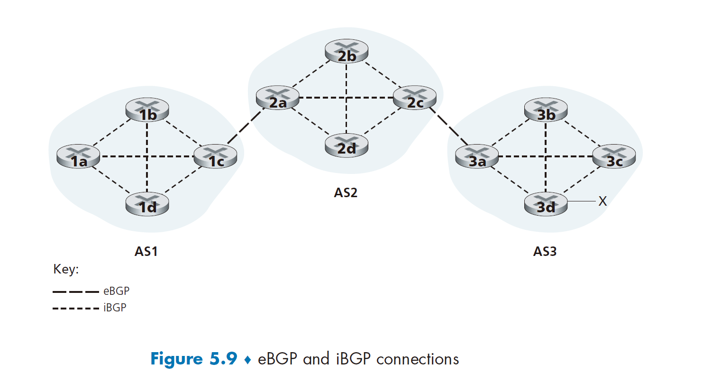

传播可达性信息使用了 iBGP 和 eBGP 会话。考虑向 AS1 和 AS2 中的所有路由器通告前缀 x 的可达性信息。在这个过程中，网关路由器 3a 先向网关路由器 2c 发送一个 eBGP 报文“AS3 x”。网关路由器 2c 然后向 AS2 中的所有其他路由器(包括网关路由器 2a)发送 iBGP 报文“AS3 x”。网关路由器 2a 接下来向网关路由器 1c 发送一个 eBGP 报文“AS2 AS3 x”。最后，网关路由器 1c 使用 iBGP 向 AS1 中的所有路由器发送报文 “AS2 AS3 x"。在这个过程完成后，在 AS1 和 AS2 中的每个路由器都知道了 x 的存在并且也都知道了通往 x 的 AS 路径。

当然，在真实的网络中，从某个给定的路由器到某个给定的目的地可能有多条不同的路径，每条通过了不同的 AS 序列。例如，考虑图 5-10 所示的网络，它是在图 5-8 那个初始网 络基础上，从路由器 1d 到路由器 3d 附加了一条物理链路。在这种情况下，从 AS1 到 x 有两条路径：经过路由器 1c 的路径“AS2 AS3 x”；以及经过路由器 1d 的新路径“AS3 x”。

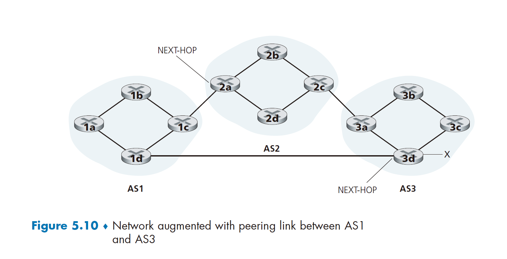

### 5.4.3. 确定最好的路由

如我们刚才学习到的那样，从一个给定的路由器到一个目的子网可能有多条路径。事实上，因特网中的路由器常常接收到很多不同的可能路径的可达性信息。一台路由器如何在这些路径之间进行选择(并且再相应地配置它的转发表)呢？

在应对这个问题之前，还需要介绍几个 BGP 术语。当路由器通过一个 BGP 连接通告前缀时，它还会在前缀外包含一些 **BGP 属性(BGP attribute)**。用 BGP 术语来说，前缀及其属性称为 **路由(route)**。其中两个重要的属性是 AS-PATH 和 NEXT-HOP。AS-PATH 属性包含了通过的 AS 的列表，如我们在前面的例子中所见。为了生成 AS-PATH 的值，当一个前缀通过某 AS 时，该 AS 将其 ASN 加入 AS-PATH 中的现有列表。例如，在图 5-10 中，从 AS1 到子网 x 有两条路：其中一条使用 AS-PATH “AS2 AS3”；而另一条使用 AS-PATH “AS3”。BGP 路由器还使用 AS-PATH 属性来检测和防止通告环路：如果一台路由器在路径列表中看到包含了它自己的 AS，它将拒绝该通告。

NEXT-HOP 属性则具有微妙的作用。NEXT-HOP 是 AS-PATH 起始的路由器接口的 IP 地址。为了深入理解该属性，我们再次参考图 5-10。如图 5-10 中所指示的那样，对于从 AS1 通过 AS2 到 x 的路由 “AS2 AS3 x”，其属性 NEXT-HOP 是路由器 2a 左边接口的 IP 地址。对于从 AS1 绕过 AS2 到 x 的路由“AS3”，其 NEXT-HOP 属性是路由器 3d 最左边接口的 IP 地址。总的说来，在这个假想的例子中，AS1 中的每台路由器都知道了到前缀 x 的两台 BGP 路由：

路由器 2a 的最左侧接口的 IP 地址：AS2 AS3； x
路由器 3d 的最左侧接口的 IP 地址：AS3； x

这里，每条 BGP 路由包含 3 个组件：NEXT-HOP； AS-PATH；目的前缀。在实践中, 一条 BGP 路由还包括其他属性，眼下我们将暂且忽略它。注意到 NEXT-HOP 属性是不属于 AS1 的某路由器的 IP 地址；然而，包含该 IP 地址的子网直接连接到 AS1。

这里，每条 BGP 路由包含 3 个组成部分：NEXT- HOP； ASPATH；目的前缀。在实践中，一条 BGP 路由还包括其他属性，眼下我们将暂且忽略它。注意到 NEXT-HOP 属性不属于 AS1 的某路由器的 IP 地址；然而，包含该 IP 地址的子网直接连接到 AS1。

1. **热土豆路由**

终于到了以精确的方式来讨论 BGP 路由选择算法的时刻了。我们将以一个最简单的路由选择算法开始，即 **热土豆路由选择(hot potato routing)**。

考虑在图 5-10 网络中的路由器 1b。如同刚才所述，这台路由器将学习到达前缀 x 的两条 BGP 路由。使用热土豆路由算法，（从所有可能的路由中）选择的路由到开始该路由的 NEXT-HOP 路由器具有最小开销。在这个例子中，路由器 1b 将査阅它的 AS 内部路由选择信息，以找到通往 NEXT-HOP 路由器 2a 的最低开销 AS 内部路径以及通往 NEXT-HOP 路由器 3d 的最低开销 AS 间路径，进而选择这些最低开销路径中具有最低开销的那条。例如，假设开销定义为穿越的链路数。则从路由器 1b 到路由器 2a 的最低开销是 2，从路由器 1b 到路由器 2d 的最低开销是 3，因此将选择路由器 2a。路由器 1b 则将査阅它的转发表 （由它的 AS 内部算法所配置），并且找到通往路由器 2a 的位于最低开销路径上的接口 I。1b 则把(x，I)加到它的转发表中。

图 5-11 中总结了在一台路由器转发表中对于热土豆路由选择增加 AS 向外前缀的步骤。注意到下列问题是重要的：当在转发表中增加 AS 向外前缀时，AS 间路由选择协议（BGP）和 AS 内部路由选择协议（如 OSPF）都要用到。


热土豆路由选择依据的思想是：对于路由器 1b，尽可能快地将分组送出其 AS （更明确地说，用可能的最低开销），而不担心其 AS 外部到目的地的余下部分的开销。就“热土豆路由选择”名称而言，分组被类比为烫手的热土豆。因为它烫手，你要尽可能快地将它传给另一个人（另一个 AS）。热土豆路由选择因而是自私的算法，即它试图减小在它自己 AS 中的开销，而忽略在其 AS 之外的端到端开销的其他部分。注意到使用热土豆路由选择，对于在相同 AS 中的两台路由器，可能对相同的前缀选择两条不同的 AS 路径。例如，我们刚才看到路由器 1b 到达 x 将通过 AS2 发送分组。而路由器 1d 将绕过 AS2 并直接向 AS3 发送分组到达 x。

2. **实际的路由算法**

在实践中，BGP 使用了一种比热土豆路由选择更为复杂但却结合了其特点的算法。对于任何给定的目的地前缀，进入 BGP 的路由选择算法的输入是到某前缀的所有路由的集合，该前缀是已被路由器学习和接受的。如果仅有一条这样的路由，BGP 则显然选择该路由。如果到相同的前缀有两条或多条路由，则顺序地调用下列消除规则直到余下一条路由：

1）路由被指派一个 **本地偏好(local preference)** 值作为其属性之一（除了 AS-PATH 和 NEXT-HOP 以外）。一条路由的本地偏好可能由该路由器设置或可能由在相同 AS 中的另一台路由器学习到。本地偏好属性的值是一种策略决定，它完全取决于该 AS 的网络管理员（我们随后将更为详细地讨论 BGP 策略问题）。具有最高本地偏好值的路由将被选择。
2）从余下的路由中（所有都具有相同的最高本地偏好值），将选择具有最短 AS-PATH 的路由。如果该规则是路由选择的唯一规则，则 BGP 将使用距离向量算法决定路径，其中距离测度使用 AS 跳的跳数而不是路由器跳的跳数。
3）从余下的路由中（所有都具有相同的最高本地偏好值和相同的 AS-PATH 长度），使用热土豆路由选择，即选择具有最靠近 NEXT-HOP 路由器的路由。
4）如果仍留下多条路由，该路由器使用 BGP 标识符来选择路由，参见[Stewart 1999] 。举一个例子，我们再次考虑图 5・10 中的路由器 lb。前面讲过到前缀 x 确切地有两条 BGP 路由，一条通过 AS2 而另一条绕过 AS2。前面也讲过如果它使用自己的热土豆路由选择，则 BGP 将通过 AS2 向前缀 x 路由分组。但在上面的路由选择算法中，在规则 3 之前应用了规则 2，导致 BGP 选择绕过 AS2 的那条路由，因为该路由具有更短的 AS-PATH。因此 我们看到使用上述路由选择算法，BGP 不再是一种自私的算法，即它先查找具有短 AS 路径的路由（因而很可能减小端到端时延）。

如上所述，BGP 是因特网 AS 间路由选择事实上的标准。要查看从第 1 层 ISP 中提取的各种 BGP 路由选择表（庞大！），可参见 http://www.routeviews.org。BGP 路由选择表通常包含超过 50 万条路由（即前缀和相应的属性）。BGP 路由选择表的规模和特征的统计可在[Potaroo 2016]中找到。

### 5.4.4. IP 任播

除了作为因特网的 AS 间路由选择协议外，BGP 还常被用于实现 IP **任播(anycast)** 服务[RFC 1546, RFC 7094]，该服务通常用于 DNS 中。为了说明 IP 任播的动机，考虑在许多应用中，我们对下列情况感兴趣：1. 在许多分散的不同地理位置，替换不同服务器上的相同内容；2. 让每个用户从最靠近的服务器访问内容。例如，一个 CDN 能够更换位于不同国家、 不同服务器上的视频和其他对象。类似地，DNS 系统能够在遍及全世界的 DNS 服务器上复制 DNS 记录。当一个用户要访问该复制的内容，可以将用户指向具有该复制内容的“最近的”服务器。BGP 的路由选择算法为做这件事提供了一种最为容易和自然的机制。

为使我们的讨论具体，我们描述 CDN 可能使用 IP 任播的方式。如图 5-12 所示，在 IP 任播配置阶段，CDN 公司为它的多台服务器指派相同的 IP 地址，并且使用标准的 BGP 从这些服务器的每台来通告该 IP 地址。当某台 BGP 路由器收到对于该 IP 地址的多个路由通告，它将这些通告处理为对相同的物理位置提供不同的路径（事实上，这时这些通告对不同的物理位置是有不同路径的）。当配置其路由选择表时，每台路由器将本地化地使用 BGP 路由选择算法来挑选到该 IP 地址的“最好的”（例如，由 AS 跳计数确定的最近的）路由。例如，如果一个 BGP 路由（对应于一个位置）离该路由器仅一 AS 跳的距离，并且所有其他 BGP 路由（对应于其他位置）是两 AS 跳和更多 AS 跳，则该 BGP 路由器将选择把分组路由到一跳远的那个位置。在这个初始 BGP 地址通告阶段后，CDN 能够进行其分发内容的主要任务。当某客户请求视频时，CDN 向该客户返回由地理上分散的服务器所使用的共同 IP 地址，而无论该客户位于何处。当该客户想向那个 IP 地址发送一个请求时，因特网路由器则向那个“最近的”服务器转发该请求分组，最近的服务器是由 BGP 路由选择算法所定义的。

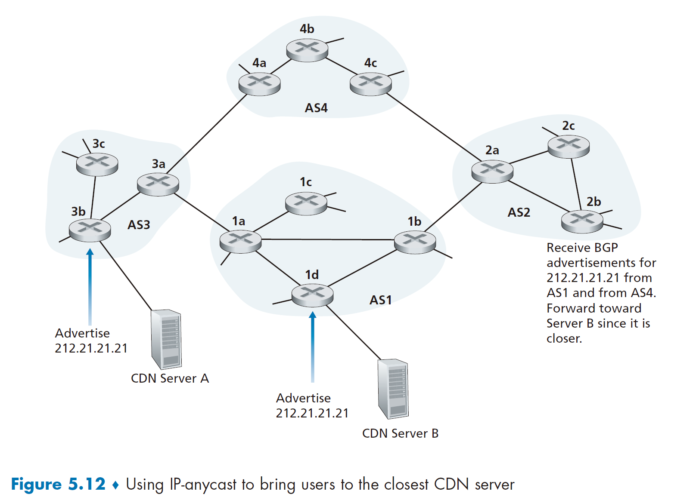

尽管上述 CDN 的例子很好地诠释了能够如何使用 IP 任播，但实践中 CDN 通常选择不使用 IP 任播，因为 BGP 路由选择变化能够导致相同的 TCP 连接的不同分组到达 Web 服务器的不同实例。但 IP 任播被 DNS 系统广泛用于将 DNS 请求指向最近的根 DNS 服务器。 2-4 节讲过，当前根 DNS 服务器有 13 个 IP 地址。但对应于这些地址的每一个，有多个 DNS 根服务器，其中有些地址具有 100 多个 DNS 根服务器分散在世界的各个角落。当一个 DNS 请求向这 13 个 IP 地址发送时，使用 IP 任播将该请求路由到负责该地址的最近的那个 DNS 根服务器。

### 5.4.5. 路由策略

当某路由器选择到目的地的一条路由时，AS 路由选择策略能够胜过所有其他考虑，例如最短 AS 路径或热土豆路由选择。在路由选择算法中，实际上首先根据本地偏好属性选择路由，本地偏好值由本地 AS 的策略所确定。

我们用一个简单的例子说明 BGP 路由选择策略的某些基本概念。图 5-13 显示了 6 个 互联的自治系统：A、B、C、W、X 和 Yo 重要的是注意到 A、B、C、W、X 和 Y 是 AS,而不是路由器。假设自治系统 w W、X 和 Y 是接入 ISP,而 A、B 和 C 是 主干提供商网络。我们还要假设 A、B 和 C 直接向彼此发送流量，并向它们的 客户网络提供全部的 BGP 信息。所有进入一个接入 ISP 网络的流量必定是以该网络为目的 地，所有离开一个接入 ISP 网络的流量必定源于该网络。W 和 Y 显然是接入 ISP。X 是一 个多宿接入 ISP （multi-homed stub network）,因为它是经由两个不同的提供商连到网络的 其余部分（这种方法在实践中变得越来越普遍）。然而，就像 W 和 Y—样，X 自身必定是 进入/离开 X 的所有流量的源/目的地。但这种桩网络的行为是如何实现和强制实现的呢? X 如何防止转发 B 与 C 之间的流量呢？这能够通过控制 BGP 路由的通告方式容易地实现。 特别是，X 如果（向其邻接 B 和 C）通告它没有通向（除自身以外）任何其他目的地的路 径，那么它将起到一个接入 ISP 的作用。这就是说，即使 X 可能知道一条路径（比如说 XCY）能到达网络 Y,它也将不把该条路径通告给 B。由于 B 不知道 X 有一条路径到 Y, B 绝不会经由 X 转发目的为 Y （或 C）的流量。这个简单的例子说明了如何使用一条选择 的路由通告策略来实现客户/提供商路由选择关系。

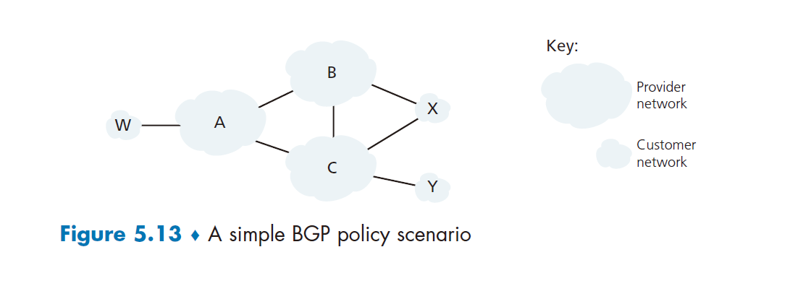

我们接下来关注一个提供商网络，比如自治系统 B。假定 B 已经（从 A 处）知道了 A 有一条到 W 的路径 AW。B 因此能将路由 AW 安装到其路由信息库中。显然，B 也想向它 的客户 X 通告路径 BAW,这样 X 知道它能够通过 B 路由到 W。但是，B 应该将路径 BAW 通告给 C 吗？如果它这样做，则 C 可以经由 BAW 将流量引导到 W。如果 A、B 和 C 都是 主干提供商，而 B 也许正好觉得它不应该承担在 A 与 C 之间传送流量的负担（和开销）。 B 可能有理由认为，确保 C 能经过 A 和 C 之间的直接连接引导 A 客户的来去流量是 A 和 C 的工作（和开销）。目前还没有强制主干 ISP 之间如何路由选择的官方标准。然而，商业运行的 ISP 们都遵从的一个经验法则是：任何穿越某 ISP 主干网的流量必须是其源或目的
（或两者）位于该 ISP 的某个客户网络中；不然的话这些流量将会免费搭车通过该 ISP 的 网络。各个对等协定（用于解决前面提到的问题）通常都是 ISP 双方进行协商，而且经常是对外保密的；［Huston 1999a］提供了关于对等协定的有趣讨论。路由选择策略如何反映 ISP 之间的商业关系的详细描述参见［Gao 2001； Dmitiropoulos 2007］。从 ISP 的立场出发, 有关 BGP 路由选择策略的讨论参见［Caesar 2005b］。

我们完成了对 BGP 的简要介绍。理解 BGP 是重要的，因为它在因特网中起着重要作用。我们鼓励你阅读参考文献[Stewart 1999; Huston 2019a; Labovitz 1997; Halabi 2000; Huitema 1998; Gao 2001; Feamster 2004; Caesar 2005b; Li 2007]，以学习更多的 BGP 知识。

### 5.4.6. 拼装在一起：在因特网中呈现

尽管本小节不是有关 BGP 本身的，但它将我们到此为止看到的许多协议和概念结合到一起，包括 IP 地址、DNS 和 BGP。假定你只是创建了一个具有若干服务器的小型公司网络，包括一台描述公司产品和服务的公共 Web 服务器，一台从你的雇员获得他们的电子邮件报文的电子邮件服务器和一台 DNS 服务器。你当然乐意整个世界能够访问你的 Web 站点，以得知你的现有产品和服务。此外，你将乐意你的雇员能够向遍及世界的潜在客户发送和接收电子邮件。

为了满足这些目标，你首先需要获得因特网连接，要做到这一点，需要与本地 ISP 签订合同并进行连接。你的公司将有一台网关路由器，该路由器将与本地 ISP 的一台路由器相连。该连接可以是一条通过现有电话基础设施的 DSL 连接、一条到 ISP 路由器的租用线，或者是第 1 章描述的许多其他接入解决方案之一。你的本地 ISP 也将为你提供一个 IP 地址范围，例如由 256 个地址组成的一个/24 地址范围。一旦你有了自己的物理连接和 IP 地址范围，你将在该地址范围内分配 IP 地址：一个给你的 Web 服务器，一个给你的电子 邮件服务器，一个给你的 DNS 服务器，一个给你的网关路由器，并将其他 IP 地址分配给公司网络中的其他服务器和联网设备。

除了与一个 ISP 签订合同外，你还需要与一个因特网注册机构签订合同，以便为你的公司获得一个域名，如在第 2 章中所描述的那样。例如，如果你的公司名称比如说是 Xacomnadu Inc,你自然希望获得域名 xanadu.com。你的公司还必须呈现在 DNS 系统中。具体 而言，因为外部世界将要联系你的 DNS 服务器以获得该服务器的 IP 地址，所以你还需要 为注册机构提供你的 DNS 服务器的 IP 地址。该注册机构则在顶级域名服务器中为你的 DNS 服务器设置一个表项（域名和对应的 IP 地址），如第 2 章所述。在这个步骤完成后，任何知道你的域名（例如 xanadu.com）的用户将能够经过 DNS 系统获得你 DNS 服务器的 IP 地址。

为了使人们能够发现你的 Web 服务器的 IP 地址，你需要在你的 DNS 服务器中包括一个将你的 Web 服务器的主机名（例如 www.xanadu.com）映射到它的 IP 地址的表项。你还要为公司中其他公共可用的服务器设置类似的表项，包括你的电子邮件服务器。如此一来，如果 Alice 要浏览你的 Web 服务器，DNS 系统将联系你的 DNS 服务器，找到你的 Web 服务器的 IP 地址，并将其给 Alice。Alice 则能与你的 Web 服务器创建一个直接的 TCP 连接。

然而，允许来自世界各地的外部人员访问你的 Web 服务器，仍然还有一个必要的、 决定性的步骤。考虑当 Alice 做下列事情发生的状况：Alice 知道你的 Web 服务器的 IP 地址，她向该 IP 地址发送一个 IP 数据报（例如一个 TCP SYN 报文段）。该数据报将通过因 特网进行路由，经历了在许多不同的自治系统中的一系列路由器，最终到达你的 Web 服 务器。当任何一个路由器收到该数据报时，将去它的转发表中寻找一个表项来确定转发该数据报的外出端口。因此，每台路由器需要知道你公司的/24 前缀（或者某些聚合项）。

一台路由器如何知道你公司的前缀呢？如我们刚才看到的那样，它从 BGP 知道了该前缀。具体而言，当你的公司与本地 ISP 签订合同并且获得了分配的前缀（即一个地址范围），你的本地 ISP 将使用 BGP 向与之连接的 ISP 通告你的前缀。这些 ISP 将依次使用 BGP 来传播该通告。最终，所有的因特网路由器将得知了你的前缀（或者包括你的前缀的某个聚合项），因而能够将数据报适当地转发到适当的 Web 和电子邮件服务器。

**time : 2021-06-27**

## 5.5. SDN 控制平面

在本节中，我们将深入 SDN 控制平面，即控制分组在网络的 SDN 使能设备中转发的 网络范围逻辑，以及这些设备和它们的服务的配置与管理。这里的学习建立在前面 4-4 节 中一般化 SDN 转发讨论的基础上，因此你在继续学习前需要先回顾一下那一节，以及本章的 5-1 节。如同 4-4 节中一样，我们将再次采用在 SDN 文献中所使用的术语，将网络的 转发设备称之为“分组交换机”（或直接称为交换机，理解时带上“分组”二字），因为 能够根据网络层源/目的地址、链路层源/目的地址以及运输层、网络层和链路层中分组首部字段做出转发决定。

SDN 体系结构具有 4 个关键特征[Kreutz 2015]:

- **基于流的转发**。SDN 控制的交换机的分组转发工作，能够基于运输层、网络层或链路层首部中任意数量的首部字段值进行。在 4-4 节中，我们看到了 OpenFlow 1.0 抽象允许基于 11 个不同的首部字段值进行转发。这与我们 5-2 到 5-4 节中学习的基于路由器转发的传统方法形成了鲜明的对照，传统方法中 IP 数据报的转发仅依据数 据报的目的 IP 地址进行。回顾图 5-2，分组转发规则被精确规定在交换机的流表中；SDN 控制平面的工作是计算、管理和安装所有网络交换机中的流表项。
- **数据平面与控制平面分离**。这种分离明显地显示在图 5-2 和图 5-14 中。数据平面由网络交换机组成，交换机是相对简单（但快速）的设备，该设备在它们的流表中 执行“匹配加动作”的规则。控制平面由服务器以及决定和管理交换机流表的软件组成。
- **网络控制功能：位于数据平面交换机外部**。考虑到 SDN 中的“S”表示“软件”，也许 SDN 控制平面由软件实现并不令人惊讶。然而，与传统的路由器不同，这个软件在服务器上执行，该服务器与网络交换机截然分开且与之远离。如在图 5-14 中所示，控制平面自身由两个组件组成:一个 SDN 控制器（或网络操作系统[Gude 2008 ]）,以及若干网络控制 应用程序。控制器维护准确的网络状态信息（例如，远程链路、交换 机和主机的状态）；为运行在控制平 面中的网络控制应用程序提供这些 信息；提供方法，这些应用程序通 过这些方法能够监视、编程和控制 下面的网络设备。尽管在图 5-14 中 的控制器显示为一台单一的服务器, 但实践中控制器仅是逻辑上集中的, 通常在几台服务器上实现，这些服 务器提供协调的、可扩展的性能和高可用性。
- **可编程的网络**。通过运行在控制平面中的网络控制应用程序，该网络是可编程的。这些应用程序代表了 SDN 控制平面的“智力”，使用了由 SDN 控制器提供的 API 来定义和控制网络设备中的数据平面。例如，一个路由选择网络控制应用程序可以决定源和目的地之间的 端到端路径（例如，通过使用由 SDN 控制器维护的节点状态和链路状态信息，执行 Dijkstra 算法）。另一个网络应用程序可以执行访问控制，即决定交换机阻挡哪个分组，如 4-4-3 节中的第三个例子那样。还有一个应用程序可以用执行服务器负载均衡的方式转发分组（4-4-3 节中我们考虑的第二个例子）。

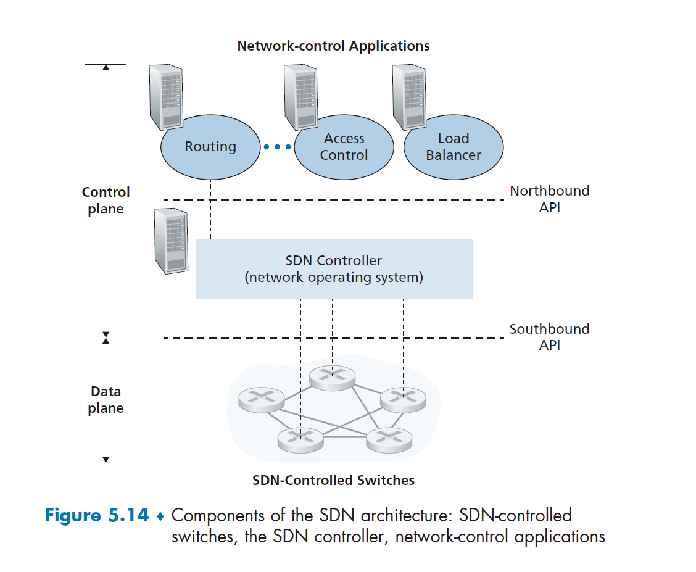

从讨论中我们可见，SDN 表示了一种意义重大的网络功能的“分类”，即数据平面交换机、SDN 控制器和网络控制应用程序是分离的实体，该实体可以由不同的厂商和组织机 构所提供。这与 SDN 之前模式形成了鲜明对照，在 SDN 之前模式中，交换机/路由器（连 同其嵌入的控制平面软件和协议实现）是一个整体，它是垂直、综合的，并且由单一的厂 商所销售。在 SDN 中的这种网络功能分类，可以与大型计算机到个人计算机的早期演化相比拟，前者的硬件、系统软件和应用程序是由单一厂商所提供的，而后者具有各自的硬件、操作系统和应用程序。计算硬件、系统软件和应用程序的分类，无疑已经在所有这三个领域的创新驱动下导致了丰富、开放的生态系统。对 SDN 的希望是，它也将导致如此丰富的创新。

给出了我们对图 5-14 的 SDN 体系结构的理解，自然会产生许多问题。流表是如何实际计算的，以及在哪里进行的？响应 SDN 控制的设备产生的事件时（例如，一条附属链路的激活/关闭），这些流表是如何更新的呢？在协作的多台交换机中，流表项是如何以一种导致和谐、一致的网络范围功能的方式进行协作的呢（例如，用于转发分组的从源到目 的地的端到端路径，或与分布式防火墙协作）？提供这些以及许多其他能力是 SDN 控制平面的作用。

### 5.5.1. SDN 控制平面：SDN 控制器和 SDN 网络控制应用程序

我们通过考虑控制平面必须提供的一般能力开始抽象地讨论 SDN 控制平面。如我们所见，这种抽象即“基本原理”方法将我们引向一个总体的体系结构，该体系结构反映了 SDN 控制平面如何在实际中实现。

如上所述，SDN 控制平面大体划分为两个部分，即 SDN 控制器和 SDN 网络控制应用程序。我们先来仔细考察控制器。自从最早的 SDN 控制器［Gude 2008］开发以来，已经研制了多种 SDN 控制器，文献［Kreutz2015］极其全面地综述了最新进展。图 5-15 提供了一个通用 SDN 控制器的更为详尽的视图。控制器的功能可大体组织为 3 个层次。我们以一种非典型的自底向上方式考虑这些层次:

- **通信层**。SDN 控制器和受控网络设备之间的通信。显然，如果 SDN 控制器要控制远程 SDN 使能的交换机、主机或其他设备的运行，需要一个协议来传送控制器与这些设备之间的信息。此外，设备必须能够向控制器传递本地观察到的事件（例 如，一个报文指示一条附属链路已经激活或停止，一个设备刚刚加入了网络，或一个心跳指示某设备已经启动和运行）。这些事件向 SDN 控制器提供该网络状态的最 新视图。这个协议构成了控制器体系结构的最底层，如图 5-15 中所示。控制器和受控设备之间的通信跨越了一个接口，它现在被称为控制器的“南向”接口。在 5-5-2 节中，我们将学习 OpenFlow,它是一种提供这种通信功能的特定协议。OpenFlow 在大多数 SDN 控制器中得到了实现（即使不是全部）。
- **网络范围状态管理层**。由 SDN 控制平面所做出的最终控制决定（例如配置所有交换机的流表以取得所希望的端到端转发，实现负载均衡，或实现一种特定的防火墙能力），将要求控制器具有有关网络的主机、链路、交换机和其他 SDN 控制设备的最新状态信息少交换机的流表包含计数器，其值也可以由网络控制应用程序很好地使用；因此这些值应当为应用程序所用。既然控制平面的终极目标是决定用于各种受控设备的流表，控制器也就可以维护这些表的拷贝。这些信息都构成了由 SDN 控制器维护的网络范围“状态”的例子。
- **对于网络控制应用程序层的接口**。控制器通过它的“北向”接口与网络控制应用程序交互。该 API 允许网络控制应用程序在状态管理层之间读/写网络状态和流表。当状态改变事件出现时，应用程序能够注册进行通告。可以提供不同类型的 API, 我们将看到两种流行 SDN 控制器使用 REST ［ Fielding 2000］请求响应接口与它们的应用程序进行通信。

我们已经提到过几次，SDN 控制器被认为是“逻辑上集中”的，即该控制器可以被外部视为一个单一、整体的服务（例如，从 SDN 控制设备和外部的网络控制应用程序的角度看）。然而，出于故障容忍、高可用性或性能等方面的考虑，在实践中这些服务和用 于保持状态信息的数据库一般通过分布式服务器集合实现。在服务器集合实现控制器功能时，必须考虑控制器的内部操作（例如维护事件的逻辑时间顺序、一致性、意见一致等）的语义［Panda 2013］。这些关注点在许 多不同的分布式系统中都是共同的，这些挑战的简洁解决方案可参见［Lamport 1989 ； Lampson 1996 ］。诸如 OpenDay- light 和 ONOS 这样的现代控制器已经将 很大的注意力放在构建一种逻辑上集中但物理上分布的控制器平台上，该平台提供可扩展的服务和对受控设备以及网络控制应用程序的高可用性。

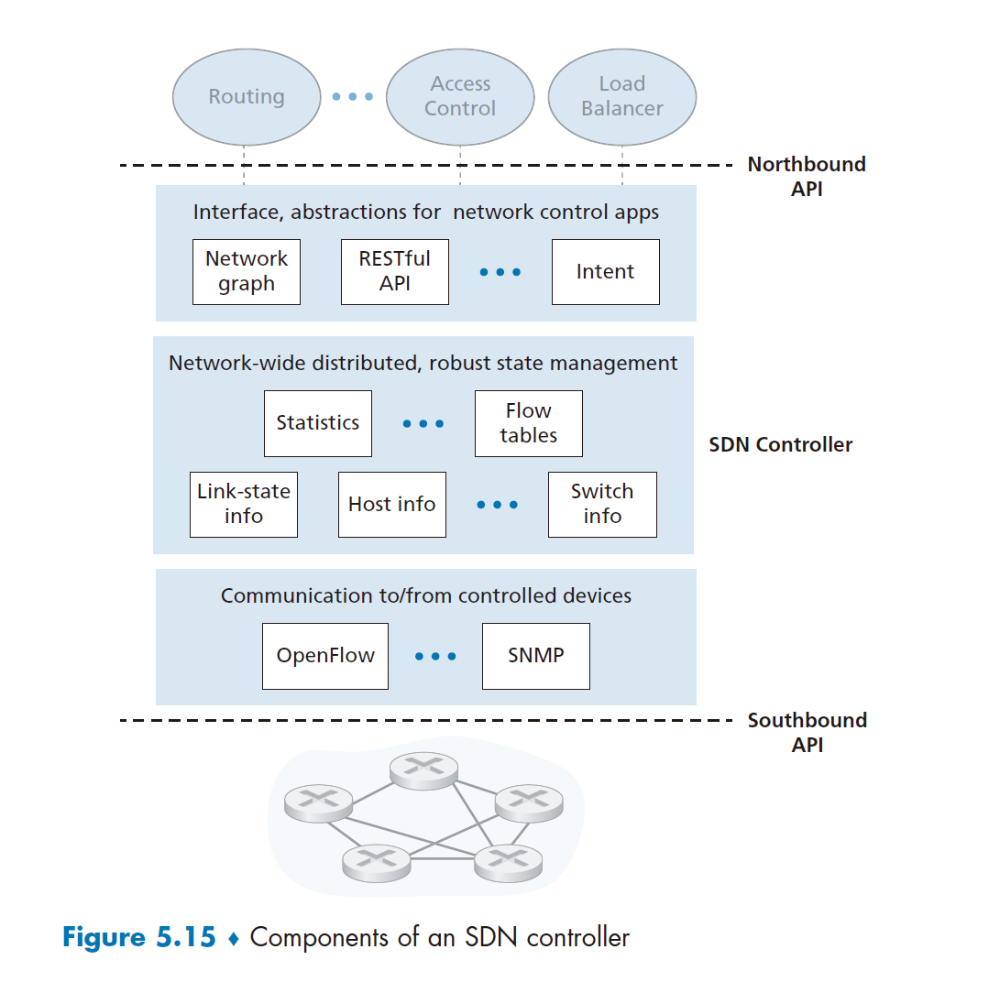

在图 5-15 中描述的体系结构与 2008 年最初提出的 NOX 控制器［Gude 2008］以及今天的 OpenDaylight [OpenDaylightLithium 2020]和 ONOS [ONOS 2020] SDN 控制器（参见插入材料）的体系结构极为相似。我们将在 5-5-3 节介绍一个控制器操作的例子。然而，我们先来仔细审视 OpenFlow 协议，该协议位于控制器的通信层中。

### 5.5.2. OpenFlow 协议

OpenFlow 协议［OpenFlow 2009； ONF 2016］运行在 SDN 控制器和 SDN 控制的交换机或其他实现 OpenFlow API 的设备之间（OpenFlow API 我们在 4-4 节学习过）。OpenFlow 协议运行在 TCP 之上，使用 6653 的默认端口号。从控制器到受控交换机流动的重要报文有下列这些：

- **配置**。该报文允许控制器查询并设置交换机的配置参数。
- **修改状态**。该报文由控制器所使用，以增加/删除或修改交换机流表中的表项，并且设置交换机端口特性。
- **读状态**。该报文被控制器用于从交换机的流表和端口收集统计数据和计数器值。
- **发送分组**。该报文被控制器用于在受控交换机从特定的端口发送出一个特定的报文。

从受控交换机到控制器流动的重要报文有下列这些：

- **流删除**。该报文通知控制器已删除一个流表项，例如由于超时，或作为收到“修改 状态”报文的结果。
- **端口状态**。交换机用该报文向控制器通知端口状态的变化。
- **分组入**。4-4 节讲过，一个分组到达交换机端口，并且不能与任何流表项匹配，那 么这个分组将被发送给控制器进行额外处理。匹配的分组也被发送给控制器，作为匹配时所采取的一个动作。“分组入”报文被用于将分组发送给控制器。另外的 OpenFlow 报文定义在［OpenFlow 2009 ；ONF 2016 ］中。

### 5.5.3. 数据平面和控制平面交互的例子

为了具体地理解 SDN 控制的交换机与 SDN 控制器之间的交互，我们考虑图 5-16 中所示的例子，其中使用了 Dijkstra 算法（该算法我们已在 5-2 节中学习过）来决定最短路径路由。图 5-16 中的 SDN 场景与前面 5-2-1 节和 5-3 节中描述的每路由器控制场景有两个重要差异，Dijkstra 算法是实现在每台 路由器中并且在所有网络路由器中泛洪链路状态更新:

- Dijkstra 算法作为一个单独的程序来执行，位于分组交换机的外部。
- 分组交换机向 SDN 控制器发送链路更新并且不互相发送。

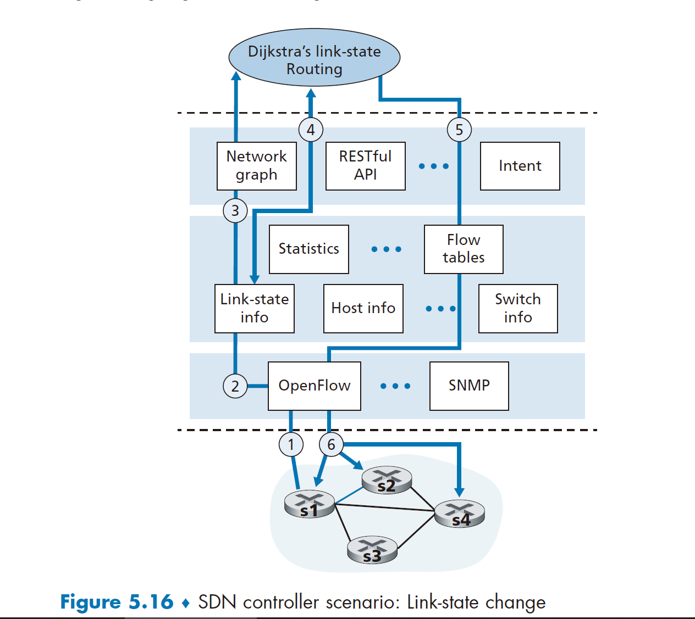

在这个例子中，我们假设交换机 s1 和 s2 之间的链路断开；实现了最短路径路由选择，因此，除了 s2 操作未改变外，s1、s3 和 s4 的入和出流转发规则都受到影响。我们也假定 OpenFlow 被用作通信层协议，控制平面只执行链路状态路由选择而不执行其他功能。

1） 交换机 s1 经历了自己与 s2 之间的链路故障，使用 OpenFlow "端口状态”报文向 SDN 控制器通报该链路状态的更新。
2） SDN 控制器接收指示链路状态更新的 OpenFlow 报文，并且通告链路状态管理器，由管理器更新链路状态库。
3）实现 Dijkstra 链路状态路由选择的网络控制应用程序先前进行了注册，当链路状态 更新时将得到通告。应用程序接收该链路状态更新的通告。
4）链路状态路由选择应用程序与链路状态管理器相互作用，以得到更新的链路状态; 它也会参考状态管理层中的其他组件。然后它计算新的最低开销路径。
5）链路状态路由选择应用则与流表管理器交互，流表管理器决定更新的流表。
6）流表管理器则使用 OpenFlow 协议更新位于受影响的交换机 s1、s2 和 s4 的流表项, 其中 s1 此时将经 s4 将分组的目的地指向 s2, s2 此时将经中间交换机 s4 开始接收来自 s1 的分组，S 此时必须转发来自 s1 且目的地为 s2 的分组。

这个例子虽简单，但图示了 SDN 控制平面如何提供控制平面服务（此时为网络层路 由选择），而该服务以前是以每路由器控制在每台路由器中实现的。我们现在能够容易地 体会到，SDN 使能的 ISP 能够容易地将最低开销路径的路由选择转变为更加定制的路由选 择方法。因为控制器的确能够随心所欲地定制流表，因此能够实现它喜欢的任何形式的转发，即只是通过改变它的应用控制软件。这种改变的便利性与传统的每路由器控制平面的情况形成对照，传统的情况必须要改变所有路由器中的软件，而这些路由器可能是由多个不同厂商提供给 ISP 的。

### 5.5.4. SDN 的过去与未来

尽管对 SDN 的强烈兴趣是相对近期的现象，但 SDN 的技术根源，特别是数据平面和 控制平面的分离，可追溯到相当久远。在 2004 年，文献［Feamster 2004 ； Lakshman 2004 ； RFC 3746］中都赞成网络数据平面与控制平面分离。［vander Merwe 1998］描述了用于具 有多个控制器的 ATM 网络［Black 1995］的控制框架，每台控制器控制若干 ATM 交换机。 Ethane 项目开拓了简单基于流的多台以太网交换机和一台集中式控制器的网络概念，其中 以太网交换机具有匹配加动作流表，控制器管理流准入和路由选择，而未匹配的分组将从 交换机转发到控制器。在 2007 年，超过 300 台 Ethane 交换机的网络投入运行。Ethane 迅速演化为 OpenFlow 项目，而其他的成为历史！

很多研究工作以研发未来 SDN 体系结构和能力为目标。如我们所见，SDN 革命正在 导致颠覆性地替代专用的整体交换机和路由器（它们同时具有数据平面和控制平面）。类 似地，称之为网络功能虚拟化（NFV）的通用 SDN 的目标是用简单的商用服务器、交换 机和存储器［Gember・Jacobson 2014］来颠覆性地替代复杂的中间盒（例如用于媒体高速 缓存/服务的具有专用硬件和专有软件的中间盒）。第二个重要研究领域是寻求将 SDN 概 念从 AS 内部设置扩展到 AS 之间设置［Gupta 2014］。

## 5.6. ICMP：因特网控制报文协议

由［RFC 792］定义的因特网控制报文协议（ICMP），被主机和路由器用来彼此沟通网络层的信息。ICMP 最典型的用途是差错报告。例如，当运行一个 HTTP 会话时，你也 许会遇到一些诸如“目的网络不可达”之类的错误报文。这种报文就来源于 ICMP。在某个位置，IP 路由器不能找到一条通往 HTTP 请求中所指定的主机的路径，该路由器就会向你的主机生成并发出一个 ICMP 报文以指示该错误。

ICMP 通常被认为是 IP 的一部分，但从体系结构上讲它位于 IP 之上，因为 ICMP 报文 是承载在 IP 分组中的。这就是说，ICMP 报文是作为 IP 有效载荷承载的，就像 TCP 与 UDP 报文段作为 IP 有效载荷被承载那样。类似地，当一台主机收到一个指明上层协议为 ICMP 的 IP 数据报时（上层协议编码为 1），它分解出该数据报的内容给 ICMP，就像分解岀一个数据报的内容给 TCP 或 UDP 一样。

ICMP 报文有一个类型字段和一个编码字段，并且包含引起该 ICMP 报文首次生成的 IP 数据报的首部和前 8 个字节（以便发送方能确定引发该差错的数据报）。在下表中显示了所选的 ICMP 报文类型。注意到 ICMP 报文并不仅是用于通知差错情况。

| ICMP 类型 | 编码 | 描述                |
| --------- | ---- | ------------------- |
| 0         | 0    | 回显回答（对 ping） |
| 3         | 0    | 目的网络不可达      |
| 3         | 1    | 目的主机不可达      |
| 3         | 2    | 目的协议不可达      |
| 3         | 3    | 目的端口不可达      |
| 3         | 6    | 目的网络未知        |
| 3         | 7    | 目的主机未知        |
| 4         | 0    | 源抑制（拥塞控制）  |
| 8         | 0    | 回显请求            |
| 9         | 0    | 路由器通告          |
| 10        | 0    | 路由器发现          |
| 11        | 0    | TTL 超出            |
| 12        | 0    | IP 首部损坏         |

众所周知的 ping 程序发送一个 ICMP 类型 8 编码 0 的报文到指定主机。看到回显（echo）请求，目的主机发回一个类型 0 编码 0 的 ICMP 回显回答。大多数 TCP/IP 实现直接在操作系统中支持 ping 服务器，即该服务器不是一个进程。［Stevens 1990］的第 11 章 提供了有关 ping 客户程序的源码。注意到客户程序需要能够指示操作系统产生一个类型 8 编码 0 的 ICMP 报文。

另一个有趣的 ICMP 报文是源抑制报文。这种报文在实践中很少使用。其最初目的是执行拥塞控制，即使得拥塞的路由器向一台主机发送一个 ICMP 源抑制报文，以强制该主 机减小其发送速率。我们在第 3 章已看到，TCP 在运输层有自己的拥塞控制机制，不需要利用网络层中的反馈信息，如 ICMP 源抑制报文。

在第 1 章中我们介绍了 Traceroute 程序，该程序允许我们跟踪从一台主机到世界上 任意一台主机之间的路由。有趣的是，Traceroute 是用 ICMP 报文来实现的。为了判断源和目的地之间所有路由器的名字和地址，源主机中的 Traceroute 向目的地主机发送一系列普通的 IP 数据报。这些数据报的每个携带了一个具有不可达 UDP 端口号的 UDP 报文段。第一个数据报的 TTL 为 1，第二个的 TTL 为 2，第三个的 TTL 为 3，依次类推。该源主机也为每个数据报启动定时器。当第 n 个数据报到达第 n 台路由器时，第 n 台路由器观察到这个数据报的 TTL 正好超出。根据 IP 协议规则，路由器丢弃该数据报并发送一个 ICMP 警告报文给源主机（类型 11 编码 0）。该警告报文包含了路由器的名字和它的 IP 地址。当该 ICMP 报文返回源主机时，源主机从定时器得到往返时延，从 ICMP 报文中得到第 n 台路由器的名字与 IP 地址。

Traceroute 源主机是怎样知道何时停止发送 UDP 报文段的呢？前面讲过源主机为它发 送的每个报文段的 TTL 字段加 1。因此，这些数据报之一将最终沿着这条路到达目的主 机。因为该数据报包含了一个具有不可达端口号的 UDP 报文段，该目的主机将向源发送一个端口不可达的 ICMP 报文（类型 3 编码 3）。当源主机收到这个特别的 ICMP 报文时，知道它不需要再发送另外的探测分组。（标准的 Traceroute 程序实际上用相同的 TTL 发送 3 个一组的分组，因此 Traceroute 输出对每个 TTL 提供了 3 个结果。）

以这种方式，源主机知道了位于它与目的主机之间的路由器数量和标识，以及两台主机之间的往返时延。注意到 Traceroute 客户程序必须能够指令操作系统产生具有特定 TTL 值的 UDP 数据报，当 ICMP 报文到达时，也必须能够由它的操作系统进行通知。既然你已明白了 Traceroute 的工作原理，你也许想返回去更多地使用它。

在 RFC 4443 中为 IPv6 定义了 ICMP 的新版本。除了重新组织现有的 ICMP 类型和编码定义外，ICMPv6 还增加了新型 IPv6 功能所需的新类型和编码。这些包括“分组太大”类型和一个“未被承认的 IPv6 选项”差错编码。

## 5.7. 网络管理和 SNMP

此时我们的网络层学习已经走到了结尾，我们前面仅有链路层了，我们都熟知网络是由许多复杂、交互的硬件和软件部件组成的，既包括构成网络的物理部件的链路、交换机、路 由器、主机和其他设备，也包括控制和协调这些设备的许多协议。当一个机构将数以百计或数以千计的这种部件拼装在一起形成一个网络时，保持该网络“运行良好”对网络管理员无 疑是一种挑战。我们在 5-5 节中看到，SDN 环境中逻辑上集中的控制器能够有助于这种过程。但是网络管理的挑战在 SDN 出现前很久就已如影相随了，网络管理员使用丰富的网络管理工具和方法来监视、管理和控制该网络。在本节中我们将学习这些工具和技术。

一个经常被问到的问题是：什么是网络管理？我们用一个构思缜密的单句(虽然它相当冗长)来概括网络管理的定义［Saydam 1996］：

“网络管理包括了硬件、软件和人类基本组成的设置、综合和协调，以监视、测试、轮询、配置、分析、评价和控制网络及网络基本组成资源，用合理的成本满足实时性、运营性能和服务质量的要求。”

给定了这个宽泛的定义，本节我们将仅涉及网络管理的入门知识，即网络管理员在执 行其任务中所使用的体系结构、协议和信息库。我们将不涉及网络管理员的决策过程，其 中故障标识［Labovitz 1997 ； Steinder 2002； Feamster 2005 ； Wu 2005 ； Teixeira 2006 ］异常检测［Lakh ina 2005 ； Barford 2009 ］ 满足约定的服务等级约定(Service Level Agreements ,SLA)的网络设计/工程［Huston 1999a］等主题会加以考虑。因此我们有意识地 收窄关注点，有兴趣的读者应当参考这些文献：由 Subramanian 撰写的优秀的网络管理教 科书［Subramanian 2000］,以及本书 Web 网站上可用的详尽的网络管理材料。

### 5.7.1. 网络管理框架

图 5-20 显示了网络管理的关键组件。

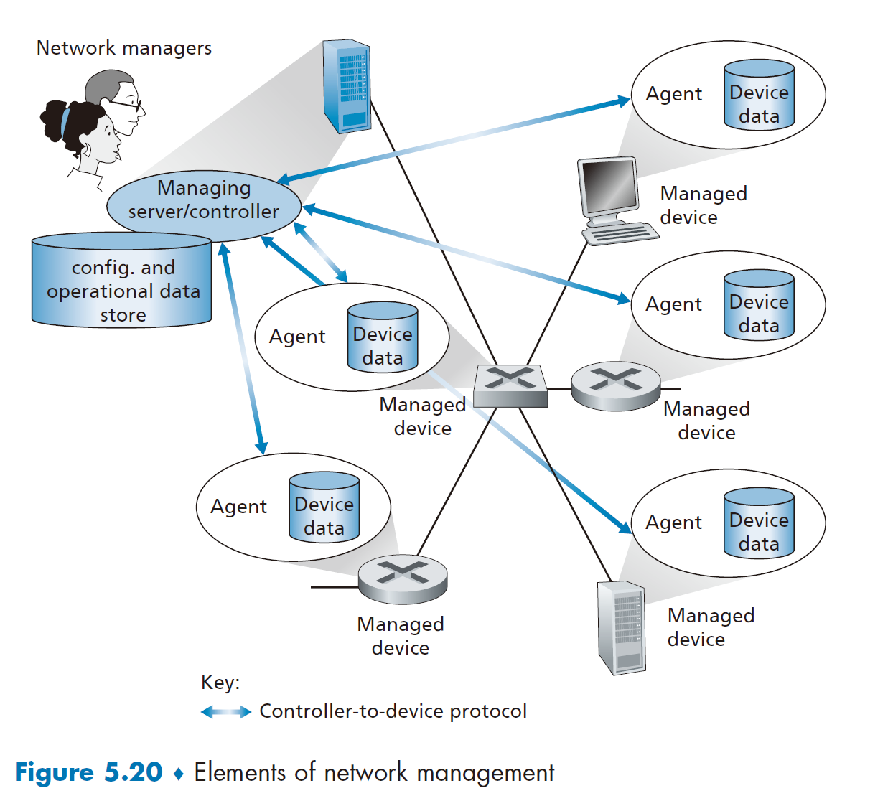

- **管理服务器(managing server)** 是一个应用程序，通常有人的参与，并运行在网络 运营中心（NOC）的集中式网络管理工作站上。管理服务器是执行网络管理活动的 地方，它控制网络管理信息的收集、处理、分析和/或显示。正是在这里，发起控 制网络行为的动作，人类网络管理员与网络设备打交道。
- **被管设备(managed device)** 是网络设备的一部分（包括它的软件），位于被管理的网络中。被管设备可以是一台主机、路由器、交换机、中间盒、调制解调器、温度 计或其他联网的设备。在一个被管设备中，有几个所谓 **被管对象(managed object)**。这些被管对象是被管设备中硬件的实际部分（例如，一块网络接口卡只是一台主机或路由器的一个组件）和用于这些硬件及软件组件的配置参数（例如，像 OSPF 这样的 AS 内部路由选择协议）。
- 一个被管设备中的每个被管对象的关联信息收集在 **管理信息库(Management Information Base, MIB)** 中，我们将看到这些信息的值可供管理服务器所用（并且在许多场合下能够被设置）。一个 MIB 对象可以是：一个计数器，例如由于 IP 数据报首部差错而由路由器丢弃的 IP 数据报的数量，或一台主机接收到的 UDP 报文段的数量；运行在一台 DNS 服务器上的软件版本的描述性信息；诸如一个特定设备功能 是否正确的状态信息；或诸如到一个目的地的路由选择路径的特定协议的信息。 MIB 对象由称为 SMI （ Structure of Management Information） [ RFC 2578 ； RFC 2579 ； RFC 2580]的数据描述语言所定义。使用形式化定义语言可以确保网络管理数据的 语法和语义是定义良好的和无二义性的。相关的 MIB 对象被收集在 MIB 模块(module) 中。到 2015 年年中，RFC 定义了大约 400 个 MIB 模块，还有大量厂商特定的（专用的）MIB 模块。
- 在每个被管设备中还驻留有 **网络管理代理(network management agent)**，它是运行 在被管设备中的一个进程，该进程与管理服务器通信，在管理服务器的命令和控制 下在被管设备中采取本地动作。网络管理代理类似于我们在图 5-2 中看到的路由选择代理。
- 网络管理框架的最后组成部分是 **网络管理协议(network management protocol)**。该协议 运行在管理服务器和被管设备之间，允许管理服务器查询被管设备的状态，并经过 其代理间接地在这些设备上采取行动。代理能够使用网络管理协议向管理服务器通 知异常事件（如组件故障或超过了性能阈值）。重要的是注意到网络管理协议自己 不能管理网络。恰恰相反，它为网络管理员提供了一种能力，使他们能够管理 （“监视、测试、轮询、配置、分析、评价和控制”）网络。这是一种细微但却重要的区别。在下节中，我们将讨论因特网的 SNMP 协议。

### 5.7.2. 简单网络管理协议(SNMP)

**简单网络管理协议(Simple Network Management Protocol)** 版本 2（SNMPv2） [RFC 3416]是一个应用层协议，用于在管理服务器和代表管理服务器执行的代理之间传递网络管理控制和信息报文。SNMP 最常使用的是请求响应模式，其中 SNMP 管理服务器向 SNMP 代理发送一个请求，代理接收到该请求后，执行某些动作，然后对该请求发送一个回答。请求通常用于查询（检索）或修改（设置）与某被管设备关联的 MIB 对象值。SNMP 第二个常被使用的是代理向管理服务器发送的一种非请求报文，该报文称为 **陷阱报文(trap message)**。陷阱报文用于通知管理服务器，一个异常情况（例如一个链路接口启动或关闭)已经导致了 MIB 对象值的改变。

下表中显示了 SNMPv2 定义的 7 种类型的报文，这些报文一般称为协议数据单元 (PDU)。图 5-21 显示了这些 PDU 的格式。

| SNMPv2 PDU 类型 | 发送方-接收方                | 描述                                                                                           |
| --------------- | ---------------------------- | ---------------------------------------------------------------------------------------------- |
| GetRequest      | 管理者到代理                 | 获取一个或多个 MIB 对象实例值                                                                  |
| GetNextRequest  | 管理者到代理                 | 获取表中下一个 MIB 对象实例值                                                                  |
| GetBulkRequest  | 管理者到代理                 | 以大数据块方式取得值，例如大表中的值                                                           |
| InformRequest   | 管理者到代理                 | 向不能访问的远程管理实体通知 MIB 值                                                            |
| SetRequest      | 管理者到代理                 | 设置一个或多个 MIB 对象实例的值                                                                |
| Response        | 代理到管理者或管理者到管理者 | 对 Get Request, Get Next Request. GetBulkRequest, Set Request PDU，或 InformRequest 产生的响应 |
| SNMPv2 Trap     | 代理到管理者                 | 向管理者通知一个异常事件                                                                       |


- GetRequest、GetNextRequest 和 GetBulkRequest PDU 都是管理服务器向代理发送的，以请求位于该代理所在的被管设备中的一个或多个 MIB 对象值。其值被请求的 M1B 对象的对象标识符定义在该 PDU 的变量绑定部分。GetRequest、GetNextRequest 和 GetBulkRequest 的差异在于它们的数据请求粒度。GetRequest 能够请求 M1B 值的任 意集合；多个 GetNextRequest 能用于顺序地读取 MIB 对象的列表或表格；GetBulkRequest 允许读取大块数据，能够避免因发送多个 GetRequest 或 GetNextRequest 报文可能导致的额外开销。在所有这三种情况下，代理用包括该对象标识符和它们相关值的 Response PDU 进行响应。
- 管理服务器使用 SetRequest PDU 来设置位于被管设备中的一个或多个 MIB 对象的值。代理用带有“rwError”差错状态的 Response PDU 进行应答，以证实该值的确已被设置。
- 管理服务器使用 InformRequest PDU 来通知另一个 MIB 信息管理服务器，后者对于接收服务器是远程的。
- Response PDU 通常从被管设备发送给管理服务器，以响应来自该服务器的请求报文，返回所请求的信息。
- SNMPv2 PDU 的最后一种类型是陷阱报文。陷阱报文是异步产生的，即它们不是为了响应接收到的请求而产生的，而是为了响应管理服务器要求通知的事件而产生的。RFC 3418 定义了周知的陷阱类型，其中包括设备的冷启动或热启动、链路就 绪或故障、找不到相邻设备，或鉴别失效事件。接收到的陷阱请求不要求从管理服务器得到响应。

考虑到 SNMPv2 请求响应性质，这时需要注意到尽管 SNMP PDU 能够通过许多不同的 运输协议传输，但 SNMP PDU 通常是作为 UDP 数据报的载荷进行传输的。RFC 3417 的确 表明 UDP 是“首选的运输映射”。然而，由于 UDP 是一种不可靠的运输协议，因而不能 确保一个请求或它的响应能够被它希望的目的地接收到。管理服务器用该 PDU 的请求 ID 字段为它向代理发送的请求编号；该代理的响应从接收到的请求中获取它的请求 ID。因此，该请求 ID 字段能被管理服务器用来检测丢失的请求或回答。如果在一定时间后还没有收到对应的响应，由管理服务器来决定是否重传一个请求。特别是，SNMP 标准没有强 制任何特殊的重传过程，即使初始进行重传。它只是要求管理服务器“需要根据重传的频 率和周期做岀负责任的动作”。当然，这使人想知道一个“负责任的”协议应当如何动作！

SNMP 经历了 3 个版本的演变。SNMPv3 的设计者说过“SNMPv3 能被认为是具有附加 安全性和管理能力的 SNMPv2” [ RFC 3410]。SNMPv3 无疑在 SNMPv2 基础上有改变，而 没有什么比在管理和安全领域的变化更为明显。在 SNMPv3 中，安全性的中心地位特别重要，因为缺乏适当的安全性导致 SNMP 主要用于监视而不是控制（例如，在 SNMPv1 中很少使用 SetRequest）。我们再一次看到安全性是重要的关注点（安全性是第 8 章详细学习的主题），尽管认识到它的重要性也许有些迟了，但“亡羊补牢，犹未为晚”。

**time : 2021-06-28**

## 5.8. 实验 9：通过 wireshark 观察 ICMP 报文

在本次 wireshark 实验中，我们将探索 ICMP 协议的一些方面：

- 由 Ping 程序生成的 ICMP 报文。
- 由 Traceroute 程序生成的 ICMP 报文。
- ICMP 报文的格式和语义。

### 5.8.1. ICMP 和 Ping

我们首先来观察由 Ping 程序生成的 ICMP 报文。Ping 程序主要用来测试目标主机是否可以到达。当源主机发送一个 ICMP 回显请求报文给目标主机后，如果目标主机可到达，则会回送一个 ICMP 回显回答报文。

执行以下步骤：

1. 打开 windows 上的 cmd 或者 powershell。
2. 打开 wireshark，并开始捕获。
3. 同时在 cmd 或 powershell 中键入命令 `ping -n 10 www.baidu.com`。`-n 10` 指定一共发送 10 个 IMCP 回显请求报文。 `www.baidu.com` 为目标主机。
4. 在 ping 程序终止时结束捕获。

cmd 或者 powershell 中 ping 程序运行的结果如下图所示：

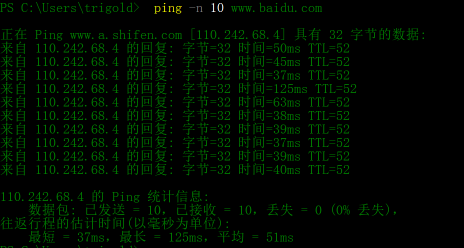

图中显示的列表的每一项包含三个字段的说明：字节，时间，TTL。字节表示目标主机回送的 ICMP 报文中数据的字节数。时间表示每一次请求的往返时间。TTL 表示回答报文中 TTL 字段的值。

在列表下面为统计信息，包括发送数据报总数，接收总数，丢包率，最短往返时间，最长往返时间，以及平均往返时间。

下面这张图显示了捕获的分组，我们需要在过滤框中键入“icmp”进行过滤。可以看到一共有 10 对 ICMP 报文。请求报文的源地址为私有地址 192.168.43.27，目的地址为 110.242.68.4。

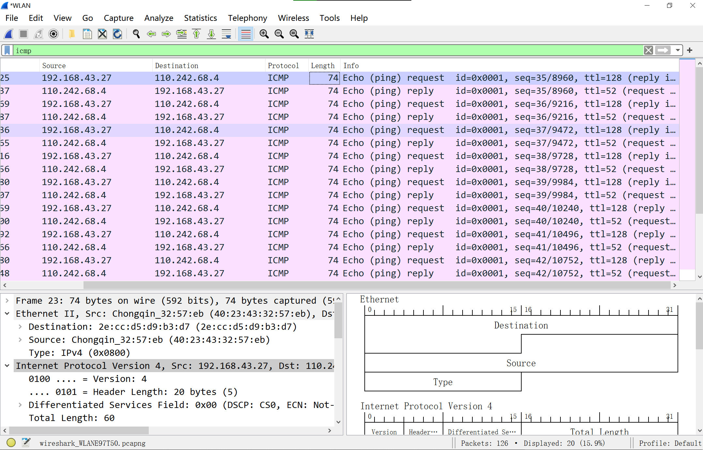

下图显示了一个具体的分组。我们可以看到在 ICMP 报文中，它的 type 为 8，code 为 0。所以这是一个回显请求报文。我们同时也注意到检验和，标识符，序号以及数据字段。在 IP 数据报中，我们看到 IP 承载的上层协议为 1，这表示 ICMP。

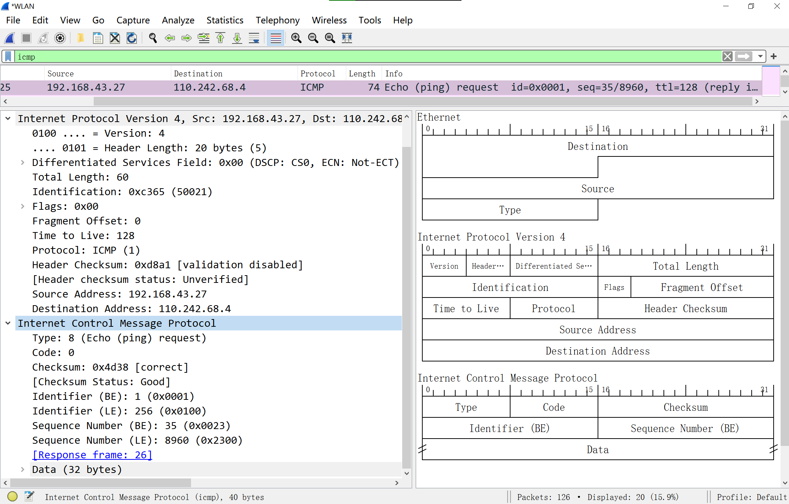

回答下列问题：

1. 你主机的 IP 地址为多少？目的主机的 IP 地址为多少？

   92.168.43.27，110.242.68.4

2. 为什么 ICMP 报文中没有端口字段？

ICMP 不是为进程提供服务，因此不必需要多路分解和复用，因而就没有端口字段。

3. 观察一个 ICMP 请求报文，这个 ICMP 报文的类型和编码字段时多少？其他字段各占多少字节？分别是什么内容？

类型：8，编码：0，检验和，序号，ID 都占 2 字节。数据占 4 字节。检验和为 0x4d33，序号为 40，ID 为 1。

4. 观察这个请求报文对应的回答报文，这个 ICMP 报文的类型和编码字段时多少？其他字段各占多少字节？分别是什么内容？

类型：0，编码：0，检验和，序号，ID 都占 2 字节。数据占 4 字节。检验和为 0x4d33，序号为 40，ID 为 1。

### 5.8.2. ICMP 和 Traceroute

现在我们观察由 Traceroute 程序生成的 ICMP 报文。Traceroute 程序用来探测本机到目的主机之间经历的路由。我们前面多次讨论过 Traceroute。

执行以下步骤：

1. 打开 windows 上的 cmd 或者 powershell。
2. 打开 wireshark，并开始捕获。
3. 同时在 cmd 或 powershell 中键入命令 `tracert www.baidu.com`。`www.baidu.com` 为目标主机。
4. 在 ping 程序终止时结束捕获。

cmd 或者 powershell 中 traceroute 程序运行的结果如下图所示：

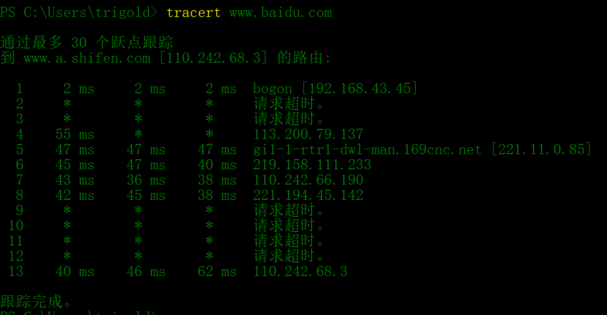

下面这张图显示了捕获的分组，我们需要在过滤框中键入“icmp”进行过滤。请求报文的源地址为私有地址 192.168.43.27，目的地址为 110.242.68.4。我们注意到 TTL 相同的 ICMP 报文，每次会发送 3 个。最后三个分组之前的分组在发送过后，都会有相应的 TTL 超出报文回应。而最后 3 个请求报文都得到了回应。

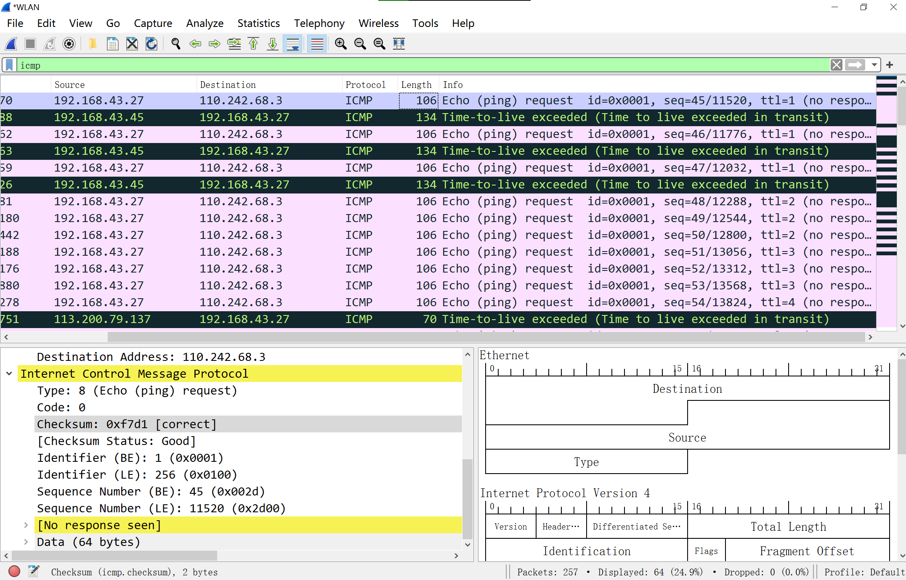

回答以下问题：

1. 观察一个 TTL 超出报文，它的 ICMP 类型和编码是多少？源地址是多少？

类型为 11，编码为 0，源地址为 192.168.43.62。

2. 这个 TTL 的数据字段中是什么？

这个 TTL 数据字段为它对应请求的数据报。

3. 根据这个 TTL 数据字段中的内容，怎么样找出对应请求？

数据字段中为它对应请求的数据报，因此可以找出 IMCP 请求报文中的序号字段，进而可以定位对应的请求报文。

4. 找出对应的 ICMP 请求报文，这个报文中的 TTL 值为多少？

TTL 为 1

5. 你的分组列表中由无法到达 ICMP 报文吗？它的 ICMP 类型和编码是多少？

有，类型为 3，编码为 3，为端口不可达 ICMP 报文

6. 观察最后 3 个没有 TTL 超出报文回应的 ICMP 请求报文之一，你能找出对应的回答报文吗？说出你的理由？

这个请求报文的序号为 117，在 3 个回答报文中找出序号为 117 的那个，即为对应的回答报文。

**time : 2021-06-29**

# 6. 链路层和局域网

在前 2 章我们学习了网络层提供了主机到主机的通信服务。数据报从源主机开始，穿过一系列的通信链路（有线的和无线的）和分组交换机（交换机和路由器），最终到达目的主机。随着我们的学习顺着协议栈往下，我们自然想搞清楚组成主机到主机路径上的单一链路上，分组是怎么传递的。数据报怎么封装为链路层中的分组：帧？不同媒体的链路会使用不同的协议吗？广播链路上的传输冲突是怎么解决的？链路层上是否有编址呢，如果有，链路层编址怎么和网络层编址协作？交换机和路由器的区别准确来讲，到底是什么？在本章，我们将会回答这些问题。

在讨论链路层之前，我们先来介绍在链路层中，有 2 种不同的信道。一种是广播信道，广播信道连接多个主机，广播信道存在于无线局域网(WLAN)，卫星网络，以及混合光纤同轴(HFC)接入网。在广播信道中，由于多个主机使用单一的信道传输帧，那么就需要一种所谓的媒体访问协议来协同这些主机。有些情况，一个中心控制器用来协作传输，在另一些情况，主机自身来协作传输。第二种信道为点到点信道，这种信道存在于两台长距离连接的路由器或者主机和以太网交换机连接。点到点信道的协作比较简单，配套网站上有关于 **点到点协议(Point-to-Point, PPP)** 的详细讨论，这种协议被使用在拨号连接服务和高速点到点光纤链路。

在本章，我们将会探索许多链路层概念和技术。我们将会详细研究错误检测和修正。我们我们会学习多访问网络和交换机网络包括以太网，以太网是目前最流行的有线局域网技术。我们会了解到虚拟局域网和数据中心网络。在下一章，我们再学习无线局域网。

## 6.1. 链路层介绍

让我们以一些重要的术语开始。我们把在链路层运行的设备称为 **节点(node)**。节点涉及主机，路由器，交换机，和 WiFi 接入点（将在第 7 章讨论）。我们也把连接相邻节点的通信信道称为 **链路(links)**。一个数据报要从源主机传输到目的主机，要经历一系列的 **单一链路**。举个例子，考虑图 6-1 中的网络，一个使用无线接入的主机要发送数据报到一个服务器。这个数据报实际上经历了 6 个单一链路：WiFi 接入点和主机之间的无线链路，无线接入点和交换机之间的以太网链路，交换机和路由器之间的链路，两个路由器之间的链路，路由器和交换机之间的以太网链路，最终，交换机和服务器之间的以太网链路。在一个给定的链路上，一个传输节点将数据报封装为 **链路层帧** 并将该帧传输进链路中。

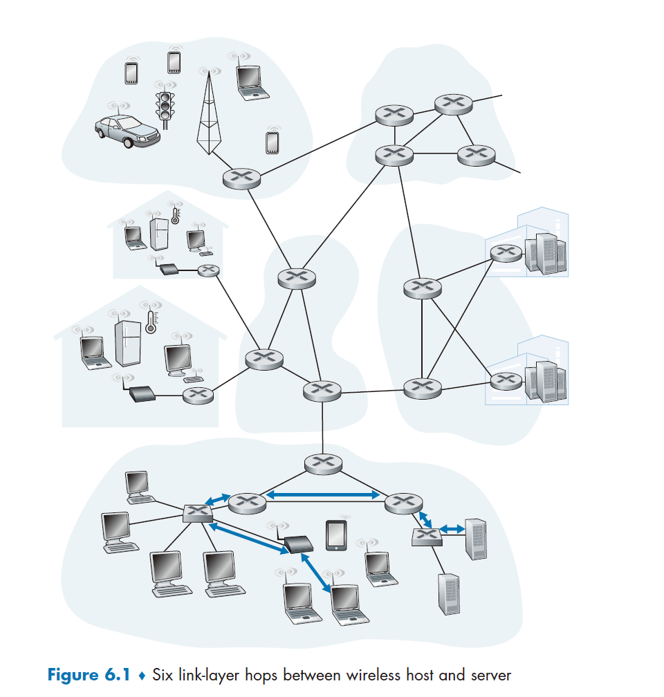

为了透彻理解链路层以及它是如何与网络层关联的，我们考虑一个交通运输的类比例子。假如一个旅行社计划为游客开辟从美国新泽西州的普林斯顿到瑞士洛桑的旅游路线。假定该旅行社认为对于游客而言最为便利的方案是：从普林斯顿乘豪华大轿车到 JFK 机场，然后乘飞机从 JFK 机场去日内瓦机场，最后乘火车从日内瓦机场到洛桑火车站。一旦 该旅行社作了这 3 项预定，普林斯顿豪华大轿车公司将负责将游客从普林斯顿带到 JFK, 航空公司将负责将游客从 JFK 带到日内瓦，瑞士火车服务将负责将游客从日内瓦带到洛桑。该旅程中 3 段中的每一段都在两个“相邻”地点之间是“直达的”。注意到这 3 段运输是由不同的公司管理，使用了完全不同的运输方式（豪华大轿车、飞机和火车）。尽管运输方式不同，但它们都提供了将旅客从一个地点运输到相邻地点的基本服务。在这个运输类比中，一个游客好比一个数据报，每个运输区段好比一条链路，每种运输方式好比一种链路层协议，而该旅行社好比一个路由选择协议。

### 6.1.1. 链路层提供的服务

尽管任一链路层的基本服务都是将数据报通过单一通信链路从一个节点移动到相邻节点，但所提供的服务细节能够随着链路层协议的不同而变化。链路层协议能够提供的可能服务包括:

- **成帧(framing)**。在每个网络层数据报经链路传送之前，几乎所有的链路层协议都要将其用链路层帧封装起来。一个帧由一个数据字段和若干首部字段组成，其中网络层数据报就插在数据字段中。帧的结构由链路层协议规定。当我们在本章的后半部分研究具体的链路层协议时，将看到几种不同的帧格式。
- **链路接入**。**媒体访问控制(Medium Access Control, MAC)** 协议规定了帧在链路上传输的规则。对于在链路的一端仅有一个发送方、链路的另一端仅有一个接收方的点对点链路，MAC 协议比较简单（或者不存在），即无论何吋链路空闲，发送方都能够发送帧。更有趣的情况是当多个节点共享单个广播链路时，即所谓多路访问问题。这里，MAC 协议用于协调多个节点的帧传输。
- **可靠交付**。当链路层协议提供可靠交付服务时，它保证无差错地经链路层移动每个网络层数据报。前面讲过，某些运输层协议（例如 TCP）也提供可靠交付服务。与运输层可靠交付服务类似，链路层的可靠交付服务通常是通过确认和重传取得的（参见 3-4 节）。链路层可靠交付服务通常用于易于产生高差错率的链路，例如无线 链路，其目的是本地（也就是在差错发生的链路上）纠正一个差错，而不是通过运 输层或应用层协议迫使进行端到端的数据重传。然而，对于低比特差错的链路，包括光纤、同轴电缆和许多双绞铜线链路,链路层可靠交付可能会被认为是一种不必要的开销。由于这个原因，许多有线的链路层协议不提供可靠交付服务。
- **差错检测和修正**。当帧中的一个比特作为 1 传输时，接收方节点中的链路层硬件可能不正确地将其判断为 0，反之亦然。这种比特差错是由信号衰减和电磁噪声导致的。因为没有必要转发一个有差错的数据报，所以许多链路层协议提供一种机制来检测这样的比特差错。通过让发送节点在帧中包括差错检测比特，让接收节点进行差错检查，以此来完成这项工作。第 3 章和第 4 章讲过，因特网的运输层和网络层也提供了有限形式的差错检测，即因特网检验和。链路层的差错检测通 常更复杂，并且用硬件实现。差错修正类似于差错检测，区别在于接收方不仅能检测帧中出现的比特差错，而且能够准确地确定帧中的差错出现的位置（并因此修正这些差错）。

### 6.1.2. 链路层实现位置

在深入学习链路层的细节之前，本概述的最后一节考虑一下在何处实现链路层的问 题。我们将关注一个端系统，因为我们在第 4 章中知道链路层是实现在路由器的线路卡中的。主机的链路层是用硬件还是用软件实现的呢？它是实现在一块单独的卡上还是一个芯片上？它是怎样与主机的硬件和操作系统组件的其他部分接口的呢？

图 6-2 显示了一个典型的主机体系结构“链路层的主体部分是在 **网络适配器(network adapter)** 中实现的，网络适配器有时也称为 **网络接口卡(Network Interface Card, NIC)**。位于网络适配器核心的是链路层控制器，该控制器通常是一个实现了许多链路层服务（成帧、链路接入、差错检测等）的专用芯片。因此，链路层控制器的许多功能是用硬件实现的。例如，Intel 的 700 系列设配器［Intel 2020］实现了以太网协议，我们将在 6-5 节中学习该协议；Atheros AR5006 ［Atheros 2020］适配器实现 802.11 WiFi 协议，我们将在第 7 章学习该协议。

在发送端，控制器取得了由协议栈较高层生成并存储在主机内存中的数据报，在链路层帧中封装该数据报（填写该帧的各个字段），然后遵循链路接入协议将该帧传进通信链路中。在接收端，控制器接收了整个帧，抽取出网络层数据报。如果链路层执行差错检测，则需要发送控制器在该帧的首部设置差错检测比特，由接收控制器执行差错检测。


图 6-2 显示了与主机总线（例如一条 PCI 或 PCI-X 总线）连接的网络适配器，这里它看起来非常像与其他主机组件连接的任何其他 I/O 设备。图 6-2 还显示了尽管大部分链路层是在硬件中实现的，但部分链路层是在运行于主机 CPU 上的软件中实现的。链路层的软件组件实现了高层链路层功能，如组装链路层寻址信息和激活控制器硬件。在接收端，链路层软件响应控制器中断（例如，由于一个或多个帧的到达），处理差错条件和将数据报向上传递给网络层。所以，链路层是硬件和软件的结合体，即此处是协议栈中软件与硬件交接的地方。［Intel 2020］从软件编程的角度提供了有关 XL 710 控制器的可读性很强的概述（以及详细的描述）。

## 6.2. 差错检测和修正技术

在上一节中，我们提到了 **比特级差错检测和修正(bit-level error detection and correction)**，即对从一个节点发送到另一个物理上连接的邻近节点的链路层帧中的比特损伤进行检测和修正，它们通常是链路层提供的两种服务。我们在第 3 章中看到差错检测和修正服务通常也由运输层提供。在本节中，我们将研究几种最简单的技术，它们能够用于检测比特差错，而且在某些情况下，能够修正这样的比特差错。对该主题理论和实现的全面描述是许多教科书的主题（例如［Schwartz 1980］或［Bertsekas 1991］），而我们这里仅讨论必要内容。我们此时的目的是对差错检测和纠正技术提供的能力有一种直观的认识，并看看一些简单技术在链路层中的工作原理及其如何实际应用。

图 6-3 图示说明了我们研究的环境。在发送节点，为了保护比特免受差错，使用 **差错检测和修正比特(Error- Detection and-Correction, EDC)** 来增强数据 D。通常，要保护的数据不仅包括从网络层传递下来需要通过链路传输的数据报，而且包括链路帧首部中的链路级的寻址信息、序号和其他字段。链路级帧中的 D 和 EDC 都被发送到接收节点。在接收节点，接收到比特序列 D'和 EDC'。注意到因传输中的比特翻转所致，D'和 EDC'可能与初始的 D 和 EDC 不同。

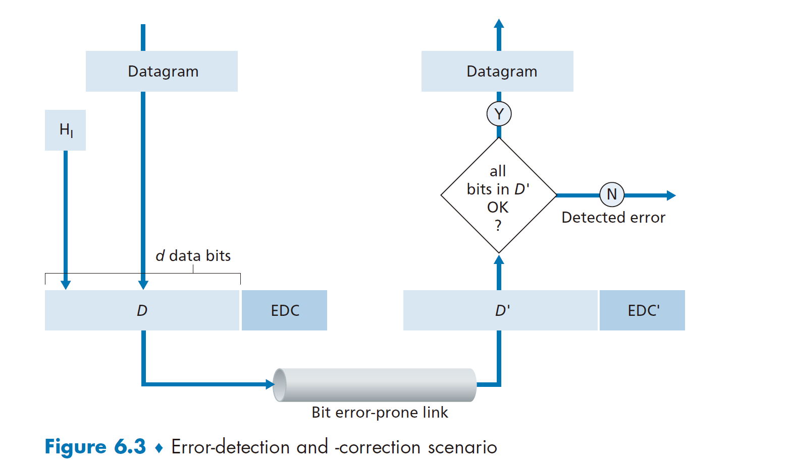

接收方的挑战是在它只收到 D'和 EDC'的情况下，确定 D'是否和初始的 D 相同。在图 6-3 中的接收方判定的准确措辞（我们问是否检测到一个差错，而非是否出现了差错！） 是重要的。差错检测和纠正技术使接收方有时但并总是检测出已经出现的比特差错。即使采用差错检测比特，也还是可能有 ；**未检出比特差错(undetected bit error)**，这就是说，接收方可能无法知道接收的信息中包含着比特差错。因此，接收方可能向网路层交付一个损伤的数据报，或者不知道该帧首部的某个其他字段的内容已经损伤。我们因此要选择一个差错检测方案，使得这种事件发生的概率很小。一般而言，差错检测和纠错技术越复杂（即那些具有未检测出比特差错概率较小的技术），导致的开销就越大，这就是意味着需要更多的计算量及更多的差错检测和纠错比特。

我们现在来研究在传输数据中检测差错的 3 种技术：奇偶校验（它用来描述差错检测和修正背后隐含的基本思想）、检验和方法（它通常更多地应用于运输层）和循环冗余检测（它通常更多地应用在适配器中的链路层）。

### 6.2.1. 奇偶校验

也许差错检测最简单的方式就是用单个 **奇偶校验位(parity bit)**。假设在图 6-4 中要发送的信息 D 有 d 比特。在偶校验方案中，发送方只需包含一个附加的比特，选择它的值，使得这 d + 1 比特（初始信息加上一个校验比特）中 1 的总数是偶数。对于奇校验方案，选择校验比特值使得有奇数个。图 6-4 描述了一个偶校验的方案，单个校验比特被存放在一个单独的字段中。

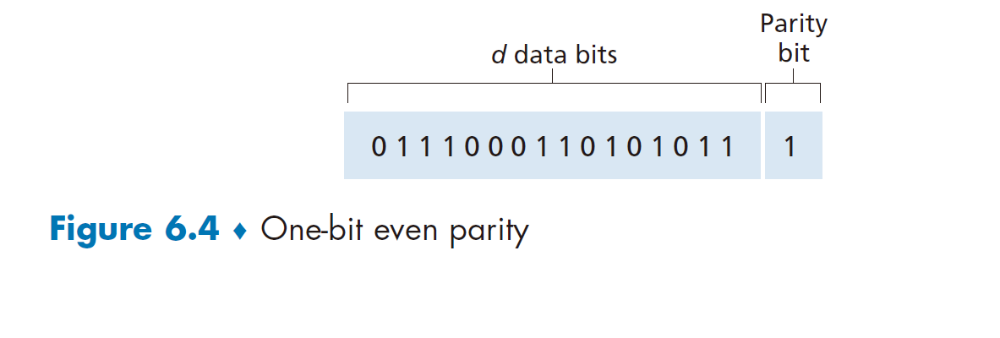

采用单个奇偶校验位方式，接收方的操作也很简单。接收方只需要数一数接收的 d + 1 比特中 1 的数目即可。如果在采用偶校验方案中发现了奇数个值为 1 的比特，接收方知道至少出现了一个比特差错。更精确的说法是，出现了奇数个比特差错。

但是如果出现了偶数个比特差错，那会发生什么现象呢？你应该认识到这将导致一个未检出的差错。如果比特差错的概率小，而且比特之间的差错可以被看作是独立发生的，在一个分组中多个比特同时出错的概率将是极小的。在这种情况下，单个奇偶校验位可能是足够的了。然而，测量已经表明了差错经常以“突发”方式聚集在一起，而不是独立地发生。在突发差错的情况下，使用单比特奇偶校验保护的一帧中未检测出差错的概率能够达到 50% [Spragins 1991]。显然，需要一个更健壮的差错检测方案（幸运的是实践中正在使用这样的方式！）。但是在研究实践中使用的差错检测方案之前，我们考虑对单比特奇偶校验的一种简单一般化方案，这将使我们深入地理解纠错技术。

图 6-5 显示了单比特奇偶校验方案的二维一般化方案。这里 D 中的 d 个比特被划分为：i 行 j 列。对每行和每列计算奇偶值。产生的 i+j+1 奇偶比特构成了链路层帧的差错检测比特。

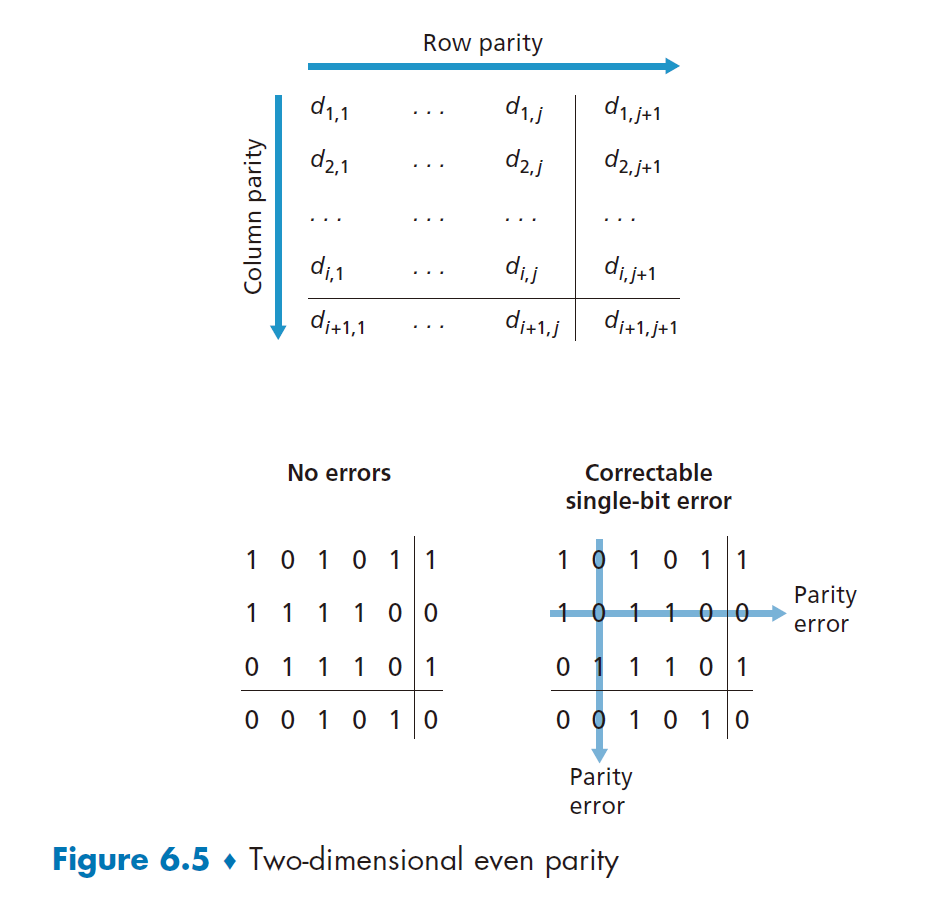

现在假设在初始 d 比特信息中出现了 单个比特差错。使用这种 **二维奇偶校验(two-dimensional parity)** 方案，包含比特值改变的列和行的校验值都将会岀现差错。 因此接收方不仅可以检测到出现了单个比 特差错的事实，而且还可以利用存在奇偶 校验差错的列和行的索引来实际识别发生 差错的比特并纠正它！图 6-5 显示了一个例子，其中位于（2, 2）的值为 1 的比特损坏了，变成了 0，该差错就是一个在接收方可检测并可纠正的差错。尽管我们的讨论 是针对初始 d 比特信息的，但校验比特本 身的单个比特差错也是可检测和可纠正的。 二维奇偶校验也能够检测（但不能纠正！）一个分组中两个比特差错的任何组合。二维奇偶校验方案的其他特性将在本章后面的习题中进行探讨。

接收方检测和纠正差错的能力被称为 **前向纠错(Forward Error Correction, FEC)**。这些技术通常用于如音频 CD 这样的音频存储和回放设备中。在网络环境中，FEC 技术可以单独应用，或与链路层 ARQ 技术一起应用，ARQ 技术与我们在第 3 章研究的协议类似。 FEC 技术很有价值，因为它们可以减少所需的发送方重发的次数。也许更为重要的是，它 们允许在接收方立即纠正差错。FEC 避免了不得不等待的往返时延，而这些时延是发送方收 到 NAK 分组并向接收方重传分组所需要的，这对于实时网络应用[Rubenstein 1998]或者具有长传播时延的链路（如深空间链路）可能是一种非常重要的优点。研究差错控制协议中 FEC 的使用的资料包括 f Biersack 1992；Nonnenmacher 1998 ；Byers 1998 ；Shacham 1990]。

### 6.2.2. 检验和方法

在检验和技术中，图 6-4 中的 d 比特数据被作为一个 k 比特整数的序列处理。一个简单检验和方法就是将这丘比特整数加起来，并且用得到的和作为差错检测比特。**因特网检验和(Internet checksum)** 就基于这种方法，即数据的字节作为 16 比特的整数对待并求和。这个和的反码形成了携带在报文段首部的因特网检验和。如在 3-3 节讨论的那样，接收方通过对接收的数据（包括检验和）的和取反码，并且检测其结果是否为全 1 比特来检测检验和。如果这些比特中有任何比特是 0，就可以指示出差错。RFC 1071 详细地讨论因特网检验和算法和它的实现。在 TCP 和 UDP 协议中，对所有字段（包括首部和数据字段）都计算因特网检验和。在其他协议中，例如 XTP [Strayer 1992]，对首部计算一个检验和，对整个分组计算另一个检验和。

检验和方法需要相对小的分组开销。例如，TCP 和 UDP 中的检验和只用了 16 比特。 然而，与后面要讨论的常用于链路层的 CRC 相比，它们提供相对弱的差错保护。这时，一个很自然的问题是：为什么运输层使用检验和而链路层使用 CRC 呢？前面讲过运输层 通常是在主机中作为用户操作系统的一部分用软件实现的。因为运输层差错检测用软件实现，采用简单而快速如检验和这样的差错检测方案是重要的。在另一方面，链路层的差错 检测在适配器中用专用的硬件实现，它能够快速执行更复杂的 CRC 操作。Feldmeier： Feld- meier 1995]描述的快速软件实现技术不仅可用于加权检验和编码，而且可用于 CRC（见后面）和其他编码。

### 6.2.3. 循环冗余检测

现今的计算机网络中广泛应用的差错检测技术基于 **循环冗余检测(Cyclic Redundancy Check, CRC)** 编码。CRC 编码也称为 **多项式编码(polynomial code)**，因为该编码能够将要发送的比特串看作为系数是 0 和 1 一个多项式，对比特串的操作被解释为多项式算术。

CRC 编码操作如下。考虑 d 比特的数据 D，发送节点要将它发送给接收节点。发送方和接收方首先必须协商一个 r + 1 比特模式，称为 **生成多项式(generator)**，我们将其表示为 G。我们将要求 G 的最高有效位的比特（最左边）是 1。CRC 编码的关键思想如图 6-6 所示。对于一个给定的数据段 D,发送方要选择 r 个附加比特 R，并将它们附加到 D 上，使得得到的 d + r 比特模式（被解释为一个二进制数）用模 2 算术恰好能被 G 整除（即没有余数）。用 CRC 进行差错检测的过程因此很简单：接收方用 G 去除接收到的 d+r 比特。如果余数为非零，接收方知道出现了差错；否则认为数据正确而被接收。

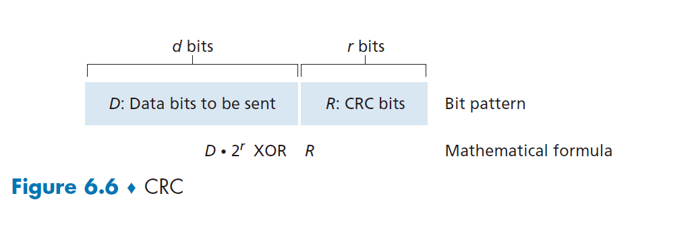

所有 CRC 计算采用模 2 算术来做，在加法中不进位，在减法中不借位。这意味着加法和减法是相同的，而且这两种操作等价于操作数的按位异或（XOR）。因此，举例来说:

```
1011 XOR 0101 = 1110
1001 XOR 1101 = 0100
```

类似地，我们还会有:

```
1011 - 0101 = 1110
1001 - 1101 = 0100
```

除了所需的加法或减法操作没有进位或借位外，乘法和除法与在二进制算术中是相同的。如在通常的二进制算术中那样，乘以 $2^k$ 就是以一种比特模式左移 k 个位置。这样，给定 D 和 R, $D \cdot 2^r \, XOR \, R$ 产生如图 6-6 所示的 d+r 比特模式。在下面的讨论中，我们将利用图 6-6 中这种 d+r 比特模式的代数特性。

现在我们回到发送方怎样计算 R 这个关键问题上来。前面讲过，我们要求出 R 使得对于 n 有:

$$D \cdot 2^r \, XOR \, R = {nG}$$

也就是说，我们要选择 R 使得 G 能够除以 $D \cdot 2^r \, XOR \, R$ 而没有余数。如果我们对上述等式的两边都用 R 异或(即用模 2 加，而没有进位)，我们得到

$$D \cdot 2^r = nG \, XOR \, R$$

这个等式告诉我们，如果我们用 G 来除 $D \cdot 2^r$，余数值刚好是 R。换句话说，我们可以这样计算 R：

$$R = {remainder}{{D \cdot 2^r} \over G}$$

图 6-7 举例说明了在 D = 101110, d = 6, G = 1001 和 r = 3 的情况下的计算过程。在这种情况下传输的 9 个比特是 101110011。你应该自行检查一下这些计算，并核对一下 $D \cdot 2^r = {101011 \cdot G \, XOR \,R}$ 的确成立。

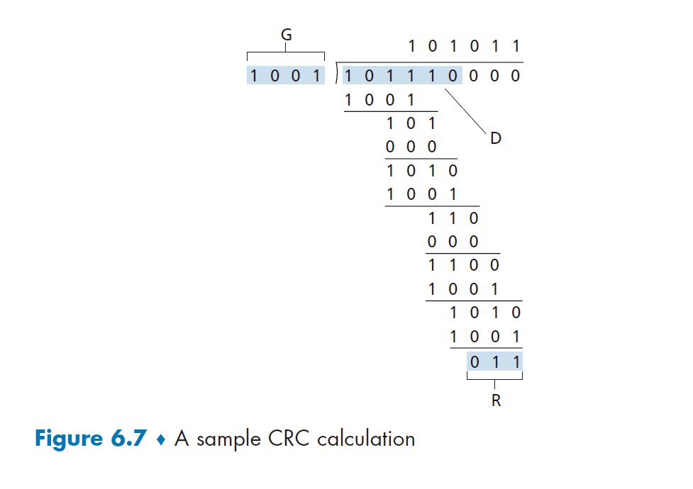

国际标准已经定义了 8、12、16 和 32 比特生成多项式 G。CRC-32 32 比特的标准被多种链路级 IEEE 协议采用，使用的一个生成多项式是：

$$G_{CRC-32} = {100000100110000010001110110110111}$$

每个 CRC 标准都能检测小于 r+1 比特的突发差错。(这意味着所有连续的厂比特或者更少的差错都可以检测到。)此外，在适当的假设下，长度大于 r+1 比特的突发差错以概率 $1 - 0.5^r$ 被检测到。每个 CRC 标准也都能检测任何奇数个比特差错。有关 CRC 检测实现的讨论可参见 [WiUiams 1993]。CRC 编码甚至更强的编码所依据的理论超出了本书的范围。教科书[Schwartz 1980]对这个主题提供了很好的介绍。

## 6.3. 多路访问链路和协议

在本章概述中，我们提到了有两种类型的网络链路：点对点链路和广播链路。**点对点链路(point-to-point link)** 由链路一端的单个发送方和链路另一端的单个接收方组成。许多链路层协议都是为点对点链路设计的，如 **点对点协议(point-to-point protocol, PPP)** 和 **高级数据链路控制(high-level data link control, HDLC)** 就是两种这样的协议，我们将在本章后面涉及它们。第二种类型的链路是 **广播链路(broadcast link)**，它能够让多个发送和接收节点都连接到相同的、单一的、共享的广播信道上。这里使用术语“广播”是因为 当任何一个节点传输一个帧时，信道广播该帧，每个其他节点都收到一个副本。以太网和无线局域网是广播链路层技术的例子。在本节，我们暂缓讨论特定的链路层协议，而先研究一个对链路层很重要的问题：如何协调多个发送和接收节点对一个共享广播信道的访问，这就是 **多路访问问题(multiple access problem)**。广播信道通常用于局域网中，局域网是一个地理上集中在一座建筑物中(或者在一个公司，或者在大学校园)的网络。因此我们还将在本节后面考察一下多路访问信道是如何在局域网中使用的。

我们都很熟悉广播的概念，因为自电视发明以来就使用了这种通信方式。但是传统的电视是一种一个方向的广播(即一个固定的节点向许多接收节点传输)，而计算机网络广播信道上的节点既能够发送也能够接收。也许对广播信道的一个更有人情味的类比是鸡尾酒会，在那里许多人聚集在一个大房间里(空气为提供广播的媒体)谈论和倾听。第二个切题的类比是许多读者都很熟悉的地方，即一间教室，在那里老师们和同学们同样共享相同的、单一的广播媒体。在这两种场景下，一个中心问题是确定谁以及在什么时候获得说话权力（也就是向信道传输）。作为人类，为了共享这种广播信道，我们已经演化得到了一个精心设计的协议集了:

```
“给每个人一个讲话的机会。”
“该你讲话时你才说话。”
“不要一个人独占整个谈话。”
“如果有问题请举手。”
“当有人讲话时不要打断。”
“当其他人讲话时不要睡觉。”
```

计算机网络有类似的协议，也就是所谓的 **多路访问协议(multiple access protocol)**，即节点通过这些协议来规范它们在共享的广播信道上的传输行为。如图 6-8 所示，在各种各样的网络环境下需要多路访问协议，包括有线和无线接入网，以及卫星网络。尽管从技术 上讲每个节点通过它的适配器访问广播信道，但在本节中我们将把节点作为发送和接收设备。在实践中，数以百计或者甚至数以千计个节点能够通过一个广播信道直接通信。

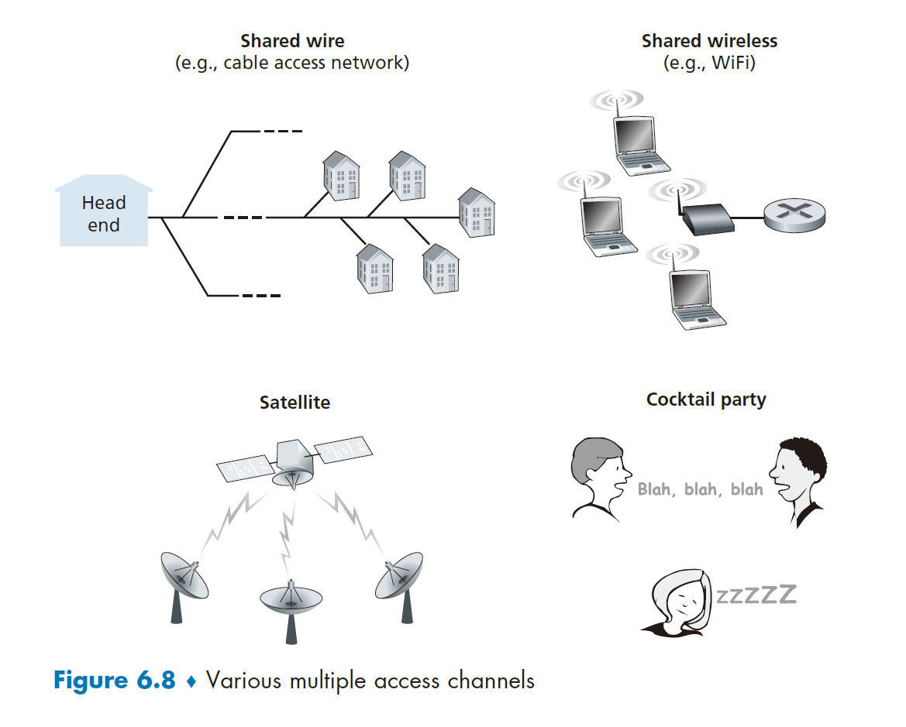

**time : 2021-07-01**

因为所有的节点都能够传输帧，所以多个节点可能会同时传输帧。当发生这种情况时，所有节点同时接到多个帧；这就是说，传输的帧在所有的接收方处 **碰撞(collide)**。通常，当碰撞发生时，没有一个接收节点能够有效地获得任何传输的帧；在某种意义下，碰撞帧的信号纠缠在一起。因此，涉及此次碰撞的所有帧都丢失了，在碰撞时间间隔中的广播信道被浪费了。显然，如果许多节点要频繁地传输帧，许多传输将导致碰撞，广播信道的大量带宽将被浪费掉。

当多个节点处于活跃状态时，为了确保广播信道执行有用的工作，以某种方式协调活 跃节点的传输是必要的。这种协调工作由多路访问协议负责。在过去的 40 年中，已经有上千篇文章和上百篇博士论文研究过多路访问协议；有关这部分工作前 20 年来的一个内容丰富的综述见［Rom 1990］。此外，由于新类型链路尤其是新的无线链路不断出现，在多路访问协议方面研究的活跃状况仍在继续。

这些年来，在大量的链路层技术中已经实现了几十种多路访问协议。尽管如此，我们能够将任何多路访问协议划分为 3 种类型之一：**信道划分协议(channel partitioning protocol)**，**随机接入协议(random access protocol)** 和 **轮流协议(taking-turns protocol)**。我们将 在后续的 3 个小节中讨论这几类多路访问协议。

在结束概述之前，我们给出下列条件。在理想情况下，对于速率为 R bps 的广播信道，多路访问协议应该具有以下所希望的特性：

- 当仅有一个节点发送数据时，该节点具有 R bps 的吞吐量；
- 当有 M 个节点发送数据时，每个节点吞吐量为 R/M bpso 这不必要求 M 个节点中 的每一个节点总是有 R/M 的瞬间速率，而是每个节点在一些适当定义的时间间隔内应该 有 R/M 的平均传输速率。
- 协议是分散的；这就是说不会因某主节点故障而使整个系统崩溃。
- 协议是简单的，使实现不昂贵。

### 6.3.1. 信道划分协议

时分多路复用（TDM）和频分多路复用（FDM）是两种能够用于在所有共享信道节点之间划分广播信道带宽的技术。举例来说，假设一个支持 N 个节点的信道且信道的传输速率为 Rbps。TDM 将时间划分为 **时间帧(time frame)**，并进一步划分每个时间帧为 N 个 **时隙(slot)**。（不应当把 TDM 时间帧与在发送和接收适配器之间交换的链路层数据单元相混淆，后者也被称为帧。为了减少混乱，在本小节中我们将链路层交换的数据单元称为分组。）然后把每个 时隙分配给 N 个节点中的一个。无论何时某个节点在有分组要发送的时候，它在循环的 TDM 帧中指派给它的时隙内传输分组比特。通常，选择的时隙长度应使一个时隙内能够传输单个分组。图 6-9 表示一个简单的 4 个节点的 TDM 例子。标有的所有时隙专用于一个特定的发送方-接收方对。图 6-9 一个 4 节点的 TDM 与 FDM 的例子再回到我们的鸡尾酒会类比中，一个采用 TDM 规则的鸡尾酒会将允许每个聚会客人在固定的时间段发言，然后再允许另一个聚会客人发言同样时长，以此类推。一旦每个人都有了说话机会，将不断重复着这种模式。

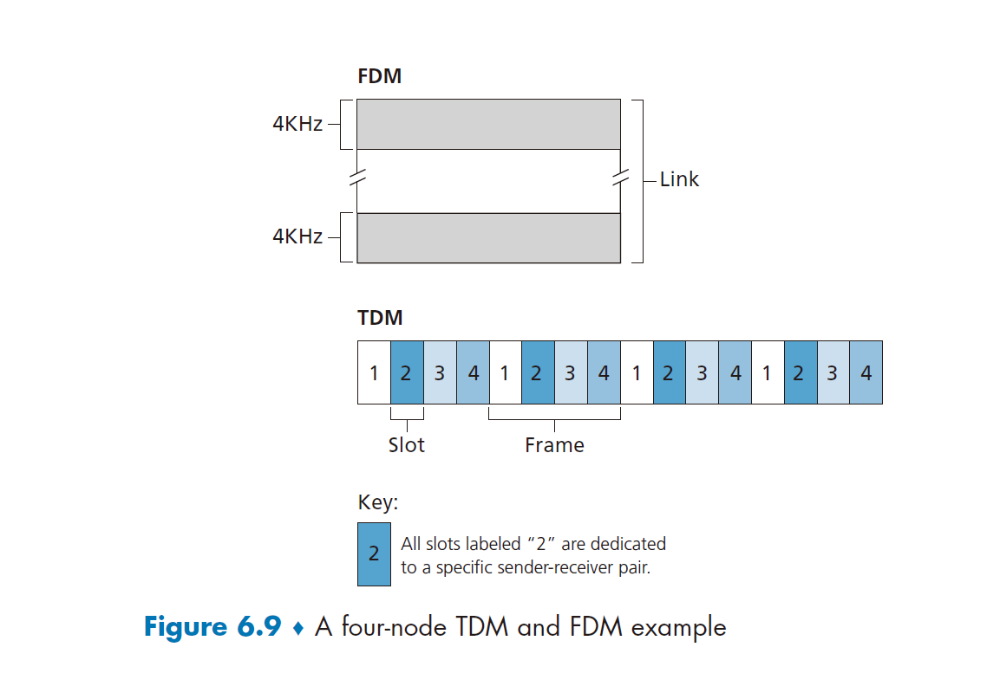

TDM 是有吸引力的，因为它消除了碰撞而且非常公平：每个节点在每个帧时间内得到了专用的传输速率砂 Nbps。然而它有两个主要缺陷。首先，节点被限制于 R/N bps 的平均速率，即使当它是唯一有分组要发送的节点时。其次，节点必须总是等待它在传输序列中的轮次，即我们再次看到，即使它是唯一一个有帧要发送的节点。想象一下某聚会客人是唯一一个有话要说的人的情形（并且想象一下这种十分罕见的情况，即酒会上所有的人都想听某一个人说话）。显然，一种多路访问协议用于这个特殊聚会时，TDM 是一种很糟的选择。

TDM 在时间上共享广播信道，而 FDM 将 R bps 信道划分为不同的频段（每个频段具有 R/N 带宽），并把每个频率分配给/V 个节点中的一个。因此 FDM 在单个较大的 R bps 信道中创建了 N 个较小的 R/N bps 信道。FDM 也有 TDM 同样的优点和缺点。它避 免了碰撞，在 N 个节点之间公平地划分了带宽。然而，FDM 也有 TDM 所具有的主要缺点，也就是限制一个节点只能使用 R/7V 的带宽，即使当它是唯一一个有分组要发送的节点时。

第三种信道划分协议是 **码分多址(Code Division Multiple Access, CDMA)**。TDM 和 FDM 分別为节点分配时隙和频率，而 CDMA 对每个节点分配一种不同的编码。然后每个节点用它唯一的编码来对它发送的数据进行编码。如果精心选择这些编码，CDMA 网络具有一种奇妙的特性，即不同的节点能够同时传输，并且它们各自相应的接收方仍能正确接收发送方编码的数据比特（假设接收方知道发送方的编码），而不在乎其他节点的干扰传输。CDMA 已经在军用系统中使用了一段时间（由于它的抗干扰特性），目前已经广泛地用于民用，尤其是蜂窝电话中。因为 CDMA 的使用与无线信道紧密相关，所以我们将把有关 CDMA 技术细节的讨论留到第 7 章。此时，我们知道 CDMA 编码类似于 TDM 中的时隙和 FDM 中的频率，能分配给多路访问信道的用户就可以了。

### 6.3.2. 随机接入协议

第二大类多访问协议是随机接入协议。在随机接入协议中，一个传输节点总是以信道的全部速率（即 R bps）进行发送。当有碰撞时，涉及碰撞的每个节点反复地重发它 的帧（也就是分组），到该帧无碰撞地通过为止。但是当一个节点经历一次碰撞时，它不必立刻重发该帧。相反，它在重发该帧之前等待一个随机时延。涉及碰撞的每个节点独立地选择随机时延。因为该随机时延是独立地选择的，所以下述现象是有可能的：这些节点之一所选择的时延充分小于其他碰撞节点的时延，并因此能够无碰撞地将它的帧在信道中发出。

文献中描述的随机接入协议即使没有上百种也有几十种［Rom 1990； Bertsekas 1991］。在本节中，我们将描述一些最常用的随机接入协议，即 ALOHA 协议［Abramson 1970 ； Abramson 1985 ； Abramson 2009］和载波侦听多路访问（CSMA）协议［Kleinrock 1975b］。以太网［Metcalfe 1976］是一种流行并广泛部署的 CSMA 协议。

1. **时隙 ALOHA**

我们以最简单的随机接入协议之：时隙 ALOHA 协议，开始我们对随机接入协议的学习。在对时隙 ALOHA 的描述中，我们做下列假设：

- 所有帧由 L 比特组成。
- 时间被划分成长度为 L/R 秒的时隙（这就是说，一个时隙等于传输一帧的时间）。
- 节点只在时隙起点开始传输帧。
- 节点是同步的，每个节点都知道时隙何时开始。
- 如果在一个时隙中有两个或者更多个帧碰撞，则所有节点在该时隙结束之前检测到该碰撞事件。

令 P 是一个概率，即一个在 0 和 1 之间的数。在每个节点中，时隙 ALOHA 的操作是简单的:

- 当节点有一个新帧要发送时，它等到下一个时隙开始并在该时隙传输整个帧。
- 如果没有碰撞，该节点成功地传输它的帧，从而不需要考虑重传该帧。（如果该节点有新帧，它能够为传输准备一个新帧。）
- 如果有碰撞，该节点在时隙结束之前检测到这次碰撞。该节点以概率 p 在后续的每个时隙中重传它的帧，直到该帧被无碰撞地传输出去。

我们说以概率 p 重传，是指某节点有效地投掷一个有偏倚的硬币；硬币正面事件对应着重传，而重传出现的概率为 p。硬币反面事件对应着跳过这个时隙，在下个时隙再掷硬币；这个事件以概率 (1-p) 出现。所有涉及碰撞的节点独立地投掷它们的硬币。

时隙 ALOHA 看起来有很多优点。与信道划分不同，当某节点是唯一活跃的节点时（一个节点如果有帧要发送就认为它是活跃的），时隙 ALOHA 允许该节点以全速 R 连续传输。时隙 ALOHA 也是高度分散的，因为每个节点检测碰撞并独立地决定什么时候重传。（然而，时隙 ALOHA 的确需要在节点中对时隙同步；我们很快将讨论 ALOHA 协议的一个不分时隙的版本以及 CSMA 协议，这两种协议都不需要这种同步。）时隙 ALOHA 也是一个极为简单的协议。

当只有一个活跃节点时，时隙 ALOHA 工作出色，但是当有多个活跃节点时效率又将如何呢？这里有两个可能要考虑的效率问题。首先，如在图 6-10 中所示，当有多个活跃节点时，一部分时隙将有碰撞，因此将被“浪费”掉了。第二个考虑是，时隙的另一部分将是空闲的，因为所有活跃节点由于概率传输策略会节制传输。唯一“未浪费的”时隙是那些刚好有一个节点传输的时隙。刚好有一个节点传输的时隙称为一个 **成功时隙(successful slot)**。时隙多路访问协议的 **效率(efficiency)** 定义为：当有大量的活跃节点且每个节点总有大量的帧要发送时，长期运行中成功时隙的份额。注意到如果不使用某种形式的访问控制，而且每个节点都在每次碰撞之后立即重传，这个效率将为零。时隙 ALOHA 显然增加了它的效率，使之大于零，但是效率增加了多少呢？

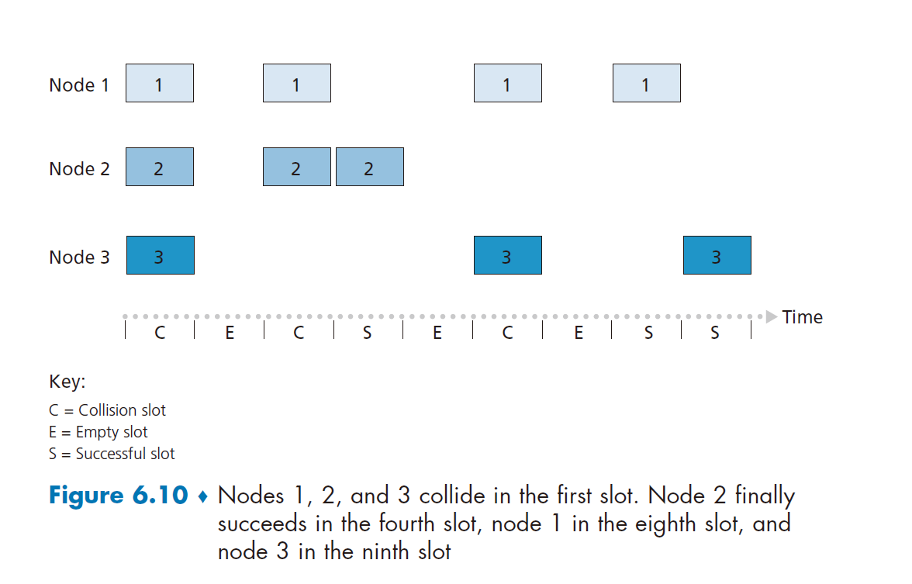

现在我们继续概要讨论时隙 ALOHA 最大效率的推导过程。为了保持该推导简单，我们对协议做了一点修改，假设每个节点试图在每个时隙以概率 p 传输一帧。（这就是说，我们假设每个节点总有帧要发送，而且节点对新帧和已经经历一次碰撞的帧都以概率 p 传输。）假设有 N 个节点。则一个给定时隙是成功时隙的概率为节点之一传输而余下的 N-1 个节点不传输的概率。一个给定节点传输的概率是 p；剩余节点不传输的概率是 ${(1-p)}^{N-1}$。因此，一个给定节点成功传送的概率是 ${p{(1-p)}^{N-1}}$。因为有 N 个节点，任意一个节点成功传送的概率是 ${Np{(1-p)}^{N-1}}$。

因此，当有 N 个活跃节点时，时隙 ALOHA 的效率是 ${Np{(1-p)}^{N-1}}$。为了获得 N 个活跃节点的最大效率，我们必须求出使这个表达式最大化的 $p^*$。而且对于大量活跃节点，为了获得最大效率，当 N 趋于无穷时，我们取 ${Np^*{(1-p^*)}^{N-1}}$ 的极限。在完成这些计算之后，我们会发现这个协议的最大效率为 1/e = 0.37。这就是说，当有大量节点有很多帧要传输时，则（最多）仅有 37%的时隙做有用的工作。因此该信道有效传输速率不是 R bps,而仅为 0.37R bps！相似的分析还表明 37%的时隙是空闲的，26%的时隙有碰撞。试想一个蹩脚的网络管理员购买了一个 100Mbps 的时隙 ALOHA 系统，希望能够使用网络在大量的用户之间以总计速率如 80Mbps 来传输数据。尽管这个信道能够以信道的全速 100Mbps 传输一个给定的帧，但从长时间范围看，该信道的成功吞吐量将小于 37Mbps。

2. **ALOHA**

时隙 ALOHA 协议要求所有的节点同步它们的传输，以在每个时隙开始时开始传输。 第一个 ALOHA 协议［Abramson 1970］实际上是一个非时隙、完全分散的协议。在纯 ALOHA 中，当一帧首次到达（即一个网络层数据报在发送节点从网络层传递下来），节点 立刻将该帧完整地传输进广播信道。如果一个传输的帧与一个或多个传输经历了碰撞，这个节点将立即（在完全传输完它的碰撞帧之后）以概率 p 重传该帧。否则，该节点等待一个帧传输时间。在此等待之后，它则以概率 p 传输该帧，或者以概率 1-p 在另一个帧时间等待（保持空闲）。

为了确定纯 ALOHA 的最大效率，我们关注某个单独的节点。我们的假设与在时隙 ALOHA 分析中所做的相同，取帧传输时间为时间单元。在任何给定时间，某节点传输一个帧的概率是 p。假设该帧在时刻 t(0)开始传输。如图 6-11 中所示，为了使该帧能成功地传输，在时间间隔 [t(0)-1, t(0)] 中不能有其他节点开始传输。这种传输将与节点 i 的帧传输起始部分相重叠。所有其他节点在这个时间间隔不开始传输的概率是 `(1-p)^(N-1)`。类似地，当节点 i 在传输时，其他节点不能开始传输，因为这种传输将与节点 i 传输的后面部分相重叠。所有其他节点在这个时间间隔不开始传输的概率也是 `(1-p)^(N-1)` 。因此，一个 给定的节点成功传输一次的概率是 `p(1-p)^2(N-1)`。通过与时隙 ALOHA 情况一样来取极限，我们求得纯 ALOHA 协议的最大效率仅为 1/(2e)。这刚好是时隙 ALOHA 的一半。这就是完全分散的 ALOHA 协议所要付出的代价。

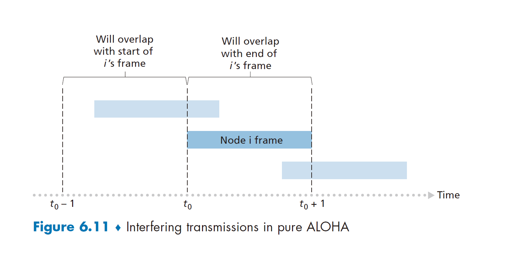

3. **载波侦听多路访问(CSMA)**

在时隙和纯 ALOHA 中，一个节点传输的决定独立于连接到这个广播信道上的其他节点的活动。特别是，一个节点不关心在它开始传输时是否有其他节点碰巧在传输，而且即使有另一个节点开始干扰它的传输也不会停止传输。在我们的鸡尾酒会类比中，ALOHA 协议非常像一个粗野的聚会客人，他喋喋不休地讲话而不顾是否其他人在说话。作为人类，我们有人类的协议，它要求我们不仅要更为礼貌，而且在谈话中要减少与他人“碰撞”的时间，从而增加我们谈话中交流的数据量。具体而言，有礼貌的人类谈话有两个重要的规则：

- 说话之前先听。如果其他人正在说话，等到他们说完话为止。在网络领域中，这被称为 **载波侦听(carrier sensing)**，即一个节点在传输前先听信道。如果来自另一 个节点的帧正向信道上发送，节点则等待直到检测到一小段时间没有传输，然后开始传输。
- 如果与其他人同时开始说话，停止说话。在网络领域中，这被称为 **碰撞检测(collision detection)**，即当一个传输节点在传输时一直在侦听此信道。如果它检测到另 一个节点正在传输干扰帧，它就停止传输，在重复“侦听-当空闲时传输”循环之前等待一段随机时间。

这两个规则包含在 **载波侦听多路访问(Carrier Sense Multiple Access, CSMA)** 和 **具有碰撞检测的 CSMA (CSMA with Collision Detection, CSMA/CD )** 协议族中 [Kleinrock1975b； Metcalfe 1976； Lam 1980； Rom 1990] 。人们已经提出了 CSMA 和 CSMA/CD 的许多变种。这里，我们将考虑一些 CSMA 和 CSMA/CD 最重要的和基本的特性

关于 CSMA 你可能要问的第一个问题是，如果所有的节点都进行载波侦听了，为什么 当初会发生碰撞？毕竟，某节点无论何时侦听到另一个节点在传输，它都会停止传输。对于这个问题的答案最好能够用时空图来说明［MoUel987］。图 6-12 显示了连接到一个线状广播总线的 4 个节点（A、B、C、D）的时空图。横轴表示每个节点在空间的位置；纵轴表示时间。

在时刻 t(0)，节点 B 侦听到信道是空闲的，因为当前没有其他节点在传输。因此节点 B 开始传输，沿着广播媒体在两个方向上传播它的比特。图 6-12 中 B 的比特随着时间的增加向下传播，这表明 B 的比特沿着广播媒体传播所实际需要的时间不是零（虽然以接近光的速度）。在时刻 t(1) (t(1)>t(0))，节点 D 有一个帧要发送。尽管节点 B 在时刻 t(1)正在传输，但 B 传输的比特还没有到达 D，因此 D 在 w 侦听到信道空闲。根据 CSMA 协议，从而 D 开始传输它的帧。一个短暂的时间之后，B 的传输开始在 D 干扰 D 的传输。从图 6-12 中可以看出，显然广播信道的端到端 **信道传播时延(channel propagation delay)**（信号从一个节点传播到另一个节点所花费的时间）在决定其性能方面起着关键的作用。该传播时延越长，载波侦听节点不能侦听到网络中另一个节点已经开始传输的机会就越大。

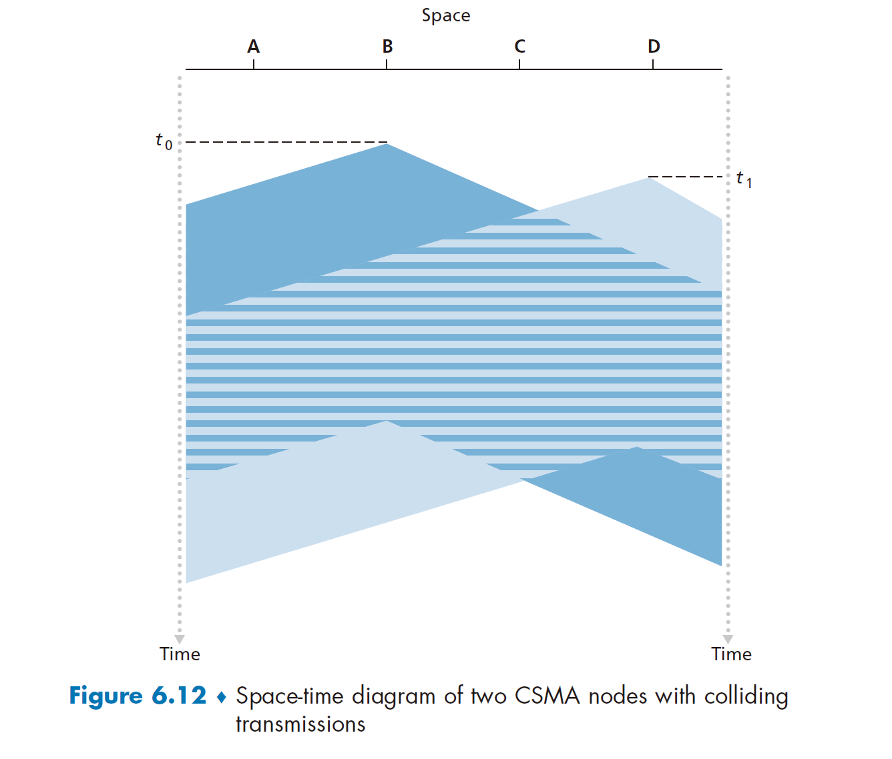

4. **具有碰撞检测的载波侦听多路访问(CSMA/CD)**

在图 6-12 中，节点没有进行碰撞检测；即使已经出现了碰撞，B 和 D 都将继续完整 地传输它们的帧。当某节点执行碰撞检测时，一旦它检测到碰撞将立即停止传输。图 6-13 表示了和图 6-12 相同的情况，只是这两个节点在检测到碰撞后很短的时间内都放弃了它们的传输。显然，在多路访问协议中加入碰撞检测，通过不传输一个无用的、（由来自另一个节点的帧干扰）损坏的帧，将有助于改善协议的性能。

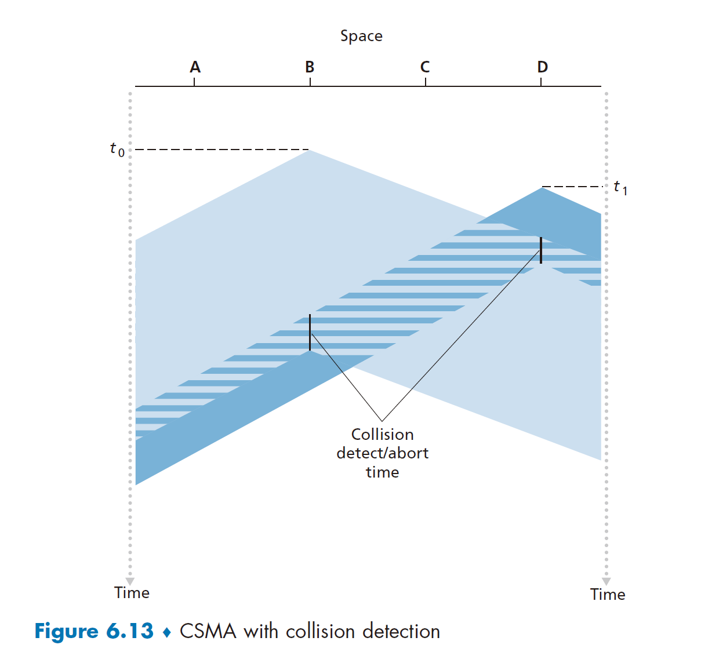

在分析 CSMA/CD 协议之前，我们现在从与广播信道相连的适配器（在节点中）的角度总结它的运行：

(1) 适配器从网络层一条获得数据报，准备链路层帧，并将其放入帧适配器缓存中。
(2) 如果适配器侦听到信道空闲（即无信号能量从信道进入适配器），它开始传输帧。在另一方面，如果适配器侦听到信道正在忙，它将等待，直到侦听到没有信号能量时才开始传输帧。
(3) 在传输过程中，适配器监视来自其他使用该广播信道的适配器的信号能量的存在。
(4) 如果适配器传输整个帧而未检测到来自其他适配器的信号能量，该适配器就完成了该帧。在另一方面，如果适配器在传输时检测到来自其他适配器的信号能量，它中止传输（即它停止了传输帧）。
(5) 中止传输后，适配器等待一个随机时间量，然后返回步骤 2。

等待一个随机（而不是固定）的时间量的需求是明确的——如果两个节点同时传输帧，然后这两个节点等待相同固定的时间量，它们将持续碰撞下去。但选择随机回退时间 的时间间隔多大为好呢？如果时间间隔大而碰撞节点数量小，在重复“侦听-当空闲时传输”的步骤前，节点很可能等待较长的时间（使信道保持空闲）。在另一方面，如果时间间隔小而碰撞节点数量大，很可能选择的随机值将几乎相同，传输节点将再次碰撞。我们希望时间间隔应该这样：当碰撞节点数量较少时，时间间隔较短；当碰撞节点数量较大时，时间间隔较长。

用于以太网以及 DOCSIS 电缆网络多路访问协议［DOCSIS 2011］中的 **二进制指数后退(binary exponential backoff)** 算法，简练地解决了这个问题。特别是，当传输一个给定帧时，在该帧经历了一连串的 n 次碰撞后，节点随机地从 $\{0, 1, 2,...,2^{n - 1}\}$中选择一个 K 值。因此，一个帧经历的碰撞越多，K 选择的间隔越大。对于以太网，一个节点等待的实际时间量是 K512 比特时间（即发送 512 比特进入以太网所需时间量的 K 倍），能够取的最大值在 10 以内。

我们看一个例子。假设一个适配器首次尝试传输一个帧，并在传输中它检测到碰撞。然后该节点以概率 0.5 选择 K=0，以概率 0.5 选择 K = 1。如果该节点选择 K = 0，则它立即开始侦听信道。如果这个适配器选择 K = 1，它在开始“侦听-当空闲时传输”。周期前等待 512 比特时间（例如对于 100 Mbps 以太网来说为 5.12 ms）。在第 2 次碰撞之后，从 { 0, 1, 2, 3} 中等概率地选择 K。在第 3 次碰撞之后，从 {0, 1, 2, 3, 4, 5, 6, 7} 中等概率地选择 K。在 10 次或更多次碰撞之后，从｛0, 1, 2, ..., 1023} 中等概率地选择 K。因此从中选择 K 的集合长度随着碰撞次数呈指数增长；正是由于这个原因，该算法被称为二进制指数后退。

这里我们还要注意到，每次适配器准备传输一个新的帧时，它要运行 CSMA/CD 算法。不考虑近期过去的时间内可能已经发生的任何碰撞。因此，当几个其他适配器处于指数后退状态时，有可能一个具有新帧的节点能够立刻插入一次成功的传输。

1. **CSMA/CD 效率**

当只有一个节点有一个帧发送时，该节点能够以信道全速率进行传输（例如 10Mbps，100Mbps 或者 1 Gbps）。然而，如果很多节点都有帧要发送，信道的有效传输速率可能会小得多。我们将 **CSMA/CD 效率(efficiency of CSMA/CD)** 定义为：当有大量的活跃节点，且每个节点有大量的帧要发送时，帧在信道中无碰撞地传输的那部分时间在长期运行时间中所占的份额。为了给出效率的一个闭式的近似表示，令 $d_{prop}$ 表示信号能量在任意两个适配器之间传播所需的最大时间。令 $d_{trans}$ 表示传输一个最大长度的以太网帧的时间（对于 10Mbps 的以太网，该时间近似为 1.2 毫秒）。CSMA/CD 效率的推导超岀了本书的范围（见［Lam 1980］和［Bertsekas 1991 ］）。这里我们只是列出下面的近似式：

$$效率 = {1 \over {1 + 5d_{prop}/d_{trans}}}$$

从这个公式我们看到，当 $d_{prop}$ 接近 0 时，效率接近 1。这和我们的直觉相符，如果传播时延是 0，碰撞的节点将立即中止而不会浪费信道。同时，当$d_{trans}$ 变得很大时，效率也接近于 1。这也和直觉相符，因为当一个帧取得了信道时，它将占有信道很长时间；因此信道在大多数时间都会有效地工作。

### 6.3.3. 轮流协议

前面讲过多路访问协议的两个理想特性是：1. 当只有一个节点活跃吋，该活跃节点具有 R bps 的吞吐量；2. 当有 M 个节点活跃时，每个活跃节点的吞吐量接近 R/M bps。ALOHA 和 CSMA 协议具备第一个特性，但不具备第二个特性。这激发研究人员创造另一类协议，也就是 **轮流协议(taking-turns protocol)**。和随机接入协议一样，有几十种轮流协议，其中每一个协议又都有很多变种。这里我们要讨论两种比较重要的协议。第一种是 **轮询协议(polling protocol)**。轮询协议要求这些节点之一要被指定为主节点。主节点以循环的方式 **轮询(poll)** 每个节点。特别是，主节点首先向节点 1 发送一个报文，告诉它（节点 1）能够传输的帧的最多数量。在节点 1 传输了某些帧后，主节点告诉节点 2 它（节点 2）能够传输的帧的最多数量。（主节点能够通过观察在信道上是否缺乏信号，来决定一个节点何时完成了帧的发送。）上述过程以这种方式继续进行，主节点以循环的方式轮询了每个节点。

轮询协议消除了困扰随机接入协议的碰撞和空时隙，这使得轮询取得高得多的效率。但是它也有一些缺点。第一个缺点是该协议引入了轮询时延，即通知一个节点“它可以传 输”所需的时间。例如，如果只有一个节点是活跃的，那么这个节点将以小于 R bps 的速率传输，因为每次活跃节点发送了它最多数量的帧时，主节点必须依次轮询每一个非活跃的节点。第二个缺点可能更为严重，就是如果主节点有故障，整个信道都变得不可操作。 我们在本节学习的 802.15 协议和蓝牙协议就是轮询协议的例子。

第二种轮流协议是 **令牌传递协议(token-passing protocol)**。在这种协议中没有主节点。一个称为 **令牌(token)** 的小的特殊帧在节点之间以某种固定的次序进行交换。例如，节点 1 可能总是把令牌发送给节点 2，节点 2 可能总是把令牌发送给节点 3，而节点 N 可能总是把令牌发送给节点 1。当一个节点收到令牌时，仅当它有一些帧要发送时，它才持有这个令牌；否则，它立即向下一个节点转发该令牌。当一个节点收到令牌时，如果它确实 有帧要传输，它发送最大数目的帧数，然后把令牌转发给下一个节点。令牌传递是分散的，并有很高的效率。但是它也有自己的一些问题。例如，一个节点的故障可能会使整个信道崩溃。或者如果一个节点偶然忘记了释放令牌，则必须调用某些恢复步骤使令牌返回到循环中来。经过多年，人们已经开发了许多令牌传递协议，包括光纤分布式数据接口(FDDI)协议［Jain 1994］和 IEEE 802.5 令牌环协议［IEEE 802.5 2012］，每一种都必须解决这些和其他一些棘手的问题。

### 6.3.4. DOCSIS：用于电缆因特网接入的链路层协议

在前面 3 小节中，我们已经学习了 3 大类多路访问协议：信道划分协议、随机接入协议和轮流协议。这里的电缆接入网将作为一种很好的学习案例，因为在电缆接入网中我们将看到这三类多路访问协议中的每一种！

1-3-1 节讲过，一个电缆接入网通常在电缆网头端将几千个住宅电缆调制解调器与一个 **电缆调制解调器端接系统(Cable Modem Termination System, CMTS)** 连接。**数据经电缆服务接口(Data-Over-Cable Service Interface, CMTS)** 规范（DOCSIS） [DOCSIS 2011] 定义了电缆数据网络体系结构及其协议。DOCSIS 使用 FDM 将下行（CMTS 到调制解调器）和上行（调制解调器到 CMTS）网络段划分为多个频率信道。每个下行信道宽 6 MHz,每 个信道具有大约 40 Mbps 吞吐量（尽管这种数据率在实践中很少在电缆调制解调器中见 到）；每个上行信道具有 6.4 MHz 的最大信道带宽，并且最大的上行吞吐量约为 30 Mbps。每个上行和下行信道均为广播信道。CMTS 在下行信道中传输的帧被所有在信道上做接收 的电缆调制解调器接收到；然而因为仅有单一的 CMTS 在下行信道上传输，不存在多路访 问问题。但在上行方向，存在着多个有趣的技术挑战，因为多个电缆调制解调器共享到 CMTS 的相同上行信道（频率），因此能够潜在地出现碰撞。

如图 6-14 所示，每条上行信道被划分为时间间隔（类似于 TDM），每个时间间隔包含一个微时隙序列，电缆调制解调器可在该微时隙中向 CMTS 传输。CMTS 显式地准许各个 电缆调制解调器在特定的微时隙中进行传输。CMTS 在下行信道上通过发送称为 MAP 报文的控制报文，指定哪个电缆调制解调器（带有要发送的数据）能够在微时隙中传输由控制 报文指定的时间间隔。由于微时隙明确分配给电缆调制解调器，故 CMTS 能够确保在微时隙中没有碰撞传输。

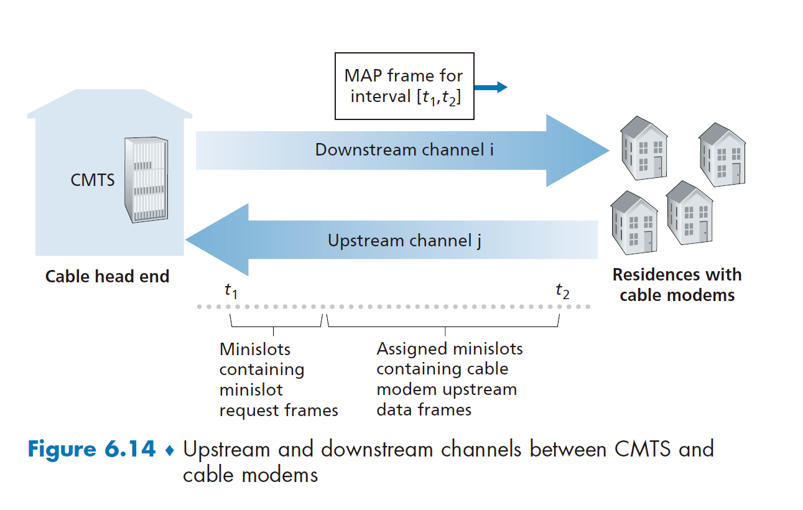

但是 CMTS 一开始是如何知道哪个电缆调制解调器有数据要发送呢？通过让电缆调 制解调器在专用于此目的的一组特殊的微时隙间隔内向 CMTS 发送微时隙请求帧来完成该任务，如图 6-14 所示。这些微时隙请求帧以随机接入方式传输，故可能相互碰撞。 电缆调制解调器既不能侦听上行信道是否忙，也不能检测碰撞。相反，该电缆调制解调 器如果没有在下一个下行控制报文中收到对请求分配的响应的话，就推断出它的微时隙 请求帧经历了一次碰撞。当推断出一次碰撞，电缆调制解调器使用二进制指数回退将其 微时隙请求帧延缓到以后的时隙重新发送。当在上行信道上有很少的流量，电缆调制解调器可能在名义上分配给微时隙请求帧的时隙内实际传输数据帧（因此避免不得不等待微时隙分配）。

因此，电缆接入网可作为应用多路访问协议（即 FDM，TDM，随机接入和集中分配时隙都用于一个网络中）的一个极好例子。

**time : 2020-07-03**

## 6.4. 交换局域网

前面一节涉及了广播网络和多路访问协议，我们现在将注意力转向交换局域网。

图 6-15 显示了一个交换局域网连接了 3 个部门，两台服务器和一台与 4 台交换机连接的路由器。因为这些交换机运行在链路层，所以它们交换链路层帧（而不是网络层数据报），不识别网络层地址，不使用如 RIP 或 OSPF 这样的路由选择算法来确定通过第二层交换机网络的路径。我们马上就会看到，它们使用链路层地址而不是 IP 地址来转发链路层帧通过交换机网络。我们首先以讨论链路层寻址（6-4-1 节）来开始对交换机局域网的学习。然后仔细学习著名的以太网协议（6-4-2 节）。在仔细学习链路层寻址和以太网后，我们将考察链路层交换机的工作方式（6-4-3 节），并随后考察通常是如何用这些交换机构建大规模局域网的（6-4-4 节）。

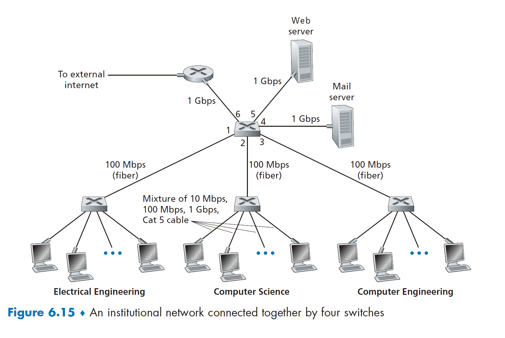

### 6.4.1. 链路层寻址和 ARP

主机和路由器具有链路层地址。现在你也许会感到惊讶，第 4 章中不是讲过主机和路由器也具有网络层地址吗？你也许会问：为什么我们在网络层和链路层都需要地址呢？除 了描述链路层地址的语法和功能，在本节中我们希望明明白白地搞清楚两层地址都有用的原因，事实上这些地址是必不可少的。我们还将学习地址解析协议（ARP），该协议提供了将 IP 地址转换为链路层地址的机制。

1. **MAC 地址**

事实上，并不是主机或路由器具有链路层地址，而是它们的适配器（即网络接口）具有链路层地址。因此，具有多个网络接口的主机或路由器将具有与之相关联的多个链路层地址，就像它也具有与之相关联的多个 IP 地址一样。然而，重要的是注意到链路层交换机并不具有与它们的接口（这些接口是与主机和路由器相连的）相关联的链路层地址。这是因为链路层交换机的任务是在主机与路由器之间承载数据报；交换机透明地执行该项任务，这就是说，主机或路由器不必明确地将帧寻址到其间的交换机。图 6-16 中说明了这种情况。链路层地址有各种不同的称呼：LAN 地址（LAN address）、物理地址（physical address）或 MAC 地址（MAC address）。因为 MAC 地址似乎是最为流行的术语，所以我们此后就将链路层地址称为 MAC 地址。对于大多数局域网（包括以太网和 802.11 无线局域网）而言，MAC 地址长度为 6 字节，共有 2^48 个可能的 MAC 地址。如图 6-16 所示，这些 6 个字节地址通常用十六进制表示法，地址的每个字节被表示为一对十六进制数。尽管 MAC 地址被设计为永久的，但用软件改变一块适配器的 MAC 地址现在是可能的。然而，对于本节的后面部分而言，我们将假设某适配器的 MAC 地址是固定的。


MAC 地址的一个有趣性质是没有两块适配器具有相同的地址。考虑到适配器是由许多不同国家和地区的不同公司生产的，这看起来似乎是件神奇之事。中国台湾生产适配器的公司如何能够保证与比利时生产适配器的公司使用不同的地址呢？答案是 IEEE 在管理着该 MAC 地址空间。特别是，当一个公司要生产适配器时，它支付象征性的费用购买组成 2^24 个地址的一块地址空间。IEEE 分配这块个地址的方式是: 固定一个 MAC 地址的前 24 比特，让公司自己为每个适配器生成后 24 比特的唯一组合。

适配器的 MAC 地址具有扁平结构（这与层次图 6-16 与局域网相连的每个接口都 有一个唯一的 MAC 地址结构相反），而且不论适配器到哪里用都不会变化。带有以太网接口的便携机总具有同样的 MAC 地址，无论该计算机位于何方。具有 802.11 接口的一台智能手机总是具有相同的 MAC 地址，无论该智能手机到哪里。与之形成对照的是，前面说过的 IP 地址具有 层次结构（即一个网络部分和一个主机部分），而且当主机移动时，主机的 IP 地址需要 改变，即改变它所连接到的网络。适配器的 MAC 地址与人的身份证号相似，后者也具有扁平寻址结构，而且无论人到哪里该号码都不会变化。IP 地址则与一个人的邮政地址相似，它是有层次的，无论何时当人搬家时，该地址都必须改变。就像一个人可能发现邮政地址和身份证号都有用那样，一台主机具有一个网络层地址和一个 MAC 地址是有用的。

当某适配器要向某些目的适配器发送一个帧时，发送适配器将目的适配器的 MAC 地址插入到该帧中，并将该帧发送到局域网上。如我们马上要看到的那样，一台交换机偶尔将一个入帧广播到它的所有接口。我们将在第 7 章中看到 802.11 也广播帧。因此一块适配器可以接收一个并非向它寻址的帧。这样，当适配器接收到一个帧时，将检查该帧中的目的 MAC 地址是否与它自己的 MAC 地址匹配。如果匹配，该适配器提取出封装的数据 报，并将该数据报沿协议栈向上传递。如果不匹配，该适配器丢弃该帧，而不会向上传递该网络层数据报。所以，仅当收到该帧时，才会中断目的地。

然而，有时某发送适配器的确要让局域网上所有其他适配器来接收并处理它打算发送的帧。在这种情况下，发送适配器在该帧的目的地址字段中插入一个特殊的 **MAC 广播地址(broadcast address)**。对于使用 6 字节地址的局域网（例如以太网和 802.11）来说，广播地址是 48 个连续的 1 组成的字符串（即以十六进制表示法表示的 FF-FF-FF-FF-FF-FF)。

2. **地址解析协议(ARP)**

因为存在网络层地址（例如，因特网的 IP 地址）和链路层地址（即 MAC 地址），所以需要在它们之间进行转换。对于因特网而言，这是 **地址解析协议(Address Resolution Protocol, ARP)** [RFC 826]的任务。

为了理解对于诸如 ARP 这样协议的需求，考虑如图 6-17 所示的网络。在这个简单的例子中，每台主机和路由器有一个单一的 IP 地址和单一的 MAC 地址与以往一样，IP 地址以点分十进制表示法表示，MAC 地址以十六进制表示法表示。为了便于讨论，我们在本节中将假设交换机广播所有帧；这就是说，无论何时交换机在一个接口接收一个帧，它将在其所有其他接口上转发该帧。在下一节中，我们将更为准确地解释交换机操作的过程。

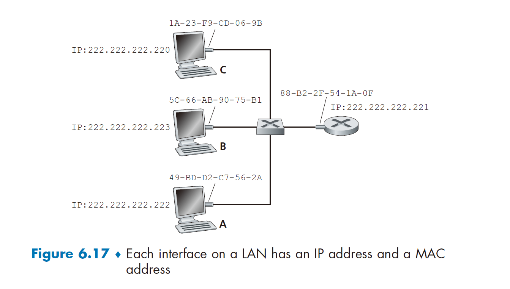

现在假设 IP 地址为 222.222.222.220 的主机要向主机 222.222.222.222 发送 IP 数据报。在本例中，源和目的均位于相同的子网中（在 4-3-3 节中的寻址意义下）。为了发送数据报，该源必须要向它的适配器不仅提供 IP 数据报，而且要提供目的主机 222.222.222.222 的 MAC 地址。然后发送适配器将构造一个包含目的地的 MAC 地址的链路层帧，并把该帧发送进局域网。

在本节中要处理的重要问题是，发送主机如何确定 IP 地址为 222.222.222.222 的目的 主机的 MAC 地址呢？正如你也许已经猜想的那样，它使用 ARP。在发送主机中的 ARP 模块将取在相同局域网上的任何 IP 地址作为输入，然后返回相应的 MAC 地址。在眼下的这个例子中，发送主机 222.222.222.220 向它的 ARP 模块提供了 IP 地址 222.222.222.222，并且其 ARP 模块返回了相应的 MAC 地址 49-BD-D2-C7-56-2A。

因此我们看到了 ARP 将一个 IP 地址解析为一个 MAC 地址。在很多方面它和 DNS （在 2-4 节中学习过）类似，DNS 将主机名解析为 IP 地址。然而，这两种解析器之间的一个重要区别是，DNS 为在因特网中任何地方的主机解析主机名，而 ARP 只为在同一个子 网上的主机和路由器接口解析 IP 地址。如果美国加利福尼亚州的一个节点试图用 ARP 为美国密西西比州的一个节点解析 IP 地址，ARP 将返回一个错误。

既然已经解释了 ARP 的用途，我们再来看看它是如何工作的。每台主机或路由器在其内存中具有一个 **ARP 表(ARP table)**，这张表包含 IP 地址到 MAC 地址的映射关系。下表显示了在主机 222.222.222.220 中可能看到的 ARP 表中的内容。该 ARP 表也包含一个寿命（TTL）值，它指示了从表中删除每个映射的时间。注意到这张表不必为该子网上的每台主机和路由器都包含一个表项；某些可能从来没有进入到该表中，某些可能已经过期。从一个表项放置到某 ARP 表中开始，一个表项通常的过期时间是 20 分钟。

| IP 地址         | MAC 地址          | TTL      |
| --------------- | ----------------- | -------- |
| 222.222.222.221 | 88-B2-2F-54-1A-0F | 13:45:00 |
| 222.222.222.223 | 5C-66-AB-90-75-B1 | 13:52:00 |

现在假设主机 222.222.222.220 要发送一个数据报，该数据报要 IP 寻址到本子网上另 一台主机或路由器。发送主机需要获得给定 IP 地址的目的主机的 MAC 地址。如果发送方的 ARP 表具有该目的节点的表项，这个任务是很容易完成的。但如果 ARP 表中当前没有该目的主机的表项，又该怎么办呢？特别是假设 222.222.222.220 要向 222.222.222.222 发送数据报。在这种情况下，发送方用 ARP 协议来解析这个地址。首先，发送方构造一个称为 **ARP 分组(ARP packet)** 的特殊分组。一个 ARP 分组有几个字段，包括发送和接收 IP 地址及 MAC 地址。ARP 查询分组和响应分组都具有相同的格式。ARP 查询分组的目的是询问子网上所有其他主机和路由器，以确定对应于要解析的 IP 地址的那个 MAC 地址。

回到我们的例子上来，222.222.222.220 向它的适配器传递一个 ARP 查询分组，并且指示适配器应该用 MAC 广播地址（即 FF-FF-FF-FF-FF-FF）来发送这个分组。适配器在链路层帧中封装这个 ARP 分组，用广播地址作为帧的目的地址，并将该帧传输进子网中。包含该 ARP 查询的帧能被子网上的所有其他适配器接收到，并且（由于广播地址）每个适配器都把在该帧中的 ARP 分组向上传递给 ARP 模块。这些 ARP 模块中的每个都检查它的 IP 地址是否与 ARP 分组中的目的 IP 地址相匹配。与之匹配的一个给査询主机发送回一个带有所希望映射的响应 ARP 分组。然后查询主机 222.222.222.220 能够更新它的 ARP 表，并发送它的 IP 数据报，该数据报封装在一个链路层帧中，并且该帧的目的 MAC 就是对先前 ARP 请求进行响应的主机或路由器的 MAC 地址。

关于 ARP 协议有两件有趣的事情需要注意。首先，查询 ARP 报文是在广播帧中发送的，而响应 ARP 报文在一个标准帧中发送。在继续阅读之前，你应该思考一下为什么这 样。其次，ARP 是即插即用的，这就是说，一个 ARP 表是自动建立的，即它不需要系统 管理员来配置。并且如果某主机与子网断开连接，它的表项最终会从留在子网中的节点的表中删除掉。

学生们常常想知道 ARP 是一个链路层协议还是一个网络层协议。如我们所看到的那 样，一个 ARP 分组封装在链路层帧中，因而在体系结构上位于链路层之上。然而，一个 ARP 分组具有包含链路层地址的字段，因而可认为是链路层协议，但它也包含网络层地址，因而也可认为是为网络层协议。所以，可能最好把 ARP 看成是跨越链路层和网络层边界两边的协议，即不完全符合我们在第 1 章中学习的简单的分层协议栈。现实世界协议就是这样复杂！

3. **发送数据报到子网以外**

但是现在我们来看更复杂的情况，即当子网中的某主机要向子网之外（也就是跨越路由器的另一个子网）的主机发送网络层数据报的情况。我们在图 6-19 的环境中来讨论这个问题，该图显示了一个由一台路由器互联两个子网所组成的简单网络。

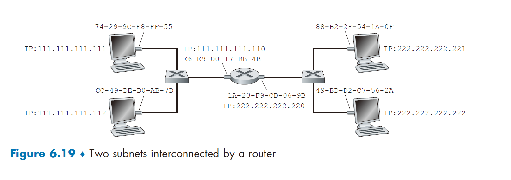

有关图 6-19 需要注意几件有趣的事情。每台主机仅有一个 IP 地址和一个适配器。但是，如第 4 章所讨论，一台路由器对它的每个接口都有一个 IP 地址。对路由器的每个接口，（在路由器中）也有一个 ARP 模块和一个适配器。在图 6-19 中的路由器有两个接口，所以它有两个 IP 地址、两个 ARP 模块和两个适配器。当然，网络中的每个适配器都有自己的 MAC 地址。

还要注意到子网 1 的网络地址为 111.111.111/24，子网 2 的网络地址为 222.222.222/24。因此，与子网 1 相连的所有接口都有格式为 111.111.111.xxx 的地址，与子网 2 相连的所有接口都有格式为 222.222.222.xxx 的地址。

现在我们考察子网 1 上的一台主机将向子网 2 上的一台主机发送数据报。特别是，假设主机 111.111.111.111 要向主机 222.222.222.222 发送一个 IP 数据报。和往常一样，发送主机向它的适配器传递数据报。但是，发送主机还必须向它的适配器指示一个适当的目的 MAC 地址。该适配器应该使用什么 MAC 地址呢？有人也许大胆猜测，这个适当的 MAC 地址就是主机 222.222.222.222 的适配器地址，即 49-BD-D2-C7-56-2A。然而，这个猜测是错误的！如果发送适配器要用那个 MAC 地址，那么子网 1 上所有的适配器都不会费心将该 IP 数据报传递到它的网络层，因为该帧的目的地址与子网 1 上所有适配器的 MAC 地址都将不匹配。这个数据报将只有死亡，到达数据报天国。

如果我们仔细地观察图 6-19,我们发现为了使一个数据报从 111.111.111.111 到子网 2 上的主机，该数据报必须首先发送给路由器接口 111.111.111.110，它是通往最终目的地路径上的第一跳路由器的 IP 地址。因此，对于该帧来说，适当的 MAC 地址是路由器接口 111.111.111.110 的适配器地址，即 E6-E9-00-17-BB-4B。但发送主机怎样获得 111.111.111.110 的 MAC 地址呢？当然是通过使用 ARP! 一旦发送适配器有了这个 MAC 地址，它创建一个帧（包含了寻址到 222.222.222.222 的数据报），并把该帧发送到子网 1 中。在子网 1 上的路由器适配器看到该链路层帧是向它寻址的，因此把这个帧传递给路由器的网络层。万岁！该 IP 数据报终于被成功地从源主机移动到这台路由器了！但是我们的任务还没有结束。我们仍然要将该数据报从路由器移动到目的地。路由器现在必须决定该数据报要被转发的正确接口。如在第 4 章中所讨论的，这是通过查询路由器中的转发表来完成的。转发表告诉这台路由器该数据报要通过路由器接口 222.222.222.220 转发。然后该接口把这个数据报传递给它的适配器，适配器把该数据报封装到一个新的帧中，并且将帧发送进子网 2 中。这时，该帧的目的 MAC 地址确实是最终目的地 MAC 地址。路由器又是怎样获得这个目的地 MAC 地址的呢？当然是用 ARP 获得的！

用于以太网的 ARP 定义在 RFC 826 中。在 TCP/IP 指南 RFC 1180 中对 ARP 进行了很好的介绍。

### 6.4.2. 以太网

以太网几乎占领着现有的有线局域网市场。在 20 世纪 80 年代和 90 年代早期，以太网面临着来自其他局域网技术包括令牌环、FDDI 和 ATM 的挑战。多年来，这些其他技术中的一些成功地抓住了部分局域网市场份额。但是自从 20 世纪 70 年代中期发明以太网以 来，它就不断演化和发展，并保持了它的支配地位。今天，以太网是到目前为止最流行的有线局域网技术，而且到可能预见的将来它可能仍保持这一位置。可以这么说，以太网对本地区域联网的重要性就像因特网对全球联网所具有的地位那样。

以太网的成功有很多原因。首先，以太网是第一个广泛部署的高速局域网。因为它部署得早，网络管理员非常熟悉以太网（它的奇迹和它的奇思妙想），并当其他局域网技术 问世时，他们不愿意转而用之。其次，令牌环、FDDI 和 ATM 比以太网更加复杂、更加昂贵，这就进一步阻碍了网络管理员改用其他技术。第三，改用其他局域网技术（例如 FDDI 和 ATM）的最引人注目的原因通常是这些新技术具有更高数据速率；然而以太网总 是奋起抗争，产生了运行在相同或更高数据速率下的版本。20 世纪 90 年代初期引入了交换以太网，这就进一步增加了它的有效数据速率。最后，由于以太网已经很流行了，所以 以太网硬件（尤其是适配器和交换机）成了一个普通商品，而且极为便宜。

Bob Metcalfe 和 David Boggs 在 20 世纪 70 年代中期发明初始的以太局域网。初始的以 太局域网使用同轴电缆总线来互联节点。以太网的总线拓扑实际上从 20 世纪 80 年代到 90 年代中期一直保持不变。使用总线拓扑的以太网是一种广播局域网，即所有传输的帧传送 到与该总线连接的所有适配器并被其处理。回忆一下，我们在 6-3-2 节中讨论了以太网的 具有二进制指数回退的 CSMA/CD 多路访问协议。

到了 20 世纪 90 年代后期，大多数公司和大学使用一种基于集线器的星形拓扑以太网安装替代了它们的局域网。在这种安装中，主机（和路由器）直接用双绞对铜线与一台集线器相连。集线器（hub）是一种物理层设备，它作用于各个比特而不是作用于帧。当表示一个 0 或一个 1 的比特到达一个接口时，集线器只是重新生成这个比特，将其能量强度放大，并将该比特向其他所有接口传输出去。因此，采用基于集线器的星形拓扑的以太网 也是一个广播局域网，即无论何时集线器从它的一个接口接收到一个比特，它向其所有其他接口发送该比特的副本。特别是，如果某集线器同时从两个不同的接口接收到帧，将出现一次碰撞，生成该帧的节点必须重新传输该帧。

在 21 世纪初，以太网又经历了一次重要的革命性变化。以太网安装继续使用星形拓扑，但是位于中心的集线器被交换机（switch）所替代。在本章后面我们将深入学习交换以太网。眼下我们仅知道交换机不仅是“无碰撞的”，而且也是名副其实的存储转发分组交换机就可以了；但是与运行在高至第三层的路由器不同，交换机仅运行在第二层。

1. **以太网帧结构**

以太网帧如图 6-20 所示。通过仔细研究以太网的帧，我们能够学到许多有关以太网的知识。

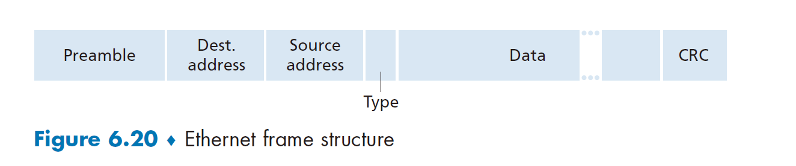

为了将对以太网帧的讨论放到切实的环境中，考虑从一台主机向另一台主机发送一个 IP 数据报，且这两台主机在相同的以太局域网上（例如，如图 6-17 所示的以太局域网）。（尽管以太网帧的负载是一个 IP 数据报，但我们注意到以太网帧也能够承载其他网络层分组。）设发送适配器（即适配器 A）的 MAC 地址是 AA-AA-AA-AA-AA-AA,接收适配器（即适配器 B）的 MAC 地址是 BB-BB-BB-BB-BB-BB。发送适配器在一个以太网帧中封装了一个 IP 数据报，并把该帧传递到物理层。接收适配器从物理层收到这个帧，提取岀 IP 数据报，并将该 IP 数据报传递给网络层。我们现在在这种情况下考察如图 6-20 所示的以太网帧的 6 个字段：

- **数据字段（46 ~ 1500 字节）**。这个字段承载了 IP 数据报。以太网的最大传输单元（MTU）是 1500 字节。这意味着如果 IP 数据报超过了 1500 字节，则主机必须将 该数据报分片，如 4-3-2 节所讨论。数据字段的最小长度是 46 字节。这意味着如果 IP 数据报小于 46 字节，数据报必须被填充到 46 字节。当采用填充时，传递到网络层的数据包括 IP 数据报和填充部分。网络层使用 IP 数据报首部中的长度字段来去除填充部分。
- **目的地址（6 字节）**。这个字段包含目的适配器的 MAC 地址，即 BB-BB-BB-BB-BB-BB。当适配器 B 收到一个以太网帧，帧的目的地址无论是 BB-BB-BB-BB-BB-BB，还是 MAC 广播地址，它都将该帧的数据字段的内容传递给网络层；如果它收到了具有任何其他 MAC 地址的帧，则丢弃之。
- **源地址（6 字节）**。这个字段包含了传输该帧到局域网上的适配器的 MAC 地址，在本例中为 AA-AA-AA-AA-AA-AA。
- **类型字段（2 字节）**。类型字段允许以太网复用多种网络层协议。为了理解这点, 我们需要记住主机能够使用除了 IP 以外的其他网络层协议。事实上，一台给定的主机可以支持多种网络层协议，以对不同的应用采用不同的协议。因此，当以太网帧到达适配器 B，适配器 B 需要知道它应该将数据字段的内容传递给哪个网络层协议（即分解）。IP 和其他链路层协议（例如，Novell IPX 或 AppleTalk）都有 它们各自的、标准化的类型编号。此外，ARP 协议（在上一节讨论过）有自己的类型编号，并且如果到达的帧包含 ARP 分组（即类型字段的值为十六进制的 0806），则该 ARP 分组将被多路分解给 ARP 协议。注意到该类型字段和网络层数据报中的协议字段、运输层报文段的端口号字段相类似；所有这些字段都是为了把一层中的某协议与上一层的某协议结合起来。
- **CRC（4 字节）**。如 6-2-3 节中讨论的那样，CRC （循环冗余检测）字段的目的是使得接收适配器（适配器 B）检测帧中是否引入了差错。
- **前同步码（8 字节）**。以太网帧以一个 8 字节的前同步码（Preamble）字段开始。该前同步码的前 7 字节的值都是 10101010；最后一个字节是 101010110 前同步码字段的前 7 字节用于“唤醒”接收适配器，并且将它们的时钟和发送方的时钟同 步。为什么这些时钟会不同步呢？记住适配器 A 的目的是根据以太局域网类型的不同，分别以 10 Mbps、100 Mbps 或者 1 Gbps 的速率传输帧。然而，没有什么是完美无缺的，因此适配器 A 不会以精确的额定速率传输帧；相对于额定速率总有一些漂移，局域网上的其他适配器不会预先知道这种漂移的。接收适配器只需通过 锁定前同步码的前 7 字节的比特，就能够锁定适配器 A 的时钟。前同步码的第 8 个字节的最后两个比特（第一个出现的两个连续的 1）警告适配器 B, “重要的内容”就要到来了。

所有的以太网技术都向网络层提供无连接服务。这就是说，当适配器 A 要向适配器 B 发送一个数据报时，适配器 A 在一个以太网帧中封装该数据报，并且把该帧发送到局域网 上，没有先与适配器 B 握手。这种第二层的无连接服务类似于 IP 的第三层数据报服务和 UDP 的第四层无连接服务。

以太网技术都向网络层提供不可靠服务。特别是，当适配器 B 收到一个来自适配器 A 的帧，它对该帧执行 CRC 校验，但是当该帧通过 CRC 校验时它既不发送确认帧；而当该帧没有通过 CRC 校验时它也不发送否定确认帧。当某帧没有通过 CRC 校验，适配器 B 只是丢弃该帧。因此，适配器 A 根本不知道它传输的帧是否到达了 B 并通过了 CRC 校验。 （在链路层）缺乏可靠的传输有助于使得以太网简单和便宜。但是它也意味着传递到网络层的数据报流能够有间隙。

如果由于丢弃了以太网帧而存在间隙，主机 B 上的应用也会看见这个间隙吗？如我们在第 3 章中学习的那样，这只取决于该应用是使用 UDP 还是使用 TCP。如果应用使用的是 UDP，则主机 B 中的应用的确会看到数据中的间隙。另一方面，如果应用使用的是 TCP, 则主机 B 中的 TCP 将不会确认包含在丢弃帧中的数据，从而引起主机 A 的 TCP 重传。注意到当 TCP 重传数据时，数据最终将回到曾经丢弃它的以太网适配器。因此，从这种意义 上来说，以太网的确重传了数据，尽管以太网并不知道它是正在传输一个具有全新数据的 全新数据报，还是一个包含已经被传输过至少一次的数据的数据报。

2. **以太网技术**

在以上的讨论中我们已经提到以太网，仿佛它有单一的协议标准似的。但事实上，以 太网具有许多不同的特色，具有某种令人眼花缭乱的首字母缩写词，如 10BASE-T、 10BASE-2. 100BASE-T、1000BASE-LX 和 10GBASE-T。这些以及许多其他的以太网技术在多年中已经被 IEEE 802.3 CSMA/CD（ Ethernet）工作组标准化了 [ IEEE 802. 3 2012]。 尽管这些首字母缩写词看起来眼花缭乱，实际上其中非常有规律性。首字母缩写词的第一 部分指该标准的速率：10、100、1000 或 10G，分别代表 10Mbps、100Mbps、1000Mbps （或 1 Gbps）和 10 Gbps 以太网。“BASE''指基带以太网，这意味着该物理媒体仅承载以太网流量；几乎所有的 802.3 标准都适用于基带以太网。该首字母缩写词的最后一部分指物 理媒体本身；以太网是链路层也是物理层的规范，并且能够经各种物理媒体（包括同轴电缆、铜线和光纤）承载。一般而言，“T”指双绞铜线。

从历史上讲，以太网最初被构想为一段同轴电缆。早期的 10BASE-2 和 10BASE-5 标准规定了在两种类型的同轴电缆之上的 10Mbps 以太网，每种标准都限制在 500 米长度之内。通过使用转发器（repeateC 能够得到更长的运行距离，而转发器是一种物理层设备, 它能在输入端接收信号并在输出端再生该信号。同轴电缆很好地对应于我们将作为一种广播媒体的以太网视图，即由一个接口传输的所有帧可在其他接口收到，并且以太网的 CSMA/CD 协议很好地解决了多路访问问题。节点直接附件在电缆上，万事大吉，我们有了一个局域网了!

多年来以太网已经经历了一系列演化步骤，今天的以太网非常不同于使用同轴电缆的初始总线拓扑的设计。在今天大多数的安装中，节点经点对点的由双绞铜线或光纤线缆构成的线段与一台交换机相连，如图 6-15 至图 6-17 所示。

在 20 世纪 90 年代中期，以太网被标准化为 100Mbps,比 10Mbps 以太网快 10 倍。初始的以太网 MAC 协议和帧格式保留了下来，但更高速率的物理层被定义为用铜线(100BASE-T)和用光纤(100BASE-FX. 100BASE-SX. 100BASE-BX)。图 6-21 显示了这 些不同的标准和共同的以太网 MAC 协议和帧格式。100 Mbps 以太网用双绞线距离限制为 100 米，用光纤距离限制为几千米，允许把不同建筑物中的以太网交换机连接起来。

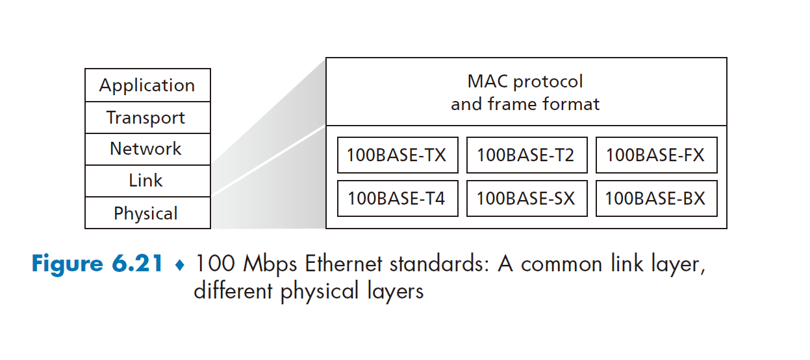

吉比特以太网是对极为成功的 10 Mbps 和 100 Mbps 以太网标准的扩展。40Gbps 以太网提供 40 000Mbps 的总数据速率，与大量已经安装的以太网设备基础保持完全兼容。吉比 特以太网的标准称为 IEEE 802.3z,它完成以下工作：

使用标准以太网帧格式(参见图 6-20),并且后向兼容 10BASE-T 与 100BASE-T 技术。这使得吉比特以太网和现已安装的以太网设备基础很容易集成。

- 允许点对点链路以及共享的广播信道。如前所述，点对点链路使用交换机，而广 播信道使用集线器。在吉比特以太网术语中，集线器被称为“带缓存的分配器”。
- 使用 CSMA/CD 来共享广播信道。为了得到可接受的效率，节点之间的最大距离必须严格限制。
- 对于点对点信道，允许在两个方向上都以 40 Gbps 全双工操作。

吉比特以太网最初工作于光纤之上，现在能够工作在 5 类 UTP 线缆上。

我们通过提岀一个问题来结束有关以太网技术的讨论，这个问题开始可能会难倒你。在总线拓扑和基于集线器的星形拓扑技术时代，以太网很显然是一种广播链路(如 6-3 节所定义)，其中多个节点同时传输时会出现帧碰撞。为了处理这些碰撞，以太网标准包括 T CSMA/CD 协议，该协议对于跨越一个小的地理半径的有线广播局域网特别有效。但是对于今天广为使用的以太网是基于交换机的星形拓扑，采用的是存储转发分组交换，是否还真正需要一种以太网 MAC 协议呢？如我们很快所见，交换机协调其传输，在任何时候决不会向相同的接口转发超过一个帧。此外，现代交换机是全双工的，这使得一台交换机和一个节点能够在同时向对方发送帧而没有干扰。换句话说，在基于交换机的以太局域网中，不会有碰撞，因此没有必要使用 MAC 协议了!

如我们所见，今天的以太网与 Metcalfe 和 Boggs 在 30 多年前构想的初始以太网有非常大的不同，即速度已经增加了 3 个数量级，以太网帧承载在各种各样的媒体之上，交换以太网已经成为主流，此时甚至连 MAC 协议也经常是不必要的了！所有这些还真正是以太 网吗？答案当然是：“是的，根据定义如此。”然而，注意到下列事实是有趣的：通过所有这些改变，的确还有一个历经 30 年保持未变的持久不变量，即以太网帧格式。也许这才是以太网标准的一个真正重要的特征。

### 6.4.3. 链路层交换机

到目前为止，我们有意对交换机实际要做的工作以及它是怎样工作的含糊其辞。交换机的任务是接收入链路层帧并将它们转发到出链路；我们将在这一节中详细学习这种转发功能。我们将看到交换机自身对子网中的主机和路由器是 **透明的(transparent)**；这就是说，某主机/路由器向另一个主机/路由器寻址一个帧（而不是向交换机寻址该帧），顺利地将该帧发送进局域网，并不知道某交换机将会接收该帧并将它转发到另一个节点。这些
帧到达该交换机的任何输岀接口之一的速率可能暂时会超过该接口的链路容量。为了解决这个问题，交换机输出接口设有缓存，这非常类似于路由器接口为数据报设有缓存。现在我们来仔细考察交换机运行的原理。

1. **交换机转发和过滤**

过滤（filtering）是决定一个帧应该转发到某个接口还是应当将其丢弃的交换机功能。**转发(forwarding)** 是决定一个帧应该被导向哪个接口，并把该帧移动到那些接口的交换机功能。交换机的过滤和转发借助于 **交换机表(switch table)** 完成。该交换机表包含某局域网上某些主机和路由器的但不必是全部的表项。交换机表中的一个表项包含：1. 一个 MAC 地址；2. 通向该 MAC 地址的交换机接口；3. 表项放置在表中的时间。下表中显示了图 6-15 中最上方交换机的一个交换机表的例子。尽管帧转发的描述听起来类似于第 4 章讨论的数据转发，但我们将很快看到它们之间有重要的差异。确实在 4-4 节中一般化转发的讨论中我们学习过，许多现代分组交换机能够被配置，以基于第二层目的 MAC 地址（即起着第二层交换机的功能）或者第三层 IP 目的地址（即起着第三层交换机的功能）进行转发。无论如何，我们将对交换机基于 MAC 地址而不是基于 IP 地址转发分组进行明确区分。我们也将看到传统的（即处于非 SDN 环境）交换机表的构造方式与路由器转发表的构造方式有很大不同。

| MAC 地址          | 接口 | 时间 |
| ----------------- | ---- | ---- |
| 62-FE-F7-11-89-A3 | 1    | 9:32 |
| 7C-BA-B2-B4-91-10 | 3    | 9:36 |

为了理解交换机过滤和转发的工作过程，假定目的地址为 DD-DD-DD-DD-DD-DD 的帧从交换机接口 x 到达。交换机用 MAC 地址 DD-DD-DD-DD-DD-DD 索引它的表。有 3 种可能的情况：

- 表中没有对于 DD-DD-DD-DD-DD-DD 的表项。在这种情况下，交换机向除接口先外的所有接口前面的输岀缓存转发该帧的副本。换言之，如果没有对于目的地址的表项，交换机广播该帧。
- 表中有一个表项将 DD-DD-DD-DD-DD-DD 与接口 x 联系起来。在这种情况下，该帧从包括适配器 DD-DD-DD-DD-DD-DD 的局域网网段到来。无须将该帧转发到任何其他接口，交换机通过丢弃该帧执行过滤功能即可。
- 表中有一个表项将 DD-DD-DD-DD-DD-DD 与接口 y != x 联系起来。在这种情况下, 该帧需要被转发到与接口 y 相连的局域网网段。交换机通过将该帧放到接口 y 前面的输出缓存完成转发功能。

我们大致地看一下用于图 6-15 中最上面交换机的这些规则以及图 6-22 中所示的它的交换机表。假设目的地址为 62-FE-F7-11-89-A3 的一个帧从接口 1 到达该交换机。交换机检查它的表并且发现其目的地是在与接口 1 相连的局域网网段上（即电气工程系的局域网）。这意味着该帧已经在包含目的地的局域网网段广播过了。因此该交换机过滤（即丢弃）了该帧。现在假设有同样目的地址的帧从接口 2 到达。交换机再次检查它的表并且发现其目的地址在接口 1 的方向上；因此它向接口 1 前面的输出缓存转发该帧。这个例子清楚地 表明，只要交换机的表是完整和准确的，该交换机无须任何广播就向着目的地转发帧。

在这种意义上，交换机比集线器更为“聪明”。但是一开始这个交换机表是如何配置起来的呢？链路层有与网络层路由选择协议等价的协议吗？或者必须要一名超负荷工作的管理员人工地配置交换机表吗?

2. **自学习**

交换机具有令人惊奇的特性（特别是对于早已超负荷工作的网络管理员），那就是它的表是自动、动态和自治地建立的，即没有来自网络管理员或来自配置协议的任何干预。换句话说，交换机是 **自学习(self-learning)** 的。这种能力是以如下方式实现的:

(1) 交换机表初始为空。
(2) 对于在每个接口接收到的每个入帧，该交换机在其表中存储：1. 在该帧源地址字段中的 MAC 地址；2. 该帧到达的接口；3. 当前时间。交换机以这种方式在它的表中记录了发送节点所在的局域网网段。如果在局域网上的每个主机最终都发送了一个帧，则每个 主机最终将在这张表中留有记录。
(3) 如果在一段时间后，交换机没有接收到以该地址作为源地址的帧，就在表中删除这个地址。以这种方式，如果一台 PC 被另一台 PC（具有不同的适配器）代替，原来 PC 的 MAC 地址将最终从该交换机表中被清除掉。

我们粗略地看一下用于图 6-15 中最上面交换机的自学习性质以及在上面表中它对应的交换机表。假设在时刻 9:39，源地址为 01-12-23-34-45-56 的一个帧从接口 2 到达。假设这个地址不在交换机表中。于是交换机在其表中增加一个新的表项，如下表中所示。

| 地址              | 接口 | 时间 |
| ----------------- | ---- | ---- |
| 01-12-23-34-45-56 | 2    | 9:39 |
| 62-FE-F7-11-89-A3 | 1    | 9:32 |
| 7C-BA-B2-B4-9M-10 | 3    | 9:36 |
| ...               | ...  | ...  |

继续这个例子，假设该交换机的老化期是 60 min，在 9：32 到 10：32 期间源地址是 62-FE-F7-11-89-A3 的帧没有到达该交换机。那么在时刻 10:32，这台交换机将从它的表中删除该地址。

交换机是 **即插即用设备(plug-and-play device)**，因为它们不需要网络管理员或用户的干预。要安装交换机的网络管理员除了将局域网网段与交换机的接口相连外，不需要做其他任何事。管理员在安装交换机或者当某主机从局域网网段之一被去除时，他没有必要配 置交换机表。交换机也是双工的，这意味着任何交换机接口能够同时发送和接收。

3. **链路层交换机的性质**

在描述了链路层交换机的基本操作之后，我们现在来考虑交换机的特色和性质。我们能够指出使用交换机的几个优点，它们不同于如总线或基于集线器的星形拓扑那样的广播链路:

- 消除碰撞。在使用交换机（不使用集线器）构建的局域网中，没有因碰撞而浪费的带宽！交换机缓存帧并且决不会在网段上同时传输多于一个帧。就像使用路由器一样，交换机的最大聚合带宽是该交换机所有接口速率之和。因此，交换机提 供了比使用广播链路的局域网高得多的性能改善。
- 异质的链路。交换机将链路彼此隔离，因此局域网中的不同链路能够以不同的速率运行并且能够在不同的媒体上运行。例如，图 6・22 中最上面的交换机有 3 条 1 Gbps 1000BASE-T 铜缆链路、2 条 100Mbps 10BASE- FX 光缆链路和 1 条 100 BASE-T 铜缆链路。' 因此，对于原有的设备与新设备混用，交换机是理想的。
- 管理。除了提供强化的安全性（参见插入材料“关注安全性”），交换机也易于进行网络管理。例如，如果一个适配器工作异常并持续发送以太网帧（称为快而含糊的（jabbering）适配器），交换机能够检测到该问题，并在内部断开异常适配器。有了这种特色，网络管理员不用起床并开车到工作场所去解决这个问题。类似地，一条割断的缆线仅使得使用该条缆线连接到交换机的主机断开连接。在使用同轴电缆的时代，许多网络管理员花费几个小时“沿线巡检”（或者更准确地说“在天花板上爬行”），以找到使整个网络瘫痪的电缆断开之处。交换机也收集带宽使用的统计数据、碰撞率和流量类型，并使这些信息为网络管理者使用。这些信息能够用于调试和解决问题，并规划该局域网在未来应当演化的方式。研究人员还在原型系统部署中探讨在以太局域网中增加更多的管理功能［Casado 2007；Koponen 2011]

4. **交换机和路由器比较**

如我们在第 4 章学习的那样，路由器是使用网络层地址转发分组的存储转发分组交换机。尽管交换机也是一个存储转发分组交换机，但它和路由器是根本不同的，因为它用 MAC 地址转发分组。交换机是第二层的分组交换机，而路由器是第三层的分组交换机。然而，回顾我们在 4-4 节中所学习的内容，使用“匹配加动作”的现代交换机能够转发基于帧的目的 MAC 地址的第二层帧，也能转发使用数据报目的 IP 地址的第三层数据报。我们的确看到了使用 OpenFlow 标准的交换机能够基于 11 个不同的帧、数据报和运输层首部字段，执行通用的分组转发。

即使交换机和路由器从根本上是不同的，网络管理员在安装互联设备时也经常必须在 它们之间进行选择。例如，对于图 6-15 中的网络，网络管理员本来可以很容易地使用路由器而不是交换机来互联各个系的局域网、服务器和互联网网关路由器。路由器的确使得各系之间通信而不产生碰撞。既然交换机和路由器都是候选的互联设备，那么这两种方式的优点和缺点各是什么呢?

首先考虑交换机的优点和缺点。如上面提到的那样，交换机是即插即用的，这是世界 上所有超负荷工作的网络管理员都喜爱的特性。交换机还能够具有相对高的分组过滤和转发速率，就像图 6-24 中所示的那样，交换机必须处理高至第二层的帧.而路由器必须处理高至第三层的数据报。在另一方面，为了防止广播帧的循环，交换网络的活跃拓扑限制为一棵生成树。另外，一个大型交换网络将要求在主机和路由器中有大的 ARP 表，这将生成可观的 ARP 流量和处理量。而且，交换机对于广播风暴并不提供任何保护措施，即如果某主机出了故障并传输出没完没了的以太网广播帧流，该交换机将转发所有这些帧，使得整个以太网的崩溃。

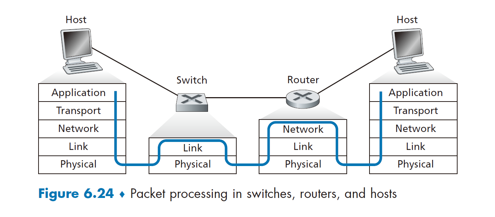

现在考虑路由器的优点和缺点。因为网络寻址通常是分层次的（不像 MAC 寻址那样是扁平的），即使当网络中存在冗余路径时，分组通常也不会通过路由器循环。（然而，当 路由器表被误配置时，分组可能循环；但是如我们在第 4 章所知，IP 用一个特殊的报文首 部字段来限制循环。）所以，分组就不会被限制到一棵生成树上，并可以使用源和目的地之间的最佳路径。因为路由器没有生成树限制，所以它们允许以丰富的拓扑结构构建因特网，例如包括欧洲和北美之间的多条活跃链路。路由器的另一个特色是它们对第二层的广 播风暴提供了防火墙保护。尽管也许路由器最重要的缺点就是它们不是即插即用的，即路由器和连接到它们的主机都需要人为地配置 IP 地址。而且路由器对每个分组的处理时间通常比交换机更长，因为它们必须处理高达第三层的字段。最后，路由器一词有两种不同的发音方法，或者发音为“rootor”或发音为“rowter”，人们浪费了许多时间争论正确的发音[Perlman 1999]。

给出了交换机和路由器各自具有的优点和缺点后（总结在下表中），一个机构的网络（例如，大学校园网或者公司园区网） 什么时候应该使用交换机，什么时候用路由器呢？通常，由几百台主机组成的小网络通常有几个局域网网段。对于这些小网络，交换机就足够了，因为它们不要求 IP 地址的任何配置就能使流量局部化并增加总计吞吐量。但是在由几千台主机组成的更大网络中，通常在网络中（除了交换机之外）还包括路由器。路由器提供了更健壮的流量隔离方式和对广播风暴的控制，并在网络的主机之间使用更“智能的”路由。

|          | 集线器 | 路由器 | 交换机 |
| -------- | ------ | ------ | ------ |
| 流量隔离 | 无     | 有     | 有     |
| 即插即用 | 有     | 无     | 有     |
| 优化路由 | 无     | 有     | 无     |

对于交换网络和路由网络的优缺点的进一步讨论，以及如何能够将交换局域网技术扩展为比今天的以太网容纳多两个数量级以上的主机，参见[Meyers 2004； Kim 2008]。

**to-do : 2021-07-04**

### 6.4.4. 虚拟局域网

在我们前面对图 6-15 的讨论中，我们注意到现代的机构 LAN 常常被配置为具有等级结构，每个工作组（部门）有自己的交换局域网，经过一个交换机等级结构与其他工作组的交换 局域网互联。虽然这样的配置在理想世界中能够很好地工作，但在现实世界常常不尽如人意。在图 6-15 中的配置中，能够发现 3 个缺点：

- 缺乏流量隔离。尽管该等级结构把组流量局域化到一个单一交换机中，但广播流量（例如携带 ARP 和 DHCP 报文或那些目的地还没有被自学习交换机学习到的帧）仍然必须跨越整个机构网络。限制这些广播流量的范围将改善局域网的性能。也许更为重要的是，为了安全/隐私的目的也可能希望限制局域网广播流量。例如，如果一个组包括公司的行政管理团队，另一个组包括运行着 Wireshark 分组嗅探器的心怀不满的雇员，网络管理员也许非常希望行政流量无法到达该雇员的主机。通过用路由器代替图 6-15 中的中心交换机，能够提供这种类型的隔离。我们很快看到这种隔离也能够经过一种交换（第二层）解决方案来取得。
- 交换机的无效使用。如果该机构不止有 3 个组，而是有 10 个组，则将要求有 10 个第一级交换机。如果每个组都较小,比如说少于 10 个人，则单台 96 端口的交换机将足以容纳每个人，但这台单一的交换机将不能提供流量隔离。
- 管理用户。如果一个雇员在不同组间移动，必须改变物理布线，以将该雇员连接 到图 6・15 中的不同的交换机上。属于两个组的雇员将使问题更为困难。

幸运的是，这些难题中的每个都能够通过支持 **虚拟局域网(Virtula Local Network, VLAN)** 的交换机来处理。顾名思义，支持 VLAN 的交换机允许经一个单一的物理局域网基础设施定义多个虚拟局域网。在一个 VLAN 内的主机彼此通信，仿佛它们（并且没有其他主机）与交换机连接。在一个基于端口的 VLAN 中，交换机的端口（接口）由网络管理员划分为组。每个组构成一个 VLAN，在每个 VLAN 中的端口形成一个广播域（即来自一个端口的广播流量仅能到达该组中的其他 端口）。图 6-25 显示了具有 16 个端口的单 一交换机。端口 2 ~ 8 属于电气工程系（EE） VLAN，而端口 9 ~ 15 属于计算机科学系（CS）VLAN （端口 1 和 16 未分配）。这个 VLAN 解决了上面提到的所有困难，即 EE VLAN 帧和 CS VLAN 帧彼此隔离，图 6- 15 中的两台交换机已由一台交换机替代，并 且在交换机端口 8 的用户加入计算机科学系时，网络操作员只需重新配置 VLAN 软件，使得端口 8 与 CS VLAN 相关联即可。人们容易想象到 VLAN 交换机配置和操作的方法，即网络管理员使用交换机管理软件声明一个端口属于某个给定的 VLAN（其中未声明的端 口属于一个默认的 VLAN），在交换机中维护一张端口到 VLAN 的映射表；交换机软件仅 在属于相同 VLAN 的端口之间交付帧。


但完全隔离两个 VLAN 带来了新的困难！来自电子工程系的流量怎样才能发送到计算 机科学系呢？解决这个问题的一种方式是将 VLAN 交换机的一个端口（例如在图 6-25 中的端口 1）与一台外部的路由器相连，并且将该端口配置为属于 EE VLAN 和 CS VLAN0 在此情况下，即使电子工程系和计算机科学系共享相同的物理交换机，其逻辑配置看起来也仿佛是电子工程系和计算机科学系具有分离的经路由器连接的交换机。从电子工程系发往计算机科学系的数据报将首先跨越 EE VLAN 到达路由器，然后由该路由器转发跨越 CS VLAN 到达 CS 主机。幸运的是交换机厂商使这种配置变得容易，网络管理员通过构建包含一台 VLAN 交换机和一台路由器的单一设备，这样就不再需要分离的外部路由器了。本章后面的课后习题中更为详细地探讨了这种情况。

再次返回到图 6-15,我们现在假设计算机工程系没有分离开来，某些电子工程和计算机科学教职员工位于一座建筑物中，他们当然需要网络接入，并且他们希望成为他们系 VLAN 的一部分。图 6・26 显示了第二台 8 端口交换机，其中交换机端口已经根据需要定义为属于 EE VLAN 或 CSVLAN。但是这两台交换机应当如何互联呢？ 一种容易的解决方案是在每台交换机上定义一个属于 CS VALN 的端口（对 EE VLAN 也类似处理），并且如 图 6-26a 所示将这两个端口彼此互联起来。然而，这种解决方案不具有扩展性，因为在每台交换机上 N 个 VLAN 将要求 N 个端口直接互联这两台交换机。

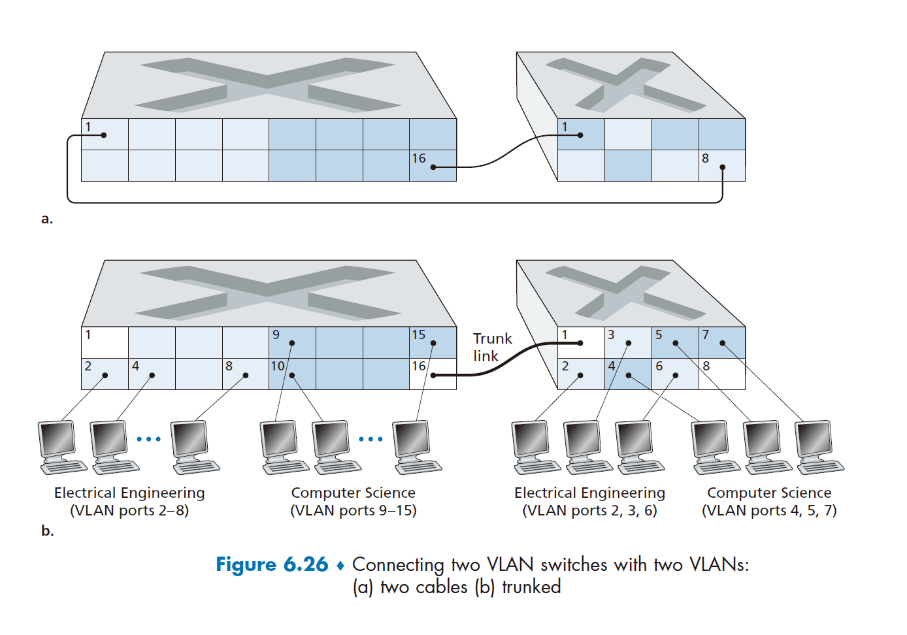

一种更具扩展性互联 VLAN 交换机的方法称为 VLAN 干线连接（VLAN trunking）。在图 6-26b 所示的 VLAN 干线方法中，每台交换机上的一个特殊端口（左侧交换机上的端口 16,右侧交换机上的端口 1）被配置为干线端口，以互联这两台 VLAN 交换机。该干线端 口属于所有 VLAN,发送到任何 VLAN 的帧经过干线链路转发到其他交换机。但这会引起另外的问题：一个交换机怎样知道到达干线端口的帧属于某个特定的 VLAN 呢？ IEEE 定义了一种扩展的以太网帧格式——802. 1Q,用于跨越 VLAN 干线的帧。如图 6-27 中所示,802.1Q 帧由标准以太网帧与加进首部的 4 字节 VLAN 标签（VLAN tag）组成，而 VLAN 标签承载着该帧所属的 VLAN 标识符。VLAN 标签由在 VLAN 干线发送侧的交换机加进帧中，解析后并由在 VLAN 干线接收侧的交换机删除。VLAN 标签自身由一个 2 字节的标签协议标识符（Tag Protocol Identifier, TPID）字段（具有固定的十六进制值 81-00）. 一个 2 字节的标签控制信息字段（包含一个 12 比特的 VLAN 标识符字段）和一个 3 比特优先权 字段（具有类似于 IP 数据报 TOS 字段的目的）组成。


在这部分讨论中，我们仅仅简要地涉及了 VLAN，关注了基于端口的 VLAN。我们也 应当提及 VLAN 能够以几种其他方式定义。在基于 MAC 的 VLAN 中，网络管理员指定属 于每个 VLAN 的 MAC 地址的集合；无论何时一个设备与一个端口连接时，端口基于设备 的 MAC 地址将其连接进适当的 VLAN。VLAN 也能基于网络层协议（例如 IPv4、IPv6 或 Appletalk）和其他准则进行定义。VLAN 跨越 IP 路由器扩展也是可能的，这使得多个 LAN 孤岛能被连接在一起，以形成能够跨越全局的单一 LAN [Yu 2011]。详情请参见 802.1Q 标准[IEEE 802.1 Q 2005]。

## 6.5. 链路虚拟化：网络作为链路层

因为本章关注链路层协议，所以在我们临近该章结束的时候，让我们反思一下对已经 演化的词汇链路的理解。在本章开始时，我们将链路视为连接两台通信主机的物理线路。 在学习多路访问协议时，我们看到了多台主机能够通过一条共享的线路连接起来，并且连 接主机的这种“线路”能够是无线电频谱或其他媒体。这使我们将该链路更多地抽象为一条信道，而不是作为一条线路。在我们学习以太局域网时（图 6-15）,我们看到互联媒体实际上能够是一种相当复杂的交换基础设施。然而，经过这种演化，主机本身维持着这样的视图，即互联媒体只是连接两台或多台主机的链路层信道。我们看到，例如一台以太网主机不知道它是通过单一短局域网网段（图 6-17）还是通过地理上分布的交换局域网（图 6-15）或通过 VLAN 与其他局域网主机进行连接，这是很幸福的事。

在两台主机之间由拨号调制解调器连接的场合，连接这两台主机的链路实际上是电话网，这是一个逻辑上分离的、全球性的电信网络，它有自己的用于数据传输和信令的交换 机、链路和协议栈。然而，从因特网链路层的观点看，通过电话网的拨号连接被看作一根简单的“线路”。在这个意义上，因特网虚拟化了电话网，将电话网看成为两台因特网主 机之间提供链路层连接的链路层技术。你可能回想起在第 2 章中对于覆盖网络的讨论，类似地，一个覆盖网络将因特网视为为覆盖节点之间提供连接性的一种手段，寻求以因特网覆盖电话网的相同方式来覆盖因特网。

在本节中，我们将考虑多协议标签交换（MPLS）网络。与电路交换的电话网不同, MPLS 客观上讲是一种分组交换的虚电路网络。它们有自己的分组格式和转发行为。因此, 从教学法的观点看，有关 MPLS 的讨论既适合放在网络层的学习中，也适合放在链路层的 学习中。然而，从因特网的观点看，我们能够认为 MPy 像电话网和交换以太网一样，作 为为 IP 设备提供互联服务的链路层技术。因此，我们将在链路层讨论中考虑 MPLS。帧中继和 ATM 网络也能用于互联 IP 设备，虽然这些技术看上去有些过时（但仍在部署），这里将不再讨论；详情请参见一本可读性强的书［Goralski 1999］。我们对 MPLS 的讨论将是简明扼要的，因为有关这些网络每个都能够写（并且已经写了）整本书。有关 MPLS 详情我们推荐［Davie 2000］。我们这里主要关注这些网络怎样为互联 IP 设备提供服务，尽管我们也将更深入一些探讨支撑基础技术。

### 6.5.1. 多协议标签交换(MPL)

**多协议标签交换（Multiprotocol Label Switching, MPLS）** 自 20 世纪 90 年代中后期在一些产业界的努力下进行演化，以改善 IP 路由器的转发速度。它采用来自虚电路网络领域 的一个关键概念：固定长度标签。其目标是：对于基于固定长度标签和虚电路的技术，在 不放弃基于目的地 IP 数据报转发的基础设施的前提下，当可能时通过选择性地标识数据 报并允许路由器基于固定长度的标签（而不是目的地 IP 地址）转发数据报来增强其功能。 重要的是，这些技术与 IP 协同工作，使用 IP 寻址和路由选择。IETF 在 MPLS 协议中统一 了这些努力［RFC 3031； RFC 3032］,有效地将虚电路（VC）技术综合进了路由选择的数据报网络。

首先考虑由 MPLS 使能的路由器处理的链路层帧格式，以此开始学习 MPLS0 图 6・28 显示了在 MPLS 使能的路由器之间传输的一个链路层帧，该帧具有一个小的 MPLS 首部, 该首部增加到第二层（如以太网）首部和第三层（即 IP）首部之间。RFC 3032 定义了用于这种链路的 MPLS 首部的格式；用于 ATM 和帧中继网络的首部也定义在其他的 RFC 文档中。包括在 MPLS 首部中的字段是：标签；预留的 3 比特实验字段；1 比特 S 字段，用 于指示一系列“成栈”的 MPLS 首部的结束（我们这里不讨论这个高级主题）；寿命字段。

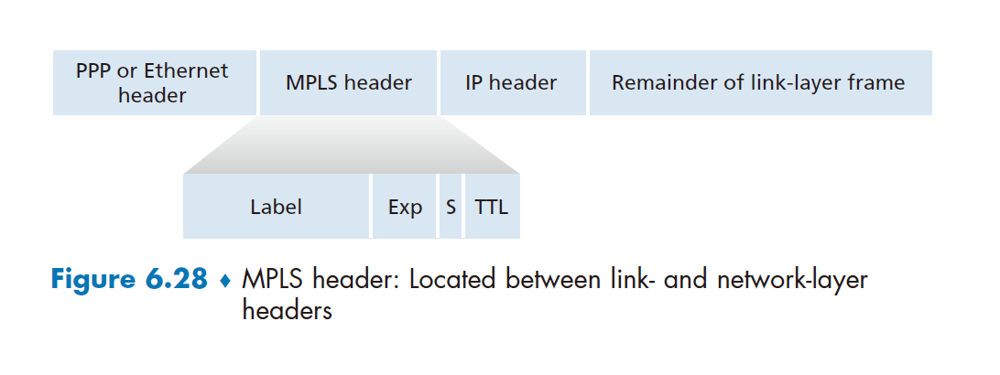

从图 6-28 立即能够看出，一个 MPLS 加强的帧仅能在两个均为 MPLS 使能的路由器之间发送。（因为一个非 MPLS 使能的路由器，当它在期望发现 IP 首部的地方发现了一个 MPLS 首部时会相当混淆！）一个 MPLS 使能的路由器常被称为 **标签交换路由器（label-switched router）**,因为它通过在其转发表中查找 MPLS 标签，然后立即将数据报传递给适 当的输岀接口来转发 MPLS 帧。因此，MPLS 使能的路由器不需要提取目的 IP 地址和在转 发表中执行最长前缀匹配的查找。但是路由器怎样才能知道它的邻居是否的确是 MPLS 使能的呢？路由器如何知道哪个标签与给定 IP 目的地相联系呢？为了回答这些问题，我们需要看看一组 MPLS 使能路由器之间的交互过程。

在图 6-29 所示的例子中，路由器 R1 到 R4 都是 MPLS 使能的，R5 和 R6 是标准的 IP 链路层和局域网路由器。R1 向 R2 和 R3 通告了它（R1）能够路由到目的地 A,并且具有 MPLS 标签 6 的 接收帧将要转发到目的地 Ao 路由器 R3 已经向路由器 R4 通告了它能够路由到目的地 A 和 D,分别具有 MPLS 标签 10 和 12 的入帧将朝着这些目的地交换。路由器 R2 也向路由器 R4 通告了它（R2）能够到达目的地 A,具有 MPLS 标签 8 的接收帧将朝着 A 交换。注意 到路由器 K4 现在处于一个到达 A 且有两个 MPLS 路径的令人感兴趣的位置上，经接口 0 具有出 MPLS 标签 10,经接口 1 具有出 MPLS 标签 8。在图 6-29 中画出的外围部分是 IP 设 备 R5、R6、A 和 D,它们经过一个 MPLS 基础设施（MPLS 使能路由器 Rl、R2、R3 和 R4）连接在一起，这与一个交换局域网或 ATM 网络能够将 IP 设备连接到一起的方式十分 相似。并且与交换局域网或 ATM 网络相似，MPLS 使能路由器 R1 到 R4 完成这些工作时 从没有接触分组的 IP 首部。

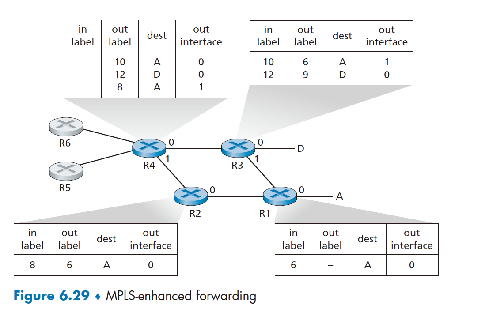

在我们上面的讨论中，我们并没有指定在 MPLS 使能路由器之间分布标签的特定协 议，因为该信令的细节已经超出了本书的范围。然而，我们注意到，IETF 的 MPLS 工作组 已经在[RFC 3468]中定义了 RSVP 协议的一种扩展，称之为 RSVP-TE[ RFC 3209],它 将关注对 MPLS 信令所做的工作。我们也不讨论 MPLS 实际上是如何计算在 MPLS 使能路 由器之间分组的路径的，也不讨论它如何收集链路状态信息（例如，未由 MPLS 预留的链路带宽量）以用于这些路径计算中。现有的链路状态路由选择算法（例如 OSPF）已经扩展为向 MP 口使能路由器“洪泛”。令人感兴趣的是，实际路径计算算法没有标准化，它们当前是厂商特定的算法。

至今为止，我们关于 MPLS 的讨论重点基于这样的事实，MPLS 基于标签执行交换, 而不必考虑分组的 IP 地址。然而，MPLS 的真正优点和当前对 MPLS 感兴趣的原因并不在于交换速度的潜在增加，而在于 MPLS 使能的新的流量管理能力。如前面所述，R4 到 A 具有两条 MPLS 路径。如果转发在 IP 层基于 IP 地址执行，我们在第 4 章中学习的 IP 路由 选择协议将只指定到 A 的单一最小费用的路径。所以，MPLS 提供了沿着多条路由转发分 组的能力，使用标准 IP 路由选择协议这些路由将是不可能的。这是使用 MPLS 的一种简单形式的流量工程(traffic engineering) [RFC 3346； RFC3272； RFC 2702； Xiao 2000],其中网络运行者能够超越普通的 IP 路由选择，迫使某些流量沿着一条路径朝着某给定的目的地引导，并且朝着相同目的地的其他流量沿着另一条路径流动（无论是由于策略、性能或某些其他原因）。

将 MPLS 用于其他目的也是可能的。能用于执行 MPLS 转发路径的快速恢复，例如，经过一条预计算的无故障路径重路由流量来对链路故障做出反应[Kar2000； Huang 2002； RFC 3469]。最后，我们注意到 MPLS 能够并且已经被用于实现所谓虚拟专用网（Virtual Private Network, VPN）。在为用户实现一个 VPNR 的过程中，ISP 使用它的 MPLS 使能网络 将用户的各种网络连接在一起。MPLS 能被用于将资源和由用户的 VPN 使用的寻址方式相隔离，其他用户利用该 VPN 跨越该 ISP 网络，详情参见[DeClercq 2002]。

这里有关 MPLS 的讨论是简要的，我们鼓励读者查阅我们提到的这些文献。我们注意到对 MPLS 有许多可能的用途，看起来它将迅速成为因特网流量工程的瑞士军刀!

## 6.6. 数据中心网络

近年来，因特网公司如谷歌、微软、脸书（Facebook）和亚马逊（以及它们在亚洲和欧洲的同行）已经构建了大量的数据中心。每个数据中心都容纳了数万至数十万台主机，并且同时支持着很多不同的云应用（例如搜索、电子邮件、社交网络和电子商务）。每个数据中心都有自己的 **数据中心网络(data center network)**，这些数据中心网络将其内部主 机彼此互联并与因特网中的数据中心互联。在本节中，我们简要介绍用于云应用的数据中心网络。

大型数据中心的投资巨大，一个有 100 000 台主机的数据中心每个月的费用超过 1200 万美元[Greenberg 2009a ] 。
在该费用中,用于主机自身的开销占 45%（每 3〜4 年需要更新一次）；变压器、不间断电源系统、长时间断电时使用的发电机以及冷却系统等基础设施的开销占 25%；用于功耗的电力设施的开销占 15%；用于联网的开销占 15%，这包括了网络设备（交换机、路由器和负载均衡设备）、外部链路以及传输流量的开销。（在这些比例中，设备费用是分期偿还的，因此费用通常是由一次性购买和持续开销（如能耗）构成的。）尽管联网不是最大的费用，但是网络创新是减少整体成本和性能最大化的关键 [Greenberg 2009a] 。

主机就像是数据中心的工蜂：它们负责提供内容（例如，网页和视频），存储邮件和 文档，并共同执行大规模分布式计算（例如，为搜索引擎提供分布式索引计算）。数据中心中的主机称为 **刀片(blade)**，与比萨饼盒类似，一般是包括 CPU、内存和磁盘存储的商 用主机。主机被堆叠在机架上，每个机架一般堆放 20-40 台刀片。在每一个机架顶部有一台交换机，这台交换机被形象地称为 **机架顶部(Top of Rack, TOR)交换机**，它们与机 架上的主机互联，并与数据中心中的其他交换机互联。具体来说，机架上的每台主机都有一块与 TOR 交换机连接的网卡，每台 TOR 交换机有额外的端口能够与其他 TOR 交换机连接。目前主机通常用 40Gbps 的以太网连接到它们的 TOR 交换机〔Greenberg 2015]。每台 主机也会分配一个自己的数据中心内部的 IP 地址。

数据中心网络支持两种类型的流量：在外部客户与内部主机之间流动的流量，以及内部主机之间流动的流量。为了处理外部客户与内部主机之间流动的流量，数据中心网络包括了一台或者多台 **边界路由器(border router)**，它们将数据中心网络与公共因特网相连。数据中心网络因此需要将所有机架彼此互联，并将机架与边界路由器连接。图 6-30 显示 了一个数据中心网络的例子。**数据中心网络设计(data center network design)** 是互联网络和协议设计的艺术，该艺术专注于机架彼此连接和与边界路由器相连。近年来，数据中心网络的设计已经成为计算机网络研究的重要分支[AlFares 2008 ； Greenberg 2009a； Greenberg 2009b ； Mysore 2009 ； Guo 2009 ； Wang 2010 ]。

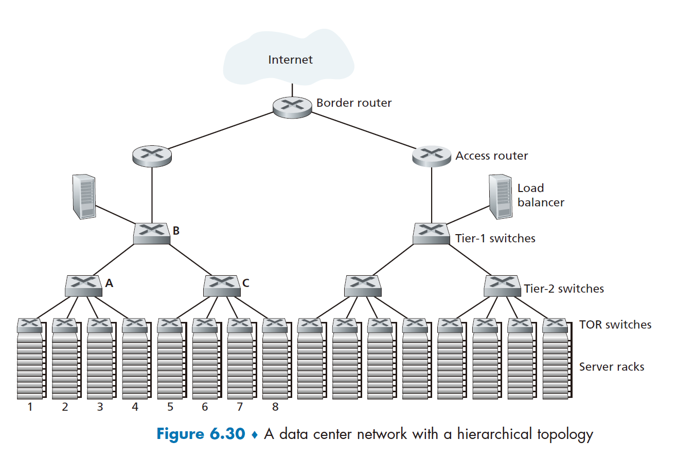

1. **负载均衡**

一个云数据中心，如一个谷歌或者微软的数据中心，能够同时提供诸如搜索、电子邮 件和视频应用等许多应用。为了支持来自外部客户的请求，每一个应用都与一个公开可见 的 IP 地址关联，外部用户向该地址发送其请求并从该地址接收响应。在数据中心内部，外部请求首先被定向到一个负载均衡器（load balancer）。负载均衡器的任务是向主机分发 请求，以主机当前的负载作为函数来在主机之间均衡负载。一个大型的数据中心通常会有几台负载均衡器，每台服务于一组特定的云应用。由于负载均衡器基于分组的目的端口号（第四层）以及目的 IP 地址做决策，因此它们常被称为“第四层交换机”。一旦接收到一个对于特定应用程序的请求，负载均衡器将该请求分发到处理该应用的某一台主机上（该 主机可能再调用其他主机的服务来协助处理该请求）。当主机处理完该请求后，向负载均衡器回送响应，再由负载均衡器将其中继发回给外部客户。负载均衡器不仅平衡主机间的工作负载，而且还提供类似 NAT 的功能，将外部 IP 地址转换为内部适当主机的 IP 地址，然后将反方向流向客户的分组按照相反的转换进行处理。这防止客户直接接触主机，从而具有隐藏网络内部结构和防止客户直接与主机交互等安全性益处。

2. **等级体系结构**

对于仅有数千台主机的小型数据中心，一个简单的网络也许就足够了。这种简单网络 由一台边界路由器、一台负载均衡器和几十个机架组成，这些机架由单一以太网交换机进 行互联。但是当主机规模扩展到几万至几十万的时候，数据中心通常应用 **路由器和交换机等级结构（hierarchy of router and switch）**，图 6-30 显示了这样的拓扑。在该等级结构的顶 端，边界路由器与接入路由器相连（在图 6・30 中仅仅显示了两台，但是能够有更多）。在 每台接入路由器下面，有 3 层交换机。每台接入路由器与一台第一层交换机相连，每台第 一层交换机与多台第二层交换机以及一台负载均衡器相连。每台第二层交换机又通过机架 的 TOR 交换机（第三层交换机）与多个机架相连。所有链路通常使用以太网作为链路层和物理层协议，并混合使用铜缆和光缆。通过这种等级式设计，可以将数据中心扩展到几 十万台主机的规模。

因为云应用提供商持续地提供高可用性的应用是至关重要的，所以数据中心在它们的 设计中也包含了冗余网络设备和冗余链路（在图 6-30 中没有显示出来）。例如，每台 TOR 交换机能够与两台第二层交换机相连，每台接入路由器、第一层交换机和第二层交换机可 以冗余并集成到设计中[Cisco 2012； Greenberg 2009b] 。在图 6-30 中的等级设计可以看 到，每台接入路由器下的这些主机构成了单一子网。为了使 ARP 广播流量本地化，这些 子网的每个都被进一步划分为更小的 VLAN 子网，每个由数百台主机组成[Greenberg 2009a]。

尽管刚才描述的传统的等级体系结构解决了扩展性问题，但是依然存在主机到主机容 量受限的问题[Greenberg 2009b] o 为了理解这种限制，重新考虑图 6-30,并且假设每台 主机用 1 Gbps 链路连接到它的 TOR 交换机，而交换机间的链路是 lOGbps 的以太网链路, 在相同机架中的两台主机总是能够以 lGbps 全速通信，而只受限于主机网络接口卡的速 率。然而，如果在数据中心网络中同时存在多条并发流，则不同机架上的两台主机间的最 大速率会小得多。为了深入理解这个问题，考虑不同机架上的 40 对不同主机间的 40 条并 发流的情况。具体来说，假设图 6・30 中机架 1 上 10 台主机都向机架 5 上对应的主机发送 一条流。类似地，在机架 2 和机架 6 的主机对上有 10 条并发流，机架 3 和机架 7 间有 10 条并发流，机架 4 和机架 8 间也有 10 条并发流。如果每一条流和其他流经同一条链路的 流平均地共享链路容量，则经过 lOGbps 的 A 到 B 链路（以及 lOGbps 的 B 到 C 链路）的 40 条流中每条流获得的速率为 10Gbps/40 = 250Mbps,显著小于 lGbps 的网络接口卡速率。 如果主机间的流量需要穿过该等级结构的更高层，这个问题会变得更加严重。对这个限制 的一种可行的解决方案是部署更高速率的交换机和路由器。但是这会大大增加数据中心的 费用，因为具有高接口速率的交换机和路由器是非常昂贵的。

因为数据中心的一个关键需求是放置计算和服务的灵活性，所以支持主机到主机的高 带宽通信十分重要[Gieenberg 200b； Farrington 2010] 。例如，一个大规模的因特网搜索 引擎可能运行在跨越多个机架的上千台主机上，在所有主机对之间具有极高的带宽要求。 类似地，像 EC2 这样的云计算服务可能希望将构成用户服务的多台虚拟机运行在具有最大 容量的物理主机上，而无须考虑它们在数据中心的位置。如果这些物理主机跨越了多个机 架，前面描述的网络瓶颈可能会导致性能不佳。

3. **数据中心网络的发展趋势**

为了降低数据中心的费用，同时提高其在时延和吞吐量上的性能，因特网云服务巨头如谷歌、脸书、亚马逊和微软都在不断地部署新的数据中心网络设计方案。尽管这些设计方案都是专有的，但是许多重要的趋势是一样的。

其中的一个趋势是部署能够克服传统等级设计缺陷的新型互联体系结构和网络协议。 一种方法是采用全连接拓扑（fully connected topology）来替代交换机和路由器的等级结构 [Facebook 2014； Al-Fares 2008 ； Greenberg 2009b； Guo 2009],图 6-31 中显示了这种拓 扑。在这种设计中，每台第一层交换机都与所有第二层交换机相连，因此：① 主机到主机 的流量绝不会超过该交换机层次；② 对于 x 台第一层交换机，在任意两台二层交换机间有 几条不相交的路径。这种设计可以显著地改善主机到主机的容量。为了理解该问题，重新 考虑 40 条流的例子。图 6・31 中的拓扑能够处理这种流模式，因为在第 1 台第二层交换机和第 2 台第二层交换机间存在 4 条不相交的路径，可以一起为前两台第二层交换机之间提供总和为 40 Gbps 的聚合容量。这种设计不仅减轻了主机到主机的容量限制，同时创建了一种更加灵活的计算和服务环境。在这种环境中，任何未连接到同一台交换机的两个机架之间的通信在逻辑上是等价的，而不论其在数据中心的位置如何。

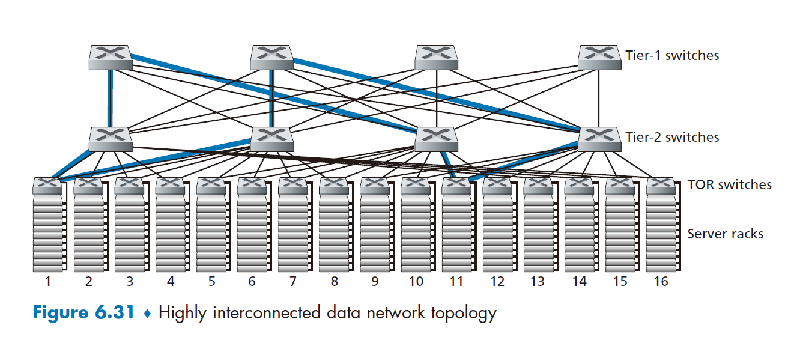

另外一个主要的趋势就是采用基于船运集装箱的 **模块化数据中心（ Modular Data Center, MDC）** ［You Tube 2009； Waldrop 2007 ］。在一个 MDC 中，在一个标准的 12 米船 运集装箱内，工厂构建一个“迷你数据中心”并将该集装箱运送到数据中心的位置。每一个集装箱都有多达数千台主机，堆放在数十台机架上，并且紧密地排列在一起。在数 据中心位置，多个集装箱彼此互联，同时也和因特网连接。一旦预制的集装箱部署在数 据中心，通常难以检修。因此，每一个集装箱都得体地设计为性能下降：当组件（服务 器和交换机）随着时间的推移出现故障时，集装箱继续运行但是性能下降。当许多组件 岀现故障并且性能已经下降到低于某个阈值时，整个集装箱将会被移除，并用新的来 替换。

创建由集装箱构成的数据中心提出了新的联网挑战。对于 MDC,有两种类型的网络： 每一个集装箱中的内部网络和互联每个集装箱的核心网络［Guo 2009； FaiTington 2010］ o 在每个集装箱内部，在规模上升到数千台主机的时候，通过廉价的商用吉比特以太网交换 机创建全连接的网络（如前面所描述）是可行的。然而，核心网络的设计仍然是一个带有 挑战性的问题，这需要能互联成百上千的集装箱，同时能够为典型工作负载提供跨多个集 装箱的主机到主机间的高带宽。［Farrington 2010］中提出了一种互联集装箱的混合电/光 交换机体系结构。

当采用高度互联拓扑的时候，一个主要的问题是设计交换机之间的路由选择算法。一 种可能是采用随机路由选择方式［Greenberg 2009b］。另一种可能是在每台主机中部署多 块网络接口卡［Guo 2009］,将每台主机连接到多台低成本的商用交换机上，并且允许主 机自己在交换机间智能地为流量选路。这些方案的变种和扩展正被部署在当前的数据中
心中。

另一种重要趋势是，大型云提供商正在其数据中心越来越多地建造或定制几乎所有东西，包括网络适配器、交换机路由器、TOR、软件和网络协议［Greenberg 2015 ； Singh 2015]。由亚马逊开创的另一个趋势是，用“可用性区域”来改善可靠性，这种技术在不同的邻近建筑物中基本上复制不同的数据中心。通过让建筑物邻近（几千米远），互相交互的数据能够跨越位于相同可用性区域的数据中心进行同步，与此同时提供容错性［Anazon 2014］。数据中心设计会不断出现更多的创新，感兴趣的读者可以查看近期的论文和有关数据中心设计的视频。

## 6.7. 回顾：Web 页面请求的历程

既然我们已经在本章中学过了链路层，并且在前面几章中学过了网络层、运输层和应用层，那么我们沿协议栈向下的旅程就完成了！在本书的一开始（1-1 节），我们说过 “本书的大部分内容与计算机网络协议有关”，在本章中，我们无疑已经看到了情况的确如此！在继续学习本书第二部分中时下关注的章节之前，通过对已经学过的协议做一个综合的、全面的展望，我们希望总结一下沿协议栈向下的旅程。而做这个“全面的”展望的一种方法是识别许多（许多！）协议，这些协议涉及满足甚至最简单的请求：下载一个 Web 页面。图 6-32 图示了我们的场景：一名学生 Bob 将他的便携机与学校的以太网交换机相 连，下载一个 Web 页面（比如说www.google.com主页）。如我们所知，为满足这个看起来简单的请求，背后隐藏了许多细节。本章后面的Wireshark实验仔细检查了包含一些分组的踪迹文件，这些分组更为详细地涉及类似的场景。

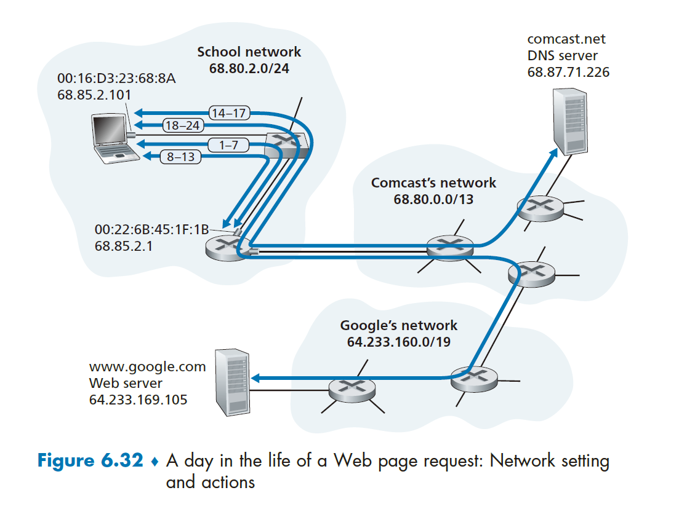

### 6.7.1. 准备：DHCP. UDP、IP 和以太网

我们假定 Bob 启动他的便携机，然后将其用一根以太网电缆连接到学校的以太网交换机，交换机又与学校的路由器相连，如图 6-32 所示。学校的这台路由器与一个 ISP 连接, 本例中 ISP 为 comcast.net。在本例中，comcast.net 为学校提供了 DNS 服务；所以，DNS 服务器驻留在 Comcast 网络中而不是学校网络中。我们将假设 DHCP 服务器运行在路由器中，就像常见情况那样。

当 Bob 首先将其便携机与网络连接时，没有 IP 地址他就不能做任何事情（例如下载一个 Web 网页）。所以，Bob 的便携机所采取的一个网络相关的动作是运行 DHCP 协议, 以从本地 DHCP 服务器获得一个 IP 地址以及其他信息。

1. Bob 便携机上的操作系统生成一个 DHCP 请求报文（4-3-3 节），并将这个报文放入具有目的端口 67 （DHCP 服务器）和源端口 68 （DHCP 客户）的 UDP 报文段（3-3 节）该 UDP 报文段则被放置在一个具有广播 IP 目的地址（255.255.255.255）和源 IP 地址 0.0.0.0 的 IP 数据报中（4-3-1 节），因为 Bob 的便携机还没有一个 IP 地址。
2. 包含 DHCP 请求报文的 IP 数据报则被放置在以太网帧中（6-4-2 节）。该以太网 帧具有目的 MAC 地址 FF-FF-FF-FF-FF-FF，使该帧将广播到与交换机连接的所有设备 （如果顺利的话也包括 DHCP 服务器）；该帧的源 MAC 地址是 Boh 便携机的 MAC 地址 00-16-D3-23-68-8A。
3. 包含 DHCP 请求的广播以太网帧是第一个由 Bob 便携机发送到以太网交换机的帧。该交换机在所有的出端口广播入帧，包括连接到路由器的端口。
4. 路由器在它的具有 MAC 地址 00-22-64-45-1F 的接口接收到该广播以太网帧，该帧中包含 DHCP 请求，并且从该以太网帧中抽取出 IP 数据报。该数据报的广播 IP 目的地址指示了这个 IP 数据报应当由在该节点的高层协议处理，因此该数据报的载荷（一个 UDP 报文段）被分解（3-2 节）向上到达 UDP，DHCP 请求报文从此 UDP 报文段中抽取出来。此时 DHCP 服务器有了 DHCP 请求报文。
5. 我们假设运行在路由器中的 DHCP 服务器能够以 CIDR（4-3-3 节）块 68.85.2.0/24 分配 IP 地址。所以本例中，在学校内使用的所有 IP 地址都在 Comcast 的地址块中。我们假设 DHCP 服务器分配地址 68.85.2.101 给 Bob 的便携机。DHCP 服务器生成包含这个 IP 地址以及 DNS 服务器的 IP 地址（68.87.71.226）、默认网关路由器的 IP 地址（68.85.2.1）和子网块（68.85.2.0/24）（等价为“网络掩码”）的一个 DHCP ACK 报文（4-3-3 节）。该 DHCP 报文被放入一个 UDP 报文段中，UDP 报文段被放入一个 IP 数据报中，IP 数据报再被放入一个以太网帧中。这个以太网帧的源 MAC 地址是路由器连到归属网络时接口的 MAC 地址（00-22-6B-45-1F-1B）,目的 MAC 地址是 Bob 便携机的 MAC 地址（00-16-D3-23-68-8A）。
6. 包含 DHCP ACK 的以太网帧由路由器发送给交换机。因为交换机是自学习的（6-4-3 节），并且先前从 Bob 便携机收到（包含 DHCP 请求的）以太网帧，所以该交换机 知道寻址到 00-16-D3-23-68-8A 的帧仅从通向 Bob 便携机的输岀端口转发。
7. Bob 便携机接收到包含 DHCP ACK 的以太网帧，从该以太网帧中抽取 IP 数据报, 从 IP 数据报中抽取 UDP 报文段，从 UDP 报文段抽取 DHCP ACK 报文。Bob 的 DHCP 客户 则记录下它的 IP 地址和它的 DNS 服务器的 IP 地址。它还在其 IP 转发表中安装默认网关的地址（4-1 节）。Bob 便携机将向该默认网关发送目的地址为其子网 68.85.2.0/24 以外的所有数据报。此时，Bob 便携机已经初始化好它的网络组件，并准备开始处理 Web 网页获取。（注意到在第 4 章给出的四个步骤中仅有最后两个 DHCP 步骤是实际必要的。）

### 6.7.2. 仍在准备：DNS 和 ARP

当 Bob 将www.google.com的URL键入其Web浏览器时，他开启了一长串事件，这将 导致谷歌主页最终显示在其 Web 浏览器上。Bob 的 Web 浏览器通过生成一个 TCP 套接字（2-7 节）开始了该过程，套接字用于向www.google.com发送HTTP请求（2-2节）。为了生成该套接字，Bob便携机将需要知道www.google.com的IP地址。我们在2-4节中学过，使用DNS协议提供这种名字到IP地址的转换服务。

8. Bob 便携机上的操作系统因此生成一个 DNS 查询报文（2-4-3 节），将字符串 www.google.com放入DNS报文的问题段中。该DNS报文则放置在一个具有53号（DNS服务器）目的端口的UDP报文段中。该UDP报文段则被放入具有IP目的地址68.87.71.226 （在第 5 步中 DHCP ACK 返回的 DNS 服务器地址）和源 IP 地址 68.85.2.101 的 IP 数据报中。
9. Bob 便携机则将包含 DNS 请求报文的数据报放入一个以太网帧中。该帧将发送（在链路层寻址）到 Bob 学校网络中的网关路由器。然而，即使 Bob 便携机经过上述第 5 步中的 DHCP ACK 报文知道了学校网关路由器的 IP 地址（68.85.2.1），但仍不知道该网关路由器的 MAC 地址。为了获得该网关路由器的 MAC 地址，Bob 便携机将需要使用 ARP 协议（6-4-1 节）。
10. Bob 便携机生成一个具有目的 IP 地址 68.85.2.1（默认网关）的 ARP 查询报文，将该 ARP 报文放置在一个具有广播目的地址（FF-FF-FF-FF-FF-FF）的以太网帧中，并向交换机发送该以太网帧，交换机将该帧交付给所有连接的设备，包括网关路由器。
11. 网关路由器在通往学校网络的接口上接收到包含该 ARP 查询报文的帧，发现在 ARP 报文中目标 IP 地址 68.85.2.1 匹配其接口的 IP 地址。网关路由器因此准备一个 ARP 回答，指示它的 MAC 地址 00-22-6B-45-1F-1B 对应 IP 地址 68.85.2.1 。它将 ARP 回答放在一个以太网帧中，其目的地址为 00-16-D3-23-68-8A （Bob 便携机），并向交换机发送该帧，再由交换机将帧交付给 Bob 便携机。
12. Bob 便携机接收包含 ARP 回答报文的帧，并从 ARP 回答报文中抽取网关路由器的 MAC 地址（00-22-6B-45-1F-1B）。
13. Boh 便携机现在（最终！）能够使包含 DNS 查询的以太网帧寻址到网关路由器的 MAC 地址。注意到在该帧中的 IP 数据报具有 IP 目的地址 68.87.71.226（DNS 服务器），而该帧具有目的地址 00-22-6B-45-1F-1B（网关路由器）。Bob 便携机向交换机发送该帧，交换机将该帧交付给网关路由器。

### 6.7.3. 仍在准备：域内路由选择到 DNS 服务器

14. 网关路由器接收该帧并抽取包含 DNS 查询的 IP 数据报。路由器查找该数据报的 目的地址（68.87.71.226）,并根据其转发表决定该数据报应当发送到图 6-32 的 comcast 网络中最左边的路由器。IP 数据报放置在链路层帧中，该链路适合将学校路由器连接到最左边 Comcast 路由器，并且该帧经这条链路发送。
15. 在 Comcast 网络中最左边的路由器接收到该帧，抽取 IP 数据报，检查该数据报的目的地址（68.87.71.226），并根据其转发表确定出接口，经过该接口朝着 DNS 服务器转发数据报，而转发表已根据 comcast 的域内协议（如 RIP、OSPF 或 IS-IS, 5-3 节）以及因 特网的域间协议 BGP（5-4 节）所填写。
16. 最终包含 DNS 查询的 IP 数据报到达了 DNS 服务器。DNS 服务器抽取出 DNS 查询报文，在它的 DNS 数据库中查找名字 www.google.com（ 2-4 节），找到包含对应 www.google.com 的 IP 地址（64.233.169.105）的 DNS 源记录。（假设它当前缓存在 DNS 服务器中。）前面讲过这种缓存数据源于 google.com 的权威 DNS 服务器（2-4-2 节）。该 DNS 服务器形成了一个包含这种主机名到 IP 地址映射的 DNS 回答报文，将该 DNS 回答报文放入 UDP 报文段中，该报文段放入寻址到 Bob 便携机（68.85.2.101）的 IP 数据报中。该数据报将通过 Comcast 网络反向转发到学校的路由器，并从这里经过以太网交换机到 Bob 便携机。
17. Bob 便携机从 DNS 报文抽取出服务器 www.google.com 的 IP 地址。最终，在大量工作后，Bob 便携机此时准备接触 www.google.com 服务器！

### 6.7.4. Web 客户-服务器交互:TCP 和 HTTP

18. 既然 Bob 便携机有了 www.google.com的IP地址，它能够生成TCP套接字（2-7 节），该套接字将用于向www.google.com发送HTTP GET 报文（2-2-3 节）。当 Bob 生成 TCP 套接字时，在 Bob 便携机中的 TCP 必须首先与www.google.com中的TCP执行三次握手（3-5-6节）。Bob便携机因此首先生成一个具有目的端口 80 （针对 HTTP 的）的 TCP SYN 报文段，将该 TCP 报文段放置在具有目的 IP 地址 64.233.169.105（www.google.com）的IP 数据报中，将该数据报放置在 MAC 地址为 00-22-6B-45-1F-1B（网关路由器）的帧中，并向交换机发送该帧。
19. 在学校网络、Comcast 网络和谷歌网络中的路由器朝着 www.google.com 转发包含 TCP SYN 的数据报，使用每台路由器中的转发表，如前面步骤 14-16 那样。前面讲过支配分组经 Comcast 和谷歌网络之间域间链路转发的路由器转发表项，是由 BGP 协议决定的（第 5 章）。
20. 最终，包含 TCP SYN 的数据报到达 www.googole.com。从数据报抽取出TCP SYN 报文并分解到与端口 80 相联系的欢迎套接字。对于谷歌 HTTP 服务器和 Bob 便携机之间 的 TCP 连接生成一个连接套接字（2-7 节）。产生一个 TCP SYNACK （3-5-6 节）报文段, 将其放入向 Bob 便携机寻址的一个数据报中，最后放入链路层帧中，该链路适合将 www.google.com 连接到其第一跳路由器。
21. 包含 TCP SYNACK 报文段的数据报通过谷歌、Comcast 和学校网络，最终到达 Bob 便携机的以太网卡。数据报在操作系统中分解到步骤 18 生成的 TCP 套接字，从而进入连接状态。
22. 借助于 Bob 便携机上的套接字，现在（终于！）准备向 www.google.com 发送字节。Bob 的浏览器生成包含要获取的 URL 的 HTTP GET 报文（2-2-3 节）。HTTP GET 报文则写入套接字，其中 GET 报文成为一个 TCP 报文段的载荷。该 TCP 报文段放置进一个数据报中，并交付到 www.google.com，如前面步骤18-20所述。
23. 在www.google.com的HTTP服务器从TCP套接字读取HTTP GET 报文，生成一个 HTTP 响应报文（2-2 节），将请求的 Web 页内容放入 HTTP 响应体中，并将报文发送进 TCP 套接字中。
24. 包含 HTTP 回答报文的数据报通过谷歌、Comcast 和学校网络转发，到达 Bob 便携机。Bob 的 Web 浏览器程序从套接字读取 HTTP 响应，从 HTTP 响应体中抽取 Web 网页的 html，并最终（终于！）显示了 Web 网页。

上面的场景已经涉及许多网络基础！如果你已经理解上面例子中的大多数或全部，则你也已经涵盖了许多基础知识，因为前面已经学过 1-1 节，其中我们谈道“本书的大部分内容与计算机网络协议有关”，并且你也许想知道一个协议实际是什么样子！上述例子看起来是尽可能详尽，我们已经忽略了一些可能的附加协议（例如，运行在学校网关路由器中的 NAT，到学校网络的无线接入，接入学校网络或对报文段或数据报加密的安全协议，网络管理协议），以及人们将会在公共因特网中遇到的一些考虑（Web 缓存，DNS 等级体系）。我们将在本书的第二部分涉及一些这类主题和更多内容。

最后，我们注意到上述例子是一个综合、完整的例子，还观察了本书第一部分所学习过的许多协议的十分“具体的细节”。该例子更多地关注“怎样做”而不是“为什么做”。

对于想开阔视野的读者来说，有关网络协议设计更为深思熟虑的一般观点可参见[Clark1988；RFC 5218］。

## 6.8. 实验 10：通过 wireshark 观察以太网协议和 ARP

在这次实验中，我们将观察以太网协议和 ARP 协议。在开始实验之前，你可能要回顾一下[第 6-4-1 节](#641-链路层寻址和-arp)和[第 6-4-2 节](#642-以太网)。[RFC 826](https://datatracker.ietf.org/doc/html/rfc826) 提供了对 ARP 的细节。

### 6.8.1. 以太网协议

我们先捕获一些以太网帧用于学习，首先你要确保你的电脑通过以太网获得 Internet 连接。执行以下步骤：

1. 清空你选择的浏览器的缓存。chrome 浏览器可以通过快捷键 ctrl+shift+del，在弹出的对话框中点击“clear data”。打开 wireshark 选择以太网接口开启捕获。
2. 在浏览器内键入 http://gaia.cs.umass.edu/wireshark-labs/HTTP-ethereal-lab-file3.html ，你的浏览器应该显示的是 “THE BILL OF RIGHTS”。
3. 停止捕获。找到 HTTP GET 的那条分组，结果如下图所示。


在下方的分组详情框中，展开“Ethernet II”，即可查看对应的以太网帧。

回答以下问题：

1. 你电脑的 48 位以太网地址是多少？

34:29:8f:99:a3:b3

2. 这个以太网帧的目的地址是多少？是 gaia.cs.umass.edu 的以太网地址吗？如果不是，那么这个是什么设备的以太网地址？

08:b2:58:ee:22:c6，不是，是网关路由器的接口的以太网地址。

3. 这个以太网帧的类型字段的值是多少？对应的上层协议是什么？

0x8864，PPPoE

现在，找到这个 HHTP GET 的响应报文，回答问题：

1. 这个分组以太网帧中的源地址为多少？是 gaia.cs.umass.edu 的以太网地址吗？如果不是，那么这个是什么设备的以太网地址？

08:b2:58:ee:22:c6，不是，是网关路由器的接口的以太网地址。

2. 这个以太网帧的目的地址是多少？是你电脑的地址吗？

34:29:8f:99:a3:b3，是

3. 这个以太网帧的类型字段的值是多少？对应的上层协议是什么？

0x8864，PPPoE

### 6.8.2. ARP

我们现在来观察一下 ARP。我们推荐你回顾一下[6-4-1 节](#641-链路层寻址和-arp)。

我们知道 ARP 一般会缓存 IP-MAC 地址对。`arp` 系列命令用于查看和操作这些个映射表。

我们先来查看一下你电脑中缓存的表，使用 `arp -a` 命令。

# 7. 无线和移动网络

在电话通讯的世界，过去的 25 年是蜂窝电话通讯的黄金时代。在世界范围上，使用移动蜂窝网络的用户从 1993 的 240 万增加到 2019 年的 83 亿。这个数字甚至超过了世界总人口数（2019 年为 76.74 亿）。移动电话的优势是显而易见的：任何地点，任何时间，不受约束地通过一个高度轻便的设备接入全球电话网。近来，智能手机，平板电脑，和笔记本已经通过蜂窝网络或 WiFi 网络无线地接入 Internet。并且，类似于游戏手柄，温度控制器，家庭安保系统，家用智能电器，智能手表，智能眼睛，汽车，交通控制系统等正逐渐无线接入 Internet。

从计算机网络的观点来看，这些无线和移动设备引发的挑战，特别是在数据链路层和网络层，与传统的有线网络的差别非常大，适合用单独一章（即本章）的篇幅来专门讨论无线网络和移动网络。

我们这章将以讨论移动用户，无线链路及网络和他们所连接的更大的有线网络之间的关系开始。我们将明确区分无线网络的无线性和移动性。分清这两个特性将有助于我们隔离，识别，和掌握在这两个区域的关键概念。

我们将以对无线基础设施和相关术语的概览开始。之后，我们将考虑 7-2 节中无线链路的特征。我们在这一节涉及一个简短的对 **码分多址接入技术(Code Division Multiple Access, CDMA)** 的介绍，这是一种常被用于无线网络的共享媒体的接入技术。在 7-3 节，我们深度学习 IEEE 802.11(WiFi) 无线局域网标准的链路层的一些方面。同时我们还将对蓝牙和其他无线个人域网络做简要描述。在 7-4 节，我们提供一个对蜂窝网络接入，包扩 4G 和兴起的 5G 蜂窝网络技术的一个概览，5G 蜂窝网络技术同时提供语音和高速的 Internet 接入。在 7-5 节，我们将注意力转向移动性，关注于移动用户的定位问题、对移动用户的路由选择以及“切换”（handing over）移动用户（即在网络中从一个接入点动态地移动到另一点的用户）等问题。在 7-6 节和 7-7 节中，我们将分别考察如何在企业 802.11 网络和 LTE 蜂窝网络中用移动 IP 标准实现这些移动服务。最后，我们将在 7-8 节中考虑无线链路和移动性对运输层协议和网络应用程序的影响。

## 7.1. 介绍

图 7-1 显示了我们将要讨论无线数据通信和移动性主题的环境。为使讨论具有一般性以覆盖各种各样的网络，将包括像 IEEE 802.11 这样的无线局域网和像 4G，5G 网络这样的蜂窝网络来开始我们的讨论；然后在后续各节中，我们将对特定的无线体系结构进行更加详细的讨论。我们能够看到无线网络的下列要素：

- **无线主机**。如同在有线网络中一样，主机是运行应用程序的端系统设备。**无线主机(wireless host)** 可以是智能手机，平板电脑，或笔记本，或者它可能是类似于传感器，智能家电，自动驾驶汽车，或者其他接入互联网的混合设备。 主机本身可能移动，也可能不移动。
- **无线链路**。主机通过 **无线通信链路(wireless communication link)** 连接到一个基站（定义见下文）或者另一台无线主机。不同的无线链路技术具有不同的传输速率和能够传输不同的距离。图 7-2 显示了较为流行的无线链路标准的两种主要特性（覆盖区域和链路速率）。（该图仅表示了提供这些特性的大致概念。例如，这些类型中的某些网络现在只是在部署，某些链路速率取决于距离、信道条件和在无线网络中的用户数量，能够比显 示的值更高或更低些。）我们将在本章的前半部分讨论这些标准。在 7-2 节中，我们也考虑其他无线链路特性（如它们的比特差错率及其原因）。

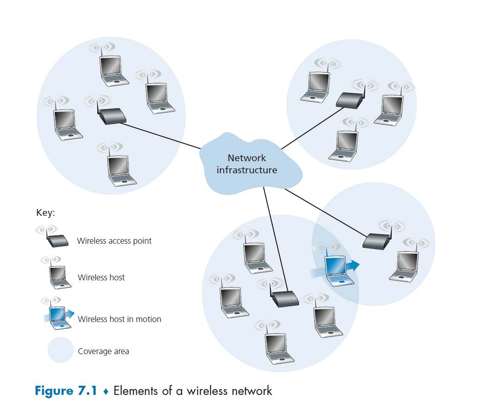

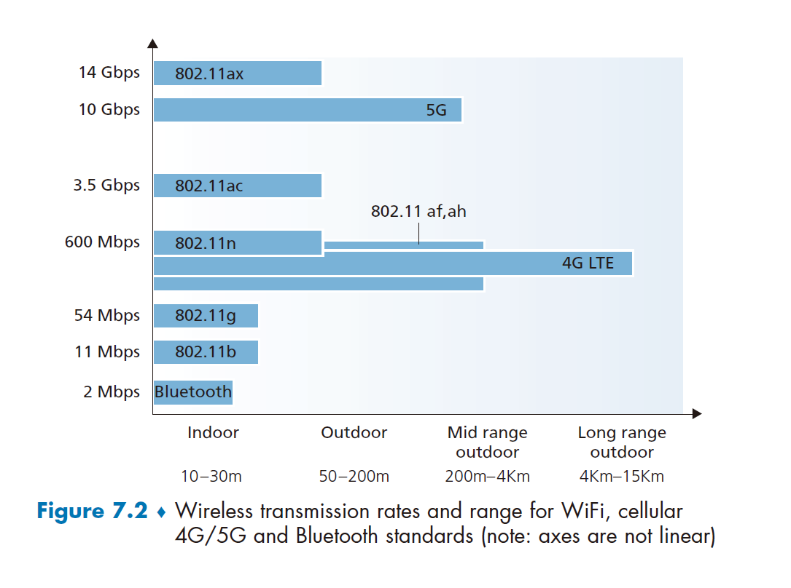

在图 7-1 中，无线链路将位于网络边缘的主机连接到更大的网络基础设施中。我们要马上补充的是，无线链路有时同样应用在一个网络中以连接路由器、交换机和其他网络设备。然而，在本章中我们关注的焦点是无线通信在网络边缘的应用，因为许多最为振奋人心的技术挑战和多数增长就发生在这里。

- **基站**。**基站(base station)** 是无线网络基础设施的一个关键部分。与无线主机和无线链路不同，基站在有线网络中没有明确的对应设备。它负责向与之关联的无线主机发送数据和从主机那里接收数据（例如分组）。基站通常负责协调与之相关联的多个无线主机的传输。当我们说一台无线主机与某基站“相关联”时，则是指：1. 该主机位于该基站的无线通信覆盖范围内；2. 该主机使用该基站中继它（该主机）和更大网络之间的数据。蜂窝网络中的 **蜂窝塔(cell tower)** 和 802.11 无线 LAN 中的 **接入点(access point)** 都是基站的例子。

在图 7-1 中，基站与更大网络相连（如因特网、公司或家庭网、电话网），因此这种连接在无线主机和与之通信的其他部分之间起着链路层中继的作用。

与基站关联的主机通常被称为以 **基础设施模式(infrastructure mode)** 运行，因为所有传统的网络服务（如地址分配和路由选择）都由网络向通过基站相连的主机提供。在 **自组织网络(ad hoc network)** 中，无线主机没有这样的基础设施与之相连。在没有这样的基础设施的情况下，主机本身必须提供诸如路由选择、地址分配、类似于 DNS 的名字转换等服务。

当一台移动主机的移动超出一个基站的覆盖范围而到达另一个基站的覆盖范围后，它将改变其接入到更大网络的连接点（即改变与之相关联的基站），这一过程称作 **切换(handoff，或 handover)**。这种移动性引发了许多具有挑战性的问题。如果一台主机可以移动，那么如何找到它在网络中的当前位置，从而使得数据可以向该移动主机转发？如果一台主机可以位于许多可能位置中的一个，那么如何进行编址？如果主机在一个 TCP 连接或者电话呼叫期间移动，数据如何路由选择而使连接保持不中断？这些以及许多（许多！）其他问题使得 无线网络和移动网络成为一个让人振奋的网络研究领域。

- **网络基础设施**。这是无线主机希望与之进行通信的更大网络。

在讨论完无线网络的构件以后，我们注意到这些构件能够以多种不同方式组合以形成不同类型的无线网络。当阅读本章，或阅读/学习本书之外的更多有关无线网络的内容时, 你可能发现对这些无线网络类型进行分类的方法是有用的。在最高层次，我们能够根据两个准则来对无线网络分类：1. 在该无线网络中的分组是否跨越了一个无线跳或多个无线跳；2. 网络中是否有诸如基站这样的基础设施。

- **单跳，基于基础设施**。这些网络具有与较大的有线网络（如因特网）连接的基站。此外，该基站与无线主机之间的所有通信都经过一个无线跳。你在教室、咖啡屋 或图书馆中所使用的 802.11 网络，以及我们将很快学习的 4G LTE 数据网络都属于这种类型。我们日常的绝大部分时间是在与单跳、基于基础设施的无线网络打交道。
- **单跳，无基础设施**。在这些网络中，不存在与无线网络相连的基站。然而，如我们将要见到的那样，在这种单跳网络中的一个节点可以协调其他节点的传输。蓝牙网络（该网络连接诸如键盘、扬声器和戴在头上的耳机等小型无线设备，我们将在 7-3-6 节中学习）和具有自组织模式的 802.11 网络是单跳、无基础设施的网络。
- **多跳，基于基础设施**。在这些网络中，一个基站表现为以有线方式与较大网络相连。然而，某种无线节点为了经该基站通信，可能不得不通过其他无线节点中继它们的通信。某些无线传感网络和所谓 **无线网状网络(wireless mesh network)** 就属于这种类型。
- **多跳，无基础设施**。在这些网络中没有基站，并且节点为了到达目的地可能必须在几个其他无线节点之间中继报文。节点也可能是移动的，在多个节点中改变连接关系，一类网络被称为 **移动自组织网络(mobile ad hoc network, MANET)**。如果该移动节点是车载的，该网络是 **车载自组织网络(vehicular ad hoc network, VANET)**。如你可能想象的那样，为这种网络开发协议是一种挑战，这是许多进行中的研究主题。

在本章中，我们将把主要学习内容限制在单跳网络，并且大多数是基于基础设施的网络。

现在我们更深一步地研究无线网络和移动网络面对的挑战。我们将首先讨论单独的无线链路，而在本章稍后部分讨论移动性。

## 7.2. 无线链路和网络特征

无线链路在多个方面不同于有线链路：

- **递减的信号强度**。电磁波在穿过物体（如无线电信号穿过墙壁）时强度将减弱。即使在自由空间中，信号仍将扩散，这使得信号强度随着发送方和接收方距离的增加而减弱（有时称其为 **路径损耗(path loss)** ）。
- **来自其他源的干扰**。在同一个频段发送信号的电波源将相互干扰。例如，2.4GHz 无线电话和 802.11b 无线 LAN 在相同的频段中传输。因此，802.11b 无线 LAN 用户若同时利用 2.4GHz 无线电话通信，将会导致网络和电话都不会工作得特别好。除了来自发送源的干扰，环境中的电磁噪声（如附近的电动机、微波）也能形成干扰。
- **多径传播**。当电磁波的一部分受物体和地面反射，在发送方和接收方之间走了不同长度的路径，则会出现 **多径传播(multipath propagation)**。这使得接收方收到的信号变得模糊。位于发送方和接收方之间的移动物体可导致多径传播随时间而改变。

对于无线信道特征、模型和测量的详细讨论请参见[Anderson 1995; Almers 2007]。

上述讨论表明，无线链路中的比特差错将比有线链路中更为常见。因此，无线链路协议（如我们将在下面一节中讨论的 802.11 协议）不仅采用有效的 CRC 错误检测码，还采用了链路层 ARQ 协议来重传受损的帧。

考虑了在无线信道上可能出现的损伤后，我们将注意力转向接收无线信号的主机。该主机接收到一个电磁信号，而该信号是发送方传输的初始信号的退化形式和环境中的背景噪声的结合，其中的信号退化是由于衰减和我们前面讨论过的多路径传播以及其他一些因素所引起的。**信噪比(Signal-to-Noise Ratio, SNR)** 是所收到的信号（如被传输的信息）和噪声强度的相对测量。SNR 的度量单位通常是分贝（dB），有人认为这个主要由电气工程师所使用的度量单位会使计算机科学家迷惑不解。以 dB 度量的 SNR 是下列比值的 20 倍，即接收到的信号的振幅与噪声的振幅的以 10 为底的对数的比值。就我 们的讨论目的而言，我们仅需要知道较大的 SNR 使接收方更容易从背景噪声中提取传输的信号。

图 7-3（该图选自［Holland 2001］）显示了三种不同的调制技术的 **比特差错率(BER)**（大致说来，BER 是在接收方收到的有错传输比特的概率）与 SNR 之比，这些调制技术用于 对信息进行编码以在理想信道上传输。调制和 编码理论以及信号提取和 BER 都超出了本书的范围（对这些主题的讨论参见［Schwar 1980］）。尽管如此，图 7-3 显示了几种物理层的特征，这些特征对于理解较高层无线通信协议是重要的:

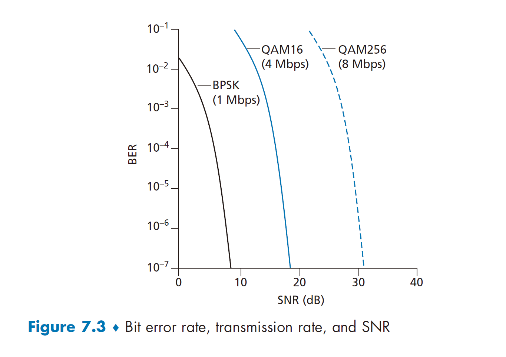

- 对于给定的调制方案，SNR 越高，BER 越低。由于发送方通过增加它的传输功率就能够增加 SNR，因此发送方能够通过增加它的传输功率来降低接收到差错帧的概率。然而，注意到当该功率超过某个阈值时，如 BER 从 10^-12 降低到 10^-13，可证明几乎不会有实际增益。增加传输功率也会伴随着一些缺点：发送方必须消耗更多的能量（对于用电池供电的移动用户，这一点非常重要），并且发送方的传输更可能干扰另一个发送方的传输（参见图 7-4b）。
- 对于给定的 SNR，图 7-4 隐藏终端问题和衰减具有较高比特传输率的调制技术（无论差错与否）将具有较高的 BER。例如在图 7-3 中，对于 10dB 的 SNR,具有 1Mbps 传输速率的 BPSK 调制具有小于 10^-7 的 BER，而具有 4Mbps 传输速率的 QAM 16 调制，BER 是 10^-1，该值太高而没有实际用处。然而，具有 20dB 的 SNR, QAM 16 调制具有 4Mbps 的传输速率和 10^-7 的 BER，而 BPSK 调制具有仅 1Mbps 的传输速率和一个低得“无法在图上表示”的 BER。如果人们能够容忍 10^-7 的 BER，在这种情况下由 QAM 16 提供的较高的传输速率将使它成为首选的调制技术。这些考虑引出了我们下面描述的最后一个特征。
- 物理层调制技术的动态选择能用于适配对信道条件的调制技术。SNR （因此 BER）可能因移动性或由于环境中的改变而变化。在蜂窝数据系统中以及在 802.11 WiFi，4G，5G 蜂窝数据网络中（我们将在 7-3 节和 7-4 节中学习）使用了自适应调制和编码。例如，这使得对于给定的信道特征选择一种调制技术，在受制于 BER 约束的前提下提供最高的可能传输速率。

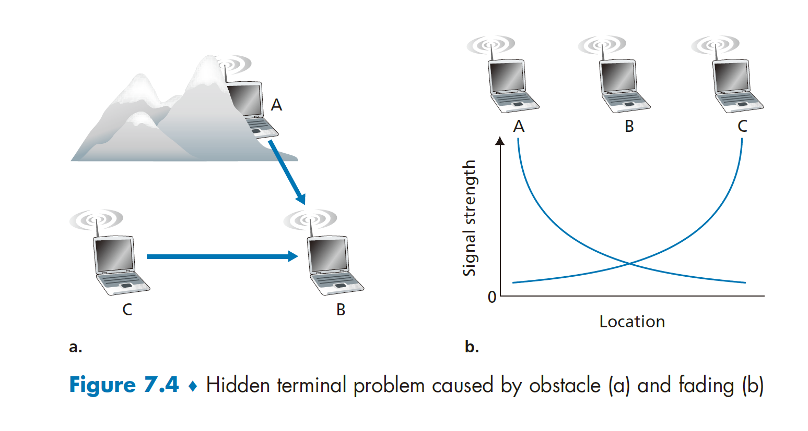

有线和无线链路之间的差异并非仅仅只有较高的、时变的误比特率这一项。前面讲 过在有线广播链路中所有节点能够接收到所有其他节点的传输。而在无线链路中，情况 并非如此简单。如图 7-4 所示，假设站点 A 正在向站点 B 发送，同时假定站点 C 也在向站点 B 传输。由于所谓的 **隐藏终端问题(hidden terminal problem)**，即使 A 和 C 的传输确实是在目的地 B 发生干扰，环境的物理阻挡（例如，一座大山或者一座建筑）也可能会妨碍 A 和 C 互相听到对方的传输。这种情况如图 7-4a 所示。第二种导致在接收方无法检测的碰撞情况是，当通过无线媒体传播时信号强度的 **衰减(fading)**。图 7-4b 图 示了这种情况，A 和 C 所处的位置使得它们的信号强度不足以使它们相互检测到对方的传输，然而它们的传输足以强到在站点 B 处相互干扰。正如我们将在 7-3 节看到的那样，隐藏终端问题和衰减使得多路访问在无线网络中的复杂性远高于在有线网络中的情况。

### 7.2.1. 码分多址(CDMA)

在第 6 章讲过，当不同主机使用一个共享媒体通信时，需要有一个协议来保证多个发送方发送的信号不在接收方互相干扰。在第 6 章中，我们描述了 3 类媒体访问协议：信道划分、随机访问和轮流。**码分多址(Code Division Multiple Access, CDMA)** 属于信道划分 协议族。它在无线 LAN 和蜂窝技术中应用很广泛。由于 CDMA 对无线领域十分重要，在后面小节中对具体的无线接入技术进行探讨以前，我们首先对其快速地浏览一下。

在 CDMA 协议中，要发送的每个比特都通过乘以一个信号(编码)的比特来进行编码，这个信号的变化速率(通常称为 **码片速率**，chipping rate)比初始数据比特序列的变化速率快得多。图 7-5 表示一个简单的、理想化的 CDMA 编码/解码情形。假设初始数据比特到达 CDMA 编码器的速率定义了时间单元；也就是说，每个要发送的初始数据比特需要 1 比特时隙时间。设第 $d_i$ 为第 i 个比特时隙中的数据比特值。为了数学上便利，我们把具有 0 值的数据比特表示为-1。每个比特时隙又进一步细分为 M 个微时隙；在图 7-5 中，M = 8，不过在实际中 M 的值要大得多。发送方使用的 CDMA 编码由 M 个值的一个序列 c(m) 组成，m = 1, ..., M, 每个取值为+1 或者-1。在图 7-5 的例子中，被发送方使用的 M 比特的 CDMA 码是 (1, 1, 1, -1, 1, -1, -1, -1)。

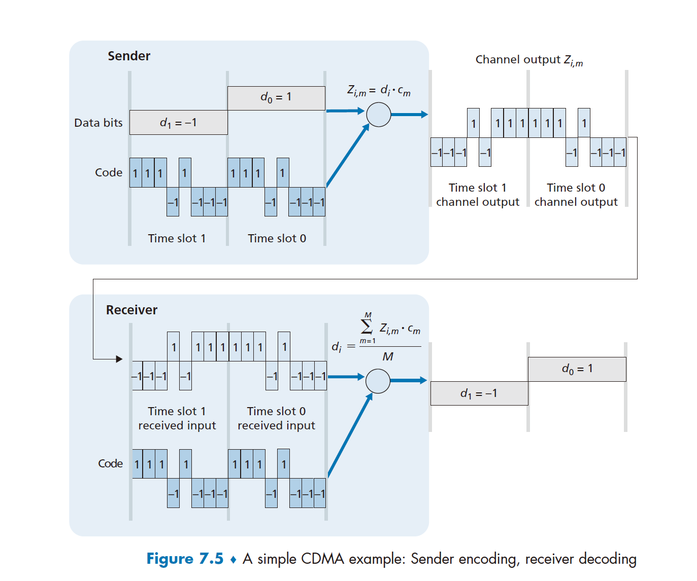

为了说明 CDMA 的工作原理，我们关注第 i 个数据比特 $d_i$。对于 $d_i$ 比特传输时间的第 m 个微时隙，CDMA 编码器的输出 $Z_{i,m}$ 是 $d_i$ 乘以分配的 CDMA 编码的第 m 比特 $c_m$：

$$Z_{i,m} = {d_i \cdot c_m} \tag{7-1式}$$

简单地说，对没有干扰的发送方，接收方将收到编码的比特 $Z_{i,m}$，并且恢复初始的数据比特 $d_i$，计算如下：

$$d_i = {{1 \over M} {\displaystyle \sum_{m=1}^{M} Z_{i,m}} \cdot c_m} \tag{7-2式}$$

读者可能想通过推敲图 7-5 所示例子的细节，来明白使用(7-2 式)在接收方确实正确恢复了初始数据比特。

然而，这个世界远不是理想化的，如上面所述，CDMA 必须在存在干扰发送方的情况下工作，这些发送方用分配的不同编码来编码和传输它们的数据。但是当一个发送方的数据比特和其他发送方发送的比特混在一起时，一个 CDMA 接收方怎样恢复该发送方的初始数据比特呢？ CDMA 的工作有一种假设，即对干扰的传输比特信号是加性的，这意味着, 例如在同一个微时隙中，如果 3 个发送端都发送 1，第 4 个发送端发送 -1，那么在那个微时隙中所有的接收方接收的信号都是 2 (因为 1+1+1-1 = 2)。在存在多个发送方时，发送方 s 计算它编码后的传输 $Z_{i,m}^s$ ，计算方式与上面式子中的第一个完全相同。然而在第 i 个比特时隙的第 m 个微时隙期间，接收方现在收到的值是在那个微时隙中从所有 N 个发送方传输的比特的总和：

$$Z_{i,m}^* = {\displaystyle \sum_{s=1}^{N} Z_{i,m}^s}$$

令人吃惊的是，如果仔细地选择发送方的编码，每个接收方只通过(7-2 式)中的同样的方式使用发送方的编码，就能够从聚合的信号中恢复一个给定的发送方发送的数据：

$$d_i = {{1 \over M} {\displaystyle \sum_{m=1}^M {Z_{i,m}^*} \cdot c_m}} \tag{7-3式}$$

如在图 7-6 中所示，描述了两个发送方的 CDMA 例子。上部的发送方使用的 M 比特 CDMA 编码是(1, 1, 1, -1, 1, -1, -1, -1)，而下部的发送方使用的 CDMA 编码是(1, -1, 1, 1, 1, -1, 1, 1)。图 7-6 描述了一个接收方恢复从上部发送方发送的初始数据比特的情况。注意到这个接收方能够提取来自发送方 1 的数据，而不管来自发送方 2 的干扰传输。

再回到我们第 6 章中鸡尾酒会的类比，一个 CDMA 协议类似于让聚会客人使用多种语言来谈论；在这种情况下，人们实际上非常善于锁定他们能听懂的语言的谈话，而过滤了其余的谈话。我们这里看到 CDMA 是一个划分协议，因为它划分编码空间(与时间或频率相对)，并且给每个节点分配一段专用的代码空间。

我们这里对 CDMA 的讨论是简要的；实践中还必须处理大量的困难问题。首先，为了使 CDMA 接收方能够提取一个特定的发送方的信号，必须仔细地选择 CDMA 编码。其次，我们的讨论假设在接收方接收到的来自从不同发送方的信号强度是相同的；这可能在实际中很难获得。有大量的文章讨论了有关 CDMA 的这些和其他问题；详细内容见[Pickholtz 1982； Viterbi 1995] 。

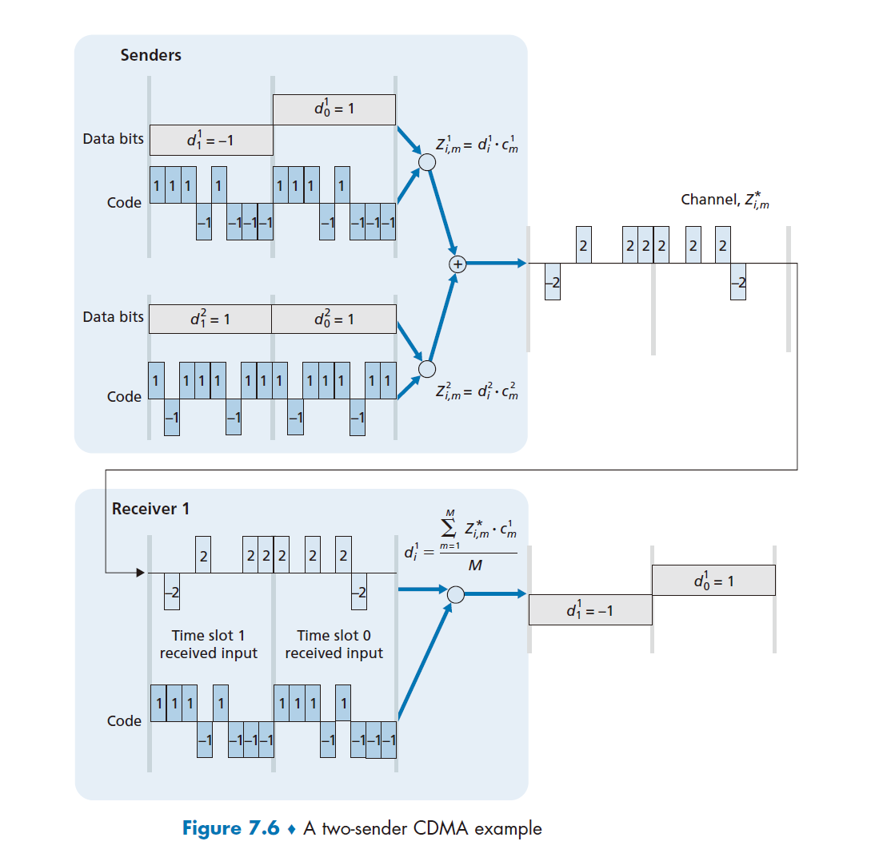

**time : 2021-07-07**

## 7.3. 无线局域网

当前，无线 LAN 在工作场所、家庭、教育机构、咖啡屋、机场以及街头无所不在, 它已经成为因特网中的一种十分重要的接入网技术。尽管在 20 世纪 90 年代研发了许多有关无线 LAN 的标准和技术，但其中有一类标准已经明显成为赢家：**IEEE 802.11 无线 LAN** (也称为 **WiFi**)。在本节中，我们将详细研究 802.11 无线 LAN，分析它的帧结构、它的媒体访问协议以及 802.11 LAN 与有线以太网 LAN 的互联。

在 IEEE 802.11 协议族中有几套有关无线 LAN 的 802.11 标准[IEEE 802.11 2020]，下表对它们进行了总结。802.11 b，g，n，ac，ax 是 802.11 无线局域网技术的紧接着的一代，他们的工作范围通常小于 70m，常常用于家庭办公，工作区和商业环境。802.11 n，ac 和 ax 标准最近分别被打上了 WiFi 4、5 和 6 的牌子：无疑是在与 4G 和 5G 蜂窝网络的品牌竞争。802.11af，ah 标准在更远的距离上运行，主要针对物联网、传感器网络和计量系统。标准可以在更远的距离上运行，主要针对物联网、传感器网络和计量应用。

不同的 802.11 b，g，n，ac，ax 标准都有一些共同特点。包括我们不久将研究的 802.11 帧格式，并且向后兼容。兼容，这意味着，例如，一个只能够使用 802.11 g 的移动设备仍然可以与较新的 802.11 ac 或 802.11 ax 基站互动。它们也都使用相同的媒体访问协议，即 CSMA/CA，我们很快就会讨论这个问题。同时 802.11 ax 也支持基站对相关无线设备的传输进行集中调度。而 802.11 ax 也支持基站集中调度来自相关无线设备的传输。

然而，如下表所示，这些标准在物理层有一些主要的区别。802.11 设备工作在两个不同的频率范围：2.4-2.485 GHz（称为 2.4 GHz 范围）和 5.1-5.8 GHz（称为 5 GHz 范围）。2.4GHz 范围是一个未经许可的频段，802.11 设备可能与 2.4GHz 电话和微波炉等设备竞争频谱。在 5GHz，802.11 局域网在给定的功率水平下有较短的传输距离，并受到更多的多径传播的影响。802.11n、802.11ac 和 802.11ax 标准使用多输入多输出（MIMO）天线；也就是说，发送端有两根或多根天线，接收端有两根或多根天线在发送/接收不同的信号[Diggavi 2004]。802.11ac 和 802.11 ax 基站可以同时向多个站点发送信号，并使用 "智能 "天线自适应波束格式，以接收器的方向为目标进行传输。这减少了干扰，并增加了在给定数据率下达到的距离。下表中显示的数据速率是在一个理想化的环境中，例如，接收器靠近基站，没有干扰：这是我们在实践中不太可能遇到的情况。因此，正如俗话所说，YMMV：你的里程（或在这种情况下你的无线数据速率）可能会有所不同。

| IEEE 802.11 标准   | 年份            | 最高传输速率 | 范围 | 频率                         |
| ------------------ | --------------- | ------------ | ---- | ---------------------------- |
| 802.11 b           | 1999            | 11 Mbps      | 30 m | 2.4 Ghz                      |
| 802.11 g           | 2003            | 54 Mbps      | 30 m | 2.4 Ghz                      |
| 802.11 n (WiFi 4)  | 2009            | 600 Mbps     | 70 m | 2.4, 5 Ghz                   |
| 802.11 ac (WiFi 5) | 2013            | 3.47 Gpbs    | 70 m | 5 Ghz                        |
| 802.11 ax (WiFi 6) | 2020 (expected) | 14 Gbps      | 70 m | 2.4, 5 Ghz                   |
| 802.11 af          | 2014            | 35–560 Mbps  | 1 Km | unused TV bands (54–790 MHz) |
| 802.11 ah          | 2017            | 347 Mbps     | 1 Km | 900 Mhz                      |

### 7.3.1. 802.11 架构

图 7-7 显示了 802. 11 无线 LAN 体系结构的基本构件。802.11 体系结构的基本构件模块是 **基本服务集(Basic Service Set, BSS)**。一个 BSS 包含一个或多个无线站点和一个在 802.11 术语中称为 **接入点(Access Point, AP)** 的 **中央基站(base station)** 。图 7-7 展示了两个 BSS 中的 AP，它们连接到一个互联设备上（如交换机或者路由器），互联设备又连接到因特网中。在一个典型的家庭网络中，有一个 AP 和一台将该 BSS 连接到因特网中的路由器（通常综合成为一个单元）。

与以太网设备类似，每个 802.11 无线站点都具有一个 6 字节的 MAC 地址，该地址存储在该站适配器（即 802.11 网络接口卡）的固件中。每个 AP 的无线接口也具有一个 MAC 地址。与以太网类似，这些 MAC 地址由 IEEE 管理，理论上是全球唯一的。

如 7-1 节所述，配置 AP 的无线 LAN 经常被称作 **基础设施无线 LAN(infrastructure wireless LAN)**，其中的“基础设施”是指 AP 连同互联 AP 和一台路由器的有线以太网。图 7-8 显示了 IEEE 802.11 站点也能将它们自己组合在一起形成一个自组织网络，即一个无中心控制和与“外部世界”无连接的网络。这里，该网络是由彼此已经发现相互接近且 有通信需求的移动设备“动态”形成，并且在它们所处环境中没有预先存在的网络基础设施。当携带便携机的人们聚集在一起时（例如，在一个会议室、一列火车或者一辆汽车中），并且要在没有中央化的 AP 的情况下交换数据，一个自组织网络就可能形成了。随着要通信的便携设备的继续激增，人们对自组织网络产生巨大的兴趣。然而在本节中，我们只关注基础设施无线 LAN。

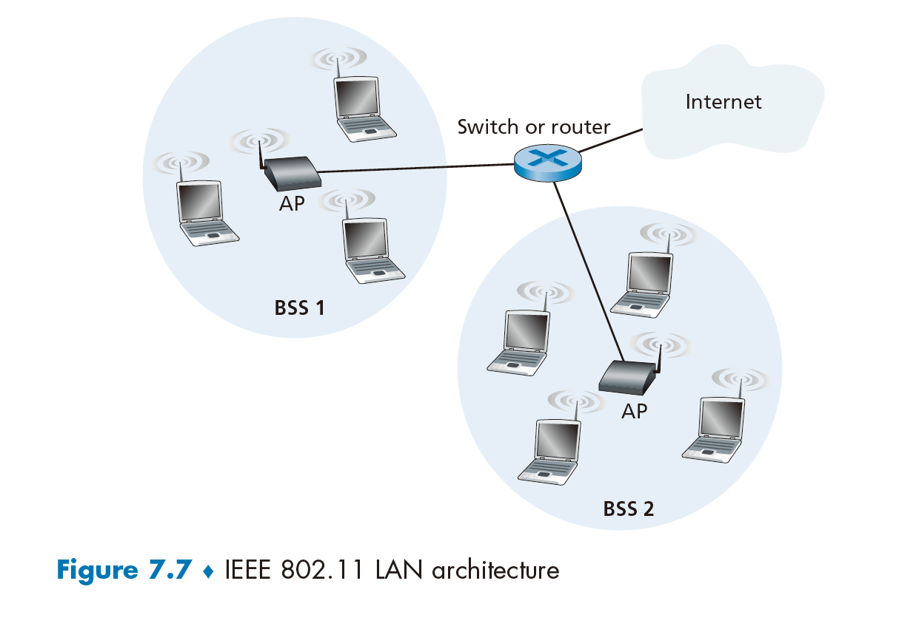

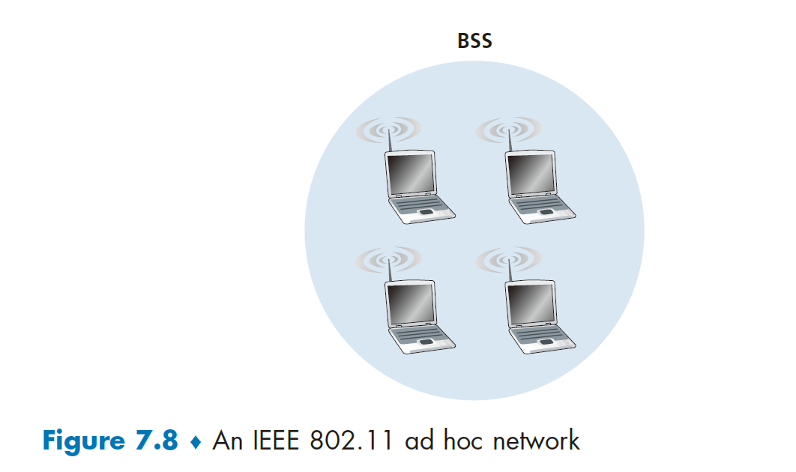

**信道与关联**

在 802.11 中，每个无线站点在能够发送或者接收网络层数据之前，必须与一个 AP 相关联。尽管所有 802.11 标准都使用了关联，但我们将专门在 IEEE 802.11 b/g 环境中讨论这一主题。

当网络管理员安装一个 AP 时，管理员为该接入点分配一个单字或双字的 **服务集标识符(Service Set Identifier, SSID)**。(例如，当你在 iPhone 上选择设置 WiFi 时，将显示某范围内每个 AP 的 SSID)管理员还必须为该 AP 分配一个信道号。为了理解信道号，回想前面讲过的 802.11 运行在 2.4-2.4835GHz 的频段中。在这个 85MHz 的频段内，802. 11 定义了 11 个部分重叠的信道。当且仅当两个信道由 4 个或更多信道隔开时它们才无重叠。特别是信道 1、6 和 11 的集合是唯一的 3 个非重叠信道的集合。这意味着管理员可以在同一个物理网络中安装 3 个 802.lib AP,为这些 AP 分配信道 1、6 和 11，然后将每个 AP 都连接到一台交换机上。

既然已经对 802. 11 信道有了基本了解，我们则可以描述一个有趣(且并非完全不寻常)的情况，即有关 WiFi 丛林。**WiFi 丛林(WiFi jungle)** 是一个任意物理位置，在这里无线站点能从两个或多个 AP 中收到很强的信号。例如，在纽约城的许多咖啡馆中，无线站点可以从附近许多 AP 中选取一个信号。其中一个 AP 可能由该咖啡馆管理，而其他 AP 可能位于咖啡馆附近的住宅区内。这些 AP 中的每一个都可能位于不同的子网中，并被独立分配一个信道。

现在假定你带着自己的手机、平板电脑或便携机进入这样一个 WiFi 丛林，寻求无线因特网接入和一个蓝莓松饼。设在这个丛林中有 5 个 AP。为了获得因特网接入，你的无线站点需要加入其中一个子网并因此需要与其中的一个 AP 相 **关联(associate)**。关联意味着这一无线站点在自身和该 AP 之间创建一个虚拟线路。特别是，仅有关联的 AP 才向你 的无线站点发送数据帧，并且你的无线站点也仅仅通过该关联 AP 向因特网发送数据帧。然而，你的无线站点是如何与某个特定的 AP 相关联的？更为根本的问题是，你的无线站点是如何知道哪个 AP 位于该丛林呢？

802.11 标准要求每个 AP 周期性地发送 **信标帧(beacon frame)**，每个信标帧包括该 AP 的 SSID 和 MAC 地址。你的无线站点为了得知正在发送信标帧的 AP,扫描 11 个信道，找出来自可能位于该区域的 AP 所发出的信标帧(其中一些 AP 可能在相同的信道中传输, 即这里有一个丛林！)。通过信标帧了解到可用 AP 后，你(或者你的无线主机)选择一个 AP 用于关联。

802.11 标准没有指定选择哪个可用的 AP 进行关联的算法；该算法被遗留给 802.11 固件和无线主机的软件设计者。通常，主机选择接收到的具有最高信号强度的信标帧。虽然高信号强度好（例如可参见图 7-3）,信号强度将不是唯一决定主机接收性能的 AP 特性。特别是，所选择的 AP 可能具有强信号，但可能被其他附属的主机（将需要共享该 AP 的无线带宽）所过载，而某未过载的 AP 由于稍弱的信号而未被选择。选择 AP 的一些可替代的方法近来已被提出[Vasudevan 2005 ； Nicholson 2006； Sudaresan 2006 ]。有关信号强度如何测量的有趣而朴实的讨论参见[Bardwell 2004]。

扫描信道和监听信标帧的过程被称为 **被动扫描(passive scanning)**（参见图 7-9a）。无线主机也能够执行 **主动扫描(active scanning)**，这是通过向位于无线主机范围内的所有 AP 广播探测帧完成的，如图 7-9b 所示。AP 用一个探测响应帧应答探测请求帧。无线主机则能够在响应的 AP 中选择某 AP 与之相关联。

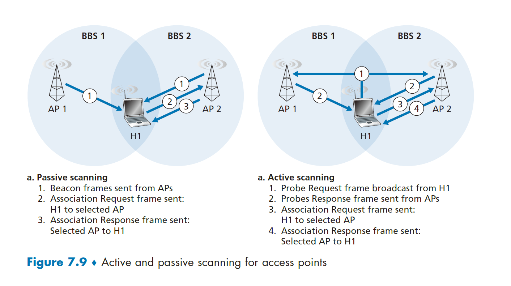

选定与之关联的 AP 后，无线主机向 AP 发送一个关联请求帧，并且该 AP 以一个关联响应帧进行响应。注意到对于主动扫描需要这种第二次请求/响应握手，因为一个对初始探测请求帧进行响应的 AP 并不知道主机选择哪个（可能多个）响应的 AP 进行关联，这与 DHCP 客户能够从多个 DHCP 服务器进行选择有诸多相同之处（参见图 4-24）。一旦与 一个 AP 关联，该主机希望加入该 AP 所属的子网中（以 4-3-3 节中的 IP 寻址的意义）。 因此。该主机通常将通过关联的 AP 向该子网发送一个 DHCP 发现报文（参见图 4-24），以获取在该 AP 子网中的一个 IP 地址。一旦获得地址，网络的其他部分将直接视你的主机 为该子网中的另一台主机。

为了与特定的 AP 创建一个关联，某无线站点可能要向该 AP 鉴别它自身。802.11 无线 LAN 提供了几种不同的鉴别和接入方法。一种被许多公司采用的方法是，基于一 个站点的 MAC 地址允许其接入一个无线网络。第二种被许多因特网咖啡屋采用的方法 是，应用用户名和口令。在两种情况下，AP 通常与一个鉴别服务器进行通信，使用一 种诸如 RADIUS [RFC 2865]或 DIAMETER [RFC 6733]的协议，在无线终端站和鉴别 服务器之间中继信息。分离鉴别服务器和 AP，使得一个鉴别服务器可以服务于多个 AP，将（经常是敏感的）鉴别和接入的决定集中到单一服务器中，使 AP 费用和复杂性较低。我们将在第 8 章看到，定义 802.11 协议族安全性的新 IEEE 802.11 i 协议就恰好采用了这一方法。

### 7.3.2. 802.11 MAC 协议

一旦某无线站点与一个 AP 相关联，它就可以经该接入点开始发送和接收数据帧。然而因为许多无线设备或 AP 自身可能希望同时经过相同信道传输数据帧，因此需要一 个多路访问协议来协调传输。下面，我们将无线设备或 AP 称为 **站点(station)**，它们共享多个接入信道。正如在第 6 章和 7-2-1 节中讨论的那样，宽泛地讲有三类多路访问协 议：信道划分（包括 CDMA）、随机访问和轮流。受以太网及其随机访问协议巨大成功的激励，802.11 的设计者为 802.11 无线 LAN 选择了一种随机访问协议。这个随机访问协议称作 **带碰撞避免的 CSMA(CSMA with collision avoidance)**，或简称为 CSMA/CA。与以太网的 CSMA/CD 相似，CSMA/CA 中的“CSMA”代表“载波侦听多路访问”，意味着每个站点在传输之前侦听信道，并且一旦侦听到该信道忙则抑制传输。尽管以太网和 802. 11 都使用载波侦听随机接入，但这两种 MAC 协议有重要的区别。首先，802.11 使用碰撞避免而非碰撞检测。其次，由于无线信道相对较高的误比特率，802.11（不同于以太网）使用链路层确认/重传（ARQ）方案。我们将在下面讨论 802.11 的碰撞避免和链路层确认机制。

在 6-3-2 节和 6-4-2 节曾讲过，使用以太网的碰撞检测算法，以太网节点在发送过程 中监听信道。在发送过程中如果检测到另一节点也在发送，则放弃自己的发送，并且在等 待一个小的随机时间后再次发送。与 802.3 以太网协议不同，802.11 MAC 协议并未实现碰撞检测。这主要由两个重要的原因所致:

- 检测碰撞的能力要求站点具有同时发送（站点自己的信号）和接收（检测其他站 点是否也在发送）的能力。因为在 802.11 适配器上，接收信号的强度通常远远小于发送信号的强度，制造具有检测碰撞能力的硬件代价较大。
- 更重要的是，即使适配器可以同时发送和监听信号（并且假设它一旦侦听到信道 忙就放弃发送），适配器也会由于隐藏终端问题和衰减问题而无法检测到所有的碰撞，参见 7-2 节的讨论。

由于 802.11 无线局域网不使用碰撞检测，一旦站点开始发送一个帧，它就完全地发送该帧；也就是说，一旦站点开始发送，就不会返回。正如人们可能猜想的那样，碰撞存在时仍发送整个数据帧（尤其是长数据帧）将严重降低多路访问协议的性能。为了降低碰撞的可能性，802.11 采用几种碰撞避免技术，我们稍后讨论它们。

然而，在考虑碰撞避免之前，我们首先需要分析 802.11 的 **链路层确认(link-layer acknowledgment)** 方案。7-2 节讲过，当无线 LAN 中某站点发送一个帧时，该帧会由于多种原因不能无损地到达目的站点。为了处理这种不可忽视的故障情况，802.11 MAC 使用链路层确认。如图 7-10 所示，目的站点收到一个通过 CRC 校验的帧后，它等待一个被称作 **短帧间间隔(Short Inter-Frame Spacing, SIFS)** 的一小段时间，然后发回一个确认帧。 如果发送站点在给定的时间内未收到确认帧，它假定出现了错误并重传该帧，使用 CS-MA/CA 协议访问该信道。如果在若干固定次重传后仍未收到确认，发送站点将放弃发送并丢弃该帧。

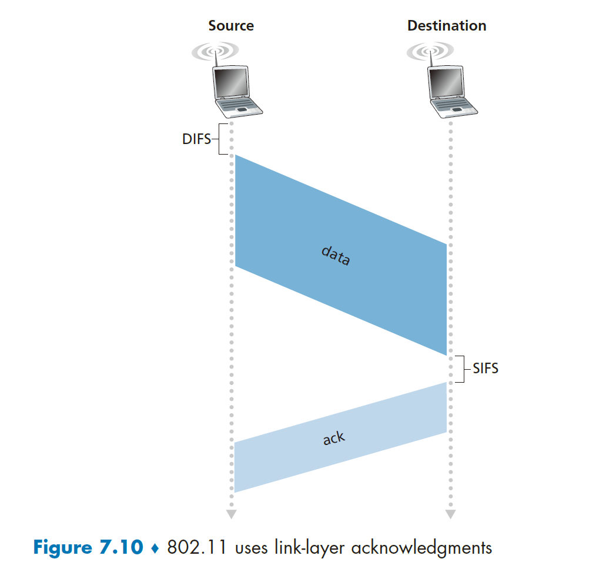

讨论过 802.11 如何使用链路层确认后，我们可以描述 802.11 的 CSMA/CA 协议了。 假设一个站点（无线站点或者 AP）有一个帧要发送。

(1) 如果某站点最初监听到信道空闲，它将在一个被称作 **分布式帧间间隔(DistributeInter-Frame Space, DIFS)** 的短时间段后发送该帧，
(2) 否则，该站点选取一个随机回退值（如我们在 6-3-2 节中遇到的那样）并且在侦听信道空闲时递减该值。当侦听到信道忙时，计数值保持不变。
(3) 当计数值减为 0 时（注意到这只可能发生在信道被侦听为空闲时），该站点发送整个数据帧并等待确认。
(4) 如果收到确认，发送站点知道它的帧已被目的站正确接收了。如果该站点要发送另一帧，它将从第二步开始 CSMA/CA 协议。如果未收到确认，发送站点将重新进入第二步中的回退阶段，并从一个更大的范围内选取随机值。

前面讲过，在以太网的 CSMA/CD 的多路访问 协议（6-3-2 节）下，一旦侦听到信道空闲，站点开始发送。然而，使用 CSMA/CA，该站点在倒计数时抑制传输，即使它侦听到该信道空闲也是如此。为什么 CSMA/CD 和 CSMA/CA 采用了不同的方法呢？

为了回答这一问题，我们首先考虑这样一种情形：两个站点分别有一个数据帧要发送，但是，由于侦听到第三个站点已经在传输，双方都未立即发送。使用以太网的 CSMA/CD 协议中, 两个站点将会在检测到第三方发送完毕后立即开始发送。这将导致一个碰撞，在 CSMA/CD 协议中碰撞并非是一个严重的问题，因为两个站点检测到碰撞后都会放弃它们的发送, 从而避免了由于碰撞而造成的该帧剩余部分的无用发送。而在 802.11 中情况却十分不同，因为 802.11 并不检测碰撞和放弃发送，遭受碰撞的帧仍将被完全传输。因此 802.11 的目标是无论如何尽可能避免碰撞。在 802.11 中，如果两个站点侦听到信道忙，它们都将立即进入随机回退，希望选择一个不同的回退值。如果这些值的确不同，一旦信道空闲，其中的一个站点将在另一个之前发送，并且（如果两个站点均未对对方隐藏）“失败站点”将会听到“胜利站点”的信号，冻结它的计数器，并在胜利站点完成传输之前一直抑制传输。通过这种方式，避免了髙代价的碰撞。当然，在以下情况下使用 802.11 仍可能出现碰撞：两个站点可能互相是隐藏的，或者两者可能选择了非常靠近的随机回退值，使来自先开始站点的传输也必须到达第二个站点。回想前面我们在图 6-12 的环境中讨论随机访问算法时遇到过这个问题。

1. **处理隐藏终端：RTS 和 CTS**

   802.11 MAC 协议也包括了一个极好（但为可选项）的预约方案，以帮助在出现隐藏终端的情况下避免碰撞。我们在图 7-11 的环境下研究这种方案，其中显示了两个无线站点和一个接入点。

这两个无线站点都在该 AP 的覆盖范围内(其覆盖范围显示为阴影圆环)，并且两者都与该 AP 相关联。然而，由于衰减，无线节点的信号范围局限在图 7-11 所示的阴影圆环内部。因此，尽管每个无线站点对 AP 都不隐藏，两者彼此却是隐藏的。


现在我们考虑为什么隐藏终端会导致出现问题。假设站点 H1 正在传输一个帧，并且在 H1 传输的中途，站点 H2 要向 AP 发送一个帧。由于 H2 未听到来自 H1 的传输，它将首先等待一个 DIFS 间隔，然后发送该帧，导致产生了一个碰撞。从而在 H1 和 H2 的整个发送阶段，信道都被浪费了。

为了避免这一问题，IEEE 802.11 协议允许站点使用一个 **短请求发送(Request to Send, RTS)** 控制帧和一个 **短允许发送(Clear to Send, CTS)** 控制帧来预约对信道的访问。当发送方要发送一个 data 帧时，它能够首先向 AP 发送一个 RTS 帧，指示传输 DATA 帧和确认(ACK)帧需要 的总时间。当 AP 收到 RTS 帧后，它广播一个 CTS 帧作为响应。该 CTS 帧有两个目的：给发送方明确的发送许可，也指示其他站点在预约期内不要发送。

因此，在图 7-12 中，在传输 DATA 帧前，H1 首先广播一个 RTS 帧，该帧能被 其范围内包括 AP 在内的所有站点听到。 AP 然后用一个 CTS 帧响应，该帧也被其范围内包括 H1 和 H2 在内的所有站点听到。站点 H2 听到 CTS 后，在 CTS 帧中指明的时间内将抑制发送。RTS、CTS、 DATA 和 ACK 帧如图 7-12 所示。RTS 和 CTS 帧的使用能够在两个重要方面提高性能：

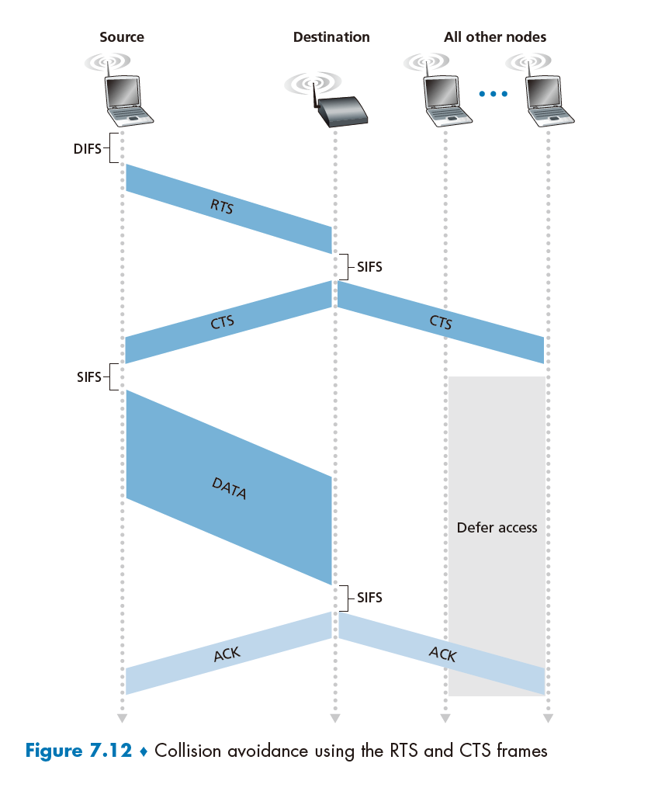

- 隐藏终端问题被缓解了，因为长 DATA 帧只有在信道预约后才被传输。
- 因为 RTS 和 CTS 帧较短，涉及 RTS 和 CTS 帧的碰撞将仅持续短 RTS 和 CTS 帧的持续期。一旦 RTS 和 CTS 帧被正确传输，后续的 DATA 和 ACK 帧应当能无碰撞地发送。

尽管 RTS/CTS 交换有助于降低碰撞，但它同样引入了时延以及消耗了信道资源。因此，RTS/CTS 交换仅仅用于为长数据帧预约信道。在实际中，每个无线站点可以设置一个 RTS 门限值，仅当帧长超过门限值时，才使用 RTS/CTS 序列。对许多无线站点而言，默认的 RTS 门限值大于最大帧长值，因此对所有发送的 DATA 帧，RTS/CTS 序列都被跳过。

2. **使用 802.11 作为一个点对点链路**

到目前为止我们的讨论关注在多路访问环境中使用 802.11。应该指出，如果两个节点每个都具有一个定向天线，它们可以将其定向天线指向对方，并基本上是在一个点对点的 链路上运行 802.11 协议。如果商用 802.11 硬件产品价格低廉，那么使用定向天线以及增 加传输功率使得 802.11 成为一个在数十公里距离中提供无线点对点连接的廉价手段。 [Raman 2007]描述了这样一个运行于印度恒河郊区平原上的多跳无线网络，其中包含了 点对点 802.11 链路。

### 7.3.3. IEEE 802.11 帧

尽管 802.11 帧与以太网帧有许多共同特点，但它也包括了许多特定用于无线链路的 字段。802.11 帧如图 7-13 所示，在该帧上的每个字段上面的数字代表该字段以字节计的长度；在该帧控制字段中，每个子字段上面的数字代表该子字段以比特计的长度。现在我们查看该帧中各字段以及帧控制字段中一些重要的子字段。

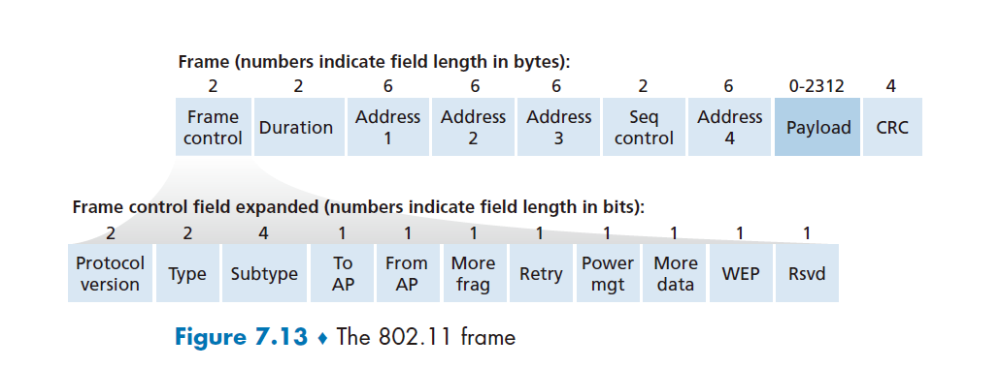

1. **有效载荷与 CRC 字段**

帧的核心是有效载荷，它通常是由一个 IP 数据报或者 ARP 分组组成。尽管这一字段允许的最大长度为 2312 字节，但它通常小于 1500 字节，放置一个 IP 数据报或一个 ARP 分组。如同以太网帧一样，802.11 帧包括一个循环冗余校验（CRC）,从而接收方可以检 测所收到帧中的比特错误。如我们所看到的那样，比特错误在无线局域网中比在有线局域网中更加普遍，因此 CRC 在这里更加有用。

2. **地址字段**

也许 802.11 帧中最引人注意的不同之处是它具有 4 个地址字段，其中每个都可以包含一个 6 字节的 MAC 地址。但为什么要 4 个地址字段呢？如以太网中那样，一个源 MAC 地址字段和一个目的 MAC 地址字段不就足够了？事实表明，出于互联目的需要 3 个地址字段，特别是将网络层数据报从一个无线站点通过一个 AP 送到一台路由器接口。当 AP 在自组织模式中互相转发时使用第四个地址。由于我们这里仅仅考虑基础设施网络，所以只关注前 3 个地址字段。802.11 标准定义这些字段如下：

- 地址 2 是传输该帧的站点的 MAC 地址。因此，如果一个无线站点传输该帧，该站 点的 MAC 地址就被插入在地址 2 字段中。类似地，如果一个 AP 传输该帧，该 AP 的 MAC 地址也被插入在地址 2 字段中。
- 地址 1 是要接收该帧的无线站点的 MAC 地址。因此，如果一个移动无线站点传输 该帧，地址 1 包含了该目的 AP 的 MAC 地址。类似地，如果一个 AP 传输该帧, 地址 1 包含该目的无线站点的 MAC 地址。
- 为了理解地址 3，回想 BSS （由 AP 和无线站点组成）是个子网的一部分，并且这个子网经一些路由器接口与其他子网相连。地址 3 包含这个路由器接口的 MAC 地址。

为了对地址 3 的目的有更深入的理解，我们观察在图 7-14 环境中的网络互联的例子。在这幅图中，有两个 AP，每个 AP 负责一些无线站点。每个 AP 到路由器有一个直接连接，路由器依次又连接到全球因 特网。我们应当记住 AP 是链路层设备，它既不能“说” IP 又不理解 IP 地址。现在考虑将一个数据报从路由器接口 R1 移到无线站点 H1。路由器并不清楚在它和 H1 之间有一个 AP；从路由器的观点来说，H1 仅仅是路由器所连接的子网中的一台主机。

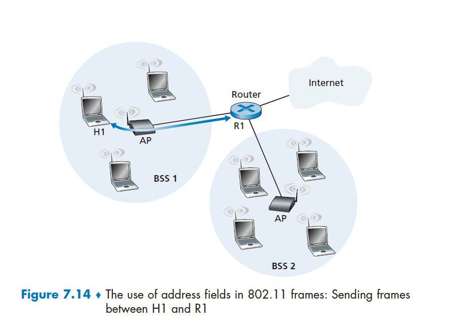

- 路由器知道 H1 的 IP 地址（从数据报的目的地址中得到），它使用 ARP 来确定 H1 的 MAC 地址，这与在普通的以太网 LAN 中相同。获取 H1 的 MAC 地址后，路由器接口 R1 将该数据报封装在一 个以太网帧中。该帧的源地址字段包含了 R1 的 MAC 地址，目的地址字段包含 H1 的 MAC 地址。
- 当该以太网帧到达 AP 后，该 AP 在将其传输到无线信道前，先将该 802.3 以太网 帧转换为一个 802.11 帧。如前所述，AP 将地址 1 和地址 2 分别填上 H1 的 MAC 地址和其自身的 MAC 地址。对于地址 3，AP 插入 R1 的 MAC 地址。通过这种方式，H1 可以确定（从地址 3）将数据报发送到子网中的路由器接口的 MAC 地址。

现在考虑在从 H1 移动一个数据报到 R1 的过程中无线站点 H1 进行响应时发生的情况。

- H1 生成一个 802.11 帧，如上所述，分别用 AP 的 MAC 地址和 H1 的 MAC 地址填 充地址 1 和地址 2 字段。对于地址 3，H1 插入 R1 的 MAC 地址。
- 当 AP 接收该 802.11 帧后，将其转换为以太网帧。该帧的源地址字段是 H1 的 MAC 地址，目的地址字段是 R1 的 MAC 地址。因此，地址 3 允许 AP 在构建以太网帧时能够确定目的 MAC 地址。

总之，地址 3 在 BSS 和有线局域网互联中起着关键作用。

3. **序号、持续期和帧控制字段**

前面讲过在 802.11 网络中，无论何时一个站点正确地收到一个来自于其他站点的帧, 它就回发一个确认。因为确认可能会丢失，发送站点可能会发送一个给定帧的多个副本。 正如我们在 rdt 2.1 协议讨论中所见（3-4-1 节），使用序号可以使接收方区分新传输的帧和以前帧的重传。因此在 802.11 帧中的序号字段在链路层与在第 3 章中运输层中的该字段有着完全相同的目的。

前面讲过 802.11 协议允许传输节点预约信道一段时间，包括传输其数据帧的时间和传输确认的时间。这个持续期值被包括在该帧的持续期字段中（在数据帧和 RTS 及 CTS 帧中均存在）。

如图 7-13 所示，帧控制字段包括许多子字段，我们将提一下其中比较重要的子字段，更加完整的讨论请参见 802.11 规范［Held 2001 ； Crow 1997； IEEE 802.11 1999］。类型和子类型字段用于区分关联、RTS、CTS、ACK 和数据帧。To（到）和 From（从）字段用于定义不同地址字段的含义。（这些含义随着使用自组织模式或者基础设施模式而改变，而且在使用基础设施模式时，也随着是无线站点还是 AP 在发送帧而变化。）最后，WEP 字段指示了是否使用加密（WEP 将在第 8 章中讨论。）

### 7.3.4. 在相同的 IP 子网中的移动性

为了增加无线 LAN 的物理范围，公司或大学经常会在同一个 IP 子网中部署多个 BSS。这自然就引出了在多个 BSS 之间的移动性问题，即无线站点如何在维持进行中的 TCP 会话的情况下，无缝地从一个 BSS 移动到另一个 BSS？正如我们将在本小节中所见，当这些 BSS 属于同一子网时，移动性可以用一种相对直接的方式解决。当站点在不同子网间移动时，就需要更为复杂的移动性管理协议了，我们将在 7-5 节和 7-6 节中学习这些协议。

我们现在看一个同一子网中的不同 BSS 之间的移动性的特定例子。图 7-15 显示了具有一台主机 H1 的两个互联的 BSS,该主机从 BSS1 移动到 BSS2O 因为在这个例子中连接两个 BSS 的互联设备不是一台路由器，故在两个 BSS 中的所有站点（包括 AP）都属于同一个 IP 子网。因此，当 H1 从 BSS1 移动到 BSS2 时，它 可以保持自己的 IP 地址和所有正在进行的 TCP 连接。如果互联设备是一台路由器，则 H1 必须在它移动进入的子网中获得一个新地址。这种地址的变化将打断（并且最终终止）在 H1 的任何 进行中的 TCP 连接。在 7-6 节中，我们将能看到 一种网络层移动性协议如移动 IP 能被用于避免该问题。

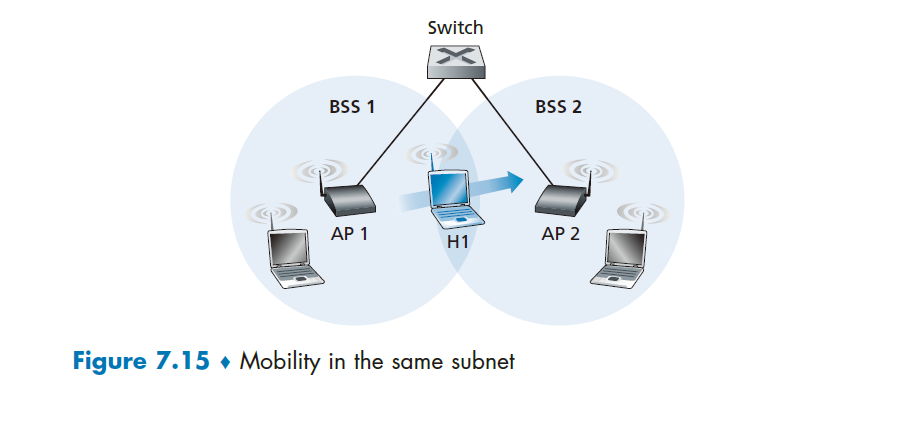

但是 H1 从 BSS1 移动到 BSS2 时具体会发生哪些事呢？随着 H1 逐步远离 AP1，H1 检测到来自 AP1 的信号逐渐减弱并开始扫描一个更强的信号。H1 收到来自 AP2 的信标帧（在许多公司和大学的设置中它与 API 有相同的 SSID）。H1 然后与 AP1 解除关联，并与 AP2 关联起来，同时保持其 IP 地址和维持正在进行的 TCP 会话。

从主机和 AP 的角度，这就处理了切换问题。但对图 7-15 中的交换机又会发生什么样 的情况呢？交换机如何知道主机已经从一个 AP 移动到另一个 AP 呢？回想第 6 章所述，交换机是“自学习”的，并且自动构建它们的转发表。这种自学习的特征很好地处理了偶尔的移动（例如，一个雇员从一个部门调转到另一个部门）。然而，交换机没有被设计用 来支持用户在不同 BSS 间高度移动，同时又希望保持 TCP 连接。为理解这一问题，回想在移动之前，交换机在其转发表中有一个表项，对应 H1 的 MAC 地址与到达 H1 所通过的出交换机端口。如果 H1 初始在 BSS1 中，则发往 H1 的数据报将经 AP1 导向 H1。然而，一旦 H1 与 BSS2 关联，它的帧应当被导向 AP2O 一种解决方法（真有点不规范）是在新的关联形成后，让 AP2 以 H1 的源地址向交换机发送一以太网广播帧。当交换机收到该帧后，更新其转发表，使得 H1 可以通过 AP2 到达。802.11 f 标准小组正在开发一个 AP 间的协议来处理这些以及相关的问题。

我们以上的讨论关注了在相同 LAN 子网中的移动性。前面我们在 6-4-4 节学习过 VLAN, 它能够用来将若干 LAN 孤岛连接成为一个大虚拟 LAN，该虚拟 LAN 能够跨越很大的地理范围。在这种 VALN 中的基站之间的移动性能够以上述完全相同的方式来处理［Yu 2011］。

### 7.3.5. 802.11 中的高级特色

我们将简要地讨论 802.11 网络中具有的两种高级能力，以此来完成我们学习 802.11 的内容。如我们所见，这些能力并不是完全特定于 802.11 标准的，而是在该标准中可能由特定机制产生的。这使得不同的厂商可使用他们自己（专用）的方法来实现这些能力，这也许能让他们增强竞争能力。

1. **802.11 速率适应**

我们在前面图 7-3 中看到，不同的调制技术（提供了不同的传输速率）适合于不同的 SNR 情况。考虑这样一个例子，一个 802. 11 用户最初离基站 20 米远，这里信噪比高。在此高信噪比的情况下，该用户能够与基站使用可提供高传输速率的物理层调制技术进行通 信，同时维持低 BER。这个用户多么幸福啊！假定该用户开始移动，向离开基站的方向走去，随着与基站距离的增加，SNR 一直在下降。在这种情况下，如果在用户和基站之间运行的 802.11 协议所使用的调制技术没有改变的话，随着 SNR 减小，BER 将高得不可接受，最终，传输的帧将不能正确收到。

由于这个原因，某些 802.11 实现具有一种速率自适应能力，该能力自适应地根据当前和近期信道特点来选择下面的物理层调制技术。如果一个节点连续发送两个帧而没有收- 到确认（信道上一个比特差错的隐式指示），该传输速率降低到前一个较低的速率。如果 10 个帧连续得到确认，或如果用来跟踪自上次降速以来时间的定时器超时，该传输速率 提高到上一个较高的速率。这种速率适应机制与 TCP 的拥塞控制机制具有相同的“探测” 原理，即当条件好时（反映为收到 ACK），增加传输速率，除非某个“坏事”发生了（ACK 没有收到）；当某个“坏事”发生了，减小传输速率。因此，802.11 的速率适应和 TCP 的拥塞控制类似于年幼的孩子，他们不断地向父母要求越来越多（如幼儿要糖果，青少年要求推迟睡觉），直到父母亲最后说“够了！”，孩子们不再要求了（仅当以后情况已 经变好了才会再次尝试）。已经提出了一些其他方案以改善这个基本的自动速率调整方案 ［Kamerman 1997 ； Holland 2001 ； Lac age 2004]。

2. **功率管理**

功率是移动设备的宝贵资源，因此 802.11 标准提供了功率管理能力，以使 802.11 节点的侦听、传输和接收功能以及其他需要“打开”电路的时间量最小化。802.11 功率管理按下列方式运行。一个节点能够明显地在睡眠和唤醒状态之间交替（像在课堂上睡觉的学生！）。通过将 802.11 帧首部的功率管理比特设置为 1，某节点向接入点指示它将打算睡眠。设置节点中的一个定时器，使得正好在 AP 计划发送它的信标帧前唤醒节点（前面讲过 AP 通常每 100ms 发送一个信标帧）。因为 AP 从设置的功率传输比特知道哪个节点打算睡眠，所以该 AP 知道它不应当向这个节点发送任何帧，先缓存目的地为睡眠主机的任何帧，待以后再传输。

在 AP 发送信标帧前，恰好唤醒节点，并迅速进入全面活动状态（与睡觉的学生不同，这种唤醒仅需要 250 微秒［Kamerman 1997］）。由 AP 发送的信标帧包含了帧被缓存在 AP 中的节点的列表。如果某节点没有缓存的帧，它能够返回睡眠状态。否则，该节点能够通过向 AP 发送一个探询报文明确地请求发送缓存的帧。对于信标之间的 100ms 时间来说，250 微秒的唤醒时间以及类似的接收信标帧及检查以确保不存在缓存帧的短小时间，没有帧要发送和接收的节点能够睡眠 99%的时间，从而大大节省了能源。

### 7.3.6. 个人域网络：蓝牙

蓝牙网络似乎已经很快成为日常生活的一部分。也许你曾使用蓝牙网络替代网线来连接你的电脑和一个无线键盘，无线鼠标，或其他外设。也或许，你曾使用蓝牙网络来连接你的无线耳机，扬声器，手表，或者健康监测手环到你的智能手机，或者连接智能手机到汽车的音频系统。在所有这些使用场景中，蓝牙以低功率运作一个短距离（小于 10m）之上。由于这个原因，蓝牙网络有时被称为 **无线个人域网络(wireless personal area networks, WPAN)** 或 **piconet**。

尽管蓝牙在设计上是相对简单的，但蓝牙也应用到了我们以前讨论过的很多链路层技术，包括时分复用，频分复用(6-3-1 节)，随机回撤(6-3-2 节)，轮询(6-3-3 节)，错误检测和修正(6-2 节)，通过肯定确认和否定确认的可靠数据传输(3-4-1 节)。而且这仅仅考虑了蓝牙的链路层。

蓝牙网络在无许可证的 2.4GHz 工业、科学和医疗（ISM）无线电频段内运行，和其他家用电器如微波炉、车库门开启器和无绳电话一样。因此，蓝牙网络的设计明确考虑到了噪音和干扰。蓝牙无线通道以 TDM 方式运行，时隙为 625 微秒。在每个时隙中，发送者在 79 个信道中的一个进行传输，信道（频率）以已知但伪随机的方式从一个时隙变化到另一个时隙。这种跳信道的形式，被称为 **跳频扩展频(Frequency-Hopping Spread Spectrum, FHSS)**，是为了让在 ISM 频段工作的另一个设备或电器的干扰只在最多一个子集的时隙中干扰蓝牙通信。蓝牙的数据速率可以达到 3Mbps。

蓝牙网络是自组织网络：不需要网络基础设施（如一个接入点）来互连设备。相反，蓝牙设备将他们组织进一个最多可支持 8 个设备 piconet，如图 7-16 所示。其中一个设备被设计为主设备，其他设备为客户。

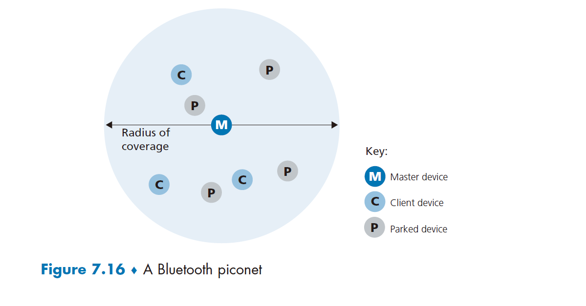

主节点真正控制着 piconet：它的时钟决定了 piconet 中的时间（例如，决定 TDM 时隙的边界），它决定时隙与时隙之间的跳频序列，它控制客户设备进入 piconet，它控制客户设备传输的功率（100 毫瓦、2.5 毫瓦或 1 毫瓦），并使用轮询来授予客户在进入网络后进行传输的许可。除了活动设备，在 piconet 中还可以有多达 255 个 "停放 "设备。这些停放的设备通常处于某种形式的 "睡眠模式"，以节约能源（正如我们在 802.11 电源管理中看到的那样），并将根据主站的时间表定期唤醒，以接收主站的信标信息。在主节点将其状态从停放变为激活之前，停放的设备不能进行通信。

因为蓝牙网络必须是自组织的，所以值得研究它们是如何引导其网络结构的。当一个主节点想形成一个蓝牙网络时，它必须首先确定哪些其他蓝牙设备在范围内；这就是邻居发现问题。主节点通过广播一系列的 32 个询问信息来完成这个任务，每个信息都在不同的频率通道上，并且重复传输序列多达 128 次。客户端设备在其选择的频率上进行监听，希望能在这个频率上听到主设备的一个询问信息。当它听到一个询问信息时，它会在 0 到 0.3 秒之间随机退后一段时间（以避免与其他响应节点发生碰撞，让人想起以太网的二进制回撤），然后用一个包含其设备 ID 的信息回应主设备。

一旦蓝牙主控器发现了范围内的所有潜在客户，它就会邀请那些它希望加入 piconet 的客户。这第二阶段被称为蓝牙寻呼，让人想起 802.11 客户与基站的联系。通过寻呼过程，主控方将告知客户要使用的跳频模式，以及发送方的时钟。主站通过再次发送 32 个相同的寻呼邀请信息开始寻呼过程，每个信息现在都是针对一个特定的客户，但再次使用不同的频率，因为该客户还没有学会跳频模式。一旦客户对寻呼邀请信息作出 ACK 回复，主站就会向客户发送跳频信息、时钟同步信息和活动成员地址，然后最后使用跳频模式对客户进行轮询，以确保客户连接到网络。

在我们上面的讨论中，我们只涉及了蓝牙的无线网络。更高层次的协议提供了可靠的数据包传输，类似电路的音频和视频流，改变传输功率水平，改变活动/停放状态（和其他状态），等等。更多最新版本的蓝牙已经解决了低能量和安全方面的考虑。关于蓝牙的更多信息，感兴趣的读者应该参考[Bisdikian 2001, Colbach 2017, and Bluetooth 2020]。

## 7.4. 蜂窝网络：4G 和 5G

在上一节中，我们研究了当主机在 802.11 WiFi 接入点（AP）附近时如何访问互联网。但正如我们所看到的，接入点的覆盖范围很小，主机当然不可能与它遇到的每一个接入点联系。因此，对于移动中的用户来说，WiFi 接入几乎是无处不在的。

相比之下，4G 蜂窝网络接入已迅速成为普遍现象。最近对 100 多万美国移动蜂窝网络用户的测量研究发现，他们在 90%以上的时间可以找到 4G 信号，下载速度达到 20Mbps 以上。韩国三大手机运营商的用户能够在 95-99.5%的时间内找到 4G 信号[Open Signal 2019]。因此，现在在汽车、公共汽车或高速列车上移动时，流式传输高清视频或参加视频会议是很常见的。4G 互联网接入的普遍性也使无数新的物联网应用成为可能，如与互联网连接的共享单车和滑板车系统，以及智能手机应用，如移动支付（自 2018 年以来在中国很普遍）和基于互联网的信息传递（微信、WhatsApp 等）。

蜂窝指的是，蜂窝网络覆盖的区域被划分为若干地理覆盖区域，称为 **小区(cell)**。每个小区包含一个 **基站(base station)**，向目前在其小区的 **移动设备(mobile device)** 发射信号，并接收信号。一个小区的覆盖范围取决于许多因素，包括基站的发射功率，设备的发射功率，小区中的障碍物，以及基站天线的高度和类型。

在这一节中，我们对当前的 4G 和新兴的 5G 蜂窝网络进行了概述。我们将考虑移动设备和基站之间的无线第一跳，以及蜂窝运营商的全 IP 核心网络，该网络将无线第一跳连接到运营商的网络、其他运营商的网络，以及更大的互联网。也许令人惊讶的是（考虑到移动蜂窝网络起源于电话世界，它的网络架构与互联网非常不同），我们将在 4G 网络中遇到许多我们在第 1-6 章中以互联网为重点的研究中遇到的架构原则，包括协议分层、边缘/核心的区别、多个供应商网络的互连以形成一个全球 "网络的网络"，以及数据和控制平面的明确分离与逻辑上的集中控制。我们现在将通过移动蜂窝网络的视角（而不是通过互联网的视角）来看待这些原则，从而看到这些原则以不同的方式得到体现。当然，由于运营商的网络有一个全 IP 的核心，我们也会遇到许多我们现在熟悉的互联网协议。在制定了这些主题所需的基本原则之后，我们将在第 7-6 节中介绍其他的 4G 主题：移动性管理，并在第 8-8 节中介绍 4G 安全。

我们在这里对 4G 和 5G 网络的讨论将相对简短。移动蜂窝网络是一个具有很大广度和深度的领域，许多大学都开设了关于该主题的若干课程。鼓励寻求更深入了解的读者参阅[Goodman 1997; Kaaranen 2001; Lin 2001; Korhonen 2003; Schiller 2003; Palat 2009; Scourias 2012; Turner 2012; Akyildiz 2010]，以及特别出色和详尽的书籍[Mouly 1992; Sauter 2014]。正如互联网 RFC 定义了互联网标准架构和协议一样，4G 和 5G 网络也由被称为技术规范的标准文件来定义。这些文件可在网上免费获取[3GPP 2020]。就像 RFC 一样，技术规范读起来相当密集和详细。但是，当你有问题时，它们是答案的最终来源！

### 7.4.1. 4G LTE 蜂窝网络：架构和基本组成

截至本文撰写时，2020 年普遍存在的 4G 网络实施的是 **4G 长期演进标准(Long-Term Evolution standard)**，或者更简洁的说是 **4G LTE**。在本节中，我们将介绍 4G LTE 网络。图 7-17 显示了 4G LTE 网络架构的基本组成。该网络大致分为蜂窝网络边缘的无线网络和核心网络。所有的网络基本组成都使用我们在第四章学习的 IP 协议相互通信。与早期的 2G 和 3G 网络一样，4G LTE 充满了相当晦涩的首字母缩写和基本组成名称。我们将尝试通过这种混乱的方式，首先关注网络基本组成的功能，以及 4G LTE 网络的各种网络基本组成如何在数据和控制平面上相互作用。

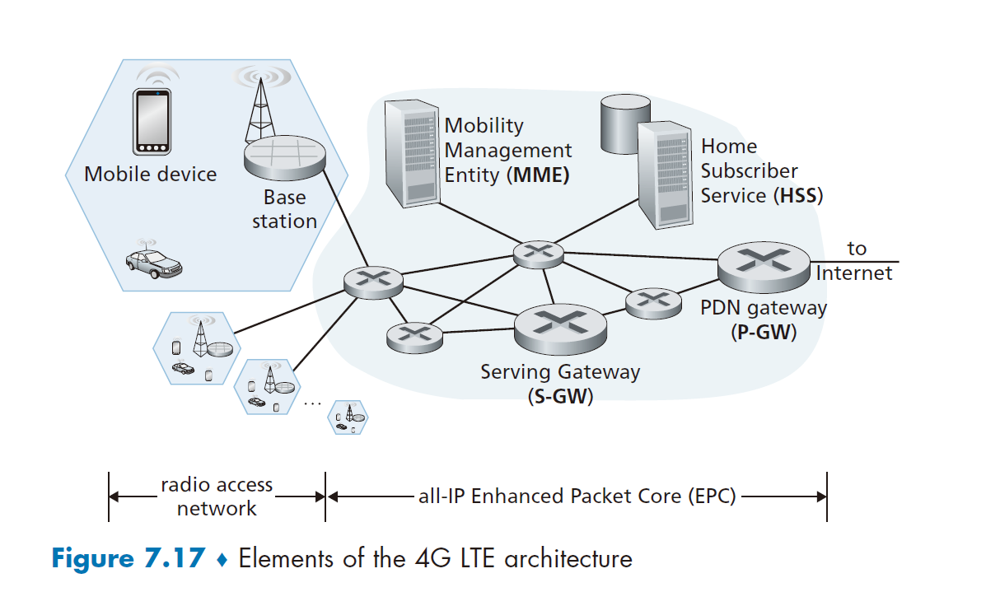

- **移动设备(Mobile Device)**。这是一个智能手机、平板电脑、笔记本电脑或物联网设备，连接到蜂窝运营商的网络。这是运行网络浏览器、地图应用、语音和视频会议应用、移动支付应用等应用的地方。移动设备通常实现了完整的 5 层互联网协议栈，包括传输层和应用层，正如我们在互联网网络边缘看到的主机。移动设备是一个网络端点，有一个 IP 地址（通过 NAT 获得，我们会看到）。移动设备也有一个全球唯一的 64 位标识符，称为 **国际移动用户身份(International Mobile Subscriber Identity, IMSI)**，它存储在其 SIM（用户身份模块）卡上。IMSI 在全球蜂窝运营商网络系统中识别用户，包括用户所属的国家和家庭蜂窝运营商网络。在某些方面，IMSI 类似于一个 MAC 地址。SIM 卡还存储了用户能够获得的服务信息和该用户的加密密钥信息。在 4G LTE 的官方行话中，移动设备被称为 **用户设备(User Equipment ,UE)**。然而，在这本教科书中，我们将始终使用更方便读者的术语“移动设备”。我们还注意到，移动设备并不总是移动的；例如，该设备可能是一个固定的温度传感器或一个监控摄像头。

- **基站(Base Station)**。基站位于运营商网络的“边缘”，负责管理无线射频资源和其覆盖区域内的移动设备。正如我们将看到的，移动设备将与基站互动，以连接到运营商的网络。基站协调设备认证和无线电接入网络中的资源分配（信道接入）。在这个意义上，蜂窝基站的功能与无线局域网中的接入点相类似（但绝非完全相同）。但是，蜂窝基站还有其他一些无线局域网中所没有的重要作用。特别是，基站创建了从移动设备到网关的设备专用 IP 隧道，并在它们之间进行互动，以处理设备在小区之间的移动。附近的基站还相互协调，管理无线电频谱，以减少小区之间的干扰。

- **家庭用户服务器(Home Subscriber Server, HSS)**。如图 7-18 所示，HSS 是一个控制平面上的基本组成。HSS 是一个数据库，存储有关移动设备的信息，HSS 的网络是其家庭网络。它与 MME（下文讨论）一起用于设备认证。


- **服务网关(Serving Gateway, S-GW)、分组数据网络网关(Packet Data Network Gateway, P-GW)和其他网络路由器**。如图 7-18 所示，服务网关和分组数据网络网关是位于移动设备和互联网之间的数据路径上的两个路由器（在实践中通常是合在一起的）。PDN 网关还为移动设备提供 NAT IP 地址，并执行 NAT 功能（见 4-3-4 节）。PDN 网关是来自移动设备的数据报在进入大互联网之前遇到的最后一个 LTE 基本组成。在外界看来，P-GW 与其他网关路由器一样；蜂窝运营商 LTE 网络内的移动节点的移动性隐藏在 P-GW 后面，不为外界所知。除了这些网关路由器，蜂窝运营商的全 IP 核心将有额外的路由器，其作用类似于传统的 IP 路由器:沿着通常终止于 LTE 核心网络基本组成的路径在它们之间转发 IP 数据报。

- **移动性管理实体(Mobility Management Entity, MME)**。如图 7-18 所示，MME 也是一个控制平面基本组成。与 HSS 一起，它在验证想要连接到其网络的设备方面起着重要作用。它还在设备和 PDN 互联网网关路由器之间的数据路径上设置隧道，并维护运营商蜂窝网络中活动移动设备的小区位置信息。但是，如图 7-18 所示，它不在移动设备与互联网之间的数据报的转发路径上。

  - **认证**。对于网络和连接到网络的移动设备来说，相互认证是很重要的：网络要知道连接的设备确实是与给定的 IMSI 相关的设备，而移动设备要知道它所连接的网络也是合法的蜂窝运营商网络。我们将在第 8 章介绍认证，并在第 8-8 节介绍 4G 认证。在这里，我们只需注意到 MME 在移动设备和移动设备家庭网络中的家庭用户服务（HSS）之间扮演了一个中间人的角色。具体来说，在收到来自移动设备的附加请求后，本地 MME 会联系移动家庭网络中的 HSS。然后，移动设备的主网 HSS 向本地 MME 返回足够的加密信息，以向移动设备证明主网 HSS 正在通过该 MME 进行认证，并让移动设备向 MME 证明它确实是与该 IMSI 相关的移动。当移动设备连接到其家庭网络时，在认证期间要联系的 HSS 位于同一家庭网络内。然而，当移动设备在一个由不同蜂窝网络运营商运营的访问网络上漫游时，该漫游网络中的 MME 将需要联系移动设备主网络中的 HSS。

  - **路径设置**。如图 7-18 下半部分所示，从移动设备到运营商的网关路由器的数据路径包括移动设备和基站之间的无线第一跳，以及基站和服务网关、服务网关和 PDN 网关之间的串联 IP 隧道。隧道在 MME 的控制下设置，用于数据转发（而不是在网络路由器之间直接转发），以促进设备的移动性--当设备移动时，只有终止于基站的隧道端点需要改变，而其他隧道端点以及与隧道相关的服务质量则保持不变。

  - **小区位置跟踪**。当设备在小区之间移动时，基站将更新 MME 的设备位置。如果移动设备处于睡眠模式，但仍在小区之间移动，基站就不能再跟踪设备的位置。在这种情况下，将由 MME 负责通过一个被称为 **寻呼(paging)** 的过程来定位设备以便唤醒。

下表总结了我们在上面讨论的关键 LTE 架构要素，并将这些功能与我们在研究 WiFi 无线局域网（WLAN）时遇到的功能进行了比较。

| LTE 基本组成                   | 描述                                                                        | 类似的 WLAN 功能                                      |
| ------------------------------ | --------------------------------------------------------------------------- | ----------------------------------------------------- |
| 移动设备(UE)                   | 终端用户的具有 IP 功能的无线/移动设备(例如，智能手机、平板电脑、笔记本电脑) | 主机，端系统                                          |
| 基站(eNode-B)                  | 进入 LTE 网络的无线接入链路的网络端                                         | 接入点（AP），尽管 LTE 基站执行许多 WLAN 中没有的功能 |
| 移动性管理实体(MME)            | 移动设备服务的协调者：认证、移动性管理                                      | 接入点（AP），尽管 MME 执行了许多 WLAN 中没有的功能   |
| 家庭用户服务器(HSS)            | 位于移动设备的家庭网络中，提供认证、家庭和访问网络中的访问权限              | 没有等价的事物                                        |
| 服务网关(S-GW)，PDN 网关(P-GW) | 蜂窝运营商网络中的路由器，协调转发到运营商网络以外的地方                    | 接入 ISP 网络中的 iBGP 和 eBGP 路由器                 |
| 无线电接入网                   | 移动设备和基站之间的无线链接                                                | 手机和 AP 之间的 802.11 无线链接                      |

### 7.4.2. LTE 协议栈

由于 4G LTE 架构是一个全 IP 架构，我们在第二章到第五章的学习中已经非常熟悉 LTE 协议栈中的高层协议，尤其是 IP、TCP、UDP 和各种应用层协议。因此，我们在这里要关注的新的 LTE 协议主要是在链路和物理层，以及移动性管理方面。

图 7-21 显示了 LTE 移动节点、基站和服务网关的用户平面协议栈。以后我们在研究 LTE 移动性管理（第 7-6 节）和安全（第 8-8 节）时，会涉及 LTE 的几个控制平面协议。从图 7-21 可以看出，大部分新的、有趣的用户平面协议活动都发生在移动设备和基站之间的无线链路上。

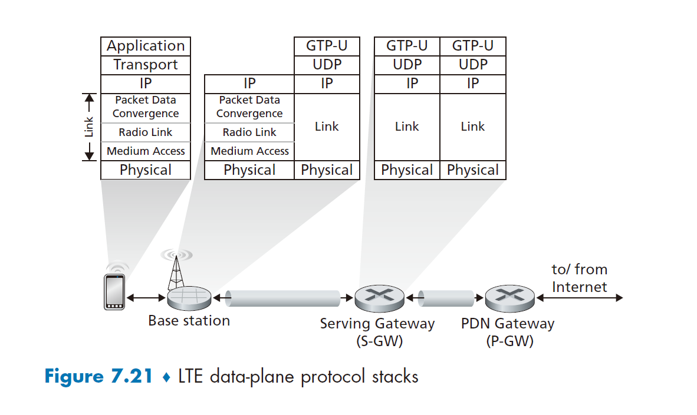

LTE 将移动设备的链路层分为了 3 个子层：

- **分组数据汇聚(Packet Data Convergence, PDC)**。这个链路层的最上层子层就在 IP 下面。分组数据汇聚协议（PDCP）[3GPP PDCP 2019]执行 IP 头/压缩，以减少通过无线链路发送的比特数，并使用密钥对 IP 数据报进行加密/解密，这些密钥是在移动设备首次连接到网络时通过 LTE 移动设备和移动管理实体（MME）之间的信令信息建立的；我们将在第 8-8-2 节介绍 LTE 安全方面。

- **无线电链路控制(Radio Link Control, RLC)**。无线电链路控制协议[3GPP RLCP 2018]执行两个重要功能。(i) 对太大而无法装入底层链路层帧的 IP 数据报进行分片（在发送方）和重新组装（在接收方），以及(ii) 通过使用基于 ACK/NAK 的 ARQ 协议，在链路层进行可靠的数据传输。回顾我们在第 3-4-1 节研究了 ARQ 协议的基本要素。

- **媒体访问控制(Medium Access Control, MAC)**。MAC 层执行传输调度，即请求和使用第 7-4-4 节中描述的无线电传输时隙。MAC 子层还执行额外的错误检测/纠正功能，包括使用冗余位传输作为前向错误纠正技术。冗余量可以根据信道条件进行调整。

图 7-21 还显示了在用户数据路径中使用隧道的情况。如上所述，这些隧道是在 MME 的控制下，在移动设备第一次连接到网络时建立的。两个端点之间的每个隧道都有一个唯一的 **隧道端点标识(tunnel endpoint identifier, TEID)**。当基站收到来自移动设备的数据报时，它会使用 GPRS 隧道协议[3GPP GTPv1-U 2019]对其进行封装，包括 TEID，并将其以 UDP 段发送至隧道另一端的服务网关。在接收端，基站解压缩隧道中的 UDP 数据报，提取以移动设备为目的地的封装的 IP 数据报，并将该 IP 数据报通过无线跳转转发给移动设备。

### 7.4.3. LTE 无线电接入网络

LTE 在下行信道上使用频分复用和时分复用的组合，被称为 **正交频分复用(Orthogonal Frequency Division Multiplexing, OFDM)**[Hwang 2009]。术语“正交”是指在不同频率的信道上发送的信号，即使信道频率间隔很近，它们之间的干扰也很小）。在 LTE 中，每个活动的移动设备在一个或多个信道频率中被分配一个或多个 0.5 毫秒的时隙。图 7-22 显示了在四个频率上分配的八个时隙。通过分配越来越多的时隙（无论是在同一频率还是在不同频率），移动设备能够实现越来越高的传输速率。移动设备之间的时隙（重新）分配可以经常进行，甚至每毫秒一次。不同的调制方案也可用于改变传输速率；见我们先前对图 7-3 和 WiFi 网络中调制方案的动态选择的讨论。

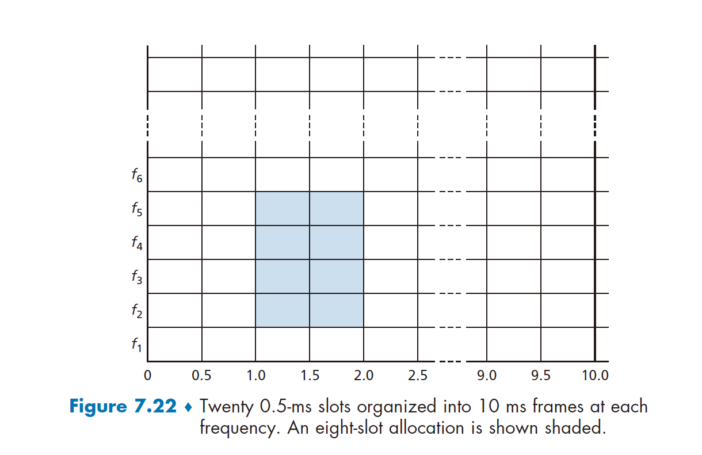

LTE 标准没有强制规定移动设备的特定时隙分配。相反，哪些移动设备将被允许在特定频率上的特定时隙中进行传输的决定是由 LTE 设备供应商和/或网络运营商提供的调度算法决定的。通过机会主义调度[Bender 2000; Kolding 2003; Kulkarni 2005]，将物理层协议与发送方和接收方之间的信道条件相匹配，并根据信道条件选择发送数据包的接收方，使基站能够充分利用无线媒介。此外，用户优先权和合同规定的服务等级（如银级、金级或白金级）可用于调度下行数据包的传输。除了上述的 LTE 功能外，LTE-Advanced 通过为移动设备分配聚合信道，可以实现数百 Mbps 的下行带 [Akyildiz 2010]。

### 7.4.4. 额外的 LTE 功能：网络附件和电源管理

在这里，让我们通过考虑另外两个重要的 LTE 功能来结束对 4G LTE 的研究：(i) 移动设备首次接入网络的过程，以及(ii) 移动设备与核心网络基本组成共同使用的技术，以管理其电力使用。

**网络附件**

移动设备连接到蜂窝运营商网络的过程大致分为三个阶段：

- **基站附件**。设备附件的第一阶段在目的上与我们在第 7.31 节中研究的 802.11 关联协议相似，但在实践中却大不相同。一个希望连接到蜂窝运营商网络的移动设备将开始一个自举过程，以了解并与附近的基站联系。移动设备最初会在所有频段的所有频道中搜索一个主要的同步信号，该信号由基站每 5 毫秒周期性地广播。一旦找到这个信号，移动设备就保持在这个频率上，并找到第二同步信号。通过在这个第二信号中发现的信息，该设备可以找到（经过几个进一步的步骤）额外的信息，如信道带宽，信道配置，以及该基站的蜂窝运营商信息。有了这些信息，移动设备可以选择一个基站与之联系（如果有的话，最好是连接到其家庭网络），并与该基站建立一个跨无线跳的控制平面信令连接。这个移动设备到基站的信道将在剩下的网络连接过程中使用。

- **相互认证**。在前面 7-4-1 节对移动性管理实体（MME）的描述中，我们注意到基站与本地 MME 联系以进行相互认证：我们将在 8-8-2 节中进一步研究这一过程。这是网络连接的第二阶段，允许网络知道连接的设备确实是与给定 IMSI 相关的设备，而移动设备知道它所连接的网络也是合法的蜂窝运营商网络。一旦这个网络连接的第二阶段完成，MME 和移动设备已经相互验证了对方，MME 也知道移动设备所连接的基站的身份。有了这些信息，MME 就可以准备配置移动设备到 PDN 网关的数据路径了。

- **移动设备到 PDN 网关的数据路径配置**。MME 与 PDN 网关（它也为移动设备提供一个 NAT 地址）、服务网关和基站联系，建立图 7-21 所示的两个隧道。一旦这个阶段完成，移动设备就能通过基站发送/接收 IP 数据报，并通过这些隧道进出互联网！（图 7-21）。

**电源管理：睡眠模式**

回顾我们之前对 802.11（第 7-3-5 节）和蓝牙（第 7-3-6 节）高级功能的讨论，无线设备中的无线电可以进入睡眠状态，以便在不发送或接收时节省电力，以尽量减少移动设备的电路需要 "打开 "发送/接收数据的时间，并用于信道感应。在 4G LTE 中，睡眠中的移动设备可以处于两种不同的睡眠状态之一。在不连续接收状态下，通常在几百毫秒的不活动后进入[Sauter 2014]，移动设备和基站将提前安排定期时间（通常相隔几百毫秒），在这些时间里，移动设备将被唤醒并积极监测下行（基站到移动设备）传输的信道；然而，除了这些预定时间外，移动设备的无线电将处于睡眠状态。

如果不连续的接收状态可以被认为是 "轻度睡眠"，那么第二个睡眠状态：空闲状态，在更长时间的 5 到 10 秒的不活动之后，可以被认为是 "深度睡眠"。在这种深度睡眠状态下，移动设备的无线电被唤醒，监测频道的频率更低。事实上，这种睡眠是如此之深，以至于如果移动设备在睡眠中移动到运营商网络中的一个新小区，它不需要通知它之前与之相关的基站。因此，当从这种深度睡眠中定期醒来时，移动设备将需要与一个（可能是新的）基站重新建立联系，以便检查由 MME 向移动设备最后联系的基站附近的基站广播的寻呼消息。这些控制平面寻呼信息是由这些基站向其所在小区的所有移动设备广播的，指示哪些移动设备应该完全唤醒并重新建立与基站的新数据平面连接（见图 7-18），以便接收传入的数据包。

### 7.4.5. 全球蜂窝网络：网络的网络

在研究了 4G 蜂窝网络架构之后，让我们退一步看看全球蜂窝网络：它本身就是一个像互联网一样的 "网络的网络"，是如何组织的。

图 7-23 显示了一个用户的移动智能手机通过一个 4G 基站连接到其家庭网络。用户的家庭移动网络由蜂窝运营商运营，如美国的 Verizon、AT&T、T-Mobile 或 Sprint；法国的 Orange；或韩国的 SK 电信。如图 7.23 所示，用户的家庭网络又通过家庭网络中的一个或多个网关路由器，与其他蜂窝运营商的网络和全球互联网相连。移动网络本身通过公共互联网或通过互联网协议包交换（IPX）网络相互连接[GSMA 2018a]。IPX 是一个专门用于蜂窝运营商互连的管理网络，类似于互联网交换点，用于互联网服务供应商之间的对接。从图 7-23 中，我们可以看到，全球蜂窝网络确实是一个 "网络的网络"：就像互联网一样。4G 网络也可以与 3G 蜂窝电话的语音/数据网络和早期的纯语音网络对等。

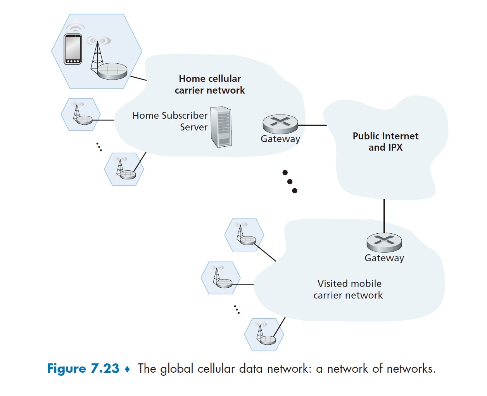

在制定了这些主题所需的基本原则后，我们很快就会回到其他 4G LTE 主题：第 7-6 节的移动性管理和第 8-8-2 节的 4G 安全。现在让我们快速了解一下新兴的 5G 网络。

### 7.4.6. 5G 蜂窝网络

最终的广域数据服务将是一种具有无处不在的千兆级连接速度、极低的延迟，以及对任何地区可支持的用户和设备数量不受限制的服务。这种服务将为各种新的应用打开大门，包括普遍的增强现实和虚拟现实，通过无线连接控制自动驾驶汽车，通过无线连接控制工厂里的机器人，以及用固定无线互联网服务（即从基站到家里的调制解调器的住宅无线连接）取代 DSL 和电缆等住宅接入技术。

预计 5G，其逐步改进的版本可能在 2020 年的十年中推出，将朝着实现最终广域数据服务的目标迈出一大步。据预测，与 4G 相比，5G 将提供大约 10 倍的峰值比特率，10 倍的延迟，以及 100 倍的流量容量[Qualcomm 2019]。

主要而言，5G 是指 "5G NR（新无线电）"，这是 3GPP 采用的标准。然而，除了 NR 之外，确实存在其他 5G 技术。例如，Verizon 专有的 5G TF 网络在 28 和 39GHz 的频率上运行，只用于固定无线互联网服务，不用于智能手机。

5G 标准将频率分为两组。FR1（450MHz-6GHz）和 FR2（24GHz-52GHz）。大多数早期部署将在 FR1 空间，尽管如上所述，截至 2020 年，在 FR2 空间有早期部署，用于固定互联网住宅接入。重要的是，5G 的物理层（即无线）方面不能向后兼容 4G 移动通信系统，如 LTE：特别是，它不能通过部署基站升级或软件更新提供给现有的智能手机。因此，在向 5G 过渡的过程中，无线运营商将需要对物理基础设施进行大量投资。

FR2 频率也被称为毫米波频率。虽然毫米波频率允许更快的数据速度，但它们也有两个主要缺点：

- 毫米波频率从基站到接收机的距离要短得多。这使得毫米波技术不适合在农村地区使用，在城市地区需要更密集地部署基站。
- 毫米波通信极易受到大气干扰。附近的树叶和雨水会给户外使用带来问题。

5G 不是一个凝聚力强的标准，而是由三个共存的标准组成[Dahlman 2018]：

- **eMBB(Enhanced Mobile Broadband)，增强型移动宽带**。5G NR 的最初部署集中在 eMBB 上，它为更高的下载和上传速度提供了更大的带宽，并且与 4G LTE 相比，适度降低了延迟。增强现实和虚拟现实，以及移动 4K 分辨率和 360° 视频流。
- **URLLC(Ultra Reliable Low-Latency Communications)**，超可靠的低延迟通信。URLLC 针对对延迟高度敏感的应用，如工厂自动化和自动驾驶。URLLC 的目标是 1 毫秒的延迟。截至本文撰写之时，实现 URLLC 的技术仍在标准化中。
- **mMTC(Massive Machine Type Communications)，大规模机器类型通信**。mMTC 是一种用于传感、计量和监测应用的窄带接入类型。5G 网络设计的一个重点是降低物联网设备的网络连接障碍。除了降低延迟外，5G 网络的新兴技术正专注于降低功率要求，使物联网设备的使用比 4G LTE 的使用更普遍。

**5G 和毫米波频率**

许多 5G 创新将是在 24GHz-52GHz 频段的毫米波频率下工作的直接结果。例如，这些频率有可能实现比 4G 增加 100 倍的容量。为了深入了解这一点，容量可以被定义为三个术语的乘积[Björnson 2017]：

```
容量 = 小区密度 * 可用频谱 * 频谱效率
```

其中小区密度以小区/km2 为单位，可用频谱以赫兹为单位，频谱效率是衡量每个基站与用户通信的效率，以 bps/Hz/小区为单位。将这些单位相乘，很容易看出容量的单位是 bps/km2。对于这三个术语中的每一个，5G 的值都会比 4G 的大。
因为毫米频率的范围比 4G LTE 频率短得多，需要更多的基站，这反过来又增加了小区密度。

- 因为 5G FR2 的工作频段比 4G LTE 大得多（最高约 2 GHz），它有更多的可用频谱。
- 关于频谱效率，信息理论说，如果你想把频谱效率提高一倍，需要增加 17 倍的功率[Björnson 2017]。5G 没有增加功率，而是使用 MIMO 技术（与我们在第 7-3 节研究 802.11 网络时遇到的技术相同），在每个基站使用多个天线。每个 MIMO 天线不是向所有方向广播信号，而是采用波束形成，将信号指向用户。MIMO 技术允许一个基站在同一频段内同时向 10-20 个用户发送信号。

通过增加容量等式中的所有三个项，5G 预计将在城市地区提供 100 倍的容量增长。同样，由于频带更宽，5G 有望提供 1Gbps 或更高的峰值下载速率。然而，毫米波信号很容易被建筑物和树木阻挡。

需要小型基站来填补基站和用户之间的覆盖空白。在一个人口众多的地区，两个小型基站之间的距离可能从 10 米到 100 米不等[Dahlman 2018]。

**5G 核心网络**

**5G 核心网络(5G Core Ntework)** 是管理所有 5G 移动语音、数据和互联网连接的数据网络。5G 核心网络正在被重新设计，以更好地与互联网和基于云的服务整合，还包括整个网络的分布式服务器和缓存，从而减少延迟。网络功能虚拟化（如第 4 章和第 5 章所讨论的），以及针对不同应用和服务的网络切片，将在核心区进行管理。

新的 5G 核心规范对移动网络支持各种不同性能的服务的方式带来了重大变化。与 4G 核心网的情况一样（回顾图 7.17 和 7.18），5G 核心网转发来自终端设备的数据流量，认证设备，并管理设备移动性。5G 核心网还包含我们在第 7.4.2 节中遇到的所有网元--移动设备、小区、基站和移动性管理实体（现在分为两个子基本组成，如下所述）、HSS 以及服务和 PDN 网关。

虽然 4G 和 5G 核心网络执行类似的功能，但在该新的 5G 核心架构中存在一些重大差异。5G 核心网是为完全控制和用户平面分离而设计的（见第五章）。5G 核心网纯粹由基于软件的虚拟化网络功能组成。这种新的架构将为运营商提供灵活性，以满足不同 5G 应用的不同要求。一些新的 5G 核心网络功能包括[Rommer 2019]。

- **用户平面功能(User-Plane Function, UPF)**。控制平面和用户平面的分离（见第 5 章）允许数据包处理被分布并推送到网络边缘。
- **接入和移动管理功能(Access and Mobility Management Function, AMF)**。5G 核心基本上将 4G 移动性管理实体（MME）分解为两个功能基本组成。AMF 和 SMF。AMF 接收来自终端用户设备的所有连接和会话信息，但只处理连接和移动性管理任务。
- **会话管理功能(Session Management Function, SMF)**。会话管理由会话管理功能（SMF）处理。SMF 负责与解耦的数据平面进行交互。SMF 还执行 IP 地址管理并扮演 DHCP 的角色。

截至目前（2020 年），5G 正处于早期部署阶段，许多 5G 标准还没有最终确定。只有时间能证明 5G 是否会成为一种普遍的宽带无线服务，是否会成功地与 WiFi 竞争室内无线服务，是否会成为工厂自动化和自动驾驶汽车基础设施的重要组成部分，以及是否会使我们向终极广域无线服务迈进一大步。

## 7.5. 移动性管理：原则

在介绍了无线网络中通信链路的无线性质之后，现在我们应该把注意力转向这些无线链路所带来的移动性。在最广泛的意义上，移动设备是指随着时间的推移改变其在网络中的附着点。因为移动性这个词在计算机和电话领域都有很多含义，所以我们首先要仔细考虑移动性的形式，这对我们有好处。

### 7.5.1. 设备移动性：网络层的视角

从网络层的角度来看，物理移动设备将给网络层带来一系列非常不同的挑战，这取决于设备在网络连接点之间移动时的活跃程度。在光谱的一端，图 7-24 中的情况（a）是移动用户自己在网络之间进行物理移动，但移动时关闭移动设备的电源。例如，一个学生可能从无线教室网络断开，并关闭他/她的设备，前往餐厅，在吃饭时连接到那里的无线接入网络，然后从餐厅网络断开并关闭电源，走到图书馆，在学习时连接到图书馆的无线网络。从网络的角度来看，这个设备不是移动的--它附着在一个接入网络上，并且在开启时保持在该接入网络中。在这种情况下，设备连续地与所遇到的每个无线接入网络联系，然后又与之断开联系。这种设备（非）移动性的情况完全可以用我们在第 7-3 和 7-4 节已经研究过的网络机制来处理。

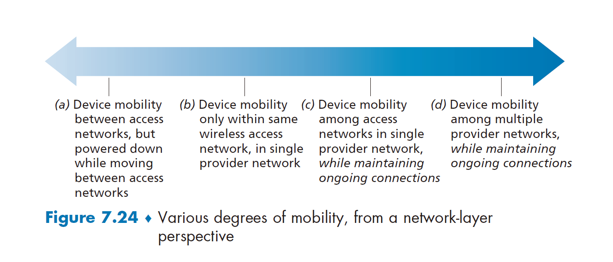

在图 7-24 中的情况（b）中，设备是物理移动的，但仍然连接到同一个接入网络。从网络层的角度来看，这个设备也是不移动的。此外，如果设备仍然与同一个 802.11 接入点或 LTE 基站相关联，从链路层的角度来看，该设备甚至不是移动的。

从网络的角度来看，我们对设备移动性的兴趣实际上是从情况（c）开始的，即设备在继续发送和接收 IP 数据报，并保持更高级别的（如 TCP）连接的同时，改变其接入网络（如 802.11 WLAN 或 LTE 小区）。在这里，网络将需要提供 **交接(handover)**：当设备在 WLAN 或 LTE 小区之间移动时，将转发数据报的责任转移到/从一个 AP 或基站到移动设备。我们将在第 7-6 节中详细介绍交接问题。如果交接发生在属于一个网络提供商的接入网络内，该提供商可以自行协调交接。当移动设备在多个供应商网络之间漫游时，如情况(d)，供应商必须共同协调交接，这使交接过程相当复杂。

### 7.5.2. 家庭网络和在被访问网络上的漫游

正如我们在第 7-4-1 节对蜂窝式 4G LTE 网络的讨论中所了解到的，每个用户都在某个蜂窝运营商那里有一个 "家"。我们了解到，**家庭用户服务(Home Subscriber Service, HSS)** 存储了每个用户的信息，包括全球唯一的设备 ID（嵌入在用户的 SIM 卡中）、用户可以访问的服务信息、用于通信的加密密钥以及账单/收费信息。当一个设备连接到其家庭网络以外的蜂窝网络时，该设备被称为在被访网络上 **漫游(roaming)**。当一个移动设备连接到一个被访网络并在该网络上漫游时，将需要在家庭网络和被访网络之间进行协调。

互联网没有类似于家庭网络或被访网络的强大概念。在实践中，一个学生的家庭网络可能是由他/她的学校运营的网络；对于移动专业人士来说，他们的家庭网络可能是他们的公司网络。被访问的网络可能是他们正在访问的学校或公司的网络。但是，在互联网的结构中并没有深深嵌入家庭/访问网络的概念。我们将在第 7-6 节简要介绍的移动 IP 协议[Perkins 1998, RFC 5944]，是一个强烈包含家庭/访问网络概念的提案。但移动 IP 在实践中的部署/使用有限。还有一些正在进行的活动是建立在现有的 IP 基础设施之上的，以提供跨访问 IP 网络的认证网络访问。Eduroam[Eduroam 2020]就是这样一项活动。

一个移动设备拥有一个家庭网络的概念提供了两个重要的优势：家庭网络提供了一个可以找到该设备信息的单一位置，并且（正如我们将看到的）它可以作为漫游移动设备的通信协调点。

为了理解信息和协调中心点的潜在价值，考虑一下人类的比喻：一个 20 多岁的成年人 Bob 搬出了家庭住宅。鲍勃开始流动，住在一系列的宿舍和公寓里，并经常改变地址。如果一个老朋友爱丽丝想要联系，爱丽丝如何才能找到鲍勃的当前地址？一个常见的方法是与家人联系，因为一个流动的 20 多岁的成年人往往会在家里登记他或她目前的地址（如果没有其他原因，那么父母可以寄钱来帮助支付租金！）。家庭住宅成为那个独特的地点，其他人可以去那里作为与鲍勃沟通的第一步。此外，后来来自 Alice 的邮政通信可能是间接的（例如，邮件首先被发送到 Bob 的家庭住宅，然后转发给 Bob）或直接的（例如，Alice 使用从 Bob 的父母那里获得的地址，直接将邮件发送给 Bob）。

### 7.5.3. 直接和间接路由至/自移动设备

现在让我们考虑一下图 7-25 中连接互联网的主机（我们将其称为通讯员）所面临的难题，该主机希望与移动设备进行通信，该设备可能位于该移动设备的蜂窝主网络内，也可能在被访问的网络中漫游。在我们下面的开发中，我们将采用 4G/5G 蜂窝网络的观点，因为这些网络在支持设备移动性方面有很长的历史。但正如我们将看到的，支持设备移动性的基本挑战和基本解决方法在蜂窝网络和互联网中都同样适用。

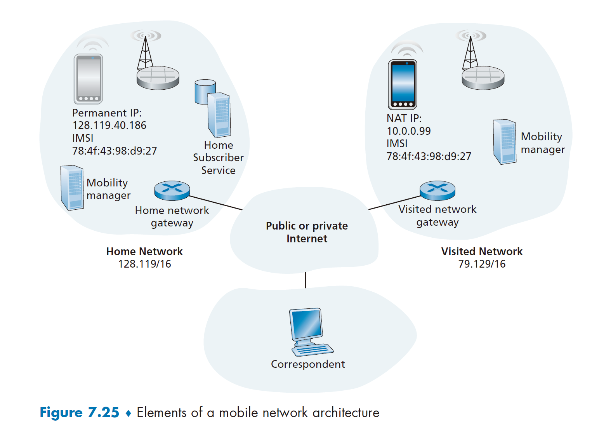

如图 7-25 所示，我们将假设移动设备有一个与之相关的全球唯一标识符。在 4G、LTE 蜂窝网络中（见第 7-4 节），这将是国际移动用户身份（IMSI）和一个相关的电话号码，存储在移动设备的 SIM 卡上。对于移动互联网用户来说，这将是其家庭网络 IP 地址范围内的一个永久的 IP 地址，正如移动 IP 架构的情况一样。

在移动网络架构中可能使用哪些方法，使通信者发送的数据报能够到达该移动设备？可以确定三种基本方法，并在下面进行讨论。正如我们将看到的，其中后两种在实践中被采用。

**充分利用现有的 IP 地址基础设施**

也许在一个被访问的网络中，向移动设备路由的最简单的方法是简单地使用现有的 IP 寻址基础设施--不给架构增加任何新的内容。还有什么比这更简单的呢？

回顾我们对图 4-21 的讨论，ISP 使用 BGP 通过列举可达网络的 CIDR 化地址范围来宣传到目的网络的路由。因此，一个被访问的网络可以向所有其他网络公布一个特定的移动设备驻留在其网络中，只需公布一个高度具体的地址--移动设备的完整的 32 位 IP 永久地址：基本上通知其他网络，它有一个路径可以用来转发数据报给该移动设备。然后，这些邻近的网络将在整个网络中传播这一路由信息，作为更新路由信息和转发表的正常 BGP 程序的一部分。由于数据报将总是被转发到为该地址宣传最具体目的地的路由器（见第 4-3 节），所有发给该移动设备的数据报将被转发到被访问的网络。如果移动设备离开一个被访网络并加入另一个被访网络，新的被访网络可以向移动设备公布一个新的、高度具体的路由，而旧的被访网络可以撤回其关于移动设备的路由信息。

这就同时解决了两个问题，而且不需要改变网络层的基础设施。其他网络知道移动设备的位置，而且很容易将数据报路由到移动设备，因为转发表会将数据报导向被访问的网络。然而，致命的缺点是可扩展性--网络路由器必须为潜在的数十亿移动设备维护转发表条目，并在设备漫游到不同网络时更新其条目。显然，这种方法在实践中是行不通的。本章末尾的问题中还探讨了一些其他的缺点。

另一种更实用的方法（也是在实践中被采用的方法）是将移动性功能从网络核心推到网络边缘--这是我们在研究互联网架构时反复出现的主题。做到这一点的一个自然方法是通过移动设备的家庭网络。就像 20 多岁的成年人的父母追踪他们孩子的位置一样，移动设备的家庭网络中的移动管理实体（MME）可以追踪移动设备所在的访问网络。这一信息可能存在于一个数据库中，如图 7.25 中的 HSS 数据库。将需要一个在被访问网络和家庭网络之间运行的协议来更新移动设备所在的网络。你可能记得，我们在研究 4G LTE 时遇到过 MME 和 HSS 元素。我们将在这里重新使用它们的元素名称，因为它们的描述性很强，同时也因为它们普遍部署在 4G 网络中。

接下来，让我们更详细地考虑图 7.25 所示的被访网络元素。移动设备显然需要一个被访问网络的 IP 地址。这里的可能性包括使用与移动设备的家庭网络相关的永久地址，在被访网络的地址范围内分配一个新的地址，或者通过 NAT 提供一个 IP 地址（见 4-3-4 节）。在后两种情况下，移动设备除了在其母网的 HSS 中存储的永久标识符外，还有一个暂时的标识符（新分配的 IP 地址）。这些情况类似于作家把信寄给我们 20 多岁的移动成年人目前居住的房子的地址。在 NAT 地址的情况下，以移动设备为目的地的数据报将最终到达被访问网络中的 NAT 网关路由器，然后它将执行 NAT 地址转换，并将数据报转发给移动设备。

在图 7-24 中，我们已经看到了解决通信者困境的一些要素：家乡和被访网络、MME 和 HSS 以及移动设备寻址。但是，数据报应该如何寻址并转发到移动设备？由于只有 HSS（而不是全网的路由器）知道移动设备的位置，通信者不能简单地将数据报寻址到移动设备的永久地址并将其送入网络。必须做更多的事情。可以确定两种方法：间接和直接路由。

**间接路由到移动设备**

让我们再次考虑想要向移动设备发送数据报的通信者。在 **间接路由(indirect routing)** 方法中，通信者只需将数据报定位到移动设备的永久地址，并将数据报发送到网络中，完全不知道移动设备是在其家庭网络中还是在被访问的网络中；因此移动性对通信者是完全透明的。这样的数据报首先像往常一样，被路由到移动设备的家庭网络。这在图 7-26 的第 1 步中有所说明。

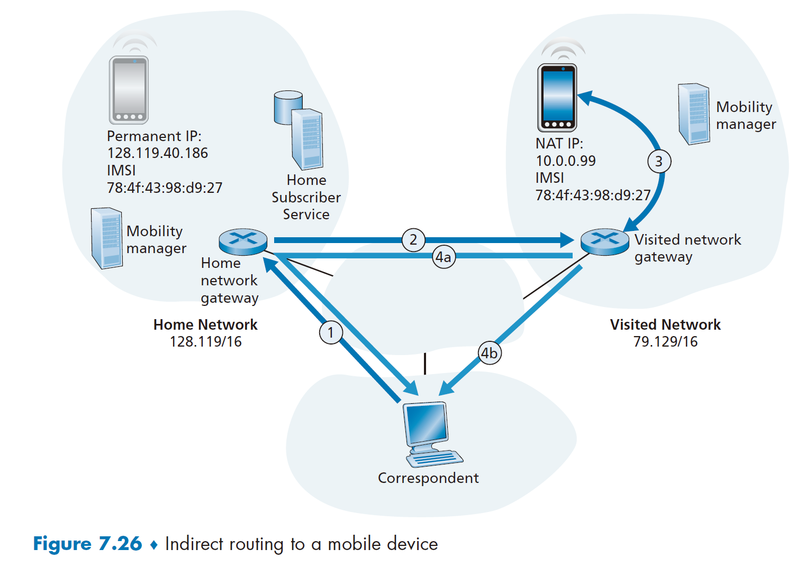

现在让我们把注意力转向 HSS，它负责与被访网络互动以跟踪移动设备的位置，以及家庭网络的网关路由器。这个网关路由器的一项工作是留意到达的数据报，这些数据报的地址是一个设备的家在该网络中，但目前居住在一个被访网络中。母网网关拦截这个数据报，与 HSS 协商，以确定移动设备所在的被访网络，并将数据报转发给被访网络网关路由器：图 7-26 中的步骤 2。被访网络网关路由器然后将数据报转发给移动设备--图 7-26 中的步骤 3。如果使用 NAT 转换，如图 7-26 所示，被访网络网关路由器执行 NAT 转换。

更详细地考虑家庭网络的重新路由是有意义的。显然，家庭网络网关将需要把到达的数据报转发到被访网络的网关路由器。另一方面，最好是让通信者的数据报保持完整，因为接收数据报的应用程序应该不知道数据报是通过家庭网络转发的。这两个目标都可以通过让家庭网关将通信者的原始完整数据报封装在一个新的（更大的）数据报中来实现。然后，这个较大的数据报被寻址并交付给被访网络的网关路由器，它将解封装数据报，即从较大的封装数据报中移除通信者的原始数据报，并将原始数据报转发（图 7-26 中的步骤 3）到移动设备。敏锐的读者会注意到，这里描述的封装/解封装正是第 4-3 节在 IPv6 背景下讨论的隧道概念；事实上，我们在图 7-18 的背景下也讨论了隧道的使用，当时我们介绍了 4G LTE 数据平面。

最后，让我们考虑一下移动设备如何将数据报发送到对应方。在图 7-26 中，移动设备显然需要通过被访网关路由器转发数据报，以执行 NAT 转换。但是，被访问的网关路由器应如何将数据报转发到对应方？如图 7.26 所示，这里有两个选择。(4a)数据报可以通过隧道返回到本地网关路由器，并从那里发送给通信者。或(4b)数据报可以从被访网络直接传送到通信方，这种方法在 LTE 中被称为 **本地突破(local breakout)** [GSMA 2019a]。

让我们通过回顾支持移动性所需的新网络层功能来总结我们对间接路由的讨论。

- 一个移动设备到被访网络的关联协议。移动设备将需要与被访网络关联，并且在离开被访网络时也同样需要解除关联。
- 被访网络到家庭网络 HSS 注册协议。被访网络将需要将移动设备的位置与家庭网络中的 HSS 注册，并可能使用从 HSS 获得的信息来进行设备认证。
- 在家庭网络网关和被访网络网关路由器之间有一个数据报隧道协议。发送方对通信者的原始数据报进行封装和转发；在接收方，网关路由器对原始数据报进行解封装、NAT 转换，并转发到移动设备。

前面的讨论提供了移动设备在网络间移动时与对应方保持持续连接的所有必要元素。当设备从一个被访网络漫游到另一个被访网络时，新的被访网络信息需要在本地网络 HSS 中更新，并且需要移动本地网关-路由器到被访网关-路由器的隧道端点。但是，移动设备在网络之间移动时，会不会看到数据报的中断流？只要移动设备从一个被访网络断开连接到下一个被访网络的时间不长，很少有数据报会丢失。回顾第三章，端到端连接会因网络拥堵而出现数据报丢失。因此，当一个设备在网络之间移动时，连接中偶尔的数据报丢失绝不是一个灾难性的问题。如果需要无损通信，上层机制将从数据报丢失中恢复，无论这种丢失是由网络拥堵还是由设备移动造成的。

我们上面的讨论已经特意有些泛化了。移动 IP 标准[RFC 5944]以及 4G LTE 网络[Sauter 2014]中使用了间接路由方法。他们的细节，特别是采用的隧道程序，与我们上面的一般性讨论有一点不同。

**直接路由到移动设备**

图 7-26 所示的间接路由方法存在一个被称为 **三角路由问题(triangle routing problem)** 的低效率问题--发给移动设备的数据报必须首先转发到母网，然后再转发到被访网络，即使在通信方和漫游移动设备之间存在一条更有效的路由。在最坏的情况下，设想一个移动用户在同一个网络上漫游，而这个网络是我们的移动用户正在访问的一个海外同事的母网。两人并排而坐，交换数据。移动用户和他的海外同事之间的数据报将被转发到移动用户的家庭网络，然后再返回到被访问的网络！这就是直接路由。

**直接路由(direct routing)** 克服了三角路由的低效率问题，但这样做的代价是增加了复杂性。在图 7-27 所示的直接路由方法中，通信员首先发现移动用户所在的被访网络。这是通过查询移动设备母网的 HSS 完成的，假设（如间接路由的情况）移动设备的被访网络在 HSS 中注册。这在图 7-27 中显示为步骤 1 和 2。然后，对应方将数据报从其网络直接传输到移动设备被访网络的网关路由器。

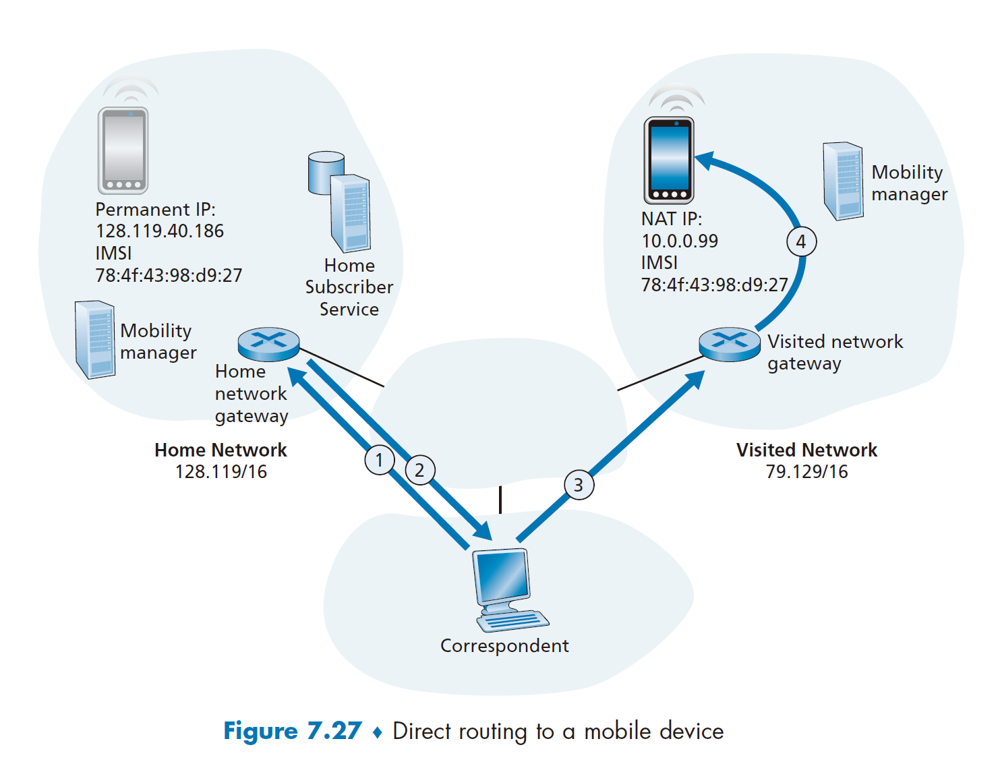

虽然直接路由克服了三角路由问题，但它引入了两个重要的额外挑战：

- 通信者需要一个移动用户位置协议来查询 HSS，以获得移动设备的访问网络（图 7-27 中的步骤 1 和 2）。这是在移动设备向其 HSS 登记其位置所需的协议之外的。
- 当移动设备从一个被访网络移动到另一个被访网络时，通信员如何知道现在要把数据报转发到新的被访网络？在间接路由的情况下，这个问题很容易解决，只要更新母网的 HSS，并改变隧道端点以终止于新访问网络的网关路由器。然而，在直接路由中，被访网络的这种变化就不容易处理了，因为 HSS 只在会话开始时被通信者查询到。因此，需要额外的协议机制，在移动设备每次移动时主动更新通信者。本章末尾的两个问题探讨了这个问题的解决方案。

## 7.6. 移动性管理：实践

在上一节中，我们确定了在开发支持设备移动性的网络架构时面临的主要基本挑战和潜在的解决方案：家庭网络和被访网络的概念；家庭网络作为订阅该家庭网络的移动设备的信息和控制中心点的作用；家庭网络的移动性管理实体需要的控制平面功能，以跟踪在被访网络中漫游的移动设备；以及直接和间接路由的数据平面方法，使通信者和移动设备能够交换数据报。现在让我们来看看这些原则是如何付诸实践的吧 在第 7-2-1 节中，我们将研究 4G/5G 网络中的移动性管理；在第 7-2-1 节中，我们将看看移动 IP，它已被提出用于互联网。

### 7.6.1. 4G/5G 网络中的移动性管理

我们在第 7.4 节中对 4G 和新兴 5G 架构的研究使我们熟悉了在 4G/5G 移动性管理中起核心作用的所有网络元素。现在让我们来说明这些网元是如何相互操作以在今天的 4G/5G 网络中提供移动性服务的[Sauter 2014; GSMA 2019b]，这些网络起源于早期的 3G 蜂窝式语音和数据网络[Sauter 2014]，甚至是早期的 2G 语音网络[Mouly 1992]。这将有助于我们综合迄今为止所学到的知识，让我们也能介绍一些更高级的话题，并为 5G 移动性管理可能出现的情况提供一个镜头。

让我们考虑一个简单的场景，在这个场景中，一个移动用户（例如，汽车中的乘客），用智能手机连接到一个被访问的 4G/5G 网络，开始从一个远程服务器传输高清视频，然后从一个 4G/5G 基站的小区覆盖范围移动到另一个。这个场景的四个主要步骤如图 7-28 所示。

1. 移动设备和基站关联。移动设备与被访网络中的一个基站关联。
2. 为移动设备配置控制平面的网元。被访网络和本地网络建立控制平面状态，表明移动设备驻留在被访网络中。
3. 移动设备的转发隧道的数据平面配置。被访网络和家庭网络建立隧道，移动设备和流媒体服务器可以通过隧道发送/接收 IP 数据报，使用间接路由通过家庭网络的分组数据网络网关（P-GW）。
4. 移动设备从一个基站到另一个基站的交接。移动设备通过从一个基站到另一个基站的交接，改变其对被访网络的附着点。

现在让我们更详细地考虑这四个步骤中的每一个。

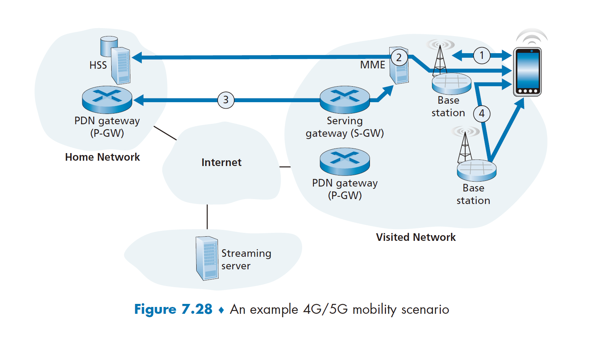

1. 基站关联。记得在 7.4.2 节中，我们研究了移动设备与基站关联的程序。我们了解到，移动设备在所有频率上监听其区域内基站发射的主要信号。移动设备逐渐获得有关这些基站的更多信息，最终选择与之联系的基站，并与该基站建立一个控制信号通道。作为这种联系的一部分，移动设备向基站提供其国际移动用户身份（IMSI），该身份能唯一地识别移动设备以及其家庭网络和其他额外的用户信息。

2. 为移动设备配置 LTE 网元的控制平面。一旦移动设备到基站的信道建立，基站就可以与被访网络中的 MME 联系。MME 将咨询和配置母网和被访网络中的一些 4G/5G 网元，代表移动节点建立状态。

MME 将使用移动设备提供的 IMSI 和其他信息来检索该用户的认证、加密和可用网络服务信息。这些信息可能在 MME 的本地缓存中，也可能是从移动设备最近联系过的另一个 MME 那里检索到的，或者是从移动设备的家庭网络中的 HSS 那里检索到的。相互认证过程（我们将在第 8.8 节中详细介绍）确保被访问的网络确信移动设备的身份，并且该设备可以认证它所连接的网络。

MME 通知移动设备母网的 HSS，移动设备现在居住在被访网络中，HSS 会更新其数据库。

基站和移动设备为移动设备和基站之间建立的数据面信道选择参数（记得控制平面信道已经在运行）。

3. 为移动设备配置转发隧道的数据平面。MME 接下来为移动设备配置数据平面，如图 7-29 所示。两个隧道被建立。一个隧道是在基站和被访网络中的服务网关之间。第二条隧道在该服务网关和移动设备本地网络中的 PDN 网关路由器之间。4G LTE 实现了这种形式的对称间接路由--所有进入/离开移动设备的流量都将通过设备的家庭网络进行隧道传输。4G/5G 隧道使用 GPRS 隧道协议（GTP），在[3GPP GTPv1-U 2019]中规定。GTP 头中的隧道端点 ID（TEID）表明数据报属于哪个隧道，允许 GTP 在隧道端点之间对多个流量进行复用和解复用。

将图 7-29（在被访问网络中移动漫游的情况）中的隧道配置与图 7-18（仅在移动设备的家庭网络中移动的情况）中的隧道配置进行比较是有意义的。我们看到，在这两种情况下，服务网关与移动设备共同驻扎在同一网络中，但 PDN 网关（它总是移动设备主网中的 PDN 网关）可能在与移动设备不同的网络中。这正是间接路由。已经指定了间接路由的替代方案，称为本地突破[GSMA 2019a]，其中服务网关与本地访问网络中的 PDN 网关建立了一条隧道。然而，在实践中，本地突破并没有被广泛使用[Sauter 2014]。

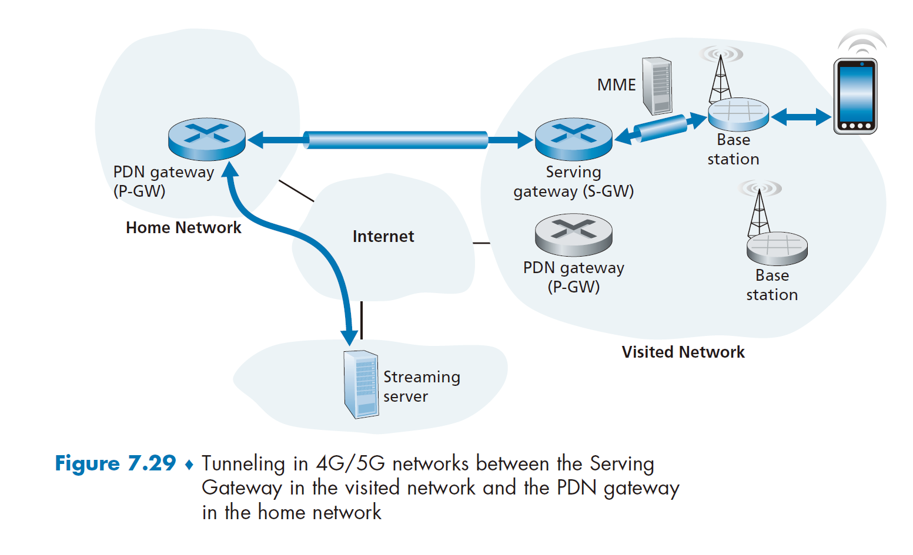

一旦隧道被配置和激活，移动设备现在可以通过其家庭网络中的 PDN 网关转发数据包到/来自互联网了

4. 交接管理。当移动设备从一个基站到另一个基站改变其关联时，就会发生交接。下面描述的切换过程是相同的，无论移动设备是驻留在其主网中，还是在被访网络中漫游。

如图 7-30 所示，最初（在交接前）通过一个基站（我们称之为源基站）转发到移动设备的数据报，交接后通过另一个基站（我们称之为目标基站）转发到移动设备。正如我们将看到的，基站之间的交接不仅导致移动设备向新的基站发送/接收信息，而且还导致图 7.29 中服务网关到基站隧道的基站端发生变化。在最简单的交接情况下，当两个基站相互靠近并在同一网络中时，由于交接而发生的所有变化都是相对局部的。特别是，被服务网关使用的 PDN 网关仍然对设备的移动性一无所知。当然，更复杂的交接场景将需要使用更复杂的机制[Sauter 2014; GSMA 2019a]。

发生交接的原因可能有几个。例如，当前基站和移动设备之间的信号可能已经恶化到严重影响通信的程度。或者一个小区可能已经过载，处理了大量的流量；将移动设备移交给附近不那么拥挤的小区可能会缓解这种拥堵。移动设备定期测量来自其当前基站的信标信号以及它能 "听到 "的附近基站的信号的特性。这些测量结果每秒一次或两次报告给移动设备的当前（源）基站。根据这些测量结果、附近小区的移动设备的当前负载以及其他因素，源基站可以选择启动移交。4G/5G 标准并没有规定基站在确定是否进行交接或选择哪个目标基站时要使用的具体算法；这是一个活跃的研究领域[Zheng 2008; Alexandris 2016]。

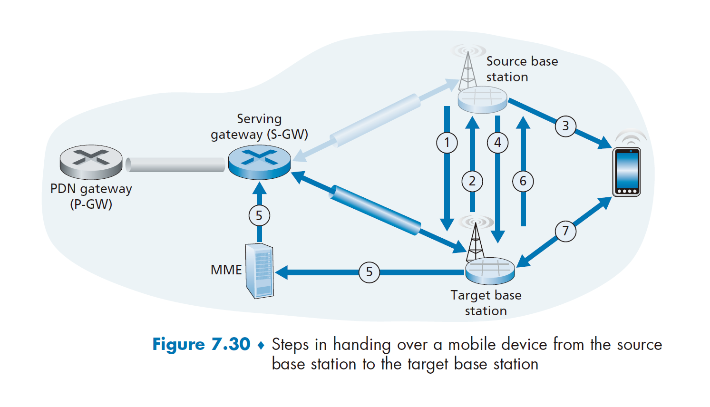

图 7-30 说明了源基站决定将移动设备移交给目标基站时的步骤。

1. 当前（源）基站选择目标基站，并向目标基站发送一个移交请求信息。
2. 目标基站检查其是否有资源支持移动设备及其服务质量要求。如果有，它就在其无线接入网络上预先分配信道资源（如时隙）和其他资源给该设备。这种预先分配资源的做法使移动设备不必通过前面讨论的耗时的基站关联协议，从而使移交工作尽可能快地执行。目标基站向源基站回复一个移交请求确认消息，其中包含移动设备与新基站关联所需的目标基站的所有信息。
3. 源基站收到移交请求确认消息后，将目标基站的身份和信道接入信息通知移动设备。这时，移动设备可以开始向新的目标基站发送/接收数据报。从移动设备的角度来看，移交工作已经完成。然而，在网络内仍有一些工作要做。
4. 源基站也将停止向移动设备转发数据报，而是将其收到的任何隧道数据报转发给目标基站，目标基站随后将这些数据报转发给移动设备。
5. 目标基站通知 MME，它（目标基站）将成为为移动设备服务的新基站。反过来，MME 向服务网关和目标基站发出信号，重新配置服务网关到基站的隧道，使其终止于目标基站，而不是源基站。
6. 目标基站向源基站确认隧道已被重新配置，允许源基站释放与该移动设备相关的资源。
7. 此时，目标基站也可以开始向移动设备传送数据报，包括源基站在移交期间转发到目标基站的数据报，以及从服务网关重新配置的隧道上新到达的数据报。它还可以将从移动设备收到的出站数据报转发到服务网关的隧道内。

今天的 4G LTE 网络中的漫游配置，如上面讨论的，也将用于未来新兴的 5G 网络[GSMA 2019c]。然而，从我们在第 7.4-6 节的讨论中可以看出，5G 网络将更加密集，小区规模明显缩小。这将使交接成为更重要的网络功能。此外，低切换延迟对于许多实时的 5G 应用是至关重要的。我们在第五章[GSMA 2018b; Condoluci 2018]中研究的蜂窝网络控制平面向 SDN 框架的迁移，有望实现更高容量、更低延迟的 5G 蜂窝网络控制平面。SDN 在 5G 背景下的应用是大量研究的主题[Giust 2015 Ordonez-Lucena 2017; Nguyen 2016]。

### 7.6.2. 移动 IP

今天的互联网没有任何广泛部署的基础设施，为 “在路上”的移动用户提供我们遇到的 4G/5G 蜂窝网络的那种服务。但是，这当然不是因为缺乏在互联网环境中提供这种服务的技术解决方案！事实上，移动 IP 架构和协议[RFC 59]。事实上，我们将在下面简要讨论的移动 IP 架构和协议[RFC 5944]已经被互联网 RFC 标准化了 20 多年，而且对新的、更安全和更通用的移动解决方案的研究也在继续[Venkataramani 2014]。

相反，也许是缺乏激励性的商业和使用案例[Arkko 2012]，以及蜂窝网络中替代移动性解决方案的及时开发和部署，阻碍了移动 IP 的部署。回顾 20 年前，2G 蜂窝网络已经为移动语音服务（移动用户的 "杀手级应用"）提供了解决方案；此外，支持语音和数据的下一代 3G 网络也即将面世。也许双技术解决方案--当我们真正移动和 "在路上 "时通过蜂窝网络提供移动服务（即图 7.24 中移动性频谱的最右边），当我们静止或局部移动时通过 802.11 网络或有线网络提供互联网服务（即图 7-24 中移动性频谱的最左边）：我们在 20 年前拥有，今天仍然拥有，这将持续到未来。

尽管如此，在此简要介绍一下移动 IP 标准还是很有意义的，因为它提供了许多与蜂窝网络相同的服务，并实现了许多相同的基本移动性原则。本教科书的早期版本对移动 IP 的研究比我们在这里提供的更加深入；感兴趣的读者可以在本教科书的网站上找到这些退役的材料。支持移动性的互联网架构和协议，统称为移动 IP，主要在 RFC 5944 中为 IPv4 定义。移动 IP，像 4G/5G 一样，是一个复杂的标准，需要一整本书来详细描述；事实上，这样的一本书就是[Perkins 1998b]。我们在这里的适度目标是对移动 IP 的最重要方面进行概述。

移动 IP 的整体结构和元素与蜂窝电话供应商网络的结构和元素惊人地相似。有一个很强的家庭网络的概念，在这个网络中，移动设备有一个永久的 IP 地址，而被访问的网络（在移动 IP 中被称为 "外国 "网络），移动设备将被分配一个关心地址。移动 IP 中的主代理具有与 LTE HSS 类似的功能：它通过接收移动设备所访问的外国网络中的外国代理的更新来跟踪移动设备的位置，就像 HSS 接收 4G 移动设备所在的访问网络中的移动性管理实体（MMEs）的更新一样。而且，4G/5G 和移动 IP 都使用间接路由到移动节点，使用隧道来连接本地和被访/国外网络的网关路由器。下表总结了移动 IP 架构的要素，以及与 4G/5G 网络中类似要素的比较。

| 4G/5G 基本组成                                                                             | 移动 IP 基本组成                                                 | 讨论                             |
| ------------------------------------------------------------------------------------------ | ---------------------------------------------------------------- | -------------------------------- |
| 家庭网络                                                                                   | 家庭网络                                                         |                                  |
| 被访网络                                                                                   | 外部网络                                                         |                                  |
| IMSI 标识符                                                                                | 永久 IP 地址                                                     | 全球唯一可路由地址信息           |
| 家庭用户服务(HSS)                                                                          | 家庭代理                                                         |                                  |
| 移动性管理实体(MME)                                                                        | 外部代理                                                         |                                  |
| 数据平面：通过家庭网络间接转发，在家庭和被访网络之间有隧道，在移动设备所在的网络内有隧道。 | 数据平面：通过家庭网络间接转发，在家庭网络和被访网络之间有隧道。 |                                  |
| 基站                                                                                       | 接入点(AP)                                                       | 移动 IP 中未规定具体的接入点技术 |
| 无线电接入网络                                                                             | WLAN                                                             | 移动 IP 中未规定具体的 WLAN 技术 |

移动 IP 标准由三个主要部分组成：

- 代理发现。移动 IP 定义了外国代理用来向希望加入其网络的移动设备宣传其移动服务的协议。这些服务将包括向移动设备提供一个用于外国网络的地址，在移动设备的主网络中向主代理注册移动设备，以及转发进出移动设备的数据报，以及其他服务。
- 与主代理的注册。移动 IP 定义了由移动设备和/或外国代理使用的协议，以便在移动设备的主代理处注册和取消注册地址的照顾。
- 数据报的间接路由。移动 IP 还定义了数据报被主代理转发给移动设备的方式，包括转发数据报和处理错误条件的规则，以及几种形式的隧道[RFC 2003, RFC 2004]。

同样，我们在这里对移动 IP 的报道也是有意的简短。有兴趣的读者应该参考本节中的参考文献，或者在本教科书的早期版本中对移动 IP 进行更详细的讨论。

## 7.7. 无线和移动性：对高层协议的冲击

在本章中，我们看到无线网络与有线网络在链路层（由于无线信道特性，如衰减、多径和隐藏终端）和网络层（由于移动用户会改变他们对网络的附着点）都有很大的区别。但在传输层和应用层是否存在重要的差异？我们很容易认为这些差异会很微小，因为网络层为有线和无线网络的上层提供相同的尽力交付服务模型。同样地，如果 TCP 或 UDP 等协议被用来为有线和无线网络中的应用提供传输层服务，那么应用层也应该保持不变。在某种意义上，我们的直觉是正确的--TCP 和 UDP 可以（而且确实）在有无线链路的网络中运行。另一方面，一般的传输协议，特别是 TCP，在有线和无线网络中有时会有非常不同的性能，而正是在这里，就性能而言，差异是体现出来的。让我们来看看原因。

回顾一下，TCP 重发一个在发送方和接收方之间的路径上丢失或损坏的段。在移动用户的情况下，丢失可能是由于网络拥堵（路由器缓冲区溢出）或切换（例如，在将网段重新路由到移动用户的新连接点时的延迟）造成的。在所有情况下，TCP 的接收方到发送方的 ACK 只表明没有完整地收到一个网段；发送方不知道该网段是由于拥堵、切换期间还是由于检测到的比特错误而丢失的。在所有情况下，发送方的响应都是一样的，即重新发送该段。TCP 的拥塞控制响应在所有情况下也是一样的--TCP 减少其拥塞窗口，如第 3-7 节所述。通过无条件地减少其拥塞窗口，TCP 隐含地假定网段丢失是由拥塞而不是由损坏或移交引起的。我们在第 7-2 节中看到，无线网络中的比特错误比有线网络中更常见。当发生这样的比特错误或发生交接损失时，TCP 发送方确实没有理由减少其拥塞窗口（并因此减少它的发送速率）。) 事实上，很可能是路由器的缓冲区是空的，数据包在端到端的路径上流动，没有受到拥塞的阻碍。

研究人员在 20 世纪 90 年代初至中期意识到，鉴于无线链路上的高误码率和交接损失的可能性，TCP 的拥塞控制响应在无线环境中可能会出现问题。有三大类方法可以用来处理这个问题。

本地恢复。本地恢复协议在比特错误发生的时间和地点（例如，在无线链路上）进行恢复，例如，我们在第 7-3 节中研究的 802.11 ARQ 协议，或者我们在第 7-4-2 节中看到的同时使用 ARQ 和 FEC[Ayanoglu 1995]的更复杂的方法，在 4G/5G 网络中使用。

TCP 发送器对无线链路的认识。在本地恢复方法中，TCP 发送方完全不知道它的段正在穿越无线链路。另一种方法是让 TCP 发送方和接收方意识到无线链路的存在，区分有线网络中发生的拥塞损失和无线链路中发生的损坏/损失，并仅在应对拥塞的有线网络损失时调用拥塞控制。[Liu 2003]研究了区分端到端路径的有线和无线段的损失的技术。[Huang 2013]提供了关于开发对 LTE 更友好的传输协议机制和应用的见解。

分离式连接方法。在分割连接方法中[Bakre 1995]，移动用户和其他端点之间的端到端连接被分解成两个传输层连接：一个从移动主机到无线接入点，一个从无线接入点到其他通信端点（我们在这里假设是一个有线主机）。因此，端到端的连接是由无线部分和有线部分连接而成的。无线部分的传输层可以是标准的 TCP 连接[Bakre 1995]，也可以是在 UDP 之上专门定制的错误恢复协议。[Yavatkar 1994]研究了在无线连接上使用传输层的选择性重复协议。[Wei 2006]中报告的测量结果表明，分裂的 TCP 连接已经在蜂窝数据网络中被广泛使用，而且通过使用分裂的 TCP 连接确实可以获得显著的改善。

我们在这里对无线链路上的 TCP 的处理必然是简单的。对无线网络中的 TCP 挑战和解决方案的深入调查可以在[Hanabali 2005; Leung 2006]中找到。我们鼓励你查阅参考文献，以了解这个正在进行的研究领域的细节。

在考虑了传输层协议之后，让我们接下来考虑无线和移动性对应用层协议的影响。由于无线频谱的共享性，在无线链路上运行的应用，特别是在蜂窝式无线链路上运行的应用，必须把带宽作为一种稀缺商品。例如，为在 4G 智能手机上执行的网络浏览器提供内容的网络服务器，很可能无法提供与在有线连接上运行的浏览器相同的图像丰富的内容。尽管无线链接确实在应用层提供了挑战，但它们所带来的移动性也使丰富的位置感知和环境感知应用成为可能[Baldauf 2007]。更广泛地说，无线和移动网络将继续在实现未来的泛在计算环境中发挥关键作用[Weiser 1991]。可以说，当谈到无线和移动网络对网络化应用及其协议的影响时，我们只看到了冰山一角！

## 7.8. 通过 wireshark 观察 802.11(WiFi)

**time : 2021-07-15**

# 8. 计算机网络中的安全

早在 1-6 节我们就描述了某些非常盛行和危险的因特网攻击，包括恶意软件攻击、拒绝服务、嗅探、源伪装以及报文修改和删除。尽管我们已经学习了有关计算机网络的大量知识，但仍然没有考察如何使网络安全，使其免受那些攻击的威胁。在获得了新的计算机 网络和因特网协议的专业知识后，我们现在将深入学习安全通信，特别是计算机网络能够防御那些令人厌恶的坏家伙的原理。

我们首先介绍一下 Alice 和 Bob,这俩人要进行通信，并希望该通信过程是“安全” 的。由于本书是一本网络教科书，因此 Alice 和 Bob 可以是两台需要安全地交换路由表的路由器，也可以是希望建立一个安全传输连接的客户和服务器，或者是两个交换安全 电子邮件的电子邮件应用程序，所有这些学习案例都是在本章后面我们要考虑的。总之，Alice 和 Bob 是安全领域中两个众所周知的固定设备，也许因为使用 Alice 和 Bob 更为有趣，这与命名为“A”的普通实体需要安全地与命名为“B”的普通实体进行通信的作用是一样的。需要安全通信的例子通常包括不正当的情人关系、战时通信和商业事务往来。我们宁愿用第一个例子而不用后两个例子，并使用 Alice 和 Bob 作为发送方和接收方，以第一种情况为背景来讨论问题。

我们说过 Alice 和 Bob 要进行通信并希望做到“安全”，那么此处的安全其确切含义是 什么呢？如我们将看到的那样，安全性（像爱一样）是多姿多彩的东西；也就是说，安全 性有许多方面。毫无疑问，Alice 和 Bob 希望他们之间的通信内容对于窃听者是保密的。他们可能也想要确保当他们进行通信时，确实是在和对方通信，还希望如果他们之间的通 信被窃听者篡改，他们能够检测到该通信已被篡改破坏。在本章的第一部分，我们将讨论能够加密通信的密码技术，鉴别正在与之通信的对方并确保报文完整性。

在本章的第二部分，我们将研究基本的密码学原则怎样用于生成安全的网络协议。我们再次采用自顶向下方法，从应用层开始，逐层（上面四层）研究安全协议。我们将研究如何加密电子邮件，如何加密一条 TCP 连接，如何在网络层提供覆盖式安全性，以及如何使无线 LAN 安全。在本章的第三部分，我们将考虑运行的安全性，这与保护机构网络免受攻击有关。特别是，我们将仔细观察防火墙和入侵检测系统是怎样加强机构网络的安全性的。

## 8.1. 什么是网络安全

我们还是以要进行“安全”通信的情人 Alice 和 Bob 为例，开始网络安全的研究。这确切地意味着什么呢？显然，Alice 希望即使他们在一个不安全的媒体上进行通信，也只有 Bob 能够理解她所发送的报文，其中入侵者（入侵者名叫 Trudy）能够在该媒体上截获 从 Alice 向 Bob 传输的报文。Bob 也需要确保从 Alice 接收到的报文确实是由 Alice 所发送 的，并且 Alice 要确保和她进行通信的人的确就是 Bob。Alice 和 Bob 还要确保他们报文的内容在传输过程中没有被篡改。他们首先要确信能够通信（即无人拒绝他们接入通信所需的资源)。考虑了这些问题后，我们能够指出 **安全通信(secure communication)** 具有下列所需要的特性。

- **机密性(confidentiality)**。仅有发送方和希望的接收方能够理解传输报文的内容。 因为窃听者可以截获报文，这必须要求报文在一定程度上进行 **加密(encrypted)**，使截取的报文无法被截获者所理解。机密性的这个方面大概就是通常意义上对于 术语安全通信的理解。我们将在 8-2 节中学习数据加密和解密的密码学技术。
- **报文完整性(message integrity)**。Alice 和 Bob 希望确保其通信的内容在传输过程 中未被改变——或者恶意篡改或者意外改动。我们在可靠传输和数据链路协议中 遇到的检验和技术在扩展后能够用于提供这种报文完整性，我们将在 8-3 节中研究该主题。
- **端点鉴别(end-point authentication)**。发送方和接收方都应该能证实通信过程所涉及 的另一方，以确信通信的另一方确实具有其所声称的身份。人类的面对面通信可以 通过视觉识别轻易地解决这个问题。当通信实体在不能看到对方的媒体上交换报文时，鉴别就不是那么简单了。当某用户要访问一个邮箱时，邮件服务器如何证实该用户就是他所声称的那个人呢？我们将在 8-4 节中学习端点鉴别技术。
- **运行安全性(operational security)**。几乎所有的机构(公司、大学等)今天都有了与公共因特网相连接的网络。这些网络都因此潜在地能够被危及安全。攻击者能够试图在网络主机中安放蠕虫，获取公司秘密，勘察内部网络配置并发起 DoS 攻击。我们将在 8-9 节中看到诸如防火墙和入侵检测系统等运行设备正被用于反制 对机构网络的攻击。防火墙位于机构网络和公共网络之间，控制接入和来自网络的分组。入侵检测系统执行“深度分组检查”任务，向网络管理员发岀有关可疑活动的警告。

明确了我们所指的网络安全的具体含义后，接下来考虑入侵者可能要访问的到底是哪 些信息，以及入侵者可能采取哪些行动。图 8-1 阐述了一种情况。Alice (发送方)想要发 送数据给 Bob (接收方)。为了安全地交换数据，即在满足机密性、端点鉴别和报文完整性要求的情况下，Alice 和 Bob 交换控制报文和数据报文(以非常类似于 TCP 发送方和接 收方双方交换控制报文和数据报文的方式进行)。通常将这些报文全部或部分加密。如在 1-6 节所讨论的那样，入侵者能够潜在地执行下列行为：

- **窃听**：监听并记录信道上传输的控制报文和数据报文。
- 修改、插入或删除报文或报文内容。

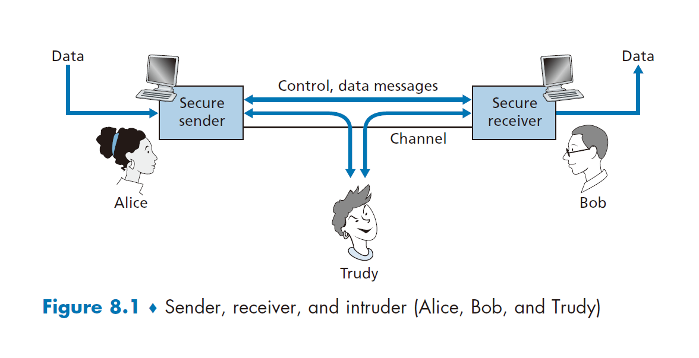

如我们将看到的那样，除非采取适当的措施，否则上述能力使入侵者可以用多种方式发动各种各样的安全攻击：窃听通信内容（可能窃取口令和数据），假冒另一个实体, “劫持” 一个正在进行的会话，通过使系统资源过载拒绝合法网络用户的服务请求等等。CERT 协调中心对已报道的攻击进行了总结［CERT 2016]。

已经知道在因特网中某处的确存在真实的威胁，则 Alice 和 Bob （两个需要安全通信 的朋友）在因特网上的对应实体是什么呢？当然，Alice 和 Bob 可以是位于两个端系统的 人类用户，例如，真实的 Alice 和真实的 Bob 真的需要交换安全电子邮件。他们也可以参与电子商务事务。例如，真实的 Bob 希望安全地向一台 Web 服务器传输他的信用卡号码，以在线购买商品。类似地，真实的 Alice 要与银行在线交互。需要安全通信的各方自身也可能是网络基础设施的一部分。前面讲过，域名系统（DNS,参见 2-4 节）或交换路由选 择信息的路由选择守护程序（参见第 5 章）需要在两方之间安全通信。对于网络管理应用也有相同的情况，第 5 章讨论了该主题。主动干扰 DNS 查找和更新（如在 2-4 节中讨论的 那样）、路由选择计算［RFC 4272］或网络管理功能［RFC 3414］的入侵者能够给因特网造成不可估量的破坏。

建立了上述框架，明确了一些重要定义以及网络安全需求之后，我们将深入学习密码学。应用密码学来提供机密性是不言而喻的，同时我们很快将看到它对于提供端点鉴别、报文完整性也起到了核心作用，这使得密码学成为网络安全的基石。

## 8.2. 密码学的原则

尽管密码学的漫长历史可以追溯到朱利叶斯・凯撒（Julius Caesar）时代，但现代密 码技术（包括今天的因特网中正在应用的许多技术）基于过去 30 年所取得的进展。Kahn 的著作《破译者（Tlie Codebreakers）》（［Kahn 1967］和 Singh 的著作《编码技术：保密的科学-从古埃及到量子密码（The Code Book: The Science of Secrecy from Ancient Egypt to Quantum Cryptography》［Singh 1999］回顾了引人入胜的密码学的悠久历史。对密码学的全面讨论需要一本完整的书［Kaufman 1995； Schneier 1995］，所以我们只能初步了解密码学的基本方面，特别是因为这些东西正在今天的因特网上发挥作用。我们也注意到，尽管本节的重点是密码学在机密性方面的应用，但我们将很快看到密码学技术与鉴别、报文完整性和不可否认性等是紧密相关的。

密码技术使得发送方可以伪装数据，使入侵者不能从截取到的数据中获得任何信息。当然，接收方必须能够从伪装的数据中恢复出初始数据。图 8-2 说明了一些重要的术语。

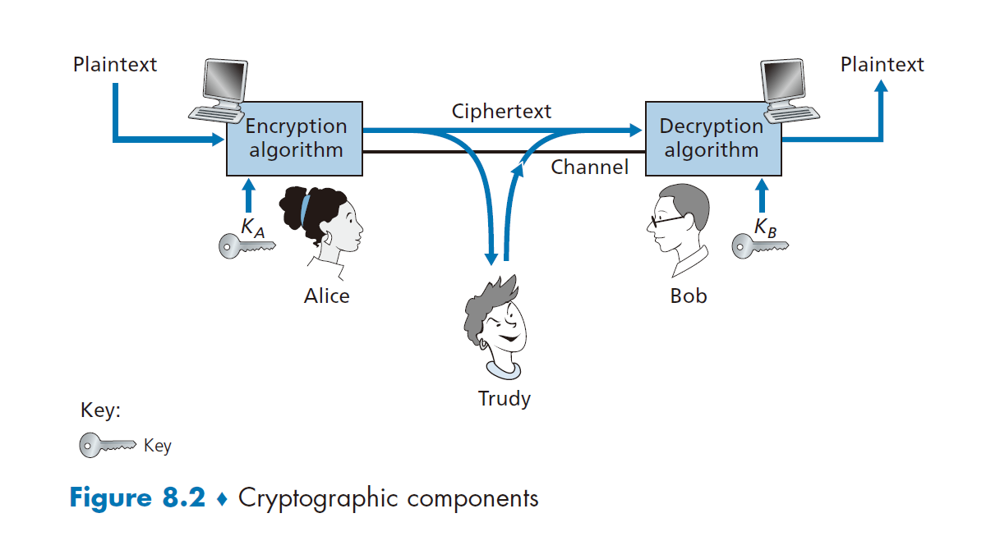

现在假设 Alice 要向 Bob 发送一个报文。Alice 报文的最初形式(例如，“Bob, I love you. Alicen”)被称为 **明文(plaintext, cleartext)**。Alice 使用 **加密算法(encryption algorithm)** 加密其明文报文，生成的加密报文被称为 **密文(ciphertext)**，该密文对任何入侵者看起来是不可懂的。有趣的是在许多现代密码系统中，包括因特网上所使用的那些，加密技术本身是已知的，即公开发行的、标准化的和任何人都可使用的(例如[RFC 1321； RFC 3447； RFC 2420； NIST 2001])，即使对潜在的入侵者也是如此！显然，如果任何人都知道数据编码的方法，则一定有一些秘密信息可以阻止入侵者解密被传输的数据。这些秘密信息就是密钥。

在图中，Alice 提供了一个 **密钥(key)** $K_A$，它是一串数字或字符，作为加密算法的输入。加密算法以密钥和明文报文 m 为输入，生成的密文作为输出。用符号$K_A(m)$表示(使用密钥$K_A$加密的)明文报文加的密文形式。使用密钥心的实际加密算法显然与上下文有关。类似地，Bob 将为 **解密算法(decryption algorithm)** 提供密钥$K_B$将密文和 Bob 的密钥作为输入，输出初始明文。也就是说，如果 Bob 接收到一个加密的报文$K_A(m)$，他可通过计算 $K_B(K_A(m)) = m$进行解密。在 **对称密钥系统(symmetric key system)** 中，Alice 和 Bob 的密钥是相同的并且是秘密的。在 **公开密钥系统(public key system)**中，使用一对密钥：一个密钥为 Bob 和 Alice 俩人所知(实际上为全世界所知)，另一个密钥只有 Bob 或 Alice 知道(而不是双方都知道)。在下面两小节中，我们将更为详细地考虑对称密钥系统和公钥系统。

### 8.2.1. 对称密钥密码学

所有密码算法都涉及用一种东西替换另一种东西的思想，例如，取明文的一部分进行计算，替换适当的密文以生成加密的报文。在分析现代基于密钥的密码系统之前，我们首先学习一下 **凯撒密码(Caesar cipher)** 找找感觉，这是一种加密数据的方法。这种非常古老而简单的对称密钥算法由 Julius Caesar 发明。

凯撒密码用于英语文本时，将明文报文中的每个字母用字母表中该字母后第 k 个字母进行替换(允许回绕，即把字母 a 排在字母 z 之后)。例如，如果 k=3，则明文中的字母变成密文中的字母“d”；明文中的字母“b”变成密文中的字母“e”，依此类推。因此，k 的值就作为密钥。举一个例子，明文报文“bob, i love you. alice”在密文中变成“ere, l oryh brx. dolfh”。尽管密文看起来像乱码，但如果你知道使用了凯撒密码加密，因为密钥值只有 25 个，所以用不了多久就可以破解它。

凯撒密码的一种改进方法是 **单码代替密码(monoalphabetic cipher)**，也是使用字母表中的一个字母替换该字母表中的另一个字母。然而，并非按照规则的模式进行替换(例如，明文中的所有字母都用偏移量为 k 的字母进行替换)，只要每个字母都有一个唯一的替换字母，任一字母都可用另一字母替换，反之亦然。图为加密明文的一种可行替换规则。

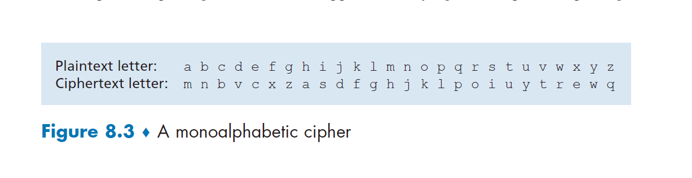

明文报文"bob, i love you. alice"变成"nkn, s gktc wky. mgsbc”。因此，与用凯撒密码情况一样，这看起来像乱码。单码代替密码的性能看来要比凯撒密码的性能好得多，可能的字母配对为 26!(10^26 数量级)种，而不是 25 种。尝试所有 10^26 种可能配对的蛮力法要求的工作量太大，不是一种破解加密算法和解密报文的可行方式。但是，通过对明文语言进行统计分析，例如，在典型的英语文本中，由于已知字母“e”和字母“t”出现的频率较高（这些字母岀现的频率分别为 13%和 9%），并且常见的两三个字母的组合通常一起出现（例如，“in” “it” “the” “ion” “ing”等等），这就使得破解该密文变得相对容易。如果入侵者具有某些该报文的可能内容的知识，则破解该密码就会更为容易。例如，如果入侵者 Trudy 是 Bob 的妻子，怀疑 Bob 和 Alice 有暧昧关系，则她猜想“bob”和“alice”这些名字可能会出现在密文中。如果 Trudy 确信这两个名字出现在密文中，并有了上述报文的密文副本，则她能够立即决定这 26 个字母配对中的 7 个，比蛮力法少检查 10^9 种可能性。如果 Trudy 的确怀疑 Bob 有不正当的男女关系，她可能也非常期待从该报文中找到某些其他选择的词汇。

当考虑 Trudy 破解 Bob 和 Alice 之间加密方案的难易程度时，可以根据入侵者所拥有的信息分为三种不同的情况。

- **唯密文攻击**。有些情况下，入侵者只能得到截取的密文，也不了解明文报文的内容。我们已经看到，统计分析有助于对加密方案的 **唯密文攻击(ciphertext-only attack)**。
- **已知明文攻击**。前面已经看到，如果 Trudy 以某种方式确信在密文报文中会出现"bob”和"alice"，她就可以确定字母 a、l、i、c、e、b 和 o 的（明文，密文）匹配关系。Trudy 也可能会幸运地记录到传输的所有密文，然后在一张纸上找到 Bob 写下的已解密的明文。当入侵者知道（明文，密文）的一些匹配时，我们将其称为对加密方案的 **已知明文攻击(known-plaintext attack)**。
- **选择明文攻击**。在 **选择明文攻击(chosen-plaintext attack)** 中，入侵者能够选择某一明文报文并得到该明文报文对应的密文形式。对于我们前面所说的简单加密算法来说，如果 Trudy 能让 Alice 发送报文"The quick brown fox jumps over the lazy dog”，则 Trudy 就能够完全破解 Alice 和 Bob 所使用的加密方案。但是随后我们将看到，对于更为复杂的加密技术来说，使用选择明文攻击不一定意味着能够攻破该加密机制。

500 年前，发明了 **多码代替密码(polyalphabetic encryption)**，这种技术是对单码代替密码的改进。多码代替密码的基本思想是使用多个单码代替密码，一个单码代替密码用于加密某明文报文中一个特定位置的字母。因此，在某明文报文中不同位置出现的相同字母可能以不同的方式编码。图 8-4 中显示了多码代替密码机制的一个例子。它使用两个凯撒密码（其中 k=5 和 k=19），如图中不同的行所示。我们可以选择使用这两个凯撒密码 C1 和 C2，加密时采用以 C1，C2，C2，C1，C2 的次序循环的模式，即明文的第一个字母用 C1 编码，第二和第三个字母用 C2 编码，第四个字母用 C1 编码，第五个字母用 C2 编码，然后循环重复该模式，即第六个字母用 C1 编码，第七个字母用 C2 编码，依此类推。这样一来，明文报文“bob, i love you.”加密后成为“ghu, n etox dhz.”。注意到明文报文中的第一个“b”用加密为“g”，第二个“b”用 C2 加密为“u”。在这个例子中，加密和解密“密钥”是两个凯撒密码密钥（k=5 和 k=19）和 C1, C2, C2, C1, C2 的次序模式的知识。

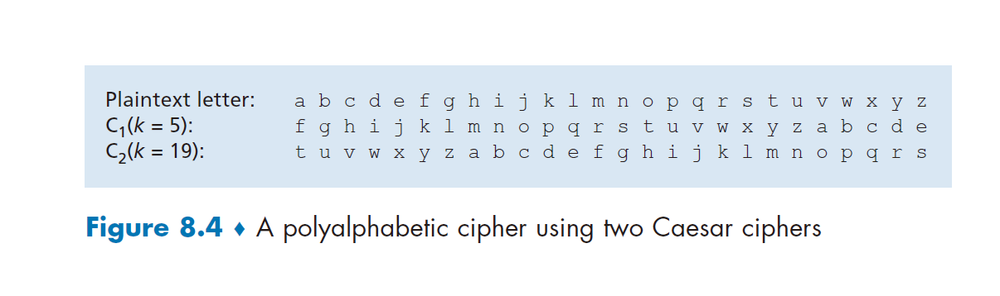

1. **块密码**

我们现在回到现代社会中，考察对称密钥加密今天的工作方式。对称加密技术有两种宽泛的类型：**流密码(stream cipher)** 和 **块密码(block cipher)**。当我们研究无线 LAN 的安全性时，将在 8-7 节中简要地研究流密码。在本节中，我们关注块密码，该密码用在多种因特网协议的加密中，包括 PGP（用于安全电子邮件）、SSL（用于使 TCP 连接更安全）和 IPsec（用于使网络层传输更安全）。

在块密码中，要加密的报文被处理为 k 比特的块。例如，如果 k = 64，则报文被划分为 64 比特的块，每块被独立加密。为了加密一个块，该密码采用了一对一映射，将力 k 特块的明文映射为 k 比特块的密文。我们来看一个例子。假设 k=3，因此块密码将 3 比特输入（明文）映射为 3 比特输出（密文）。下表给出了一种可能的映射。注意到这是一个一对一的映射，即对每种输入有不同的输出。这种块密码将报文划分成 3 比特的块并根据映射关系进行加密。可以验证，报文 010110001111 被加密成了 101000111001。

| 输入 | 输出 |
| ---- | ---- |
| 000  | 110  |
| 001  | 111  |
| 010  | 101  |
| 011  | 100  |
| 100  | 011  |
| 101  | 010  |
| 110  | 000  |
| 111  | 001  |

继续这个 3 比特块的例子，注意到上述映射只是许多可能映射中的一种。有多少种可能的映射呢？要回答这个问题，观察到一个映射只不过是所有可能输入的排列。共有 2^3=8）种可能的输入（排列在“输入”栏中）。这 8 种输入能够排列为 8! =40320 种不同方式。因为这些排列的每种都定义了一种映射，共有 40320 种可能的映射。我们能够将这些映射的每种视为一个密钥，即如果 Alice 和 Bob 都知道该映射（密钥），他们能够加密和解密在他们之间发送的报文。

对这种密码的蛮力攻击即通过使用所有映射来尝试解密密文。仅使用 40320 种映射（当 k = 3），这能够在一台桌面 PC 上迅速完成。为了挫败蛮力攻击，块密码通常使用大得多的块，由 64 比特甚至更多比特组成。注意到对于通常的 k 比特块密码，可能映射数量是 2^k!，对于即使不大的 k 值（如 k = 64），这也是一个天文数字。

如刚才所述，尽管全表块密码对于不大的 k 值能够产生健壮的对称密钥加密方案，但不幸的是它们难以实现。对于 k =64 和给定的映射，将要求 Alice 和 Bob 维护一张具有 2^64 个输入值的表，这是一个难以实现的任务。此外，如果 Alice 和 Bob 要改变密钥，他们将不得不每人重新生成该表。因此，全表块密码在所有输入和输出之间提供了预先决定的映射（如在上述例子中那样），这简直是不可能实现的事。

取而代之的是，块密码通常使用函数模拟随机排列表。在图 8-5 中显示了当 k=64 时 这种函数的一个例子（引自［Kaufman 1995］）。该函数首先将 64 比特块划分为 8 个块，每个块由 8 比特组成。每个 8 比特块由一个“8 比特到 8 比特”表处理，这是个可管理的长度。例如，第一个块由标志为$T_1$的表来处理。接下来，这 8 个输出块被重新装配成一个 64 比特的块。该输出被回馈到 64 比特的输入，开始了第二次循环。经几次这样的循环后，该函数提供了一个 64 比特的密文块。这种循环的目的是使得每个输入比特影响最后输出比特的大部分（即使不是全部）。（如果仅使用一次循环，一个给定的输入比特将仅影响 64 输岀比特中的 8 比特。）这种块密码算法的密钥将是 8 张排列表(假定置乱函数是公共已知的)。

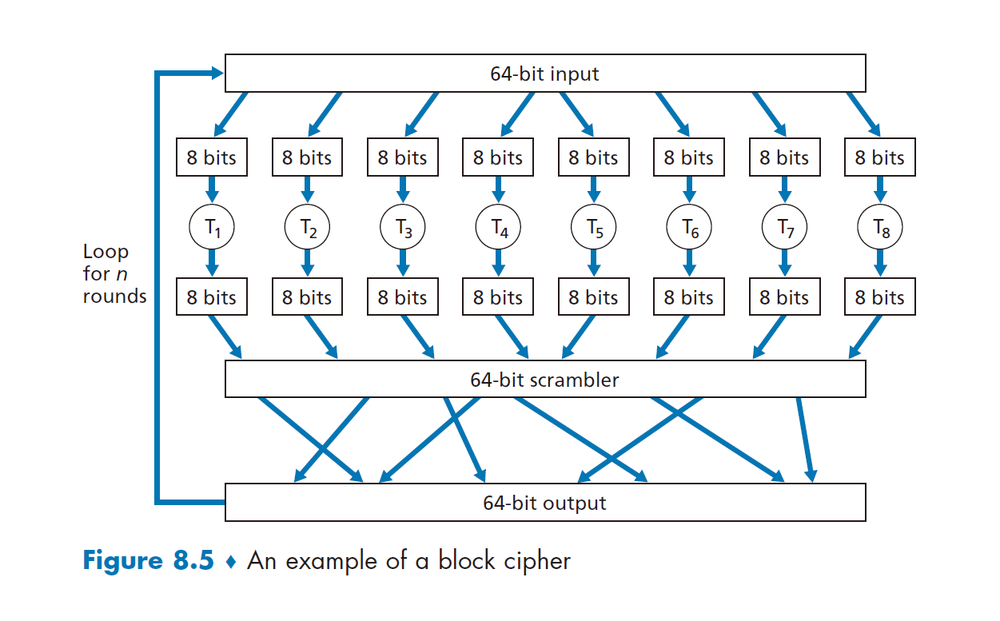

目前有一些流行的块密码，包括 DES(Data Encryption Standard, 数据加密标准)，3DES 和 AES(Advanced Encryption Standard, 高级加密标准)。这些标准都使用了函数(而不是预先决定的表)，连同图 8-5 的线(虽然对每种密码来说更为复杂和具体)。这些算法也都使用了比特串作为密钥。例如，DES 使用了具有 56 比特密钥的 64 比特块。AES 使用 128 比特块，能够使用 128、192 和 256 比特长的密钥进行操作。一个算法的密钥决定了特定“小型表”映射和该算法内部的排列。对这些密码进行蛮力攻击要循环通过所有密钥，用每个密钥应用解密算法。观察到采用长度为 n 的密钥，有 2^n 可能的密钥。NIST ［NIST2001］估计，如果用 1 秒破解 56 比特 DES 的计算机(就是说，每秒尝试所有 2^56 个密钥)来破解一个 128 比特的 AES 密钥，要用大约 149 万亿年的时间才有可能成功。

2. **密码块链接**

在计算机网络应用中，通常需要加密长报文(或长数据流)。如果使用前面描述的块密码，通过直接将报文切割成 k 比特块并独立地加密每块，将出现一个微妙而重要的问题。为了理解这个问题，注意到两个或更多个明文块可能是相同的。例如，两个或更多块 中的明文可能是“HTTP/1.1”。对于这些相同的块，块密码当然将产生相同的密文。当攻击者看到相同的密文块时，它可能潜在地猜出其明文，并且通过识别相同的密文块和利用支撑协议结构的知识，甚至能够解密整个报文［Kaufman 1995］。

为了解决这个问题，可以在密文中混合某些随机性，使得相同的明文块产生不同的密文块。为了解释这个想法，令 m(i)表示第 i 个明文块，c(i)表示第 i 个密文块，并且 a㊉b 表示两个比特串 a 和 b 的异或(XOR)。(前面讲过 0㊉0=1㊉1=0 和 0㊉1=1㊉0=1，并且两个比特串的异或是逐位进行的。例如 10101010㊉11110000=01011010。) 另外，将具有密钥 S 的块密码加密算法表示为$K_s$。其基本思想如下：发送方为第 i 块生成一个随机的 k 比特数 r(i)，并且计算 $c(i) = K_s(m(i)㊉r(i))$。注意到每块选择一个新的 k 比特随机数。则发送方发送 c(1)、r(1)、c(2)、r(2)、c(3)和 r(3)等等。因为接收方 接收到 c(i)和 r(i)，它能够通过计算$m(i) =K_s(c(i)㊉r(i))$而恢复每个明文块。重要的是注意到下列事实：尽管 r(i)是以明文发送的，并且因此能被 Trudy 嗅探到，但她无法获得明文 m(i)，因为她不知道密钥 $K_s$。同时注意到如果两个明文块 m(i)和 m(j)是相同的，对应的密文块 c(i)和 c(j)将是不同的(只要随机数 r(i)和 r(i)不同，这种情况出现的概率将很高)。

举例来说，考虑表中的 3 比特块密码。假设明文是 010010010。如果 Alice 直接对此加密，没有包括随机性，得到的密文变为 101101101 如果 Trudy 嗅探到该密文，因为这三个密文块都是相同的，她能够正确地推断出这三个明文块都是相同的。现在假设 Alice 产生了随机块 r(1)=001，r(2)=111 和 r(3) =100，并且使用了上述技术来生成密文 c(1)=100、c(2) = 010 和 c(3)=000。注意到即使明文块相同，三个密文块也是不同的。Alice 则发送 c(1)、r(1)、c(2)和 r(2)。读者可证实 Bob 能够使用共享的密钥$K_s$获得初始的明文。

精明的读者将注意到，引入随机性解决了一个问题而产生了另一个问题：Alice 必 须传输以前两倍的比特。实际上，对每个加密比特，她现在必须再发送一个随机比特，使需要的带宽加倍。为了有效利用该技术，块密码通常使用了一种称为 **密码块链接(Cipher Block Chaining, CBC)** 的技术。其基本思想是仅随第一个报文发送一个随机值，然后让发送方和接收方使用计算的编码块代替后继的随机数。具体而言，CBC 运行过程如下：

(1) 在加密报文(或数据流)之前，发送方生成一个随机的 k 比特串，称为 **初始向量(Initialization Vector, IV)**。将该初始向量表示为 c(0)。发送方以明文方式将 IV 发送给接收方。
(2) 对第一个块，发送方计算 m(1)㊉c(0)，即计算第一块明文与 IV 的异或。然后通过块密码算法运行得到的结果以得到对应的密文块，即$c(1)=K_s(m(l)㊉c(0))$。发送方 向接收方发送加密块 c(1)。
(3) 对于第 i 个块，发送方根据 c(i)=K_s(m(1)㊉c(i-1))生成第 i 个密文块。

我们现在来考察这种方法的某些后果。首先，接收方将仍能够恢复初始报文。毫无疑问，当接收方接收到 c(i) 时，它用$K_s$解密之以获得 s(i) =m(i)㊉c(i-1)；因为接收方已经知道 c(i-1)，则从 m(i)=s(i)㊉c(i-1)获得明文块。第二，即使两个明文块是相同的，相应的密文块也(几乎)总是不同的。第三，虽然发送方以明文发送 IV，入侵者将仍不能解密密文块，因为该入侵者不知道秘密密钥 S。最后，发送方仅发送一个最前的块(即 IV),因此对(由数百块组成的)长报文而言增加的带宽用量微不足道。

举例来说，对表乩 1 中的 3 比特块密码，明文为 010010010 和 IV=c(0)=001，我们现在来确定其密文。发送方首先使用 IV 来计算 $c(1)=K_s(m(1)㊉c(0)) = 100$。发送方然后计算 $c(2)=K_s(m(2)㊉c(1)) = K_s(010 ㊉ 100) = 000$，并且 $c(3) =K_s(m(3)㊉c(2)) = K_s(010㊉000) = 101$。读者可证实接收方若知道了 IV 和 K_s，将能够恢复初始的明文。

当设计安全网络协议时，CBC 有一种重要的后果：需要在协议中提供一种机制，以从发送方向接收方分发 IV。在本章稍后我们将看到几个协议是如何这样做的。

### 8.2.2. 公开密钥加密

从凯撒密码时代直到 20 世纪 70 年代的两千多年以来，加密通信都需要通信双方共享一个共同秘密，即用于加密和解密的对称密钥。这种方法的一个困难是两方必须就共享密钥达成一致，但是这样做的前提是需要通信(可假定是安全的)！可能是双方首先会面，人为协商确定密钥（例如，凯撒的两个百夫长在罗马浴室碰头），此后才能进行加密通信。但是，在网络世界中，通信各方之间可能从未见过面，也不会在网络以外的任何地方交谈。此时通信双方能够在没有预先商定的共享密钥的条件下进行加密通信吗？ 1976 年，Diffie 和 Hellman [Diffie 1976］论证了一个解决这个问题的算法（现在称为 Diffie-Hellman 密钥交换），这是个完全不同、极为优雅的安全通信算法，开创了如今的公开密钥密码系统的发展之路。我们很快就会看到公开密钥密码系统也有许多很好的特性，使得它不仅可以用于加密，还可以用于鉴别和数字签名。有趣的是，最近发现 20 世纪 70 年代早期由英国通信电子安全团体的研究人员独立研究的一系列秘密报告中的思想，与［Diffie 1976］ 和［RSA 1978］中的思想类似［Ellis 1987］。事实常常如此，伟大的想法通常会在许多地方独立地闪现；幸运的是，公钥的进展不仅秘密地发生，而且也在公众视野中发生。

公开密钥密码的使用在概念上相当简单。假设 Alice 要和 Bob 通信。如图 8-6 所示，这时 Alice 和 Bob 并未共享一个密钥（如同在对称密钥系统情况下），而 Bob（Alice 报文的接收方）则有两个密钥，一个是世界上任何人（包括入侵者 Trudy）都可得到的 **公钥(public key)**，另一个是只有 Bob 知道的 **私钥(private key)**。我们使用符号$K_B^+$和$K_B^-$来分别表示 Bob 的公钥和私钥。为了与 Bob 通信，Alice 首先取得 Bob 的公钥，然后用这个公钥和一个众所周知的（例如，已标准化的）加密算法，加密她要传递给 Bob 的报文 m，即 Alice 计算$K_B^+(m)$。Bob 接收到 Alice 的加密报文后，用其私钥和一个众所周知的（例如，已标准化的）解密算法解密 Alice 的加密报文，即 Bob 计算$K_B^-(K_B^+(m))$。后面我们将看到，存在着可以选择公钥和私钥的加密/解密算法和技术，使得$K_B^-(K_B^+(m)) = m$。也就是说，用 Bob 的公钥$K_B^+$加密报文 m（得到$K_B^+(m)$），然后再用 Bob 的私钥$K_B^-$解密报文的密文形式（就是计算$K_B^-(K_B^+(m))$）就能得到最初的明文 m。这是个不寻常的结果！用这种办法，Alice 可以使用 Bob 公开可用的密钥给 Bob 发送机密信息，而他们任一方都无须分发任何密钥！我们很快能够看到，公钥和私钥加密相互交换同样能够得到不寻常的结果，即$K_B^-(K_B^+(m)) = K_B^+(K_B^-(m)) = m$。

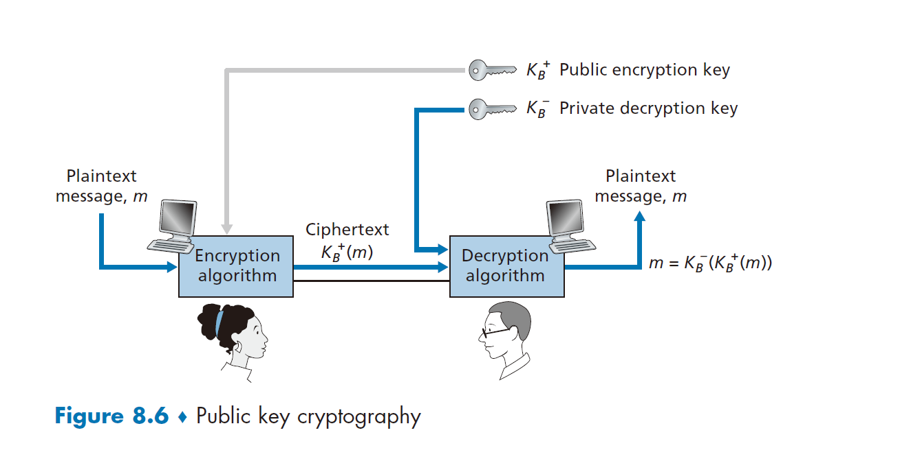

因此公开密钥密码体制的使用在概念上是简单的。但是有两点必须要注意。首先应关注的是，尽管入侵者截取到 Alice 的加密报文时看到的只是乱码，但是入侵者知道公钥（显然 Bob 的公钥是全世界都可以使用的）和 Alice 加密所用的算法。Trudy 可以据此发起选择明文攻击，使用已知的标准加密算法和 Bob 的公开可用的加密密钥对她所选择的任意报文编码！例如，Trudy 可以尝试对她怀疑 Alice 可能发送的全部报文或部分报文编码。很明显，要使公开密钥密码能工作，密钥选择和加密/解密算法必须保证任意入侵者都不能（至少要困难得几乎不可能）确定出 Bob 的私钥或者以某种方式解密或猜出 Alice 发给 Bob 的报文。第二个值得关注的问题是，既然 Bob 的加密密钥是公开的，任何人（包括 Alice 和其他声称自己是 Alice 的人）都可能向 Bob 发送一个已加密的报文。在单一共享密钥情况下，发送方知道共享秘密密钥的事实就已经向接收方隐含地证实了发送方的身份。然而在公钥体制中，这点就行不通了，因为任何一个人都可向 Bob 发送使用 Bob 的公开可用密钥加密的报文。这就需要用数字签名把发送方和报文绑定起来，数字签名是我们在 8-3 节中讨论的主题。

1. **RSA**

尽管可能有许多算法处理这些关注的问题，但 **RSA 算法**（RSA algorithm, 取算法创立人 Ron Rivest, Adi Shamir 和 Leonard Adleman 的首字母命名）几乎已经成了公开密钥密码的代名词。我们首先来理解 RSA 是如何工作的，然后再考察 RSA 的工作原理。

RSA 广泛地使用了模 n 算术的算术运算。故我们简要地回顾一下模算术。前面讲过 x mod n 只是表示被 n 除时 x 的余数；因此如 19 mod 5 = 4。在模算术中，人们执行通常的加法、乘法和指数运算。然而，每个运算的结果由整数余数代替，该余数是被 n 除后留下的数。对于模算术的加法和乘法可由下列便于施用的事实所简化：

$[(a \: mod \: n) + (b \: mod \: n)] \: mod \: n = (a+b) \: mod \: n$
$[(a \: mod \: n) - (b \: mod \: n)] \: mod \: n = (a-b) \: mod \: n$
$[(a \: mod \: n) \cdot (b \: mod \: n)] \: mod \: n = (a \cdot b) \: mod \: n$

从第三个事实推出$(a \: mod \: n)^d \: mod \: n = a^d \: mod \: n$，我们很快将会发现这个恒等式是非常有用的。

现在假设 Alice 要向 Bob 发送一个 RSA 加密的报文，如图 8-6 所示。在我们的讨论中，心中永远要记住一个报文只不过是一种比特模式，并且所有比特模式能唯一地被一个整数 （连同该比特模式的长度）表示。例如，假设一个报文是比特模式 1001；这个报文能由十进制整数 9 来表示。所以，当用 RSA 加密一个报文时，等价于加密表示该报文的这个唯一的整数。

RSA 有两个互相关联的部分：

- 公钥和私钥的选择。
- 加密和解密算法。

为了生成 RSA 的公钥和私钥，Bob 执行如下步骤：

(1) 选择两个大素数 p 和 q。那么 p 和 q 应该多大呢？该值越大，破解 RSA 越困难，而执行加密和解密所用的时间也越长。RSA 实验室推荐，公司使用时，p 和 q 的乘积为 1024 比特的数量级。对于选择大素数的方法的讨论，参见[Caldwell 2012]。
(2) 计算 n=pq 和 z = (p - 1) (q - 1)。
(3) 选择小于 n 的一个数 e，且使 e 和 z 没有（非 1 的）公因数。（这时称 e 与 z 互素。）使用字母 e 表示是因为这个值将被用于加密。
(4) 求一个数 d，使得 ed-1 可以被 z 整除（就是说，没有余数）。使用字母 d 表示是因为这个值将用于解密。换句话说，给定 e 我们选择 d，使得

$$ed \: mod \: z = 1$$

(5) Bob 使外界可用的公钥$K_B^+$是一对数 (n, e) ，其私钥$K_B^-$是一对数 (n, d)。

Alice 执行的加密和 Bob 进行的解密过程如下：

- 假设 Alice 要给 Bob 发送一个由整数 m 表示的比特组合，且 m < n。为了进行编码，Alice 执行指数运算 m^e，然后计算 m^e 被 n 除的整数余数。换言之，Alice 的明文报文 m 的加密值 c 就是：

$$c = m^e \: mod \: n$$

对应于这个密文 c 的比特模式发送给 Bob。

- 为了对收到的密文报文 c 解密，Bob 计算：

$$m = c^d \: mod \: n$$

这要求使用他的私钥 (n, d)。

举一个简单的 RSA 例子，假设 Bob 选择 p=5 和 q=7。（坦率地讲，这样小的值无法保证安全。）则 n=35 和 z=24。因为 5 和 24 没有公因数，所以 Bob 选择 e=5。最后，因为 5x29-1（即 ed-1）可以被 24 整除，所以 Bob 选择 d=29。Bob 公开了 n = 35 和 e = 5 这两个值，并秘密保存了 d = 29。观察公开的这两个值，假定 Alice 要发送字母 “I” “o” “v”和“e”给 Bob。用 1〜26 之间的每个数表示一个字母，其中 1 表示“a”, ..., 26 表示“z”，Alice 和 Bob 分别执行如下面两个表所示的加密和解密运算。注意到在这个例子中，我们认为每四个字母作为一个不同报文。一个更为真实的例子是把这四个字母转换成它们的 8 比特 ASCII 表示形式，然后加密与得到的 32 比特的比特模式对应的整数。（这样一个真实的例子产生了一些长得难以在教科书中打印出来的数！）

**加密：**

| 明文字母 | m: 数字表示 | $m^e$   | 密文 $c = m^e \: mod \: n$ |
| -------- | ----------- | ------- | -------------------------- |
| l        | 12          | 248832  | 17                         |
| o        | 15          | 759375  | 15                         |
| v        | 22          | 5153632 | 22                         |
| e        | 5           | 3125    | 10                         |

**解密：**

| 密文 c | $c^d$                                   | $m = c^d \: mod \: n$ | 明文字母 |
| ------ | --------------------------------------- | --------------------- | -------- |
| 17     | 481968572106750915091411825223071697    | 12                    | l        |
| 15     | 12783403948858939111232757568359375     | 15                    | o        |
| 22     | 851643319086537701956194499721106030592 | 22                    | v        |
| 10     | ]00000000000000000000000000000          | 5                     | e        |

假定上面两个表中的简单示例已经产生了某些极大的数，并且假定我们前面看到 p 和 q 都是数百比特长的数，这些都是实际使用 RSA 时必须要牢记的。如何选择大素数? 如何选择 e 和 d？如何对大数进行指数运算？对这些重要问题的详细讨论超出了本书的范围，详情请参见［Kaufman 1995］以及其中的参考文献。
