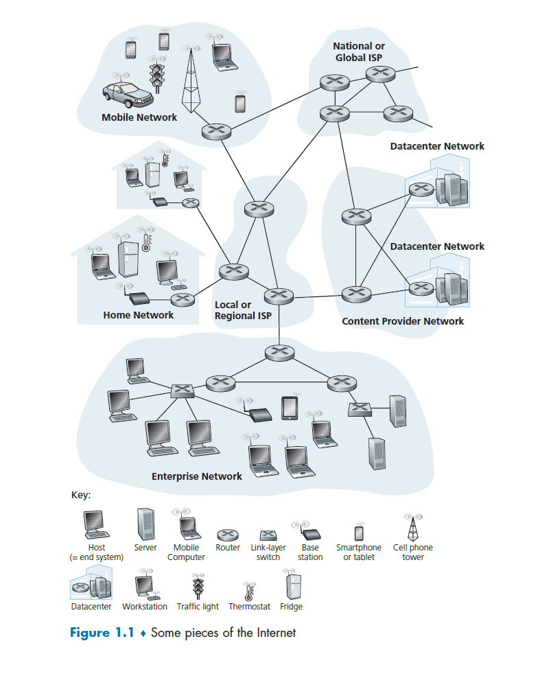

```json
item : 计算机网络
priority: 1
span : 3 months
plan : 1 chapter / week
```

**参考**:

1. 《计算机网络：自顶向下方法》第 8 版
2. 其他

**目录**:

- [1. 计算机网络和因特网](#1-计算机网络和因特网)
  - [1.1. 什么是因特网？](#11-什么是因特网)
    - [1.1.1. 构成描述](#111-构成描述)
    - [1.1.2. 服务描述](#112-服务描述)
    - [1.1.3. 什么是协议](#113-什么是协议)
  - [1.2. 网络边缘](#12-网络边缘)
    - [1.2.1. 接入网](#121-接入网)
    - [1.2.2. 物理媒体](#122-物理媒体)
  - [1.3. 网络核心](#13-网络核心)
    - [1.3.1. 分组交换](#131-分组交换)
    - [1.3.2. 电路交换](#132-电路交换)
    - [1.3.3. 网络的网络](#133-网络的网络)
  - [1.4. 网络的性能](#14-网络的性能)
    - [1.4.1. 时延](#141-时延)
    - [1.4.2. 丢包](#142-丢包)
    - [1.4.3. tracert](#143-tracert)
    - [1.4.4. 吞吐量](#144-吞吐量)
  - [1.5. 协议层次及其服务模型](#15-协议层次及其服务模型)
    - [1.5.1. 分层的体系结构](#151-分层的体系结构)
    - [1.5.2. **封装**](#152-封装)
  - [1.6. 面对攻击的网络](#16-面对攻击的网络)
  - [1.7. 计算机网络和因特网的历史](#17-计算机网络和因特网的历史)
  - [1.8. 熟悉 wireshark](#18-熟悉-wireshark)
    - [1.8.1. 分组嗅探器](#181-分组嗅探器)
    - [1.8.2. wireshark](#182-wireshark)
- [2. 应用层](#2-应用层)
  - [2.1. 应用层协议原理](#21-应用层协议原理)
    - [2.1.1. 分布式应用程序体系结构](#211-分布式应用程序体系结构)
    - [2.1.2. 进程通信](#212-进程通信)
    - [2.1.3. 运输层提供的服务](#213-运输层提供的服务)
    - [2.1.4. TCP/UDP](#214-tcpudp)
    - [2.1.5. 应用层协议](#215-应用层协议)
    - [2.1.6. 本书涉及的网络应用](#216-本书涉及的网络应用)
  - [2.2. Web 和 HTTP](#22-web-和-http)
    - [2.2.1. HTTP 概述](#221-http-概述)
    - [2.2.2. 持续连接和非持续连接](#222-持续连接和非持续连接)
    - [2.2.3. HTTP 报文格式](#223-http-报文格式)
    - [2.2.4. Cookie](#224-cookie)
    - [2.2.5. 代理服务器](#225-代理服务器)
  - [2.3. 电子邮件](#23-电子邮件)
    - [2.3.1. SMTP](#231-smtp)
    - [2.3.2. SMTP VS HTTP](#232-smtp-vs-http)
    - [2.3.3. SMTP 报文格式](#233-smtp-报文格式)
    - [2.3.4. 邮件访问协议](#234-邮件访问协议)

# 1. 计算机网络和因特网

第 1 章的目标是从整体上描述计算机网络的概貌，以及描述本书的结构。

本章的结构如下：

第 1 节将介绍因特网的相关术语。以及因特网的构成和服务描述。

第 2 节将深入讨论网络边缘，即运行着分布式应用的端系统，接着讨论将端系统接入因特网的接入网以及通信链路的物理媒体。

第 3 节将讨论计算机网络的核心，讨论分组交换的工作过程，以及另一种交换网络，电路交换。

第 4 节将从更抽象的角度讨论将计算机网络的性能，涉及时延，丢包和吞吐量。

第 5 节将介绍计算机网络的分层组织模型。

第 6 节将介绍网络的安全问题。

第 7 节将介绍计算机网络的简要历史。

## 1.1. 什么是因特网？

**time : 2021-05-08**

本书中，我们将因特网作为讨论计算机网络的主要载体。

什么是因特网？

回答这个问题可以通过 2 个方式：

**1. 通过因特网的构成描述因特网。**
**2. 通过因特网提供的服务描述因特网。**

我们先以第 1 个角度开始。

### 1.1.1. 构成描述

图 1-1 描述了一个典型的因特网，其中包含了因特网的常用部件。



结合图 1-1，我们先来介绍一下本节的相关术语

- **端系统**
  不久前，因特网是一个连接着全世界范围内计算设备，如桌面 PC，Linux 工作站，以及服务器的网络。但如今，计算设备已经发生了巨大的变化，如智能手机，平板电脑，电视，游戏机，智能家用电器，汽车，这些非传统计算设备已经接入了因特网。这些与因特网相连的计算设备，称为 **端系统(end system)** 或 **主机(host)** 。

- **通信链路**
  端系统通过 **通信链路(communication link)** 和 **分组交换机(packet switch)** 相连。通信链路分为不同的物理媒体，如同轴电缆，铜线，光纤，和无线信道。不同类型的通信链路有不同的 **传输速率(transmission rate)**。传输速率以比特/秒(bit/s 或 bps) 度量。当一个端系统向另外一个端系统发送数据时，发送端系统将数据分段，每一个数据段被加上了首部字节。这种数据段被称为 **分组(packet)**。这些分组通过网络发送到目的端系统，在目的端系统被组装为初始数据。

- **分组交换机**
  分组交换机从它的一条入通信链路接收到达的分组，并从它的一条出通信链路转发该分组。在当今的因特网中，有 2 种典型的分组交换机：**路由器(router)** 和 **链路层交换机(link-layer switch)**。这两种类型的交换机朝着最终目的地转发分组。链路层交换机通常用于接入网，路由器通常用于网络核心。从发送端系统到接收端系统，一个分组所经历的一系列通信链路和分组交换机称为该网络的 **路径(route)**。

用于传送分组的分组交换网络在许多方面类似于承载运输车辆的运输网络，该网络包括了高速公路、公路和交叉口。例如，考虑下列情况，一个工厂需要将大量货物搬运到数千公里以外的某个目的地仓库。在工厂中，货物要分开并装上卡车车队。然后，每辆卡车独立地通过高速公路、公路和立交桥组成的网络向仓库运送货物。在目的地仓库，卸下这些货物，并且与一起装载的同一批货物的其余部分堆放在一起。因此，在许多方面，分组类似于卡车，通信链路类似于高速公路和公路，分组交换机类似于交叉口，而端系统类似于建筑物。就像卡车选取运输网络的一条路径前行一样，分组则选取计算机网络的一条路径前行。

- **因特网服务提供商**
  端系统通过 **因特网服务提供商(Internet Service Provider 或 ISP)** 接入因特网。ISP 包括如本地电缆或电话公司那样的住宅区 ISP、公司 ISP、大学 ISP，在机场、旅馆、咖啡店和其他公共场所提供 WiFi 接入的 ISP，以及为智能手机和其他设备提供移动接入的蜂窝数据 ISP(基站)。每个 ISP 自身就是一个由多台分组交换机和多段通信链路组成的网络。各 ISP 为端系统提供了各种不同类型的网络接入，包括如线缆调制解调器或 DSL 那样的住宅宽带接入，高速局域网接入和移动无线接入。ISP 也为内容提供者提供因特网接入服务，将 Web 站点和视频服务器直接连入因特网。

因特网要将端系统彼此互联，因此为端系统提供接入的 ISP 也必须互联。较低层的 ISP 通过国家的或国际的较高层 ISP 互联起来。较高层 ISP 是由通过高速光纤链路互联的高速路由器组成的。我们将在第 1.3 节深入地讨论 ISP 的互联结构。

无论是较高层还是较低层 ISP 网络，它们每个都是独立管理的，运行着 IP 协议，遵从一定的命名和地址规则。

- **协议**
  端系统和分组交换机以及其他因特网部件都运行着一系列 **协议(protocol)**。这些协议控制因特网中信息的发送和接收。**TCP(Transmission Control Protocol 或 传输控制协议)** 和 **IP(Internet Protocol 或 网际协议)** 是因特网协议中最重要的 2 个协议。IP 协议定义了路由器和端系统之间发送和接收的分组格式。因特网的主要协议统称为 **TCP/IP**。

- **因特网标准**
  因特网标准(Internet standard) 由因特网工程任务组(Internet Engineering Task Forse 或 IETF)。IETF 的标准文档称为请求评论(Request For Comment 或 RFC)。RFC 最初只是普通的请求评论(因此得名)，目的是解决因特网先驱者们面临的网络和协议问题。RFC 往往是技术性很强并相当详细的。它们定义了 TCP，IP，HTTP 和 SMTP 等协议。其他组织也在制定用于网络部件的标准，最引人注目的是针对网络链路的标准。例如 IEEE 802 LAN/MAN 标准委员会 [IEEE 802 2016] 制定了以太网和 WiFi 的标准。

**因特网构成描述：**

**因特网是端系统之间通过通信链路和分组交换机相连的世界范围的计算机网络。端系统，分组交换机和其他因特网部件运行着协议以便端系统之间正常地交换信息。端系统之间通过互联的各层次的 ISP 相连，每一个 ISP 都是由多条通信链路和分组交换机构成的网络。**

### 1.1.2. 服务描述

第 1.1 节通过因特网构成的角度描述了因特网。在本节我们第 2 个角度：通过因特网提供的服务的角度来描述因特网。

我们先来介绍一下本节的相关术语。

- **分布式应用程序**
  端系统之上运行着各种各样的应用程序，除了传统的万维网，电子邮件之外，还包括即时通讯、云音乐、云视频、在线社交、视频会议、多人游戏以及基于位置的推荐系统等等。这些应用程序涉及多个相互交换信息的端系统，因此称为**分布式应用程序**。

- **套接字接口**
  与因特网相连的端系统提供了一个 **套接字接口(socket interface)**。该接口规定了运行在一个端系统上的应用程序通过因特网向运行在另一个端系统上的特定目的地程序传输数据的方式。我们将在第 2 章深入讨论套接字接口。

**因特网提供的服务描述：**

**因特网提供了分布式应用不可缺少的数据传输服务。分布式应用之间可以通过套接字接口使用因特网提供的数据传输服务来交换数据。**

### 1.1.3. 什么是协议

本节来更具体地介绍协议。

什么是协议？协议可以做什么？

1. **人类活动的类别**

也许理解计算机网络协议这一概念的一个最容易办法是，先与某些人类活动进行类比，因为我们人类无时无刻不在执行协议。考虑当你想要向某人询问时间时将要怎样做。 图 1-2 中显示了一种典型的交互过程。人类协议(至少是好的行为方式)要求一方首先进行问候(图 1-2 中的第一个“你好”)，以开始与另一个人的通信。对“你好”的典型响应是返回一个“你好”报文。此人用一个热情的“你好”进行响应，隐含着一种指示，表明能够继续向那人询问时间了。对最初的“你好”的不同响应(例如“不要烦我!”，或“我不会说英语”，或某些不合时宜的回答)也许表明了一个勉强的或不能进行的通信。在此情况下，按照人类协议，发话者就不能询问时间了。有时，问的问题根本得不到任何回答，在此情况下，发话者通常会放弃向这个人询问时间。注意在我们人类协议中, 有我们发送的特定报文，也有我们根据接收到的应答报文或其他事件(例如在某个给定的时间内没有回答)采取的动作。显然，发送和接收的报文，以及这些报文发送和接收或其他事件出现时所采取的动作，这些在一个人类协议中起到了核心作用。如果人们使用不同的协议(例如，如果一个人讲礼貌，而另一人不讲礼貌，或一个人明白时间的概念，而另一人却不理解)，这些协议就不能交互，因而不能完成有用的工作。在网络中这个道理同样成立。即为了完成一项工作，要求两个(或多个)通信实体运行相同的协议。

我们再考虑第二个人类类比的例子。假定你正在大学课堂里上课(例如上的是计算机网络课程)。教师正在唠唠叨叨地讲述协议，而你迷惑不解。这名教师停下来问: “同学们有什么问题吗？”(教师发送出一个报文，该报文被所有没有睡觉的学生接收到了。)你举起了手(向教师发送了一个隐含的报文)。这位教师面带微笑地示意你说: “请讲……”(教师发出的这个报文鼓励你提出问题，教师喜欢被问问题。)接着你就问了问题(向该教师传输了你的报文)。教师听取了你的问题(接收了你的问题报文)并加以回答(向你传输了回答报文)。我们再一次看到了报文的发送和接收，以及这些报文发送和接收时所采取的一系列约定俗成的动作，这些是这个“提问与回答”协议的关键所在。


2. **网络协议**

网络协议类似于人类协议，除了交换报文和采取动作的实体是某些设备(可以是计算机、智能手机、平板电脑、路由器或其他具有网络能力的设备)的硬件或软件组件。在因特网中，涉及两个或多个远程通信实体的所有活动都受协议的制约。例如，在两台物理上 连接的计算机中，硬件实现的协议控制了在两块网络接口卡间的“线上”的比特流；在端系统中，拥塞控制协议控制了在发送方和接收方之间传输的分组发送的速率；路由器中的协议决定了分组从源到目的地的路径。在因特网中协议运行无处不在，因此本书的大量篇幅都与计算机网络协议有关。

以大家可能熟悉的一个计算机网络协议为例，考虑当你向一个 Web 服务器发出请求(即你在 Web 浏览器中键入一个 Web 网页的 URL)时所发生的情况。图 1-2 右半部分显示了这种情形。首先，你的计算机将向该 Web 服务器发送一条连接请求报文，并等待回答。 该 Web 服务器将最终能接收到连接请求报文，并返回一条连接响应报文。得知请求该 Web 文档正常以后，计算机则在一条 GET 报文中发送要从这台 Web 服务器上取回的网页名字。最后，Web 服务器向计算机返回该 Web 网页(文件)。

从上述的人类活动和网络例子中可见，报文的交换以及发送和接收这些报文时所采取的动作是定义一个协议的关键元素:

**协议定义了在两个或多个通信实体之间交换报文的格式和顺序，发送报文和接收报文以及其他事件所采取的动作。**

因特网(更一般地说是计算机网络)广泛地使用了协议。不同的协议用于完成不同的通信任务。当你阅读完这本书后将会知道，某些协议简单而直截了当，而某些协议则复杂且晦涩难懂。掌握计算机网络领域知识的过程就是理解网络协议的构成、原理和工作方式的过程。

## 1.2. 网络边缘

**time : 2021-05-08**

在上一节中，我们给出了因特网和网络协议的总体概述。现在我们将更深入一些来探究计算机网络(特别是因特网)的部件。本节将深入讨论端系统。在接下来的一节中，我们将从网络边缘向网络核心推进，查看计算机网络中的交换和选路。

回想前一节中计算机网络的术语，通常把与因特网相连的计算机和其他设备称为端系统。如图 1-3 所示，因为它们位于因特网的边缘，故而被称为端系统。因特网的端系统包括了桌面计算机（例如，桌面 PC、Mac 和 Linux 设备）、服务器（例如，Web 和电子邮件服务器）和移动计算机（例如，便携机、智能手机和平板电脑）。此外，越来越多的非传统物品正被作为端系统与因特网相连。

端系统也称为主机（host）,因为它们容纳（即运行）应用程序，如 Web 浏览器程序、Web 服务器程序、电子邮件客户程序或电子邮件服务器程序等。本书通篇将交替使用主机和端系统这两个术语。主机有时又被进一步划分为两类：客户 （client）和服务器（server）。客户通常是桌面 PC、移动 PC 和智能手机等，而服务器通常是更为强大的机器，用于存储和发布 Web 页面、流视频、中继电子邮件等。今天, 大部分提供搜索结果、电子邮件、Web 页面和视频的服务器都属于大型数据中心（data center）。例如，谷歌公司（Google）拥有 50 ~ 100 个数据中心，其中 15 个大型数据中心每个都有 10 万台以上的服务器。

### 1.2.1. 接入网

考虑了位于“网络边缘”的应用程序和端系统后，我们接下来考虑 **接入网**。

**接入网是指将端系统接入网络核心的 ISP 网络。**

图 1-4 用粗的、带阴影的线高亮显示了几种类型接入网。


1. **家庭接入：DSL 接入，电缆接入，光纤接入，拨号和卫星接入**

- **DSL 接入**

住户通常从本地的电话公司处获得 DSL 因特网接入。这种情况下，ISP 就是用户的本地电话公司。

如图 1-5 所示，每个用户的 DSL 调制解调器使用现有的电话线（即双绞铜线，将在 1.2.2 节中讨论它）与位于电话公司的本地中心局（CO）中的数字用户线接入复用器（DSLAM）交换数据。家庭的 DSL 调制解 调器得到数字数据后将其转换高频音，以通过电话线传输给本地中心局；来自许多家庭的模拟信号在 DSLAM 处被转换回数字形式。


DSL 标准定义了多个传输速率，包括 12 Mbps 下行和 1.8Mbps 上行以及 55mbps 下行和 15Mbps 上行。

因为这些上行速率和下行速率是不同的，所以这种接入被称为是不对称的。

- **电缆接入**

住宅从提供有线电视的公司获得了电缆因特网接入。这种情况下，ISP 就是用户的有线电视公司。

如图 1-6 所示，光缆将电缆头端连接到地区枢纽，从这里使用传统的同轴电缆到达各家各户和公寓。每个地区枢纽通常支持 500 -5000 个家庭。因为在这个系统中应用了光纤和同轴电缆，所它经常被称为混合光纤同轴(HFC)系统。

电缆因特网接入需要特殊的调制解调器，这种调制解调器称为电缆调制解调器，如同 DSL 调制解调器，电缆调制解调器通常是一个外部设备，通过一个以太网端口连接到家庭 PC。在电缆头端，电缆调制解调器端接系统与 DSL 网络的 DSLAM 具有类似的功能，即将来自许多下行家庭中的电缆调制解调器发送的模拟信号转换回数字形式。


电缆调制解调器将 HFC 网络划分为下行和上行两个信道。如同 DSL,接入通常是不对称的，下行信道分配的传输速率通常比上行信道的高。DOCSIS 2.0 标准定义了高达 42.8Mbps 的下行速率和高达 30.7Mbps 的上行速率。

- **光纤接入**

光纤接入就是从本地中心局直接到家庭提供一个光纤路径。从本地中心局到家庭有几种有竞争的光纤布局方案。一种是直接光纤，从本地中心局到每个用户直接设置一根光纤。还有一种较为一般，从中心局出来一根光纤，到临近家庭的位置，才分给每个用户一个光纤。这种方案有两种类型：主动光纤网络(AOT)和被动光纤网络(PON)。

这里简要介绍 PON。

如图 1-7 所示，每个家庭具有一个光纤网络端接器(ONT),它由专门的光纤连接到邻近的分配器(splitter)，该分配器把一些家庭(通常少于 100 个)集结到一根共享的光纤，该光纤再连接到本地电话和公司的中心局中的光纤线路端接器(OLT)，该 OLT 提供了光信号和电信号之间的转换，经过本地电话公司路由器与因特网相连。在家庭中，用户将一台家庭路由器(通常是无线路由器)与 ONT 相连，并经过这台家庭路由器接入因特网。在 PON 体系结构中，所 有从 OLT 发送到分配器的分组在分配器(类似于一个电缆头端)处复制。


- **拨号和卫星接入**

还可采用另外两种接入网技术为家庭提供因特网接入。在无法提供 DSL、电缆和 FTTH 的地方（例如在某些乡村环境），能够使用卫星链路将住宅以超过 1Mbps 的速率与 因特网相连。StarBand 和 HughesNet 是两家这样的卫星接入提供商。使用传统电话线的拨号接入与 DSL 基于相同的模式：家庭的调制解调器经过电话线连接到 ISP 的调制解调器。与 DSL 和其他宽带接入网相比，拨号接入 56kbps 的慢速率是令人痛苦的。

2. **企业(和家庭)接入：以太网和 WiFi**

- **以太网**
  在公司和大学校园以及越来越多的家庭环境中，使用 **局域网(LAN)** 将端系统连接到边缘路由器。尽管有许多不同类型的局域网技术，但是 **以太网** 到目前为止是公司、大学和家庭网络中最为流行的接入技术。

如图 1-8 中所示，以太网用户使用双绞铜线与一台以太网交换机相连，第 6 章中将详细讨论该技术。 以太网交换机或这样相连的交换机网络，则再与更大的因特网相连。


使用以太网接入，用户通常以 100Mbps 或 1Gbps 速率接入以太网交换机，而服务器可能具有 1Gbps 甚至 10Gbps 的接入速率。

- **WiFi(无线局域网 LAN)**

如今，越来越多的人通过移动 PC，智能手机，平板电脑和其他设备接入因特网。在无线 LAN 环境中，无线用户从/到一个接入点发送/接收分组，该接入点与企业网连接（很可能使用了有线以太网），企业网再与有线因特网相连。

一个无线 LAN 用户通常必须位于接入点的几十米范围内。基于 IEEE 802.11 技术的无线 LAN 接入,更通俗地称为 WiFi,目前几乎无所不在，如大学、商业办公室、咖啡厅、 机场、家庭，甚至在飞机上。

IEEE 802.11 今天提供了高达 100Mbps 的共享传输速率。

虽然以太网和 WiFi 接入网最初是设置在企业（公司或大学）环境中的，但它们近来已经成为家庭网络中相当常见的部件。今天许多家庭将宽带住宅接入（即电缆调制解调器 或 DSL）与廉价的无线局域网技术结合起来，以产生强大的家用网络。图 1-9 显示了典型的家庭网络。这个家庭网络组成如下：一台漫游的便携机和一台有线 PC； — 个与无线 PC 和家中其他无线设备通信的基站（无线接入点）；一个提供与因特网宽带接入的 电缆调制解调器；一台互联了基站及带有电缆调制解调器的固定 PC 的路由器。该网络允许 家庭成员经宽带接入因特网，其中任何一个家庭成员都可以在厨房、院子或卧室漫游上网。


3. **广域无线接入：4G 和 5G**

我们可以使用 iPhone 和安卓等移动设备发信息、在社交网络中分享照片、观看视频和放音乐。这些设备应用了与蜂窝移动电话相同的无线基础设施，通过蜂窝网提供商运营的基站来发送和接收分组。与 WiFi 不同的是，一个用户仅需要位于基站的数万米(而不是几十米)范围内。

电信公司在第 4 代移动通信技术(4G)上做了巨大的投资。4G 移动通信技术可以提供 60Mbps 的下载速度。但是更高速度的广域无线接入技术，第五移动通信技术(5G)已经投入了部署。我们将在第 7 章详细地讨论 WiFi，4G，5G 等技术。

### 1.2.2. 物理媒体

在前面的内容中，我们概述了因特网中某些最为重要的网络接入技术。当我们描述这些技术时，我们也指出了所使用的物理媒体。例如，我们说过电缆接入网中使用了**光纤**和**同轴电缆**相结合的技术。我们说过 DSL 和以太网使用了**双绞铜线**。我们也说过移动接入网使用了**无线电**。在这一节中，我们简要概述一下这些和其他常在因特网中使用的传输媒体。

物理媒体分为：**导引型**和**非导引型**。

导引型媒体中，信号沿着固定的路线传播。如光纤，通州电缆，双绞铜线。

非导引型媒体中，信号在空气或太空中传播。如无线局域网，无线广域网，以及卫星。

1. **双绞铜线**

最便宜并且最常用的导引型传输媒体是双绞铜线。一百多年来，它一直用于电话网。 事实上，从电话机到本地电话交换机的连线超过 99% 使用的是双绞铜线。我们多数人在自己家中和工作环境中已经看到过双绞线。双绞线由两根绝缘的铜线组成，每根大约 lmm 粗，以规则的螺旋状排列着。这两根线被绞合起来，以减少邻近类似的双绞线的电气干扰。通常许多双绞线捆扎在一起形成一根电缆，并在这些双绞线外面覆盖上保护性防护层。一对电线构成了一个通信链路。**无屏蔽双绞线**(UTP)常用在建筑物内的计算机网络中，即用于局域网(LAN)中。目前局域网中的双绞线的数据速率从 10Mbps 到 10Gbpso 所能达到的数据传输速率取决于线的粗细以及传输方和接收方之间的距离。

2. **同轴电缆**

与双绞线类似，同轴电缆由两个铜导体组成，但是这两个导体是同心的而不是并行的。借助于这种结构及特殊的绝缘体和保护层，同轴电缆能够达到较高的数据传输速率。同轴电缆在电缆电视系统中相当普遍。我们前面已经看到，电缆电视系统最近与电缆调制解调器结合起来，为住宅用户提供数十 Mbp 速率的因特网接入。在电缆电视和 电缆因特网接入中，发送设备将数字信号调制到某个特定的频段，产生的模拟信号从发送设备传送到一个或多个接收方。同轴电缆能被用作导引型共享媒体。特别是，许多端系统能够直接与该电缆相连，每个端系统都能接收由其他端系统发送的容。

3. **光纤**

光纤是一种细而柔软的、能够导引光脉冲的媒体，每个脉冲表示一个比特。一根光 纤能够支持极高的比特速率，高达数十甚至数百 Gbpso 它们不受电磁干扰，长达 100km 的光缆信号衰减极低，并且很难窃听。这些特征使得光纤成为长途导引型传输媒体，特 别是跨海链路。在美国和别的地方，许多长途电话网络现在全面使用光纤。光纤也广泛 用于因特网的主干。然而，高成本的光设备，如发射器、接收器和交换机，阻碍光纤在短途传输中的应用，如在 LAN 或家庭接入网中就不使用它们。

4. **陆地无线电信道**

无线电信道承载电磁频谱中的信号。它不需要安装物理线路，并具有穿透墙壁、提供与移动用户的连接以及长距离承载信号的能力，因而成为一种有吸引力的媒体。无线电信道的特性极大地依赖于传播环境和信号传输的距离。环境上的考虑取决于路径损耗和遮挡 衰落（即当信号跨距离传播和绕过/通过阻碍物体时信号强度降低）、多径衰落（由于干扰对象的信号反射）以及干扰（由于其他传输或电磁信号）。

陆地无线电信道能够大致划分为三类：一类运行在很短距离（如 1 米或 2 米）；另一类运行在局域，通常跨越数十到几百米；第三类运行在广域，跨越数万米。个人设备如无线头戴式耳机、键盘和医疗设备跨短距离运行；在 1.2.1 节中描述的无线 LAN 技术使用了局域无线电信道；蜂窝接入技术使用了广域无线电信道。我们将在第 7 章中详细讨论无线电信道。

5. **卫星无线电信道**

一颗通信卫星连接地球上的两个或多个微波发射器/接收器，它们被称为地面站。该卫星在一个频段上接收传输，使用一个转发器（下面讨论）再生信号，并在另一个频率上发射 信号。通信中常使用两类卫星：同步卫星和近地轨道（LEO）卫星。

同步卫星永久地停留在地球上方的相同点上。这种静止性是通过将卫星置于地球表面上方 36 000km 的轨道上而取得的。从地面站到卫星再回到地面站的巨大距离引入了可观的 280ms 信号传播时延。不过，能以数百 Mbps 速率运行的卫星链路通常用于那些无法使用 DSL 或电缆因特网接入的区域。

近地轨道卫星放置得非常靠近地球，并且不是永久地停留在地球上方的一个点。它们围绕地球旋转，就像月亮围绕地球旋转那样，并且彼此之间可进行通信，也可以与地面站通信。为了提供对一个区域的连续覆盖，需要在轨道上放置许多卫星。当前有许多低轨道通信系统在研制中。LEO 卫星技术未来也许能够用于因特网接入。

**注意：如今 2021 年，马斯克主导的星链计划正在部署中。**

## 1.3. 网络核心

**time : 2021-05-09**

上一节讨论了网络边缘。现在我们深入网络的核心。

上一节谈到，接入网将端系统接入网络核心。**网络核心是指互联了接入 ISP 网络的核心网络。网络核心本身由更高层次的 ISP 和内容提供商网互联形成，如：地区 ISP，国家 ISP，Google 数据中心网络。**

图 1-10 以加粗和带阴影的线高亮显示了网络核心。


### 1.3.1. 分组交换

在分布式网络应用中，端系统之间交换**报文**。传输报文时，发送端将报文分为分组。每个分组通过通信链路和分组交换机到达接收端系统。分组交换机包含两类：路由器和链路层交换机。

1. **存储转发传输**

存储转发传输是指一个分组交换机在从输入链路接收到一个分组时，首先做的是接收该分组，然后再转发给出链路。这样造成的时延称为**存储转发时延**。

2. **排队时延和分组丢失**

每台分组交换机具有一个**输出缓存**。与一个分组交换机相连的出链路有多条。如果到达的分组需要传输到某条链路，却发现该链路正忙于传输其他分组。那么该分组必须在输出缓存中等待。因此除了存储转发时延外分组还要承受**排队时延**。如果输出缓存完全充满，那么一个到达的分组就会**丢失**。

3. **转发表和路由转发协议**

前面说过一个分组需要分组交换机转发到一条出通信链路上，那么分组交换机是怎么决定转发到哪一条出链路呢？

在因特网中，每一个端系统都有一个称为 IP 地址的地址。当源主机向目的端发送一个分组时，源在该分组的首部包含了目的端的 IP 地址。该地址具有一个等级结构。分组交换机会检查目的端 IP 地址的一部分，并向相邻的一台分组交换机转发该分组。具体来说，每台分组交换机会有一个转发表，用于将 IP 地址映射为出链路。

那么转发表时怎么设置的呢?其实这是由**路由转发协议**生成的。

### 1.3.2. 电路交换

通过通信链路和交换机转发数据的方式有 2 种：**电路交换**和**分组交换**。前几节已经讨论过分组交换，现在讨论一下电路交换。

在电路交换网络中，在端系统会话期间，预留了端系统间沿路径通信所需要的资源，如：缓存和链路传输速度。在分组交换网络中，这些资源是不预留的。会话的报文按需使用这些资源，其后果是不得不等待接入通信链路。

传统的电话网络是电路交换网络的一个例子。在发送方能够发送信息之前，该网络必须在发送方和接收方之间建立一条连接。这是一个名副其实的连接，因为此时沿着发送方和接收方之间 路径上的交换机都将为该连接维护连接状态。用电话的术语来说，该连接被称为一条电路。当网络创建这种电路时，它也在连接期间在该网络链路上预留了恒定的传输速率（表示为每条链路传输容量的一部分）。既然已经为该发送方-接收方连接预留了带宽,则发送方能够以确保的恒定速率向接收方传送数据。

图 1-13 实现了一个电路交换网络。在这个网络中，用 4 条链路互联了 4 台电路交换机。这些链路中每条都有 4 条电路，因此每条链路支持 4 个并行的连接。每台主机都与一台交换机直接相连。当两台主机要通信时，该网络在两台主机之间创建一条专用的**端到端连接**。

因此，主机 A 为了向主机 B 发送报文，网络必须在两方链路的每条上先预留一条链路。在这个例子中，这条专用的端到端连接使用用第一条链路中的第二条电路和第二条链路中的第四条电路。


与此相反，考虑一台主机要经过分组交换网络（如因特网）向另一台主机发送分组所发生的情况。与使用电路交换相同，该分组经过一系列通信链路传输。但与电路交换不同的是，该分组被发送进网络，而不预留任何链路资源之类的东西。如果因为此时其他分组也需要经该链路进行传输而使链路之一出现拥塞，则该分组将不得不在传输链路发送侧的缓存中等待而产生时延。因特网尽最大努力以实时方式交付分组，但它不做任何保证。

1. **电路交换网络中的复用**

电路交换网络中的复用有 2 类：**频分复用**或**时分复用**。

2. **分组交换和电路交换的对比**

分组交换的性能能够优于电路交换的性能。电路交换不考虑需求，而预先分配了传输链路的使用，这使得已分配而并不需要的链路时间未被利用。另一
方面，分组交换按需分配链路使用。链路传输能力将在所有需要在链路上传输分组的用户之间逐分组地被共享。

虽然分组交换和电路交换在今天的电信网络中都是普遍采用的方式，但趋势无疑是朝着分组交换方向发展。

### 1.3.3. 网络的网络

在前几节的讨论中，我们了解到端系统通过接入 ISP 网络接入网络核心。网络核心是互联了接入 ISP 网络的核心网络，它本身是由各高层次的 ISP 互联形成的网络。可是各层次 ISP 网络到底是怎么样互联的呢？

如图 1-15 所示。


## 1.4. 网络的性能

**time : 2021-04-30**

### 1.4.1. 时延

在分组交换网络中，一个分组要经历不同类型的时延：**处理时延**，**排队时延**，**传输时延**，和**传播时延**。这些时延加起来是一个节点的**总时延**。

请看图 1-16 所示的例子。

当分组从上游节点到达路由器 A 时，路由器 A 检查该分组的首部以决定它的出链路。这个例子中只有通向 B。当 A 的出链路不是占用状态时，才会立即传输该分组。如果出链路是占用状态，那么该分组会进入 A 的输出缓存排队。


1. **处理时延**

路由器检查一个分组的首部字节和决定将该分组导向何处是**处理时延**的一部分。处理时延还包括检查比特级别的差错所需要的时间。

处理时延通常是微妙或更低的数量级。

2. **排队时延**

当出链路被占用时，分组将进入输出缓存进行排队。排队所花费的时间为**排队时延**。

排队时延通常是毫秒到微妙量级。

3. **传输时延**

如果分组以先到先服务的方式进行传输，仅当所有已经到达的分组被传输后，才能传输到达的分组。如果 L 为该分组的长度，R 为 A 到 B 的传输速率，那么**传输时延**为 L/R。

通常的传输时延为毫秒到微妙量级。

4. **传播时延**

一旦一个分组的比特进入出链路，就需要传播到 B，从该链路的起点到 B 所需要的时间就是**传播时延**。

在广域网中，传播时延为毫秒量级。

### 1.4.2. 丢包

当分组交换机的输出缓存队列充满时，到达的分组将被丢弃。这就是**丢包**。

一个节点的性能不但可以用时延来度量，还可以用丢包的概率来度量。

### 1.4.3. tracert

windows cmd 为我们提供了 tracert 命令，可以直观的看到端到端的时延。

```bat
tracert www.baidu.com

通过最多 30 个跃点跟踪
到 www.a.shifen.com [110.242.68.3] 的路由:

  1     2 ms     2 ms     2 ms  bogon [192.168.43.141]
  2     *        *        *     请求超时。
  3     *        *        *     请求超时。
  4    22 ms    35 ms    33 ms  123.139.0.221
  5     *       62 ms    27 ms  gi0-0-rtr1-xgx-man.169cnc.net [221.11.0.1]
  6    64 ms    48 ms    40 ms  gi3-0-rtr1-dwl-man.169cnc.net [221.11.0.53]
  7    77 ms    44 ms    49 ms  219.158.111.233
  8    82 ms    76 ms    51 ms  110.242.66.178
  9     *        *        *     请求超时。
 10     *        *        *     请求超时。
 11     *        *        *     请求超时。
 12     *        *        *     请求超时。
 13    43 ms    58 ms    61 ms  110.242.68.3

跟踪完成。
```

### 1.4.4. 吞吐量

当没有其他干扰流量时，其吞吐量能够近似为沿着源和目的地之间路径的最小传输速率。吞吐量不仅取决于沿着路径的传输速率，而且取决于干扰流量。特别是，如果许多其他的数据流也通过这条链路流动，一条具有高传输速率的链 路仍然可能成为文件传输的瓶颈链路。

## 1.5. 协议层次及其服务模型

**time : 2021-05-09**

### 1.5.1. 分层的体系结构

为了结构化网络协议，网络设计者以分层的方式组织协议以及实现这些协议的网络硬件和软件。

分层后，下一层向上一层提供**服务(service)**，而上一层不关注下一层的实现细节。

一个协议层能够用软件或硬件或两者的结合来实现。应用层协议和运输层几乎使用软件来实现。物理层和数据链路层通常在网络接口卡中实现。网络层用软硬件结合的方式来实现。

所有各层的协议称为 **协议栈(protocol stack)**。

因特网的协议栈由 5 个层次组成：**物理层**、**链路层**、**网络层**、**运输层**和**应用层**。如图 1-23 所示。


本书的结构采用了 **自顶向下方法(top-down approach)**，先处理应用层，然后向下处理。

- **应用层**

应用层是网络应用程序及它们的应用层协议存留的地方。因特网的应用层包括许多协议，例如 HTTP （它提供了 Web 文档的请求和传送）、SMTP （它提供了电子邮件报文的传输）和 FTP （它提供两个端系统之间的文件传送）。我们将看到，某些网络功能，如将像 www.ietf.org 这样对人友好的端系统名字转换为 32 比特的网络地址，也是借助于特定的应 用层协议即域名系统（DNS）完成的。我们将在第 2 章中看到，创建并部署我们自己的新应用层协议是非常容易的。

应用层协议分布在多个端系统上，而一个端系统中的应用程序使用协议与另一个端系统中的应用程序交换信息分组。我们把这种位于应用层的信息分组称为 **报文（message）**。

- **运输层**

因特网的运输层在应用程序端点之间传送应用层报文。在因特网中，有两种运输协议，即 TCP 和 UDP,利用其中的任一个都能运输应用层报文。TCP 向它的应用程序提供了面向连接的服务。这种服务包括了应用层报文向目的地的确保传递和流量控制（即发送方/接收方速率匹配）。TCP 也将长报文划分为短报文，并提供拥塞控制机制，因此当网络拥塞时，源抑制其传输速率。UDP 协议向它的应用程序提供无连接服务。这是一种不提供不必要服务的服务，没有可靠性，没有流量控制，也没有拥塞控制。在本书中，我们把运输层的分组称为 **报文段(segment)**。

- **网络层**

因特网的网络层负责将称为 **数据报（datagram）** 的网络层分组从一台主机移动到另一台主机。在一台源主机中的因特网运输层协议（TCP 或 UDP）向网络层递交运输层报文段和目的地址。因特网的网络层包括著名的网际协议 IP,该协议定义了在数据报中的各个字段以及端系统和路由器如何作用于这些字段。IP 仅有一个，所有具有网络层的因特网组件必须运行 IP。 因特网的网络层也包括决定路由的路由选择协议，它根据该路由将数据报从源传输到目的地。因特网具有许多路由选择协议。如我们在 1.3 节所见，因特网是一个网络的网络，并且在一个网络中，其网络管理者能够运行所希望的任何路由选择协议。尽管网络层包括了网际协议和一些路由选择协议，但通常把它简单地称为 IP 层，这反映了 IP 是将因特网连接在一起的黏合剂这样的事实。

- **链路层**

因特网的网络层通过源和目的地之间的一系列路由器路由数据报。为了将分组从一个 节点（主机或路由器）移动到路径上的下一个节点，网络层必须依靠该链路层的服务。特别是在每个节点，网络层将数据报下传给链路层，链路层沿着路径将数据报传递给下一个节点。在该下一个节点，链路层将数据报上传给网络层。由链路层提供的服务取决于应用于该链路的特定链路层协议。例如，某些协议基于链路提供可靠传递，从传输节点跨越一条链路到接收节点。值得注意的是，这种可靠的传递服务不同于 TCP 的可靠传递服务，TCP 提供从一个端系统到另一个端系统的可靠交付。链路层的例子包括以太网、WiFi 和电缆接入网的 DOCSIS 协议。因为数据报从源到目的地传送通常需要经过几条链路，一个数据报可能被沿途不同链路上的不同链路层协议处理。例如，一个数据报可能被一段链路上的以太网和下一段链路上的 PPP 所处理。网络层将受到 来自每个不同的链路层协议的不同服务。在本书中，我们把链路层分组称为 **帧（frame）**。

- **物理层**

虽然链路层的任务是将整个帧从一个网络元素移动到邻近的网络元素，而物理层的任务是将该帧中的一个个比特从一个节点移动到下一个节点。在这层中的协议仍然是链路相关 的，并且进一步与该链路（例如，双绞铜线、单模光纤）的实际传输媒体相关。例如，以太 网具有许多物理层协议：一个是关于双绞铜线的，另一个是关于同轴电缆的，还有一个是关于光纤的，等等。在每种场合中，跨越这些链路移动一个比特是以不同的方式进行的。

### 1.5.2. **封装**

如图 1-24 所示。

数据从发送端的协议栈向下，通过链路层交换机和路由器的协议栈，然后向上通过接收端的协议栈。

在实现的网络协议上，尽管链路层交换机和路由器都是分组交换机，但是链路层交换机只实现了第一层和第二层，路由器实现了第一层到第三层。

这表示路由器可以实现 IP 协议而链路层交换机不能。

一个主机实现了所有层的网络协议。

在发送主机端，一个应用层报文(M)被传送到运输层，运输层收到报文并加上首部字节(Ht)，Ht 在接收端运输层会被用到。Ht 和 M 共同构成运输层报文段。Ht 可能会涉及以下信息：允许接收端运输层向上向适当的应用程序交付报文的信息；差错检测位信息，该信息让接收方能够判断报文中的比特是否在途中已被改变。报文段被传输到网络层，网络层会附加给报文段一些信息(Hn)，如：发送端和接收端地址等网络层信息。Hn 和报文段构成了网络层数据报。数据报被传输到链路层，链路层给数据报附加上所需信息 Hl，构成链路层帧。这就是封装。


## 1.6. 面对攻击的网络

**time : 2021-05-02**

1. 黑客可以通过因特网将恶意程序放入你的设备

恶意程序一般具有自我复制的特性。

有 2 类流行的恶意程序：**病毒**和**蠕虫**。

病毒需要用户的交互触发它的运行。蠕虫无需用户交互就可以运行。

2. 黑客可以攻击服务器和网络基础设施

常见的攻击方式是：**DoS**(拒绝服务攻击)。DoS 可以分为以下 3 种：

- **弱点攻击**。这涉及向一台目标主机上运行的易受攻击的应用程序或操作系统发送制作精细的报文。如果适当顺序的多个分组发送给一个易受攻击的应用程序或操作系统，该服务器可能停止运行，或者更糟糕的是主机可能崩溃。
- **带宽洪泛**。攻击者向目标主机发送大量的分组，分组数量之多使得目标的接入链路变得拥塞，使得合法的分组无法到达服务器。
- **连接洪泛**。攻击者在目标主机中创建大量的半开或全开 TCP 连接(将在第 3 章中讨论 TCP 连接)。该主机因这些伪造的连接而陷入困境，并停止接受合法的连接

3. 黑客可以嗅探分组

今天的许多用户经无线设备接入因特网，如 WiFi 连接的膝上计算机或使用蜂窝因特网连接的手持设备(在第 7 章中讨论)。无所不在的因特网接入极为便利并让移动用户方便地使用令人惊奇的新应用程序的同时，也产生了严重的安全脆弱性：在无线传输设备 的附近放置一台被动的接收机，该接收机就能得到传输的每个分组的副本！这些分组包含了各种敏感信息，包括口令、社会保险号、商业秘密和隐秘的个人信息。记录每个流经的分组副本的被动接收机被称为**分组嗅探器**。

4. 黑客可以伪装为你信任的人

生成具有任意源地址、分组内容和目的地址的分组，然后将这个人工制作的分组传输到因特网中，因特网将忠实地将该分组转发到目的地，这一切都极为容易（当你学完这本教科书后，你将很快具有这方面的知识了！）。想象某个接收到这样一个分组的不会猜疑的 接收方（比如说一台因特网路由器），将该（虚假的）源地址作为真实的，进而执行某些 嵌入在该分组内容中的命令（比如说修改它的转发表）。将具有虚假源地址的分组注入因特网的能力被称为 IP 哄骗（IP spoofing）,而它只是一个用户能够冒充另一个用户的许多方式中的一种。

## 1.7. 计算机网络和因特网的历史

**time : 2021-05-02**

1. 分组交换的发展(1961-1972)
2. 专用网络和网络互联(1972-1980)
3. 网络的激增(1980-1990)
4. 因特网的爆炸(1990-2000)
5. 最新发展(2000 至今)

- 家庭接入网的普及和更迭
- LTE(4G)的发展和 WiFi 的普及
- 在线社交网络的发展
- 在线服务提供商部署了自己的专属网络
- 云技术的发展

## 1.8. 熟悉 wireshark

**time : 2021-05-13**

### 1.8.1. 分组嗅探器

用来观察执行协议实体之间交换的报文的基本工具称为**分组嗅探器（packet sniffer）**。

顾名思义，一个分组嗅探器被动地拷贝（嗅探）由你的计算机发送和接收的报文；它也能显示出这些被捕获报文的各个协议字段的内容。

图 1-28 中显示了一个常见的分组嗅探器： Wireshark 的截图。


下图描述了分组嗅探器的工作原理。


观察上图，在图的右边是分布式应用(如 Web 浏览器)，下面是支撑应用的网络协议层：传输层(TCP/IP)，网络层(IP)，数据链路层(以太网协议，802.11 WiFi 协议)，最后是物理层。图片左边是分组嗅探器，它由 2 部分构成：**分组分析器(packet analyzer)**和**分组捕获器(packet capturer)**。

分组捕获器被动地复制来自链路层的分组，回忆一下我们在第 1.5 节讨论到的内容。这些分组称为帧。帧封装了来自网络层的首部字节 Hn，以及来自运输层的首部字节 Ht，当然还有应用层报文 M。

分组分析器可以分析出分组的结构，以便展示出一个应用层报文的内容的字段。比如，我们现在对 HTTP 报文的字段比较感兴趣。分组分析器首先要理解来自数据链路层的帧(以太网帧或 WiFi 帧)的格式，以便它识别出来自网络层的数据报。它也要理解数据报的格式，以便它识别出来自运输层的报文段(TCP 报文段)。最终，分组分析器理解了 TCP 报文段的格式，识别出来自应用层的 HTTP 报文。接着，分组分析器提取出了 HTTP 报文的字段(如 HTTP 请求报文中请求行的请求方法字段，它的值可以为 GET，POST，或 HEAD)，参考图 2.8。

### 1.8.2. wireshark

我们将使用 wireshark 分组嗅探器来实验。wireshark 是一个多平台，免费的分组嗅探器。wireshark 拥有大量的用户，完善的指导文档(你可以http://www.wireshark.org/ wireshark 的官网找到)和 FAQ。此外，wireshark 拥有丰富的功能和设计良好的用户界面。

1. **获取 wireshark**

你可以在[这里](https://www.wireshark.org/download.html)下载 wireshark。

wireshark 在安装时会安装分组捕获器 libpcap 或者 WinPCap。

2. **运行 wireshark**

第一次运行 wireshark 后，你将会看到类似下面的屏幕截图。


不同的平台，如 windows 和 macos，不同的语言设置和 wireshark 版本都会影响第一次运行后的界面。不过 wireshark 提供的功能大部分是相同的。这张屏幕截图在 windows 10，wireshark v3.4.5 环境。

在这张图中，注意到在 Capture 下面的列表中有许多所谓的接口。其中 WLAN 表示这台电脑的 WiFi 接入。双击其中一个接口，可以捕获来自这个接口的帧。本电脑使用了 WiFi 接入，所以我们双击 WLAN，就可以开始捕获来自 WLAN 的帧。

下图展示了捕获分组的界面。


这个界面包含了从上到下的5个部分：

- 命令菜单
- 过滤框
- 分组捕获列表
- 已选分组信息
- 分组内容

# 2. 应用层

**time : 2021-05-05**

## 2.1. 应用层协议原理

分布式应用程序需要应用开发者在不同的端系统上开发对应的应用程序。

网络核心设备如分组交换机等没有实现网络层以上的协议，因此不需要开发者在网络核心设备上开发程序。

### 2.1.1. 分布式应用程序体系结构

**应用程序体系结构**规定了如何在不同的端系统上组织该应用程序。
现有的两种主流体系结构是：**客户-服务器体系结构**和**对等(P2P)体系结构**。

- **客户-服务器体系结构**

在这种体系结构中，有一个总是打开的端系统，称为**服务器**，它服务于许多个其他端系统的请求，这些端系统称为**客户**。

举个例子。常见的 Web 应用程序就是客户-服务器体系结构。其中，服务器为 Web 服务器，客户为运行在客户机上的浏览器。当一个客户发起请求时，Web 服务器向他发送对应的响应。

这种体系结构具有以下特点：

1. 客户之间不直接通信
2. 服务器具有公开的，固定的地址，该地址称为 IP 地址

- **对等体系结构**

在这种体系结构中，端系统几乎对专用服务器没有依赖，端系统之间直接通信。

常见的应用有：BitTorrent，迅雷，Skype，QQ。

### 2.1.2. 进程通信

分布式应用程序之间的通信具体上是**进程**之间的通信。一个进程可以理解为运行在端系统上的一个程序。当多个进程运行在同一个操作系统时，他们使用进程间通信机制进行通信，这个机制由操作系统确定。在本书中，我们关注的时运行在不同端系统上进程之间的通信。

1. **客户和服务器进程**

网络应用程序由成对的进程组成，这些进程通过网络相互发送报文。例如，在 Web 应用程序中，一个客户浏览器进程与一台 Web 服务器进程交换报文。在一个 P2P 文件共享系统中，文件从一个对等方中的进程传输到另一个对等方中的进程。对每对通信进程, 我们通常将这两个进程之一标识为客户,而另一个进程标识为服务器。 对于 Web 而言，浏览器是一个客户进程，Web 服务器是一台服务器进程。对于 P2P 文件 共享，下载文件的对等方标识为客户，上载文件的对等方标识为服务器。

2. **进程与计算机网络之间的接口**

如上所述，多数应用程序是由通信进程对组成，每对中的两个进程互相发送报文。从一个进程向另一个进程发送的报文必须通过下面的网络。进程通过一个称为**套接字**(socket)的软件接口向网络发送报文和从网络接收报文。

套接口是应用层和运输层的接口。应用程序开发者可以控制套接字在应用层端的一切，但是对该套接字的运输层端几乎没有控制权。应用程序开发者对于运输层的控制仅限于：1. 选择运输层协议；2. 也许能设定几 个运输层参数，如最大缓存和最大报文段长度等（将在第 3 章中涉及）。

3. **进程寻址**

为了向特定目的地发送邮政邮件，目的地需要有一个地址。类似地，在一台主机上运行的进程为了向在另一台主机上运行的进程发送分组，接收进程需要有一个地址。为了标识该接收进程，需要定义两种信息：1. 主机的地址；2. 在目的主机中指定接收进程的标识符。其中主机地址由**IP 地址标识**。进程由**端口号**标识。例如，Web 服务器进程默认用 80 端口标识，邮件服务器进程默认用 25 标识。常见的端口号可以在[这里](https://zh.wikipedia.org/wiki/TCP/UDP%E7%AB%AF%E5%8F%A3%E5%88%97%E8%A1%A8)找到。我们将在第三章详细学习。

### 2.1.3. 运输层提供的服务

前面讲过套接字是应用程序进程和运输层协议之间的接口。

运输层协议有两种：TCP 和 UDP

一个运输层协议能够为调用它的应用程序提供什么样的服务呢？我们大体能够从四个方面对应用程序服务要求进行分类：**可靠数据传输**、**吞吐量**、**时延**和**安全性**。

1. **可靠数据传输**

如第 1 章讨论的那样，分组在计算机网络中可能丢失。例如，分组能够使路由器中的缓存溢岀，或者当分组中的某些比特损坏后可能被丢弃。像电子邮件、文件传输、远程主机访问、Web 文档传输以及金融应用等这样的应用，数据丢失可能会造成灾难性的后果(在后一种情况下，无论对银行或对顾客都是如此！)

因此，为了支持这些应用，必须做一些工作以确保由应用程序的一端发送的数据正确、完全地交付给该应用程序的另一端。如果一个协议提供了这样的确保数据交付服务，就认为提供了**可靠数据传输**。

当一个运输层协议不提供可靠数据传输时，由发送进程发送的某些数据可能到达不了接收进程。这可能能被**容忍丢失**的应用所接受，最值得注意的 是多媒体应用，如交谈式音频/视频，它们能够承受一定量的数据丢失。在这些多媒体应用中，丢失的数据引起播放的音频/视频出现小干扰，而不是致命的损伤。

2. **吞吐量**

在第 1 章中我们引入了可用吞吐量的概念，在沿着一条网络路径上的两个进程之间的通信会话场景中，可用吞吐量就是发送进程能够向接收进程交付比特的速率。。因为其他会 话将共享沿着该网络路径的带宽，并且因为这些会话将会到达和离开，该可用吞吐量将随时间波动。

这样的确保吞吐量的服务将对许多应用程序有吸引力。例如，如果因特网电话应用程序对语音以 32kbps 的速率进行编码， 那么它需要以这个速率向网络发送数据，并以该速率向接收应用程序交付数据。如果运输 协议不能提供这种吞吐量，该应用程序或以较低速率进行编码（并且接收足够的吞吐量以 维持这种较低的编码速率），或它可能必须放弃发送.这是因为对于这种因特网电话应用 而言，接收所需吞吐量的一半是几乎没有或根本没有用处的。具有吞吐量要求的应用程序 被称为**带宽敏感的应用**。许多当前的多媒体应用是带宽敏感的，尽管某些多媒体应用程序可能采用自适应编码技术对数字语音或视频以与当前可用 带宽相匹配的速率进行编码。

带宽敏感的应用具有特定的吞吐量要求，而弹性应用能够根据当时可用的带宽或多或少地利用可供使用的吞吐量。电子邮件、文件传输以及 Web 传送 都属于**弹性应用**。当然，吞吐量是越多越好。

3. **时延**

运输层协议也能提供定时保证。如同具有吞吐量保证那样，定时保证能够以多种形式 实现。一个保证的例子如：发送方注入进套接字中的每个比特到达接收方的套接字不迟于 100mso 这种服务将对交互式实时应用程序有吸引力，如因特网电话、虚拟环境、电话会 议和多方游戏，所有这些服务为了有效性而要求数据交付有严格的时间限制。例如，在因特网电话中，较长的时延会导致会话中出现不自然的停顿；在多方游戏和虚拟互动环境中，在做出动作并看到来自环境（如来自位于端到端连接中另一端点的玩家）的响应之间，较长的时延使得它失去真实感。对于非实时的应用，较低的时延总比较高的时延好，但对端到端的时延没有严格的约束。

4. **安全性**

最后，运输协议能够为应用程序提供一种或多种安全性服务。例如，在发送主机中，运输协议能够加密由发送进程传输的所有数据，在接收主机中，运输层协议能够在将数据交付给接收进程之前解密这些数据。这种服务将在发送和接收进程之间提供机密性，以防该数据以某种方式在这两个进程之间被观察到。运输协议还能提供除了机密性以外的其他安全性服务，包括数据完整性和端点鉴别，我们将在第 8 章中详细讨论这些主题。

### 2.1.4. TCP/UDP

至此，我们已经考虑了计算机网络能够提供的通用运输服务。现在我们要更为具体地考察由因特网提供的运输服务类型。因特网（更一般的是 TCP/IP 网络）为应用程序提供两个运输层协议，即 UDP 和 TCP。当你（作为一个软件开发者）为因特网创建一个新的应用时，首先要做出的决定是，选择 UDP 还是选择 TCP。每个协议为调用它们的应用程序 提供了不同的服务集合。图 2-4 显示了某些所选的应用程序的服务要求。


1. **TCP 服务**

TCP 服务模型包括面向连接服务和可靠数据传输服务。当某个应用程序调用 TCP 作为其运输协议时，该应用程序就能获得来自 TCP 的这两种服务。

- 面向连接的服务：在应用层数据报文开始流动之前，TCP 让客户和服务器互相交换运输层控制信息。这个所谓的握手过程提醒客户和服务器，让它们为大量分组的到来做好准备。在握手阶段后，一个 TCP 连接（TCP connection）就在两个进程的套接字之间建立了。这条连接是全双工的，即连接双方的进程可以在此连接上同时进行报文收发。当应用程序结束报文发送时，必须拆除该连接。在第 3 章中我们将详细讨论面向连接的服务，并分析它是如何实现的。

- 可靠的数据传送服务：通信进程能够依靠 TCP,无差错、按适当顺序交付所有发 送的数据。当应用程序的一端将字节流传进套接字时，它能够依靠 TCP 将相同的字节流交付给接收方的套接字，而没有字节的丢失和冗余。

TCP 协议还具有拥塞控制机制，这种服务不一定能为通信进程带来直接好处，但能为因特网带来整体好处。当发送方和接收方之间的网络出现拥塞时，TCP 的拥塞控制机制会抑制发送进程（客户或服务器）。如我们将在第 3 章中所见，TCP 拥塞控制也试图限制每个 TCP 连接，使它们达到公平共享网络带宽的目的。

2. **UDP 服务**

UDP 是一种不提供不必要服务的轻量级运输协议，它仅提供最小服务。UDP 是无连接的，因此在两个进程通信前没有握手过程。UDP 协议提供一种不可靠数据传送服务，也就是说，当进程将一个报文发送进 UDP 套接字时，UDP 协议并不保证该报文将到达接收进程。不仅如此，到达接收进程的报文也可能是乱序到达的。
UDP 没有包括拥塞控制机制，所以 UDP 的发送端可以用它选定的任何速率向其下层（网络层）注入数据。（然而，值得注意的是实际端到端吞吐量可能小于该速率，这可能是因为中间链路的带宽受限或因为拥塞而造成的。

流行因特网应用的应用层协议和运输层协议如 2-5 图所示。


### 2.1.5. 应用层协议

我们刚刚学习了通过把报文发送进套接字实现网络进程间的相互通信。但是如何构造这些报文？在这些报文中的各个字段的含义是什么？进程何时发送这些报文？这些问题将我们带进应用层协议的范围。应用层协议定义了运行在不同端系统上的应用程序进程如何相互传递报文。特别是应用层协议定义了：

- 交换的报文类型，例如请求报文和响应报文。
- 各种报文类型的语法，如报文中的各个字段及这些字段是如何描述的。
- 字段的语义，即这些字段中的信息的含义。
- 确定一个进程何时以及如何发送报文，对报文进行响应的规则。

有些应用层协议是由 RFC 文档定义的，因此它们位于公共域中。例如，Web 的应用层协议 HTTP （超文本传输协议［RFC 2616］）就作为一个 RFC 可供使用。如果浏览器开发者遵从 HTTP RFC 规则，所开发出的浏览器就能访问任何遵从该文档标准的 Web 服务器并获取相应 Web 页面。还有很多别的应用层协议是专用的，有意不为公共域使用。例如, Skype 使用了专用的应用层协议。

区分网络应用和应用层协议是很重要的。应用层协议只是网络应用的一部分。我们来看一些例子。Web 是一种客户-服务器应用，它允许客户按照需求从 Web 服务器获得文档。该 Web 应用有很多组成部分,包括文档格式的标准（即 HTML）、Web 浏览器、 Web 服务器，以及一个应用层协议。Web 的应用层协议是 HTTP,它定义了在浏览器和 Web 服务器之间传输的报文格式和序列。因此，HTTP 只是 Web 应用的一个部分（尽管是重要部分）。举另外一个例子，因特网电子邮件应用也有很多组成部分，包括能容纳用户邮箱的邮件服务器、允许用户读取和生成邮件的邮件客 户程序（如 Microsoft Outlook） 定义电子邮件报文结构的标准、定义报文如何在服务器之 间以及如何在服务器与邮件客户程序之间传递的应用层协议、定义如何对报文首部的内容进行解释的应用层协议。用于电子邮件的主要应用层协议就是 SMTP （简单邮件传输协议 ［RFC5321］）。因此，电子邮件的首要应用层协议 SMTP 也只是电子邮件应用的一个部分。

### 2.1.6. 本书涉及的网络应用

在本书中，我们会讨论 5 种流行的网络应用程序，包括：Web，文件传输，电子邮件，DNS，流式视频和 P2P。

## 2.2. Web 和 HTTP

**time : 2021-05-06**

### 2.2.1. HTTP 概述

Web 的应用层协议为**超文本传输协议(HTTP)**。HTTP 由 2 个程序实现，一个客户程序和一个服务器程序，他们运行在不同的端系统，互相交换 HTTP 报文。

先来看一下 Web 方面的术语。

Web 页面也叫 Web 文档。一个 Web 页面，由多个对象组成。一个对象就是一个文件，这些文件可以是图片，视频，javascript 脚本或者 HTML 文件，并且可以由唯一的 URL 来定位。大部分 Web 页面含有一个 HTML 基本文件以及若干个引用对象。例如，
一个 Web 页面包含基本的 HTML 文件和 5 个图片。那么这个 Web 页面有 6 个对象：一个 HTML 基本文件和 5 个图片。HTML 基本文件通过对象的 URL 地址引用页面中的其他对象。每个 URL 地址有 2 部分组成：主机名和路径名。**Web 浏览器**如 Google chrome 和 Firefox 实现了 HTTP 客户程序。**Web 服务器**如 Apache 和 ngnix 实现了 HTTP 服务端。

HTTP 定义了 Web 客户向 Web 服务器请求 Web 页面的方式，以及 Web 服务器向 Web 客户响应的方式。HTTP 使用 TCP 作为它的支撑运输协议。HTTP 客户首先发起一个与服务器的 TCP 连接。一旦连接建立，该浏览器和服务器就可以通过套接字访问 TCP。客户向他的套接字接口发送 HTTP 请求报文并从它的套接字接口接收 HTTP 响应报文。类似地，服务器从它的套接字 接口接收 HTTP 请求报文和向它的套接字接口发送 HTTP 响应报文。一旦客户向他的套接字接口发送了一个请求报文，该报文就脱离了客户控制，进入了 TCP 的控制。

注意到下列现象很重要：服务器向客户发送被请求的文件，而不存储任何关于该客户的状态信息。假如某个特定的客户在短短的几秒内两次请求同一个对象，服务器并不会因为刚刚为该客户提供了该对象就不再做出反应，而是重新发送该象，就像服务器已经完全忘记不久之前所做过的事一样。因为 HTTP 服务器并不保存关于客户的任何信息，所以我们说 HTTP 是一个**无状态协议**(stateless protocol)。我们同时也注意到 Web 使用了客户-服务器应用程序体系结构(如 2.1 节所述)。Web 服务器总是打开的，具有一个固定的 IP 地址，且它服务于可能来自数以百万计的不同浏览器的请求。

### 2.2.2. 持续连接和非持续连接

在许多因特网应用程序中，客户和服务器在一个相当长的时间范围内通信，其中客户发出一系列请求并且服务器对每个请求进行响应。依据应用程序以及该应用程序的使用方式，这一系列请求可以以规则的间隔周期性地或者间断性地一个接一个发出。当这种客户-服务器的交互是经 TCP 进行的，应用程序的研制者就需要做一个重要决定，即每个请求/响应对是经一个单独的 TCP 连接发送，还是所有的请求及其响应经相同的 TCP 连接发送呢？采用前一种方法，该应用程序被称为使用**非持续连接**(non-persistent connection)； 采用后一种方法，该应用程序被称为使用**持续连接**(persistent connection)。尽管 HTTP 在其默认方式下使用持续连接，HTTP 客户和服务器也能配置成使用非持续连接。

1. **采用非持续连接的 HTTP**

我们看看在非持续连接情况下，从服务器向客户传送一个 Web 页面的步骤。假设该页面含有一个 HTML 基本文件和 10 个 JPEG 图形，并且这 11 个对象位于同一台服务器上。进一步假设该 HTML 文件的 URL 为：http://www.someSchool.edu/someDepartment/index.html

我们看看发生了什么情况：

1） HTTP 客户进程在端口号 80 发起一个到服务器 www.someSchool.edu 的 TCP 连接， 该端口号是 HTTP 的默认端口。在客户和服务器上分别有一个套接字与该连接相关联。
2） HTTP 客户经它的套接字向该服务器发送一个 HTTP 请求报文。请求报文中包含了路径名 /someDepartment/index.html （后面我们会详细讨论 HTTP 报文）。
3） HTTP 服务器进程经它的套接字接收该请求报文，从其存储器（RAM 或磁盘）中 检索出对象 www.someSchool.edu/someDepartment/home.index，在一个 HTTP 响应报文中封 装对象，并通过其套接字向客户发送响应报文。
4） HTTP 服务器进程通知 TCP 断开该 TCP 连接。（但是直到 TCP 确认客户已经完整 地收到响应报文为止，它才会实际中断连接。）
5） HTTP 客户接收响应报文，TCP 连接关闭。该报文指岀封装的对象是一个 HTML 文 件，客户从响应报文中提取出该文件，检査该 HTML 文件，得到对 10 个 JPEG 图形的引用。
6） 对每个引用的 JPEG 图形对象重复前 4 个步骤。

当浏览器收到 Web 页面后，向用户显示该页面。两个不同的浏览器也许会以不同的 方式解释（即向用户显示）该页面。HTTP 与客户如何解释一个 Web 页面毫无关系。 HTTP 规范（［RFC 1945］和［RFC2616］）仅定义了在 HTTP 客户程序与 HTTP 服务器程 序之间的通信协议。

上面的步骤举例说明了非持续连接的使用，其中每个 TCP 连接在服务器发送一个对象后 关闭，即该连接并不为其他的对象而持续下来。值得注意的是每个 TCP 连接只传输一个请求报文和一个响应报文。因此在本例中，当用户请求该 Web 页面时，要产生 11 个 TCP 连接。
在上面描述的步骤中，我们有意没有明确客户获得这 10 个 JPEG 图形对象是使用 10 个串 行的 TCP 连接，还是某些 JPEG 对象使用了一些并行的 TCP 连接。事实上，用户能够配置现代浏览器来控制连接的并行度。在默认方式下，大部分浏览器打开 5 ~ 10 个并行的 TCP 连接，而每条连接处理一个请求响应事务。如果用户愿意，最大并行连接数可以设置为 1，这样 10 条连接就会串行建立。我们在下一章会看到，使用并行连接可以缩短响应时间。

在继续讨论之前，我们估算一下从客户请求 HTML 基本文件起到该客户收到整个文件所花费的时间。为此，我们给出**往返时间(Round-Trip Time RTT)**的定义，该时间是一个短分组从客户到服务器然后再返回客户所花费的时间。RTT 包括传播时延，排队时延和分组时延。

如图 2-7 所示。当用户再浏览器中点击一个超链接时，浏览器向 Web 服务器发起一个 TCP 连接请求。者涉及一次“三次握手”：浏览器向 Web 服务器发送一个小的 TCP 报文段，服务器用一个小 TCP 报文段做出响应。最后浏览器向服务器返回确认。三次握手中前两个部分所耗费的时间占用了一个 RTT。完成了三次握手的前两个部分后，客户结合三次握手的第三部分（确认）向该 TCP 连接发送一个 HTTP 请求报文。一旦该请求报文到达服务器，服务器就在该 TCP 连接上发送 HTML 文件。该 HTTP 请求/响应用去了另一个 RTT。因此，粗略地讲，总的响应时间就是两个 RTT 加上服务器传输 HTML 文件的时间。


2. **采用持续连接的 HTTP**

非持续连接有一些缺点。第一，必须为每一个请求的对象建立和维护一个全新的连 接。对于每个这样的连接，在客户和服务器中都要分配 TCP 的缓冲区和保持 TCP 变量, 这给 Web 服务器带来了严重的负担，因为一台 Web 服务器可能同时服务于数以百计不同的客户的请求。第二，就像我们刚描述的那样，每一个对象经受两倍 RTT 的交付时延, 即一个 RTT 用于创建 TCP,另一个 RTT 用于请求和接收一个对象。

在采用 HTTP 1.1 持续连接的情况下，服务器在发送响应后保持该 TCP 连接打开。在相同的客户与服务器之间，后续的请求和响应报文能够通过相同的连接进行传送。特别是，一个完整的 Web 页面（上例中的 HTML 基本文件加上 10 个图形）可以用单个持续 TCP 连接进行传送。更有甚者，位于同一台服务器的多个 Web 页面在从该服务器发送给同一个客户时，可以在单个持续 TCP 连接上进行。对对象的这些请求可以一个接一个地发 出，而不必等待对未决请求（流水线）的回答。一般来说，如果一条连接经过一定时间间 隔（一个可配置的超时间隔）仍未被使用，HTTP 服务器就关闭该连接。HTTP 的默认模 式是使用带流水线的持续连接。最近，HTTP/2 ［RFC 7540］是在 HTTP 1.1 基础上构建的，它允许在相同连接中多个请求和回答交错，并增加了在该连接中优化 HTTP 报文请求 和回答的机制。我们把量化比较持续连接和非持续连接性能的任务留作第 2、3 章的课后 习题。鼓励读者阅读文献［Heidemann 1997； Nielsen 1997； RFC 7540］。

### 2.2.3. HTTP 报文格式

HTTP 规范［RFC 1945； RFC 2616； RFC 7540:包含了对 HTTP 报文格式的定义。HTTP 报文有两种：请求报文和响应报文。下面讨论这两种报文。

1. **HTTP 请求报文**

下面时一个典型的 HTTP 请求报文

```
GET /somedir/page.html HTTP/1.1
Host: www.someschool.edu
Connection: close
User-agent: Mozilla/5.0
Accept-language: fr
```

该报文由不同的 ASCII 文本书写。
每行都有由一个换行符。最后一行再附加一个空行。
虽然这个特定的报文仅有 5 行，但一个请求报文能够具有更多的行或者至少为一行。

HTTP 请求报文的第一行是**请求行**，后继的行是**首部行**。

- **请求行**
  请求行由 3 个字段：方法字段，URL 字段和 HTTP 版本字段。方法字段可以取不同的值：GET，POST，HEAD，PUT 和 DELETE。绝大部分 HTTP 请求报文使用的是 GET 方法字段。后面的 URL 字段是请求对象的地址。版本字段是自动解释的，在这个例子中是 HTTP 1.1 版本。

- **首部行**

首先是主机地址。之后的 `Connection: close` 表示再服务器发送完成对象之后就关闭该连接。`User-agent: Mozilla/5.0` 表示用户浏览器的类型。最后 `Accept-language: fr` 表示用户想得到的对象语言版本为法语。

如图 2-8 所示，这是 HTTP 请求报文的通用格式。


- **实体体**

你可能注意到了由实体体的存在。
使用 GET 方 法时实体体为空，而使用 POST 方法时 才使用该实体体。当用户提交表单时， HTTP 客户常常使用 POST 方法，例如 当用户向搜索引擎提供搜索关键词时。 使用 POST 报文时，用户仍可以向服务 器请求一个 Web 页面，但 Web 页面的 特定内容依赖于用户在表单字段中输入 的内容。如果方法字段的值为 POST 时，
则实体体中包含的就是用户在表单字段中的输入值。

2. **HTTP 响应报文**

下面的响应报文是上面请求报文的响应。

```
HTTP/1.1 200 OK
Connection: close
Date: Tue, 18 Aug 2015 15:44:04 GMT
Server: Apache/2.2.3 (CentOS)
Last-Modified: Tuer 18 Aug 2015 15:11:03 GMT
Content-Length: 6821
Content-Type: text/html

(data data data data data ...)
```

该响应有 3 个部分：第一行为**状态行**，6 个**首部行**，然后是**实体体**。

- **状态行**

状态行有 3 个字段：协议版本字段，状态码，和相应的状态信息。再这个例子中，状态行表示 Web 服务器使用的 HTTP 版本为 1.1，并且一切正常(服务器已经找到请求对象并成功发送)。

常用的状态码包括：
200 0K：请求成功，信息在返回的响应报文中。
301 Moved Permanently：请求的对象已经被永久转移了，新的 URL 定义在响应报 文的 Location:首部行中。客户软件将自动获取新的 URL。
400 Bad Request: 一个通用差错代码，指示该请求不能被服务器理解。
404 Not Found:被请求的文档不在服务器上。
505 HTTP Version Not Supported:服务器不支持请求报文使用的 HTTP 协议版本。

- **首部行**

`Connection: close` 表示发送这条报文后会关闭该连接。
`Date: Tue, 18 Aug 2015 15:44:04 GMT` 表示发送这条报文的日期。
`Server: Apache/2.2.3 (CentOS)` 表示该报文是由一台 Apache web 服务器产生的。
`Last-Modified: Tuer 18 Aug 2015 15:11:03 GMT` 表示发送对象最后的修改时间。
`Content-Length: 6821` 表示发送对象的字节数。
`Content-Type: text/html` 表示发送对象的类型为 html 文本。

如图 2-9 所示，这是 HTTP 响应报文的通用格式。


3. **使用 Google Chrome 开发者工具查看真实的报文**

浏览器是如何决定在一个请求报文中包含哪些首部行的呢？ Web 服务器又是如何决定在一个响应报文中包含哪些首部行呢？浏览器产生的首部行与很多因素有关，包括浏览器的类型和协议版本（例如，HTTP/1.0 浏览器将不会产生任何 1.1 版本的首部行）、浏览器的用户配置（如喜好的语言）、浏览器当前是否有一个缓存的但是可能超期的对象版本。Web 服务器的表现也类似：在产品、版本和配置上都有差异，所有这些都会影响响应报文中包含的首部行。

下面我们通过 Chrome 开发者工具来查看真实的 HTTP 报文。

现代浏览器都提供了开发者工具以便开发者进行调试。

本书中，我们使用 Google Chrome Windows 版进行演示。

在 Chrome 中打开一个新的 Tab。右击鼠标可以发现菜单选项。选择“查看”选项。即可打开开发者工具。(或者使用快捷键 F12)。

在开发者工具的面板上，由“Elements”切换到“Network”。此时，在搜索框中键入需要请求的 URL 地址。

我们会发现，Network 面板的左侧栏会依次列出 HTML 基本文件中所有的引用对象。选择一个对象，在右侧栏可以查看对这个对象请求的详细信息。

在“General”中可以查看该对象的地址，请求的方法，响应的状态码，发出请求的端系统的地址和端口等信息。

在“Response Header”中可以查看响应报文的首部行。在“Request Header”中可以查看请求报文的首部行。

如图 2-10 所示，请求的地址为 http://www.baidu.com/index.html


### 2.2.4. Cookie

我们前面提到了 HTTP 服务器是无状态的。这简化了服务器的设计，并且允许工程师们去开发可以同时处理数以千计的 TCP 连接的高性能 Web 服务器。然而一个 Web 站点通常希望能够识别用户，可能是因为服务器希望限制用户的访问，或者因为它希望把内容与用户身份联系起来。为此，HTTP 使用了 cookie。cookie 在［RFC 6265 ］中定义，它允许站点对用户进行跟踪。目前大多数商务 Web 站点都使用了 cookie。

cookie 技术有 4 个部分：

1. 在 HTTP 响应报文中首部行的 cookie。
2. 在 HTTP 请求报文中首部行的 cookie。
3. 在用户端系统中保留有一个 cookie 文件，并由对应浏览器进行管理。
4. 位于 Web 服务器的一个后端数据库。

如图 2-11 所示。
假设 Susan 总是从家中 PC 使用 Internet Explorer 上网，她首次与 Amazon.com 联系。我们假定过去她已经访问过 eBay 站点。当请求报文到达该 Amazon Web 服务器时，该 Web 站点将产生一个唯一识别码，并以此作为索引在它的后端数据库中产生一个表项。接下来 Amazon Web 服务器用一个包含 Set-cookie：首部的 HTTP 响应报文对 Susan 的浏览器进行响应，其中 Set-cookie：首部含有该识别码。例如，该首部行可能是

```
Set-cookie: 1678
```

当 Susan 的浏览器收到了该 HTTP 响应报文时，它会看到该 Set-cookie：首部。该浏览器在它管理的特定 cookie 文件中添加一行，该行包含服务器的主机名和在 Set-cookie:首部中的识别码。值得注意的是该 cookie 文件已经有了用于 eBay 的表项，因为 Susan 过去访问过该站点。当 Susan 继续浏览 Amazon 网站时，每请求一个 Web 页面，其浏览器就会查询该 cookie 文件并抽取她对这个网站的识别码，并放到 HTTP 请求报文中包括识别码的 cookie 首部行中。特别是，发往该 Amazon 服务器的每个 HTTP 请求报文都包括以下首部行:

```
Cookie: 1678
```

在这种方式下，Amazon 服务器可以跟踪 Susan 在 Amazon 站点的活动。尽管 AmazonWeb 站点不必知道 Susan 的名字，但它确切地知道用户 1678 按照什么顺序、在什么时间、访问了哪些页面！ Amazon 使用 cookie 来提供它的购物车服务，即 Amazon 能够维护 Susan 希望购买的物品列表，这样在 Susan 结束会话时可以一起为它们付费。

如果 Susan 再次访问 Amazon 站点，比如说一个星期后，她的浏览器会在其请求报文中继续放入首部行 cookie： 1678O Amazon 将根据 Susan 过去在 Amazon 访问的网页向她推荐产品。如果 Susan 也在 Amazon 注册过，即提供了她的全名、电子邮件地址、邮政地址和信用卡账号，则 Amazon 能在其数据库中包括这些信息，将 Susan 的名字与识别码相关联（以及她在过去访问过的本站点的所有页面）。这就解释了 Anrnzon 和其他一些电子商务网站实现"点击购物（one-click shopping）的道理，即当 Susan 在后继的访问中选择购买某个物品时，她不必重新输入姓名、信用卡账号或者地址等信息了。


从上述讨论中我们看到，cookie 可以用于标识一个用户。用户首次访问一个站点时，可能需要提供一个用户标识（可能是名字）。在后继会话中，浏览器向服务器传递一个 cookie 首部，从而向该服务器标识了用户。因此 cookie 可以在无状态的 HTTP 之上建立一个用户会话层。例如，当用户向一个基于 Web 的电子邮件系统（如 Hotmail）注册时，浏览器向服务器发送 cookie 信息，允许该服务器在用户与应用程序会话的过程中标识该用户。

尽管 cookie 常常能简化用户的因特网购物活动，但是它的使用仍具有争议，因为它们被认为是对用户隐私的一种侵害。如我们刚才所见，结合 cookie 和用户提供的账户信息,Web 站点可以知道许多有关用户的信息，并可能将这些信息卖给第三方。Cookie Central [Cookie Central 2016]包括了对 cookie 争论的广泛信息。

### 2.2.5. 代理服务器

**代理服务器**可以代表初始 Web 服务器来响应 HTTP 请求。

举例来说，假如用户使用浏览器请求 https://www.google.com/index.html 将会发生以下情况：

1）浏览器创建一个到代理服务器的 TCP 连接，并向代理服务器中的对象发送 HTTP 请求。
2）代理服务器进行检查，查看本地是否存储了该对象的副本，如果有，代理服务器就向客户浏览器发送包含该对象的 HTTP 响应报文。
3）如果代理服务器中没有这个对象，那么代理服务器会创建一个到 www.google.com 的 TCP 连接，并请求该对象，www.google.com 服务器会向代理服务器发送包含该对象的响应报文。
4）代理服务器接收到该对象后，他会在本地存储一份副本，并利用(1)中建立的 TCP 连接向客户浏览器发送包含该对象的响应报文。

通过使用内容分发网络（Content Distribution Network, CDN） , 代理服务器正在因特网中发挥着越来越重要的作用。CDN 公司在因特网上安装了许多地理上分散的代理服务器，因而使大量流量实现了本地化。有多个共享的 CDN （例如 Akamai 和 Limelight）和专用的 CDN （例如谷歌和 Netflix）。我们将在 2.6 节中更为详细地讨论 CDN。

## 2.3. 电子邮件

**time : 2021-05-07**

电子邮件系统有 3 个重要的组成部分：**用户代理**，**邮件服务器**和**简单邮件传输协议(SMTP)**。

下面我们结合发送方 Alice 发电子邮件给 接收方 Bob 的场景，对每个组成部分进行描述。用户代理允许用户阅读、回复、转发、保存和撰写报文。微软的 Outlook 和 Apple Mail 是电子邮件用户代理的例子。当 Alice 完成邮件撰写时，她的邮件代理向其邮件服务器发送邮件，此时邮件放在邮件服务器的外出报文队列中。当 Bob 要阅读报文时，他的用户代理在其邮件服务器的邮箱中取得该报文。

邮件服务器是电子邮件系统的核心。每个接收方(如 Bob)在其中的某个邮件服务器上有一个**邮箱**。Bob 的邮箱管理和维护着发送给他的报文。一个典型 的邮件发送过程是：从发送方的用户代理开始，传输到发送方的邮件服务器，再传输到接 收方的邮件服务器，然后在这里被分发到接收方的邮箱中。当 Bob 要在他的邮箱中读取该报文时，包含他邮箱的邮件服务器（使用用户名和口令）来鉴别 Bob。如果 Alice 的服务器不能将邮件交付给 Bob 的服务器,Alice 的邮件服务器在一个报文队列（message queue）中保持该报文并在以后尝试再次发 送。通常每 30 分钟左右进行一次尝试；如果几天后仍不能成功，服务器就删除该报文并以电子邮件的形式通知发送方（Alice）。


SMTP 是因特网电子邮件中主要的应用层协议。它使用 TCP 可靠数据传输服务，从发 送方的邮件服务器向接收方的邮件服务器发送邮件。像大多数应用层协议一样，SMTP 也 有两个部分：运行在发送方邮件服务器的客户端和运行在接收方邮件服务器的服务器端。 每台邮件服务器上既运行 SMTP 的客户端也运行 SMTP 的服务器端。当一个邮件服务器向 其他邮件服务器发送邮件时，它就表现为 SMTP 的客户；当邮件服务器从其他邮件服务器上接收邮件时，它就表现为一个 SMTP 的服务器。

### 2.3.1. SMTP

RFC 5321 给出了 SMTP 的定义。SMTP 是因特网电子邮件的核心。如前所述, SMTP 用于从发送方的邮件服务器发送报文到接收方的邮件服务器。

为了描述 SMTP 的基本操作，我们观察一种常见的情景。假设 Alice 想给 Bob 发送一封简单的 ASCII 报文。
1） Alice 调用她的邮件代理程序并提供 Bob 的邮件地址（例如 bob® someschool. edu）, 撰写报文，然后指示用户代理发送该报文。
2） Alice 的用户代理把报文发给她的邮件服务器，在那里该报文被放在报文队列中。
3） 运行在 Alice 的邮件服务器上的 SMTP 客户端发现了报文队列中的这个报文，它就创建一个到运行在 Bob 的邮件服务器上的 SMTP 服务器的 TCP 连接。
4） 在经过一些初始 SMTP 握手后，SMTP 客户通过该 TCP 连接发送 Alice 的报文。
5） 在 Bob 的邮件服务器上，SMTP 的服务器端接收该报文。Bob 的邮件服务器然后将该报文放入 Bob 的邮箱中。
6） 在 Bob 方便的时候，他调用用户代理阅读该报文。

接下来我们分析一个在 SMTP 客户（C）和 SMTP 服务器（S）之间交换报文文本的例子。客户的主机名为 crepes.fr，服务器的主机名为 hamburger.edu。 以 C：开头的 ASCII 码 文本行正是客户交给其 TCP 套接字的那些行，以 S：开头的 ASCII 码则是服务器发送给其 TCP 套接字的那些行。一旦创建了 TCP 连接，就开始了下列过程：

```
S: 200 hamburger.edu
C: HELO crepes.fr
S: 250 Hello crepes.fr, pleased to meet you
C: MAIL FROM: <alice@crepes.fr>
S: 250 alice@crepes.fr ... Sender ok
C: RCPT TO: <bob@hamburger•edu>
S: 250 bob@hamburger.edu ... Recipient ok
C: DATA
S: 354 Enter mail, end with "." on a line by itself
C: Do you like ketchup?
C: How about pickles?
C: .
S: 250 Message accepted for delivery
C: QUIT
S: 221 hamburger.edu closing connection
```

在上例中，客户从邮件服务器 crepes, fr 向邮件服务器 hamburger, edu 发送了一个报文 （"Do you like ketchup? How about pickles?" ） o 作为对话的一部分，该客户发送了 5 条命 令：HELO （是 HELLO 的缩写）、MAIL FROM. RCPTTO、DATA 以及 QUIT。这些命令都 是自解释的。该客户通过发送一个只包含一个句点的行，向服务器指示该报文结束了。 （按照 ASCII 码的表示方法，每个报文以 CRLF. CRLF 结束，其中的 CR 和 LF 分别表示回 车和换行。）服务器对每条命令做出回答，其中每个回答含有一个回答码和一些（可选 的）英文解释。我们在这里指出 SMTP 用的是持续连接：如果发送邮件服务器有几个报文发往同一个接收邮件服务器，它可以通过同一个 TCP 连接发送这些所有的报文。对每个报文，该客户用一个新的 MAIL FROM: crepes, fr 始，用一个独立的句点指示该邮件的结 束，并且仅当所有邮件发送完后才发送 QUIT。

### 2.3.2. SMTP VS HTTP

我们简要地比较一下 SMTP 和 HTTP。这两个协议都用于从一台主机向另一台主机传送文件：HTTP 从 Web 服务器向 Web 客户（通常是一个浏览器）传送文件（也称为对象）；SMTP 从一个邮件服务器向另一个邮件服务器传送文件（即电子邮件报文）。当进行文件传送时，持续的 HTTP 和 SMTP 都使用持续连接。因此，这两个协议有一些共同特征。

然而，两者之间也有一些重要的区别。

1. 首先，HTTP 主要是一个**拉协议**（pull protocol）, 即在方便的时候，某些人在 Web 服务器上装载信息，用户使用 HTTP 从该服务器拉取这些信息。特别是 TCP 连接是由想接收文件的机器发起的。另一方面，SMTP 基本上是一个**推协议**（push protocol）,即发送邮件服务器把文件推向接收邮件服务器。特别是，这个 TCP 连接是由要发送该文件的机器发起的。

2. 第二个区别就是我们前面间接地提到过的，SMTP 要求每个报文（包括它们的体）采 用 7 比特 ASCII 码格式。如果某报文包含了非 7 比特 ASCII 字符（如具有重音的法文字符）或二进制数据（如图形文件），则该报文必须按照 7 比特 ASCII 码进行编码。HTTP 数据则不受这种限制。

3. 第三个重要区别是如何处理一个既包含文本又包含图形（也可能是其他媒体类型）的文档。如我们在 2.2 节知道的那样，HTTP 把每个对象封装到它自己的 HTTP 响应报文中, 而 SMTP 则把所有报文对象放在一个报文之中。

### 2.3.3. SMTP 报文格式

当 Alice 给 Bob 写一封邮寄时间很长的普通信件时，她可能要在信的上部包含各种各 样的环境首部信息，如 Bob 的地址、她自己的回复地址以及日期等。同样，当一个人给另 一个人发送电子邮件时，一个包含环境信息的首部位于报文体前面。这些环境信息包括在 一系列首部行中，这些行由 RFC 5322 定义。首部行和该报文的体用空行（即回车换行） 进行分隔。RFC 5322 定义了邮件首部行和它们的语义解释的精确格式。如同 HTTP 协议,
每个首部行包含了可读的文本，是由关键词后跟冒号及其值组成的。某些关键词是必需 的，另一些则是可选的。每个首部必须含有一个 From：首部行和一个 To：首部行；一个 首部也许包含一个 Subject：首部行以及其他可选的首部行。重要的是注意到下列事实：这 些首部行不同于我们在 2.3.1 节所学到的 SMTP 命令（即使那里包含了某些相同的词汇,如 from 和 to）。那节中的命令是 SMTP 握手协议的一部分；本节中考察的首部行则是邮件报文自身的一部分。

```
From: alice@crepes.fr
To: bob@hamburger.edu
Subject: Searching for the meaning of life.
```

在报文首部之后，紧接着一个空白行，然后是以 ACSII 格式表示的报文体.

### 2.3.4. 邮件访问协议

一旦 SMTP 将邮件报文从 Alice 的邮件服务器交付给 Bob 的邮件服务器，该报文就被 放入了 Bob 的邮箱中。在此讨论中，我们按惯例假定 Bob 是通过登录到服务器主机，并直 接在该主机上运行一个邮件阅读程序来阅读他的邮件的。直到 20 世纪 90 年代早期，这都 是一种标准方式。而在今天，邮件访问使用了一种客户-服务器体系结构，即典型的用户 通过在用户端系统上运行的客户程序来阅读电子邮件，这里的端系统可能是办公室的 PC、 便携机或者是智能手机。通过在本地主机上运行邮件客户程序，用户享受一系列丰富的特 性，包括查看多媒体报文和附件的能力。

假设 Bob （接收方）在其本地 PC 运行用户代理程序，考虑在他的本地 PC 也放置一个邮件服务器是自然而然的事。在这种情况下，Alice 的邮件服务器就能直接与 Bob 的 PC 进行对话了。然而这种方法会有一个问题。前面讲过邮件服务器管理用户的邮箱，并且运行 SMTP 的客户端和服务器端。如果 Bob 的邮件服务器位于他的 PC 上，那么为了能够及时接收可能在任何时候到达的新邮件，他的 PC 必须总是不间断 地运行着并一直保持在线。这对于许多因特网用户而言是不现实的。相反，典型的用户通常在本地 PC 上运行一个用户代理程序，而它访问存储在总是保持开机的共享邮件服务器上的邮箱。该邮件服务器与其他用户共享，并且通常由用户的 ISP 进行维护（如大学或公司）。

现在我们考虑当从 Alice 向 Bob 发送一个电子邮件报文时所取的路径。我们刚才已经 知道，在沿着该路径的某些点上，需要将电子邮件报文存放在 Bob 的邮件服务器上。通过 让 Alice 的用户代理直接向 Bob 的邮件服务器发送报文，就能够做到这一点。这能够由
SMTP 来完成：实际上，SMTP 被设计成将电子邮件从一台主机推到另一台主机。然而 j 常 Alice 的用户代理和 Bob 的邮件服务器之间并没有一个直接的 SMTP 对话。相反，如图 2-16 所示，Alice 的用户代理用 SMTP 将电子邮件报文推入她的邮件服务器，接着她的 邮件服务器（作为一个 SMTP 客户）再用 SMTP 将该邮件中继到 Bob 的邮件服务器。为什 么该过程要分成两步呢？主要是因为不通过 Alice 的邮件服务器进行中继，Alice 的用户代 理将没有任何办法到达一个不可达的目的地接收服务器。通过首先将邮件存放在自己的邮件服务器中，Alice 的邮件服务器可以重复地尝试向 Bob 的邮件服务器发送该报文，如每 30 分钟一次，直到 Bob 的邮件服务器变得运行为止。（并且如果 Alice 的邮件服务器关机,她则能向系统管理员进行申告！）SMTP RFC 文档定义了如何使用 SMTP 命令经过多个 SMTP 服务器进行报文中继。


但是对于该难题仍然有一个疏漏的环节！像 Bob 这样的接收方，是如何通过运行其本 地 PC 上的用户代理，获得位于他的某 ISP 的邮件服务器上的邮件呢？值得注意的是 Bob 的用户代理不能使用 SMTP 得到报文，因为取报文是一个拉操作，而 SMTP 协议是一个推 协议。通过引入一个特殊的邮件访问协议来解决这个难题，该协议将 Bob 邮件服务器上的 报文传送给他的本地 PC。目前有一些流行的邮件访问协议，包括**第三版的邮局协议（Post Office Protocol—Version 3 , POP3）、因特网邮件访问协议（Internet Mail Access Protocol, IMAP）以及 HTTP。**

1. **POP3**

POP3 是一个极为简单的邮件访问协议，由 RFC 1939 进行定义。文档 RFC 1939 简短 且可读性强。因为该协议非常简单，故其功能相当有限。当用户代理（客户）打开了一个 到邮件服务器（服务器）端口 110 上的 TCP 连接后，POP3 就开始工作了。随着建立 TCP 连接，POP3 按照三个阶段进行工作：特许（authorization）、事务处理以及更新。在第一个 阶段即特许阶段，用户代理发送（以明文形式）用户名和口令以鉴别用户。在第二个阶段 即事务处理阶段，用户代理取回报文；同时在这个阶段用户代理还能进行如下操作，对报 文做删除标记，取消报文删除标记，以及获取邮件的统计信息。在第三个阶段即更新阶 段，它出现在客户发出了 quit 命令之后，目的是结束该 POP3 会话；这时，该邮件服务器删除那些被标记为删除的报文。

2. **IMAP**

使用 POP3 访问时，一旦 Bob 将邮件下载到本地主机后，他就能建立邮件文件夹,并将下载的邮件放入该文件夹中。然后 Bob 可以删除报文，在文件夹之间移动报文,并查询报文（通过发送方的名字或报文主题）。但是这种文件夹和报文存放在本地主机上的方式，会给移动用户带来问题，因为他更喜欢使用一个在远程服务器上的层次 文件夹，这样他可以从任何一台机器上对所有报文进行访问。使用 POP3 是不可能做 到这一点的，POP3 协议没有给用户提供任何创建远程文件夹并为报文指派文件夹的方法。
为了解决这个或其他一些问题，由 RFC 3501 定义的因特网邮件访问协议 （IMAP）应运而生。和 POP3 —样，IMAP 是一个邮件访问协议，但是它比 POP3 具有 更多的特色，不过也比 POP3 复杂得多。（因此客户和服务器端的实现也都复杂得多。）
IMAP 服务器把每个报文与一个文件夹联系起来；当报文第一次到达服务器时，它与收件人的 INBOX 文件夹相关联。收件人则能够把邮件移到一个新的、用户创建的文件夹中，阅读邮件，删除邮件等。IMAP 协议为用户提供了创建文件夹以及将邮件从一个文件夹移动到另一个文件夹的命令。IMAP 还为用户提供了在远程文件夹中查询邮件的命令，按指定条件去查询匹配的邮件。值得注意的是，与 POP3 不同，IMAP 服务器 维护了 IMAP 会话的用户状态信息，例如，文件夹的名字以及哪些报文与哪些文件夹相关联。
IMAP 的另一个重要特性是它具有允许用户代理获取报文某些部分的命令。例如，一 个用户代理可以只读取一个报文的报文首部，或只是一个多部分 MIME 报文的一部分。 用户代理和其邮件服务器之间使用低带宽连接（如一个低速调制解调器链路）的时候， 个特性非常有用。使用这种低带宽连接时，用户可能并不想取回他邮箱中的所有邮件， 其要避免可能包含如音频或视频片断的大邮件。

3. **HTTP**

今天越来越多的用户使用他们的 Web 浏览器收发电子邮件。20 世纪 90 年代中期 Hotmail 引入了基于 Web 的接入。今天,谷歌、雅虎以及几乎所有重要的大学或者公司也提供了基于 Web 的电子邮件。使用这种服务，用户代理就是普通的浏览器，用 户和他远程邮箱之间的通信则通过 HTTP 进行。当一个收件人（如 Bob）,想从他的 邮箱中访问一个报文时，该电子邮件报文从 Bob 的邮件服务器发送到他的浏览器，使 用的是 HTTP 而不是 POP3 或者 IMAP 协议。当发件人（如 Alice）要发送一封电子邮 件报文时，该电子邮件报文从 Alice 的浏览器发送到她的邮件服务器，使用的是 HTTP 而不是 SMTP。然而，Alice 的邮件服务器在与其他的邮件服务器之间发送和接收邮件 时，仍然使用的是 SMTP。
