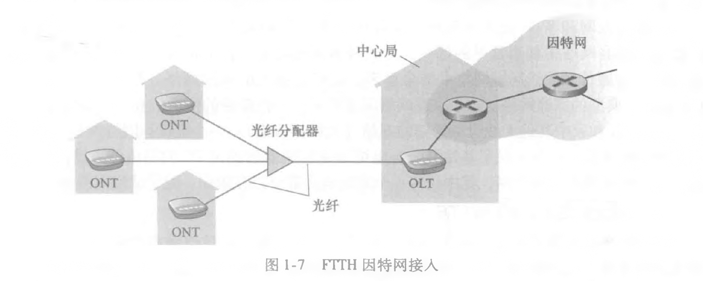
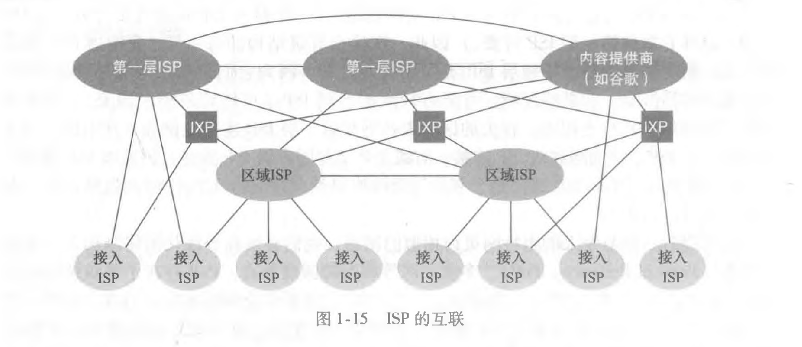

```json
item : 计算机网络
priority: 1
span : 3 months
plan : 1 chapter / week
```

**参考**:

- 中国大学 MOOC 哈尔滨工业大学 《计算机网络》
- 《计算机网络：自顶向下方法》
- 其他

**目录**:

# 1. 计算机网络和因特网

## 1.1. 什么是因特网

**time : 2021-04-27**

计算机网络或因特网是什么可以从**具体构成**和**服务**这 2 个角度给出答案。

### 1.1.1. 具体构成描述

**计算机网络或因特网是若干端系统通过一系列通信链路和分组交换机连接的通信网络。**

1. **计算机网络或因特网**
   不久前，因特网是一个连接着全世界范围内计算设备，如桌面 PC，Linux 工作站，以及服务器的网络。
   但如今，计算设备已经发生了巨大的变化，如智能手机，平板电脑，电视，游戏机，智能家用电器，汽车，这些非传统计算设备已经接入了因特网。所以**计算机网络**这个术语听起来已经过时了。

2. **端系统**
   与因特网相连的计算设备，称为**主机**或**端系统**。

3. **通信链路**
   端系统通过**通信链路**和**分组交换机**相连。通信链路分为不同的物理媒体，如同轴电缆，铜线，光纤，和无线电。
   不同类型的通信链路有不同的**传输速率**。传输速率以比特每秒(bps)度量。

4. **分组**
   当一个端系统向另外一个端系统发送数据时，发送端系统将数据分段，每一个数据段被加上了首部字节。这种数据段被称为**分组**。这些分组通过网络发送到目的端系统，在目的端系统被组装为初始数据。

5. **分组交换机**
   分组交换机从它的一条入通信链路接收到达的分组，并从它的一条出通信链路转发该分组。在当今的因特网中，有 2 种典型的分组交换机：**路由器**和**链路层交换机**。链路层交换机通常用于**接入网**，路由器通常用于**网络核心**。

6. **路径**
   从发送端系统到接收端系统，一个分组所经历的一系列通信链路和分组交换机称为该网络的**路径**。

7. **互联网服务提供商(ISP)**
   端系统通过**互联网服务提供商**(ISP)接入因特网。ISP 包括如本地电缆或电话公司那样的住宅区 ISP、公司 ISP、大学 ISP,在机场、旅馆、咖啡店和其他公共场所提供 WiFi 接入的 ISP,以及为智能手机和其他设备提供移动接入的蜂窝数据 ISP(基站)。每个 ISP 自身就是一个由多台分组交换机和多段通信链路组成的网络。各 ISP 为端系统提供了各种不同类型的网络接入，包括如线缆调制解调器或 DSL 那样的住宅宽带接入、高速局域网接入和移动无线接入。ISP 也为内容提供者提供因特网接入服务，将 Web 站点和视频服务器直接连入因特网。因特网就是将端系统彼此互联，因此为端系统提供接入的 ISP 也必须互联。较低层的 ISP 通过国家的、国际的较高层 ISP 互联起来。较高层 ISP 是由通过高速光纤链路互联的高速路由器组成的。无论是较高层还是较低层 ISP 网络，它们每个都是独立管理的，运行着 IP 协议（详情见后），遵从一定的命名和地址规则。
8. **协议**
   端系统和分组交换机以及其他因特网计算设备都运行着一系列**协议**。这些协议控制因特网中信息的发送和接收。**TCP(传输控制协议)**和**IP(网际协议)**是因特网协议中最重要的 2 个协议。IP 协议定义了路由器和端系统之间发送和接收的分组格式。因特网的主要协议统称为**TCP/IP**。

### 1.1.2. 服务描述

我们不但可以通过因特网构成的角度来描述因特网。还可以通过**为应用程序提供服务的基础设施**的角度来描述因特网。

**计算机网络或因特网是提供给分布式应用程序的基础设施。**

1. **分布式应用程序**
   如除了传统的 web 冲浪，电子邮件之外，因特网应用还包括智能手机和平板电脑应用程序，其中包括即时讯息、与实时道路流量信息的映射、来自云的音乐流、电影和电视流、在线社交网络、视频会议、多人游戏以及基于位置的推荐系统。因为这些应用程序涉及多个相互交换数据的端系统，因此称为**分布式应用程序**。

2. **套接字**
   与因特网相连的端系统提供了一个**套接字接口**。该接口规定了运行在一个端系统上的程序请求因特网基础设施向运行在另一个端系统上的特定目的地程序交付数据的方式。

### 1.1.3. 什么是协议

**网络协议**定义了在两个或多个**通信实体**之间交换**报文**的**格式**，**顺序**，以及**动作**。

## 1.2. 网络边缘

**time : 2021-04-28**

在上一节中，介绍了端系统。与因特网相连的计算设备称为端系统。端系统也称为主机。端系统一般分为 2 类。**客户**和**服务器**。客户通常是桌面 PC，移动 PC，和智能手机等，服务器通常是更为强大的设备，用于存储 web 页面，流视频，中继电子邮件等。今天大部分提供搜索结果，电子邮件，web 页面和流视频的服务器都属于大型**数据中心**。

这些端系统称为**网络边缘**。

### 1.2.1. 接入网

如图 1-4 所示，**接入网**是指将网络边缘连接到第一个**边缘路由器**的网络。边缘路由器是端系统到任何其他远程端系统的路径上的第一台路由器。


接入网通常分为以下几类：

1. **家庭接入**：DSL，电缆，光纤到户，拨号和卫星

- **DSL 接入**

住户通常从本地的电话公司处获得 DSL 因特网接入。这种情况下，ISP 就是用户的本地电话公司。

如图 1-5 所示，每个用户的 DSL 调制解调器使用现有的电话线（即双绞铜线，将在 1.2.2 节中讨论它）与位于电话公司的本地中心局（CO）中的数字用户线接入复用器（DSLAM）交换数据。家庭的 DSL 调制解 调器得到数字数据后将其转换高频音，以通过电话线传输给本地中心局；来自许多家庭的模拟信号在 DSLAM 处被转换回数字形式。


DSL 标准定义了多个传输速率，包括 12 Mbps 下行和 1.8Mbps 上行以及 55mbps 下行和 15Mbps 上行。

因为这些上行速率和下行速率是不同的，所以这种接入被称为是不对称的。

- **电缆接入**

住宅从提供有线电视的公司获得了电缆因特网接入。这种情况下，ISP 就是用户的有线电视公司。

如图 1-6 所示，光缆将电缆头端连接到地区枢纽，从这里使用传统的同轴电缆到达各家各户和公寓。每个地区枢纽通常支持 500 -5000 个家庭。因为在这个系统中应用了光纤和同轴电缆，所它经常被称为混合光纤同轴(HFC)系统。

电缆因特网接入需要特殊的调制解调器，这种调制解调器称为电缆调制解调器，如同 DSL 调制解调器，电缆调制解调器通常是一个外部设备，通过一个以太网端口连接到家庭 PC。在电缆头端，电缆调制解调器端接系统与 DSL 网络的 DSLAM 具有类似的功能，即将来自许多下行家庭中的电缆调制解调器发送的模拟信号转换回数字形式。


电缆调制解调器将 HFC 网络划分为下行和上行两个信道。如同 DSL,接入通常是不对称的，下行信道分配的传输速率通常比上行信道的高。DOCSIS 2.0 标准定义了高达 42.8Mbps 的下行速率和高达 30.7Mbps 的上行速率。

- **光纤到户**

光纤到户就是从本地中心局直接到家庭提供一个光纤路径。从本地中心局到家庭有几种有竞争的光纤布局方案。一种是直接光纤，从本地中心局到每个用户直接设置一根光纤。还有一种较为一般，从中心局出来一根光纤，到临近家庭的位置，才分给每个用户一个光纤。这种方案有两种类型：主动光纤网络(AOT)和被动光纤网络(PON)。

这里简要介绍 PON。

如图 1-7 所示，每个家庭具有一个光纤网络端接器(ONT),它由专门的光纤连接到邻近的分配器(splitter)，该分配器把一些家庭(通常少于 100 个)集结到一根共享的光纤，该光纤再连接到本地电话和公司的中心局中的光纤线路端接器(OLT)，该 OLT 提供了光信号和电信号之间的转换，经过本地电话公司路由器与因特网相连。在家庭中，用户将一台家庭路由器(通常是无线路由器)与 ONT 相连，并经过这台家庭路由器接入因特网。在 PON 体系结构中，所 有从 OLT 发送到分配器的分组在分配器(类似于一个电缆头端)处复制。



- **拨号和卫星**

还可采用另外两种接入网技术为家庭提供因特网接入。在无法提供 DSL、电缆和 FTTH 的地方（例如在某些乡村环境），能够使用卫星链路将住宅以超过 1Mbps 的速率与 因特网相连。StarBand 和 HughesNet 是两家这样的卫星接入提供商。使用传统电话线的拨号接入与 DSL 基于相同的模式：家庭的调制解调器经过电话线连接到 ISP 的调制解调器。与 DSL 和其他宽带接入网相比，拨号接入 56kbps 的慢速率是令人痛苦的。

2. **企业(和家庭)接入：以太网和 WiFi**

- **以太网**
  在公司和大学校园以及越来越多的家庭环境中，使用**局域网(LAN)**将端系统连接到边缘路由器。尽管有许多不同类型的局域网技术，但是**以太网**到目前为止是公司、大学和家庭网络中最为流行的接入技术。

如图 1-8 中所示，以太网用户使用双绞铜线与一台以太网交换机相连，第 6 章中将详细讨论该技术。 以太网交换机或这样相连的交换机网络，则再与更大的因特网相连。


使用以太网接入，用户通常以 100Mbps 或 1Gbps 速率接入以太网交换机，而服务器可能具有 1Gbps 甚至 10Gbps 的接入速率。

- **WiFi**

如今，越来越多的人通过移动 PC，智能手机，平板电脑和其他设备接入因特网。在无线 LAN 环境中，无线用户从/到一个接入点发送/接收分组，该接入点与企业网连接（很可能使用了有线以太网），企业网再与有线因特网相连。

一个无线 LAN 用户通常必须位于接入点的几十米范围内。基于 IEEE 802.11 技术的无线 LAN 接入,更通俗地称为 WiFi,目前几乎无所不在，如大学、商业办公室、咖啡厅、 机场、家庭，甚至在飞机上。

IEEE 802.11 今天提供了高达 100Mbps 的共享传输速率。

虽然以太网和 WiFi 接入网最初是设置在企业（公司或大学）环境中的，但它们近来已经成为家庭网络中相当常见的部件。今天许多家庭将宽带住宅接入（即电缆调制解调器 或 DSL）与廉价的无线局域网技术结合起来，以产生强大的家用网络。图 1-9 显示了典型的家庭网络。这个家庭网络组成如下：一台漫游的便携机和一台有线 PC； — 个与无线 PC 和家中其他无线设备通信的基站（无线接入点）；一个提供与因特网宽带接入的 电缆调制解调器；一台互联了基站及带有电缆调制解调器的固定 PC 的路由器。该网络允许 家庭成员经宽带接入因特网，其中任何一个家庭成员都可以在厨房、院子或卧室漫游上网。


3. **广域无线接入：3G 和 LTE**

iPhone 和安卓等设备越来越多地用来在移动中发信息、在社交网络中分享照片、观看视频和放音乐。这些设备应用了与蜂窝移动电话相同的无线基础设施，通过蜂窝网提供商运营的基站来发送和接收分组。与 WiFi 不同的是，一个用户仅需要位于基站的数万米(而不是几十米)范围内。

电信公司已经在所谓第三代(3G)无线技术中进行了大量投资，3G 为分组交换广域无线因特网接入提供了超过 1Mbps 的速率。甚至更高速率的广域接入技术即第四代(4G)广域无线网络也已经被部署了。LTE 来源于 3G 技术，它能够取得超过 10Mbps 的速率。据报道，几十 Mbps 的 LTE 下行速率已经在商业部署中得到应用。我们将在第 7 章讨论无线网络和移动性，以及 WiFi、3G 和 LTE 等技术的基本原则。

**注意：如今 2021 年 4G 技术已经得到了全面的普及，5G 技术已经可以商用。**

### 1.2.2. 物理媒体

在前面的内容中，我们概述了因特网中某些最为重要的网络接入技术。当我们描述这些技术时，我们也指出了所使用的物理媒体。例如，我们说过电缆接入网中使用了**光纤**和**同轴电缆**相结合的技术。我们说过 DSL 和以太网使用了**双绞铜线**。我们也说过移动接入网使用了**无线电**。在这一节中，我们简要概述一下这些和其他常在因特网中使用的传输媒体。

物理媒体分为：**导引型**和**非导引型**。

导引型媒体中，信号沿着固定的路线传播。如光纤，通州电缆，双绞铜线。

非导引型媒体中，信号在空气或太空中传播。如无线局域网，无线广域网，以及卫星。

1. **双绞铜线**

最便宜并且最常用的导引型传输媒体是双绞铜线。一百多年来，它一直用于电话网。 事实上，从电话机到本地电话交换机的连线超过 99% 使用的是双绞铜线。我们多数人在自己家中和工作环境中已经看到过双绞线。双绞线由两根绝缘的铜线组成，每根大约 lmm 粗，以规则的螺旋状排列着。这两根线被绞合起来，以减少邻近类似的双绞线的电气干扰。通常许多双绞线捆扎在一起形成一根电缆，并在这些双绞线外面覆盖上保护性防护层。一对电线构成了一个通信链路。**无屏蔽双绞线**(UTP)常用在建筑物内的计算机网络中，即用于局域网(LAN)中。目前局域网中的双绞线的数据速率从 10Mbps 到 10Gbpso 所能达到的数据传输速率取决于线的粗细以及传输方和接收方之间的距离。

2. **同轴电缆**

与双绞线类似，同轴电缆由两个铜导体组成，但是这两个导体是同心的而不是并行的。借助于这种结构及特殊的绝缘体和保护层，同轴电缆能够达到较高的数据传输速率。同轴电缆在电缆电视系统中相当普遍。我们前面已经看到，电缆电视系统最近与电缆调制解调器结合起来，为住宅用户提供数十 Mbp 速率的因特网接入。在电缆电视和 电缆因特网接入中，发送设备将数字信号调制到某个特定的频段，产生的模拟信号从发送设备传送到一个或多个接收方。同轴电缆能被用作导引型共享媒体。特别是，许多端系统能够直接与该电缆相连，每个端系统都能接收由其他端系统发送的容。

3. **光纤**

光纤是一种细而柔软的、能够导引光脉冲的媒体，每个脉冲表示一个比特。一根光 纤能够支持极高的比特速率，高达数十甚至数百 Gbpso 它们不受电磁干扰，长达 100km 的光缆信号衰减极低，并且很难窃听。这些特征使得光纤成为长途导引型传输媒体，特 别是跨海链路。在美国和别的地方，许多长途电话网络现在全面使用光纤。光纤也广泛 用于因特网的主干。然而，高成本的光设备，如发射器、接收器和交换机，阻碍光纤在短途传输中的应用，如在 LAN 或家庭接入网中就不使用它们。

4. **陆地无线电信道**

无线电信道承载电磁频谱中的信号。它不需要安装物理线路，并具有穿透墙壁、提供与移动用户的连接以及长距离承载信号的能力，因而成为一种有吸引力的媒体。无线电信道的特性极大地依赖于传播环境和信号传输的距离。环境上的考虑取决于路径损耗和遮挡 衰落（即当信号跨距离传播和绕过/通过阻碍物体时信号强度降低）、多径衰落（由于干扰对象的信号反射）以及干扰（由于其他传输或电磁信号）。

陆地无线电信道能够大致划分为三类：一类运行在很短距离（如 1 米或 2 米）；另一类运行在局域，通常跨越数十到几百米；第三类运行在广域，跨越数万米。个人设备如无线头戴式耳机、键盘和医疗设备跨短距离运行；在 1・2. 1 节中描述的无线 LAN 技术使用了局域无线电信道；蜂窝接入技术使用了广域无线电信道。我们将在第 7 章中详细讨论无线电信道。

5. **卫星无线电信道**

一颗通信卫星连接地球上的两个或多个微波发射器/接收器，它们被称为地面站。该卫星在一个频段上接收传输，使用一个转发器（下面讨论）再生信号，并在另一个频率上发射 信号。通信中常使用两类卫星：同步卫星和近地轨道（LEO）卫星。

同步卫星永久地停留在地球上方的相同点上。这种静止性是通过将卫星置于地球表面上方 36 000km 的轨道上而取得的。从地面站到卫星再回到地面站的巨大距离引入了可观的 280ms 信号传播时延。不过，能以数百 Mbps 速率运行的卫星链路通常用于那些无法使用 DSL 或电缆因特网接入的区域。

近地轨道卫星放置得非常靠近地球，并且不是永久地停留在地球上方的一个点。它们围绕地球旋转，就像月亮围绕地球旋转那样，并且彼此之间可进行通信，也可以与地面站通信。为了提供对一个区域的连续覆盖，需要在轨道上放置许多卫星。当前有许多低轨道通信系统在研制中。LEO 卫星技术未来也许能够用于因特网接入。

**注意：如今 2021 年，马斯克主导的星链计划正在部署中。**

## 1.3. 网络核心

**time : 2021-04-29**

**网络核心**，即由互联因特网端系统的分组交换机和链路构成的网络。

### 1.3.1. 分组交换

在分布式网络应用中，端系统之间交换报文。传输报文时，发送端将报文分隔为分组。每个分组通过通信链路和分组交换机到达接收端系统。分组交换机包含两类：路由器和链路层交换机。

1. **存储转发传输**

存储转发传输是指一个分组交换机在从输入链路接收到一个分组时，首先做的是接收该分组，然后再转发给出链路。这样造成的时延称为**存储转发时延**。

2. **排队时延和分组丢失**

每台分组交换机具有一个**输出缓存**。与一个分组交换机相连的出链路有多条。如果到达的分组需要传输到某条链路，却发现该链路正忙于传输其他分组。那么该分组必须在输出缓存中等待。因此除了存储转发时延外分组还要承受**排队时延**。如果输出缓存完全充满，那么一个到达的分组就会**丢失**。

3. **转发表和路由转发协议**

前面说过一个分组需要分组交换机转发到一条出通信链路上，那么分组交换机是怎么决定转发到哪一条出链路呢？

在因特网中，每一个端系统都有一个称为 IP 地址的地址。当源主机向目的端发送一个分组时，源在该分组的首部包含了目的端的 IP 地址。该地址具有一个等级结构。分组交换机会检查目的端 IP 地址的一部分，并向相邻的一台分组交换机转发该分组。具体来说，每台分组交换机会有一个转发表，用于将 IP 地址映射为出链路。

那么转发表时怎么设置的呢?其实这是由**路由转发协议**生成的。

### 1.3.2. 电路交换

通过通信链路和交换机转发数据的方式有 2 种：**电路交换**和**分组交换**。前几节已经讨论过分组交换，现在讨论一下电路交换。

在电路交换网络中，在端系统会话期间，预留了端系统间沿路径通信所需要的资源，如：缓存和链路传输速度。在分组交换网络中，这些资源是不预留的。会话的报文按需使用这些资源，其后果是不得不等待接入通信链路。

传统的电话网络是电路交换网络的一个例子。在发送方能够发送信息之前，该网络必须在发送方和接收方之间建立一条连接。这是一个名副其实的连接，因为此时沿着发送方和接收方之间 路径上的交换机都将为该连接维护连接状态。用电话的术语来说，该连接被称为一条电路。当网络创建这种电路时，它也在连接期间在该网络链路上预留了恒定的传输速率（表示为每条链路传输容量的一部分）。既然已经为该发送方-接收方连接预留了带宽,则发送方能够以确保的恒定速率向接收方传送数据。

图 1-13 实现了一个电路交换网络。在这个网络中，用 4 条链路互联了 4 台电路交换机。这些链路中每条都有 4 条电路，因此每条链路支持 4 个并行的连接。每台主机都与一台交换机直接相连。当两台主机要通信时，该网络在两台主机之间创建一条专用的**端到端连接**。

因此，主机 A 为了向主机 B 发送报文，网络必须在两方链路的每条上先预留一条链路。在这个例子中，这条专用的端到端连接使用用第一条链路中的第二条电路和第二条链路中的第四条电路。


与此相反，考虑一台主机要经过分组交换网络（如因特网）向另一台主机发送分组所发生的情况。与使用电路交换相同，该分组经过一系列通信链路传输。但与电路交换不同的是，该分组被发送进网络，而不预留任何链路资源之类的东西。如果因为此时其他分组也需要经该链路进行传输而使链路之一出现拥塞，则该分组将不得不在传输链路发送侧的缓存中等待而产生时延。因特网尽最大努力以实时方式交付分组，但它不做任何保证。

1. **电路交换网络中的复用**

电路交换网络中的复用有 2 类：**频分复用**或**时分复用**。

2. **分组交换和电路交换的对比**

分组交换的性能能够优于电路交换的性能。电路交换不考虑需求，而预先分配了传输链路的使用，这使得已分配而并不需要的链路时间未被利用。另一
方面，分组交换按需分配链路使用。链路传输能力将在所有需要在链路上传输分组的用户之间逐分组地被共享。

虽然分组交换和电路交换在今天的电信网络中都是普遍采用的方式，但趋势无疑是朝着分组交换方向发展。

### 1.3.3. 网络的网络


今天的因特网是一个网络的网络，它的结构非常复杂，由10多个第一层ISP和数万个较低层的ISP组成。较低层ISP与较高层相连，较高层之间彼此互联。



## 1.4. 网络的性能

### 1.4.1. 时延

### 1.4.2. 丢包

### 1.4.3. 吞吐量

## 1.5. 协议分层模型

### 1.5.1. 体系结构

### 1.5.2. 封装

## 1.6. 计算机网络和因特网的历史

## 1.7. 小结
